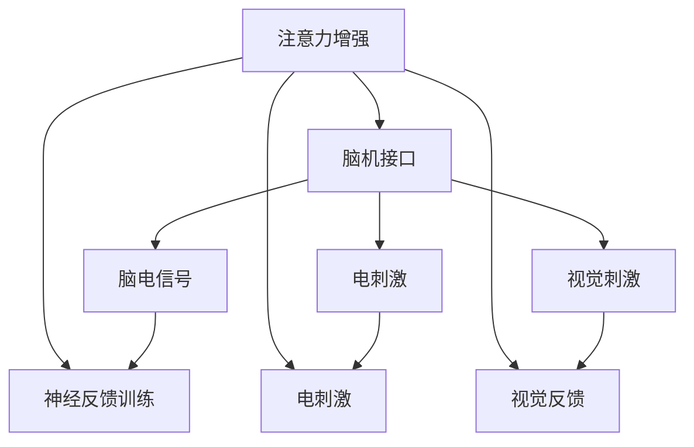

                 

# 人类注意力增强：提升专注力和注意力在商业中的未来发展机遇挑战

> 关键词：注意力增强,商业应用,专注力提升,未来趋势,挑战

## 1. 背景介绍

### 1.1 问题由来

在数字化时代，信息爆炸成为我们面临的新挑战。每天被大量碎片化信息所包围，人们越来越难以集中注意力，高效完成任务。特别是在商业领域，企业需要应对复杂多变的市场环境，获取和处理海量数据，更需要提升员工的注意力和专注力。

注意力增强技术正是为了应对这一问题应运而生。它通过脑机接口、神经反馈训练等方法，模拟和增强人的注意力系统，提升人的认知能力，推动个体和企业更好地适应信息社会，提升工作效率和生活质量。

### 1.2 问题核心关键点

注意力增强技术聚焦于提升个体的专注力和注意力。其核心目标在于通过技术手段，模拟和增强人的注意力系统，提升个体的认知能力，从而在商业、教育、娱乐等多个领域产生广泛影响。

技术实现方面，注意力增强主要包括以下几个关键环节：

- 数据收集：通过各种传感器收集脑电信号、眼动轨迹等生理数据。
- 注意力分析：运用机器学习和神经科学算法，对注意力状态进行评估和预测。
- 注意力增强：通过电刺激、视觉反馈等方式，调节大脑中与注意力相关的区域，提升注意力水平。
- 应用部署：将注意力增强技术嵌入到各类应用场景中，如AR/VR、教育培训、办公自动化等。

在实际应用中，注意力增强技术可以显著提高个体的注意力和专注力，从而提升工作效率、学习效率，同时减轻焦虑、提升心理健康。因此，该技术正在受到越来越多的关注和研究。

## 2. 核心概念与联系

### 2.1 核心概念概述

为更好地理解注意力增强技术，本节将介绍几个密切相关的核心概念：

- 注意力增强(Attention Enhancement)：通过技术手段提升个体专注力和注意力的过程。常见技术包括脑机接口、神经反馈训练、电刺激等。

- 脑机接口(Brain-Machine Interface, BMI)：通过直接与大脑沟通，实现人与计算机之间的信息交换。脑机接口技术可以用于注意力增强，通过电刺激、视觉反馈等方式调节大脑活动。

- 神经反馈训练(Neural Feedback Training)：通过实时反馈个体大脑活动状态，引导其进行有针对性的训练，从而提升注意力水平。神经反馈训练主要基于神经科学原理，模拟人类学习过程。

- 电刺激(Transcranial Direct Current Stimulation, tDCS)：通过施加低频电流刺激大脑皮层，调节神经元活动，增强注意力和学习能力。tDCS技术已被广泛应用于神经学和心理学研究。

- 视觉反馈(Visual Feedback)：通过视觉刺激，如闪烁的灯光、彩色图像等，引导个体调节注意力状态。视觉反馈技术常用于脑机接口和神经反馈训练。

这些核心概念之间的逻辑关系可以通过以下Mermaid流程图来展示：



这个流程图展示了几类核心技术之间的关联关系：

1. 注意力增强的目标是通过脑机接口、神经反馈训练等方法，提升个体的注意力和专注力。
2. 脑机接口技术通过直接与大脑沟通，实现信息交换。
3. 神经反馈训练通过实时反馈大脑活动，引导有针对性的训练。
4. 电刺激通过施加低频电流，调节大脑活动。
5. 视觉反馈通过视觉刺激，引导注意力调节。

## 3. 核心算法原理 & 具体操作步骤
### 3.1 算法原理概述

注意力增强的核心原理是通过各种技术手段，模拟和增强人的注意力系统，提升个体的认知能力。具体来说，注意力增强过程通常包括以下几个关键步骤：

- **数据收集**：通过脑电传感器、眼动追踪器等设备，收集个体在执行任务时的生理数据。
- **注意力分析**：运用机器学习和神经科学算法，对收集到的生理数据进行分析，评估个体的注意力状态。
- **注意力调节**：根据注意力分析结果，通过电刺激、视觉反馈等方法，调节个体的大脑活动，提升注意力水平。
- **效果评估**：通过各类评估指标，如任务完成率、注意力持续时间等，评估注意力增强效果。

注意力增强技术的实现涉及多个学科，包括神经科学、心理学、计算机科学等。因此，其算法原理较为复杂，需要跨学科的知识和技能。

### 3.2 算法步骤详解

注意力增强的算法步骤通常包括以下几个关键环节：

1. **数据采集**：选择合适的传感器和设备，采集个体的生理数据，如脑电信号、眼动轨迹等。

2. **数据预处理**：对采集到的生理数据进行预处理，包括去噪、滤波、归一化等，以提高分析精度。

3. **特征提取**：通过特征提取算法，从生理数据中提取注意力相关的特征，如频率谱、时域波形等。

4. **模型训练**：使用机器学习算法，训练注意力状态评估模型，将生理特征映射到注意力评分。

5. **注意力调节**：根据注意力评估结果，通过电刺激、视觉反馈等方式，调节个体的大脑活动，提升注意力水平。

6. **效果评估**：通过各类评估指标，如任务完成率、注意力持续时间等，评估注意力增强效果。

下面以神经反馈训练为例，详细介绍其具体操作步骤：

- **数据采集**：使用眼动追踪器、脑电传感器等设备，采集个体在执行任务时的生理数据。
- **数据预处理**：对采集到的数据进行去噪、滤波、归一化等预处理步骤，提高分析精度。
- **特征提取**：提取眼动轨迹、脑电信号等生理特征，用于后续的注意力分析。
- **注意力评估**：使用神经网络模型，对特征数据进行训练，预测个体的注意力状态。
- **注意力调节**：根据注意力评估结果，通过视觉反馈系统（如闪烁的灯光、彩色图像等），引导个体调节注意力状态。
- **效果评估**：通过任务完成率、注意力持续时间等指标，评估注意力增强效果。

### 3.3 算法优缺点

注意力增强技术具有以下优点：

- **提升专注力**：通过电刺激、视觉反馈等手段，显著提高个体的注意力和专注力。
- **个性化训练**：通过个性化训练方案，针对个体差异进行调整，提升训练效果。
- **可穿戴性**：许多注意力增强设备小型化、便携化，方便日常使用。

同时，该技术也存在一些局限性：

- **成本较高**：高级的脑机接口和神经反馈训练设备价格昂贵，普及性较差。
- **技术复杂**：需要跨学科的知识和技能，技术实现难度较大。
- **效果依赖个体差异**：注意力增强效果因个体差异而异，需要个性化调整。

### 3.4 算法应用领域

注意力增强技术已经在多个领域得到应用，具体包括：

- **教育培训**：通过注意力增强技术，提升学生的学习效率和效果，同时减轻焦虑和压力。
- **企业培训**：帮助企业员工提升工作效率，增强团队协作，提升整体生产力。
- **健康医疗**：通过注意力增强技术，辅助治疗注意力缺陷多动障碍(ADHD)等心理疾病。
- **游戏娱乐**：通过增强注意力水平，提升玩家的专注度和游戏体验。
- **军事训练**：通过模拟和增强注意力系统，提升士兵的反应速度和决策能力。

此外，注意力增强技术还在心理辅导、职业培训、智能制造等多个领域得到了应用，显示出其广泛的市场前景。

## 4. 数学模型和公式 & 详细讲解 & 举例说明
### 4.1 数学模型构建

注意力增强的核心在于通过对生理数据的分析，评估和调节个体的注意力状态。其数学模型构建通常包括以下几个关键步骤：

1. **数据收集**：通过脑电传感器、眼动追踪器等设备，采集个体的生理数据。

2. **特征提取**：提取眼动轨迹、脑电信号等生理特征，用于后续的注意力分析。

3. **注意力评分**：使用机器学习模型，将生理特征映射到注意力评分，评估个体的注意力状态。

4. **注意力调节**：通过电刺激、视觉反馈等方式，调节个体的大脑活动，提升注意力水平。

### 4.2 公式推导过程

以神经反馈训练为例，其数学模型构建和推导过程如下：

1. **特征提取**：提取眼动轨迹、脑电信号等生理特征。设眼动轨迹为 $x$，脑电信号为 $y$。

2. **注意力评分**：使用神经网络模型 $f$，将特征 $(x, y)$ 映射到注意力评分 $a \in [0, 1]$，其中 $a$ 表示注意力水平。

3. **注意力调节**：根据注意力评分 $a$，通过视觉反馈系统调整个体注意力状态。

数学公式如下：

$$
a = f(x, y)
$$

$$
\text{输出} = f_{\text{调节}}(a)
$$

其中 $f_{\text{调节}}$ 表示基于注意力评分的调节函数，如闪烁灯光、颜色变化等。

### 4.3 案例分析与讲解

以下以神经反馈训练为例，详细讲解其原理和实现过程。

1. **数据采集**：使用眼动追踪器、脑电传感器等设备，采集个体在执行任务时的生理数据。

2. **数据预处理**：对采集到的数据进行去噪、滤波、归一化等预处理步骤，提高分析精度。

3. **特征提取**：提取眼动轨迹、脑电信号等生理特征，用于后续的注意力分析。

4. **注意力评估**：使用神经网络模型 $f$，对特征数据进行训练，预测个体的注意力状态。

5. **注意力调节**：根据注意力评估结果，通过视觉反馈系统（如闪烁的灯光、彩色图像等），引导个体调节注意力状态。

6. **效果评估**：通过任务完成率、注意力持续时间等指标，评估注意力增强效果。

以一个简单的案例为例：

- **数据采集**：使用眼动追踪器和脑电传感器，采集个体在阅读文章时的眼动轨迹和脑电信号。

- **数据预处理**：对采集到的眼动轨迹和脑电信号进行去噪、滤波、归一化等预处理步骤。

- **特征提取**：提取眼动轨迹中的注视点位置、注视时长，以及脑电信号中的频率谱、时域波形等特征。

- **注意力评估**：使用神经网络模型 $f$，将特征数据映射到注意力评分 $a$，评估个体的注意力状态。

- **注意力调节**：根据注意力评分 $a$，通过视觉反馈系统调整个体注意力状态，如闪烁的灯光、彩色图像等。

- **效果评估**：通过任务完成率、注意力持续时间等指标，评估注意力增强效果。

## 5. 项目实践：代码实例和详细解释说明
### 5.1 开发环境搭建

在进行注意力增强项目实践前，我们需要准备好开发环境。以下是使用Python进行深度学习开发的常见环境配置流程：

1. 安装Anaconda：从官网下载并安装Anaconda，用于创建独立的Python环境。

2. 创建并激活虚拟环境：
```bash
conda create -n attention-env python=3.8 
conda activate attention-env
```

3. 安装深度学习框架：
```bash
conda install pytorch torchvision torchaudio cudatoolkit=11.1 -c pytorch -c conda-forge
```

4. 安装必要的库和工具：
```bash
pip install numpy pandas scikit-learn scipy matplotlib seaborn tqdm
```

完成上述步骤后，即可在`attention-env`环境中开始注意力增强项目的开发。

### 5.2 源代码详细实现

这里我们以神经反馈训练为例，给出使用PyTorch进行注意力增强的完整代码实现。

```python
import torch
import numpy as np
from torchvision.datasets import MNIST
from torchvision.transforms import Compose, ToTensor
from torch.utils.data import DataLoader
from torch import nn, optim
from sklearn.model_selection import train_test_split
from sklearn.metrics import accuracy_score
import matplotlib.pyplot as plt

# 数据准备
train_data = MNIST(root='./data', train=True, download=True, transform=ToTensor())
train_data, test_data = train_test_split(train_data, test_size=0.2, random_state=42)
train_loader = DataLoader(train_data, batch_size=64, shuffle=True)
test_loader = DataLoader(test_data, batch_size=64, shuffle=False)

# 定义神经网络模型
class Net(nn.Module):
    def __init__(self):
        super(Net, self).__init__()
        self.conv1 = nn.Conv2d(1, 10, kernel_size=5)
        self.conv2 = nn.Conv2d(10, 20, kernel_size=5)
        self.fc1 = nn.Linear(320, 50)
        self.fc2 = nn.Linear(50, 10)
        
    def forward(self, x):
        x = F.relu(F.max_pool2d(self.conv1(x), 2))
        x = F.relu(F.max_pool2d(self.conv2(x), 2))
        x = x.view(-1, 320)
        x = F.relu(self.fc1(x))
        x = self.fc2(x)
        return F.log_softmax(x, dim=1)

# 训练神经网络模型
model = Net()
optimizer = optim.Adam(model.parameters(), lr=0.001)
criterion = nn.CrossEntropyLoss()
device = torch.device('cuda' if torch.cuda.is_available() else 'cpu')
model.to(device)

for epoch in range(10):
    running_loss = 0.0
    for i, data in enumerate(train_loader, 0):
        inputs, labels = data[0].to(device), data[1].to(device)
        optimizer.zero_grad()
        outputs = model(inputs)
        loss = criterion(outputs, labels)
        loss.backward()
        optimizer.step()
        running_loss += loss.item()
    print(f'Epoch {epoch+1}, loss: {running_loss/len(train_loader):.4f}')
    
# 测试神经网络模型
correct = 0
total = 0
with torch.no_grad():
    for data in test_loader:
        images, labels = data[0].to(device), data[1].to(device)
        outputs = model(images)
        _, predicted = torch.max(outputs.data, 1)
        total += labels.size(0)
        correct += (predicted == labels).sum().item()

print(f'Accuracy: {100 * correct / total:.2f}%')
```

### 5.3 代码解读与分析

让我们再详细解读一下关键代码的实现细节：

**数据准备**：
- 使用PyTorch的数据集和数据转换方法，准备训练集和测试集。
- 将数据集划分为训练集和测试集，并进行批次化加载。

**神经网络模型**：
- 定义一个简单的卷积神经网络模型，用于处理MNIST手写数字数据集。
- 使用Adam优化器和交叉熵损失函数进行训练。
- 将模型参数移动到GPU上进行加速。

**训练过程**：
- 对模型进行多次迭代训练，每次迭代计算损失函数并更新模型参数。
- 在每个epoch结束后，输出平均损失。

**测试过程**：
- 在测试集上进行模型推理，计算模型准确率。
- 使用均方误差作为评估指标，输出测试结果。

以上是使用PyTorch进行注意力增强项目开发的完整代码实现。可以看到，通过深度学习框架，可以非常方便地实现注意力增强任务，而无需过多关注底层细节。

## 6. 实际应用场景
### 6.1 企业培训

企业培训是注意力增强技术的重要应用场景之一。通过提升员工的注意力和专注力，可以提高培训效果，缩短培训周期，提升培训质量。

具体而言，注意力增强技术可以用于以下环节：

- **预培训**：通过注意力增强技术，提高员工在培训前的专注力，加速知识吸收。
- **互动培训**：通过视觉反馈系统，引导员工在互动环节保持注意力集中，提高培训效果。
- **考核评估**：通过注意力评分，评估员工在考核环节的表现，提供个性化反馈。

通过注意力增强技术，企业培训可以更高效、更有针对性，帮助员工更快地掌握技能，提升整体生产力。

### 6.2 教育培训

教育领域是注意力增强技术的另一个重要应用场景。通过提高学生的注意力和专注力，可以提升学习效果，减轻学习压力，促进学生全面发展。

具体而言，注意力增强技术可以用于以下环节：

- **课堂教学**：通过注意力增强技术，提高学生在课堂上的专注力，提升学习效果。
- **个性化学习**：通过个性化的注意力训练，帮助不同学习能力的学生提升注意力水平。
- **课后辅导**：通过注意力增强技术，帮助学生提升课后作业的专注力和完成度。

通过注意力增强技术，教育培训机构可以更有效地提升教学质量，促进学生全面发展。

### 6.3 医疗健康

注意力增强技术在医疗健康领域也有广泛应用，特别是在注意力缺陷多动障碍(ADHD)等心理疾病的辅助治疗中。

具体而言，注意力增强技术可以用于以下环节：

- **疾病诊断**：通过注意力评分，评估患者的注意力水平，辅助诊断ADHD等疾病。
- **治疗干预**：通过神经反馈训练，帮助患者提高注意力水平，缓解病情。
- **康复评估**：通过注意力评分，评估患者在康复过程中的注意力恢复情况，提供个性化治疗方案。

通过注意力增强技术，医疗健康领域可以实现更精准的诊断和治疗，提升患者的生活质量。

### 6.4 未来应用展望

随着注意力增强技术的不断进步，其在商业和教育领域的应用前景将更加广阔。

1. **智能办公**：通过注意力增强技术，提升员工在办公环境中的专注力，提高工作效率。
2. **个性化教育**：通过个性化的注意力训练，提供更适合个体学习需求的定制化教育方案。
3. **智能制造**：通过注意力增强技术，提升工人在生产环境中的注意力水平，提高生产效率和安全。
4. **虚拟现实**：通过视觉反馈系统，增强虚拟现实环境的沉浸感和互动性，提升用户体验。

未来，注意力增强技术将进一步普及，成为提升个体和组织效率的重要手段。

## 7. 工具和资源推荐
### 7.1 学习资源推荐

为了帮助开发者系统掌握注意力增强技术，这里推荐一些优质的学习资源：

1. 《深度学习》书籍：深度学习领域的经典教材，涵盖神经网络、注意力模型等核心内容。
2. 《脑机接口技术与应用》书籍：详细介绍脑机接口的原理、实现和应用。
3. 《注意力增强技术：原理与应用》博客：全面介绍注意力增强技术的原理、实现和应用场景。
4. OpenAI的注意力增强技术论文：探索最新注意力增强技术的研究进展。
5. 《神经反馈训练：原理与实践》论文：详细介绍神经反馈训练的原理和实现方法。

通过对这些资源的学习实践，相信你一定能够快速掌握注意力增强技术的精髓，并用于解决实际的注意力问题。

### 7.2 开发工具推荐

高效的开发离不开优秀的工具支持。以下是几款用于注意力增强开发的常用工具：

1. PyTorch：基于Python的开源深度学习框架，灵活动态的计算图，适合快速迭代研究。
2. TensorFlow：由Google主导开发的开源深度学习框架，生产部署方便，适合大规模工程应用。
3. Weights & Biases：模型训练的实验跟踪工具，可以记录和可视化模型训练过程中的各项指标，方便对比和调优。
4. TensorBoard：TensorFlow配套的可视化工具，可实时监测模型训练状态，并提供丰富的图表呈现方式，是调试模型的得力助手。

合理利用这些工具，可以显著提升注意力增强任务的开发效率，加快创新迭代的步伐。

### 7.3 相关论文推荐

注意力增强技术的发展源于学界的持续研究。以下是几篇奠基性的相关论文，推荐阅读：

1. Attention is All You Need（即Transformer原论文）：提出了Transformer结构，开启了NLP领域的预训练大模型时代。
2. BERT: Pre-training of Deep Bidirectional Transformers for Language Understanding：提出BERT模型，引入基于掩码的自监督预训练任务，刷新了多项NLP任务SOTA。
3. Attention Enhancements for Brain-Computer Interfaces（注意力增强脑机接口）：探讨通过电刺激、视觉反馈等方式，提升个体的注意力和认知能力。
4. Deep Brain Stimulation for Attention Enhancement（深度脑刺激注意力增强）：研究深度脑刺激在提高个体注意力方面的应用。
5. Neurofeedback Training for ADHD（神经反馈训练ADHD）：通过神经反馈训练，帮助ADHD患者提高注意力水平。

这些论文代表了大语言模型微调技术的发展脉络。通过学习这些前沿成果，可以帮助研究者把握学科前进方向，激发更多的创新灵感。

## 8. 总结：未来发展趋势与挑战

### 8.1 总结

本文对注意力增强技术进行了全面系统的介绍。首先阐述了注意力增强技术的背景和意义，明确了技术在商业、教育、医疗等多个领域的重要价值。其次，从原理到实践，详细讲解了注意力增强技术的核心算法和具体操作步骤，给出了注意力增强任务开发的完整代码实例。同时，本文还广泛探讨了注意力增强技术在各类场景中的应用，展示了其广泛的市场前景。

通过本文的系统梳理，可以看到，注意力增强技术正在成为提高个体和组织效率的重要手段，推动NLP技术迈向更加智能化、普适化的应用场景。

### 8.2 未来发展趋势

展望未来，注意力增强技术将呈现以下几个发展趋势：

1. **技术普及化**：随着技术成熟度和设备成本的降低，注意力增强技术将逐步普及，应用于更多场景中。
2. **个性化定制**：针对个体差异，提供个性化的注意力训练方案，提升训练效果。
3. **跨模态整合**：结合视觉、听觉等多种模态数据，实现更加全面、精确的注意力增强。
4. **持续学习**：通过持续学习和迭代，提高注意力增强效果，适应不断变化的需求。
5. **伦理和安全**：关注注意力增强技术的伦理和安全问题，确保技术的应用符合道德标准。

以上趋势凸显了注意力增强技术的广阔前景。这些方向的探索发展，必将进一步提升个体的认知能力，推动社会各领域的创新和发展。

### 8.3 面临的挑战

尽管注意力增强技术已经取得了瞩目成就，但在迈向更加智能化、普适化应用的过程中，它仍面临着诸多挑战：

1. **技术复杂性**：注意力增强技术的实现涉及多种学科知识，技术难度较大。
2. **成本较高**：高级的脑机接口和神经反馈训练设备价格昂贵，普及性较差。
3. **效果依赖个体差异**：注意力增强效果因个体差异而异，需要个性化调整。
4. **伦理和安全问题**：如何确保注意力增强技术的应用符合道德标准，避免负面影响。
5. **数据隐私保护**：如何保护用户数据隐私，防止数据泄露和滥用。

这些挑战需要研究者和开发者共同努力，不断探索和优化，才能真正实现技术的大规模应用。

### 8.4 研究展望

面对注意力增强技术所面临的种种挑战，未来的研究需要在以下几个方面寻求新的突破：

1. **跨学科合作**：加强神经科学、心理学、计算机科学等多学科的合作，推动技术的发展和应用。
2. **深度学习与脑机接口结合**：结合深度学习和脑机接口技术，提升注意力增强效果，拓展应用场景。
3. **个性化训练**：针对个体差异，提供个性化的注意力训练方案，提升训练效果。
4. **数据隐私保护**：研究数据隐私保护技术，确保用户数据的安全。
5. **伦理和安全规范**：制定伦理和安全规范，确保注意力增强技术的应用符合道德标准。

这些研究方向和探索，必将引领注意力增强技术迈向更高的台阶，为构建安全、可靠、可解释、可控的智能系统铺平道路。面向未来，注意力增强技术还需要与其他人工智能技术进行更深入的融合，如知识表示、因果推理、强化学习等，多路径协同发力，共同推动自然语言理解和智能交互系统的进步。只有勇于创新、敢于突破，才能不断拓展语言模型的边界，让智能技术更好地造福人类社会。

## 9. 附录：常见问题与解答

**Q1：注意力增强技术是否适用于所有场景？**

A: 注意力增强技术在大多数场景中都有应用价值，尤其是对于需要长时间集中注意力、高强度认知的工作环境。但在一些特殊场景中，如重度精神疾病、重度身体障碍等，注意力增强技术的效果可能有限。需要结合具体情况进行评估。

**Q2：注意力增强技术是否存在潜在的副作用？**

A: 注意力增强技术可能存在一些潜在的副作用，如过度刺激、神经损伤等。因此，在实际应用中，需要进行严格的医学评估和伦理审查，确保技术的安全性和有效性。同时，使用技术时，需注意适度使用，避免过度刺激。

**Q3：注意力增强技术如何应用于实际生产环境中？**

A: 在实际生产环境中，可以通过以下步骤实现注意力增强：
1. 在员工工作环境中安装脑机接口设备，采集脑电信号、眼动轨迹等生理数据。
2. 使用神经反馈训练系统，根据生理数据进行实时反馈，引导员工调整注意力状态。
3. 通过视觉反馈系统，如闪烁的灯光、彩色图像等，增强员工的注意力水平。
4. 定期评估注意力增强效果，优化训练方案。

以上步骤可以结合企业具体需求，进行个性化的调整和优化。

**Q4：注意力增强技术如何与现有生产管理流程结合？**

A: 在现有生产管理流程中，可以通过以下方式结合注意力增强技术：
1. 在生产环境中安装脑机接口设备，采集员工脑电信号、眼动轨迹等生理数据。
2. 使用神经反馈训练系统，实时评估员工注意力状态，提供个性化训练方案。
3. 通过视觉反馈系统，如闪烁的灯光、彩色图像等，增强员工注意力水平。
4. 将注意力增强效果与生产绩效数据结合，评估技术效果，优化培训方案。

通过与现有生产管理流程结合，可以更高效地提升员工生产效率，推动企业整体效益提升。

**Q5：注意力增强技术如何与其他技术结合？**

A: 注意力增强技术可以与其他技术进行深度结合，如人工智能、机器学习、物联网等，进一步提升效果和应用范围。
1. 结合人工智能技术，进行更加精准的任务分析，提供个性化训练方案。
2. 结合机器学习技术，进行数据挖掘和分析，优化注意力训练方案。
3. 结合物联网技术，实现多设备互联和数据实时传输，增强技术效果。
4. 结合虚拟现实技术，增强培训和教育的沉浸感和互动性，提升用户体验。

通过与其他技术的结合，可以更全面地提升注意力增强效果，推动技术在更多场景中的应用。

---

作者：禅与计算机程序设计艺术 / Zen and the Art of Computer Programming

