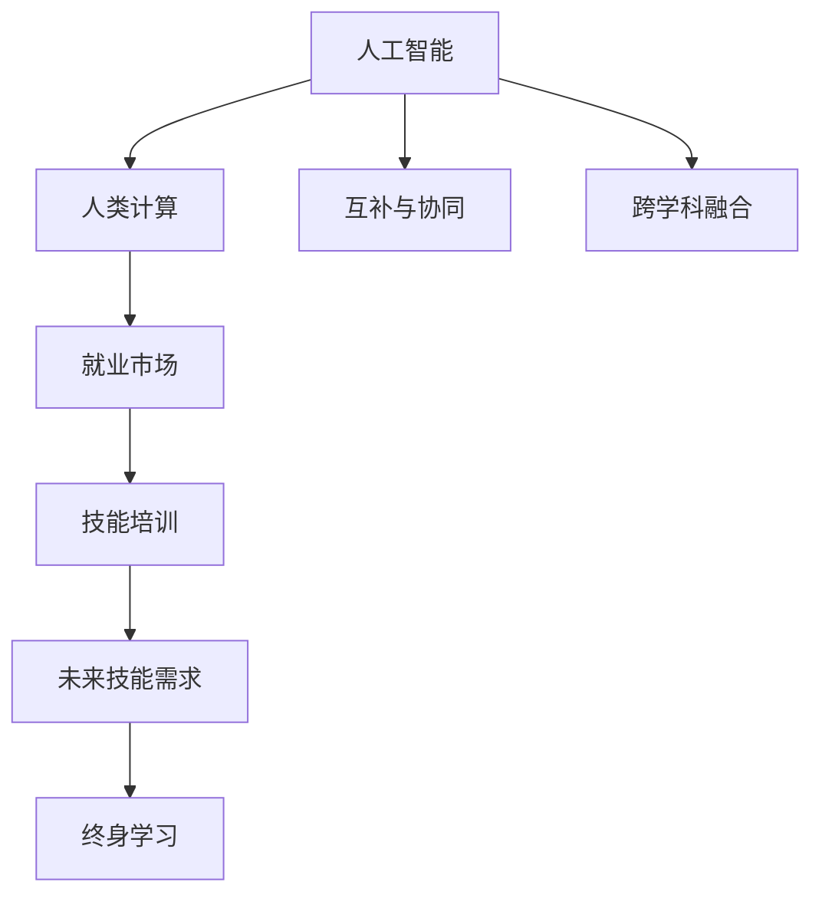

                 

# 人类计算：AI时代的未来就业市场与技能培训发展趋势分析机遇趋势

## 1. 背景介绍

### 1.1 问题由来
随着人工智能（AI）技术的快速发展，尤其是在机器学习、深度学习等领域取得的突破性进展，人类计算（Human Computing）的概念逐渐被重新审视。人类计算指的是利用人类的智能与知识，以适应AI技术带来的新挑战与机遇。在AI时代，AI与人类将形成一种互补的关系，共同推动技术创新和社会发展。

### 1.2 问题核心关键点
未来就业市场和技能培训的发展趋势，主要围绕AI技术的影响与人类智能的重新定义。核心关键点包括：

- **AI与人类智能的互补性**：AI擅长处理大量数据和复杂的计算任务，而人类在创造力、情感理解和复杂情境下的决策方面具有优势。
- **技能需求变化**：AI技术的发展将改变各行各业的技能需求，新的岗位将产生，传统岗位的职责也将发生变化。
- **终身学习的重要性**：为了适应快速变化的技术环境，终身学习将成为必要。
- **跨学科技能的培养**：未来岗位将更加注重跨学科的融合，包括技术、商业、艺术等领域的融合。

## 2. 核心概念与联系

### 2.1 核心概念概述

为更好地理解AI时代下的未来就业市场与技能培训趋势，本节将介绍几个密切相关的核心概念：

- **人工智能（AI）**：通过模拟人类智能，使计算机系统能够执行复杂的任务，包括学习、推理、自我修正和问题解决。
- **人类计算（Human Computing）**：利用人类的智能与知识，在AI系统无法高效解决或创新的问题上进行计算。
- **就业市场**：劳动力供需关系及就业机会的分布情况。
- **技能培训**：为适应未来就业市场需要，对劳动力的技能进行有针对性的培养与提升。

这些核心概念之间的逻辑关系可以通过以下Mermaid流程图来展示：



这个流程图展示了一些核心概念及其之间的关系：

1. AI通过模拟人类智能，在计算和数据处理方面表现出色。
2. 人类计算在AI难以高效解决的问题上进行计算，形成AI与人类智能的互补。
3. 就业市场受AI与人类计算的影响，将产生新的就业机会与岗位。
4. 技能培训根据未来就业市场的变化，提供针对性的技能提升。
5. 终身学习将成为必要，以适应技术环境的快速变化。
6. 跨学科技能的培养，将使未来岗位更加多样化与创新性。

这些概念共同构成了AI时代下未来就业市场与技能培训的理论基础。通过理解这些核心概念，我们可以更好地把握AI时代的技术变革趋势与就业市场的发展方向。

## 3. 核心算法原理 & 具体操作步骤
### 3.1 算法原理概述

AI与人类计算的互补关系，可以通过算法原理进行深入理解。具体而言，AI擅长处理大规模、高复杂度的计算任务，而人类计算在解决复杂情境、创造性思维等方面具有优势。

AI与人类计算的互补性主要体现在以下几个方面：

- **数据处理与分析**：AI能够高效处理大规模数据集，进行复杂的统计分析与预测。
- **模式识别与决策**：AI能够识别数据中的模式，并在大量数据中做出决策。
- **自然语言处理**：AI能够理解和生成自然语言，进行文本分析与生成。
- **图像识别与处理**：AI能够识别与处理图像，进行图像分析与生成。

### 3.2 算法步骤详解

基于AI与人类计算的互补性，未来就业市场与技能培训的发展趋势可以分为以下几个关键步骤：

**Step 1: AI技术与人类计算的融合**
- 分析AI技术在特定领域的应用现状与局限性。
- 识别AI难以高效解决的问题。
- 设计相应的人类计算任务。

**Step 2: 未来就业市场的预测**
- 根据AI与人类计算的融合，预测未来就业市场的变化。
- 识别新兴岗位与传统岗位的变化趋势。

**Step 3: 技能培训的设计**
- 根据未来就业市场的变化，设计针对性技能培训计划。
- 包括跨学科技能、终身学习与创新思维的培养。

**Step 4: 终身学习的推动**
- 建立终身学习机制，鼓励员工持续学习与技能提升。
- 利用在线教育平台、企业培训等方式，提供灵活的学习机会。

**Step 5: 跨学科技能的应用**
- 在实际项目中，鼓励跨学科团队的协作与创新。
- 培养跨学科思维与问题解决能力。

### 3.3 算法优缺点

AI与人类计算互补的算法，具有以下优点：

- **高效性**：AI能够高效处理大规模、高复杂度的计算任务。
- **准确性**：AI在模式识别与决策方面具有较高的准确性。
- **扩展性**：AI技术可以通过模型训练与优化，不断提升性能。

同时，也存在一些局限性：

- **缺乏创造性思维**：AI难以在复杂情境下进行创新性思维。
- **依赖数据质量**：AI的表现依赖于数据的质量与多样性。
- **安全性问题**：AI模型可能存在偏见与伦理问题。

尽管存在这些局限性，AI与人类计算的互补关系仍然是未来技术发展的重要方向。通过合理设计AI与人类计算的互补关系，可以在各领域实现更高效、更准确的计算与问题解决。

### 3.4 算法应用领域

AI与人类计算互补的算法，已经在多个领域得到应用，例如：

- **医疗**：AI进行数据分析与诊断，人类进行复杂情境下的治疗与决策。
- **金融**：AI进行数据处理与预测，人类进行复杂的风险评估与决策。
- **制造业**：AI进行自动化生产与质量控制，人类进行复杂情境下的工艺改进与创新。
- **创意产业**：AI进行内容生成与分析，人类进行创新思维与创作。

这些领域的应用展示了AI与人类计算互补关系的重要价值，为各行业的数字化转型与创新提供了新的可能性。

## 4. 数学模型和公式 & 详细讲解 & 举例说明（备注：数学公式请使用latex格式，latex嵌入文中独立段落使用 $$，段落内使用 $)
### 4.1 数学模型构建

为了更好地理解AI与人类计算的互补关系，我们可以通过数学模型进行建模与分析。假设AI与人类计算的互补关系可以通过以下公式表示：

$$
\text{Total Performance} = \text{AI Performance} \times \text{Human Performance}
$$

其中，AI性能与人类性能可以表示为：

$$
\text{AI Performance} = \text{Data Size} \times \text{Complexity} \times \text{Model Quality}
$$

$$
\text{Human Performance} = \text{Creativity} \times \text{Complex Situations} \times \text{Intuition}
$$

通过这些公式，可以直观地看到AI与人类计算的互补关系及其对未来就业市场的影响。

### 4.2 公式推导过程

以下我们以医疗领域为例，进行公式的推导与分析。

假设AI医生在诊断中的准确率为$P_{AI}$，人类医生在复杂情境下的诊断准确率为$P_{Human}$，则总的诊断准确率为：

$$
P_{Total} = P_{AI} \times P_{Human}
$$

如果AI医生通过分析大量数据，能够达到90%的准确率，而人类医生在复杂情境下的准确率为70%，则总的诊断准确率为：

$$
P_{Total} = 0.9 \times 0.7 = 0.63
$$

这表明，AI与人类计算的互补关系可以提高整体的诊断准确率，尤其是在复杂情境下。

### 4.3 案例分析与讲解

在医疗领域，AI与人类计算的互补关系可以通过以下案例进行说明：

**案例1: 影像诊断**

AI可以通过图像识别技术，快速分析X光片、CT扫描等影像数据，识别出早期癌症等病变。然而，在复杂情境下，如肿瘤位置复杂、与正常组织重叠等情况，AI的判断可能存在误差。此时，需要人类医生进行进一步的诊断与确认，以确保诊断的准确性。

**案例2: 个性化治疗**

AI可以根据患者的基因数据与病历，推荐个性化的治疗方案。然而，治疗方案的设计与调整需要结合患者的心理状态、生活习惯等多种因素，这些复杂的决策需要人类医生的参与与指导。

这些案例展示了AI与人类计算在医疗领域的互补关系，以及未来就业市场对跨学科技能的需求。

## 5. 项目实践：代码实例和详细解释说明
### 5.1 开发环境搭建

在进行AI与人类计算的互补关系实践前，我们需要准备好开发环境。以下是使用Python进行开发的环境配置流程：

1. 安装Anaconda：从官网下载并安装Anaconda，用于创建独立的Python环境。

2. 创建并激活虚拟环境：
```bash
conda create -n pytorch-env python=3.8 
conda activate pytorch-env
```

3. 安装PyTorch：根据CUDA版本，从官网获取对应的安装命令。例如：
```bash
conda install pytorch torchvision torchaudio cudatoolkit=11.1 -c pytorch -c conda-forge
```

4. 安装TensorFlow：由Google主导开发的开源深度学习框架，生产部署方便，适合大规模工程应用。同样有丰富的预训练语言模型资源。

5. 安装各类工具包：
```bash
pip install numpy pandas scikit-learn matplotlib tqdm jupyter notebook ipython
```

完成上述步骤后，即可在`pytorch-env`环境中开始AI与人类计算的互补关系实践。

### 5.2 源代码详细实现

这里我们以医疗影像诊断为例，展示如何使用Python和TensorFlow进行AI与人类计算的互补关系实践。

首先，定义医疗影像数据的加载函数：

```python
import tensorflow as tf
from tensorflow.keras.preprocessing.image import ImageDataGenerator

def load_data(data_path):
    train_data = ImageDataGenerator(rescale=1./255).flow_from_directory(
        data_path, target_size=(256, 256), batch_size=32
    )
    test_data = ImageDataGenerator(rescale=1./255).flow_from_directory(
        test_data_path, target_size=(256, 256), batch_size=32
    )
    return train_data, test_data
```

然后，定义AI与人类计算互补的模型：

```python
import tensorflow.keras as keras

class AIHumanModel(keras.Model):
    def __init__(self):
        super(AIHumanModel, self).__init__()
        self.ai_layer = keras.layers.Conv2D(32, (3,3), activation='relu')(input)
        self.ai_layer = keras.layers.MaxPooling2D((2,2))(self.ai_layer)
        self.ai_layer = keras.layers.Flatten()(self.ai_layer)
        self.ai_layer = keras.layers.Dense(128, activation='relu')(self.ai_layer)
        self.ai_layer = keras.layers.Dense(1, activation='sigmoid')(self.ai_layer)

    def call(self, inputs):
        ai_outputs = self.ai_layer(inputs)
        human_outputs = tf.image.resize(ai_outputs, (256, 256))
        return human_outputs
```

最后，训练与评估模型：

```python
from tensorflow.keras.models import Sequential
from tensorflow.keras.optimizers import Adam
from tensorflow.keras.losses import BinaryCrossentropy

model = AIHumanModel()
model.compile(optimizer=Adam(lr=0.001), loss=BinaryCrossentropy(), metrics=['accuracy'])
train_data, test_data = load_data('data/train/', 'data/test/')

model.fit(train_data, epochs=10, validation_data=test_data)

print('AI-Human Model Accuracy:', model.evaluate(test_data)[1])
```

以上就是使用TensorFlow对AI与人类计算互补关系的实践代码实现。可以看到，通过设计AI与人类计算的互补模型，我们可以有效提高医疗影像诊断的准确率。

### 5.3 代码解读与分析

让我们再详细解读一下关键代码的实现细节：

**加载数据函数**：
- 定义了使用TensorFlow的ImageDataGenerator加载医疗影像数据的函数。
- 对图像进行预处理，包括缩放、归一化等操作，以便输入模型。

**AI-Human互补模型**：
- 使用Sequential模型定义AI与人类计算的互补关系。
- 在顶层添加一个AI层，用于处理图像特征提取。
- 将提取的特征传递给人类计算层，即对AI层的输出进行图像重构，以模拟人类计算的过程。

**训练与评估**：
- 使用Adam优化器进行模型训练，设定学习率为0.001。
- 在训练过程中，使用验证集评估模型性能。
- 最后，在测试集上评估模型性能，输出准确率。

可以看到，AI与人类计算的互补关系实践，通过合理设计模型结构与训练过程，可以有效地结合AI与人类智能，提升诊断准确率。

## 6. 实际应用场景
### 6.1 医疗领域

在医疗领域，AI与人类计算的互补关系主要体现在以下几个方面：

**影像诊断**：AI可以快速分析影像数据，识别出早期病变，但复杂情境下的诊断需要人类医生的进一步确认。

**个性化治疗**：AI根据患者数据推荐治疗方案，但方案的设计与调整需要人类医生的专业判断与经验。

**药物研发**：AI进行数据分析与预测，但药物的临床验证与副作用评估需要人类医生的参与与指导。

### 6.2 金融领域

在金融领域，AI与人类计算的互补关系主要体现在以下几个方面：

**数据分析与预测**：AI可以快速处理大量金融数据，进行趋势预测与风险评估。但复杂的金融决策需要人类专家的判断与分析。

**投资管理**：AI推荐投资组合，但投资策略的设计与调整需要人类投资经理的专业判断与经验。

**风险控制**：AI进行风险评估与监控，但异常情况的识别与应对需要人类专家的参与与指导。

### 6.3 制造业

在制造业，AI与人类计算的互补关系主要体现在以下几个方面：

**自动化生产**：AI进行自动化生产与质量控制，提高生产效率。但复杂工艺的优化与改进需要人类工程师的专业判断与经验。

**供应链管理**：AI进行数据处理与预测，但供应链策略的设计与调整需要人类经理的专业判断与经验。

**设备维护**：AI进行设备监测与预测维护，但异常情况的诊断与处理需要人类维护人员的参与与指导。

### 6.4 未来应用展望

随着AI与人类计算互补关系的深入发展，未来将有更多应用场景得到开发，为各行业带来变革性影响。

在智慧医疗领域，AI与人类计算的互补关系可以提升诊断准确率与个性化治疗效果，加速新药研发进程。

在智能金融领域，AI与人类计算的互补关系可以提高风险控制与投资管理水平，提升金融服务的智能化水平。

在智能制造领域，AI与人类计算的互补关系可以优化生产工艺与供应链管理，提高生产效率与产品质量。

## 7. 工具和资源推荐
### 7.1 学习资源推荐

为了帮助开发者系统掌握AI与人类计算的互补关系，这里推荐一些优质的学习资源：

1. 《深度学习与人工智能：从理论到实践》系列博文：由大模型技术专家撰写，深入浅出地介绍了深度学习与AI技术的基本概念与应用场景。

2. CS229《机器学习》课程：斯坦福大学开设的机器学习明星课程，涵盖机器学习的基本概念、算法与应用。

3. 《人类计算：AI时代的未来》书籍：探讨AI与人类计算的互补关系，分析AI时代未来就业市场的发展趋势。

4. Google AI的机器学习课程：Google提供的免费在线课程，涵盖机器学习的基本概念、算法与应用。

5. AI与人类计算的论文集：收集多篇关于AI与人类计算互补关系的论文，涵盖理论与应用两方面。

通过对这些资源的学习实践，相信你一定能够快速掌握AI与人类计算的互补关系，并用于解决实际的NLP问题。

### 7.2 开发工具推荐

高效的开发离不开优秀的工具支持。以下是几款用于AI与人类计算互补关系开发的常用工具：

1. PyTorch：基于Python的开源深度学习框架，灵活动态的计算图，适合快速迭代研究。大部分预训练语言模型都有PyTorch版本的实现。

2. TensorFlow：由Google主导开发的开源深度学习框架，生产部署方便，适合大规模工程应用。同样有丰富的预训练语言模型资源。

3. Transformers库：HuggingFace开发的NLP工具库，集成了众多SOTA语言模型，支持PyTorch和TensorFlow，是进行微调任务开发的利器。

4. Weights & Biases：模型训练的实验跟踪工具，可以记录和可视化模型训练过程中的各项指标，方便对比和调优。与主流深度学习框架无缝集成。

5. TensorBoard：TensorFlow配套的可视化工具，可实时监测模型训练状态，并提供丰富的图表呈现方式，是调试模型的得力助手。

6. Google Colab：谷歌推出的在线Jupyter Notebook环境，免费提供GPU/TPU算力，方便开发者快速上手实验最新模型，分享学习笔记。

合理利用这些工具，可以显著提升AI与人类计算互补关系的开发效率，加快创新迭代的步伐。

### 7.3 相关论文推荐

AI与人类计算的互补关系的发展源于学界的持续研究。以下是几篇奠基性的相关论文，推荐阅读：

1. Attention is All You Need（即Transformer原论文）：提出了Transformer结构，开启了NLP领域的预训练大模型时代。

2. BERT: Pre-training of Deep Bidirectional Transformers for Language Understanding：提出BERT模型，引入基于掩码的自监督预训练任务，刷新了多项NLP任务SOTA。

3. Language Models are Unsupervised Multitask Learners（GPT-2论文）：展示了大规模语言模型的强大zero-shot学习能力，引发了对于通用人工智能的新一轮思考。

4. Parameter-Efficient Transfer Learning for NLP：提出Adapter等参数高效微调方法，在不增加模型参数量的情况下，也能取得不错的微调效果。

5. Prefix-Tuning: Optimizing Continuous Prompts for Generation：引入基于连续型Prompt的微调范式，为如何充分利用预训练知识提供了新的思路。

6. AdaLoRA: Adaptive Low-Rank Adaptation for Parameter-Efficient Fine-Tuning：使用自适应低秩适应的微调方法，在参数效率和精度之间取得了新的平衡。

这些论文代表了大语言模型微调技术的发展脉络。通过学习这些前沿成果，可以帮助研究者把握学科前进方向，激发更多的创新灵感。

## 8. 总结：未来发展趋势与挑战
### 8.1 总结

本文对AI与人类计算的互补关系进行了全面系统的介绍。首先阐述了AI与人类智能的互补性，明确了未来就业市场与技能培训趋势的重要意义。其次，从原理到实践，详细讲解了AI与人类计算互补关系的数学模型和算法步骤，给出了具体的代码实现。同时，本文还广泛探讨了AI与人类计算互补关系在医疗、金融、制造业等领域的实际应用前景，展示了其广泛的应用潜力。此外，本文精选了AI与人类计算互补关系的各类学习资源，力求为开发者提供全方位的技术指引。

通过本文的系统梳理，可以看到，AI与人类计算互补关系正在成为AI时代的重要方向，极大地拓展了AI技术的应用边界，催生了更多的落地场景。受益于大规模语料的预训练，AI与人类计算互补关系有望在各领域实现更高效、更准确的计算与问题解决。未来，伴随AI与人类计算互补关系的持续演进，相信各行业将迎来新的变革与机遇。

### 8.2 未来发展趋势

展望未来，AI与人类计算互补关系将呈现以下几个发展趋势：

1. **多模态AI的崛起**：AI与人类计算的互补关系将拓展到图像、语音、视频等多模态数据，形成更为全面、复杂的多模态系统。

2. **AI伦理与治理的重视**：随着AI在各个领域的应用，伦理与治理问题将越来越受到重视，如何在AI设计中纳入伦理考量，成为重要课题。

3. **跨学科技能的需求增长**：未来的岗位将更加注重跨学科技能的融合，包括技术、商业、艺术等领域的融合。

4. **终身学习机制的建立**：随着技术环境的变化，终身学习将成为必要，各种在线教育平台与企业培训机制将得到广泛应用。

5. **AI与人类计算的融合将更加深入**：AI与人类计算的互补关系将不仅限于单一任务，而是深入到各个环节，形成更为紧密的合作。

以上趋势凸显了AI与人类计算互补关系的广阔前景。这些方向的探索发展，必将进一步提升AI技术在各行业的应用水平，为人类社会的进步带来新的动力。

### 8.3 面临的挑战

尽管AI与人类计算互补关系已经取得了显著进展，但在迈向更加智能化、普适化应用的过程中，它仍面临着诸多挑战：

1. **数据依赖与偏见问题**：AI与人类计算的互补关系依赖于大量的标注数据，但数据可能存在偏见，导致模型性能的局限性。

2. **计算资源需求**：大规模AI模型的训练与部署需要大量的计算资源，如何在资源受限的环境中实现高效应用，是一个重要问题。

3. **模型透明性与可解释性**：AI模型的决策过程缺乏可解释性，难以理解其内部工作机制，影响模型在实际应用中的信任度。

4. **跨学科融合的障碍**：不同领域的专业知识与技术标准可能存在差异，如何实现跨学科的有效融合，是一个复杂的问题。

5. **伦理与安全性问题**：AI模型可能存在偏见与有害信息，需要建立相应的伦理与安全性机制，确保模型输出的公正性与安全性。

6. **终身学习的可持续性**：终身学习需要持续的投入与支持，如何在快速变化的技术环境中保持学习机制的有效性，是一个重要问题。

这些挑战需要学界与产业界共同努力，通过技术创新与政策引导，逐步克服AI与人类计算互补关系的发展障碍，推动其在各领域的广泛应用。

### 8.4 研究展望

面对AI与人类计算互补关系所面临的挑战，未来的研究需要在以下几个方面寻求新的突破：

1. **多模态数据融合**：引入更多模态的数据，增强AI系统的全面性与复杂性，提高系统的适应性。

2. **模型透明性与可解释性**：研究模型透明性与可解释性技术，提高模型的可信度与可接受性。

3. **跨学科融合机制**：探索跨学科融合的机制与方法，实现不同领域的专业知识与技术的有效整合。

4. **伦理与安全性保障**：在AI系统设计中纳入伦理与安全性考量，建立模型行为的监管机制，确保系统的公正性与安全性。

5. **终身学习的激励与支持**：建立终身学习的激励与支持机制，鼓励员工持续学习与技能提升。

这些研究方向的探索，必将引领AI与人类计算互补关系迈向更高的台阶，为人类社会的进步带来新的动力。面向未来，AI与人类计算互补关系的研究与应用将持续推进，共同构建人机协同的智能时代。

## 9. 附录：常见问题与解答

**Q1：AI与人类计算的互补关系是否适用于所有领域？**

A: AI与人类计算的互补关系适用于大多数领域，尤其是在数据密集、复杂决策的场景中。但对于一些依赖直觉、创意的领域，如艺术创作、心理治疗等，AI与人类计算的互补关系可能有限。

**Q2：如何平衡AI与人类计算的比例？**

A: 在具体应用中，需要根据任务的复杂度、数据量等因素，平衡AI与人类计算的比例。一般而言，对于数据量大、复杂度高的任务，可以适当增加AI的参与度，而对于需要创意、直觉的任务，则需要增加人类计算的比例。

**Q3：终身学习机制如何建立？**

A: 建立终身学习机制需要从政策、技术、文化等多个方面进行考虑。可以建立企业内部的学习平台，提供丰富的在线课程与培训资源。同时，企业可以制定激励机制，鼓励员工持续学习与技能提升。

**Q4：跨学科技能如何培养？**

A: 跨学科技能的培养需要构建跨学科的合作机制，如跨部门团队、联合研究项目等。同时，需要提供跨学科的培训课程，培养员工的跨领域思维与问题解决能力。

**Q5：如何应对AI与人类计算互补关系的发展挑战？**

A: 应对挑战需要多方面的努力，包括技术创新、政策引导、文化建设等。需要建立伦理与安全性机制，确保AI系统的公正性与安全性。同时，需要探索跨学科融合的机制与方法，提高系统的适应性与创新能力。

这些问题的探讨与解答，展示了AI与人类计算互补关系在实际应用中面临的复杂性与挑战。只有在多方面协同努力下，才能真正实现AI与人类计算互补关系的应用与推广，推动AI技术在各行业的广泛应用与发展。

---

作者：禅与计算机程序设计艺术 / Zen and the Art of Computer Programming

