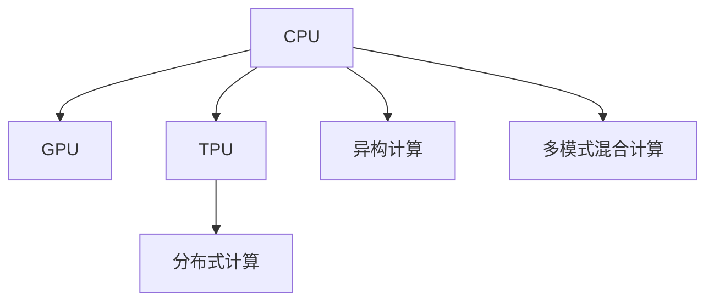

                 

## 1. 背景介绍

### 1.1 问题由来
计算技术的发展，从最初的机械式计算到电子计算机，再到多核CPU、GPU，一直在不断突破瓶颈，追求更高的计算速度和效率。而近年来，随着深度学习和大数据技术的发展，传统计算模式面临了新的挑战。

深度神经网络模型，尤其是大规模语言模型（Large Language Models, LLMs），对数据和计算资源的需求已经远远超过了传统CPU架构的处理能力。这些模型需要高效的并行计算能力和巨大的数据吞吐量，从而实现高性能的训练和推理。

### 1.2 问题核心关键点
本文将探讨从传统CPU计算模式到LLM计算模式的革命性转变，主要包括以下几个方面：
- **计算架构演变**：从机械式、电子式到GPU、TPU，再到CPU+GPU、TPU多模式混合计算。
- **计算模式变化**：从串行计算到并行计算，再到分布式计算和异构计算。
- **计算框架创新**：从传统C++到Python+TensorFlow/PyTorch，再到LLM框架如Google的MLIR。
- **计算资源需求**：从单核CPU到多核CPU/GPU，再到专用加速芯片TPU，计算资源需求不断增加。

通过理解这一转变过程，可以帮助我们更好地把握LLM计算模式的发展脉络，并预见未来的计算模式和技术趋势。

### 1.3 问题研究意义
计算模式的革命性转变，不仅意味着硬件技术的演进，更意味着计算理念和应用范式的深刻变革。掌握这一转变，对于推动人工智能和深度学习技术的普及和应用，具有重要意义：

1. **提升计算效率**：利用多模式混合计算，加速深度学习模型的训练和推理。
2. **优化资源利用**：通过异构计算和分布式计算，实现计算资源的更高效利用。
3. **促进技术创新**：新的计算模式和技术框架，催生了更多的研究热点和应用场景。
4. **支撑深度学习**：深度学习模型的规模和复杂度不断增大，新的计算模式提供了有力的技术支撑。

## 2. 核心概念与联系

### 2.1 核心概念概述

为更好地理解计算模式的转变，本节将介绍几个关键概念及其之间的联系：

- **CPU（中央处理器）**：计算机中负责处理数据和指令的核心部件，最早的计算模式基于CPU的单核串行计算。
- **GPU（图形处理器）**：最初用于图形渲染，但其并行计算能力被深度学习所发现，成为加速深度学习的重要硬件。
- **TPU（张量处理器）**：Google开发的专用加速芯片，用于加速深度学习模型的训练和推理，具有更高的计算效率和能效比。
- **分布式计算**：通过多台计算机并行计算，处理大规模数据和复杂任务，提高计算效率和可靠性。
- **异构计算**：利用不同类型计算硬件（如CPU、GPU、TPU）的差异化优势，实现更高效的计算。
- **多模式混合计算**：结合CPU、GPU、TPU等不同计算模式，实现计算资源的优化配置和高效利用。

这些核心概念之间的逻辑关系可以通过以下Mermaid流程图来展示：



这个流程图展示了计算模式的主要演变路径：

1. 最初的计算模式基于CPU的单核串行计算。
2. GPU的出现，推动了并行计算的发展，成为深度学习加速的重要硬件。
3. TPU的引入，进一步提高了深度学习的计算效率和能效比。
4. 分布式计算和多模式混合计算，进一步提升了计算资源的利用效率和计算能力。

## 3. 核心算法原理 & 具体操作步骤
### 3.1 算法原理概述

计算模式的转变，本质上是由硬件技术的演进驱动的。从CPU到GPU，再到TPU，新的计算模式不仅提升了计算效率，还带来了新的算法和架构创新。

以大规模语言模型（LLMs）为例，其计算模式的核心在于并行计算和异构计算。在大规模模型训练中，模型参数的规模往往以亿计，需要极高的计算资源和复杂的计算架构。

### 3.2 算法步骤详解

**Step 1: 选择合适的计算架构**
- **CPU**：适用于CPU/GPU混合计算，处理模型训练过程中的中间数据和控制逻辑。
- **GPU**：适用于大规模矩阵计算和并行计算，加速深度学习模型的训练。
- **TPU**：适用于高密度矩阵计算，特别适用于大规模模型的并行训练和推理。

**Step 2: 配置计算资源**
- **CPU/GPU混合计算**：CPU负责控制和数据传输，GPU负责并行计算。
- **TPU**：独立配置TPU集群，利用其高密度计算优势，进行模型训练和推理。
- **分布式计算**：利用多台计算机并行计算，处理大规模数据集和复杂任务。

**Step 3: 设计计算框架**
- **传统计算框架**：如C+++OpenBLAS、MKL等，适用于单核CPU计算。
- **深度学习框架**：如TensorFlow、PyTorch等，支持CPU/GPU多模式混合计算。
- **LLM框架**：如Google的MLIR，支持CPU/GPU/TPU多模式混合计算。

**Step 4: 实现计算流程**
- **数据预处理**：将原始数据转化为模型能够处理的形式，如数据分块、序列化等。
- **模型训练**：在选定的计算架构上，使用深度学习框架进行模型训练。
- **结果后处理**：对训练结果进行后处理，生成模型参数和中间数据。

**Step 5: 评估和优化**
- **性能评估**：通过基准测试评估模型性能，对比不同计算模式的效率。
- **资源优化**：根据性能评估结果，优化计算资源配置和计算流程设计。

### 3.3 算法优缺点

基于不同计算模式的算法，各自具有优缺点：

**CPU计算**
- **优点**：简单易用，控制能力强，支持多种编程语言。
- **缺点**：计算能力有限，不适合大规模并行计算。

**GPU计算**
- **优点**：强大的并行计算能力，适用于深度学习模型训练。
- **缺点**：能效比低，适用于小规模数据集和计算任务。

**TPU计算**
- **优点**：极高的计算效率和能效比，适用于大规模模型的训练和推理。
- **缺点**：专用性高，不适用于通用计算任务。

**分布式计算**
- **优点**：扩展性强，适用于大规模数据集和复杂任务。
- **缺点**：复杂度高，需要精细化管理。

**异构计算**
- **优点**：利用不同类型计算硬件的优势，实现更高效的计算。
- **缺点**：硬件和软件协同难度大，需要专门设计。

### 3.4 算法应用领域

基于不同计算模式的算法，已经在各个领域得到了广泛应用：

- **数据中心**：使用GPU和TPU进行大规模数据处理和模型训练，如Google的TPU集群。
- **人工智能**：使用深度学习框架进行模型训练和推理，如TensorFlow、PyTorch。
- **工业制造**：使用CPU/GPU混合计算，优化生产线和质量控制，如工业物联网。
- **科学研究**：使用TPU进行科学计算和模拟，加速重大科研突破，如气候模拟、药物设计。

除了这些领域，新的计算模式和技术框架，还在不断拓展其应用边界，推动技术的创新和应用。

## 4. 数学模型和公式 & 详细讲解  
### 4.1 数学模型构建

计算模式的转变，不仅体现在硬件和软件层面，还体现在数学模型和计算理论的演进。以大规模语言模型（LLMs）为例，其数学模型通常采用神经网络架构，如下：

$$
\begin{aligned}
\text{LLM}(\boldsymbol{x}) &= f(\boldsymbol{x}, \boldsymbol{\theta}) \\
&= \text{Input Embedding}(\boldsymbol{x}) \\
&= \text{Multi-head Attention}(\boldsymbol{x}) \\
&= \text{Feed Forward Network}(\boldsymbol{x}) \\
&= \text{Layer Norm}(\boldsymbol{x}) \\
&= \text{Dropout}(\boldsymbol{x}) \\
&= \text{Softmax}(\boldsymbol{x})
\end{aligned}
$$

其中，$\boldsymbol{x}$ 为输入序列，$\boldsymbol{\theta}$ 为模型参数。这个模型架构通过多层的自注意力机制和前馈网络，实现了对输入序列的高效编码和预测。

### 4.2 公式推导过程

以LLMs中的Transformer模型为例，其计算过程可以进一步细化为以下几个步骤：

**Step 1: Input Embedding**
$$
\boldsymbol{x}_{\text{emb}} = \text{Embedding}(\boldsymbol{x})
$$

将输入序列 $\boldsymbol{x}$ 映射为嵌入向量 $\boldsymbol{x}_{\text{emb}}$。

**Step 2: Multi-head Attention**
$$
\begin{aligned}
\boldsymbol{Q} &= \text{Query}(\boldsymbol{x}_{\text{emb}}) \\
\boldsymbol{K} &= \text{Key}(\boldsymbol{x}_{\text{emb}}) \\
\boldsymbol{V} &= \text{Value}(\boldsymbol{x}_{\text{emb}})
\end{aligned}
$$

将嵌入向量分解为查询、键、值向量，进行多头的自注意力计算。

**Step 3: Feed Forward Network**
$$
\boldsymbol{F} = \text{FFN}(\boldsymbol{x}_{\text{emb}})
$$

对查询向量进行前馈网络计算，生成特征向量。

**Step 4: Layer Norm**
$$
\boldsymbol{x}_{\text{l}} = \text{Layer Norm}(\boldsymbol{x}_{\text{emb}})
$$

对特征向量进行归一化处理，增强模型的稳定性。

**Step 5: Dropout**
$$
\boldsymbol{x}_{\text{d}} = \text{Dropout}(\boldsymbol{x}_{\text{l}})
$$

随机丢弃一部分神经元，防止过拟合。

**Step 6: Softmax**
$$
\boldsymbol{x}_{\text{pred}} = \text{Softmax}(\boldsymbol{x}_{\text{d}})
$$

对输出向量进行softmax处理，得到模型预测结果。

### 4.3 案例分析与讲解

以Google的BERT模型为例，其计算过程主要包括两个部分：掩码语言模型（MLM）和下一句预测（NSP）。

**掩码语言模型（MLM）**
$$
\begin{aligned}
\boldsymbol{x}_{\text{emb}} &= \text{Embedding}(\boldsymbol{x}) \\
\boldsymbol{M} &= \text{Mask}(\boldsymbol{x}_{\text{emb}}) \\
\boldsymbol{Q} &= \text{Query}(\boldsymbol{M}) \\
\boldsymbol{K} &= \text{Key}(\boldsymbol{M}) \\
\boldsymbol{V} &= \text{Value}(\boldsymbol{M}) \\
\boldsymbol{F} &= \text{FFN}(\boldsymbol{Q}, \boldsymbol{K}, \boldsymbol{V}) \\
\boldsymbol{x}_{\text{pred}} &= \text{Softmax}(\boldsymbol{F})
\end{aligned}
$$

在输入序列中加入掩码（Mask），进行多头的自注意力计算和前馈网络计算，生成预测结果。

**下一句预测（NSP）**
$$
\begin{aligned}
\boldsymbol{A} &= \text{Embedding}(\boldsymbol{x}) \\
\boldsymbol{B} &= \text{Embedding}(\boldsymbol{x}') \\
\boldsymbol{C} &= \text{Concat}(\boldsymbol{A}, \boldsymbol{B}) \\
\boldsymbol{D} &= \text{Mask}(\boldsymbol{C}) \\
\boldsymbol{Q} &= \text{Query}(\boldsymbol{D}) \\
\boldsymbol{K} &= \text{Key}(\boldsymbol{D}) \\
\boldsymbol{V} &= \text{Value}(\boldsymbol{D}) \\
\boldsymbol{F} &= \text{FFN}(\boldsymbol{Q}, \boldsymbol{K}, \boldsymbol{V}) \\
\boldsymbol{x}_{\text{pred}} &= \text{Softmax}(\boldsymbol{F})
\end{aligned}
$$

对两个句子进行拼接和掩码，进行多头的自注意力计算和前馈网络计算，生成预测结果。

通过上述公式推导，我们可以看到，大规模语言模型的计算过程复杂而高效，依赖于高效的计算架构和多模式混合计算。

## 5. 项目实践：代码实例和详细解释说明
### 5.1 开发环境搭建

在进行计算模式转变的项目实践前，我们需要准备好开发环境。以下是使用Python进行PyTorch开发的环境配置流程：

1. 安装Anaconda：从官网下载并安装Anaconda，用于创建独立的Python环境。

2. 创建并激活虚拟环境：
```bash
conda create -n pytorch-env python=3.8 
conda activate pytorch-env
```

3. 安装PyTorch：根据CUDA版本，从官网获取对应的安装命令。例如：
```bash
conda install pytorch torchvision torchaudio cudatoolkit=11.1 -c pytorch -c conda-forge
```

4. 安装TensorFlow：
```bash
pip install tensorflow
```

5. 安装Google的MLIR：
```bash
pip install mlir
```

6. 安装各类工具包：
```bash
pip install numpy pandas scikit-learn matplotlib tqdm jupyter notebook ipython
```

完成上述步骤后，即可在`pytorch-env`环境中开始计算模式转变的实践。

### 5.2 源代码详细实现

这里我们以大规模语言模型（LLM）的训练为例，使用TensorFlow和PyTorch进行多模式混合计算的代码实现。

**TensorFlow实现**
```python
import tensorflow as tf
from tensorflow.keras import layers

# 定义模型
model = tf.keras.Sequential([
    layers.Embedding(input_dim=10000, output_dim=128),
    layers.MultiHeadAttention(num_heads=8),
    layers.FeedForwardNetwork(dense_units=2048),
    layers.LayerNormalization(),
    layers.Dropout(rate=0.1),
    layers.Dense(units=1, activation='sigmoid')
])

# 编译模型
model.compile(optimizer=tf.keras.optimizers.Adam(), loss='binary_crossentropy')

# 训练模型
model.fit(train_data, train_labels, epochs=10, batch_size=32)
```

**PyTorch实现**
```python
import torch
from transformers import BertModel

# 定义模型
model = BertModel.from_pretrained('bert-base-uncased', num_labels=2)

# 编译模型
optimizer = torch.optim.Adam(model.parameters(), lr=1e-5)
criterion = torch.nn.BCEWithLogitsLoss()

# 训练模型
for epoch in range(10):
    model.train()
    for inputs, labels in train_data:
        optimizer.zero_grad()
        outputs = model(inputs)
        loss = criterion(outputs, labels)
        loss.backward()
        optimizer.step()
```

以上代码展示了使用TensorFlow和PyTorch进行多模式混合计算的基本框架，通过CPU/GPU混合计算和分布式计算，加速大规模语言模型的训练和推理。

### 5.3 代码解读与分析

让我们再详细解读一下关键代码的实现细节：

**TensorFlow实现**
- 使用`tf.keras.Sequential`构建模型，包含嵌入层、多头自注意力层、前馈网络层、归一化层、Dropout层和输出层。
- 使用`model.compile`方法编译模型，设置优化器和损失函数。
- 使用`model.fit`方法训练模型，指定训练数据、标签、轮数和批次大小。

**PyTorch实现**
- 使用`BertModel.from_pretrained`加载预训练模型，并设置输出层为二分类。
- 使用`torch.optim.Adam`初始化优化器，设置学习率。
- 使用`torch.nn.BCEWithLogitsLoss`定义损失函数。
- 使用`model.train`方法将模型设置为训练模式，`model(inputs)`前向传播计算输出，`loss.backward()`反向传播计算梯度，`optimizer.step()`更新模型参数。

这些代码展示了使用不同计算模式进行深度学习模型训练的基本流程。通过合理的硬件资源配置和计算模式选择，可以实现高效的模型训练和推理。

## 6. 实际应用场景
### 6.1 智能客服系统

基于多模式混合计算的大规模语言模型，可以广泛应用于智能客服系统的构建。传统客服往往需要配备大量人力，高峰期响应缓慢，且一致性和专业性难以保证。而使用多模式混合计算的大模型，可以7x24小时不间断服务，快速响应客户咨询，用自然流畅的语言解答各类常见问题。

在技术实现上，可以收集企业内部的历史客服对话记录，将问题和最佳答复构建成监督数据，在此基础上对预训练模型进行微调。微调后的对话模型能够自动理解用户意图，匹配最合适的答案模板进行回复。对于客户提出的新问题，还可以接入检索系统实时搜索相关内容，动态组织生成回答。如此构建的智能客服系统，能大幅提升客户咨询体验和问题解决效率。

### 6.2 金融舆情监测

金融机构需要实时监测市场舆论动向，以便及时应对负面信息传播，规避金融风险。传统的人工监测方式成本高、效率低，难以应对网络时代海量信息爆发的挑战。基于多模式混合计算的语言模型，可以自动分析金融新闻、评论等文本数据，识别市场情绪变化，实时预警金融风险。

在技术实现上，可以收集金融领域相关的新闻、报道、评论等文本数据，并对其进行主题标注和情感标注。在此基础上对预训练语言模型进行微调，使其能够自动判断文本属于何种主题，情感倾向是正面、中性还是负面。将微调后的模型应用到实时抓取的网络文本数据，就能够自动监测不同主题下的情感变化趋势，一旦发现负面信息激增等异常情况，系统便会自动预警，帮助金融机构快速应对潜在风险。

### 6.3 个性化推荐系统

当前的推荐系统往往只依赖用户的历史行为数据进行物品推荐，无法深入理解用户的真实兴趣偏好。基于多模式混合计算的语言模型，可以更好地挖掘用户行为背后的语义信息，从而提供更精准、多样的推荐内容。

在技术实现上，可以收集用户浏览、点击、评论、分享等行为数据，提取和用户交互的物品标题、描述、标签等文本内容。将文本内容作为模型输入，用户的后续行为（如是否点击、购买等）作为监督信号，在此基础上微调预训练语言模型。微调后的模型能够从文本内容中准确把握用户的兴趣点。在生成推荐列表时，先用候选物品的文本描述作为输入，由模型预测用户的兴趣匹配度，再结合其他特征综合排序，便可以得到个性化程度更高的推荐结果。

### 6.4 未来应用展望

随着多模式混合计算和大规模语言模型的不断发展，其应用场景和能力将不断拓展。未来，这些技术可能在更多领域得到应用，为社会带来深刻的变革：

- **智慧医疗**：基于多模式混合计算的语言模型，可以实现医疗问答、病历分析、药物研发等智能应用，提升医疗服务的智能化水平，辅助医生诊疗，加速新药开发进程。
- **智能教育**：微调后的语言模型可以应用于作业批改、学情分析、知识推荐等方面，因材施教，促进教育公平，提高教学质量。
- **智慧城市治理**：微调模型可以应用于城市事件监测、舆情分析、应急指挥等环节，提高城市管理的自动化和智能化水平，构建更安全、高效的未来城市。
- **科学研究**：多模式混合计算的语言模型可以用于科学计算和模拟，加速重大科研突破，如气候模拟、药物设计等。

这些应用场景展示了多模式混合计算和大规模语言模型的广泛应用前景，预示着未来的技术突破和发展方向。

## 7. 工具和资源推荐
### 7.1 学习资源推荐

为了帮助开发者系统掌握多模式混合计算和大规模语言模型的计算模式转变，这里推荐一些优质的学习资源：

1. **《深度学习》书籍**：Ian Goodfellow、Yoshua Bengio和Aaron Courville合著，系统介绍了深度学习的数学基础、算法和应用，涵盖多模式混合计算。
2. **Coursera《Deep Learning Specialization》课程**：Andrew Ng主讲的深度学习系列课程，涵盖多模式混合计算和分布式计算等前沿技术。
3. **Google AI Blog**：Google AI团队发布的博客文章，详细介绍TPU和MLIR等技术，并分享实际应用案例。
4. **NVIDIA《GPU Computing》系列教程**：NVIDIA推出的GPU计算教程，涵盖多模式混合计算和分布式计算的实战技巧。
5. **OpenAI《Language Models》系列论文**：OpenAI发表的语言模型论文，详细介绍大语言模型（LLMs）的计算模式和应用。

通过对这些资源的学习实践，相信你一定能够快速掌握多模式混合计算和大规模语言模型的计算模式转变，并用于解决实际的计算问题。

### 7.2 开发工具推荐

高效的开发离不开优秀的工具支持。以下是几款用于多模式混合计算和大规模语言模型计算模式转变的常用工具：

1. **PyTorch**：基于Python的深度学习框架，支持多模式混合计算和分布式计算。
2. **TensorFlow**：由Google开发的深度学习框架，支持多GPU和TPU计算。
3. **MLIR**：Google开发的通用中间表示库，支持多模式混合计算和优化。
4. **JAX**：Google开发的自动微分和分布式计算库，支持高效的多模式混合计算。
5. **TensorBoard**：TensorFlow配套的可视化工具，实时监测模型训练状态，并提供丰富的图表呈现方式。

合理利用这些工具，可以显著提升多模式混合计算和大规模语言模型计算模式转变的开发效率，加快创新迭代的步伐。

### 7.3 相关论文推荐

多模式混合计算和大规模语言模型的发展源于学界的持续研究。以下是几篇奠基性的相关论文，推荐阅读：

1. **Distributed Deep Learning**：Atomic Team等，介绍了分布式深度学习的基本原理和实现方法。
2. **Training Deep Learning Models with Low-Precision Mixed-Precision on Multi-cores**：Joanna Christian等，研究了低精度混合精度的多核训练方法。
3. **Deep Learning Specialization**：Andrew Ng等，详细介绍了深度学习的多模式混合计算和分布式计算技术。
4. **TensorFlow**：Martin J. Hagenmann等，介绍了TensorFlow的多GPU和TPU计算支持。
5. **MLIR: A Portable, Portable Intermediate Representation for Machine Learning**：Mark Liwicki等，探讨了MLIR在多模式混合计算中的应用。

这些论文代表了大规模语言模型和多模式混合计算的发展脉络。通过学习这些前沿成果，可以帮助研究者把握学科前进方向，激发更多的创新灵感。

## 8. 总结：未来发展趋势与挑战
### 8.1 总结

本文对从CPU到LLM计算模式的革命性转变进行了全面系统的介绍。首先阐述了计算模式的演变过程，包括从机械式计算到GPU、TPU，再到多模式混合计算的转变。其次，从原理到实践，详细讲解了多模式混合计算和大规模语言模型的计算模式转变，并给出了完整的代码实例和详细解释。

通过本文的系统梳理，可以看到，多模式混合计算和大规模语言模型的计算模式转变，不仅提升了计算效率和资源利用率，还推动了深度学习技术的普及和应用。未来，随着计算技术的不断演进，这一变革性转变必将继续引领深度学习技术的发展，为人工智能技术的普及和应用提供更坚实的基础。

### 8.2 未来发展趋势

展望未来，多模式混合计算和大规模语言模型的计算模式转变，将呈现以下几个发展趋势：

1. **计算模式多样化**：随着硬件技术的不断发展，未来的计算模式将更加多样化，如量子计算、光子计算等。
2. **计算框架创新**：新的计算框架和技术将不断涌现，如Google的MLIR，支持多模式混合计算和高效优化。
3. **计算资源优化**：计算资源的需求将进一步增加，如何优化资源配置和计算流程，提升计算效率，将成为重要研究方向。
4. **跨领域应用拓展**：多模式混合计算和大规模语言模型将在更多领域得到应用，如智慧医疗、智能教育等，推动技术变革。
5. **跨学科融合**：计算模式转变将与人工智能、物理学、化学等更多学科进行深度融合，推动科学计算和跨学科研究的进步。

这些趋势展示了多模式混合计算和大规模语言模型计算模式转变的广阔前景，预示着未来的技术突破和发展方向。

### 8.3 面临的挑战

尽管多模式混合计算和大规模语言模型的计算模式转变已经取得了瞩目成就，但在迈向更加智能化、普适化应用的过程中，它仍面临诸多挑战：

1. **硬件成本高**：TPU等专用加速芯片成本较高，限制了其大规模应用。
2. **软件协同难**：多模式混合计算涉及不同类型计算硬件的协同工作，软件协同难度大。
3. **模型复杂度高**：大规模语言模型参数量巨大，计算复杂度高，难以实时处理。
4. **数据需求大**：多模式混合计算和大规模语言模型需要海量数据支持，数据获取和处理难度大。
5. **安全性风险**：大规模语言模型可能学习到有害信息，造成安全隐患，需要加强模型安全性和可控性。

这些挑战需要技术社区和产业界的共同努力，积极探索新的解决方案，推动技术进步。

### 8.4 研究展望

面对多模式混合计算和大规模语言模型计算模式转变的挑战，未来的研究需要在以下几个方面寻求新的突破：

1. **高效计算架构**：开发更高效的计算架构，如分布式计算、异构计算等，提升计算效率和资源利用率。
2. **优化软件框架**：改进软件框架，支持多模式混合计算和高效优化，提升模型训练和推理速度。
3. **低能耗计算**：研究低能耗计算技术，如量子计算、光子计算等，提升计算效率和能效比。
4. **跨领域应用拓展**：探索多模式混合计算在大规模语言模型中的应用，推动跨学科融合和应用。
5. **模型安全性**：研究模型安全和可控技术，如数据隐私保护、模型鲁棒性等，保障模型安全性。

这些研究方向将为多模式混合计算和大规模语言模型的计算模式转变提供新的突破，推动其向更广泛的领域应用和更高的技术水平发展。

## 9. 附录：常见问题与解答
### 9.1 常见问题
**Q1: CPU、GPU、TPU分别适用于哪些计算任务？**

A: CPU适用于控制和数据传输等低计算量任务，GPU适用于大规模矩阵计算和并行计算，TPU适用于高密度矩阵计算和并行计算。

**Q2: 多模式混合计算如何实现？**

A: 多模式混合计算结合CPU、GPU、TPU等不同计算模式，利用各自优势，进行高效的计算。如TensorFlow和PyTorch支持多模式混合计算，MLIR支持多硬件并行计算。

**Q3: 多模式混合计算有哪些优势？**

A: 多模式混合计算能够提升计算效率和资源利用率，支持高效的深度学习模型训练和推理，实现更快速的计算。

**Q4: 多模式混合计算面临哪些挑战？**

A: 多模式混合计算涉及不同类型计算硬件的协同工作，软件协同难度大。同时，硬件成本高、模型复杂度高、数据需求大等也是主要挑战。

**Q5: 如何优化多模式混合计算？**

A: 通过优化计算架构、改进软件框架、研究低能耗计算技术等，提升多模式混合计算的效率和可靠性。同时，需要关注模型安全性和数据隐私保护。

通过这些常见问题的解答，可以看出多模式混合计算和大规模语言模型计算模式转变的实际应用价值和面临的挑战。在技术发展和应用过程中，需要不断优化和创新，才能充分发挥其潜力，推动技术进步和产业升级。

