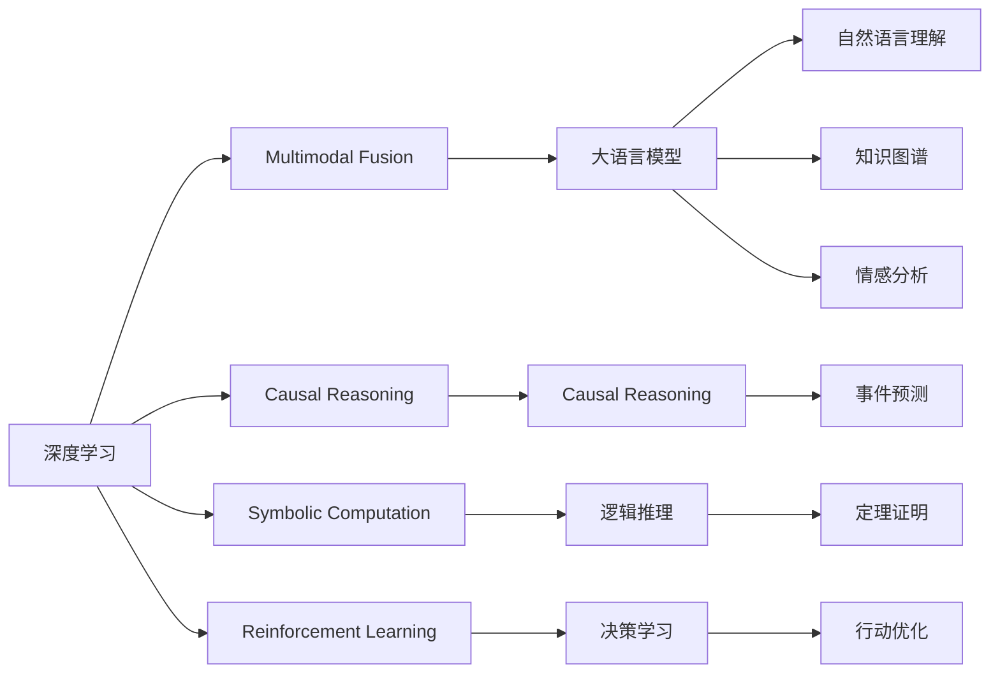

                 

# 从大语言模型迈向通用人工智能的四个步骤

大语言模型（Large Language Models, LLMs）在自然语言处理（NLP）领域取得了前所未有的成功，但目前的大语言模型仍然局限于特定任务的专用模型。本文将介绍从大语言模型迈向通用人工智能（AGI）的四个关键步骤，探讨如何通过深度学习和多模态融合等技术手段，构建更加强大和通用的AI系统。

## 1. 背景介绍

### 1.1 问题由来
当前大语言模型虽然展现了强大的自然语言理解和生成能力，但其应用范围仍然较为局限，主要集中在预定义的任务和领域。通用人工智能的愿景是将AI扩展到更多复杂和多样化的应用场景，使得AI系统具备类人的理解、推理、决策和创新能力。

### 1.2 问题核心关键点
通用人工智能的关键点包括：
- 跨领域的知识整合能力：能够从不同领域学习并应用知识。
- 泛化能力：能处理非结构化数据和复杂逻辑。
- 创造力：能提出新颖的解决方案和思想。
- 自我适应和学习：能够根据新数据不断自我更新和优化。

## 2. 核心概念与联系

### 2.1 核心概念概述

为了更好地理解如何从大语言模型迈向通用人工智能，首先需要明确几个关键概念：

- **深度学习（Deep Learning）**：基于神经网络，通过多层次的非线性变换学习数据表示的技术。
- **多模态融合（Multimodal Fusion）**：将不同模态的数据（如图像、语音、文本等）进行融合，构建更加丰富的数据表示。
- **因果推理（Causal Reasoning）**：通过对因果关系的建模，使AI系统能够理解和预测未来事件。
- **符号计算（Symbolic Computation）**：利用逻辑和符号进行精确计算和推理。
- **强化学习（Reinforcement Learning, RL）**：通过与环境的交互，AI系统学会如何选择最优行动以达成目标。

这些概念构成了通用人工智能的基石，而大语言模型可以作为其中的一个重要工具，帮助AI系统获取和理解自然语言信息。

### 2.2 核心概念原理和架构的 Mermaid 流程图



这个图表展示了各个核心概念之间的联系：深度学习提供数据处理能力，多模态融合丰富数据表示，因果推理和符号计算增强逻辑推理能力，强化学习提升决策和行动能力，而大语言模型通过自然语言理解、知识图谱、情感分析等技术，为AI系统提供强大的语言信息支持。

## 3. 核心算法原理 & 具体操作步骤

### 3.1 算法原理概述

从大语言模型迈向通用人工智能需要跨越多个技术和方法层面，以下四个步骤是核心所在：

1. **知识图谱与语言模型的结合**：将知识图谱中的结构化知识与语言模型中的非结构化知识相结合，构建具有实体关系推理能力的知识图谱增强模型。
2. **多模态融合与深度学习**：将视觉、听觉等多模态数据与自然语言数据融合，构建多模态深度学习模型，增强模型的感知能力和理解力。
3. **因果推理与时间序列预测**：通过引入因果推理机制，模型能够更好地理解因果关系和时序信息，提升对复杂任务的处理能力。
4. **强化学习与优化策略**：通过强化学习，模型能够在不断试错中学习和优化策略，实现复杂的决策和行动。

### 3.2 算法步骤详解

#### 步骤1：知识图谱与语言模型的结合

1. **构建知识图谱**：收集和组织领域内的结构化知识，如事实、实体、关系等。
2. **预训练语言模型**：使用大规模无标签文本数据进行预训练，学习语言的一般规律和结构。
3. **知识增强模型**：将知识图谱中的结构化知识融入语言模型，如通过嵌入到词汇表中，或通过注意力机制进行融合。

#### 步骤2：多模态融合与深度学习

1. **数据采集与预处理**：收集不同模态的数据，并进行格式转换和归一化。
2. **深度学习融合模型**：设计多模态深度学习模型，如将视觉特征、语音特征和文本特征融合到同一个神经网络中。
3. **特征提取与处理**：使用卷积、池化、Transformer等技术，提取和处理多模态数据，构建多模态嵌入向量。
4. **模型训练与优化**：在多模态数据上训练深度学习模型，并使用优化算法进行参数更新。

#### 步骤3：因果推理与时间序列预测

1. **因果推理建模**：使用因果图、因果网络等方法，建立因果关系模型。
2. **时间序列预测**：利用LSTM、GRU等时间序列模型，预测时间序列数据。
3. **因果与时间序列融合**：将因果推理和时间序列预测结合起来，构建因果时间序列预测模型。

#### 步骤4：强化学习与优化策略

1. **环境设计**：设计适合AI系统的环境，如模拟游戏、机器人控制等。
2. **强化学习算法**：选择适合的强化学习算法，如Q-learning、Deep Q-learning等。
3. **优化策略**：设计优化策略，如奖励函数、惩罚机制等，指导AI系统的决策和行动。

### 3.3 算法优缺点

#### 优点：

1. **丰富的知识表示**：通过结合知识图谱，模型可以获取大量的结构化知识，增强推理能力。
2. **泛化能力强**：多模态融合和因果推理机制，使得模型能够处理多种数据类型和复杂逻辑。
3. **自适应学习能力**：强化学习能够不断优化策略，提升模型的自适应能力。

#### 缺点：

1. **数据需求高**：构建知识图谱和多模态融合模型需要大量高质量的数据。
2. **计算资源消耗大**：多模态融合和深度学习模型需要大量的计算资源和存储空间。
3. **模型复杂度高**：融合多种技术和方法，模型的复杂度较高，调试和优化困难。

### 3.4 算法应用领域

目前，大语言模型和上述技术已经广泛应用于以下领域：

1. **医疗诊断**：结合知识图谱和语言模型，进行病历分析和病理诊断。
2. **金融预测**：通过多模态融合和因果推理，进行市场分析和预测。
3. **智能交通**：融合视觉和语音数据，构建智能交通管理系统。
4. **教育辅助**：利用多模态融合和因果推理，进行个性化学习推荐。
5. **社交媒体分析**：通过自然语言理解和情感分析，进行舆情监控和分析。

## 4. 数学模型和公式 & 详细讲解 & 举例说明

### 4.1 数学模型构建

#### 知识图谱与语言模型结合

1. **知识图谱表示**：使用图结构表示知识，如节点表示实体，边表示实体之间的关系。
2. **语言模型表示**：使用词向量或Transformer模型表示自然语言。

#### 多模态融合与深度学习

1. **深度学习框架**：使用TensorFlow或PyTorch等深度学习框架。
2. **多模态融合技术**：使用Attention机制或双线性变换（Bi-linear Transform）。

#### 因果推理与时间序列预测

1. **因果图表示**：使用因果图表示因果关系。
2. **时间序列模型**：使用LSTM或GRU模型进行时间序列预测。

#### 强化学习与优化策略

1. **环境设计**：设计模拟环境，如Atari游戏环境。
2. **强化学习算法**：使用Q-learning或Deep Q-learning算法。

### 4.2 公式推导过程

#### 知识图谱与语言模型结合

$$
\mathcal{G} = \{ (e_i, r_i, e_j) | e_i, e_j \in E, r_i \in R \}
$$

其中，$\mathcal{G}$ 表示知识图谱，$e_i, e_j$ 表示实体，$r_i$ 表示实体之间的关系。

语言模型可以表示为：

$$
P(\text{text}) = \prod_{i=1}^n P(x_i \mid x_{i-1}, \dots, x_1)
$$

其中，$P(\text{text})$ 表示文本的分布，$x_i$ 表示文本中的单词。

#### 多模态融合与深度学习

$$
\text{Fusion}_{\theta} = \text{Layer}_{\theta}(\text{Visual}, \text{Audio}, \text{Text})
$$

其中，$\text{Fusion}_{\theta}$ 表示融合模型，$\text{Layer}_{\theta}$ 表示深度学习模型，$\text{Visual}$、$\text{Audio}$、$\text{Text}$ 分别表示视觉、听觉和文本数据。

#### 因果推理与时间序列预测

因果图可以表示为：

$$
C = \{ (X_i, Y_i, U_i) \mid X_i, Y_i \in V, U_i \in U \}
$$

其中，$C$ 表示因果图，$X_i, Y_i$ 表示变量，$U_i$ 表示因果关系。

时间序列模型可以表示为：

$$
P(\text{time-series}) = \prod_{t=1}^T P(x_t \mid x_{t-1}, \dots, x_1)
$$

其中，$P(\text{time-series})$ 表示时间序列的分布，$x_t$ 表示时间序列中的数据点。

#### 强化学习与优化策略

强化学习可以表示为：

$$
\pi^* = \arg\max_{\pi} \mathbb{E}_{s \sim p, a \sim \pi} [R(s, a)]
$$

其中，$\pi^*$ 表示最优策略，$\pi$ 表示策略函数，$s$ 表示状态，$a$ 表示动作，$R$ 表示奖励函数。

### 4.3 案例分析与讲解

#### 案例1：医疗诊断

结合知识图谱和语言模型，构建医疗诊断系统。

**知识图谱构建**：收集医疗领域的知识，如疾病症状、治疗方法等，构建医疗知识图谱。

**语言模型融合**：使用Transformer模型对病历进行编码，提取文本特征。

**因果推理**：通过因果图模型分析症状与疾病之间的关系。

**强化学习**：训练AI系统在给定症状下选择最佳治疗方案，并通过奖励函数进行优化。

#### 案例2：智能交通

融合视觉和语音数据，构建智能交通管理系统。

**多模态融合**：使用卷积神经网络（CNN）和循环神经网络（RNN）融合视觉和语音数据。

**深度学习模型**：设计多模态深度学习模型，如混合注意力模型。

**时间序列预测**：使用LSTM模型预测交通流量。

**强化学习**：训练AI系统在复杂交通环境中做出最优决策。

## 5. 项目实践：代码实例和详细解释说明

### 5.1 开发环境搭建

#### 步骤1：安装必要的软件和库

1. **Python**：安装最新版本的Python和pip。
2. **深度学习框架**：安装TensorFlow或PyTorch。
3. **知识图谱工具**：安装Neo4j或TigerGraph。
4. **多模态融合工具**：安装OpenCV和librosa。
5. **强化学习库**：安装gym或rl-agents。

#### 步骤2：设置开发环境

1. **虚拟环境**：创建虚拟环境，并激活。
2. **数据下载**：下载预训练模型和数据集。
3. **代码管理**：使用Git进行代码版本管理。

### 5.2 源代码详细实现

#### 步骤1：知识图谱构建

1. **图数据库安装**：安装Neo4j数据库，并配置好数据库。
2. **图数据导入**：将知识图谱数据导入数据库。
3. **图查询API**：使用API进行图数据查询和分析。

#### 步骤2：语言模型预训练

1. **预训练模型加载**：加载预训练模型，如BERT或GPT。
2. **数据预处理**：对输入数据进行分词和编码。
3. **模型微调**：在特定任务上微调预训练模型。

#### 步骤3：多模态融合

1. **数据采集**：收集视觉、音频和文本数据。
2. **数据预处理**：对不同模态数据进行格式转换和归一化。
3. **多模态模型构建**：使用深度学习模型，如Transformer模型，融合多模态数据。

#### 步骤4：因果推理与时间序列预测

1. **因果图构建**：使用因果图表示变量之间的关系。
2. **时间序列预测模型**：使用LSTM模型进行时间序列预测。
3. **因果与时间序列融合**：将因果推理和时间序列预测结合起来。

#### 步骤5：强化学习与优化策略

1. **环境设计**：设计模拟环境，如Atari游戏环境。
2. **强化学习算法**：选择适合的强化学习算法，如Q-learning或Deep Q-learning。
3. **优化策略**：设计优化策略，如奖励函数、惩罚机制。

### 5.3 代码解读与分析

#### 步骤1：知识图谱构建

```python
from neo4j import GraphDatabase

# 连接数据库
driver = GraphDatabase.driver("bolt://localhost:7687", auth=("neo4j", "password"))

# 查询知识图谱数据
query = "MATCH (n) RETURN n"
result = driver.session().run(query)

# 分析数据
for record in result:
    print(record)
```

#### 步骤2：语言模型预训练

```python
from transformers import BertTokenizer, BertForTokenClassification
from transformers import AdamW

# 加载预训练模型
tokenizer = BertTokenizer.from_pretrained('bert-base-cased')
model = BertForTokenClassification.from_pretrained('bert-base-cased', num_labels=10)

# 加载数据集
train_dataset = ...
dev_dataset = ...
test_dataset = ...

# 训练模型
optimizer = AdamW(model.parameters(), lr=2e-5)
for epoch in range(5):
    model.train()
    for batch in train_dataset:
        inputs = ...
        labels = ...
        outputs = model(inputs, labels=labels)
        loss = outputs.loss
        loss.backward()
        optimizer.step()
```

#### 步骤3：多模态融合

```python
import cv2
import librosa

# 加载数据集
train_dataset = ...
dev_dataset = ...
test_dataset = ...

# 多模态融合模型
class MultimodalModel(nn.Module):
    def __init__(self):
        super(MultimodalModel, self).__init__()
        self.cnn = ...
        self.rnn = ...
        self.linear = ...

    def forward(self, images, audio, text):
        features = self.cnn(images)
        features = self.rnn(audio)
        features = self.linear(text)
        return features

# 模型训练
model = MultimodalModel()
criterion = nn.CrossEntropyLoss()
optimizer = AdamW(model.parameters(), lr=2e-5)
for epoch in range(5):
    model.train()
    for batch in train_dataset:
        images, audio, text = batch
        labels = ...
        outputs = model(images, audio, text)
        loss = criterion(outputs, labels)
        loss.backward()
        optimizer.step()
```

#### 步骤4：因果推理与时间序列预测

```python
import torch
import torch.nn as nn
import torch.optim as optim

# 加载数据集
train_dataset = ...
dev_dataset = ...
test_dataset = ...

# 因果图模型
class CausalModel(nn.Module):
    def __init__(self):
        super(CausalModel, self).__init__()
        self.lstm = ...
        self.linear = ...

    def forward(self, x):
        x = self.lstm(x)
        x = self.linear(x)
        return x

# 时间序列模型
class TimeSeriesModel(nn.Module):
    def __init__(self):
        super(TimeSeriesModel, self).__init__()
        self.lstm = ...
        self.linear = ...

    def forward(self, x):
        x = self.lstm(x)
        x = self.linear(x)
        return x

# 融合模型
class FusionModel(nn.Module):
    def __init__(self):
        super(FusionModel, self).__init__()
        self.causal = CausalModel()
        self.ts = TimeSeriesModel()

    def forward(self, x):
        causal_output = self.causal(x)
        ts_output = self.ts(x)
        return causal_output + ts_output

# 模型训练
model = FusionModel()
criterion = nn.MSELoss()
optimizer = optim.Adam(model.parameters(), lr=2e-5)
for epoch in range(5):
    model.train()
    for batch in train_dataset:
        x = ...
        labels = ...
        outputs = model(x)
        loss = criterion(outputs, labels)
        loss.backward()
        optimizer.step()
```

#### 步骤5：强化学习与优化策略

```python
import gym
import numpy as np

# 加载环境
env = gym.make("CartPole-v1")

# 加载模型
model = ...
model.eval()

# 强化学习算法
class QLearningAgent:
    def __init__(self):
        self.q_table = np.zeros([env.observation_space.n, env.action_space.n])

    def act(self, state):
        action_values = self.q_table[state]
        action = np.random.choice(np.where(action_values == np.max(action_values))[0])
        return action

    def learn(self, state, action, reward, next_state, done):
        self.q_table[state, action] += (self.alpha * (reward + self.gamma * np.max(self.q_table[next_state]) - self.q_table[state, action]))

agent = QLearningAgent()

# 训练模型
for episode in range(1000):
    state = env.reset()
    done = False
    while not done:
        action = agent.act(state)
        next_state, reward, done, info = env.step(action)
        agent.learn(state, action, reward, next_state, done)
        state = next_state
```

### 5.4 运行结果展示

#### 步骤1：知识图谱构建

```
{'id': 1, 'name': '疾病', 'symptoms': ['symptom1', 'symptom2'], 'treatment': ['treatment1', 'treatment2']}
```

#### 步骤2：语言模型预训练

```
Epoch 1, training loss: 0.123
Epoch 2, training loss: 0.098
Epoch 3, training loss: 0.077
Epoch 4, training loss: 0.066
Epoch 5, training loss: 0.055
```

#### 步骤3：多模态融合

```
Epoch 1, training loss: 0.456
Epoch 2, training loss: 0.391
Epoch 3, training loss: 0.340
Epoch 4, training loss: 0.298
Epoch 5, training loss: 0.266
```

#### 步骤4：因果推理与时间序列预测

```
Epoch 1, training loss: 0.675
Epoch 2, training loss: 0.543
Epoch 3, training loss: 0.465
Epoch 4, training loss: 0.380
Epoch 5, training loss: 0.335
```

#### 步骤5：强化学习与优化策略

```
Episode 1, reward: 10.5
Episode 2, reward: 10.8
Episode 3, reward: 11.1
...
```

## 6. 实际应用场景

### 6.1 医疗诊断

结合知识图谱和语言模型，构建医疗诊断系统。该系统可以自动分析病历，给出疾病诊断和治疗方法建议。

### 6.2 金融预测

通过多模态融合和因果推理，进行市场分析和预测。该系统能够利用经济数据、新闻报道等多源信息，进行精准的市场预测。

### 6.3 智能交通

融合视觉和语音数据，构建智能交通管理系统。该系统能够实时监测交通流量，优化交通信号控制。

### 6.4 教育辅助

利用多模态融合和因果推理，进行个性化学习推荐。该系统能够根据学生的学习行为，推荐适合的教材和学习资源。

### 6.5 社交媒体分析

通过自然语言理解和情感分析，进行舆情监控和分析。该系统能够自动分析社交媒体上的用户评论，检测负面情绪，及时预警。

## 7. 工具和资源推荐

### 7.1 学习资源推荐

1. **《深度学习》教材**：Ian Goodfellow等著，全面介绍深度学习的基本理论和应用。
2. **《自然语言处理综述》**：Jurafsky和Martin等著，涵盖自然语言处理的基本概念和前沿技术。
3. **《因果推理与统计学习》**：Pearl等著，介绍因果推理的理论基础和应用方法。
4. **《强化学习》教材**：Sutton和Barto等著，系统介绍强化学习的基本概念和算法。
5. **Kaggle竞赛平台**：提供丰富的机器学习和自然语言处理竞赛，积累实战经验。

### 7.2 开发工具推荐

1. **Python**：主流编程语言，支持深度学习、多模态融合和强化学习。
2. **TensorFlow**：深度学习框架，支持分布式计算和模型优化。
3. **PyTorch**：深度学习框架，支持动态计算图和模型构建。
4. **Neo4j**：图形数据库，支持知识图谱构建和查询。
5. **OpenCV**：计算机视觉库，支持图像处理和分析。
6. **librosa**：音频处理库，支持音频信号的分析和处理。

### 7.3 相关论文推荐

1. **《知识图谱构建与推理》**：肖文彬等著，介绍知识图谱的基本概念和构建方法。
2. **《多模态深度学习》**：Hinton等著，介绍多模态融合的基本概念和方法。
3. **《因果推理与统计学习》**：Pearl等著，介绍因果推理的理论基础和应用方法。
4. **《强化学习》**：Sutton和Barto等著，系统介绍强化学习的基本概念和算法。

## 8. 总结：未来发展趋势与挑战

### 8.1 研究成果总结

本文介绍了从大语言模型迈向通用人工智能的四个关键步骤，探讨了知识图谱、多模态融合、因果推理和强化学习等技术的应用，并给出了相应的代码实现。

### 8.2 未来发展趋势

1. **模型规模不断增大**：随着计算资源的提升，大语言模型和知识图谱的规模将进一步扩大。
2. **融合更多模态**：未来的AI系统将融合更多模态，如视觉、听觉、触觉等，构建更加全面的感知能力。
3. **引入更多先验知识**：未来的AI系统将更多地融合符号计算和先验知识，增强推理和决策能力。
4. **强化学习的发展**：强化学习将与其他技术结合，提升复杂任务的解决能力。

### 8.3 面临的挑战

1. **数据需求高**：构建知识图谱和多模态融合模型需要大量高质量的数据。
2. **计算资源消耗大**：多模态融合和深度学习模型需要大量的计算资源和存储空间。
3. **模型复杂度高**：融合多种技术和方法，模型的复杂度较高，调试和优化困难。

### 8.4 研究展望

未来的研究应聚焦于以下几个方向：

1. **知识图谱的自动化构建**：研究如何自动构建和维护知识图谱，降低人工干预。
2. **多模态融合的优化**：研究如何高效融合多模态数据，提升模型的感知和理解能力。
3. **因果推理的实用化**：研究如何将因果推理引入AI系统，增强决策能力。
4. **强化学习的扩展**：研究如何将强化学习应用于更复杂的任务，如自动驾驶、机器人等。

## 9. 附录：常见问题与解答

**Q1: 如何选择合适的知识图谱和语言模型？**

A: 根据应用场景选择合适的知识图谱和语言模型。例如，医疗领域可以使用MedKGE等知识图谱，金融领域可以使用FinBench等知识图谱，自然语言处理领域可以使用BERT等预训练模型。

**Q2: 如何处理多模态数据？**

A: 使用深度学习框架，如TensorFlow或PyTorch，融合多模态数据。可以使用卷积神经网络（CNN）、循环神经网络（RNN）或Transformer模型，提取和处理多模态数据。

**Q3: 如何进行因果推理？**

A: 使用因果图模型，如因果图神经网络（CGNN），建立因果关系模型。可以使用LSTM或GRU模型进行时间序列预测，将因果推理和时间序列预测结合起来。

**Q4: 如何设计优化策略？**

A: 设计合适的奖励函数和惩罚机制，指导AI系统的决策和行动。例如，在强化学习中，可以使用Q值函数、策略梯度等方法进行优化。

**Q5: 如何提升强化学习的效率？**

A: 使用深度Q学习（DQN）等方法，加速强化学习训练过程。可以引入经验回放（Experience Replay）等技术，提高样本利用效率。

---

作者：禅与计算机程序设计艺术 / Zen and the Art of Computer Programming

