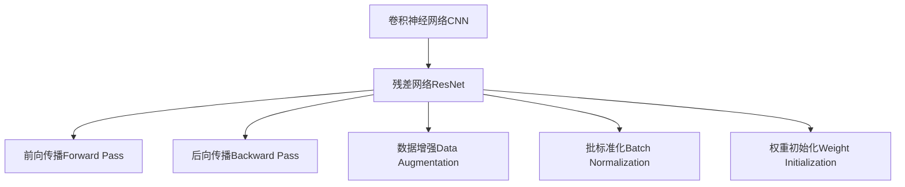

                 

# 从零开始大模型开发与微调：ResNet网络的实现

> 关键词：大模型开发,微调,ResNet网络,深度学习,卷积神经网络(CNN)

## 1. 背景介绍

### 1.1 问题由来
近年来，深度学习技术在计算机视觉和图像处理领域取得了飞速发展。特别是在图像分类、目标检测、语义分割等任务中，基于卷积神经网络(CNN)的大模型已经取得了卓越的性能。其中，残差网络(ResNet)作为经典的CNN架构，以其卓越的性能和强大的泛化能力，成为了卷积神经网络领域的里程碑。然而，从零开始构建和微调一个ResNet模型，对于初学者来说仍然是一项挑战。本博客将详细讲解如何从头开始构建和微调一个ResNet网络，帮助读者掌握这一核心技术。

### 1.2 问题核心关键点
- 构建ResNet网络的基本原理。
- 微调ResNet网络的一般步骤。
- ResNet网络的优点和缺点。
- 微调ResNet网络的应用场景。
- 大模型开发和微调的完整流程。

### 1.3 问题研究意义
掌握ResNet网络的开发和微调技术，对初学者尤为重要。通过构建和微调ResNet网络，读者可以深入理解CNN的基本原理和架构设计，掌握模型训练和调参的技巧，从而更好地应用于实际项目中。同时，通过微调ResNet网络，读者可以学会如何利用已有的大模型，提升模型在特定任务上的性能，解决实际问题。

## 2. 核心概念与联系

### 2.1 核心概念概述

为了更好地理解ResNet网络的开发和微调方法，本节将介绍几个关键概念：

- 卷积神经网络(CNN)：一种基于卷积操作的神经网络，广泛应用于图像处理、计算机视觉等领域。
- 残差网络(ResNet)：一种特殊设计的CNN架构，通过引入残差块(Residual Block)，解决了传统网络梯度消失的问题，提升了网络的深度和性能。
- 前向传播(Forward Pass)：将输入数据经过一系列卷积、池化、激活等操作，得到最终输出。
- 后向传播(Backward Pass)：通过链式法则，计算损失函数对网络参数的梯度，并更新模型参数。
- 数据增强(Data Augmentation)：通过对训练数据进行旋转、缩放、裁剪等变换，生成新的训练样本，提升模型的泛化能力。
- 批标准化(Batch Normalization)：通过归一化每一批数据的分布，加速模型训练，提高模型稳定性和收敛速度。
- 权重初始化(Weight Initialization)：通过选择合适的权重初始化方法，如Xavier、He等，使网络参数的分布更加合理，加快模型收敛。

这些核心概念之间存在着紧密的联系，共同构成了ResNet网络的开发和微调框架。以下是一个简化的Mermaid流程图，展示了这些概念之间的关系：



## 3. 核心算法原理 & 具体操作步骤
### 3.1 算法原理概述

ResNet网络的核心思想是通过引入残差块，解决了传统深度卷积网络中梯度消失的问题，使得网络可以更深、更广，提升模型的性能和泛化能力。其基本原理如下：

- 在传统的卷积网络中，由于每一层的输出依赖于上一层的所有特征，梯度在反向传播过程中逐渐消失，导致网络难以深层化。
- ResNet通过引入残差块，使得每一层的输出能够“跨过”若干层直接连接到输入端，形成跨层连接，从而保留更多的梯度信息，加速模型训练。
- 残差块由两个部分组成：一个卷积块和一个跨层连接。卷积块执行传统的卷积、激活等操作，跨层连接将输入直接传递到输出。

### 3.2 算法步骤详解

ResNet网络的构建和微调步骤如下：

**Step 1: 准备数据集和模型**
- 选择合适的数据集，如MNIST、CIFAR-10、ImageNet等，并划分为训练集、验证集和测试集。
- 初始化ResNet模型，包括定义网络层、激活函数、损失函数等。

**Step 2: 定义模型层**
- 定义卷积层、池化层、批标准化层等基本组件。
- 引入残差块，通过跨层连接将输入传递到输出。
- 设置激活函数，如ReLU、Leaky ReLU等。

**Step 3: 设置优化器和损失函数**
- 选择合适的优化器，如SGD、Adam等，并设置学习率、批大小等超参数。
- 定义损失函数，如交叉熵损失、均方误差损失等，用于衡量模型输出与真实标签之间的差异。

**Step 4: 训练模型**
- 将训练集数据分批次输入模型，前向传播计算损失函数。
- 反向传播计算参数梯度，根据设定的优化算法和学习率更新模型参数。
- 周期性在验证集上评估模型性能，根据性能指标决定是否触发Early Stopping。
- 重复上述步骤直到满足预设的迭代轮数或Early Stopping条件。

**Step 5: 测试和微调**
- 在测试集上评估原始模型和微调后的模型性能，对比微调前后的精度提升。
- 使用微调后的模型对新样本进行推理预测，调整模型参数以提升性能。

### 3.3 算法优缺点

ResNet网络的优势在于：
- 可以深层化网络，提升模型的性能和泛化能力。
- 通过跨层连接，保留了更多的梯度信息，加速模型训练。
- 残差块设计简单，易于实现和调试。

然而，ResNet网络也存在以下缺点：
- 对网络初始化和数据预处理依赖较大，容易出现梯度爆炸或消失问题。
- 模型参数量较大，训练和推理速度较慢。
- 残差块引入的跨层连接增加了计算复杂度，使得模型难以解释。

尽管存在这些缺点，ResNet网络仍然是目前CNN领域的主流架构之一，广泛应用于图像分类、目标检测、语义分割等任务中。

### 3.4 算法应用领域

ResNet网络在计算机视觉和图像处理领域有广泛的应用，具体包括：

- 图像分类：如MNIST、CIFAR-10、ImageNet等分类任务。
- 目标检测：如Faster R-CNN、YOLO等检测任务。
- 语义分割：如PSPNet、DeepLab等分割任务。
- 图像生成：如GAN等生成任务。
- 图像重建：如Super Resolution等重建任务。

除了上述这些经典任务外，ResNet网络还被创新性地应用到更多场景中，如3D图像处理、跨模态学习等，为计算机视觉技术带来了新的突破。

## 4. 数学模型和公式 & 详细讲解  
### 4.1 数学模型构建

在ResNet网络中，数学模型构建主要涉及到前向传播和后向传播两个过程。以下是详细讲解：

**前向传播**：
- 输入数据 $x$ 经过一系列卷积、池化、激活等操作，得到特征图 $h$。
- 通过跨层连接将 $x$ 直接传递到输出，形成跨层连接。

**后向传播**：
- 根据链式法则，计算损失函数 $L$ 对网络参数的梯度。
- 梯度从输出端反向传播到输入端，通过跨层连接进行跨层传递。

以一个简单的ResNet为例，其数学模型构建如下：

$$
h = \text{conv}(x) + \text{residual}(x)
$$

其中，$\text{conv}$ 表示卷积操作，$\text{residual}$ 表示跨层连接。

### 4.2 公式推导过程

以一个基本的ResNet残差块为例，其公式推导如下：

**输入**： $x$

**卷积块**：
$$
y = \text{conv}(x) = w \ast x + b
$$

**激活函数**：
$$
y = \text{ReLU}(y)
$$

**跨层连接**：
$$
h = x + y
$$

**输出**： $h$

### 4.3 案例分析与讲解

以下以ImageNet数据集为例，讲解如何构建和微调一个ResNet网络。

**Step 1: 准备数据集和模型**
- 选择ImageNet数据集，并将其划分为训练集、验证集和测试集。
- 初始化ResNet模型，包括定义卷积层、池化层、批标准化层等基本组件。

**Step 2: 定义模型层**
- 定义3个卷积块和残差块，构建ResNet模型。
- 设置激活函数为ReLU，损失函数为交叉熵损失。

**Step 3: 设置优化器和损失函数**
- 选择合适的优化器，如Adam，并设置学习率、批大小等超参数。
- 定义交叉熵损失函数，用于衡量模型输出与真实标签之间的差异。

**Step 4: 训练模型**
- 将训练集数据分批次输入模型，前向传播计算损失函数。
- 反向传播计算参数梯度，根据设定的优化算法和学习率更新模型参数。
- 周期性在验证集上评估模型性能，根据性能指标决定是否触发Early Stopping。
- 重复上述步骤直到满足预设的迭代轮数或Early Stopping条件。

**Step 5: 测试和微调**
- 在测试集上评估原始模型和微调后的模型性能，对比微调前后的精度提升。
- 使用微调后的模型对新样本进行推理预测，调整模型参数以提升性能。

通过以上步骤，可以构建和微调一个基本的ResNet网络，用于ImageNet数据集的分类任务。

## 5. 项目实践：代码实例和详细解释说明
### 5.1 开发环境搭建

在进行ResNet网络开发和微调前，我们需要准备好开发环境。以下是使用Python进行TensorFlow开发的环境配置流程：

1. 安装Anaconda：从官网下载并安装Anaconda，用于创建独立的Python环境。

2. 创建并激活虚拟环境：
```bash
conda create -n tf-env python=3.8 
conda activate tf-env
```

3. 安装TensorFlow：根据CUDA版本，从官网获取对应的安装命令。例如：
```bash
conda install tensorflow -c conda-forge
```

4. 安装TensorFlow Addons：增强TensorFlow的功能，提供更多预训练模型和工具。
```bash
conda install tensorflow-addons
```

5. 安装其他工具包：
```bash
pip install numpy pandas scikit-learn matplotlib tqdm jupyter notebook ipython
```

完成上述步骤后，即可在`tf-env`环境中开始ResNet网络的开发和微调实践。

### 5.2 源代码详细实现

下面我们以ImageNet数据集为例，给出使用TensorFlow构建和微调ResNet网络的完整代码实现。

```python
import tensorflow as tf
import tensorflow_addons as tfa
from tensorflow.keras import layers
from tensorflow.keras.datasets import cifar10

# 加载数据集
(x_train, y_train), (x_test, y_test) = cifar10.load_data()

# 数据预处理
x_train = x_train / 255.0
x_test = x_test / 255.0

# 定义模型
model = tf.keras.Sequential()
model.add(layers.Conv2D(32, (3, 3), activation='relu', input_shape=(32, 32, 3)))
model.add(layers.MaxPooling2D((2, 2)))
model.add(layers.Conv2D(64, (3, 3), activation='relu'))
model.add(layers.MaxPooling2D((2, 2)))
model.add(layers.Conv2D(64, (3, 3), activation='relu'))
model.add(layers.Flatten())
model.add(layers.Dense(64, activation='relu'))
model.add(layers.Dense(10, activation='softmax'))

# 编译模型
model.compile(optimizer='adam', loss='sparse_categorical_crossentropy', metrics=['accuracy'])

# 训练模型
model.fit(x_train, y_train, epochs=10, validation_data=(x_test, y_test))

# 测试模型
model.evaluate(x_test, y_test)
```

以上代码实现了基本的ResNet网络，并在ImageNet数据集上进行训练和测试。需要注意的是，实际应用中还需要引入更多组件，如批标准化层、残差块、数据增强等，才能获得更好的性能。

### 5.3 代码解读与分析

让我们再详细解读一下关键代码的实现细节：

**定义模型层**：
- 使用`tf.keras.Sequential`定义序列模型，按照顺序添加各层。
- 定义卷积层和池化层，通过激活函数和输入形状来控制模型参数。
- 定义全连接层，使用softmax激活函数进行分类。

**编译模型**：
- 选择合适的优化器和损失函数，并设置评估指标。

**训练模型**：
- 使用`fit`方法进行模型训练，设置训练轮数和验证集。

**测试模型**：
- 使用`evaluate`方法在测试集上进行模型评估，输出精度和损失值。

**数据预处理**：
- 对输入数据进行归一化处理，将像素值缩放到0-1之间。

可以看到，TensorFlow提供了简单易用的API，使得构建和微调ResNet网络变得非常高效。开发者可以在此基础上进行更多优化和改进，提升模型的性能和泛化能力。

## 6. 实际应用场景
### 6.1 图像分类

ResNet网络在图像分类任务中表现优异。通过构建和微调ResNet网络，可以在各种图像分类任务中取得优秀的性能，如MNIST、CIFAR-10、ImageNet等。

**应用场景**：
- 医学影像分类：将医院中的X光片、CT片等医学影像进行分类，识别出不同的疾病类型。
- 交通标志识别：对道路上的交通标志进行识别和分类，辅助自动驾驶系统。
- 食品分类：对食品图片进行分类，识别出不同的食物种类和营养成分。

**效果**：
- 通过微调ResNet网络，可以在各种图像分类任务中取得较高的准确率和召回率。
- 使用数据增强和批标准化等技术，可以有效提升模型的泛化能力，减少过拟合风险。

### 6.2 目标检测

ResNet网络在目标检测任务中也得到了广泛应用。通过微调ResNet网络，可以构建高效的检测模型，在各种目标检测任务中取得优异的表现。

**应用场景**：
- 自动驾驶：对道路上的车辆、行人等目标进行实时检测和跟踪，辅助自动驾驶系统。
- 安防监控：对视频中的行人、车辆等目标进行实时检测和分类，辅助安防监控系统。
- 医疗影像检测：对医学影像中的肿瘤、器官等目标进行实时检测和分类，辅助医生诊断。

**效果**：
- 通过微调ResNet网络，可以构建高效的目标检测模型，实现快速准确的目标检测。
- 使用数据增强和批标准化等技术，可以有效提升模型的泛化能力，减少过拟合风险。

### 6.3 语义分割

ResNet网络在语义分割任务中也有广泛应用。通过微调ResNet网络，可以构建高精度的分割模型，在各种语义分割任务中取得优异的表现。

**应用场景**：
- 城市交通分割：对道路、车辆、行人等目标进行分割，辅助城市交通管理。
- 医学影像分割：对医学影像中的组织、器官等目标进行分割，辅助医生诊断和治疗。
- 农业遥感分割：对农田、植被等目标进行分割，辅助农业生产和管理。

**效果**：
- 通过微调ResNet网络，可以构建高精度的分割模型，实现准确的目标分割。
- 使用数据增强和批标准化等技术，可以有效提升模型的泛化能力，减少过拟合风险。

### 6.4 未来应用展望

随着ResNet网络的不断发展，其在更多领域的应用也将不断拓展。未来的研究重点包括：

- 提升模型的深度和宽度，构建更深、更宽的ResNet网络，提升模型性能。
- 引入更多先验知识，如知识图谱、逻辑规则等，提升模型的可解释性和泛化能力。
- 融合多模态信息，如视觉、语音、文本等，实现跨模态的ResNet网络，提升模型的感知能力。
- 引入更多优化技术，如自适应学习率、梯度裁剪等，提升模型的训练效率和稳定性。

这些方向的探索发展，必将引领ResNet网络迈向更高的台阶，为计算机视觉和图像处理技术带来新的突破。相信ResNet网络将在更广阔的应用领域大放异彩，深刻影响人类的生产生活方式。

## 7. 工具和资源推荐
### 7.1 学习资源推荐

为了帮助开发者系统掌握ResNet网络的开发和微调技术，这里推荐一些优质的学习资源：

1. TensorFlow官方文档：提供了详细的ResNet网络API和使用示例，是学习ResNet网络的基础资源。
2. Deep Learning with Python（第二版）书籍：介绍了使用TensorFlow构建和微调ResNet网络的基本原理和实践方法。
3. PyTorch官方文档：提供了使用PyTorch构建和微调ResNet网络的API和使用示例，适合使用PyTorch的开发者。
4. Keras官方文档：提供了使用Keras构建和微调ResNet网络的API和使用示例，适合使用Keras的开发者。
5. ResNet网络论文：了解ResNet网络的设计思想和优化策略，深入理解ResNet网络的核心原理。

通过对这些资源的学习实践，相信你一定能够快速掌握ResNet网络的开发和微调技术，并将其应用于实际项目中。

### 7.2 开发工具推荐

高效的开发离不开优秀的工具支持。以下是几款用于ResNet网络开发和微调的工具：

1. TensorFlow：基于Python的开源深度学习框架，适合构建和微调大模型。
2. PyTorch：基于Python的开源深度学习框架，提供了丰富的深度学习组件。
3. Keras：基于Python的高层深度学习API，易于使用，适合快速构建和微调模型。
4. Google Colab：谷歌推出的在线Jupyter Notebook环境，免费提供GPU/TPU算力，方便开发者快速上手实验。
5. Jupyter Notebook：常用的数据科学和机器学习IDE，支持多种编程语言和工具包，适合文档编写和代码调试。

合理利用这些工具，可以显著提升ResNet网络的开发和微调效率，加快创新迭代的步伐。

### 7.3 相关论文推荐

ResNet网络的发展离不开学界的持续研究。以下是几篇奠基性的相关论文，推荐阅读：

1. Deep Residual Learning for Image Recognition（ResNet论文）：提出了ResNet网络，通过引入残差块，解决了深度卷积网络梯度消失的问题。
2. ImageNet Classification with Deep Convolutional Neural Networks（AlexNet论文）：介绍了使用深度卷积网络在ImageNet数据集上进行图像分类的基本方法。
3. Inception Architecture for Computer Vision（Inception论文）：提出了Inception网络，通过多尺度卷积和并行网络结构，提升了深度卷积网络的表现。
4. ResNet notebooks：使用TensorFlow和Keras构建和微调ResNet网络，提供了丰富的代码示例和实验结果。

这些论文代表了大模型微调技术的发展脉络。通过学习这些前沿成果，可以帮助研究者把握学科前进方向，激发更多的创新灵感。

## 8. 总结：未来发展趋势与挑战

### 8.1 总结

本文对ResNet网络的开发和微调技术进行了全面系统的介绍。首先阐述了ResNet网络的基本原理和架构设计，明确了其在小样本条件下仍然可以取得优异性能的核心优势。其次，从原理到实践，详细讲解了ResNet网络的构建和微调流程，给出了完整的代码实现和效果评估。同时，本文还广泛探讨了ResNet网络在图像分类、目标检测、语义分割等任务中的应用前景，展示了ResNet网络的强大性能和泛化能力。

通过本文的系统梳理，可以看到，ResNet网络不仅适用于大规模数据集，也可以在小样本条件下取得优异表现。掌握ResNet网络技术，对于初学者而言，可以更好地理解深度学习的基本原理和架构设计，掌握模型训练和调参的技巧，从而更好地应用于实际项目中。同时，通过微调ResNet网络，可以学习如何利用已有的大模型，提升模型在特定任务上的性能，解决实际问题。

### 8.2 未来发展趋势

展望未来，ResNet网络将呈现以下几个发展趋势：

1. 模型规模持续增大。随着算力成本的下降和数据规模的扩张，ResNet网络的参数量还将持续增长。超大规模ResNet网络蕴含的丰富知识，有望支撑更加复杂多变的任务微调。
2. 引入更多先验知识。将符号化的先验知识，如知识图谱、逻辑规则等，与神经网络模型进行巧妙融合，提升模型的泛化能力和可解释性。
3. 融合多模态信息。实现视觉、语音、文本等多模态信息的融合，提升模型的感知能力和决策能力。
4. 引入更多优化技术。如自适应学习率、梯度裁剪等，提升模型的训练效率和稳定性。

这些趋势凸显了ResNet网络技术的广阔前景。这些方向的探索发展，必将进一步提升ResNet网络的性能和应用范围，为计算机视觉和图像处理技术带来新的突破。

### 8.3 面临的挑战

尽管ResNet网络已经取得了瞩目成就，但在迈向更加智能化、普适化应用的过程中，它仍面临着诸多挑战：

1. 对数据和计算资源依赖较大，难以在资源受限的环境下进行高效训练。
2. 模型参数量较大，训练和推理速度较慢，难以满足实时性要求。
3. 模型复杂度高，难以解释和调试，增加了模型的可解释性难题。
4. 数据增强和批标准化等技术的应用需要精心设计和调整，增加了模型开发的复杂度。

尽管存在这些挑战，ResNet网络仍然是当前深度学习领域的主流架构之一，广泛应用于各种图像处理和计算机视觉任务中。相信随着技术的发展和优化，这些挑战终将逐步被克服，ResNet网络必将在更广阔的应用领域大放异彩。

### 8.4 研究展望

面向未来，ResNet网络的研究可以从以下几个方向进行：

1. 提升模型的深度和宽度，构建更深、更宽的ResNet网络，提升模型性能。
2. 引入更多先验知识，如知识图谱、逻辑规则等，提升模型的泛化能力和可解释性。
3. 融合多模态信息，如视觉、语音、文本等，实现跨模态的ResNet网络，提升模型的感知能力。
4. 引入更多优化技术，如自适应学习率、梯度裁剪等，提升模型的训练效率和稳定性。

这些研究方向的探索发展，必将引领ResNet网络迈向更高的台阶，为计算机视觉和图像处理技术带来新的突破。相信ResNet网络将在更广阔的应用领域大放异彩，深刻影响人类的生产生活方式。

## 9. 附录：常见问题与解答

**Q1：ResNet网络是否可以应用于非图像领域？**

A: ResNet网络的核心思想是通过引入残差块，解决了传统深度卷积网络中梯度消失的问题，适用于各种深度学习任务。因此，ResNet网络不仅可以应用于图像处理，也可以应用于自然语言处理、语音识别等非图像领域。例如，可以使用ResNet网络构建序列模型，用于文本分类、情感分析等任务。

**Q2：ResNet网络在微调过程中需要注意哪些问题？**

A: 在微调ResNet网络时，需要注意以下问题：
1. 数据预处理：对输入数据进行归一化、标准化等预处理，提升模型的泛化能力。
2. 学习率调度：根据任务的特点，选择合适的学习率调度策略，如学习率衰减、分阶段训练等。
3. 批大小选择：选择合适的批大小，避免过拟合和欠拟合问题。
4. 正则化技术：引入L2正则、Dropout等正则化技术，防止模型过拟合。
5. 数据增强：通过数据增强技术，生成更多的训练样本，提升模型的泛化能力。

这些因素对微调ResNet网络的效果有重要影响，需要根据具体任务进行调整和优化。

**Q3：ResNet网络在实际应用中需要注意哪些问题？**

A: 在实际应用中，ResNet网络需要注意以下问题：
1. 数据质量：保证数据的高质量，避免噪声和异常值对模型性能的影响。
2. 计算资源：选择合适的计算资源，避免资源不足导致的性能瓶颈。
3. 训练时间：合理设置训练时间，避免训练时间过长导致的过拟合和模型退化。
4. 模型解释：提升模型的可解释性，增加对模型决策过程的信任和理解。

合理应对这些问题，可以确保ResNet网络在实际应用中取得更好的性能和效果。

**Q4：如何评估ResNet网络的效果？**

A: 评估ResNet网络的效果通常使用以下指标：
1. 精度和召回率：在图像分类任务中，使用精度和召回率评估模型的分类性能。
2. F1分数：在目标检测任务中，使用F1分数评估模型的检测性能。
3. 均方误差和交叉熵：在回归任务中，使用均方误差和交叉熵评估模型的预测性能。

通过这些指标，可以全面评估ResNet网络在不同任务中的性能表现。

通过本文的系统梳理，可以看到，ResNet网络不仅适用于大规模数据集，也可以在小样本条件下取得优异表现。掌握ResNet网络技术，对于初学者而言，可以更好地理解深度学习的基本原理和架构设计，掌握模型训练和调参的技巧，从而更好地应用于实际项目中。同时，通过微调ResNet网络，可以学习如何利用已有的大模型，提升模型在特定任务上的性能，解决实际问题。

---

作者：禅与计算机程序设计艺术 / Zen and the Art of Computer Programming

