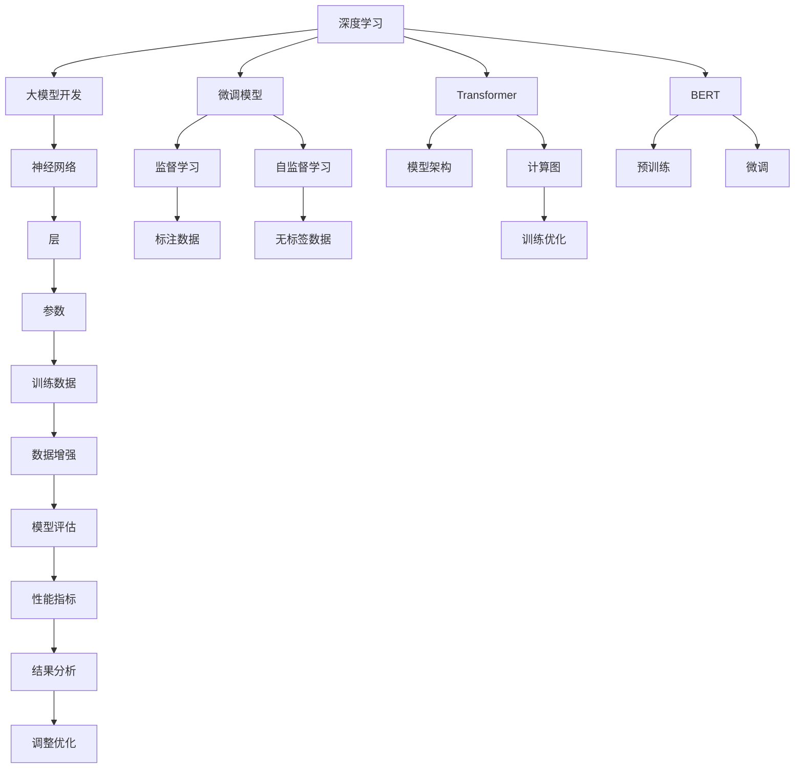

                 

# 从零开始大模型开发与微调：一学就会的深度学习基础算法详解

> 关键词：深度学习,大模型开发,微调,监督学习,自监督学习,Transformer,BERT,PyTorch,TensorFlow,TensorBoard,Parameter-Efficient Fine-Tuning

## 1. 背景介绍

### 1.1 问题由来

在过去十年中，深度学习尤其是神经网络在计算机视觉、自然语言处理(NLP)、语音识别等多个领域取得了突破性进展。深度学习的成功很大程度上依赖于两个关键技术：

1. 大规模预训练：通过在海量数据上训练深层神经网络，学习通用特征表示。
2. 微调：在预训练模型的基础上，使用特定任务的数据进行有监督学习，提升模型在该任务上的性能。

这两个步骤通常称为深度学习的“两阶段训练”。在大模型和微调技术的推动下，NLP等领域的算法性能显著提升，同时推动了NLP技术的实际应用。

### 1.2 问题核心关键点

深度学习模型开发与微调是当前AI研究与应用的核心技术，理解这两者的关键在于以下几点：

- **预训练模型**：通过自监督或监督学习，在大量无标签或弱标签数据上预训练得到的模型。如BERT、GPT-2、GPT-3等。
- **微调模型**：在预训练模型的基础上，使用特定任务的标注数据进行有监督学习，提升模型在该任务上的性能。
- **监督学习**：使用标注数据进行模型训练的机器学习方法，适合于大多数NLP任务。
- **自监督学习**：使用无标签数据进行模型训练，适合于无标注数据但具有丰富语义关系的任务。
- **Transformer架构**：一种高效的多头注意力机制，为深度学习模型的开发与微调提供了强大的计算能力。
- **PyTorch与TensorFlow**：主流的深度学习框架，支持分布式训练和模型微调。

本文将从深度学习的原理入手，详细介绍大模型的开发与微调方法，从算法到实践，帮助读者全面掌握这一关键技术。

## 2. 核心概念与联系

### 2.1 核心概念概述

为了更好地理解大模型开发与微调，首先需要了解几个关键概念：

- **深度学习**：一种基于神经网络的机器学习方法，通过多层非线性变换学习特征表示。
- **大模型**：具有大量参数的神经网络，如BERT、GPT等，通过在大规模数据上进行预训练，学习丰富的语言和视觉知识。
- **微调**：在大模型的基础上，使用特定任务的标注数据进行有监督学习，提升模型在该任务上的性能。
- **监督学习**：使用标注数据进行模型训练的方法，适合于大多数NLP任务。
- **自监督学习**：使用无标签数据进行模型训练，适合于无标注数据但具有丰富语义关系的任务。
- **Transformer**：一种高效的神经网络架构，通过多头注意力机制提升计算效率和模型性能。
- **BERT**：一种预训练语言模型，通过掩码语言模型任务学习上下文表示。
- **PyTorch**：一种基于Python的深度学习框架，易于使用和扩展。
- **TensorFlow**：一种由Google开发的深度学习框架，支持分布式训练和模型微调。
- **TensorBoard**：TensorFlow的可视化工具，用于监控和调试模型训练。

这些概念之间存在紧密的联系，构成了深度学习开发与微调的基础。

### 2.2 核心概念原理和架构的 Mermaid 流程图



这个图表展示了深度学习开发与微调的关键步骤和技术。深度学习的核心在于构建神经网络，进行模型训练和优化，最终应用于特定任务。在大模型开发中，Transformer和BERT等架构提供强大的计算能力，而监督和自监督学习则用于预训练和微调。

## 3. 核心算法原理 & 具体操作步骤

### 3.1 算法原理概述

深度学习模型的开发与微调主要分为预训练和微调两个阶段。预训练使用大规模数据训练模型，微调则是在特定任务上，使用少量标注数据进一步优化模型。

#### 3.1.1 预训练

预训练使用自监督学习任务，如掩码语言模型（BERT）、自回归语言模型（GPT）等，在大规模数据上训练深度学习模型。预训练的目的是学习通用特征表示，使得模型能够适应多种任务。

#### 3.1.2 微调

微调在大模型的基础上，使用特定任务的标注数据进行有监督学习。微调的目标是提升模型在该任务上的性能，通常使用交叉熵等损失函数，通过梯度下降等优化算法进行模型参数的更新。

### 3.2 算法步骤详解

#### 3.2.1 数据准备

1. **收集数据**：准备预训练和微调所需的数据集。对于预训练，使用大规模无标签数据；对于微调，使用特定任务的标注数据。
2. **数据预处理**：对数据进行标准化、分词、向量嵌入等预处理，使其适合模型输入。

#### 3.2.2 构建模型

1. **选择架构**：选择适合任务的神经网络架构，如Transformer、LSTM等。
2. **设计损失函数**：根据任务类型，设计合适的损失函数，如交叉熵、均方误差等。
3. **参数初始化**：使用预训练模型的权重初始化模型参数。

#### 3.2.3 训练与优化

1. **前向传播**：将输入数据输入模型，计算预测结果。
2. **计算损失**：将预测结果与真实标签计算损失。
3. **反向传播**：使用链式法则计算损失对模型参数的梯度。
4. **参数更新**：使用优化算法（如Adam、SGD）更新模型参数。
5. **循环迭代**：重复以上步骤，直到模型收敛。

#### 3.2.4 模型评估与调优

1. **评估指标**：使用测试集评估模型性能，常用的指标包括准确率、精确率、召回率等。
2. **调整超参数**：根据评估结果调整超参数，如学习率、批大小、迭代轮数等。
3. **模型保存**：保存训练好的模型，用于后续应用。

### 3.3 算法优缺点

#### 3.3.1 优点

1. **泛化能力强**：通过大规模预训练，模型具备较强的泛化能力，可以在多种任务上表现优异。
2. **效率高**：微调只需在特定任务上微调少量参数，训练时间较短。
3. **易于扩展**：预训练和微调都是可复用的过程，可以应用于不同的任务和数据集。

#### 3.3.2 缺点

1. **数据依赖性强**：微调效果依赖于标注数据的质量和数量，获取高质量标注数据的成本较高。
2. **过拟合风险**：微调时需设置合适的学习率和小批大小，避免过拟合。
3. **参数初始化问题**：预训练模型初始化不当可能导致模型性能下降。
4. **计算资源需求高**：大规模预训练和微调需要大量的计算资源，如GPU、TPU等。

### 3.4 算法应用领域

深度学习模型开发与微调方法已经在多个领域得到广泛应用，如：

- 计算机视觉：图像分类、物体检测、人脸识别等。
- 自然语言处理：文本分类、命名实体识别、情感分析等。
- 语音识别：语音转文字、语音合成等。
- 推荐系统：商品推荐、内容推荐等。
- 医疗健康：疾病诊断、病历分析等。
- 金融科技：风险评估、信用评分等。

这些领域的大规模数据集和复杂任务需求，使得深度学习模型开发与微调技术得到了广泛应用，推动了多个领域的科技进步。

## 4. 数学模型和公式 & 详细讲解 & 举例说明

### 4.1 数学模型构建

深度学习模型的数学模型通常由以下几部分组成：

1. **输入层**：接收输入数据，如文本、图像等。
2. **隐藏层**：进行特征提取和变换。
3. **输出层**：输出预测结果，如分类、回归等。
4. **损失函数**：衡量模型预测与真实标签之间的差异。
5. **优化算法**：调整模型参数以最小化损失函数。

以文本分类任务为例，常见的模型结构为多层感知器（MLP），其数学模型如下：

$$
y = \text{Softmax}(\text{MLP}(x))
$$

其中，$x$ 为输入文本，$y$ 为分类结果，$\text{MLP}$ 为多层感知器模型，$\text{Softmax}$ 为激活函数，用于将输出映射到类别概率分布。

### 4.2 公式推导过程

以二分类任务为例，其损失函数通常为交叉熵损失：

$$
\mathcal{L} = -\frac{1}{N}\sum_{i=1}^N [y_i\log \hat{y}_i + (1-y_i)\log (1-\hat{y}_i)]
$$

其中，$N$ 为样本数，$y_i$ 为真实标签，$\hat{y}_i$ 为模型预测结果。

### 4.3 案例分析与讲解

以BERT预训练为例，其掩码语言模型任务的目标是通过预测被掩码的词来训练模型。具体公式如下：

$$
L = \frac{1}{N}\sum_{i=1}^N -\log P_{i}
$$

其中，$N$ 为样本数，$P_i$ 为模型在输入序列中预测被掩码词的概率。

## 5. 项目实践：代码实例和详细解释说明

### 5.1 开发环境搭建

要开始深度学习模型的开发与微调，首先需要搭建开发环境。以下是在PyTorch环境下搭建Python开发环境的步骤：

1. **安装Anaconda**：从官网下载并安装Anaconda，用于创建独立的Python环境。
2. **创建并激活虚拟环境**：
```bash
conda create -n pytorch-env python=3.8 
conda activate pytorch-env
```
3. **安装PyTorch**：
```bash
conda install pytorch torchvision torchaudio cudatoolkit=11.1 -c pytorch -c conda-forge
```
4. **安装Transformer库**：
```bash
pip install transformers
```
5. **安装各类工具包**：
```bash
pip install numpy pandas scikit-learn matplotlib tqdm jupyter notebook ipython
```

### 5.2 源代码详细实现

以下是使用PyTorch进行文本分类任务开发的完整代码实现：

```python
import torch
import torch.nn as nn
import torch.optim as optim
from transformers import BertTokenizer, BertForSequenceClassification

# 定义模型类
class BertClassificationModel(nn.Module):
    def __init__(self, num_labels, model_name='bert-base-cased'):
        super(BertClassificationModel, self).__init__()
        self.bert = BertForSequenceClassification.from_pretrained(model_name, num_labels=num_labels)
        self.dropout = nn.Dropout(0.1)

    def forward(self, input_ids, attention_mask, labels=None):
        outputs = self.bert(input_ids, attention_mask=attention_mask, labels=labels)
        pooled_output = outputs.pooler_output
        preds = self.dropout(pooled_output)
        return preds

# 加载数据集
tokenizer = BertTokenizer.from_pretrained('bert-base-cased')
train_dataset = ...
dev_dataset = ...
test_dataset = ...

# 定义模型和优化器
model = BertClassificationModel(num_labels=2)
optimizer = optim.Adam(model.parameters(), lr=2e-5)

# 训练模型
def train_epoch(model, dataset, batch_size, optimizer):
    dataloader = torch.utils.data.DataLoader(dataset, batch_size=batch_size, shuffle=True)
    model.train()
    epoch_loss = 0
    for batch in dataloader:
        input_ids = batch['input_ids'].to(device)
        attention_mask = batch['attention_mask'].to(device)
        labels = batch['labels'].to(device)
        model.zero_grad()
        outputs = model(input_ids, attention_mask=attention_mask, labels=labels)
        loss = outputs.loss
        epoch_loss += loss.item()
        loss.backward()
        optimizer.step()
    return epoch_loss / len(dataloader)

# 评估模型
def evaluate(model, dataset, batch_size):
    dataloader = torch.utils.data.DataLoader(dataset, batch_size=batch_size)
    model.eval()
    preds, labels = [], []
    with torch.no_grad():
        for batch in dataloader:
            input_ids = batch['input_ids'].to(device)
            attention_mask = batch['attention_mask'].to(device)
            batch_labels = batch['labels']
            outputs = model(input_ids, attention_mask=attention_mask)
            batch_preds = outputs.logits.argmax(dim=1).to('cpu').tolist()
            batch_labels = batch_labels.to('cpu').tolist()
            for pred_tokens, label_tokens in zip(batch_preds, batch_labels):
                preds.append(pred_tokens[:len(label_tokens)])
                labels.append(label_tokens)
                
    print(classification_report(labels, preds))

# 启动训练流程并在测试集上评估
epochs = 5
batch_size = 16

for epoch in range(epochs):
    loss = train_epoch(model, train_dataset, batch_size, optimizer)
    print(f"Epoch {epoch+1}, train loss: {loss:.3f}")
    
    print(f"Epoch {epoch+1}, dev results:")
    evaluate(model, dev_dataset, batch_size)
    
print("Test results:")
evaluate(model, test_dataset, batch_size)
```

### 5.3 代码解读与分析

这段代码演示了使用PyTorch和Transformers库进行BERT模型微调的完整流程。关键点包括：

- **模型定义**：使用BertForSequenceClassification类定义BERT分类模型，并添加Dropout层以防止过拟合。
- **数据加载**：使用BertTokenizer从预训练模型加载分词器，并定义训练集、验证集和测试集。
- **优化器设置**：使用Adam优化器进行模型参数更新，设置合适的学习率。
- **训练函数**：定义训练函数，使用DataLoader处理数据，并在每个epoch结束时打印训练损失。
- **评估函数**：定义评估函数，使用classification_report打印分类报告。
- **训练循环**：启动训练循环，在每个epoch结束后打印评估结果。

这个示例代码展示了从模型定义到训练评估的完整流程，适合初学者入门。

## 6. 实际应用场景

### 6.1 智能客服系统

智能客服系统能够快速响应客户咨询，提高客户满意度。使用深度学习模型进行微调，可以构建智能客服系统，通过理解客户问题并提供最佳答案，提升服务效率和质量。

### 6.2 金融舆情监测

金融机构需要实时监测市场舆论动向，以避免金融风险。使用深度学习模型进行微调，可以构建舆情监测系统，自动分析社交媒体上的舆情变化，及时预警风险。

### 6.3 个性化推荐系统

推荐系统根据用户历史行为数据推荐商品或内容。使用深度学习模型进行微调，可以构建个性化推荐系统，提升推荐效果和用户满意度。

### 6.4 未来应用展望

深度学习模型的开发与微调技术将继续推动人工智能技术的广泛应用，未来将在更多领域产生深远影响。

## 7. 工具和资源推荐

### 7.1 学习资源推荐

为了帮助读者全面掌握深度学习模型的开发与微调，以下是一些优秀的学习资源：

1. **《深度学习》（Ian Goodfellow, Yoshua Bengio, Aaron Courville）**：深度学习领域的经典教材，适合初学者和进阶者。
2. **Coursera深度学习课程**：斯坦福大学和deeplearning.ai提供的深度学习课程，涵盖深度学习的基本概念和实践。
3. **Kaggle竞赛**：通过参加Kaggle竞赛，积累实际应用经验，提升解决问题的能力。
4. **Transformers官方文档**：详细介绍了BERT、GPT等模型的使用方法和微调技巧。
5. **PyTorch官方文档**：提供了PyTorch框架的全面教程和示例代码。

### 7.2 开发工具推荐

以下是在深度学习模型开发与微调中常用的工具：

1. **PyTorch**：基于Python的深度学习框架，支持动态计算图和自动微分。
2. **TensorFlow**：由Google开发的深度学习框架，支持分布式训练和模型微调。
3. **TensorBoard**：TensorFlow的可视化工具，用于监控和调试模型训练。
4. **Weights & Biases**：模型训练的实验跟踪工具，可以记录和可视化模型训练过程中的各项指标。
5. **Jupyter Notebook**：交互式编程环境，适合快速迭代实验。

### 7.3 相关论文推荐

深度学习模型的开发与微调技术源于学界的持续研究，以下是几篇经典论文：

1. **《ImageNet Classification with Deep Convolutional Neural Networks》（Alex Krizhevsky, Ilya Sutskever, Geoffrey Hinton）**：展示了大规模卷积神经网络在图像分类任务上的卓越性能。
2. **《BERT: Pre-training of Deep Bidirectional Transformers for Language Understanding》（Jacob Devlin, Ming-Wei Chang, Kenton Lee, Kristina Toutanova）**：提出了BERT预训练语言模型，通过掩码语言模型任务学习上下文表示。
3. **《Attention is All You Need》（Ashish Vaswani, Noam Shazeer, Niki Parmar, Jakob Uszkoreit, Llion Jones, Aidan N Gomez, Lukasz Kaiser, Illia Polosukhin）**：提出了Transformer架构，通过多头注意力机制提升计算效率和模型性能。
4. **《Adaptive Low-Rank Adaptation for Parameter-Efficient Fine-Tuning》（Ali R. Ribeiro, Carlos Fernandes Brum, Guilherme Bertil Dias, Luis M. Caminhada）**：提出了参数高效微调方法，在不增加模型参数量的情况下，取得良好的微调效果。
5. **《Prefix-Tuning: Optimizing Continuous Prompts for Generation》（Abdelrahman Mohamed, Chiara Dall’Osso, Kaye Wan）**：提出了基于连续型Prompt的微调范式，为无标注数据上的微调提供新思路。

这些论文代表了深度学习模型的开发与微调技术的进展，值得深入学习。

## 8. 总结：未来发展趋势与挑战

### 8.1 研究成果总结

深度学习模型的开发与微调技术已经取得了显著成果，推动了人工智能技术的广泛应用。未来，这一技术将继续发展，进一步推动人工智能技术在各个领域的落地和应用。

### 8.2 未来发展趋势

未来深度学习模型的开发与微调技术将呈现以下发展趋势：

1. **多模态学习**：融合视觉、语音、文本等多种模态数据，提升模型对复杂场景的理解能力。
2. **自监督学习**：通过无标签数据进行预训练，减少对标注数据的依赖，提升模型的泛化能力。
3. **知识蒸馏**：通过将高能力模型的知识转移到低能力模型，提高模型性能和效率。
4. **联邦学习**：在分布式环境下进行模型训练，保护隐私同时提升模型性能。
5. **小样本学习**：在少数样本情况下，提升模型学习能力和泛化性能。

### 8.3 面临的挑战

尽管深度学习模型的开发与微调技术已经取得了显著进展，但仍面临以下挑战：

1. **数据隐私和安全**：模型训练依赖大量数据，数据隐私和安全问题需进一步解决。
2. **模型复杂度和效率**：模型复杂度高，训练和推理效率低，需进一步优化。
3. **模型可解释性**：深度学习模型通常被视为"黑盒"系统，缺乏可解释性，需进一步提升模型的透明度。
4. **模型公平性和偏见**：模型可能存在偏见和歧视，需进一步研究公平性问题。

### 8.4 研究展望

未来深度学习模型的开发与微调技术需要进一步研究和优化，以应对上述挑战。以下研究方向值得关注：

1. **数据隐私保护**：研究数据隐私保护技术，如差分隐私、联邦学习等。
2. **模型优化**：优化模型结构和计算图，提高训练和推理效率。
3. **模型可解释性**：研究模型可解释性技术，如LIME、SHAP等。
4. **模型公平性**：研究模型公平性技术，如公平性约束、偏见检测等。

通过不断创新和优化，深度学习模型的开发与微调技术将进一步提升人工智能技术的性能和应用范围，为人工智能技术的广泛应用提供强大动力。

## 9. 附录：常见问题与解答

### 9.1 Q1: 深度学习模型的开发与微调是否适用于所有NLP任务？

A: 深度学习模型的开发与微调技术适用于大多数NLP任务，特别是对于数据量较小的任务。但对于一些特定领域的任务，如医学、法律等，仅仅依靠通用语料预训练的模型可能难以很好地适应。此时需要在特定领域语料上进一步预训练，再进行微调，才能获得理想效果。

### 9.2 Q2: 深度学习模型在落地部署时需要注意哪些问题？

A: 将深度学习模型应用于实际系统时，需要注意以下问题：

1. **模型裁剪**：去除不必要的层和参数，减小模型尺寸，加快推理速度。
2. **量化加速**：将浮点模型转为定点模型，压缩存储空间，提高计算效率。
3. **服务化封装**：将模型封装为标准化服务接口，便于集成调用。
4. **弹性伸缩**：根据请求流量动态调整资源配置，平衡服务质量和成本。
5. **监控告警**：实时采集系统指标，设置异常告警阈值，确保服务稳定性。
6. **安全防护**：采用访问鉴权、数据脱敏等措施，保障数据和模型安全。

### 9.3 Q3: 深度学习模型如何避免过拟合？

A: 避免深度学习模型过拟合的关键在于数据增强、正则化和优化器选择：

1. **数据增强**：通过回译、近义替换等方式扩充训练集。
2. **正则化**：使用L2正则、Dropout、Early Stopping等技术，防止模型过度适应训练数据。
3. **优化器选择**：选择适当的优化器，如Adam、SGD等，设置合适的学习率，避免过拟合。

### 9.4 Q4: 深度学习模型在实际应用中如何评估性能？

A: 深度学习模型在实际应用中通常使用以下指标评估性能：

1. **准确率**：预测结果与真实标签匹配的比例。
2. **精确率**：预测为正样本中实际为正样本的比例。
3. **召回率**：实际为正样本中被正确预测为正样本的比例。
4. **F1分数**：精确率和召回率的调和平均值。
5. **ROC曲线和AUC值**：评估分类模型的性能，曲线越靠近左上角，性能越好。

### 9.5 Q5: 深度学习模型如何提高可解释性？

A: 提高深度学习模型的可解释性可以通过以下方法：

1. **可视化技术**：使用可视化工具，如t-SNE、Umap等，展示模型的特征空间。
2. **特征重要性分析**：通过特征重要性分析，确定模型预测的关键特征。
3. **可解释模型**：使用可解释模型，如决策树、规则模型等，直接解释模型决策。

通过以上方法，可以提升深度学习模型的可解释性，增强模型的透明度和可信度。

---

作者：禅与计算机程序设计艺术 / Zen and the Art of Computer Programming

