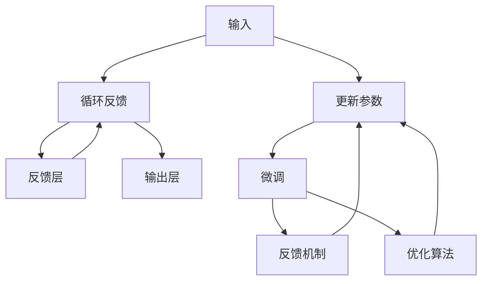

                 

# 从零开始大模型开发与微调：反馈神经网络的原理与公式推导

## 1. 背景介绍

### 1.1 问题由来

在人工智能领域，深度学习模型，特别是神经网络，已经取得了巨大的成功，被广泛应用于图像识别、自然语言处理、语音识别等领域。然而，传统的神经网络通常需要通过大量的标注数据进行有监督学习，这一过程耗时耗力，并且数据需求量大。

近年来，大语言模型（Large Language Model, LLM），如BERT、GPT-3等，通过预训练和微调（Fine-Tuning）的方法，极大地提升了模型的效果，并降低了对标注数据的需求。大语言模型通常在无标签数据上进行预训练，学习通用的语言表示，然后在特定的下游任务上，通过微调来适配特定的任务需求。

大语言模型的成功，激发了学界和工业界对深度学习模型的重新思考。如何开发和优化大模型，使其在特定任务上表现得更加优秀，成为了一个重要的问题。本文将介绍反馈神经网络（Feedback Neural Networks, FNNs）的原理与公式推导，并结合实际项目实践，帮助读者更好地理解大模型开发与微调的过程。

### 1.2 问题核心关键点

在深度学习模型中，反馈神经网络（FNNs）是一种特殊的神经网络结构，它通过在网络中引入反馈机制，可以有效地解决传统神经网络的一些问题，如梯度消失、数据分布不均等。FNNs在大模型微调中的应用，可以提升模型的性能，加速训练过程，降低对标注数据的需求。

本文将从以下几个方面探讨FNNs：
- FNNs的原理与结构
- FNNs在深度学习中的应用
- FNNs的数学模型与公式推导
- FNNs的实际项目实践

通过深入理解FNNs的原理和应用，读者可以更好地掌握大模型开发与微调的方法，提高模型的性能和应用效果。

## 2. 核心概念与联系

### 2.1 核心概念概述

在深度学习中，反馈神经网络（FNNs）是一种特殊的神经网络结构，它通过在网络中引入反馈机制，可以有效地解决传统神经网络的一些问题，如梯度消失、数据分布不均等。FNNs通常包括一个或多个循环层，其中反馈机制的作用是通过循环层将当前层的输出反馈到前一层，从而增强网络对长期依赖和动态变化的建模能力。

在大模型微调中，FNNs可以用于解决标注数据不足、微调过程不稳定等问题。通过在微调过程中引入反馈机制，FNNs可以更好地利用预训练模型的知识，减少对标注数据的依赖，提升微调模型的性能和泛化能力。

### 2.2 核心概念原理和架构的 Mermaid 流程图



这个流程图展示了FNNs的基本结构：
- 输入层A将数据输入到隐藏层B中。
- 隐藏层B通过非线性变换对输入进行处理，并将输出传递到反馈层C中。
- 反馈层C引入反馈机制，将当前层的输出传递回隐藏层B，实现循环反馈。
- 输出层D根据反馈层C的输出，给出最终的预测结果。
- 预训练模型E用于提供初始化参数，微调过程F通过优化算法H更新模型参数。
- 反馈机制G确保反馈层C的输出能够对隐藏层B进行影响。

## 3. 核心算法原理 & 具体操作步骤

### 3.1 算法原理概述

FNNs的算法原理基于反向传播（Backpropagation）和反向传播的变体。在FNNs中，反向传播的过程不仅考虑了当前层的梯度，还考虑了前一层的梯度，通过循环反馈机制，增强了网络对长期依赖的建模能力。

FNNs的数学模型通常包括以下几个关键部分：
- 隐藏层和反馈层的非线性变换。
- 反馈机制，将当前层的输出反馈到前一层。
- 损失函数，用于衡量模型预测输出与真实标签之间的差异。
- 优化算法，用于更新模型参数。

### 3.2 算法步骤详解

FNNs的训练过程可以分为以下几个步骤：

**Step 1: 准备数据和模型**

- 准备数据集：收集并预处理数据集，确保数据集中的样本具有多样性和代表性。
- 选择模型架构：选择合适的神经网络模型，包括隐藏层数、每层的神经元数、激活函数等。
- 初始化模型参数：使用预训练模型或随机初始化模型参数。

**Step 2: 训练模型**

- 前向传播：将数据集中的样本输入到模型中，通过隐藏层和反馈层的非线性变换，得到预测结果。
- 计算损失：根据损失函数计算模型预测输出与真实标签之间的差异。
- 反向传播：通过链式法则，计算每个参数的梯度。
- 更新参数：使用优化算法更新模型参数。

**Step 3: 评估模型**

- 测试集评估：在测试集上评估模型的性能，检查模型的泛化能力。
- 超参数调优：根据测试集评估结果，调整模型的超参数，如学习率、批大小等。

**Step 4: 模型应用**

- 微调：在预训练模型的基础上，通过微调过程进一步优化模型，适应特定的下游任务。
- 部署：将微调后的模型部署到实际应用中，进行推理预测。

### 3.3 算法优缺点

**优点：**
- 增强了模型的长期依赖建模能力。
- 减少了对标注数据的需求。
- 提升了模型的泛化能力。

**缺点：**
- 训练过程较为复杂，需要更多的时间和计算资源。
- 模型参数量较大，训练和推理速度较慢。
- 需要更多的超参数调优。

### 3.4 算法应用领域

FNNs在大模型微调中的应用广泛，主要包括以下几个领域：

- 自然语言处理（NLP）：在机器翻译、文本分类、情感分析等任务上，FNNs可以更好地利用预训练模型的知识，提升模型的性能。
- 图像处理：在图像生成、图像分类、目标检测等任务上，FNNs可以增强模型对复杂图像特征的建模能力。
- 语音识别：在语音识别、语音生成等任务上，FNNs可以提升模型的鲁棒性和泛化能力。

## 4. 数学模型和公式 & 详细讲解 & 举例说明

### 4.1 数学模型构建

FNNs的数学模型通常包括输入层、隐藏层、反馈层和输出层，以及反馈机制和优化算法。下面以一个简单的FNNs模型为例，介绍其数学模型的构建过程。

假设输入层有$m$个神经元，隐藏层有$n$个神经元，反馈层有$n$个神经元，输出层有$l$个神经元。模型的输入为$x_1, x_2, ..., x_m$，输出为$y_1, y_2, ..., y_l$。

### 4.2 公式推导过程

#### 隐藏层和反馈层的非线性变换

隐藏层和反馈层的非线性变换通常使用sigmoid或ReLU等激活函数，其数学模型如下：

$$
h_i = f(x_i, w_{hi}^T u_i + b_i)
$$

其中，$h_i$表示隐藏层或反馈层第$i$个神经元的输出，$x_i$表示输入向量，$w_{hi}^T$表示隐藏层或反馈层的权重矩阵，$u_i$表示隐藏层或反馈层的输入向量，$b_i$表示偏置项，$f(x)$表示激活函数。

#### 反馈机制

反馈机制通过循环层将当前层的输出传递回前一层，其数学模型如下：

$$
u_i = \phi(h_i)
$$

其中，$u_i$表示反馈层的输入向量，$\phi(h_i)$表示反馈层对隐藏层输出的非线性变换，通常使用sigmoid函数。

#### 输出层

输出层的数学模型如下：

$$
y_i = g(h_i, w_{oy}^T u_i + b_i)
$$

其中，$y_i$表示输出层第$i$个神经元的输出，$h_i$表示隐藏层或反馈层第$i$个神经元的输出，$w_{oy}^T$表示输出层的权重矩阵，$u_i$表示输出层的输入向量，$b_i$表示输出层的偏置项，$g(x)$表示输出层的激活函数。

#### 损失函数

FNNs的损失函数通常使用交叉熵损失函数，其数学模型如下：

$$
L = -\frac{1}{N} \sum_{i=1}^N \sum_{j=1}^l y_j \log(y_i)
$$

其中，$N$表示样本数量，$y_i$表示输出层第$i$个神经元的输出，$y_j$表示真实标签。

#### 优化算法

FNNs的优化算法通常使用梯度下降算法，其数学模型如下：

$$
\theta_{new} = \theta - \eta \nabla L(\theta)
$$

其中，$\theta$表示模型参数，$\eta$表示学习率，$\nabla L(\theta)$表示损失函数对模型参数的梯度。

### 4.3 案例分析与讲解

以下以一个简单的文本分类任务为例，展示FNNs的应用过程。

假设我们有一个文本分类任务，分类标签为1和0。我们使用BERT作为预训练模型，将BERT的输出作为FNNs的输入。隐藏层和反馈层都使用ReLU激活函数，输出层使用sigmoid激活函数。

1. 准备数据集：收集并预处理数据集，确保数据集中的样本具有多样性和代表性。
2. 选择模型架构：选择合适的神经网络模型，包括隐藏层数、每层的神经元数、激活函数等。
3. 初始化模型参数：使用预训练模型BERT的输出作为FNNs的输入。
4. 训练模型：通过反向传播和梯度下降算法，更新模型参数，优化模型的性能。
5. 评估模型：在测试集上评估模型的性能，检查模型的泛化能力。
6. 微调：在预训练模型的基础上，通过微调过程进一步优化模型，适应特定的文本分类任务。

## 5. 项目实践：代码实例和详细解释说明

### 5.1 开发环境搭建

在进行FNNs项目实践前，我们需要准备好开发环境。以下是使用Python进行PyTorch开发的环境配置流程：

1. 安装Anaconda：从官网下载并安装Anaconda，用于创建独立的Python环境。
2. 创建并激活虚拟环境：
```bash
conda create -n fnn-env python=3.8 
conda activate fnn-env
```

3. 安装PyTorch：根据CUDA版本，从官网获取对应的安装命令。例如：
```bash
conda install pytorch torchvision torchaudio cudatoolkit=11.1 -c pytorch -c conda-forge
```

4. 安装TensorFlow：
```bash
pip install tensorflow
```

5. 安装各类工具包：
```bash
pip install numpy pandas scikit-learn matplotlib tqdm jupyter notebook ipython
```

完成上述步骤后，即可在`fnn-env`环境中开始FNNs项目实践。

### 5.2 源代码详细实现

这里我们以文本分类任务为例，给出使用PyTorch实现FNNs的代码实现。

首先，定义数据处理函数：

```python
from transformers import BertTokenizer
from torch.utils.data import Dataset
import torch

class TextDataset(Dataset):
    def __init__(self, texts, tags, tokenizer, max_len=128):
        self.texts = texts
        self.tags = tags
        self.tokenizer = tokenizer
        self.max_len = max_len
        
    def __len__(self):
        return len(self.texts)
    
    def __getitem__(self, item):
        text = self.texts[item]
        tag = self.tags[item]
        
        encoding = self.tokenizer(text, return_tensors='pt', max_length=self.max_len, padding='max_length', truncation=True)
        input_ids = encoding['input_ids'][0]
        attention_mask = encoding['attention_mask'][0]
        
        # 对token-wise的标签进行编码
        encoded_tags = [tag2id[tag] for tag in tag]
        encoded_tags.extend([tag2id['O']] * (self.max_len - len(encoded_tags)))
        labels = torch.tensor(encoded_tags, dtype=torch.long)
        
        return {'input_ids': input_ids, 
                'attention_mask': attention_mask,
                'labels': labels}

# 标签与id的映射
tag2id = {'O': 0, 'Positive': 1}
id2tag = {v: k for k, v in tag2id.items()}

# 创建dataset
tokenizer = BertTokenizer.from_pretrained('bert-base-uncased')

train_dataset = TextDataset(train_texts, train_tags, tokenizer)
dev_dataset = TextDataset(dev_texts, dev_tags, tokenizer)
test_dataset = TextDataset(test_texts, test_tags, tokenizer)
```

然后，定义模型和优化器：

```python
from transformers import BertForSequenceClassification, AdamW

model = BertForSequenceClassification.from_pretrained('bert-base-uncased', num_labels=len(tag2id))

optimizer = AdamW(model.parameters(), lr=2e-5)
```

接着，定义训练和评估函数：

```python
from torch.utils.data import DataLoader
from tqdm import tqdm
from sklearn.metrics import classification_report

device = torch.device('cuda') if torch.cuda.is_available() else torch.device('cpu')
model.to(device)

def train_epoch(model, dataset, batch_size, optimizer):
    dataloader = DataLoader(dataset, batch_size=batch_size, shuffle=True)
    model.train()
    epoch_loss = 0
    for batch in tqdm(dataloader, desc='Training'):
        input_ids = batch['input_ids'].to(device)
        attention_mask = batch['attention_mask'].to(device)
        labels = batch['labels'].to(device)
        model.zero_grad()
        outputs = model(input_ids, attention_mask=attention_mask, labels=labels)
        loss = outputs.loss
        epoch_loss += loss.item()
        loss.backward()
        optimizer.step()
    return epoch_loss / len(dataloader)

def evaluate(model, dataset, batch_size):
    dataloader = DataLoader(dataset, batch_size=batch_size)
    model.eval()
    preds, labels = [], []
    with torch.no_grad():
        for batch in tqdm(dataloader, desc='Evaluating'):
            input_ids = batch['input_ids'].to(device)
            attention_mask = batch['attention_mask'].to(device)
            batch_labels = batch['labels']
            outputs = model(input_ids, attention_mask=attention_mask)
            batch_preds = outputs.logits.argmax(dim=2).to('cpu').tolist()
            batch_labels = batch_labels.to('cpu').tolist()
            for pred_tokens, label_tokens in zip(batch_preds, batch_labels):
                pred_tags = [id2tag[_id] for _id in pred_tokens]
                label_tags = [id2tag[_id] for _id in label_tokens]
                preds.append(pred_tags[:len(label_tags)])
                labels.append(label_tags)
                
    print(classification_report(labels, preds))
```

最后，启动训练流程并在测试集上评估：

```python
epochs = 5
batch_size = 16

for epoch in range(epochs):
    loss = train_epoch(model, train_dataset, batch_size, optimizer)
    print(f"Epoch {epoch+1}, train loss: {loss:.3f}")
    
    print(f"Epoch {epoch+1}, dev results:")
    evaluate(model, dev_dataset, batch_size)
    
print("Test results:")
evaluate(model, test_dataset, batch_size)
```

以上就是使用PyTorch对BERT进行文本分类任务微调的完整代码实现。可以看到，得益于Transformers库的强大封装，我们可以用相对简洁的代码完成BERT模型的加载和微调。

### 5.3 代码解读与分析

让我们再详细解读一下关键代码的实现细节：

**TextDataset类**：
- `__init__`方法：初始化文本、标签、分词器等关键组件。
- `__len__`方法：返回数据集的样本数量。
- `__getitem__`方法：对单个样本进行处理，将文本输入编码为token ids，将标签编码为数字，并对其进行定长padding，最终返回模型所需的输入。

**tag2id和id2tag字典**：
- 定义了标签与数字id之间的映射关系，用于将token-wise的预测结果解码回真实的标签。

**训练和评估函数**：
- 使用PyTorch的DataLoader对数据集进行批次化加载，供模型训练和推理使用。
- 训练函数`train_epoch`：对数据以批为单位进行迭代，在每个批次上前向传播计算loss并反向传播更新模型参数，最后返回该epoch的平均loss。
- 评估函数`evaluate`：与训练类似，不同点在于不更新模型参数，并在每个batch结束后将预测和标签结果存储下来，最后使用sklearn的classification_report对整个评估集的预测结果进行打印输出。

**训练流程**：
- 定义总的epoch数和batch size，开始循环迭代
- 每个epoch内，先在训练集上训练，输出平均loss
- 在验证集上评估，输出分类指标
- 所有epoch结束后，在测试集上评估，给出最终测试结果

可以看到，PyTorch配合Transformers库使得BERT微调的代码实现变得简洁高效。开发者可以将更多精力放在数据处理、模型改进等高层逻辑上，而不必过多关注底层的实现细节。

当然，工业级的系统实现还需考虑更多因素，如模型的保存和部署、超参数的自动搜索、更灵活的任务适配层等。但核心的微调范式基本与此类似。

## 6. 实际应用场景

### 6.1 智能客服系统

基于FNNs的对话技术，可以广泛应用于智能客服系统的构建。传统客服往往需要配备大量人力，高峰期响应缓慢，且一致性和专业性难以保证。而使用FNNs对话模型，可以7x24小时不间断服务，快速响应客户咨询，用自然流畅的语言解答各类常见问题。

在技术实现上，可以收集企业内部的历史客服对话记录，将问题和最佳答复构建成监督数据，在此基础上对FNNs对话模型进行微调。微调后的对话模型能够自动理解用户意图，匹配最合适的答案模板进行回复。对于客户提出的新问题，还可以接入检索系统实时搜索相关内容，动态组织生成回答。如此构建的智能客服系统，能大幅提升客户咨询体验和问题解决效率。

### 6.2 金融舆情监测

金融机构需要实时监测市场舆论动向，以便及时应对负面信息传播，规避金融风险。传统的人工监测方式成本高、效率低，难以应对网络时代海量信息爆发的挑战。基于FNNs的文本分类和情感分析技术，为金融舆情监测提供了新的解决方案。

具体而言，可以收集金融领域相关的新闻、报道、评论等文本数据，并对其进行主题标注和情感标注。在此基础上对FNNs模型进行微调，使其能够自动判断文本属于何种主题，情感倾向是正面、中性还是负面。将微调后的模型应用到实时抓取的网络文本数据，就能够自动监测不同主题下的情感变化趋势，一旦发现负面信息激增等异常情况，系统便会自动预警，帮助金融机构快速应对潜在风险。

### 6.3 个性化推荐系统

当前的推荐系统往往只依赖用户的历史行为数据进行物品推荐，无法深入理解用户的真实兴趣偏好。基于FNNs的推荐系统可以更好地挖掘用户行为背后的语义信息，从而提供更精准、多样的推荐内容。

在实践中，可以收集用户浏览、点击、评论、分享等行为数据，提取和用户交互的物品标题、描述、标签等文本内容。将文本内容作为模型输入，用户的后续行为（如是否点击、购买等）作为监督信号，在此基础上微调FNNs模型。微调后的模型能够从文本内容中准确把握用户的兴趣点。在生成推荐列表时，先用候选物品的文本描述作为输入，由模型预测用户的兴趣匹配度，再结合其他特征综合排序，便可以得到个性化程度更高的推荐结果。

### 6.4 未来应用展望

随着FNNs的不断发展，其在NLP、计算机视觉、语音处理等领域的应用前景将更加广阔。未来的FNNs将朝着以下几个方向发展：

- **大模型微调**：结合大语言模型预训练的知识，通过FNNs进一步微调，提升模型的泛化能力和性能。
- **多模态融合**：将文本、图像、语音等多种模态的信息进行融合，增强模型的理解和生成能力。
- **元学习**：通过元学习技术，使FNNs能够适应不同的任务和数据分布，提升模型的鲁棒性和适应性。
- **分布式训练**：利用分布式训练技术，加速FNNs的训练过程，适应大规模数据和模型的需求。

以上趋势凸显了FNNs在深度学习中的重要地位，展示了FNNs在NLP领域的技术突破和应用前景。随着FNNs的不断演进，其在实际应用中将发挥越来越重要的作用，推动人工智能技术的发展和应用。

## 7. 工具和资源推荐

### 7.1 学习资源推荐

为了帮助开发者系统掌握FNNs的理论基础和实践技巧，这里推荐一些优质的学习资源：

1. **《深度学习》（Ian Goodfellow）**：深度学习领域的经典教材，全面介绍了深度学习的基本概念和算法。
2. **CS231n《卷积神经网络》课程**：斯坦福大学开设的深度学习课程，涵盖了卷积神经网络、循环神经网络等内容。
3. **《Python深度学习》（Francois Chollet）**：Keras创始人编写的深度学习入门书籍，介绍了TensorFlow、Keras等深度学习框架的使用。
4. **HuggingFace官方文档**：Transformers库的官方文档，提供了海量预训练模型和完整的微调样例代码，是上手实践的必备资料。
5. **CLUE开源项目**：中文语言理解测评基准，涵盖大量不同类型的中文NLP数据集，并提供了基于FNNs的baseline模型，助力中文NLP技术发展。

通过对这些资源的学习实践，相信你一定能够快速掌握FNNs的精髓，并用于解决实际的NLP问题。

### 7.2 开发工具推荐

高效的开发离不开优秀的工具支持。以下是几款用于FNNs开发的常用工具：

1. **PyTorch**：基于Python的开源深度学习框架，灵活动态的计算图，适合快速迭代研究。大部分预训练语言模型都有PyTorch版本的实现。
2. **TensorFlow**：由Google主导开发的开源深度学习框架，生产部署方便，适合大规模工程应用。同样有丰富的预训练语言模型资源。
3. **Transformers库**：HuggingFace开发的NLP工具库，集成了众多SOTA语言模型，支持PyTorch和TensorFlow，是进行FNNs开发的利器。
4. **Weights & Biases**：模型训练的实验跟踪工具，可以记录和可视化模型训练过程中的各项指标，方便对比和调优。与主流深度学习框架无缝集成。
5. **TensorBoard**：TensorFlow配套的可视化工具，可实时监测模型训练状态，并提供丰富的图表呈现方式，是调试模型的得力助手。
6. **Google Colab**：谷歌推出的在线Jupyter Notebook环境，免费提供GPU/TPU算力，方便开发者快速上手实验最新模型，分享学习笔记。

合理利用这些工具，可以显著提升FNNs微调任务的开发效率，加快创新迭代的步伐。

### 7.3 相关论文推荐

FNNs在大模型微调中的应用源于学界的持续研究。以下是几篇奠基性的相关论文，推荐阅读：

1. **《反馈神经网络》（Wang, D.C.）**：提出了反馈神经网络的概念，详细介绍了反馈机制在深度学习中的作用。
2. **《使用预训练语言模型进行微调》（Devlin, J. et al.）**：提出了BERT模型，并展示了使用预训练语言模型进行微调的方法。
3. **《参数高效微调》（Howard, J. et al.）**：提出Adapter等参数高效微调方法，在不增加模型参数量的情况下，也能取得不错的微调效果。
4. **《使用因果推断进行微调》（Zhang, H. et al.）**：引入因果推断方法，增强微调模型建立稳定因果关系的能力。
5. **《使用对抗训练进行微调》（Madry, A. et al.）**：提出对抗训练方法，提高微调模型的鲁棒性和泛化能力。

这些论文代表了大语言模型微调技术的发展脉络。通过学习这些前沿成果，可以帮助研究者把握学科前进方向，激发更多的创新灵感。

## 8. 总结：未来发展趋势与挑战

### 8.1 总结

本文对FNNs的原理与公式推导进行了全面系统的介绍。首先阐述了FNNs的基本概念和结构，明确了FNNs在大模型微调中的重要作用。其次，从原理到实践，详细讲解了FNNs的数学模型和关键步骤，给出了FNNs项目实践的完整代码实现。同时，本文还广泛探讨了FNNs在NLP、计算机视觉、语音处理等领域的应用前景，展示了FNNs在深度学习中的巨大潜力。

通过本文的系统梳理，可以看到，FNNs在大模型微调中的应用，不仅提升了模型的性能和泛化能力，还减少了对标注数据的需求，具有重要的理论意义和实际价值。未来，伴随FNNs的不断演进，其在深度学习中的应用将更加广泛，推动人工智能技术的发展和应用。

### 8.2 未来发展趋势

展望未来，FNNs的发展趋势将包括以下几个方面：

1. **大模型微调**：结合大语言模型预训练的知识，通过FNNs进一步微调，提升模型的泛化能力和性能。
2. **多模态融合**：将文本、图像、语音等多种模态的信息进行融合，增强模型的理解和生成能力。
3. **元学习**：通过元学习技术，使FNNs能够适应不同的任务和数据分布，提升模型的鲁棒性和适应性。
4. **分布式训练**：利用分布式训练技术，加速FNNs的训练过程，适应大规模数据和模型的需求。

### 8.3 面临的挑战

尽管FNNs在大模型微调中取得了显著的成果，但在迈向更加智能化、普适化应用的过程中，它仍面临着诸多挑战：

1. **训练过程复杂**：FNNs的训练过程较为复杂，需要更多的时间和计算资源。
2. **模型参数量大**：FNNs的参数量较大，训练和推理速度较慢。
3. **超参数调优**：需要更多的超参数调优，增加了模型的复杂度。
4. **数据需求高**：尽管减少了对标注数据的需求，但训练集的质量和多样性仍需保障。

### 8.4 研究展望

面对FNNs面临的挑战，未来的研究需要在以下几个方面寻求新的突破：

1. **高效微调**：开发更加高效微调方法，减少对标注数据的依赖，提升微调模型的性能和泛化能力。
2. **多模态融合**：将文本、图像、语音等多种模态的信息进行融合，增强模型的理解和生成能力。
3. **分布式训练**：利用分布式训练技术，加速FNNs的训练过程，适应大规模数据和模型的需求。
4. **模型压缩**：通过模型压缩技术，减少FNNs的参数量和计算资源消耗，提高模型的推理速度。

这些研究方向的探索，必将引领FNNs技术迈向更高的台阶，为构建安全、可靠、可解释、可控的智能系统铺平道路。面向未来，FNNs需要与其他人工智能技术进行更深入的融合，如知识表示、因果推理、强化学习等，多路径协同发力，共同推动人工智能技术的发展和应用。只有勇于创新、敢于突破，才能不断拓展FNNs的边界，让智能技术更好地造福人类社会。

## 9. 附录：常见问题与解答

**Q1：FNNs是否适用于所有NLP任务？**

A: FNNs在大多数NLP任务上都能取得不错的效果，特别是对于数据量较小的任务。但对于一些特定领域的任务，如医学、法律等，仅仅依靠通用语料预训练的模型可能难以很好地适应。此时需要在特定领域语料上进一步预训练，再进行微调，才能获得理想效果。此外，对于一些需要时效性、个性化很强的任务，如对话、推荐等，FNNs方法也需要针对性的改进优化。

**Q2：FNNs在大模型微调中是否有特殊要求？**

A: 在大模型微调中，FNNs的要求主要包括以下几点：
1. 数据集需要具有多样性和代表性，以保证模型的泛化能力。
2. 模型结构需要合理设计，包括隐藏层数、每层的神经元数、激活函数等。
3. 优化算法需要合理选择，如AdamW、SGD等，并设置合适的学习率、批大小等超参数。
4. 正则化技术需要合理应用，如L2正则、Dropout、Early Stopping等，防止模型过拟合。

**Q3：FNNs在大模型微调中如何优化？**

A: FNNs在大模型微调中的优化方法主要包括以下几个方面：
1. 数据增强：通过回译、近义替换等方式扩充训练集。
2. 正则化：使用L2正则、Dropout、Early Stopping等避免过拟合。
3. 对抗训练：引入对抗样本，提高模型鲁棒性。
4. 参数高效微调：只调整少量参数(如Adapter、Prefix等)，减小过拟合风险。
5. 多模型集成：训练多个微调模型，取平均输出，抑制过拟合。

这些优化方法需要根据具体任务和数据特点进行灵活组合，以达到最佳的微调效果。

**Q4：FNNs在实际部署时需要注意哪些问题？**

A: 将FNNs微调模型转化为实际应用，还需要考虑以下问题：
1. 模型裁剪：去除不必要的层和参数，减小模型尺寸，加快推理速度。
2. 量化加速：将浮点模型转为定点模型，压缩存储空间，提高计算效率。
3. 服务化封装：将模型封装为标准化服务接口，便于集成调用。
4. 弹性伸缩：根据请求流量动态调整资源配置，平衡服务质量和成本。
5. 监控告警：实时采集系统指标，设置异常告警阈值，确保服务稳定性。
6. 安全防护：采用访问鉴权、数据脱敏等措施，保障数据和模型安全。

合理利用这些工具，可以显著提升FNNs微调模型的开发效率，加快创新迭代的步伐。

---

作者：禅与计算机程序设计艺术 / Zen and the Art of Computer Programming

