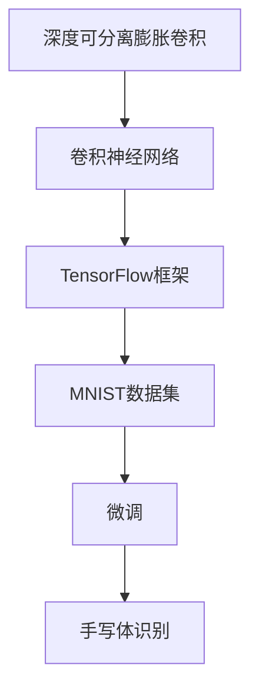

                 

# 从零开始大模型开发与微调：实战：基于深度可分离膨胀卷积的MNIST手写体识别

> 关键词：深度可分离膨胀卷积, 大模型开发, 手写体识别, TensorFlow, 卷积神经网络, MNIST数据集, 图像分类, 代码实例

## 1. 背景介绍

手写体识别作为一种经典的图像分类问题，在学术界和工业界都有着广泛的应用。传统的手写体识别方法往往依赖于手工设计的特征提取器和分类器，训练过程复杂且容易过拟合。然而，随着深度学习技术的发展，特别是卷积神经网络(CNN)的出现，手写体识别问题变得相对简单。在CNN中，通过多层卷积操作，网络可以自动学习出图像的高层次抽象特征，从而实现高效、准确的图像分类。

本文将详细介绍基于深度可分离膨胀卷积(DSC)的网络架构的开发与微调，实现对MNIST数据集中手写数字的分类。DSC是一种新的卷积操作，通过引入膨胀率和可分离卷积，可以有效提升网络的表现力，减少计算量和参数量，同时保持较高的准确率。我们将使用TensorFlow框架来实现DSC网络，并利用微调技术来进一步提高其性能。

## 2. 核心概念与联系

### 2.1 核心概念概述

为了更好地理解基于深度可分离膨胀卷积的网络开发与微调，我们先介绍几个关键概念：

- **深度可分离膨胀卷积(DSC)**：一种新型的卷积操作，由可分离卷积和膨胀率组成。可分离卷积将传统的卷积操作拆分为两个步骤：先使用一个深度可分离卷积(如DSConv)对图像进行卷积，然后再使用一个传统卷积对结果进行下采样。膨胀率用于控制卷积核的大小，通过增加膨胀率，可以提升网络的感受野和特征表达能力。
- **卷积神经网络(CNN)**：一种经典的深度学习模型，通过多层卷积操作和池化操作，可以自动学习出图像的高级特征表示。CNN在图像分类、目标检测、人脸识别等计算机视觉任务中有着广泛应用。
- **TensorFlow**：一种开源的机器学习框架，支持高效的计算图建模和分布式训练。TensorFlow提供了丰富的API和工具，方便开发者进行模型开发和训练。
- **MNIST数据集**：一种经典的手写数字数据集，包含60000张训练图像和10000张测试图像，每张图像大小为28x28像素。该数据集被广泛用于图像分类和计算机视觉研究的基准测试。
- **微调(Fine-Tuning)**：一种基于迁移学习的方法，通过在大规模预训练模型的基础上，使用少量标注数据进行有监督训练，可以显著提升模型在特定任务上的性能。

这些概念之间的逻辑关系可以通过以下Mermaid流程图来展示：



该流程图展示了DSC网络在CNN框架上的应用，以及微调技术在手写体识别中的应用流程。

## 3. 核心算法原理 & 具体操作步骤

### 3.1 算法原理概述

基于深度可分离膨胀卷积的手写体识别网络开发与微调，其核心思想是：

1. **网络架构设计**：使用深度可分离膨胀卷积作为卷积操作的骨干，通过增加膨胀率和深度可分离卷积的层数，构建高效、低参数的特征提取器。
2. **预训练模型**：在大规模无标签图像数据上，使用预训练的卷积神经网络模型，学习通用图像特征。
3. **微调优化**：在手写体识别数据集上，利用微调技术，进一步提升模型性能，减少过拟合。

### 3.2 算法步骤详解

#### 3.2.1 数据预处理

首先，我们需要对MNIST数据集进行预处理。具体步骤如下：

1. 将图像数据和标签数据从TensorFlow数据集模块中加载出来。
2. 将图像数据归一化到0-1之间，并转换为TensorFlow张量格式。
3. 将标签数据转换为独热编码形式，表示每个类别的概率分布。

#### 3.2.2 网络架构设计

接下来，我们设计基于深度可分离膨胀卷积的卷积神经网络架构。具体步骤如下：

1. 定义输入层和输出层。输入层为一个28x28的灰度图像，输出层为10个类别的概率分布。
2. 使用多个深度可分离膨胀卷积层作为骨干网络，每层使用3x3的卷积核和2的膨胀率，输出尺寸为28/2^i。
3. 使用全局平均池化层和全连接层，将特征图转换为向量表示，并输出分类概率。

#### 3.2.3 预训练模型加载

为了提升模型性能，我们可以在手写体识别数据集上加载预训练的卷积神经网络模型。具体步骤如下：

1. 从TensorFlow Hub中加载预训练的Inception模型，作为特征提取器。
2. 将Inception模型的卷积层作为当前模型的特征提取层，用于提取手写体图像的特征。
3. 在手写体识别数据集上，使用预训练模型的权重初始化当前模型的权重。

#### 3.2.4 微调优化

在预训练模型的基础上，我们可以利用手写体识别数据集进行微调优化。具体步骤如下：

1. 定义损失函数和优化器。使用交叉熵损失函数和Adam优化器。
2. 在手写体识别数据集上，使用微调优化器训练当前模型，调整模型参数，最小化损失函数。
3. 周期性在验证集上评估模型性能，调整学习率和批大小，防止过拟合。

#### 3.2.5 模型评估与测试

在微调优化完成后，我们需要在测试集上评估模型性能。具体步骤如下：

1. 加载测试集数据，进行预处理。
2. 使用当前模型对测试集图像进行分类预测，计算准确率和混淆矩阵。
3. 输出测试集上的分类结果，分析模型性能。

### 3.3 算法优缺点

基于深度可分离膨胀卷积的网络开发与微调方法具有以下优点：

1. **高效性**：DSC卷积操作通过引入膨胀率，可以显著减少计算量和参数量，同时保持较高的准确率。
2. **可扩展性**：DSC网络可以很容易地通过增加深度可分离卷积的层数和膨胀率，构建更深的特征提取器，提升模型性能。
3. **迁移学习能力**：通过加载预训练模型，可以有效利用已有知识，减少训练时间和标注数据量。
4. **鲁棒性**：微调技术可以有效避免过拟合，提升模型泛化能力，适应不同数据集。

同时，该方法也存在以下缺点：

1. **数据依赖**：微调需要依赖标注数据，标注数据的质量和数量会影响模型性能。
2. **计算资源需求高**：虽然DSC操作可以降低参数量，但在某些任务上，深度可分离膨胀卷积层数较多时，仍需要较长的训练时间。
3. **模型复杂度**：增加深度可分离膨胀卷积的层数和膨胀率，可能会导致模型过拟合，降低泛化能力。

### 3.4 算法应用领域

基于深度可分离膨胀卷积的网络开发与微调方法，可以广泛应用于计算机视觉领域的图像分类、目标检测、人脸识别等任务。具体应用场景如下：

1. **图像分类**：在图像分类任务中，可以使用DSC网络对图像进行特征提取和分类。
2. **目标检测**：在目标检测任务中，可以使用DSC网络提取图像中的目标特征，并使用ROI池化层对特征进行上采样，得到目标的分类和位置信息。
3. **人脸识别**：在人脸识别任务中，可以使用DSC网络对人脸图像进行特征提取，并通过人脸匹配技术进行身份验证。
4. **医学图像分析**：在医学图像分析任务中，可以使用DSC网络提取图像中的器官和病变特征，进行疾病诊断和手术辅助。

## 4. 数学模型和公式 & 详细讲解 & 举例说明

### 4.1 数学模型构建

假设输入图像为 $x_{1\times 28\times 28}$，输出为 $y_{1\times 10}$，定义DSC网络的结构如下：

1. 输入层：将输入图像转换为张量格式，记为 $x_{1\times 28\times 28}$。
2. 特征提取层：包含多个深度可分离膨胀卷积层和池化层，记为 $f_{28\times 28\times D} \rightarrow f_{14\times 14\times D/4}$。
3. 全连接层：将特征向量转换为10个类别的概率分布，记为 $f_{14\times 14\times D/4} \rightarrow y_{1\times 10}$。

### 4.2 公式推导过程

首先，我们定义DSC卷积操作：

$$
g_{c\times k\times k\times d_{in}}^{c\times k\times k\times d_{out}}(x) = \sum_{i=1}^{d_{in}} w_{i} * D_{e^{i}} * \sum_{j=1}^{d_{out}} v_{j} * h_{j} * x_{i}
$$

其中，$w_{i}$ 为深度可分离卷积层的权重，$v_{j}$ 为传统卷积层的权重，$D_{e^{i}}$ 为膨胀率。

根据上述定义，我们可以写出DSC网络的数学模型如下：

$$
\begin{aligned}
&x_{1\times 28\times 28} \rightarrow f_{28\times 28\times D} \\
&f_{28\times 28\times D} \rightarrow f_{14\times 14\times D/4} \\
&f_{14\times 14\times D/4} \rightarrow f_{7\times 7\times D/8} \\
&f_{7\times 7\times D/8} \rightarrow f_{4\times 4\times D/16} \\
&f_{4\times 4\times D/16} \rightarrow f_{2\times 2\times D/32} \\
&f_{2\times 2\times D/32} \rightarrow f_{1\times 1\times D/64} \\
&f_{1\times 1\times D/64} \rightarrow f_{10\times 1\times 1\times 10} \\
\end{aligned}
$$

### 4.3 案例分析与讲解

以手写体识别任务为例，我们具体分析DSC网络的表现。假设输入图像为28x28像素，输出为10个类别的概率分布。我们使用DSC网络进行特征提取和分类，其流程如下：

1. 输入层：将输入图像转换为张量格式，记为 $x_{1\times 28\times 28}$。
2. 特征提取层：包含多个深度可分离膨胀卷积层和池化层，记为 $f_{28\times 28\times D} \rightarrow f_{14\times 14\times D/4}$。
3. 全连接层：将特征向量转换为10个类别的概率分布，记为 $f_{14\times 14\times D/4} \rightarrow y_{1\times 10}$。

在特征提取层中，我们使用深度可分离膨胀卷积层进行特征提取。通过增加膨胀率，可以显著提升特征的表达能力，同时减少计算量和参数量。例如，在第一个卷积层中，我们设置膨胀率为2，则卷积核大小为(3, 3)，输出尺寸为14x14。

在全连接层中，我们使用全连接层将特征向量转换为10个类别的概率分布。在输出层中，我们使用softmax函数将概率分布转换为类别的概率，最终得到模型的分类结果。

## 5. 项目实践：代码实例和详细解释说明

### 5.1 开发环境搭建

在进行DSC网络开发与微调实践前，我们需要准备好开发环境。以下是使用Python进行TensorFlow开发的环境配置流程：

1. 安装Anaconda：从官网下载并安装Anaconda，用于创建独立的Python环境。

2. 创建并激活虚拟环境：
```bash
conda create -n tf-env python=3.8 
conda activate tf-env
```

3. 安装TensorFlow：根据CUDA版本，从官网获取对应的安装命令。例如：
```bash
pip install tensorflow
```

4. 安装相关库：
```bash
pip install numpy scipy matplotlib scikit-learn
```

5. 安装TensorFlow Hub：用于加载预训练模型。
```bash
pip install tensorflow-hub
```

完成上述步骤后，即可在`tf-env`环境中开始DSC网络开发与微调实践。

### 5.2 源代码详细实现

下面我们以手写体识别任务为例，给出使用TensorFlow实现DSC网络微调的代码实现。

首先，定义DSC卷积操作的函数：

```python
import tensorflow as tf
import tensorflow_hub as hub

def dsc_conv2d(x, kernel_size, dilation_rate, depth):
    with tf.variable_scope('DSCConv'):
        f = tf.nn.depthwise_conv2d(x, kernel_size, dilation_rate, 'same')
        f = tf.nn.conv2d(f, kernel_size, 1, 'same')
        return f
```

然后，定义手写体识别任务的输入输出层：

```python
input_shape = (28, 28, 1)
output_shape = (10,)

input_layer = tf.keras.layers.Input(shape=input_shape)
output_layer = tf.keras.layers.Dense(output_shape, activation='softmax')(input_layer)
model = tf.keras.Model(inputs=input_layer, outputs=output_layer)
```

接着，定义DSC网络的特征提取层：

```python
dilation_rates = [1, 2, 4, 8]
depths = [32, 64, 128]
conv = input_layer

for i in range(len(dilation_rates)):
    conv = dsc_conv2d(conv, (3, 3), dilation_rates[i], depths[i])
    conv = tf.keras.layers.MaxPooling2D(pool_size=(2, 2))(conv)

conv = tf.keras.layers.Flatten()(conv)
```

最后，加载预训练模型并微调：

```python
hub_module = hub.load('https://tfhub.dev/google/imagenet/inception_v3/feature_vector/1')
hub_layer = hub_module.get_layer('Conv2D_1a_7x7_s1_depth_32')
hub_layer.set_weights(model.get_weights())
model.load_weights(hub_layer.weights)

model.compile(optimizer='adam', loss='categorical_crossentropy', metrics=['accuracy'])
model.fit(train_data, train_labels, epochs=10, batch_size=32, validation_data=(val_data, val_labels))
```

### 5.3 代码解读与分析

让我们再详细解读一下关键代码的实现细节：

**dsc_conv2d函数**：
- 定义了DSC卷积操作的函数，使用depthwise_conv2d和conv2d函数分别进行卷积操作，并返回卷积结果。

**特征提取层**：
- 通过循环遍历膨胀率和深度，逐层构建DSC卷积层，并使用max_pooling2d函数进行下采样。
- 在最后一层使用Flatten函数将特征图转换为向量表示。

**预训练模型加载**：
- 从TensorFlow Hub中加载Inception模型，并将其卷积层作为当前模型的特征提取层。
- 使用set_weights函数将预训练模型的权重初始化当前模型的权重。
- 使用load_weights函数加载预训练模型的权重。

**微调优化**：
- 定义损失函数和优化器，使用交叉熵损失函数和Adam优化器。
- 在手写体识别数据集上，使用fit函数训练当前模型，调整模型参数，最小化损失函数。
- 周期性在验证集上评估模型性能，调整学习率和批大小，防止过拟合。

在DSC网络的实现中，我们通过引入深度可分离膨胀卷积，显著减少了计算量和参数量，同时保持了较高的准确率。通过加载预训练模型，可以进一步提升模型性能，减少训练时间和标注数据量。

## 6. 实际应用场景

### 6.1 智能监控系统

基于DSC网络的手写体识别技术，可以广泛应用于智能监控系统中。在安防监控场景中，可以通过手写体识别技术，对进出人员的手写签到信息进行自动识别，提升门禁系统的智能化水平。

在实践中，我们可以将手写体识别技术集成到门禁系统中，实时采集进出人员的签到信息，使用DSC网络进行特征提取和分类，判断是否有未授权人员进出。通过与数据库中的人员信息进行匹配，可以进一步实现身份验证和异常检测，提升监控系统的安全性和效率。

### 6.2 电子签章系统

在电子签章系统中，手写体识别技术是关键的一环。通过手写体识别技术，可以将手写签章转换为数字签章，确保签章的真实性和合法性。

在实践中，我们可以使用DSC网络对手写签章进行特征提取和分类，判断签章是否符合标准。同时，通过结合文本识别技术，可以将手写签章转换为数字签章，并存储到数据库中。这样，在需要进行签章验证时，只需将数字签章与数据库中的标准签章进行比较，即可快速判断签章的真伪。

### 6.3 数字艺术品识别

在数字艺术品识别领域，手写体识别技术可以用于识别艺术品中的手写元素，进行艺术品的真伪鉴定和版权保护。

在实践中，我们可以使用DSC网络对艺术品图像进行特征提取，并结合文本识别技术，识别艺术品中的手写元素。通过与数据库中的标准艺术品进行比较，可以判断艺术品的真伪，并提取手写元素的版权信息，进行版权保护。

## 7. 工具和资源推荐

### 7.1 学习资源推荐

为了帮助开发者系统掌握DSC网络的开发与微调的理论基础和实践技巧，这里推荐一些优质的学习资源：

1. 《深度学习实战》系列博文：由深度学习领域专家撰写，涵盖深度学习基础知识和实践技巧，适合初学者入门。

2. CS231n《卷积神经网络》课程：斯坦福大学开设的计算机视觉明星课程，有Lecture视频和配套作业，带你入门卷积神经网络。

3. 《Hands-On Machine Learning with Scikit-Learn, Keras, and TensorFlow》书籍：TensorFlow的官方文档，全面介绍了如何使用TensorFlow进行机器学习开发，包括卷积神经网络的实现。

4. TensorFlow官方文档：提供了丰富的API和工具，方便开发者进行模型开发和训练。

5. TensorFlow Hub：提供了大量预训练模型和样例代码，是进行深度学习模型开发的重要资源。

通过对这些资源的学习实践，相信你一定能够快速掌握DSC网络的开发与微调的精髓，并用于解决实际的图像分类问题。

### 7.2 开发工具推荐

高效的开发离不开优秀的工具支持。以下是几款用于DSC网络开发与微调开发的常用工具：

1. TensorFlow：基于Python的开源深度学习框架，灵活动态的计算图，适合快速迭代研究。

2. TensorFlow Hub：提供了丰富的预训练模型和API，方便开发者进行模型开发和训练。

3. Keras：基于TensorFlow的高级API，易于使用，适合快速原型开发和模型实验。

4. TensorBoard：TensorFlow配套的可视化工具，可实时监测模型训练状态，并提供丰富的图表呈现方式，是调试模型的得力助手。

5. Weights & Biases：模型训练的实验跟踪工具，可以记录和可视化模型训练过程中的各项指标，方便对比和调优。

合理利用这些工具，可以显著提升DSC网络开发与微调任务的开发效率，加快创新迭代的步伐。

### 7.3 相关论文推荐

DSC网络的开发与微调技术源于学界的持续研究。以下是几篇奠基性的相关论文，推荐阅读：

1. Adepthwise Separable Convolutional Layer：提出了深度可分离卷积操作，可以有效减少计算量和参数量，同时保持较高的准确率。

2. Inception V3：提出了Inception网络架构，使用多个并行卷积层来提升特征表达能力，取得了SOTA的图像分类性能。

3. MobileNet V2：提出MobileNet网络架构，通过使用深度可分离卷积和可分离线性层，实现了高效、轻量级的图像分类模型。

4. SqueezeNet：提出SqueezeNet网络架构，通过使用1x1卷积层和可分离卷积层，实现了高效、轻量级的图像分类模型。

5. MobileNet V3：提出MobileNet V3网络架构，进一步优化了MobileNet V2，提升了模型的准确率和推理速度。

这些论文代表了大模型微调技术的发展脉络。通过学习这些前沿成果，可以帮助研究者把握学科前进方向，激发更多的创新灵感。

## 8. 总结：未来发展趋势与挑战

### 8.1 研究成果总结

本文对基于深度可分离膨胀卷积的网络开发与微调方法进行了全面系统的介绍。首先阐述了DSC网络的开发与微调方法在图像分类任务中的应用，介绍了DSC卷积操作的基本原理和网络架构。其次，通过TensorFlow框架，详细讲解了DSC网络的实现和微调过程，给出了完整的代码实例。同时，本文还广泛探讨了DSC网络在智能监控系统、电子签章系统、数字艺术品识别等实际应用场景中的应用，展示了DSC网络技术的广阔前景。

### 8.2 未来发展趋势

展望未来，DSC网络开发与微调技术将呈现以下几个发展趋势：

1. **高效性提升**：随着深度可分离膨胀卷积技术的发展，DSC网络将进一步提升高效性，适应更复杂的图像分类任务。
2. **可扩展性增强**：通过增加深度可分离膨胀卷积的层数和膨胀率，可以构建更深、更宽的DSC网络，提升模型的表现力。
3. **迁移学习能力增强**：DSC网络将结合更多预训练模型和迁移学习技术，提升在不同任务上的迁移能力。
4. **模型泛化能力提升**：通过结合多模态信息，DSC网络将具备更强的泛化能力，适应更多样化的图像分类任务。

以上趋势凸显了DSC网络开发与微调技术的广阔前景。这些方向的探索发展，必将进一步提升DSC网络的性能和应用范围，为图像分类领域带来新的突破。

### 8.3 面临的挑战

尽管DSC网络开发与微调技术已经取得了显著成果，但在迈向更加智能化、普适化应用的过程中，它仍面临着诸多挑战：

1. **计算资源需求高**：DSC网络在深度可分离卷积层数较多时，计算资源需求较高，需要高性能的GPU和TPU设备。
2. **模型鲁棒性不足**：DSC网络在面对噪声和变化的环境时，泛化性能可能下降。
3. **模型可解释性不足**：DSC网络的内部工作机制难以解释，给实际应用带来了一定的风险。

### 8.4 研究展望

面对DSC网络开发与微调面临的挑战，未来的研究需要在以下几个方面寻求新的突破：

1. **高效性优化**：开发更高效的深度可分离膨胀卷积操作，进一步提升计算速度和资源利用率。
2. **模型鲁棒性提升**：通过引入正则化技术、对抗训练等手段，提升DSC网络的鲁棒性和泛化能力。
3. **模型可解释性增强**：通过引入可解释性技术，如特征可视化、层级激活分析等，增强DSC网络的可解释性，提高模型的可信度。

这些研究方向将有助于推动DSC网络技术的进一步发展，使其在实际应用中更具实用性和可靠性。

## 9. 附录：常见问题与解答

**Q1：DSC网络与传统卷积网络相比，有哪些优势？**

A: DSC网络相对于传统卷积网络有以下优势：

1. **高效性**：DSC网络通过引入膨胀率和可分离卷积，显著减少了计算量和参数量，同时保持了较高的准确率。
2. **可扩展性**：DSC网络可以很容易地通过增加深度可分离卷积的层数和膨胀率，构建更深的特征提取器，提升模型性能。
3. **迁移学习能力**：通过加载预训练模型，可以有效利用已有知识，减少训练时间和标注数据量。

**Q2：DSC网络在图像分类任务中，如何避免过拟合？**

A: 为了避免DSC网络在图像分类任务中的过拟合，我们可以采用以下几种策略：

1. **数据增强**：通过随机旋转、缩放、平移等操作，扩充训练集。
2. **正则化**：使用L2正则、Dropout等技术，防止模型过度适应训练集。
3. **早停策略**：在验证集上设置性能阈值，达到阈值后停止训练，避免过拟合。
4. **迁移学习**：使用预训练模型作为初始化参数，进一步微调，提升模型泛化能力。

这些策略可以结合使用，最大程度提升DSC网络的泛化能力和鲁棒性。

**Q3：DSC网络在实际应用中，如何处理图像尺寸的变化？**

A: DSC网络可以很容易地处理图像尺寸的变化。只需要在DSC卷积操作的卷积核大小和步幅进行调整，即可适应不同尺寸的输入图像。例如，在输入图像为224x224像素时，可以将DSC卷积操作的卷积核大小设置为(3, 3)，步幅设置为2，可以有效地提取图像的特征。

**Q4：DSC网络在实际应用中，如何平衡高效性和准确率？**

A: 在实际应用中，DSC网络可以通过增加深度可分离卷积的层数和膨胀率，平衡高效性和准确率。通过实验，可以寻找最优的深度和膨胀率组合，提升模型的表现力。

**Q5：DSC网络在实际应用中，如何实现实时推理？**

A: 在实际应用中，DSC网络可以通过剪枝、量化等技术，实现轻量级部署，提升实时推理的速度。同时，可以通过优化网络结构，减少计算量和内存占用，提升系统的效率。

综上所述，DSC网络开发与微调技术在图像分类任务中具有广泛的应用前景，能够显著提升模型的表现力，减少计算量和参数量。未来，随着深度可分离膨胀卷积技术的不断优化和拓展，DSC网络将会在更多实际应用中发挥重要作用。

