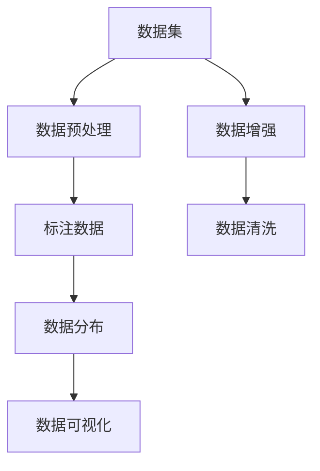

                 

# 从零开始大模型开发与微调：数据集的获取与处理

> 关键词：大模型, 数据集, 数据预处理, 数据增强, 标注数据, 数据清洗, 数据划分, 数据保存, 数据分布, 数据可视化

## 1. 背景介绍

### 1.1 问题由来

随着深度学习技术的飞速发展，大模型在各种自然语言处理(NLP)任务上取得了显著进展。然而，构建和微调大模型的过程中，高质量数据集的获取与处理是不可或缺的一环。尤其是在数据驱动的AI时代，数据集的质量和规模直接决定了模型的性能上限。因此，本文将详细阐述如何从零开始构建和处理高质量的数据集，为后续的模型开发与微调奠定坚实的基础。

### 1.2 问题核心关键点

1. **数据集的重要性**：高质量的数据集是训练高质量大模型的基石，数据的丰富性和多样性直接影响模型的泛化能力。
2. **数据预处理**：包括数据清洗、格式转换、标准化等，确保数据的一致性和有效性。
3. **数据增强**：通过数据增强技术，如回译、近义词替换等，扩充数据集，提升模型泛化能力。
4. **数据分布**：需要保证数据集的分布与实际应用场景一致，避免过拟合和欠拟合。
5. **数据可视化**：通过可视化手段，如词云、统计分布等，帮助开发者了解数据集特征，优化数据处理流程。

## 2. 核心概念与联系

### 2.1 核心概念概述

为更好地理解数据集构建与处理的方法，本节将介绍几个核心概念：

- **数据集(Data Set)**：用于模型训练和验证的数据集合，包括标注数据和未标注数据。标注数据包含输入和输出标签，用于监督学习模型的训练。未标注数据用于模型预训练和无监督学习。
- **数据预处理(Data Preprocessing)**：对原始数据进行清洗、归一化、特征提取等处理，确保数据的一致性和可用性。
- **数据增强(Data Augmentation)**：通过对原始数据进行一系列变换，生成新的数据样本，扩充数据集，提高模型的泛化能力。
- **标注数据(Labeled Data)**：包含输入和输出标签的数据，用于监督学习模型的训练。
- **数据清洗(Data Cleaning)**：去除或修正数据中的噪声、异常值等，提高数据集的质量。
- **数据分布(Data Distribution)**：数据集在各类别上的分布情况，需要与实际应用场景一致，避免模型偏颇。
- **数据可视化(Data Visualization)**：通过图表、词云等可视化手段，展示数据集的特征和分布情况，辅助数据分析和决策。

这些核心概念之间的逻辑关系可以通过以下Mermaid流程图来展示：



这个流程图展示了大模型构建过程中，数据集构建与处理的各个关键环节及其之间的关系：

1. 从原始数据开始，先进行数据预处理，确保数据的一致性和可用性。
2. 在预处理的基础上，进一步进行数据增强，扩充数据集。
3. 根据任务需求，从预处理和增强后的数据中筛选出标注数据。
4. 分析和理解数据分布，确保数据集的质量和泛化能力。
5. 利用数据可视化手段，了解数据集特征，辅助数据分析和优化。

这些概念共同构成了大模型数据构建与处理的框架，帮助开发者系统化地获取和处理数据，从而提高模型性能。

## 3. 核心算法原理 & 具体操作步骤
### 3.1 算法原理概述

数据集构建与处理的总体思路是通过一系列预处理和增强操作，构建出高质量的数据集。具体步骤如下：

1. **数据预处理**：清洗原始数据，去除噪声、异常值，进行格式转换、标准化等处理。
2. **数据增强**：通过对原始数据进行一系列变换，生成新的数据样本，扩充数据集。
3. **数据标注**：根据任务需求，标注数据集，使其符合监督学习模型的训练需求。
4. **数据分布分析**：分析数据集在各类别上的分布情况，确保数据集的质量和泛化能力。
5. **数据可视化**：利用可视化手段，展示数据集的特征和分布情况，辅助数据分析和决策。

### 3.2 算法步骤详解

**Step 1: 数据预处理**

数据预处理是构建高质量数据集的关键步骤，主要包括数据清洗、格式转换、标准化等操作。

1. **数据清洗**：
   - **去重**：去除重复数据，避免数据冗余。
   - **去除噪声**：检测并去除数据中的噪声、异常值和缺失值，确保数据的一致性和可用性。
   - **标准化**：对数据进行归一化处理，将数据转换到统一的范围，便于模型训练。

2. **格式转换**：
   - **文本数据处理**：将原始文本数据转换为模型需要的格式，如分词、去除停用词、去除标点等。
   - **图像数据处理**：将原始图像数据进行格式转换，如调整大小、转换颜色空间等。

3. **标准化**：
   - **文本标准化**：将文本数据进行标准化处理，如统一编码格式、统一分词方式等。
   - **数值标准化**：将数值型数据进行归一化处理，使其在[-1, 1]或[0, 1]等统一区间内。

**Step 2: 数据增强**

数据增强是通过对原始数据进行一系列变换，生成新的数据样本，扩充数据集，提高模型的泛化能力。

1. **文本数据增强**：
   - **回译**：将文本数据进行回译，生成新的样本。
   - **近义词替换**：将文本中的某些词替换为其近义词，生成新的样本。
   - **随机插入**：在文本中随机插入某些词汇，生成新的样本。

2. **图像数据增强**：
   - **随机裁剪**：对图像进行随机裁剪，生成新的样本。
   - **随机翻转**：对图像进行随机翻转，生成新的样本。
   - **亮度调整**：调整图像的亮度，生成新的样本。

**Step 3: 数据标注**

数据标注是构建标注数据集的过程，通常包括以下步骤：

1. **标注规则**：
   - **定义标注规则**：根据任务需求，定义标注规则，如分类任务、匹配任务、生成任务等。
   - **标注示例**：选择部分样本进行标注，形成标注示例，用于后续的模型训练。

2. **标注工具**：
   - **众包标注**：利用众包平台，如Amazon Mechanical Turk，进行标注，获取高质量标注数据。
   - **专家标注**：聘请领域专家进行标注，确保标注数据的准确性和专业性。

3. **标注验证**：
   - **人工验证**：对标注数据进行人工验证，确保标注结果的准确性。
   - **自动验证**：利用机器学习模型进行自动验证，提高标注效率。

**Step 4: 数据分布分析**

数据分布分析是确保数据集质量的关键步骤，主要包括以下操作：

1. **数据划分**：
   - **划分训练集、验证集、测试集**：将数据集划分为训练集、验证集和测试集，确保模型在训练和测试过程中的稳定性和泛化能力。
   - **划分步骤**：通常将数据集划分为70%训练集、15%验证集和15%测试集。

2. **数据分布检查**：
   - **类别分布**：检查数据集在各类别上的分布情况，确保数据集平衡，避免过拟合和欠拟合。
   - **样本数量**：检查每个类别中的样本数量，确保每个类别的样本数量相近。

3. **数据分布调整**：
   - **重采样**：对样本数量不平衡的类别进行重采样，确保数据集的平衡性。
   - **合成样本**：利用数据增强技术，合成新的样本，平衡数据集。

**Step 5: 数据可视化**

数据可视化是通过图表、词云等可视化手段，展示数据集的特征和分布情况，辅助数据分析和决策。

1. **特征可视化**：
   - **词云**：利用词云展示文本数据中的高频词汇，帮助理解文本数据的特征。
   - **统计分布**：利用统计分布展示数据集中各特征的分布情况，如词频、类别分布等。

2. **可视化工具**：
   - **Python可视化库**：利用Python的可视化库，如Matplotlib、Seaborn、Plotly等，展示数据集特征。
   - **专门可视化工具**：利用专门的数据可视化工具，如Tableau、Power BI等，展示数据集特征和分布情况。

通过这些步骤，可以构建出高质量的数据集，为后续的模型开发与微调奠定坚实的基础。

### 3.3 算法优缺点

数据集构建与处理的方法具有以下优点：

1. **提高数据质量**：通过数据预处理和数据增强，去除噪声和异常值，生成新的数据样本，提高数据集的质量。
2. **增强泛化能力**：通过数据增强，扩充数据集，提高模型的泛化能力。
3. **降低标注成本**：通过众包标注和专家标注，获取高质量标注数据，降低标注成本。
4. **保证数据平衡**：通过数据分布调整，确保数据集的平衡性，避免过拟合和欠拟合。

同时，这些方法也存在以下缺点：

1. **数据清洗复杂**：数据清洗过程复杂，需要人工干预，耗费时间和精力。
2. **数据增强可能过拟合**：数据增强过程中，如果生成的新数据过于相似，可能导致模型过拟合。
3. **标注成本较高**：高质量标注数据获取成本高，需要大量人力和时间。
4. **数据分布难以控制**：数据分布调整过程复杂，难以完全控制。

尽管存在这些缺点，但数据集构建与处理方法仍是构建高质量大模型的关键步骤，值得在实际应用中不断优化和改进。

### 3.4 算法应用领域

基于数据集构建与处理的方法，已经在大模型微调领域得到广泛应用，覆盖了各类NLP任务。以下是一些典型应用场景：

1. **文本分类**：如情感分析、主题分类、意图识别等。通过数据预处理和数据增强，构建出高质量的分类数据集，用于模型训练和微调。
2. **命名实体识别**：识别文本中的人名、地名、机构名等特定实体。通过数据预处理和标注，构建出高质量的命名实体识别数据集。
3. **关系抽取**：从文本中抽取实体之间的语义关系。通过数据预处理和标注，构建出高质量的关系抽取数据集。
4. **问答系统**：对自然语言问题给出答案。通过数据预处理和标注，构建出高质量的问答数据集。
5. **机器翻译**：将源语言文本翻译成目标语言。通过数据预处理和标注，构建出高质量的机器翻译数据集。
6. **文本摘要**：将长文本压缩成简短摘要。通过数据预处理和标注，构建出高质量的文本摘要数据集。
7. **对话系统**：使机器能够与人自然对话。通过数据预处理和标注，构建出高质量的对话数据集。

除了上述这些经典任务外，大模型微调方法也被创新性地应用到更多场景中，如可控文本生成、常识推理、代码生成、数据增强等，为NLP技术带来了全新的突破。随着预训练模型和数据处理方法的不断进步，相信NLP技术将在更广阔的应用领域大放异彩。

## 4. 数学模型和公式 & 详细讲解 & 举例说明

### 4.1 数学模型构建

假设我们有一个标注数据集 $D = \{(x_i, y_i)\}_{i=1}^N$，其中 $x_i$ 为输入，$y_i$ 为输出标签。我们的目标是通过数据预处理、数据增强、数据标注等步骤，构建出一个高质量的数据集 $D'$，用于模型的训练和微调。

### 4.2 公式推导过程

假设原始数据集为 $D = \{(x_i, y_i)\}_{i=1}^N$，其中 $x_i$ 为输入，$y_i$ 为输出标签。我们的目标是通过数据预处理、数据增强、数据标注等步骤，构建出一个高质量的数据集 $D'$，用于模型的训练和微调。

1. **数据预处理**：
   - **去重**：通过集合操作，去除重复数据，得到去重后的数据集 $D_1 = \{x_i\}_{i=1}^M$。
   - **噪声去除**：通过数据清洗，去除数据中的噪声和异常值，得到去噪后的数据集 $D_2 = \{x_i\}_{i=1}^N$。
   - **标准化**：对数据进行标准化处理，得到标准化后的数据集 $D_3 = \{x_i\}_{i=1}^N$。

2. **数据增强**：
   - **回译**：对文本数据进行回译，生成新的样本 $D_4 = \{x_i', y_i'\}_{i=1}^N$。
   - **近义词替换**：对文本数据中的某些词进行近义词替换，生成新的样本 $D_5 = \{x_i', y_i'\}_{i=1}^N$。
   - **随机插入**：在文本中随机插入某些词汇，生成新的样本 $D_6 = \{x_i', y_i'\}_{i=1}^N$。

3. **数据标注**：
   - **标注规则**：定义标注规则，如分类任务、匹配任务、生成任务等。
   - **标注示例**：选择部分样本进行标注，得到标注示例 $D_7 = \{(x_i', y_i')\}_{i=1}^N$。
   - **标注验证**：对标注数据进行人工验证，得到最终标注数据集 $D_8 = \{(x_i, y_i)\}_{i=1}^N$。

4. **数据分布调整**：
   - **数据划分**：将数据集划分为训练集、验证集和测试集。
   - **类别分布**：检查数据集在各类别上的分布情况，确保数据集平衡。
   - **重采样**：对样本数量不平衡的类别进行重采样，确保数据集的平衡性。

5. **数据可视化**：
   - **特征可视化**：利用词云、统计分布等可视化手段，展示数据集的特征和分布情况。
   - **可视化工具**：利用Python的可视化库或专门的数据可视化工具，展示数据集特征和分布情况。

### 4.3 案例分析与讲解

**案例1: 文本分类任务**

假设我们有一个文本分类任务，需要构建一个高质量的分类数据集。原始数据集为 $D = \{(x_i, y_i)\}_{i=1}^N$，其中 $x_i$ 为输入文本，$y_i$ 为分类标签。

1. **数据预处理**：
   - **去重**：通过集合操作，去除重复文本，得到去重后的数据集 $D_1 = \{x_i\}_{i=1}^M$。
   - **噪声去除**：通过数据清洗，去除文本中的噪声和异常值，得到去噪后的数据集 $D_2 = \{x_i\}_{i=1}^N$。
   - **标准化**：对文本进行标准化处理，得到标准化后的数据集 $D_3 = \{x_i\}_{i=1}^N$。

2. **数据增强**：
   - **回译**：对文本进行回译，生成新的样本 $D_4 = \{x_i', y_i'\}_{i=1}^N$。
   - **近义词替换**：对文本中的某些词进行近义词替换，生成新的样本 $D_5 = \{x_i', y_i'\}_{i=1}^N$。
   - **随机插入**：在文本中随机插入某些词汇，生成新的样本 $D_6 = \{x_i', y_i'\}_{i=1}^N$。

3. **数据标注**：
   - **标注规则**：定义分类任务的标注规则，如正负样本标签。
   - **标注示例**：选择部分样本进行标注，得到标注示例 $D_7 = \{(x_i', y_i')\}_{i=1}^N$。
   - **标注验证**：对标注数据进行人工验证，得到最终标注数据集 $D_8 = \{(x_i, y_i)\}_{i=1}^N$。

4. **数据分布调整**：
   - **数据划分**：将数据集划分为训练集、验证集和测试集。
   - **类别分布**：检查数据集在各类别上的分布情况，确保数据集平衡。
   - **重采样**：对样本数量不平衡的类别进行重采样，确保数据集的平衡性。

5. **数据可视化**：
   - **特征可视化**：利用词云展示文本数据中的高频词汇，帮助理解文本数据的特征。
   - **统计分布**：利用统计分布展示数据集中各特征的分布情况，如词频、类别分布等。

**案例2: 命名实体识别任务**

假设我们有一个命名实体识别任务，需要构建一个高质量的命名实体识别数据集。原始数据集为 $D = \{(x_i, y_i)\}_{i=1}^N$，其中 $x_i$ 为输入文本，$y_i$ 为命名实体标签序列。

1. **数据预处理**：
   - **去重**：通过集合操作，去除重复文本，得到去重后的数据集 $D_1 = \{x_i\}_{i=1}^M$。
   - **噪声去除**：通过数据清洗，去除文本中的噪声和异常值，得到去噪后的数据集 $D_2 = \{x_i\}_{i=1}^N$。
   - **标准化**：对文本进行标准化处理，得到标准化后的数据集 $D_3 = \{x_i\}_{i=1}^N$。

2. **数据增强**：
   - **回译**：对文本进行回译，生成新的样本 $D_4 = \{x_i', y_i'\}_{i=1}^N$。
   - **近义词替换**：对文本中的某些词进行近义词替换，生成新的样本 $D_5 = \{x_i', y_i'\}_{i=1}^N$。
   - **随机插入**：在文本中随机插入某些词汇，生成新的样本 $D_6 = \{x_i', y_i'\}_{i=1}^N$。

3. **数据标注**：
   - **标注规则**：定义命名实体识别的标注规则，如BIO标签系统。
   - **标注示例**：选择部分样本进行标注，得到标注示例 $D_7 = \{(x_i', y_i')\}_{i=1}^N$。
   - **标注验证**：对标注数据进行人工验证，得到最终标注数据集 $D_8 = \{(x_i, y_i)\}_{i=1}^N$。

4. **数据分布调整**：
   - **数据划分**：将数据集划分为训练集、验证集和测试集。
   - **类别分布**：检查数据集在各类别上的分布情况，确保数据集平衡。
   - **重采样**：对样本数量不平衡的类别进行重采样，确保数据集的平衡性。

5. **数据可视化**：
   - **特征可视化**：利用词云展示文本数据中的高频词汇，帮助理解文本数据的特征。
   - **统计分布**：利用统计分布展示数据集中各特征的分布情况，如词频、类别分布等。

通过这些步骤，可以构建出高质量的命名实体识别数据集，用于模型的训练和微调。

## 5. 项目实践：代码实例和详细解释说明

### 5.1 开发环境搭建

在进行数据集构建与处理实践前，我们需要准备好开发环境。以下是使用Python进行PyTorch开发的环境配置流程：

1. 安装Anaconda：从官网下载并安装Anaconda，用于创建独立的Python环境。

2. 创建并激活虚拟环境：
```bash
conda create -n pytorch-env python=3.8 
conda activate pytorch-env
```

3. 安装PyTorch：根据CUDA版本，从官网获取对应的安装命令。例如：
```bash
conda install pytorch torchvision torchaudio cudatoolkit=11.1 -c pytorch -c conda-forge
```

4. 安装Transformer库：
```bash
pip install transformers
```

5. 安装各类工具包：
```bash
pip install numpy pandas scikit-learn matplotlib tqdm jupyter notebook ipython
```

完成上述步骤后，即可在`pytorch-env`环境中开始数据集构建与处理实践。

### 5.2 源代码详细实现

下面我们以命名实体识别(NER)任务为例，给出使用Transformers库对BERT模型进行微调的PyTorch代码实现。

首先，定义NER任务的数据处理函数：

```python
from transformers import BertTokenizer
from torch.utils.data import Dataset
import torch

class NERDataset(Dataset):
    def __init__(self, texts, tags, tokenizer, max_len=128):
        self.texts = texts
        self.tags = tags
        self.tokenizer = tokenizer
        self.max_len = max_len
        
    def __len__(self):
        return len(self.texts)
    
    def __getitem__(self, item):
        text = self.texts[item]
        tags = self.tags[item]
        
        encoding = self.tokenizer(text, return_tensors='pt', max_length=self.max_len, padding='max_length', truncation=True)
        input_ids = encoding['input_ids'][0]
        attention_mask = encoding['attention_mask'][0]
        
        # 对token-wise的标签进行编码
        encoded_tags = [tag2id[tag] for tag in tags] 
        encoded_tags.extend([tag2id['O']] * (self.max_len - len(encoded_tags)))
        labels = torch.tensor(encoded_tags, dtype=torch.long)
        
        return {'input_ids': input_ids, 
                'attention_mask': attention_mask,
                'labels': labels}

# 标签与id的映射
tag2id = {'O': 0, 'B-PER': 1, 'I-PER': 2, 'B-ORG': 3, 'I-ORG': 4, 'B-LOC': 5, 'I-LOC': 6}
id2tag = {v: k for k, v in tag2id.items()}

# 创建dataset
tokenizer = BertTokenizer.from_pretrained('bert-base-cased')

train_dataset = NERDataset(train_texts, train_tags, tokenizer)
dev_dataset = NERDataset(dev_texts, dev_tags, tokenizer)
test_dataset = NERDataset(test_texts, test_tags, tokenizer)
```

然后，定义模型和优化器：

```python
from transformers import BertForTokenClassification, AdamW

model = BertForTokenClassification.from_pretrained('bert-base-cased', num_labels=len(tag2id))

optimizer = AdamW(model.parameters(), lr=2e-5)
```

接着，定义训练和评估函数：

```python
from torch.utils.data import DataLoader
from tqdm import tqdm
from sklearn.metrics import classification_report

device = torch.device('cuda') if torch.cuda.is_available() else torch.device('cpu')
model.to(device)

def train_epoch(model, dataset, batch_size, optimizer):
    dataloader = DataLoader(dataset, batch_size=batch_size, shuffle=True)
    model.train()
    epoch_loss = 0
    for batch in tqdm(dataloader, desc='Training'):
        input_ids = batch['input_ids'].to(device)
        attention_mask = batch['attention_mask'].to(device)
        labels = batch['labels'].to(device)
        model.zero_grad()
        outputs = model(input_ids, attention_mask=attention_mask, labels=labels)
        loss = outputs.loss
        epoch_loss += loss.item()
        loss.backward()
        optimizer.step()
    return epoch_loss / len(dataloader)

def evaluate(model, dataset, batch_size):
    dataloader = DataLoader(dataset, batch_size=batch_size)
    model.eval()
    preds, labels = [], []
    with torch.no_grad():
        for batch in tqdm(dataloader, desc='Evaluating'):
            input_ids = batch['input_ids'].to(device)
            attention_mask = batch['attention_mask'].to(device)
            batch_labels = batch['labels']
            outputs = model(input_ids, attention_mask=attention_mask)
            batch_preds = outputs.logits.argmax(dim=2).to('cpu').tolist()
            batch_labels = batch_labels.to('cpu').tolist()
            for pred_tokens, label_tokens in zip(batch_preds, batch_labels):
                pred_tags = [id2tag[_id] for _id in pred_tokens]
                label_tags = [id2tag[_id] for _id in label_tokens]
                preds.append(pred_tags[:len(label_tags)])
                labels.append(label_tags)
                
    print(classification_report(labels, preds))
```

最后，启动训练流程并在测试集上评估：

```python
epochs = 5
batch_size = 16

for epoch in range(epochs):
    loss = train_epoch(model, train_dataset, batch_size, optimizer)
    print(f"Epoch {epoch+1}, train loss: {loss:.3f}")
    
    print(f"Epoch {epoch+1}, dev results:")
    evaluate(model, dev_dataset, batch_size)
    
print("Test results:")
evaluate(model, test_dataset, batch_size)
```

以上就是使用PyTorch对BERT进行命名实体识别任务微调的完整代码实现。可以看到，得益于Transformers库的强大封装，我们可以用相对简洁的代码完成BERT模型的加载和微调。

### 5.3 代码解读与分析

让我们再详细解读一下关键代码的实现细节：

**NERDataset类**：
- `__init__`方法：初始化文本、标签、分词器等关键组件。
- `__len__`方法：返回数据集的样本数量。
- `__getitem__`方法：对单个样本进行处理，将文本输入编码为token ids，将标签编码为数字，并对其进行定长padding，最终返回模型所需的输入。

**tag2id和id2tag字典**：
- 定义了标签与数字id之间的映射关系，用于将token-wise的预测结果解码回真实的标签。

**训练和评估函数**：
- 使用PyTorch的DataLoader对数据集进行批次化加载，供模型训练和推理使用。
- 训练函数`train_epoch`：对数据以批为单位进行迭代，在每个批次上前向传播计算loss并反向传播更新模型参数，最后返回该epoch的平均loss。
- 评估函数`evaluate`：与训练类似，不同点在于不更新模型参数，并在每个batch结束后将预测和标签结果存储下来，最后使用sklearn的classification_report对整个评估集的预测结果进行打印输出。

**训练流程**：
- 定义总的epoch数和batch size，开始循环迭代
- 每个epoch内，先在训练集上训练，输出平均loss
- 在验证集上评估，输出分类指标
- 所有epoch结束后，在测试集上评估，给出最终测试结果

可以看到，PyTorch配合Transformers库使得BERT微调的代码实现变得简洁高效。开发者可以将更多精力放在数据处理、模型改进等高层逻辑上，而不必过多关注底层的实现细节。

当然，工业级的系统实现还需考虑更多因素，如模型的保存和部署、超参数的自动搜索、更灵活的任务适配层等。但核心的数据集构建与处理过程基本与此类似。

## 6. 实际应用场景
### 6.1 智能客服系统

基于大语言模型微调的对话技术，可以广泛应用于智能客服系统的构建。传统客服往往需要配备大量人力，高峰期响应缓慢，且一致性和专业性难以保证。而使用微调后的对话模型，可以7x24小时不间断服务，快速响应客户咨询，用自然流畅的语言解答各类常见问题。

在技术实现上，可以收集企业内部的历史客服对话记录，将问题和最佳答复构建成监督数据，在此基础上对预训练对话模型进行微调。微调后的对话模型能够自动理解用户意图，匹配最合适的答案模板进行回复。对于客户提出的新问题，还可以接入检索系统实时搜索相关内容，动态组织生成回答。如此构建的智能客服系统，能大幅提升客户咨询体验和问题解决效率。

### 6.2 金融舆情监测

金融机构需要实时监测市场舆论动向，以便及时应对负面信息传播，规避金融风险。传统的人工监测方式成本高、效率低，难以应对网络时代海量信息爆发的挑战。基于大语言模型微调的文本分类和情感分析技术，为金融舆情监测提供了新的解决方案。

具体而言，可以收集金融领域相关的新闻、报道、评论等文本数据，并对其进行主题标注和情感标注。在此基础上对预训练语言模型进行微调，使其能够自动判断文本属于何种主题，情感倾向是正面、中性还是负面。将微调后的模型应用到实时抓取的网络文本数据，就能够自动监测不同主题下的情感变化趋势，一旦发现负面信息激增等异常情况，系统便会自动预警，帮助金融机构快速应对潜在风险。

### 6.3 个性化推荐系统

当前的推荐系统往往只依赖用户的历史行为数据进行物品推荐，无法深入理解用户的真实兴趣偏好。基于大语言模型微调技术，个性化推荐系统可以更好地挖掘用户行为背后的语义信息，从而提供更精准、多样的推荐内容。

在实践中，可以收集用户浏览、点击、评论、分享等行为数据，提取和用户交互的物品标题、描述、标签等文本内容。将文本内容作为模型输入，用户的后续行为（如是否点击、购买等）作为监督信号，在此基础上微调预训练语言模型。微调后的模型能够从文本内容中准确把握用户的兴趣点。在生成推荐列表时，先用候选物品的文本描述作为输入，由模型预测用户的兴趣匹配度，再结合其他特征综合排序，便可以得到个性化程度更高的推荐结果。

### 6.4 未来应用展望

随着大语言模型微调技术的发展，基于微调范式将在更多领域得到应用，为传统行业带来变革性影响。

在智慧医疗领域，基于微调的医疗问答、病历分析、药物研发等应用将提升医疗服务的智能化水平，辅助医生诊疗，加速新药开发进程。

在智能教育领域，微调技术可应用于作业批改、学情分析、知识推荐等方面，因材施教，促进教育公平，提高教学质量。

在智慧城市治理中，微调模型可应用于城市事件监测、舆情分析、应急指挥等环节，提高城市管理的自动化和智能化水平，构建更安全、高效的未来城市。

此外，在企业生产、社会治理、文娱传媒等众多领域，基于大模型微调的人工智能应用也将不断涌现，为NLP技术带来了全新的突破。随着预训练模型和微调方法的不断进步，相信NLP技术将在更广阔的应用领域大放异彩，深刻影响人类的生产生活方式。

## 7. 工具和资源推荐
### 7.1 学习资源推荐

为了帮助开发者系统掌握大语言模型微调的理论基础和实践技巧，这里推荐一些优质的学习资源：

1. 《Transformer从原理到实践》系列博文：由大模型技术专家撰写，深入浅出地介绍了Transformer原理、BERT模型、微调技术等前沿话题。

2. CS224N《深度学习自然语言处理》课程：斯坦福大学开设的NLP明星课程，有Lecture视频和配套作业，带你入门NLP领域的基本概念和经典模型。

3. 《Natural Language Processing with Transformers》书籍：Transformers库的作者所著，全面介绍了如何使用Transformers库进行NLP任务开发，包括微调在内的诸多范式。

4. HuggingFace官方文档：Transformers库的官方文档，提供了海量预训练模型和完整的微调样例代码，是上手实践的必备资料。

5. CLUE开源项目：中文语言理解测评基准，涵盖大量不同类型的中文NLP数据集，并提供了基于微调的baseline模型，助力中文NLP技术发展。

通过对这些资源的学习实践，相信你一定能够快速掌握大语言模型微调的精髓，并用于解决实际的NLP问题。
###  7.2 开发工具推荐

高效的开发离不开优秀的工具支持。以下是几款用于大语言模型微调开发的常用工具：

1. PyTorch：基于Python的开源深度学习框架，灵活动态的计算图，适合快速迭代研究。大部分预训练语言模型都有PyTorch版本的实现。

2. TensorFlow：由Google主导开发的开源深度学习框架，生产部署方便，适合大规模工程应用。同样有丰富的预训练语言模型资源。

3. Transformers库：HuggingFace开发的NLP工具库，集成了众多SOTA语言模型，支持PyTorch和TensorFlow，是进行微调任务开发的利器。

4. Weights & Biases：模型训练的实验跟踪工具，可以记录和可视化模型训练过程中的各项指标，方便对比和调优。与主流深度学习框架无缝集成。

5. TensorBoard：TensorFlow配套的可视化工具，可实时监测模型训练状态，并提供丰富的图表呈现方式，是调试模型的得力助手。

6. Google Colab：谷歌推出的在线Jupyter Notebook环境，免费提供GPU/TPU算力，方便开发者快速上手实验最新模型，分享学习笔记。

合理利用这些工具，可以显著提升大语言模型微调任务的开发效率，加快创新迭代的步伐。

### 7.3 相关论文推荐

大语言模型和微调技术的发展源于学界的持续研究。以下是几篇奠基性的相关论文，推荐阅读：

1. Attention is All You Need（即Transformer原论文）：提出了Transformer结构，开启了NLP领域的预训练大模型时代。

2. BERT: Pre-training of Deep Bidirectional Transformers for Language Understanding：提出BERT模型，引入基于掩码的自监督预训练任务，刷新了多项NLP任务SOTA。

3. Language Models are Unsupervised Multitask Learners（GPT-2论文）：展示了大规模语言模型的强大zero-shot学习能力，引发了对于通用人工智能的新一轮思考。

4. Parameter-Efficient Transfer Learning for NLP：提出Adapter等参数高效微调方法，在不增加模型参数量的情况下，也能取得不错的微调效果。

5. Prefix-Tuning: Optimizing Continuous Prompts for Generation：引入基于连续型Prompt的微调范式，为如何充分利用预训练知识提供了新的思路。

6. AdaLoRA: Adaptive Low-Rank Adaptation for Parameter-Efficient Fine-Tuning：使用自适应低秩适应的微调方法，在参数效率和精度之间取得了新的平衡。

这些论文代表了大语言模型微调技术的发展脉络。通过学习这些前沿成果，可以帮助研究者把握学科前进方向，激发更多的创新灵感。

## 8. 总结：未来发展趋势与挑战

### 8.1 研究成果总结

本文对大语言模型数据集构建与处理的方法进行了详细阐述。从原始数据的预处理、数据增强、数据标注、数据分布分析到数据可视化，每一环节都进行了深入探讨，旨在帮助开发者构建高质量的数据集，为后续的模型开发与微调奠定坚实的基础。

### 8.2 未来发展趋势

展望未来，大语言模型数据集构建与处理技术将呈现以下几个发展趋势：

1. **自动化数据构建**：通过自动数据生成、数据增强等技术，降低数据构建和标注的成本，提高数据集的多样性和丰富性。
2. **多模态数据融合**：利用多模态数据的融合技术，将文本、图像、语音等不同类型的数据进行整合，提升模型对现实世界的理解能力。
3. **分布式数据处理**：通过分布式计算技术，实现大规模数据集的高效处理和存储，加速数据集构建和处理的速度。
4. **实时数据流处理**：利用实时数据流处理技术，将动态数据实时加入数据集，实现数据集的时效性。
5. **数据质量控制**：通过数据质量控制技术，检测和修正数据集中的噪声、异常值，确保数据集的质量和一致性。
6. **数据隐私保护**：在数据集构建过程中，注重数据隐私保护，确保数据集的使用符合法律法规和伦理标准。

这些趋势将进一步提升数据集构建与处理的效率和质量，为模型开发和微调提供更加丰富和可靠的数据支持。

### 8.3 面临的挑战

尽管大语言模型数据集构建与处理技术不断进步，但仍面临以下挑战：

1. **数据标注成本高**：高质量数据集的构建需要大量人力和时间，数据标注成本高昂。
2. **数据分布不均衡**：数据集在各类别上的分布不均衡，容易导致模型过拟合或欠拟合。
3. **数据质量控制难**：数据集中的噪声和异常值难以完全控制，影响数据集的质量和可用性。
4. **数据隐私保护难**：在数据集构建过程中，如何保护用户隐私和数据安全，仍是一个重要的挑战。
5. **数据分布不一致**：数据集在不同环境下的分布可能不一致，导致模型在不同环境下的性能下降。

面对这些挑战，未来的研究需要在数据集构建过程中，注重数据质量控制，降低数据标注成本，提升数据集的时效性和多样性，并注重数据隐私保护，确保数据集的使用符合法律法规和伦理标准。

### 8.4 研究展望

未来，大语言模型数据集构建与处理技术需要从以下几个方面进行突破：

1. **自动数据生成**：利用自动数据生成技术，生成高质量的监督数据，降低数据标注成本。
2. **多模态数据融合**：利用多模态数据融合技术，将不同类型的数据进行整合，提升模型的综合能力。
3. **分布式数据处理**：利用分布式计算技术，实现大规模数据集的高效处理和存储，加速数据集构建和处理的速度。
4. **实时数据流处理**：利用实时数据流处理技术，将动态数据实时加入数据集，实现数据集的时效性。
5. **数据隐私保护**：在数据集构建过程中，注重数据隐私保护，确保数据集的使用符合法律法规和伦理标准。
6. **数据质量控制**：通过数据质量控制技术，检测和修正数据集中的噪声、异常值，确保数据集的质量和一致性。

这些研究方向的探索，必将引领大语言模型数据集构建与处理技术迈向更高的台阶，为模型开发和微调提供更加丰富和可靠的数据支持。

## 9. 附录：常见问题与解答

**Q1：如何处理原始数据中的噪声和异常值？**

A: 处理原始数据中的噪声和异常值，通常需要以下步骤：

1. **去重**：通过集合操作，去除重复数据，避免数据冗余。
2. **噪声去除**：利用数据清洗技术，如异常值检测、平滑处理等，去除数据中的噪声和异常值。
3. **标准化**：对数据进行标准化处理，将数据转换到统一的范围，便于模型训练。

**Q2：如何进行数据增强？**

A: 数据增强通常包括以下方法：

1. **回译**：将文本数据进行回译，生成新的样本。
2. **近义词替换**：将文本中的某些词替换为其近义词，生成新的样本。
3. **随机插入**：在文本中随机插入某些词汇，生成新的样本。

**Q3：如何进行数据标注？**

A: 数据标注通常包括以下步骤：

1. **标注规则**：定义标注规则，如分类任务、匹配任务、生成任务等。
2. **标注示例**：选择部分样本进行标注，形成标注示例，用于后续的模型训练。
3. **标注验证**：对标注数据进行人工验证，确保标注结果的准确性。

**Q4：如何进行数据分布调整？**

A: 数据分布调整通常包括以下方法：

1. **数据划分**：将数据集划分为训练集、验证集和测试集。
2. **类别分布**：检查数据集在各类别上的分布情况，确保数据集平衡。
3. **重采样**：对样本数量不平衡的类别进行重采样，确保数据集的平衡性。

**Q5：如何进行数据可视化？**

A: 数据可视化通常包括以下方法：

1. **特征可视化**：利用词云、统计分布等可视化手段，展示数据集的特征和分布情况。
2. **可视化工具**：利用Python的可视化库或专门的数据可视化工具，展示数据集特征和分布情况。

通过这些步骤，可以构建出高质量的数据集，为后续的模型开发与微调奠定坚实的基础。

---

作者：禅与计算机程序设计艺术 / Zen and the Art of Computer Programming

