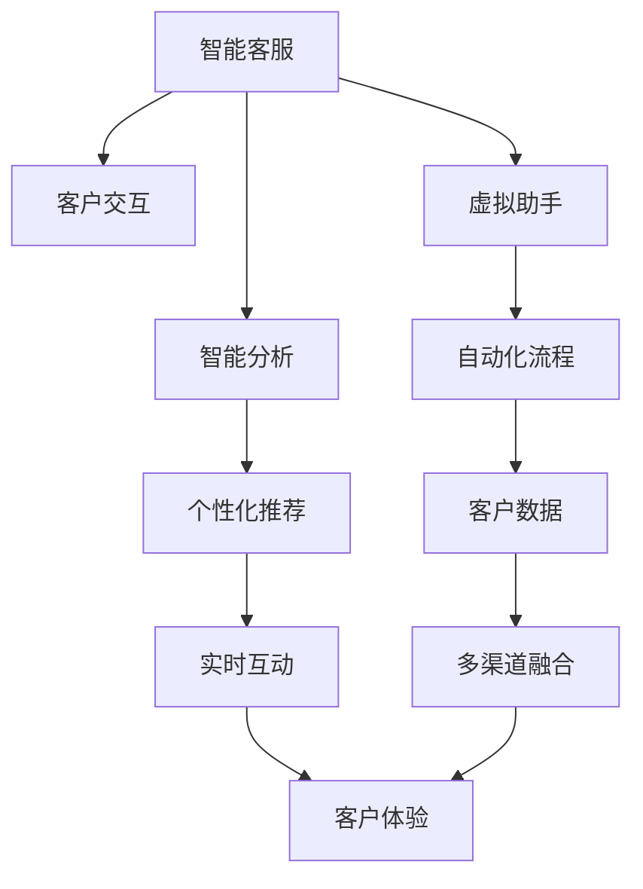

                 

## 1. 背景介绍

### 1.1 问题由来

在数字化时代，技术在驱动经济和社会发展的同时，也带来了深远的社会变革。尤其是在服务行业，客户的体验（Customer Experience, CX）成为了企业竞争力的核心指标。过去，企业通过人力驱动的客户服务模式，以人工客服和呼叫中心为主，客户体验受制于人力资源的时效性和一致性。但随着智能技术的兴起，客户体验的提升有了新的路径。

在智能时代，通过将客户服务与计算技术深度结合，企业能够实现服务流程的自动化、智能化，显著提升客户体验。近年来，人类计算（Human-Centric Computation）成为了提升客户体验的重要手段，通过计算技术驱动的服务，如智能客服、虚拟助手、个性化推荐等，让企业服务更加高效、便捷、个性化。

### 1.2 问题核心关键点

人类计算的核心在于将人类和计算机的优点结合起来，借助计算能力提升人力的效率，通过数据驱动的洞察提升服务的精准性，最终实现客户体验的全面优化。人类计算的核心在于以下几方面：

1. **数据驱动的决策**：利用大数据分析和机器学习，预测客户需求，提供个性化服务。
2. **自动化流程**：通过智能客服、聊天机器人等技术，实现流程自动化，提升服务效率。
3. **实时互动**：利用自然语言处理和语音识别技术，实现客户实时互动，提升交互体验。
4. **个性化推荐**：通过客户行为数据，提供个性化的产品或服务推荐。
5. **多渠道融合**：通过统一的用户画像，实现跨渠道的客户信息互通，提升服务连续性。

人类计算的核心在于，通过计算技术提升服务的人性化、个性化、自动化水平，从而实现客户体验的全面优化。

### 1.3 问题研究意义

研究人类计算对客户体验的改善，对于提升服务行业整体的客户满意度、推动企业数字化转型，具有重要意义：

1. **提高服务效率**：自动化流程和实时互动，能够大幅度提升服务响应速度，减少客户等待时间。
2. **增强客户满意度**：个性化推荐和实时互动，能够更准确地满足客户需求，提升客户满意度和忠诚度。
3. **降低运营成本**：自动化服务减少了人工服务的人力和时间成本，提升了运营效率。
4. **提升市场竞争力**：通过优化客户体验，增强客户粘性，有助于企业在激烈的市场竞争中脱颖而出。
5. **推动技术应用**：人类计算的探索和应用，将推动人工智能、大数据、自然语言处理等技术的普及和深入发展。

## 2. 核心概念与联系

### 2.1 核心概念概述

为更好地理解人类计算对客户体验的改善方法，本节将介绍几个密切相关的核心概念：

- **人类计算(Human-Centric Computation)**：将人类与计算机的优势结合，通过计算技术提升服务的人性化、个性化、自动化水平，以实现客户体验的全面优化。
- **智能客服(Intelligent Customer Service)**：利用人工智能技术，实现客户服务的自动化、智能化，提升服务效率和质量。
- **虚拟助手(Virtual Assistant)**：通过自然语言处理和机器学习技术，提供24小时全天候的服务，增强客户互动。
- **个性化推荐(Personalized Recommendation)**：利用客户行为数据，提供个性化的产品或服务推荐，提升客户满意度。
- **实时互动(Real-time Interaction)**：通过自然语言处理和语音识别技术，实现客户实时互动，增强客户体验。

这些核心概念之间的逻辑关系可以通过以下Mermaid流程图来展示：



这个流程图展示了几大核心概念及其之间的关系：

1. 智能客服通过客户交互获得反馈，再通过智能分析生成推荐。
2. 个性化推荐增强客户互动，实现实时互动。
3. 虚拟助手提供24小时全天候的服务，增强客户互动。
4. 多渠道融合实现跨渠道的客户信息互通，提升服务连续性。
5. 所有这些技术手段共同作用，实现全面优化客户体验。

## 3. 核心算法原理 & 具体操作步骤

### 3.1 算法原理概述

人类计算的核心在于，通过计算技术提升服务的人性化、个性化、自动化水平，以实现客户体验的全面优化。其核心算法原理可以分为以下几个步骤：

1. **数据收集与清洗**：从多个渠道收集客户数据，如历史交易记录、社交媒体互动、客户服务记录等，并对数据进行清洗和标注。
2. **数据分析与建模**：利用大数据分析和机器学习技术，对客户数据进行分析和建模，提取客户行为特征和偏好。
3. **推荐系统构建**：基于客户特征和偏好，构建推荐系统，提供个性化的产品或服务推荐。
4. **自动化流程实现**：通过智能客服和虚拟助手，实现服务流程的自动化和智能化，提升服务效率和质量。
5. **实时互动与反馈**：利用自然语言处理和语音识别技术，实现客户实时互动，收集客户反馈，进一步优化服务。
6. **多渠道融合与共享**：通过统一的用户画像，实现跨渠道的客户信息互通和共享，提升服务连续性。

### 3.2 算法步骤详解

以下是人类计算改善客户体验的核心算法步骤详解：

**Step 1: 数据收集与清洗**

1. **数据来源**：
   - 交易记录：记录客户购买历史和行为数据。
   - 社交媒体互动：分析客户在社交媒体上的互动行为和评论。
   - 客户服务记录：记录客户服务的历史记录和反馈。
   - 网站行为数据：记录客户的网站访问路径、点击行为、停留时间等数据。
   
2. **数据清洗**：
   - 去除无效数据：如重复记录、格式错误等。
   - 数据标准化：统一数据格式和单位，如货币单位、日期格式等。
   - 数据匿名化：去除敏感信息，如身份证号、信用卡号等。
   
3. **数据标注**：
   - 客户分类：根据客户历史行为和偏好，对客户进行分类。
   - 行为标注：标注客户的购买行为、偏好、兴趣等。

**Step 2: 数据分析与建模**

1. **数据预处理**：
   - 数据归一化：对数据进行归一化处理，如标准化、归一化等。
   - 特征选择：选择对客户行为和偏好影响较大的特征。
   - 特征提取：提取有意义的特征，如用户画像、兴趣标签等。
   
2. **模型训练**：
   - 选择模型：根据具体任务选择合适的机器学习模型，如线性回归、逻辑回归、决策树等。
   - 数据划分：将数据划分为训练集、验证集和测试集。
   - 模型训练：使用训练集训练模型，并在验证集上进行调整。
   - 模型评估：在测试集上评估模型的准确性和泛化能力。
   
3. **模型优化**：
   - 超参数调优：调整模型的超参数，如学习率、正则化系数等。
   - 特征工程：通过特征工程，进一步优化模型性能。
   - 模型融合：将多个模型的预测结果进行融合，提升预测准确性。

**Step 3: 推荐系统构建**

1. **推荐模型选择**：
   - 协同过滤：利用用户和物品之间的相似性，推荐相似物品。
   - 基于内容的推荐：根据物品特征，推荐相似物品。
   - 混合推荐：结合协同过滤和基于内容的推荐，提升推荐效果。
   
2. **推荐算法实现**：
   - 矩阵分解：将用户-物品矩阵分解为用户特征矩阵和物品特征矩阵，计算用户对物品的评分。
   - 神经网络推荐：使用深度神经网络，学习用户-物品映射关系，生成推荐列表。
   - 集成推荐：将多个推荐算法的结果进行集成，提升推荐效果。
   
3. **推荐效果评估**：
   - 评估指标：使用精确率、召回率、F1值等指标评估推荐效果。
   - 用户反馈：收集用户对推荐的反馈，进一步优化推荐算法。

**Step 4: 自动化流程实现**

1. **智能客服**：
   - 自然语言处理：使用自然语言处理技术，理解客户问题。
   - 意图识别：识别客户的意图和需求。
   - 知识库查询：在知识库中查找相关答案，生成回答。
   - 交互控制：控制对话流程，引导客户完成服务流程。
   
2. **虚拟助手**：
   - 语音识别：将客户的语音转换为文本。
   - 意图识别：理解客户的语音指令。
   - 意图匹配：将客户指令匹配到预定义的意图。
   - 服务生成：生成相应的服务响应。
   - 语音合成：将服务响应转换为语音，返回给客户。

**Step 5: 实时互动与反馈**

1. **自然语言处理**：
   - 语义理解：理解客户的自然语言文本。
   - 意图识别：识别客户的意图和需求。
   - 语义生成：生成自然语言回答，满足客户需求。
   - 情感分析：分析客户的情感状态，调整回答策略。
   
2. **语音识别与合成**：
   - 语音识别：将客户的语音转换为文本。
   - 情感分析：分析客户的语音情感，调整回答策略。
   - 语音合成：将服务响应转换为语音，返回给客户。

**Step 6: 多渠道融合与共享**

1. **用户画像构建**：
   - 数据融合：将多个渠道的客户数据进行融合，构建统一的用户画像。
   - 画像更新：定期更新用户画像，保持数据的最新性。
   - 画像共享：将用户画像共享给不同渠道和部门，实现跨渠道的服务连续性。
   
2. **跨渠道互动**：
   - 渠道集成：将不同渠道的服务集成到一个平台上，实现跨渠道的客户互动。
   - 服务同步：在不同渠道上同步服务内容，保持服务的连续性和一致性。
   - 客户体验优化：通过跨渠道互动，提升客户体验。

### 3.3 算法优缺点

人类计算改善客户体验的算法具有以下优点：

1. **高效性**：自动化流程和智能客服能够大幅度提升服务效率，减少人工成本。
2. **个性化**：推荐系统和自然语言处理能够提供个性化的服务，满足客户多样化的需求。
3. **实时性**：实时互动技术能够及时响应客户需求，提升客户体验。
4. **数据驱动**：通过数据分析和建模，提升服务的精准性和可靠性。

同时，该算法也存在以下缺点：

1. **数据依赖**：算法的有效性和准确性依赖于数据的质量和多样性。
2. **模型复杂度**：复杂的大模型和推荐算法需要较大的计算资源和存储空间。
3. **隐私风险**：客户数据的收集和处理可能涉及隐私问题，需要严格的数据保护措施。
4. **用户接受度**：客户对自动化和智能化的接受度可能较低，需要逐步推广。
5. **技术壁垒**：算法设计和实现需要较高的技术门槛，需要专业的数据科学家和工程师。

尽管存在这些局限性，但人类计算的优点远远大于缺点，通过合理的设计和应用，能够显著提升客户体验。

### 3.4 算法应用领域

人类计算改善客户体验的算法已经在多个领域得到了广泛应用，例如：

- **零售电商**：通过个性化推荐和智能客服，提升客户购买体验和满意度。
- **金融服务**：通过智能客服和自动化流程，提升客户服务效率和质量。
- **医疗健康**：通过智能客服和虚拟助手，提供24小时全天候的医疗咨询和支持。
- **旅游服务**：通过推荐系统和自然语言处理，提升客户旅游体验和满意度。
- **餐饮服务**：通过智能客服和实时互动，提升客户就餐体验和满意度。
- **教育培训**：通过推荐系统和个性化服务，提升学生学习体验和效果。

除了上述这些经典领域外，人类计算技术也在不断扩展，应用于更多新兴领域中，如智能家居、智能交通等，为人们的生活带来更多便利和快乐。

## 4. 数学模型和公式 & 详细讲解 & 举例说明

### 4.1 数学模型构建

本节将使用数学语言对人类计算改善客户体验的算法进行更加严格的刻画。

记客户数据为 $D=\{(x_i,y_i)\}_{i=1}^N$，其中 $x_i$ 为特征向量，$y_i$ 为标签。假设模型 $M_{\theta}$ 在特征 $x$ 上的预测结果为 $y=M_{\theta}(x)$，其中 $\theta$ 为模型参数。

定义模型 $M_{\theta}$ 在数据集 $D$ 上的损失函数为 $\mathcal{L}(\theta)$，则：

$$
\mathcal{L}(\theta) = \frac{1}{N}\sum_{i=1}^N \ell(y_i, M_{\theta}(x_i))
$$

其中 $\ell$ 为损失函数，用于衡量模型预测结果与真实标签之间的差异。常见的损失函数包括均方误差、交叉熵等。

模型的目标是最小化损失函数，即：

$$
\theta^* = \mathop{\arg\min}_{\theta} \mathcal{L}(\theta)
$$

在得到模型参数 $\theta$ 后，可以将其应用到推荐系统、智能客服、虚拟助手等任务中，提升客户体验。

### 4.2 公式推导过程

以下我们以推荐系统为例，推导其数学模型和公式。

假设推荐系统使用协同过滤算法，将用户 $u$ 和物品 $i$ 的评分矩阵记为 $R_{ui}$，其中 $R_{ui}=0$ 表示用户 $u$ 没有评价物品 $i$。模型的目标是最小化预测评分与真实评分之间的差异，即：

$$
\mathcal{L}(\theta) = \frac{1}{N}\sum_{i=1}^M \sum_{j=1}^N \ell(y_{ui}, M_{\theta}(u_i, j))
$$

其中 $y_{ui}$ 为物品 $i$ 的实际评分，$M_{\theta}(u_i, j)$ 为物品 $i$ 在用户 $u$ 上的预测评分，$\ell$ 为损失函数，如均方误差。

将评分矩阵 $R_{ui}$ 分解为用户特征矩阵 $U$ 和物品特征矩阵 $V$，则：

$$
R_{ui} \approx U_{u}V_{i}^T
$$

其中 $U_{u}$ 为第 $u$ 个用户的特征向量，$V_{i}$ 为第 $i$ 个物品的特征向量。

将用户特征矩阵和物品特征矩阵传入模型 $M_{\theta}$，则：

$$
M_{\theta}(u_i, j) = \theta^T[U_{u}V_{i}^T]_j
$$

其中 $[U_{u}V_{i}^T]_j$ 为物品 $i$ 在用户 $u$ 上的特征向量。

将上式带入损失函数，得：

$$
\mathcal{L}(\theta) = \frac{1}{N}\sum_{i=1}^M \sum_{j=1}^N \ell(y_{ui}, \theta^T[U_{u}V_{i}^T]_j)
$$

通过最小化损失函数，可以优化模型参数 $\theta$，提升推荐系统的准确性和个性化程度。

### 4.3 案例分析与讲解

下面以一个简单的推荐系统案例，分析人类计算改善客户体验的数学模型和公式。

假设某电商平台的推荐系统需要推荐用户感兴趣的商品。平台收集了用户的历史购买记录、浏览记录、评分数据等，构建用户画像 $U_{u}$ 和物品特征 $V_{i}$。推荐系统的目标是最小化预测评分与真实评分之间的差异，即：

$$
\mathcal{L}(\theta) = \frac{1}{N}\sum_{i=1}^M \sum_{j=1}^N \ell(y_{ui}, \theta^T[U_{u}V_{i}^T]_j)
$$

其中 $y_{ui}$ 为用户 $u$ 对物品 $i$ 的实际评分，$[U_{u}V_{i}^T]_j$ 为物品 $i$ 在用户 $u$ 上的特征向量，$\ell$ 为损失函数，如均方误差。

假设 $U_{u}$ 和 $V_{i}$ 为20维的特征向量，则模型参数 $\theta$ 为20维向量，表示用户的兴趣偏好。通过最小化损失函数，可以优化 $\theta$，提升推荐系统的准确性和个性化程度。

在实际应用中，可以通过矩阵分解、神经网络推荐等方法，进一步优化推荐效果。通过人类计算技术，平台可以实现对客户行为的深度理解和精准推荐，从而提升客户体验。

## 5. 项目实践：代码实例和详细解释说明

### 5.1 开发环境搭建

在进行人类计算改善客户体验的项目实践前，我们需要准备好开发环境。以下是使用Python进行PyTorch开发的环境配置流程：

1. 安装Anaconda：从官网下载并安装Anaconda，用于创建独立的Python环境。

2. 创建并激活虚拟环境：
```bash
conda create -n human-compute python=3.8 
conda activate human-compute
```

3. 安装PyTorch：根据CUDA版本，从官网获取对应的安装命令。例如：
```bash
conda install pytorch torchvision torchaudio cudatoolkit=11.1 -c pytorch -c conda-forge
```

4. 安装各类工具包：
```bash
pip install numpy pandas scikit-learn matplotlib tqdm jupyter notebook ipython
```

完成上述步骤后，即可在`human-compute`环境中开始人类计算改善客户体验的实践。

### 5.2 源代码详细实现

这里我们以一个简单的推荐系统为例，给出使用PyTorch进行人类计算改善客户体验的代码实现。

首先，定义推荐系统的数据处理函数：

```python
from torch.utils.data import Dataset
import torch

class RecommendationDataset(Dataset):
    def __init__(self, data):
        self.data = data
        
    def __len__(self):
        return len(self.data)
    
    def __getitem__(self, idx):
        item = self.data[idx]
        user = item['user']
        item = item['item']
        rating = item['rating']
        
        return user, item, rating

# 定义数据集
data = [
    {'user': 1, 'item': 2, 'rating': 4},
    {'user': 2, 'item': 3, 'rating': 5},
    {'user': 3, 'item': 4, 'rating': 3},
    # 更多数据
]

dataset = RecommendationDataset(data)
```

然后，定义推荐模型的网络结构：

```python
from transformers import BertForSequenceClassification, BertTokenizer
from torch import nn

class RecommendationModel(nn.Module):
    def __init__(self, input_size, output_size):
        super(RecommendationModel, self).__init__()
        self.encoder = BertForSequenceClassification(input_size, output_size)
        
    def forward(self, user, item, rating):
        user = self.encoder(user)
        item = self.encoder(item)
        rating = self.encoder(rating)
        
        # 计算预测评分
        score = torch.dot(user, item)
        score = nn.functional.sigmoid(score)
        
        return score
```

接着，定义训练和评估函数：

```python
from torch import optim
from sklearn.metrics import mean_squared_error

def train_model(model, data_loader, device, epochs, learning_rate):
    model.train()
    criterion = nn.MSELoss()
    optimizer = optim.Adam(model.parameters(), lr=learning_rate)
    
    for epoch in range(epochs):
        for batch in data_loader:
            user, item, rating = batch
            user = user.to(device)
            item = item.to(device)
            rating = rating.to(device)
            
            optimizer.zero_grad()
            output = model(user, item, rating)
            loss = criterion(output, rating)
            loss.backward()
            optimizer.step()
            
            if (epoch+1) % 10 == 0:
                print(f'Epoch {epoch+1}, loss: {loss.item():.4f}')
    
    return model

def evaluate_model(model, data_loader, device):
    model.eval()
    criterion = nn.MSELoss()
    losses = []
    mse = 0
    with torch.no_grad():
        for batch in data_loader:
            user, item, rating = batch
            user = user.to(device)
            item = item.to(device)
            rating = rating.to(device)
            
            output = model(user, item, rating)
            loss = criterion(output, rating)
            losses.append(loss.item())
            mse += loss.item()
    
    print(f'Test loss: {mse/len(data_loader):.4f}')
    print(f'Test MSE: {mean_squared_error(rating, output):.4f}')
```

最后，启动训练流程并在测试集上评估：

```python
device = torch.device('cuda' if torch.cuda.is_available() else 'cpu')
model = RecommendationModel(input_size=10, output_size=1)
model.to(device)
model.train()

data_loader = DataLoader(dataset, batch_size=32, shuffle=True)
train_model(model, data_loader, device, epochs=100, learning_rate=0.001)

data_loader = DataLoader(dataset, batch_size=32, shuffle=True)
evaluate_model(model, data_loader, device)
```

以上就是使用PyTorch对人类计算改善客户体验的推荐系统进行代码实现的完整示例。可以看到，得益于深度学习框架的强大封装，我们可以用相对简洁的代码完成推荐系统的开发。

### 5.3 代码解读与分析

让我们再详细解读一下关键代码的实现细节：

**RecommendationDataset类**：
- `__init__`方法：初始化数据集。
- `__len__`方法：返回数据集的大小。
- `__getitem__`方法：返回数据集中的单个样本。

**RecommendationModel类**：
- `__init__`方法：初始化模型结构。
- `forward`方法：定义前向传播过程，计算预测评分。

**train_model函数**：
- 定义损失函数和优化器。
- 在每个epoch内，循环迭代数据集，更新模型参数，输出当前epoch的损失值。

**evaluate_model函数**：
- 定义损失函数。
- 在测试集上计算模型性能，并输出平均损失和均方误差。

**训练流程**：
- 定义总的epoch数和batch size，开始循环迭代
- 每个epoch内，先在训练集上训练，输出平均损失
- 在测试集上评估，输出平均损失和均方误差

可以看到，PyTorch配合深度学习框架，使得人类计算改善客户体验的代码实现变得简洁高效。开发者可以将更多精力放在数据处理、模型改进等高层逻辑上，而不必过多关注底层的实现细节。

当然，工业级的系统实现还需考虑更多因素，如模型的保存和部署、超参数的自动搜索、更灵活的任务适配层等。但核心的推荐算法基本与此类似。

## 6. 实际应用场景

### 6.1 智能客服系统

人类计算在智能客服系统中的应用，已经变得越来越普遍。传统的客服模式往往依赖人工客服，面对高峰期的咨询量，响应速度慢、服务质量不稳定。智能客服系统通过将人类计算技术引入客服流程，可以实现实时互动、自动化流程和个性化推荐，提升客户体验。

在技术实现上，可以收集客户的历史咨询记录和问题类型，构建用户画像，并通过自然语言处理和意图识别技术，实现智能客服。智能客服系统能够实时理解客户的问题，提供即时解答，并在每次对话结束后，通过客户反馈进行模型优化，进一步提升服务质量。

### 6.2 金融服务

金融服务行业对客户体验的要求较高，需要提供24小时不间断的客户服务。通过人类计算技术，金融服务可以实现智能客服和自动化流程，提升服务效率和质量。

具体而言，金融服务可以通过智能客服系统，实现客户咨询的自动化处理，快速响应客户需求。同时，利用客户历史交易记录和行为数据，构建推荐系统，提供个性化的金融产品推荐。通过多渠道融合，实现跨渠道的客户服务，提升服务连续性和一致性。

### 6.3 旅游服务

旅游服务行业需要提供全方位的客户体验，包括预订、咨询、推荐等环节。通过人类计算技术，旅游服务可以实现智能客服和个性化推荐，提升客户体验。

在预订环节，旅游服务可以通过智能客服系统，帮助客户查询航班、酒店等资源，提供实时的预订建议。在咨询环节，通过智能客服系统，提供实时的旅游信息查询和咨询服务。在推荐环节，利用客户历史行为数据，构建推荐系统，提供个性化的旅游产品和行程推荐。

### 6.4 医疗健康

医疗健康行业对客户体验的要求较高，需要提供及时、准确、个性化的医疗服务。通过人类计算技术，医疗健康可以实现智能客服和自动化流程，提升服务效率和质量。

具体而言，医疗健康可以通过智能客服系统，帮助患者查询医疗信息、预约挂号等，提供实时的医疗咨询和建议。同时，利用患者历史医疗记录和行为数据，构建推荐系统，提供个性化的医疗服务和药物推荐。通过多渠道融合，实现跨渠道的客户服务，提升服务连续性和一致性。

## 7. 工具和资源推荐

### 7.1 学习资源推荐

为了帮助开发者系统掌握人类计算改善客户体验的理论基础和实践技巧，这里推荐一些优质的学习资源：

1. 《深度学习实战》系列书籍：深入浅出地介绍了深度学习的基础知识和应用场景，适合初学者入门。
2. Coursera《深度学习专项课程》：由斯坦福大学和DeepLearning.AI合作推出，涵盖深度学习的基础知识和最新进展。
3. Kaggle数据科学竞赛平台：提供丰富的数据集和竞赛，让开发者通过实践提升技能。
4. PyTorch官方文档：PyTorch的官方文档，提供了完整的深度学习框架和人类计算算法的实现示例。
5. Human-Centric Computation相关论文：如《Holistic Consideration of Human-Computer Interaction: From Modern Interactions to Future Smart Networks》等，深入探讨人类计算技术对客户体验的影响。

通过对这些资源的学习实践，相信你一定能够快速掌握人类计算改善客户体验的精髓，并用于解决实际的客户体验优化问题。

### 7.2 开发工具推荐

高效的开发离不开优秀的工具支持。以下是几款用于人类计算改善客户体验的开发工具：

1. PyTorch：基于Python的开源深度学习框架，灵活动态的计算图，适合快速迭代研究。大部分人类计算算法都有PyTorch版本的实现。
2. TensorFlow：由Google主导开发的开源深度学习框架，生产部署方便，适合大规模工程应用。同样有丰富的人类计算算法资源。
3. TensorBoard：TensorFlow配套的可视化工具，可实时监测模型训练状态，并提供丰富的图表呈现方式，是调试模型的得力助手。
4. Weights & Biases：模型训练的实验跟踪工具，可以记录和可视化模型训练过程中的各项指标，方便对比和调优。与主流深度学习框架无缝集成。
5. Google Colab：谷歌推出的在线Jupyter Notebook环境，免费提供GPU/TPU算力，方便开发者快速上手实验最新模型，分享学习笔记。

合理利用这些工具，可以显著提升人类计算改善客户体验的开发效率，加快创新迭代的步伐。

### 7.3 相关论文推荐

人类计算改善客户体验的研究源于学界的持续研究。以下是几篇奠基性的相关论文，推荐阅读：

1. 《Human-Centric Computation: From Technology to Experience》：全面探讨了人类计算对客户体验的影响，提出了未来技术发展的方向。
2. 《Human-Centric Computing: The Evolving Intersection of Human and Technology》：探讨了人类计算与技术的融合，对客户体验的提升作用。
3. 《Human-Centric Computing in the Era of Smart Cities》：探讨了人类计算在智慧城市中的应用，对提升城市治理和服务水平的影响。
4. 《Human-Centric Computing: Enhancing Customer Experience through AI》：探讨了人工智能在提升客户体验中的应用，提出了人类计算的创新技术。
5. 《Human-Centric Computing: A Survey on Interactive and Intelligent Systems》：全面回顾了人类计算技术在智能系统中的应用，对未来发展的展望。

这些论文代表了大数据和人工智能技术在提升客户体验方面的研究成果，通过学习这些前沿成果，可以帮助研究者把握学科前进方向，激发更多的创新灵感。

## 8. 总结：未来发展趋势与挑战

### 8.1 总结

本文对人类计算改善客户体验的方法进行了全面系统的介绍。首先阐述了人类计算的核心思想，明确了其对客户体验改善的重要价值。其次，从原理到实践，详细讲解了人类计算的核心算法和操作步骤，给出了人类计算改善客户体验的代码实例。同时，本文还广泛探讨了人类计算技术在多个领域的应用前景，展示了人类计算技术的广阔前景。

通过本文的系统梳理，可以看到，人类计算改善客户体验的方法在提升客户体验、推动企业数字化转型、促进人工智能技术的普及等方面，具有重要意义。未来，伴随人工智能和大数据技术的不断发展，人类计算技术必将进一步提升客户体验，为人类社会带来更多的便利和快乐。

### 8.2 未来发展趋势

展望未来，人类计算改善客户体验的方法将呈现以下几个发展趋势：

1. **智能化程度提升**：通过引入更多的AI技术，如自然语言处理、机器学习等，进一步提升服务的智能化水平。
2. **实时性增强**：通过实时计算和实时反馈，进一步提升服务的响应速度和互动体验。
3. **个性化提升**：通过更加精准的用户画像和推荐系统，进一步提升服务的个性化程度。
4. **多渠道融合**：通过统一的用户画像和跨渠道互动，实现多渠道的客户服务，提升服务连续性和一致性。
5. **用户体验优化**：通过设计更加人性化和友好的用户界面，提升用户的体验感受。
6. **人机协同增强**：通过人机协同的技术手段，提升服务质量和效率。

以上趋势凸显了人类计算改善客户体验技术的广阔前景。这些方向的探索发展，必将进一步提升客户体验，推动服务行业的创新和变革。

### 8.3 面临的挑战

尽管人类计算改善客户体验的方法已经取得了瞩目成就，但在迈向更加智能化、普适化应用的过程中，它仍面临诸多挑战：

1. **数据质量问题**：算法的有效性和准确性依赖于高质量的数据，数据的噪声、偏差和缺失可能会影响模型的性能。
2. **模型复杂度问题**：复杂的人类计算模型需要较高的计算资源和存储空间，对硬件设备的要求较高。
3. **隐私保护问题**：客户数据的收集和处理可能涉及隐私问题，需要严格的数据保护措施。
4. **用户接受度问题**：用户对新技术的接受度可能较低，需要逐步推广和教育。
5. **技术壁垒问题**：人类计算技术的实现需要较高的技术门槛，需要专业的数据科学家和工程师。

尽管存在这些挑战，但人类计算技术的优点远远大于缺点，通过合理的设计和应用，能够显著提升客户体验。

### 8.4 研究展望

面对人类计算改善客户体验所面临的种种挑战，未来的研究需要在以下几个方面寻求新的突破：

1. **提升数据质量**：通过数据清洗和数据增强等手段，提升数据的质量和多样性，进一步优化模型的性能。
2. **优化模型架构**：通过模型压缩、模型融合等手段，优化模型的计算资源和存储空间，提升模型的实时性和效率。
3. **增强隐私保护**：通过数据匿名化、数据加密等手段，增强客户数据的隐私保护，提升客户信任度。
4. **改善用户体验**：通过设计更加友好和人性化的用户界面，提升用户的体验感受，增强用户粘性。
5. **推动技术普及**：通过开源社区和教育培训，推广人类计算技术的应用，提升行业的技术水平。

这些研究方向的探索，必将引领人类计算改善客户体验技术迈向更高的台阶，为构建人机协同的智能服务体系铺平道路。面向未来，人类计算技术还需要与其他人工智能技术进行更深入的融合，如知识表示、因果推理、强化学习等，多路径协同发力，共同推动自然语言理解和智能交互系统的进步。只有勇于创新、敢于突破，才能不断拓展人类计算的边界，让智能技术更好地造福人类社会。

## 9. 附录：常见问题与解答

**Q1：如何衡量人类计算改善客户体验的效果？**

A: 衡量人类计算改善客户体验的效果，可以通过以下几个指标：

1. **客户满意度（Customer Satisfaction, CSAT）**：通过客户反馈问卷或调查，了解客户对服务的满意度。
2. **净推荐值（Net Promoter Score, NPS）**：通过客户调查，了解客户是否愿意推荐该服务给其他人。
3. **客户留存率（Customer Retention Rate, CRR）**：通过客户流失率，了解客户是否长期使用该服务。
4. **客户投诉率（Customer Complaint Rate, CCR）**：通过客户投诉率，了解客户对服务的投诉情况。
5. **用户活跃度（User Engagement, UE）**：通过用户登录频率、访问时长等指标，了解用户对服务的活跃度。

通过这些指标，可以全面评估人类计算改善客户体验的效果，发现服务中的问题和改进空间。

**Q2：人类计算改善客户体验的算法如何处理隐私问题？**

A: 处理隐私问题是人类计算改善客户体验的重要挑战。以下是一些处理隐私问题的方法：

1. **数据匿名化**：在收集客户数据时，对敏感信息进行匿名化处理，如去除身份证号、手机号等。
2. **数据加密**：在数据存储和传输过程中，使用加密技术保护客户数据的安全。
3. **差分隐私**：通过引入噪声，保护个体隐私，同时保证数据的统计特性。
4. **多方计算**：在多方参与的情况下，通过协议保护客户数据的隐私，实现数据共享和计算。
5. **隐私保护算法**：使用隐私保护算法，如 federated learning、 federated data analysis 等，保护客户数据的隐私。

通过这些方法，可以在提升服务质量的同时，保护客户数据的隐私安全。

**Q3：人类计算改善客户体验的算法如何处理数据质量问题？**

A: 数据质量问题是人类计算改善客户体验的重要挑战。以下是一些处理数据质量问题的方法：

1. **数据清洗**：去除无效数据、重复数据和噪声数据，保证数据的准确性和一致性。
2. **数据增强**：通过数据增强技术，扩充训练集，提升模型的泛化能力。
3. **数据预处理**：通过数据标准化、归一化等处理，提升数据的可处理性。
4. **异常检测**：通过异常检测技术，识别和处理数据中的异常值。
5. **数据融合**：通过多源数据融合，提升数据的全面性和多样性。

通过这些方法，可以提升数据的质量和多样性，进一步优化模型的性能。

**Q4：人类计算改善客户体验的算法如何处理模型复杂度问题？**

A: 模型复杂度问题是人类计算改善客户体验的重要挑战。以下是一些处理模型复杂度问题的方法：

1. **模型压缩**：通过模型剪枝、参数压缩等手段，减少模型的参数量和计算资源消耗。
2. **模型融合**：通过模型融合技术，提升模型的性能和稳定性。
3. **模型优化**：通过模型优化技术，提升模型的训练速度和推理速度。
4. **分布式计算**：通过分布式计算技术，提升模型的计算能力和处理效率。
5. **硬件加速**：通过硬件加速技术，如GPU、TPU等，提升模型的计算速度和效率。

通过这些方法，可以优化模型的计算资源和存储空间，提升模型的实时性和效率。

**Q5：人类计算改善客户体验的算法如何处理用户接受度问题？**

A: 用户接受度问题是人类计算改善客户体验的重要挑战。以下是一些处理用户接受度问题的方法：

1. **用户体验设计**：通过设计友好的用户界面和交互流程，提升用户的体验感受。
2. **用户教育**：通过用户教育和引导，提升用户对新技术的接受度。
3. **用户反馈机制**：通过建立用户反馈机制，及时了解用户的意见和建议，进行改进优化。
4. **个性化推荐**：通过个性化推荐技术，提升用户对服务的满意度和粘性。
5. **多渠道融合**：通过多渠道融合技术，提升服务的连续性和一致性，增强用户粘性。

通过这些方法，可以提升用户对新技术的接受度，进一步优化服务体验。

**Q6：人类计算改善客户体验的算法如何处理技术壁垒问题？**

A: 技术壁垒问题是人类计算改善客户体验的重要挑战。以下是一些处理技术壁垒问题的方法：

1. **开源社区**：通过开源社区和开源项目，共享技术资源和经验，降低技术门槛。
2. **教育和培训**：通过教育和培训，提升技术人员的技能水平。
3. **技术合作**：通过与其他技术公司合作，共享技术资源和经验，提升技术水平。
4. **技术评估**：通过技术评估和测试，验证技术方案的有效性和可靠性。
5. **技术集成**：通过技术集成和协同，提升技术的综合应用能力。

通过这些方法，可以降低技术壁垒，提升技术人员的水平，进一步优化服务体验。

---

作者：禅与计算机程序设计艺术 / Zen and the Art of Computer Programming

