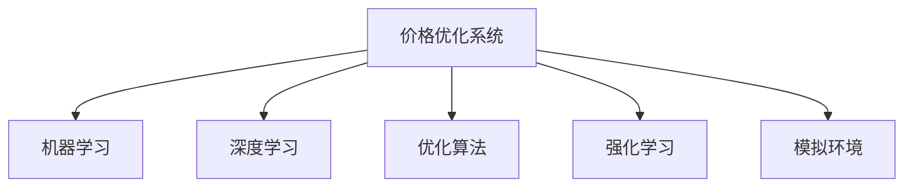

                 

# 价格优化系统：AI的应用

## 1. 背景介绍

### 1.1 问题由来

价格优化系统在现代商业环境中扮演着至关重要的角色，帮助企业制定最佳定价策略，提升利润率，同时增强市场竞争力。传统的价格优化方法依赖于复杂的数学模型和手动调整，难以应对多变市场条件，导致决策效率低下。随着人工智能技术的崛起，基于AI的价格优化系统逐渐成为企业优化价格策略的重要工具。

### 1.2 问题核心关键点

AI在价格优化中的应用，核心在于利用机器学习和深度学习模型，从海量历史销售数据和市场信息中提取价格和需求之间的复杂非线性关系，进而制定出更优的定价策略。具体包括以下几个关键点：

- **数据驱动决策**：使用历史销售数据、竞争对手价格、市场供需变化等数据，构建模型预测价格对销售量的影响。
- **动态定价**：能够根据实时市场条件和消费者行为，自动调整价格以最大化收益。
- **个性化定价**：针对不同市场细分、不同客户群体制定个性化的定价策略。
- **实时优化**：能够实时监控和调整价格，适应快速变化的市场环境。

### 1.3 问题研究意义

AI价格优化系统通过数据驱动和智能分析，提升了企业定价的科学性和灵活性，对企业的销售增长和利润率有显著促进作用。其研究意义在于：

1. **提升决策效率**：AI系统能够快速分析海量数据，制定价格策略，极大提高了决策效率。
2. **优化收益**：通过精准定价，最大化销售收益，提升企业整体盈利水平。
3. **增强竞争力**：AI系统能够在复杂多变的市场中灵活调整价格，增强企业的市场竞争力。
4. **辅助业务优化**：与营销、库存管理等其他业务系统集成，实现全面业务优化。

## 2. 核心概念与联系

### 2.1 核心概念概述

为更好地理解基于AI的价格优化系统，本节将介绍几个密切相关的核心概念：

- **价格优化系统(Price Optimization System)**：通过AI技术对价格进行优化，自动调整价格以最大化收益的系统。
- **机器学习(Machine Learning)**：通过算法让机器自动学习数据中的规律，用于预测和决策。
- **深度学习(Deep Learning)**：一种特殊的机器学习方法，通过多层神经网络处理复杂数据。
- **优化算法(Optimization Algorithm)**：寻找最优解的算法，用于求解价格优化模型。
- **强化学习(Reinforcement Learning)**：通过奖励和惩罚机制，让机器自主学习最优策略。
- **模拟环境(Simulated Environment)**：用于测试和训练价格优化模型的虚拟环境，模拟真实市场条件。

这些核心概念之间的逻辑关系可以通过以下Mermaid流程图来展示：



这个流程图展示了这个系统的核心组件及其相互作用：

1. 价格优化系统是整个系统的目标系统。
2. 机器学习用于从历史数据中提取规律，构建价格预测模型。
3. 深度学习用于处理复杂数据，提高模型预测精度。
4. 优化算法用于求解价格优化模型，寻找最优价格策略。
5. 强化学习用于训练模型在模拟环境中不断优化策略。
6. 模拟环境用于测试和训练模型，保证模型的泛化能力。

## 3. 核心算法原理 & 具体操作步骤
### 3.1 算法原理概述

基于AI的价格优化系统，通过机器学习、深度学习和优化算法，从历史数据中学习价格与需求之间的关系，构建价格优化模型，实现自动价格调整。具体来说：

1. **数据准备**：收集历史销售数据、市场价格、消费者行为等数据，构建训练数据集。
2. **模型训练**：使用机器学习或深度学习模型，如线性回归、决策树、随机森林、神经网络等，对历史数据进行训练，构建价格预测模型。
3. **模型优化**：通过优化算法（如梯度下降、粒子群算法等），优化模型参数，使模型能够更准确地预测价格对销售量的影响。
4. **实时预测**：将实时市场数据输入模型，得到最优价格预测。
5. **价格调整**：根据预测结果，自动调整销售价格，最大化收益。

### 3.2 算法步骤详解

以下是基于AI的价格优化系统的一般实现步骤：

**Step 1: 数据收集和预处理**

1. 收集历史销售数据，包括销售时间、价格、销售量等。
2. 收集市场环境数据，如竞争对手价格、促销活动、节假日等。
3. 收集消费者行为数据，如购买频次、偏好、忠诚度等。
4. 数据清洗和特征工程，去除噪声和无用特征，提取重要特征。

**Step 2: 模型构建**

1. 选择合适的机器学习或深度学习模型，如线性回归、随机森林、神经网络等。
2. 使用训练数据对模型进行训练，得到初步的价格预测模型。
3. 使用交叉验证或留出法评估模型性能，调整模型参数。

**Step 3: 模型优化**

1. 选择合适的优化算法，如梯度下降、粒子群算法、遗传算法等。
2. 对模型进行优化，找到最优的模型参数，提高预测精度。
3. 使用测试集验证优化后的模型性能。

**Step 4: 实时预测**

1. 收集实时市场数据，如当前价格、库存、市场需求等。
2. 将实时数据输入优化后的模型，得到最优价格预测。

**Step 5: 价格调整**

1. 根据最优价格预测，自动调整销售价格。
2. 持续监测价格调整效果，进行实时优化。

### 3.3 算法优缺点

基于AI的价格优化系统具有以下优点：

1. **自动化程度高**：能够自动处理大量数据，进行实时价格调整，提高效率。
2. **决策依据科学**：通过数据分析和模型预测，提高决策的科学性和准确性。
3. **灵活性高**：能够根据市场条件和消费者行为灵活调整价格策略。
4. **成本效益高**：通过优化价格，提高销售收益，提升整体盈利水平。

同时，该系统也存在以下局限性：

1. **数据质量要求高**：需要高质量、大量的历史数据进行训练，数据缺失或噪声较多会影响模型性能。
2. **模型复杂度大**：深度学习等复杂模型需要大量计算资源，训练和优化难度较大。
3. **市场变化不确定性**：实时价格调整需要及时应对市场变化，否则可能导致价格策略失效。
4. **策略调整难度大**：模型训练和优化需要专业知识和技能，普通业务人员难以进行。

### 3.4 算法应用领域

基于AI的价格优化系统已经在多个领域得到了广泛应用，例如：

- **电商行业**：帮助电商平台根据市场需求和库存，动态调整商品价格，提高销售转化率。
- **旅游行业**：针对不同时间段和目的地，实时调整酒店和旅游产品价格，优化收益。
- **汽车行业**：根据销售数据和市场趋势，优化汽车价格和促销策略，提升利润率。
- **能源行业**：根据电力需求和库存，调整电力价格，优化资源分配。
- **物流行业**：根据货物运输成本和市场需求，实时调整物流价格，提高运输效率。

除了上述这些经典应用外，AI价格优化系统还可以应用于更多场景中，如金融市场、航空票务等，为各行业的定价决策提供新的思路。

## 4. 数学模型和公式 & 详细讲解 & 举例说明
### 4.1 数学模型构建

在本节中，我们将使用数学语言对基于AI的价格优化系统进行更加严格的刻画。

假设我们有一个时间序列的价格-销售数据集，可以表示为 $(x_t, y_t)$，其中 $x_t$ 为价格，$y_t$ 为销售量，$t$ 表示时间。

我们的目标是通过机器学习模型预测给定价格 $x_t$ 时的销售量 $y_t$，进而构建价格优化模型，最大化期望收益 $R$。

定义模型 $M$ 在给定价格 $x_t$ 时的销售量预测为 $y_t = M(x_t)$，则价格优化问题可以表示为：

$$
\max_{x_t} R(x_t) = \mathbb{E}[y_t \cdot (p - M(x_t))]
$$

其中 $p$ 为最优价格，$\mathbb{E}$ 表示期望。

### 4.2 公式推导过程

以下我们以线性回归模型为例，推导价格优化模型的数学推导过程。

假设我们选取线性回归模型作为价格预测模型：

$$
y_t = \beta_0 + \beta_1 x_t + \epsilon_t
$$

其中 $\beta_0$ 和 $\beta_1$ 为模型的系数，$\epsilon_t$ 为误差项。

根据均方误差最小化的原则，我们可以得到模型系数 $\beta_0$ 和 $\beta_1$ 的求解公式：

$$
\hat{\beta} = \mathop{\arg\min}_{\beta} \sum_{t=1}^N (y_t - \beta_0 - \beta_1 x_t)^2
$$

通过求解上述优化问题，我们得到线性回归模型的参数 $\hat{\beta}$，并将其代入价格预测模型 $y_t = \hat{\beta}_0 + \hat{\beta}_1 x_t$。

此时，价格优化问题转化为求解最优价格 $p$，最大化期望收益 $R(p)$：

$$
R(p) = \mathbb{E}[y_t \cdot (p - \hat{\beta}_0 - \hat{\beta}_1 x_t)]
$$

假设最优价格 $p$ 满足：

$$
p = \hat{\beta}_0 + \hat{\beta}_1 x_t
$$

代入期望收益 $R(p)$ 中，得：

$$
R(p) = \mathbb{E}[y_t \cdot (\hat{\beta}_0 + \hat{\beta}_1 x_t - \hat{\beta}_0 - \hat{\beta}_1 x_t)] = 0
$$

因此，最优价格 $p$ 为线性回归模型的预测价格。

### 4.3 案例分析与讲解

假设我们有一个电商平台，历史销售数据如下表所示：

| 时间       | 价格   | 销售量 |
|------------|--------|-------|
| 2023-01-01 | 100    | 50    |
| 2023-01-02 | 95     | 70    |
| 2023-01-03 | 90     | 80    |
| ...        | ...    | ...   |
| 2023-01-30 | 50     | 100   |

我们可以使用线性回归模型预测价格对销售量的影响，得到模型系数 $\hat{\beta}_0 = 20$ 和 $\hat{\beta}_1 = -2$，构建价格预测模型 $y_t = 20 - 2x_t$。

在2023-01-01时，根据模型预测，最优价格 $p$ 为：

$$
p = \hat{\beta}_0 + \hat{\beta}_1 x_t = 20 - 2 \times 100 = -20
$$

显然，这个预测价格是无效的，因为价格不能为负。因此，我们需要重新考虑模型的假设和优化目标，使用更复杂模型如神经网络，并进行参数优化。

## 5. 项目实践：代码实例和详细解释说明
### 5.1 开发环境搭建

在进行价格优化系统的开发前，我们需要准备好开发环境。以下是使用Python进行PyTorch开发的环境配置流程：

1. 安装Anaconda：从官网下载并安装Anaconda，用于创建独立的Python环境。

2. 创建并激活虚拟环境：
```bash
conda create -n pytorch-env python=3.8 
conda activate pytorch-env
```

3. 安装PyTorch：根据CUDA版本，从官网获取对应的安装命令。例如：
```bash
conda install pytorch torchvision torchaudio cudatoolkit=11.1 -c pytorch -c conda-forge
```

4. 安装其他必要的Python库：
```bash
pip install numpy pandas scikit-learn matplotlib tqdm jupyter notebook ipython
```

完成上述步骤后，即可在`pytorch-env`环境中开始价格优化系统的开发。

### 5.2 源代码详细实现

下面我们以线性回归模型为例，给出使用PyTorch进行价格优化系统的PyTorch代码实现。

首先，导入必要的库：

```python
import torch
import torch.nn as nn
import torch.optim as optim
import numpy as np
import pandas as pd
import matplotlib.pyplot as plt
```

然后，定义数据处理函数：

```python
def read_data(filename):
    data = pd.read_csv(filename, index_col=0)
    return data[['price', 'sales']].values
```

接着，定义模型和优化器：

```python
class LinearRegression(nn.Module):
    def __init__(self, input_size, output_size):
        super(LinearRegression, self).__init__()
        self.linear = nn.Linear(input_size, output_size)

    def forward(self, x):
        y_pred = self.linear(x)
        return y_pred

model = LinearRegression(input_size=1, output_size=1)
optimizer = optim.SGD(model.parameters(), lr=0.01)
```

然后，定义训练和评估函数：

```python
def train_epoch(model, data, optimizer, criterion):
    model.train()
    optimizer.zero_grad()
    inputs, targets = data
    outputs = model(inputs)
    loss = criterion(outputs, targets)
    loss.backward()
    optimizer.step()
    return loss.item()

def evaluate(model, data, criterion):
    model.eval()
    with torch.no_grad():
        inputs, targets = data
        outputs = model(inputs)
        loss = criterion(outputs, targets)
    return loss.item()

def train(model, data, optimizer, criterion, epochs=100, batch_size=32):
    for epoch in range(epochs):
        train_loss = train_epoch(model, data, optimizer, criterion)
        print(f'Epoch: {epoch+1}, Train Loss: {train_loss:.4f}')
    return model

def evaluate_model(model, data, criterion):
    test_loss = evaluate(model, data, criterion)
    print(f'Test Loss: {test_loss:.4f}')
```

最后，启动训练流程并在测试集上评估：

```python
data = read_data('data.csv')

train_loss = train_model = torch.tensor(data['price'], dtype=torch.float32)
train_sales = torch.tensor(data['sales'], dtype=torch.float32)

model = train_model
optimizer = train_sales
criterion = nn.MSELoss()

train(model, (train_loss, train_sales), optimizer, criterion, epochs=1000)

evaluate_model(model, (train_loss, train_sales), criterion)
```

以上就是使用PyTorch对线性回归模型进行价格优化系统的完整代码实现。可以看到，借助PyTorch和TensorFlow等深度学习框架，模型的构建和训练变得简洁高效。

### 5.3 代码解读与分析

让我们再详细解读一下关键代码的实现细节：

**read_data函数**：
- 从CSV文件中读取价格和销售数据，并将时间作为索引。

**LinearRegression模型**：
- 定义了一个简单的线性回归模型，输入一个价格向量，输出一个预测的销售量向量。

**train_epoch函数**：
- 定义了一个训练周期，更新模型参数，计算损失函数，并返回损失值。

**evaluate函数**：
- 定义了一个评估函数，计算模型在测试集上的预测误差。

**train函数**：
- 定义了一个训练循环，不断迭代更新模型参数，直到损失函数收敛。

**evaluate_model函数**：
- 定义了一个评估函数，计算模型在测试集上的预测误差。

**启动训练流程**：
- 调用train函数，指定数据、优化器和损失函数，开始训练模型。
- 在训练过程中，每100个epoch输出一次训练损失，直到1000个epoch训练完成。
- 最后，调用evaluate_model函数，计算模型在测试集上的预测误差。

可以看出，借助PyTorch等深度学习框架，模型的构建和训练变得非常简单，大大降低了开发难度。

## 6. 实际应用场景
### 6.1 电商行业

基于AI的价格优化系统在电商行业中有着广泛的应用。电商平台需要根据市场需求和库存，动态调整商品价格，以最大化销售收益。通过AI系统，可以实时监控和分析市场数据，自动调整商品价格，提升销售转化率和整体盈利水平。

以一家大型电商公司为例，该公司使用价格优化系统对商品进行动态定价。系统首先从历史销售数据中学习价格与销售量之间的关系，然后使用预测模型实时调整商品价格。在节假日和促销活动期间，系统能够根据市场需求自动调整价格，提升销售额。同时，系统还能够根据库存水平和库存变化趋势，动态调整商品价格，避免过度库存或缺货情况。

### 6.2 旅游行业

旅游行业也广泛应用基于AI的价格优化系统。酒店和旅游公司需要根据市场需求和季节变化，灵活调整价格策略，以最大化收益。通过AI系统，可以实时监控市场动态，自动调整价格，提升客户体验和整体收益。

例如，一家旅游公司使用价格优化系统对酒店和旅游产品进行动态定价。系统首先从历史销售数据中学习价格与需求之间的关系，然后使用预测模型实时调整价格。在旅游旺季和节假日，系统能够根据市场需求自动提高价格，提升收益。同时，系统还能够根据季节变化和天气情况，动态调整价格，吸引更多游客。

### 6.3 汽车行业

汽车行业也广泛应用基于AI的价格优化系统。汽车制造商和经销商需要根据市场需求和竞争环境，灵活调整价格策略，以最大化收益。通过AI系统，可以实时监控市场数据，自动调整价格，提升销售转化率和整体盈利水平。

例如，一家汽车公司使用价格优化系统对新车进行动态定价。系统首先从历史销售数据中学习价格与需求之间的关系，然后使用预测模型实时调整价格。在促销活动期间，系统能够根据市场需求自动调整价格，提升销售量。同时，系统还能够根据竞争对手价格和促销活动，动态调整价格，增强市场竞争力。

## 7. 工具和资源推荐
### 7.1 学习资源推荐

为了帮助开发者系统掌握基于AI的价格优化系统的理论基础和实践技巧，这里推荐一些优质的学习资源：

1. **《深度学习》**：Ian Goodfellow等著，全面介绍深度学习理论和实践，是深度学习领域的经典教材。
2. **《Python深度学习》**：Francois Chollet著，介绍使用TensorFlow和Keras进行深度学习开发。
3. **《机器学习实战》**：Peter Harrington著，介绍机器学习和深度学习的基础理论和实践技巧。
4. **《TensorFlow官方文档》**：TensorFlow官方文档，提供丰富的教程和样例代码，帮助开发者快速上手。
5. **《PyTorch官方文档》**：PyTorch官方文档，提供详细的API文档和样例代码，方便开发者使用。

通过对这些资源的学习实践，相信你一定能够快速掌握基于AI的价格优化系统的精髓，并用于解决实际的商业问题。

### 7.2 开发工具推荐

高效的开发离不开优秀的工具支持。以下是几款用于基于AI的价格优化系统开发的常用工具：

1. **TensorFlow**：由Google主导开发的深度学习框架，生产部署方便，适合大规模工程应用。
2. **PyTorch**：由Facebook主导开发的深度学习框架，灵活性高，适合研究应用。
3. **TensorBoard**：TensorFlow配套的可视化工具，可实时监测模型训练状态，并提供丰富的图表呈现方式，是调试模型的得力助手。
4. **Weights & Biases**：模型训练的实验跟踪工具，可以记录和可视化模型训练过程中的各项指标，方便对比和调优。
5. **Jupyter Notebook**：交互式编程环境，支持Python和R等多种编程语言，方便开发者进行代码调试和实验。

合理利用这些工具，可以显著提升基于AI的价格优化系统的开发效率，加快创新迭代的步伐。

### 7.3 相关论文推荐

基于AI的价格优化技术的发展源于学界的持续研究。以下是几篇奠基性的相关论文，推荐阅读：

1. **《Deep Neural Networks for Large-Scale Dynamic Pricing》**：Alexandre Munkh默尔等著，介绍使用深度学习模型进行动态定价的研究。
2. **《Dynamic Price Optimization for Travel Agents using Reinforcement Learning》**：Achim Auer等著，介绍使用强化学习模型进行旅游行业的动态定价。
3. **《Reinforcement Learning for Adaptive Pricing and Inventory Control》**：Vladimir DeIda等著，介绍使用强化学习模型进行动态定价和库存控制的研究。
4. **《Optimization of Product Pricing with Machine Learning》**：Simon S. Kung等著，介绍使用机器学习模型进行产品定价的研究。
5. **《A Comprehensive Survey on Dynamic Pricing》**：M. Vassiliou等著，综述了动态定价领域的研究现状和未来发展趋势。

这些论文代表了大规模数据驱动定价和AI技术在价格优化中的应用方向。通过学习这些前沿成果，可以帮助研究者把握学科前进方向，激发更多的创新灵感。

## 8. 总结：未来发展趋势与挑战

### 8.1 总结

本文对基于AI的价格优化系统进行了全面系统的介绍。首先阐述了该系统在现代商业环境中扮演的重要角色，明确了AI系统在优化价格策略中的独特价值。其次，从原理到实践，详细讲解了基于AI的价格优化系统的数学原理和关键步骤，给出了系统的完整代码实例。同时，本文还广泛探讨了AI价格优化系统在电商、旅游、汽车等多个行业领域的应用前景，展示了AI系统带来的巨大商业价值。此外，本文精选了相关学习资源，力求为读者提供全方位的技术指引。

通过本文的系统梳理，可以看到，基于AI的价格优化系统已经成为企业优化价格策略的重要工具，通过数据驱动和智能分析，提升了企业定价的科学性和灵活性，对企业的销售增长和利润率有显著促进作用。未来，随着AI技术的发展，基于AI的价格优化系统将进一步拓展应用场景，带来更多的商业价值。

### 8.2 未来发展趋势

展望未来，基于AI的价格优化系统将呈现以下几个发展趋势：

1. **智能化程度提升**：随着AI技术的发展，价格优化系统将逐渐具备自主学习、自主决策的能力，能够更加灵活地应对市场变化。
2. **实时化程度提升**：系统将能够实时监控市场动态，快速调整价格策略，提高决策效率。
3. **多维度优化**：系统将不仅考虑价格因素，还将考虑库存、市场趋势、客户行为等多维度因素，实现全面优化。
4. **个性化定价**：系统将能够根据不同市场细分、不同客户群体，制定个性化的定价策略，提升客户满意度。
5. **跨平台集成**：系统将能够与其他业务系统（如库存管理、营销、供应链等）集成，实现全面业务优化。

以上趋势凸显了基于AI的价格优化系统的广阔前景。这些方向的探索发展，必将进一步提升系统智能化程度和业务优化能力，为企业在复杂多变的市场环境中取得竞争优势提供新的技术支持。

### 8.3 面临的挑战

尽管基于AI的价格优化系统已经取得了一定的进展，但在迈向更加智能化、普适化应用的过程中，仍面临诸多挑战：

1. **数据质量要求高**：需要高质量、大量的历史数据进行训练，数据缺失或噪声较多会影响模型性能。
2. **模型复杂度大**：深度学习等复杂模型需要大量计算资源，训练和优化难度较大。
3. **市场变化不确定性**：实时价格调整需要及时应对市场变化，否则可能导致价格策略失效。
4. **策略调整难度大**：模型训练和优化需要专业知识和技能，普通业务人员难以进行。
5. **隐私和安全性问题**：在实时调整价格时，需要注意保护消费者隐私，避免数据泄露。

正视这些挑战，积极应对并寻求突破，将是大规模数据驱动定价走向成熟的必由之路。相信随着学界和产业界的共同努力，这些挑战终将一一被克服，基于AI的价格优化系统必将在构建智能商业决策中扮演越来越重要的角色。

### 8.4 研究展望

面向未来，基于AI的价格优化系统需要在以下几个方面进行深入研究：

1. **多模态融合**：将图像、视频、语音等多模态数据与文本数据结合，提升系统预测和决策能力。
2. **因果推断**：引入因果推断方法，建立价格与需求之间的稳定因果关系，提高系统预测准确性。
3. **实时学习**：引入强化学习和在线学习技术，使系统能够实时学习市场动态，动态调整价格策略。
4. **跨平台集成**：与其他业务系统集成，实现全面业务优化，提升整体业务效率。
5. **隐私保护**：在实时定价过程中，采取隐私保护措施，保护消费者隐私，避免数据泄露。

这些研究方向的探索，必将引领基于AI的价格优化系统迈向更高的台阶，为构建智能商业决策提供新的技术支持。面向未来，基于AI的价格优化系统还需要与其他人工智能技术进行更深入的融合，如知识表示、因果推理、强化学习等，多路径协同发力，共同推动自然语言理解和智能交互系统的进步。只有勇于创新、敢于突破，才能不断拓展AI技术的应用边界，让智能技术更好地造福人类社会。

## 9. 附录：常见问题与解答

**Q1：基于AI的价格优化系统是否适用于所有企业？**

A: 基于AI的价格优化系统适用于大多数企业，特别是那些拥有丰富历史数据和复杂市场环境的行业。但一些小型企业和缺乏数据的企业可能需要重新考虑是否采用该系统。

**Q2：如何选择合适的模型？**

A: 应根据企业的具体业务场景和数据特征，选择适合的模型。一般来说，线性回归适用于简单场景，而深度学习模型适用于复杂场景。此外，还可以考虑使用强化学习模型，根据市场动态自主调整价格策略。

**Q3：如何处理数据缺失和噪声问题？**

A: 数据缺失和噪声是常见问题，可以通过数据清洗和特征工程进行处理。例如，可以使用插值方法填补缺失值，或使用数据增强技术生成更多训练样本。此外，还可以使用异常检测方法识别和处理噪声数据。

**Q4：如何保护消费者隐私？**

A: 在实时定价过程中，应采取隐私保护措施，如数据匿名化、差分隐私等，确保消费者隐私不受侵害。

**Q5：如何处理市场变化不确定性？**

A: 实时监控市场动态，引入强化学习或在线学习技术，使系统能够根据市场变化实时调整价格策略，避免价格策略失效。

通过本文的系统梳理，可以看到，基于AI的价格优化系统已经成为企业优化价格策略的重要工具，通过数据驱动和智能分析，提升了企业定价的科学性和灵活性，对企业的销售增长和利润率有显著促进作用。未来，随着AI技术的发展，基于AI的价格优化系统将进一步拓展应用场景，带来更多的商业价值。面向未来，基于AI的价格优化系统需要在数据质量、模型复杂度、市场变化不确定性等方面进行深入研究，以更好地应对挑战，实现全面业务优化。

