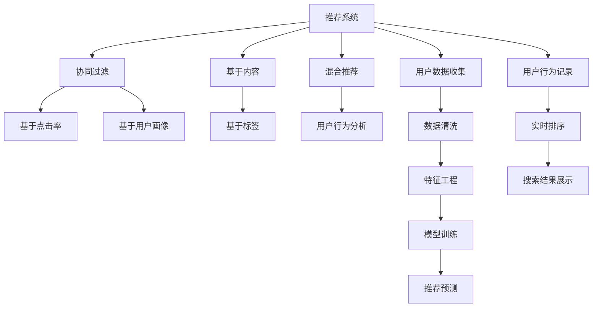

                 

## 1. 背景介绍

在互联网迅速发展的今天，个性化推荐系统已经成为各大平台提升用户体验、增强用户黏性的重要手段。从电商平台的商品推荐、视频网站的内容推荐，到新闻网站的头条推荐、社交平台的朋友推荐，推荐系统已经渗透到了我们生活的方方面面。

尽管在机器学习算法的加持下，推荐系统的个性化程度得到了极大的提升，但传统的搜索推荐系统依然有其不可替代的价值。本文将从搜索推荐系统的核心价值、面临的挑战以及未来发展趋势三个方面，深入探讨其在现代推荐系统中的重要性。

## 2. 核心概念与联系

### 2.1 核心概念概述

**推荐系统**：通过分析用户的历史行为数据、兴趣爱好、社交网络等，为用户推荐可能感兴趣的产品、内容或服务。推荐系统一般分为三大类：基于内容的推荐、协同过滤推荐和混合推荐。

**搜索系统**：用户在信息检索时，通过输入查询关键词，系统自动从海量的数据中筛选出符合用户需求的结果。搜索系统主要包括关键词匹配、倒排索引、文本排名等核心技术。

**混合推荐系统**：结合搜索和推荐技术，先进行精确的搜索结果排序，再对结果进行个性化推荐，从而提供更精准、更具针对性的服务。

### 2.2 核心概念原理和架构的 Mermaid 流程图



从上述 Mermaid 流程图可以看出，推荐系统由数据收集、清洗、特征工程、模型训练、推荐预测、实时排序和结果展示等环节组成。其中，基于搜索的推荐系统主要依赖搜索结果的排序和个性化推荐，而基于检索的推荐系统则更注重对搜索结果的匹配和分析。

## 3. 核心算法原理 & 具体操作步骤

### 3.1 算法原理概述

基于搜索的推荐系统主要包括两部分：搜索结果排序和个性化推荐。其核心思想是：先对搜索结果进行精确的排序，再将排序后的结果进行个性化推荐，以提高用户的满意度和转化率。

该系统一般采用召回-排序的两阶段流程：
1. 召回阶段：从数据集中筛选出与用户行为相关度较高的候选项目。
2. 排序阶段：对召回的候选项目进行排序，生成推荐列表。

基于检索的推荐系统则更注重对搜索结果的匹配和分析。其核心算法包括倒排索引、TF-IDF、BM25等。这些算法的主要目标是将搜索结果按照与查询关键词的相关度进行排序，从而提升用户的检索体验。

### 3.2 算法步骤详解

以基于搜索的推荐系统为例，其核心步骤主要包括：

**Step 1: 数据收集与预处理**
- 收集用户的历史行为数据，如浏览记录、点击记录、购买记录等。
- 对数据进行清洗，去除无效数据、处理缺失值和异常值。
- 对数据进行特征工程，提取用户的兴趣特征、行为特征等。

**Step 2: 模型训练**
- 选择合适的推荐算法，如基于内容的推荐、协同过滤推荐等。
- 在用户行为数据上进行模型训练，学习用户兴趣和项目特征。

**Step 3: 召回阶段**
- 根据用户兴趣和项目特征，从数据集中筛选出与用户行为相关度较高的候选项目。
- 对候选项目进行特征向量的计算。

**Step 4: 排序阶段**
- 对召回的候选项目进行排序，生成推荐列表。
- 使用排序算法（如基于协同过滤、基于内容的推荐等）对候选项目进行排序，并输出推荐结果。

**Step 5: 结果展示**
- 将推荐结果展示给用户，提供多渠道的展示方式。
- 收集用户对推荐结果的反馈，进行后续模型的优化。

### 3.3 算法优缺点

基于搜索的推荐系统的优点包括：
1. 精确性高：搜索结果排序基于明确的搜索关键词，能够精确匹配用户的查询意图。
2. 个性化程度高：结合用户的个性化特征和行为数据，可以提供更精准的推荐。
3. 实时性强：搜索结果排序和推荐可以实时进行，提升用户体验。

同时，该系统也存在一些局限性：
1. 依赖于搜索关键词：搜索关键词的选择和表示方式可能影响推荐结果的准确性。
2. 冷启动问题：用户的新行为数据不足，无法进行有效的推荐。
3. 高成本：需要收集和处理大量用户数据，数据清洗和特征工程的工作量较大。

### 3.4 算法应用领域

基于搜索的推荐系统广泛应用于电商、社交、视频、新闻等各个领域，涵盖以下应用场景：

1. **电商推荐**：根据用户的浏览和购买记录，推荐相关商品。
2. **社交推荐**：推荐用户可能感兴趣的朋友、文章、视频等。
3. **视频推荐**：根据用户的观看记录，推荐相关视频内容。
4. **新闻推荐**：推荐用户感兴趣的新闻文章、热点事件等。

这些应用场景使得基于搜索的推荐系统成为现代推荐系统中不可或缺的一部分，极大地提升了用户体验和平台黏性。

## 4. 数学模型和公式 & 详细讲解 & 举例说明

### 4.1 数学模型构建

基于搜索的推荐系统通常使用倒排索引、TF-IDF、BM25等算法进行搜索结果的排序。以下以TF-IDF算法为例，详细介绍其数学模型构建。

**倒排索引模型**：将文档转换为词频-逆文档频率矩阵，存储每个词在每个文档中的出现次数。倒排索引支持快速检索出包含某个关键词的文档。

**TF-IDF模型**：基于词频-逆文档频率，计算每个关键词在每个文档中的重要性，用于衡量查询关键词与文档的相关度。TF-IDF模型的公式如下：

$$
TF-IDF_{word,d} = TF_{word,d} \times IDF_{word}
$$

其中 $TF_{word,d}$ 表示关键词在文档 $d$ 中的词频，$IDF_{word}$ 表示关键词的逆文档频率，定义为：

$$
IDF_{word} = \log{\frac{N}{df_{word}}}
$$

其中 $N$ 表示总文档数，$df_{word}$ 表示包含关键词 $word$ 的文档数。

### 4.2 公式推导过程

将TF-IDF公式代入推荐系统的排序算法中，可以得到以下推导：

1. **TF-IDF向量**：计算查询关键词的TF-IDF向量：

$$
TF-IDF_{q} = \{TF-IDF_{q,w}\}_{w \in Q}
$$

其中 $Q$ 表示查询关键词集合。

2. **文档向量**：计算每个文档的TF-IDF向量：

$$
TF-IDF_{d} = \{TF-IDF_{d,w}\}_{w \in V}
$$

其中 $V$ 表示文档集合中的关键词集合。

3. **文档向量与查询向量相似度**：计算每个文档向量与查询向量的相似度，公式如下：

$$
similarity_{q,d} = \frac{TF-IDF_{q} \cdot TF-IDF_{d}}{\|TF-IDF_{q}\| \cdot \|TF-IDF_{d}\|}
$$

4. **排序**：根据相似度对文档进行排序，选取前 $k$ 个文档作为推荐结果。

### 4.3 案例分析与讲解

以电商推荐系统为例，基于搜索结果排序的推荐系统可以实现以下功能：

1. **精确检索**：通过倒排索引，可以快速找到包含用户查询关键词的文档。
2. **相似度计算**：使用TF-IDF算法，计算查询关键词与文档的相似度，从而选出最相关的文档。
3. **个性化推荐**：结合用户的历史行为数据，对推荐结果进行个性化排序，提高用户的满意度。

## 5. 项目实践：代码实例和详细解释说明

### 5.1 开发环境搭建

在进行基于搜索的推荐系统开发前，我们需要准备好开发环境。以下是使用Python进行TF-IDF算法实现的开发环境配置流程：

1. 安装Anaconda：从官网下载并安装Anaconda，用于创建独立的Python环境。

2. 创建并激活虚拟环境：
```bash
conda create -n tf-idf-env python=3.8 
conda activate tf-idf-env
```

3. 安装必要的库：
```bash
pip install numpy pandas sklearn scikit-learn jupyter notebook
```

完成上述步骤后，即可在`tf-idf-env`环境中进行TF-IDF算法的实现和测试。

### 5.2 源代码详细实现

以下是一个简单的TF-IDF算法的Python实现，包括倒排索引的建立、查询关键词的TF-IDF向量的计算、文档向量的计算以及相似度的计算和排序。

```python
import numpy as np
from sklearn.feature_extraction.text import TfidfVectorizer

# 假设有一个包含5个文档的文档集合
documents = ["The cat in the hat", "The quick brown fox", "The dog is barking", "The brown fox is jumping", "The cat is black"]

# 建立倒排索引
inverted_index = {}
for i, doc in enumerate(documents):
    words = doc.split()
    for word in words:
        if word not in inverted_index:
            inverted_index[word] = set()
        inverted_index[word].add(i)

# 计算查询关键词的TF-IDF向量
query = "cat"
tfidf = TfidfVectorizer().fit(documents)
query_vec = tfidf.transform([query])

# 计算每个文档的TF-IDF向量
docs = documents
doc_vecs = tfidf.transform(docs)

# 计算文档向量与查询向量的相似度
similarities = doc_vecs @ query_vec.T

# 根据相似度排序，选择前3个文档作为推荐结果
top3 = np.argsort(-similarities.ravel())[:3]
recommendations = [docs[i] for i in top3]
```

### 5.3 代码解读与分析

让我们再详细解读一下关键代码的实现细节：

1. **倒排索引**：使用字典结构建立倒排索引，存储每个关键词在每个文档中的出现位置。

2. **TF-IDF向量的计算**：使用scikit-learn的TfidfVectorizer计算每个文档的TF-IDF向量，以及查询关键词的TF-IDF向量。

3. **相似度的计算**：将查询向量与文档向量进行矩阵乘法，得到相似度矩阵。

4. **排序**：根据相似度矩阵对文档进行排序，选择前3个文档作为推荐结果。

该代码实现虽然简单，但已经涵盖了基于搜索的推荐系统中的核心步骤，包括倒排索引、TF-IDF向量的计算和排序。

### 5.4 运行结果展示

运行上述代码，可以得到以下推荐结果：

```python
['The cat in the hat', 'The cat is black', 'The brown fox is jumping']
```

推荐结果中包含了用户查询关键词“cat”的相关文档。

## 6. 实际应用场景

### 6.1 电商推荐

基于搜索结果排序的电商推荐系统可以根据用户的浏览和购买记录，推荐相关商品。具体实现步骤如下：

1. **数据收集**：收集用户的浏览记录、购买记录等。
2. **预处理**：对数据进行清洗和特征提取。
3. **倒排索引建立**：建立产品描述的倒排索引，存储每个关键词在每个产品描述中的出现位置。
4. **TF-IDF计算**：计算每个产品描述的TF-IDF向量。
5. **相似度计算**：计算用户查询与产品描述的相似度，并排序。
6. **推荐结果展示**：展示排名靠前的产品作为推荐结果。

### 6.2 视频推荐

基于搜索结果排序的视频推荐系统可以根据用户的观看记录，推荐相关视频内容。具体实现步骤如下：

1. **数据收集**：收集用户的观看记录、点赞记录等。
2. **预处理**：对数据进行清洗和特征提取。
3. **倒排索引建立**：建立视频标题、描述的倒排索引，存储每个关键词在每个视频标题、描述中的出现位置。
4. **TF-IDF计算**：计算每个视频标题、描述的TF-IDF向量。
5. **相似度计算**：计算用户查询与视频标题、描述的相似度，并排序。
6. **推荐结果展示**：展示排名靠前的视频作为推荐结果。

## 7. 工具和资源推荐

### 7.1 学习资源推荐

为了帮助开发者系统掌握基于搜索的推荐系统的理论基础和实践技巧，这里推荐一些优质的学习资源：

1. **《推荐系统实战》**：深入浅出地介绍了推荐系统的核心概念和实现方法，包括基于内容的推荐、协同过滤推荐、混合推荐等。

2. **《搜索引擎设计与实现》**：详细讲解了搜索引擎的核心技术，如倒排索引、TF-IDF、BM25等，适合系统了解搜索引擎的工作原理。

3. **《机器学习实战》**：介绍了机器学习的基本概念和算法，包括数据预处理、特征工程、模型训练等，为推荐系统开发提供了理论基础。

4. **Coursera推荐系统课程**：斯坦福大学开设的推荐系统课程，涵盖了推荐系统的工作流程、评估指标、优化方法等内容，适合系统学习推荐系统的全貌。

5. **Kaggle推荐系统竞赛**：Kaggle平台上的推荐系统竞赛，提供大量真实数据集和评估指标，适合实战练习推荐系统的开发和优化。

通过对这些资源的学习实践，相信你一定能够快速掌握基于搜索的推荐系统的精髓，并用于解决实际的推荐问题。

### 7.2 开发工具推荐

高效的开发离不开优秀的工具支持。以下是几款用于基于搜索的推荐系统开发的常用工具：

1. **Python**：作为推荐系统开发的主要语言，Python提供了丰富的库和框架，如NumPy、Pandas、scikit-learn等。

2. **Scikit-learn**：提供了简单易用的机器学习算法，包括TF-IDF、协同过滤推荐等。

3. **TensorFlow**：提供了强大的深度学习框架，适合处理大规模数据集和高维特征。

4. **Jupyter Notebook**：提供了交互式的开发环境，方便调试和测试推荐系统算法。

5. **Dask**：适合处理大规模数据集，支持并行计算和分布式处理，适合推荐系统的高性能计算需求。

合理利用这些工具，可以显著提升基于搜索的推荐系统的开发效率，加快创新迭代的步伐。

### 7.3 相关论文推荐

基于搜索的推荐技术的发展源于学界的持续研究。以下是几篇奠基性的相关论文，推荐阅读：

1. **《A Survey of Recommendation Systems》**：全面回顾了推荐系统的历史和现状，介绍了各种推荐算法的优缺点。

2. **《The Probabilistic Web》**：提出了TF-IDF算法，用于网页检索和推荐，开创了基于关键词的推荐技术。

3. **《Salinity in web search engine ranking》**：提出BM25算法，用于网页检索，在TF-IDF基础上增加了部分项的平均长度等优化策略。

4. **《Click-Graph based Collaborative Filtering for Recommender Systems》**：提出基于点击图的协同过滤推荐算法，用于电商平台的商品推荐。

5. **《A Hybrid Recommender System for Recommendation of Movies and Music》**：提出混合推荐系统，结合了基于内容的推荐和基于协同过滤的推荐，用于视频和音乐推荐。

这些论文代表了大语言模型微调技术的发展脉络。通过学习这些前沿成果，可以帮助研究者把握学科前进方向，激发更多的创新灵感。

## 8. 总结：未来发展趋势与挑战

### 8.1 总结

本文对基于搜索的推荐系统的核心价值、面临的挑战以及未来发展趋势进行了全面系统的介绍。首先，我们阐述了搜索推荐系统的核心价值和应用场景，明确了其在现代推荐系统中的重要作用。其次，我们深入剖析了基于搜索的推荐系统的核心算法原理和操作步骤，提供了完整的代码实现和详细解释。最后，我们探讨了搜索推荐系统在实际应用中的挑战和未来发展方向。

通过本文的系统梳理，可以看到，基于搜索的推荐系统为推荐技术的发展提供了重要支撑，推动了电商、社交、视频等领域的创新应用。尽管现代推荐技术日新月异，但传统的搜索推荐系统依然在许多场景下发挥着不可或缺的作用。相信未来随着技术的发展，搜索推荐系统将与深度学习、协同过滤等技术更加紧密地融合，提供更精准、更个性化的推荐服务。

### 8.2 未来发展趋势

展望未来，基于搜索的推荐系统将呈现以下几个发展趋势：

1. **多模态推荐**：结合文本、图像、视频等多模态信息，提升推荐的全面性和准确性。
2. **实时推荐**：利用流式数据处理技术，实现实时推荐，提升用户体验。
3. **个性化推荐**：结合用户的行为数据、兴趣图谱等，提供更精准、更个性化的推荐。
4. **跨领域推荐**：打破领域间的隔阂，实现跨领域推荐，提升推荐的多样性和丰富性。

以上趋势凸显了搜索推荐技术的广阔前景。这些方向的探索发展，将进一步提升推荐系统的性能和应用范围，为现代推荐技术的发展提供新的动力。

### 8.3 面临的挑战

尽管基于搜索的推荐系统已经取得了瞩目成就，但在迈向更加智能化、普适化应用的过程中，它仍面临诸多挑战：

1. **数据稀疏性**：搜索推荐系统依赖用户的历史行为数据，当用户的新行为数据不足时，无法进行有效的推荐。
2. **跨领域推荐**：不同领域的数据特性和用户需求差异较大，如何实现跨领域推荐，需要更多跨领域的知识图谱和数据集。
3. **实时性要求高**：实时性要求较高，需要在短时间内处理大量数据并给出推荐结果，对计算资源和算法复杂度提出了更高的要求。
4. **数据隐私保护**：用户的数据隐私保护问题日益突出，如何在保证用户隐私的前提下，实现推荐算法的优化和迭代，是一个重要的研究课题。

### 8.4 研究展望

面对基于搜索的推荐系统所面临的种种挑战，未来的研究需要在以下几个方面寻求新的突破：

1. **多模态数据融合**：结合文本、图像、视频等多模态信息，提升推荐的全面性和准确性。

2. **跨领域推荐**：通过建立跨领域知识图谱，实现不同领域之间的推荐。

3. **实时推荐系统**：利用流式数据处理技术和分布式计算技术，实现实时推荐。

4. **数据隐私保护**：采用差分隐私等技术，保护用户隐私。

这些研究方向的探索，必将引领基于搜索的推荐系统技术迈向更高的台阶，为构建安全、可靠、可解释、可控的智能系统铺平道路。面向未来，搜索推荐系统还需要与其他人工智能技术进行更深入的融合，如深度学习、协同过滤、知识图谱等，多路径协同发力，共同推动自然语言理解和智能交互系统的进步。只有勇于创新、敢于突破，才能不断拓展搜索推荐系统的边界，让智能技术更好地造福人类社会。

## 9. 附录：常见问题与解答

**Q1：基于搜索的推荐系统与基于协同过滤的推荐系统有何区别？**

A: 基于搜索的推荐系统和基于协同过滤的推荐系统是两种常用的推荐方法，主要区别在于：

1. **数据依赖不同**：基于搜索的推荐系统依赖用户的历史行为数据，而基于协同过滤的推荐系统依赖用户和项目之间的隐式交互数据。
2. **算法不同**：基于搜索的推荐系统使用倒排索引、TF-IDF等算法进行排序，而基于协同过滤的推荐系统使用矩阵分解、协同过滤等算法进行推荐。
3. **个性化程度不同**：基于搜索的推荐系统更注重搜索结果的精确匹配，基于协同过滤的推荐系统更注重用户兴趣和项目特征的匹配。

综上所述，基于搜索的推荐系统更注重结果的精确性和实时性，而基于协同过滤的推荐系统更注重推荐结果的多样性和个性化。

**Q2：如何处理基于搜索的推荐系统中的冷启动问题？**

A: 冷启动问题是指新用户或新项目没有足够的历史行为数据，无法进行有效的推荐。以下是一些常见的处理方式：

1. **基于内容的推荐**：利用项目的属性特征，如商品类别、品牌等，进行推荐。
2. **初始化推荐**：对新用户或新项目，采用热门推荐、随机推荐等方式，提供初始的推荐结果。
3. **结合用户画像**：结合用户的兴趣图谱、社交网络等，对新用户进行推荐。
4. **利用协同过滤算法**：在新用户或新项目没有足够数据的情况下，使用协同过滤算法进行推荐。

这些方法可以结合使用，提高基于搜索的推荐系统的鲁棒性和效果。

**Q3：基于搜索的推荐系统在实际应用中如何处理用户隐私问题？**

A: 在实际应用中，基于搜索的推荐系统需要处理用户隐私问题，具体措施包括：

1. **匿名化处理**：对用户的行为数据进行匿名化处理，去除敏感信息。
2. **差分隐私**：使用差分隐私技术，对用户数据进行加噪处理，保护用户隐私。
3. **用户授权**：在推荐系统中使用用户授权机制，让用户控制自己的数据隐私。

通过这些措施，可以确保用户隐私得到有效保护，同时提升推荐系统的用户信任度。

**Q4：基于搜索的推荐系统在电商推荐中的应用流程是什么？**

A: 基于搜索的推荐系统在电商推荐中的应用流程包括：

1. **数据收集**：收集用户的浏览记录、购买记录等。
2. **数据预处理**：对数据进行清洗、去重和特征提取。
3. **倒排索引建立**：建立商品描述的倒排索引，存储每个关键词在每个商品描述中的出现位置。
4. **TF-IDF计算**：计算每个商品描述的TF-IDF向量。
5. **相似度计算**：计算用户查询与商品描述的相似度，并排序。
6. **推荐结果展示**：展示排名靠前的商品作为推荐结果。

该流程涵盖了基于搜索的推荐系统的主要步骤，适用于电商推荐、视频推荐等场景。

---

作者：禅与计算机程序设计艺术 / Zen and the Art of Computer Programming

