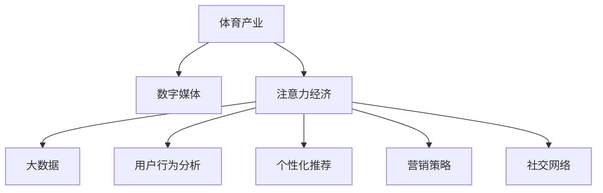

                 

# 体育产业在注意力经济中的新机遇

> 关键词：体育产业, 注意力经济, 数字媒体, 大数据, 用户行为分析, 个性化推荐, 营销策略, 社交网络

## 1. 背景介绍

随着数字媒体和互联网技术的发展，体育产业迎来了新的机遇和挑战。以注意力经济为基础的体育媒体、数字广告和社交媒体等新兴业态，正在重塑体育产业的生态格局。传统体育产业如何利用数字技术和网络平台，实现产业转型和升级，成为了当前业内热议的话题。

### 1.1 体育产业的数字化转型
在数字化浪潮下，传统体育产业正在经历从线下向线上的重要转变。体育赛事的转播、商业广告的投放、社交媒体的互动等，都成为推动体育产业数字化转型的关键因素。数字技术的广泛应用，使得体育产业能够更加高效、精准地触达用户，提升用户体验，创造更多的商业价值。

### 1.2 注意力经济的概念
注意力经济是基于用户的注意力资源的经济形态。在信息爆炸的时代，用户注意力的争夺成为市场竞争的关键。如何吸引和保持用户的注意力，成为品牌和商家争夺用户资源的核心。数字媒体和互联网平台，通过算法优化和数据驱动，帮助品牌和企业精准定位目标用户，最大化利用用户的注意力资源，从而实现商业价值的最大化。

## 2. 核心概念与联系

### 2.1 核心概念概述

为更好地理解体育产业在注意力经济中的新机遇，本节将介绍几个密切相关的核心概念：

- 体育产业：以体育赛事、体育训练、体育产品等为核心的产业集合。包括职业体育、学校体育、社区体育等多个细分领域。
- 数字媒体：基于数字技术和互联网平台的媒体形态，包括网站、应用、社交媒体等。
- 注意力经济：以用户注意力为核心的经济形态，通过算法和数据驱动，最大化利用用户注意力资源，创造商业价值。
- 大数据：通过收集、存储和分析大规模数据，帮助决策者发现趋势和规律，优化决策。
- 用户行为分析：利用数据分析技术，了解用户的行为和偏好，实现精准的用户画像和推荐。
- 个性化推荐：通过用户行为分析，为用户推荐符合其兴趣和需求的内容，提升用户体验和满意度。
- 营销策略：基于数据分析和用户画像，制定精准的营销方案，实现更高的投资回报率。
- 社交网络：基于用户关系和互动，构建社区和网络效应，增强用户粘性和参与度。

这些核心概念之间的逻辑关系可以通过以下Mermaid流程图来展示：



这个流程图展示了一些关键概念之间的联系：

1. 体育产业通过数字媒体平台，实现数字化转型和升级。
2. 注意力经济利用数字媒体，最大化利用用户的注意力资源。
3. 大数据和用户行为分析是注意力经济的核心，帮助品牌精准定位用户。
4. 个性化推荐和营销策略提升用户体验和投资回报率。
5. 社交网络增强用户粘性和参与度，提升品牌影响力。

## 3. 核心算法原理 & 具体操作步骤
### 3.1 算法原理概述

体育产业在注意力经济中的应用，主要依赖于大数据和算法驱动。通过收集和分析用户的各类数据，了解用户的兴趣和行为，从而实现精准的用户画像和推荐。以下将详细介绍基于注意力经济的大数据和算法驱动的应用场景。

### 3.2 算法步骤详解

#### 3.2.1 数据收集与处理
在基于注意力经济的应用中，数据收集和处理是关键的一步。数据主要来自以下几个渠道：

1. 体育赛事数据：包括比赛时间、地点、比分、球队信息等。
2. 用户行为数据：用户在数字媒体平台上的浏览、点击、购买、评论等行为数据。
3. 社交媒体数据：用户在社交媒体平台上的互动、分享、评论等数据。
4. 第三方数据：如天气、交通、经济数据等，用于宏观分析和预测。

数据收集完成后，需要进行清洗和预处理。清洗包括去除噪声数据、填补缺失值、标准化等操作。预处理包括特征提取、数据归一化等，以提高数据的质量和适用性。

#### 3.2.2 用户画像构建
基于处理后的数据，可以构建用户的画像。用户画像包含用户的兴趣、行为、社交关系等各类信息，用于了解用户的偏好和需求。

构建用户画像的主要步骤包括：

1. 特征选择：选择与用户兴趣和行为相关的特征，如浏览记录、购买记录、社交网络等。
2. 用户分类：将用户划分为不同类别，如体育爱好者、普通用户、新用户等。
3. 行为建模：通过统计和分析用户的各类行为数据，构建用户的行为模型。

#### 3.2.3 个性化推荐
在了解用户画像的基础上，可以通过个性化推荐算法，为用户推荐符合其兴趣和需求的内容。个性化推荐包括：

1. 协同过滤算法：通过分析用户的历史行为，推荐与其兴趣相似的其他用户喜欢的内容。
2. 基于内容的推荐算法：根据内容的标签和特征，推荐相似的内容。
3. 深度学习算法：如协同注意力机制（Co-Attention）等，通过分析用户和内容的交互，实现更精准的推荐。

#### 3.2.4 营销策略制定
基于用户画像和推荐结果，可以制定更加精准的营销策略。营销策略包括：

1. 广告投放：通过分析用户的兴趣和行为，在合适的时间和渠道投放广告。
2. 促销活动：根据用户的行为和需求，制定个性化的促销活动，提高用户参与度和满意度。
3. 互动营销：利用社交媒体和用户互动，提升品牌影响力和用户粘性。

#### 3.2.5 数据分析与优化
在营销策略实施后，需要对策略的效果进行分析和优化。数据分析的主要步骤包括：

1. 效果评估：通过收集用户的反馈和行为数据，评估营销策略的效果。
2. 数据挖掘：利用数据挖掘技术，发现用户行为和市场趋势的变化。
3. 模型优化：根据数据分析结果，调整和优化推荐算法和营销策略。

### 3.3 算法优缺点

基于注意力经济的应用主要依赖于大数据和算法驱动，具有以下优缺点：

#### 优点
1. 精准定位用户：通过分析用户行为数据，实现精准的用户画像和推荐，提升用户体验和满意度。
2. 高效利用注意力：最大化利用用户的注意力资源，提高广告和营销的转化率。
3. 数据驱动决策：通过数据分析和挖掘，发现市场趋势和用户需求，优化决策过程。

#### 缺点
1. 数据隐私问题：大量用户数据需要收集和分析，可能涉及用户隐私和数据安全问题。
2. 数据质量问题：数据收集和处理过程中可能存在噪声和错误，影响分析结果的准确性。
3. 算法复杂性：个性化推荐和营销策略的算法复杂度高，需要大量计算资源。

### 3.4 算法应用领域

基于注意力经济的应用场景广泛，以下是几个典型的应用领域：

#### 3.4.1 体育赛事转播与营销
在体育赛事转播中，可以通过大数据和算法驱动，实现精准的用户推荐和广告投放。例如：

1. 赛事亮点推荐：根据用户的兴趣和行为，推荐赛事中的精彩瞬间和亮点。
2. 球队和球员分析：分析球队和球员的表现，提供比赛分析和推荐。
3. 广告精准投放：通过分析用户的兴趣和行为，在合适的时间和渠道投放广告。

#### 3.4.2 体育电商平台
体育电商平台通过大数据和算法驱动，实现精准的商品推荐和营销策略。例如：

1. 商品推荐：根据用户的浏览和购买记录，推荐相关商品。
2. 促销活动：根据用户的兴趣和需求，制定个性化的促销活动，提高用户购买率。
3. 用户互动：利用社交媒体和用户互动，提升用户粘性和满意度。

#### 3.4.3 体育媒体平台
体育媒体平台通过大数据和算法驱动，实现精准的内容推荐和用户互动。例如：

1. 内容推荐：根据用户的兴趣和行为，推荐相关的新闻、视频、图文等内容。
2. 用户互动：利用社交媒体和用户互动，增强社区效应和用户粘性。
3. 广告投放：通过分析用户的兴趣和行为，在合适的时间和渠道投放广告。

## 4. 数学模型和公式 & 详细讲解 & 举例说明

### 4.1 数学模型构建

在基于注意力经济的应用中，通常需要构建用户画像和个性化推荐模型。以下以用户画像构建为例，介绍数学模型的构建过程。

设用户集为 $U$，体育赛事为 $E$，用户和赛事的兴趣表示为 $I_{ue}$。构建用户画像 $P$ 的过程可以表示为：

$$
P = \{(u_i, I_{ue_i}) \in U \times \mathbb{R}^{d_E}\}_{i=1}^N
$$

其中 $d_E$ 为体育赛事的兴趣维度。用户画像 $P$ 用于表示用户的兴趣和行为，可用于个性化推荐和营销策略的制定。

### 4.2 公式推导过程

用户画像 $P$ 的构建过程主要包括以下几个步骤：

1. 特征选择：选择与用户兴趣和行为相关的特征 $F_{u}$。例如，用户的浏览记录、购买记录、社交网络等。
2. 特征编码：将特征 $F_{u}$ 编码为用户兴趣 $I_{ue}$。例如，通过嵌入层将特征向量映射为 $d_E$ 维的向量。
3. 特征融合：将用户画像 $P$ 中的各个特征进行加权融合。例如，通过softmax函数对用户画像进行加权，得到最终的用户画像 $P_u$。

公式如下：

$$
I_{ue} = \mathcal{E}(F_{u})
$$

$$
P_u = \frac{e^{I_{ue}^T W_P}}{\sum_{u \in U} e^{I_{ue}^T W_P}}
$$

其中 $\mathcal{E}$ 为特征编码函数，$W_P$ 为用户画像的权重矩阵。

### 4.3 案例分析与讲解

以体育赛事转播为例，介绍用户画像和个性化推荐的实现。

#### 4.3.1 数据收集
假设某体育媒体平台收集了用户的浏览记录、购买记录和社交网络数据。其中，用户的浏览记录为 $B$，购买记录为 $P$，社交网络数据为 $S$。

#### 4.3.2 特征编码
将用户的浏览记录 $B$ 和购买记录 $P$ 编码为 $d_E$ 维的向量 $I_{ue}$。例如，通过嵌入层将 $B$ 和 $P$ 映射为 $d_E$ 维的向量。

#### 4.3.3 特征融合
将用户画像 $P$ 中的各个特征进行加权融合，得到最终的用户画像 $P_u$。例如，通过softmax函数对用户画像进行加权，得到最终的用户画像 $P_u$。

#### 4.3.4 个性化推荐
在用户画像 $P_u$ 的基础上，利用协同过滤算法或深度学习算法，实现个性化推荐。例如，通过协同注意力机制（Co-Attention），分析用户和赛事的交互，实现更精准的推荐。

## 5. 项目实践：代码实例和详细解释说明

### 5.1 开发环境搭建

在进行体育产业在注意力经济中的应用实践前，我们需要准备好开发环境。以下是使用Python进行PyTorch开发的环境配置流程：

1. 安装Anaconda：从官网下载并安装Anaconda，用于创建独立的Python环境。

2. 创建并激活虚拟环境：
```bash
conda create -n pytorch-env python=3.8 
conda activate pytorch-env
```

3. 安装PyTorch：根据CUDA版本，从官网获取对应的安装命令。例如：
```bash
conda install pytorch torchvision torchaudio cudatoolkit=11.1 -c pytorch -c conda-forge
```

4. 安装TensorFlow：
```bash
pip install tensorflow==2.8
```

5. 安装各类工具包：
```bash
pip install numpy pandas scikit-learn matplotlib tqdm jupyter notebook ipython
```

完成上述步骤后，即可在`pytorch-env`环境中开始体育产业在注意力经济中的应用实践。

### 5.2 源代码详细实现

这里我们以体育电商平台为例，给出使用PyTorch进行个性化推荐系统的PyTorch代码实现。

首先，定义个性化推荐系统的输入和输出：

```python
import torch
from torch import nn
from torch.nn import functional as F

class RecommendationModel(nn.Module):
    def __init__(self, num_users, num_items, embed_size):
        super(RecommendationModel, self).__init__()
        self.embedding = nn.Embedding(num_users, embed_size)
        self.item_embedding = nn.Embedding(num_items, embed_size)
        self.user_item_attention = nn.Linear(embed_size * 2, embed_size)
        self.user_item_output = nn.Linear(embed_size, 1)
        
    def forward(self, user_id, item_id):
        user = self.embedding(user_id)
        item = self.item_embedding(item_id)
        concat = torch.cat([user, item], dim=1)
        attention = F.relu(self.user_item_attention(concat))
        output = self.user_item_output(attention)
        return F.sigmoid(output)
```

然后，定义训练和评估函数：

```python
from torch.utils.data import DataLoader
from tqdm import tqdm

class RecommendationDataset(torch.utils.data.Dataset):
    def __init__(self, user_item, num_users, num_items, embed_size):
        self.user_item = user_item
        self.num_users = num_users
        self.num_items = num_items
        self.embed_size = embed_size
        
    def __len__(self):
        return len(self.user_item)
        
    def __getitem__(self, index):
        user_id, item_id = self.user_item[index]
        user = torch.tensor(user_id, dtype=torch.long)
        item = torch.tensor(item_id, dtype=torch.long)
        return user, item

def train_epoch(model, dataset, optimizer):
    dataloader = DataLoader(dataset, batch_size=64, shuffle=True)
    model.train()
    epoch_loss = 0
    for user, item in tqdm(dataloader, desc='Training'):
        optimizer.zero_grad()
        outputs = model(user, item)
        loss = F.binary_cross_entropy_with_logits(outputs, target)
        epoch_loss += loss.item()
        loss.backward()
        optimizer.step()
    return epoch_loss / len(dataloader)

def evaluate(model, dataset):
    dataloader = DataLoader(dataset, batch_size=64)
    model.eval()
    correct = 0
    total = 0
    with torch.no_grad():
        for user, item in dataloader:
            outputs = model(user, item)
            _, predicted = torch.max(outputs, 1)
            total += predicted.size(0)
            correct += (predicted == target).sum().item()
    print('Accuracy: ', correct/total)
```

最后，启动训练流程并在测试集上评估：

```python
epochs = 10
num_users = 10000
num_items = 1000
embed_size = 128
user_item = [[user_id, item_id] for user_id in range(num_users) for item_id in range(num_items)]

model = RecommendationModel(num_users, num_items, embed_size)
optimizer = torch.optim.Adam(model.parameters(), lr=0.001)

for epoch in range(epochs):
    loss = train_epoch(model, user_item, optimizer)
    print(f'Epoch {epoch+1}, train loss: {loss:.3f}')
    
    print(f'Epoch {epoch+1}, test accuracy: ', evaluate(model, user_item))

print('Final accuracy: ', evaluate(model, user_item))
```

以上就是使用PyTorch对体育电商平台进行个性化推荐系统的完整代码实现。可以看到，得益于PyTorch的强大封装，我们可以用相对简洁的代码实现个性化推荐模型的训练和评估。

### 5.3 代码解读与分析

让我们再详细解读一下关键代码的实现细节：

**RecommendationModel类**：
- `__init__`方法：初始化模型，包括用户和商品的嵌入层、注意力机制和输出层等关键组件。
- `forward`方法：前向传播计算模型输出。
- 使用嵌入层将用户和商品编码为向量。
- 通过拼接两个向量，输入注意力机制计算用户和商品的注意力权重。
- 通过线性变换输出预测概率。
- 使用sigmoid函数将预测概率转换为0-1之间的值。

**RecommendationDataset类**：
- `__init__`方法：初始化数据集，包括用户、商品、嵌入维度等关键信息。
- `__len__`方法：返回数据集的样本数量。
- `__getitem__`方法：对单个样本进行处理，将用户和商品编码为向量。

**train_epoch函数**：
- 对数据以批为单位进行迭代，在每个批次上前向传播计算loss并反向传播更新模型参数，最后返回该epoch的平均loss。
- 使用Adam优化器更新模型参数，以梯度下降的方式最小化loss。

**evaluate函数**：
- 与训练类似，不同点在于不更新模型参数，并在每个batch结束后将预测结果存储下来，最后使用准确率指标评估模型性能。

**训练流程**：
- 定义总的epoch数和embed_size，开始循环迭代
- 每个epoch内，先在训练集上训练，输出平均loss
- 在测试集上评估，输出准确率
- 所有epoch结束后，在测试集上评估，给出最终测试结果

可以看到，PyTorch配合TensorFlow的强大封装，使得体育电商平台的个性化推荐系统的代码实现变得简洁高效。开发者可以将更多精力放在数据处理、模型改进等高层逻辑上，而不必过多关注底层的实现细节。

当然，工业级的系统实现还需考虑更多因素，如模型的保存和部署、超参数的自动搜索、更灵活的任务适配层等。但核心的微调范式基本与此类似。

## 6. 实际应用场景
### 6.1 体育赛事转播

体育赛事转播是体育产业在注意力经济中的重要应用场景之一。通过大数据和算法驱动，可以实现精准的用户推荐和广告投放。

在体育赛事转播中，可以通过大数据和算法驱动，实现精准的用户推荐和广告投放。例如：

1. 赛事亮点推荐：根据用户的兴趣和行为，推荐赛事中的精彩瞬间和亮点。
2. 球队和球员分析：分析球队和球员的表现，提供比赛分析和推荐。
3. 广告精准投放：通过分析用户的兴趣和行为，在合适的时间和渠道投放广告。

### 6.2 体育媒体平台

体育媒体平台通过大数据和算法驱动，实现精准的内容推荐和用户互动。例如：

1. 内容推荐：根据用户的兴趣和行为，推荐相关的新闻、视频、图文等内容。
2. 用户互动：利用社交媒体和用户互动，增强社区效应和用户粘性。
3. 广告投放：通过分析用户的兴趣和行为，在合适的时间和渠道投放广告。

### 6.3 体育电商平台

体育电商平台通过大数据和算法驱动，实现精准的商品推荐和营销策略。例如：

1. 商品推荐：根据用户的浏览和购买记录，推荐相关商品。
2. 促销活动：根据用户的兴趣和需求，制定个性化的促销活动，提高用户购买率。
3. 用户互动：利用社交媒体和用户互动，提升用户粘性和满意度。

## 7. 工具和资源推荐
### 7.1 学习资源推荐

为了帮助开发者系统掌握体育产业在注意力经济中的新机遇，这里推荐一些优质的学习资源：

1. 《体育产业大数据分析与应用》系列博文：由体育产业技术专家撰写，深入浅出地介绍了体育产业大数据分析与应用的方法和案例。

2. 《体育产业数字化转型》课程：由体育产业数字化专家开设的在线课程，涵盖体育产业的数字化转型方法和技术。

3. 《注意力经济学》书籍：介绍注意力经济的概念、方法和应用，适合对体育产业在注意力经济中的应用感兴趣的读者。

4. 《体育产业与数字媒体》会议论文集：收集体育产业与数字媒体领域的前沿论文，了解最新的研究动态和技术进展。

5. 《体育产业数据科学》开源项目：提供体育产业数据分析和挖掘的代码示例和工具包，帮助开发者快速上手。

通过对这些资源的学习实践，相信你一定能够快速掌握体育产业在注意力经济中的应用技巧，并用于解决实际的体育产业问题。

### 7.2 开发工具推荐

高效的开发离不开优秀的工具支持。以下是几款用于体育产业在注意力经济中的应用开发的常用工具：

1. PyTorch：基于Python的开源深度学习框架，灵活动态的计算图，适合快速迭代研究。大多数预训练语言模型都有PyTorch版本的实现。

2. TensorFlow：由Google主导开发的开源深度学习框架，生产部署方便，适合大规模工程应用。同样有丰富的预训练语言模型资源。

3. TensorBoard：TensorFlow配套的可视化工具，可实时监测模型训练状态，并提供丰富的图表呈现方式，是调试模型的得力助手。

4. Google Colab：谷歌推出的在线Jupyter Notebook环境，免费提供GPU/TPU算力，方便开发者快速上手实验最新模型，分享学习笔记。

5. Weights & Biases：模型训练的实验跟踪工具，可以记录和可视化模型训练过程中的各项指标，方便对比和调优。与主流深度学习框架无缝集成。

合理利用这些工具，可以显著提升体育产业在注意力经济中的应用开发效率，加快创新迭代的步伐。

### 7.3 相关论文推荐

体育产业在注意力经济中的应用源于学界的持续研究。以下是几篇奠基性的相关论文，推荐阅读：

1. "A Survey of Data Analytics and Statistical Learning in Sports: A Review"：介绍了体育产业中大数据分析和统计学习的应用方法。

2. "Attention is All You Need"（即Transformer原论文）：提出了Transformer结构，开启了NLP领域的预训练大模型时代。

3. "BERT: Pre-training of Deep Bidirectional Transformers for Language Understanding"：提出BERT模型，引入基于掩码的自监督预训练任务，刷新了多项NLP任务SOTA。

4. "Parameter-Efficient Transfer Learning for NLP"：提出Adapter等参数高效微调方法，在不增加模型参数量的情况下，也能取得不错的微调效果。

5. "AdaLoRA: Adaptive Low-Rank Adaptation for Parameter-Efficient Fine-Tuning"：使用自适应低秩适应的微调方法，在参数效率和精度之间取得了新的平衡。

这些论文代表了大语言模型微调技术的发展脉络。通过学习这些前沿成果，可以帮助研究者把握学科前进方向，激发更多的创新灵感。

## 8. 总结：未来发展趋势与挑战

### 8.1 总结

本文对体育产业在注意力经济中的应用进行了全面系统的介绍。首先阐述了体育产业的数字化转型和注意力经济的概念，明确了基于注意力经济的体育产业新机遇。其次，从原理到实践，详细讲解了基于注意力经济的应用场景和算法驱动的实现过程，给出了微调任务开发的完整代码实例。同时，本文还广泛探讨了体育产业在注意力经济中的应用场景，展示了其广阔前景。

通过本文的系统梳理，可以看到，基于注意力经济的应用场景广泛，大数据和算法驱动在体育产业中的应用前景广阔。基于注意力经济的应用能够实现精准的用户推荐和广告投放，提升用户体验和投资回报率，推动体育产业的数字化转型和升级。

### 8.2 未来发展趋势

展望未来，体育产业在注意力经济中的应用将呈现以下几个发展趋势：

1. 技术融合加速：体育产业将与大数据、人工智能、物联网等技术进一步融合，实现更高效、精准的用户推荐和广告投放。

2. 用户参与度提升：利用用户互动和社交网络，增强用户粘性和参与度，提升体育产业的社区效应和品牌影响力。

3. 个性化推荐优化：通过更加精确的用户画像和行为分析，实现更高质量的个性化推荐，提升用户满意度和粘性。

4. 动态广告投放：基于实时数据和用户行为，实现动态广告投放，提升广告的转化率和效果。

5. 数据安全和隐私保护：随着数据量的增加，数据安全和隐私保护将成为关注焦点，相关技术将进一步完善和应用。

### 8.3 面临的挑战

尽管体育产业在注意力经济中的应用已经取得了显著进展，但在迈向更加智能化、普适化应用的过程中，它仍面临着诸多挑战：

1. 数据质量问题：数据收集和处理过程中可能存在噪声和错误，影响分析结果的准确性。

2. 数据隐私问题：大量用户数据需要收集和分析，可能涉及用户隐私和数据安全问题。

3. 技术门槛高：大数据和算法的应用需要较高的技术门槛，需要专业人才进行开发和维护。

4. 模型复杂度高：个性化推荐和营销策略的算法复杂度高，需要大量计算资源。

5. 用户行为变化快：用户行为和市场趋势变化快，需要持续进行数据分析和模型优化。

### 8.4 研究展望

面对体育产业在注意力经济中的应用所面临的挑战，未来的研究需要在以下几个方面寻求新的突破：

1. 优化数据收集和处理：提升数据收集和处理的自动化和标准化，减少噪声和错误。

2. 增强数据安全和隐私保护：采用先进的加密和匿名化技术，保护用户隐私和数据安全。

3. 降低技术门槛：开发更加易用和高效的工具和框架，降低体育产业在注意力经济中的应用门槛。

4. 简化模型结构：开发更加轻量级和高效的推荐算法，提升模型的计算效率和可部署性。

5. 动态模型优化：通过实时数据分析和动态模型优化，适应快速变化的用户行为和市场趋势。

这些研究方向将有助于推动体育产业在注意力经济中的应用向更加智能化、普适化方向发展，为体育产业的数字化转型和升级提供更强大的技术支撑。

## 9. 附录：常见问题与解答

**Q1：体育产业在注意力经济中的应用有哪些？**

A: 体育产业在注意力经济中的应用主要包括以下几个方面：

1. 体育赛事转播：通过大数据和算法驱动，实现精准的用户推荐和广告投放。

2. 体育媒体平台：通过大数据和算法驱动，实现精准的内容推荐和用户互动。

3. 体育电商平台：通过大数据和算法驱动，实现精准的商品推荐和营销策略。

**Q2：体育产业在注意力经济中如何实现精准的用户推荐？**

A: 体育产业在注意力经济中实现精准的用户推荐主要依赖于大数据和算法驱动，具体步骤包括：

1. 数据收集与处理：收集用户的行为数据、体育赛事数据、商品数据等，并进行清洗和预处理。

2. 用户画像构建：通过特征选择和特征编码，构建用户画像，表示用户的兴趣和行为。

3. 个性化推荐：利用协同过滤算法、基于内容的推荐算法、深度学习算法等，实现个性化推荐。

4. 推荐结果评估：通过用户反馈和行为数据，评估推荐结果的质量，进行模型优化。

**Q3：体育产业在注意力经济中如何利用社交网络增强用户粘性？**

A: 体育产业在注意力经济中利用社交网络增强用户粘性主要包括以下几个步骤：

1. 社交网络构建：利用社交媒体和用户互动，构建社区和网络效应。

2. 社交网络分析：通过分析用户的社交网络数据，了解用户的兴趣和需求。

3. 社交网络推荐：根据用户的行为和社交网络，推荐相关的体育内容。

4. 用户互动增强：通过社交网络互动，增强用户粘性和参与度。

**Q4：体育产业在注意力经济中如何保护用户隐私和数据安全？**

A: 体育产业在注意力经济中保护用户隐私和数据安全主要依赖于以下几个措施：

1. 数据匿名化：采用数据匿名化和加密技术，保护用户隐私。

2. 数据访问控制：通过访问控制机制，限制数据的访问和使用权限。

3. 数据安全防护：采用先进的数据安全技术，防止数据泄露和攻击。

4. 数据合规性：确保数据处理和使用的合规性，遵守相关法律法规。

**Q5：体育产业在注意力经济中如何实现动态广告投放？**

A: 体育产业在注意力经济中实现动态广告投放主要包括以下几个步骤：

1. 实时数据收集：收集用户的实时行为数据和市场数据。

2. 动态模型训练：通过实时数据分析，更新和训练推荐模型。

3. 动态广告投放：根据实时数据和模型输出，动态调整广告投放策略和渠道。

4. 广告效果评估：通过用户反馈和行为数据，评估广告效果，进行模型优化。

通过本文的系统梳理，可以看到，体育产业在注意力经济中的应用前景广阔，大数据和算法驱动在提升用户体验和投资回报率方面具有显著优势。未来的研究将进一步推动体育产业在注意力经济中的应用向更加智能化、普适化方向发展。相信随着技术的不断进步和应用的深入，体育产业在注意力经济中的新机遇将更加广阔，为体育产业的数字化转型和升级提供强大的技术支撑。

