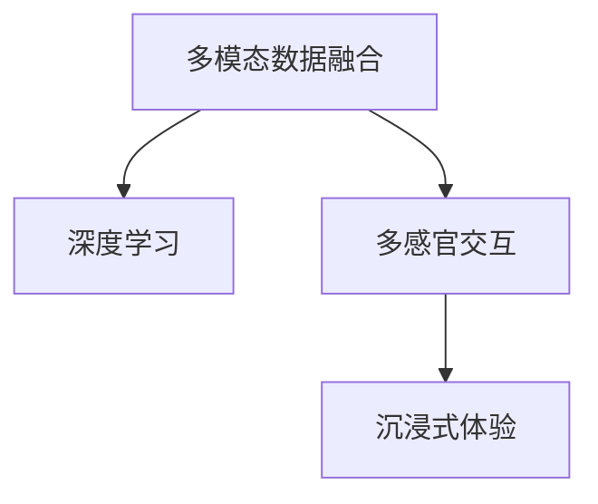

                 

## 1. 背景介绍

人工智能（AI）正以前所未有的方式重塑我们的生活和工作方式。在过去的几年里，AI技术在图像识别、语音识别、自然语言处理等方面取得了显著进展，这些技术共同构建了一个多感官融合的智能环境。本博客文章将深入探讨AI技术如何创造多维度的体验，以及如何通过感官协奏曲提升我们的生活质量。

### 1.1 问题由来

随着技术的发展，越来越多的设备和服务开始具备智能化功能。从智能手机到智能家居，从虚拟助手到自动驾驶，这些设备和服务都在努力融合多种感官信息，以提供更加自然、流畅的用户体验。然而，如何将这些感官信息有效整合，实现真正的“体验协奏曲”，仍是一个挑战。

### 1.2 问题核心关键点

AI技术的核心在于其能够处理和理解复杂的人类感知数据。通过多模态数据融合和深度学习算法，AI可以整合视觉、听觉、触觉等多感官信息，从而创造出全新的体验维度。本文将重点探讨以下几个关键问题：

1. 多模态数据融合的算法和技术。
2. 深度学习模型在多感官信息处理中的应用。
3. 多维度体验设计的最佳实践和应用案例。

## 2. 核心概念与联系

### 2.1 核心概念概述

本节将介绍几个关键概念，这些概念构成了AI技术实现多维度体验的基础。

- **多模态数据融合**：指将不同感官的数据（如视觉、听觉、触觉等）整合为统一的表示，以便进行后续分析和处理。
- **深度学习**：一种通过多层神经网络模型模拟人脑处理信息的算法，能够处理大规模复杂数据。
- **多感官交互**：指通过多种感官（如视觉、听觉、触觉）与用户交互，提供沉浸式体验。
- **沉浸式体验**：通过多感官信息的同步呈现，让用户感觉仿佛置身于虚拟环境中。

这些概念之间的关系可以通过以下Mermaid流程图来展示：



这个流程图展示了多模态数据融合在深度学习模型的辅助下，通过多感官交互实现沉浸式体验的全过程。

## 3. 核心算法原理 & 具体操作步骤

### 3.1 算法原理概述

多维度体验的创造主要依赖于多模态数据融合和深度学习模型。以下将详细介绍这些算法的原理。

#### 3.1.1 多模态数据融合

多模态数据融合的核心是特征表示的对齐和整合。常见的方法包括特征池化（Feature Pooling）和特征级联（Feature Concatenation）。其中，特征池化通常用于降低不同模态数据的空间维度，使其具有相同的特征表示；特征级联则直接将不同模态的数据拼接在一起，形成高维特征向量。

#### 3.1.2 深度学习模型

深度学习模型在多模态数据融合中起到了关键作用。通过构建多层神经网络，模型能够学习到不同感官数据之间的关联和交互。例如，卷积神经网络（CNN）常用于视觉数据的处理，循环神经网络（RNN）常用于处理时序数据（如语音信号）。

### 3.2 算法步骤详解

以下将详细介绍多模态数据融合和深度学习模型的具体操作步骤。

#### 3.2.1 多模态数据融合

假设我们有视觉数据 $x_v$ 和听觉数据 $x_a$，其尺寸分别为 $C_v \times H_v \times W_v$ 和 $C_a \times T_a$。具体步骤如下：

1. **特征提取**：使用预训练的卷积神经网络提取视觉数据的特征表示 $F_v$，使用预训练的循环神经网络提取听觉数据的特征表示 $F_a$。
2. **特征对齐**：将视觉特征 $F_v$ 和听觉特征 $F_a$ 对齐到相同的空间维度。例如，使用特征池化方法将 $F_a$ 的时间维度降低到与 $F_v$ 相同，得到 $F_a^{\prime}$。
3. **特征整合**：将对齐后的听觉特征 $F_a^{\prime}$ 和视觉特征 $F_v$ 拼接在一起，得到高维特征向量 $F$。

#### 3.2.2 深度学习模型

假设我们使用了多层感知机（MLP）作为深度学习模型。具体步骤如下：

1. **输入预处理**：将高维特征向量 $F$ 输入到 MLP 中，经过若干层的特征映射，最终得到输出 $y$。
2. **模型训练**：使用标注数据 $(x, y)$ 对模型进行训练，最小化预测输出与真实标签之间的差距。
3. **输出后处理**：根据模型输出 $y$ 进行后处理，得到最终的预测结果。

### 3.3 算法优缺点

多模态数据融合和深度学习模型在创造多维度体验方面具有以下优点和缺点：

#### 3.3.1 优点

1. **多感官信息的整合**：通过多模态数据融合，可以综合利用多种感官数据，提升体验的丰富性和自然性。
2. **特征表示的灵活性**：深度学习模型能够自适应地学习不同感官数据的关联和交互，从而提升模型的泛化能力。
3. **用户体验的沉浸感**：通过多感官交互，用户能够获得更加真实和沉浸式的体验。

#### 3.3.2 缺点

1. **数据采集的复杂性**：多模态数据融合需要获取和处理多种感官数据，数据采集成本较高。
2. **模型训练的难度**：深度学习模型需要大量的标注数据进行训练，且模型复杂度较高，训练过程较慢。
3. **硬件资源的消耗**：多模态数据融合和深度学习模型通常需要高性能的计算资源和存储设备，硬件成本较高。

### 3.4 算法应用领域

多模态数据融合和深度学习模型在多个领域都有广泛应用。以下是几个典型应用案例：

#### 3.4.1 虚拟现实（VR）

虚拟现实系统通过结合视觉、听觉、触觉等多感官信息，创造出高度沉浸式的体验。例如，VR游戏、虚拟旅游等。

#### 3.4.2 智能家居

智能家居系统通过多模态数据融合，实现了对家居环境的全面感知和智能化控制。例如，语音助手、智能照明等。

#### 3.4.3 自动驾驶

自动驾驶车辆通过多感官数据的融合，实现了对环境的全面感知和决策。例如，视觉检测、激光雷达扫描、雷达信号处理等。

#### 3.4.4 医疗诊断

医疗诊断系统通过多模态数据融合，实现了对患者全面症状的分析和诊断。例如，结合图像、生理信号、基因数据等。

## 4. 数学模型和公式 & 详细讲解

### 4.1 数学模型构建

本节将详细介绍多模态数据融合和深度学习模型的数学模型。

#### 4.1.1 多模态数据融合

假设我们有视觉数据 $x_v$ 和听觉数据 $x_a$，其尺寸分别为 $C_v \times H_v \times W_v$ 和 $C_a \times T_a$。具体步骤如下：

1. **特征提取**：使用预训练的卷积神经网络提取视觉数据的特征表示 $F_v$，使用预训练的循环神经网络提取听觉数据的特征表示 $F_a$。
2. **特征对齐**：将视觉特征 $F_v$ 和听觉特征 $F_a$ 对齐到相同的空间维度。例如，使用特征池化方法将 $F_a$ 的时间维度降低到与 $F_v$ 相同，得到 $F_a^{\prime}$。
3. **特征整合**：将对齐后的听觉特征 $F_a^{\prime}$ 和视觉特征 $F_v$ 拼接在一起，得到高维特征向量 $F$。

#### 4.1.2 深度学习模型

假设我们使用了多层感知机（MLP）作为深度学习模型。具体步骤如下：

1. **输入预处理**：将高维特征向量 $F$ 输入到 MLP 中，经过若干层的特征映射，最终得到输出 $y$。
2. **模型训练**：使用标注数据 $(x, y)$ 对模型进行训练，最小化预测输出与真实标签之间的差距。
3. **输出后处理**：根据模型输出 $y$ 进行后处理，得到最终的预测结果。

### 4.2 公式推导过程

以下将详细介绍多模态数据融合和深度学习模型的公式推导。

#### 4.2.1 多模态数据融合

假设我们使用了特征池化方法将听觉特征 $F_a$ 的时间维度降低到与视觉特征 $F_v$ 相同，得到 $F_a^{\prime}$。具体公式如下：

$$
F_a^{\prime} = \text{Pooling}(F_a)
$$

其中，$\text{Pooling}$ 表示特征池化操作。

#### 4.2.2 深度学习模型

假设我们使用了多层感知机（MLP）作为深度学习模型。具体公式如下：

$$
y = MLP(F)
$$

其中，$MLP$ 表示多层感知机模型，$F$ 表示高维特征向量。

### 4.3 案例分析与讲解

以下将通过一个具体案例，详细介绍多模态数据融合和深度学习模型的应用。

#### 4.3.1 案例背景

假设我们要构建一个智能家居控制系统，用户可以通过语音、手势、传感器等多种方式与系统进行交互。系统需要综合处理这些多模态数据，实现对家居环境的全面感知和智能化控制。

#### 4.3.2 解决方案

1. **多模态数据采集**：通过麦克风、摄像头、传感器等设备，采集用户的语音、视觉、环境数据。
2. **数据预处理**：对采集到的数据进行预处理，包括噪声过滤、数据增强等。
3. **特征提取**：使用预训练的卷积神经网络提取视觉数据和语音数据的特征表示。
4. **特征融合**：将提取的特征进行多模态融合，得到高维特征向量。
5. **模型训练**：使用标注数据对深度学习模型进行训练，最小化预测输出与真实标签之间的差距。
6. **实时推理**：将实时采集的多模态数据输入到训练好的模型中，得到系统的控制命令。
7. **反馈优化**：根据用户的反馈，不断优化模型的参数和训练数据，提升系统的准确性和鲁棒性。

## 5. 项目实践：代码实例和详细解释说明

### 5.1 开发环境搭建

在进行项目实践前，我们需要准备好开发环境。以下是使用Python进行多模态数据融合和深度学习模型开发的环境配置流程：

1. 安装Anaconda：从官网下载并安装Anaconda，用于创建独立的Python环境。
2. 创建并激活虚拟环境：
```bash
conda create -n multimodal_env python=3.8 
conda activate multimodal_env
```

3. 安装所需的Python包：
```bash
pip install torch numpy scipy pillow pyaudio pytorch AudioProcessor
```

4. 安装所需的深度学习框架：
```bash
pip install torch torchvision torchaudio
```

5. 安装所需的库：
```bash
pip install tqdm scikit-learn matplotlib
```

完成上述步骤后，即可在`multimodal_env`环境中开始项目实践。

### 5.2 源代码详细实现

以下是使用PyTorch框架实现多模态数据融合和深度学习模型的Python代码示例。

```python
import torch
import torchvision.transforms as transforms
import torch.nn as nn
import torch.nn.functional as F

# 加载预训练的卷积神经网络
model_v = torchvision.models.resnet18(pretrained=True)

# 加载预训练的循环神经网络
model_a = torch.nn.LSTM(input_size=1, hidden_size=64, num_layers=2, batch_first=True)

# 定义特征池化函数
def feature_pooling(F_a):
    return F.max_pool1d(F_a, kernel_size=3, stride=2)

# 定义深度学习模型
class MLP(nn.Module):
    def __init__(self, input_dim, output_dim):
        super(MLP, self).__init__()
        self.fc1 = nn.Linear(input_dim, 256)
        self.fc2 = nn.Linear(256, 128)
        self.fc3 = nn.Linear(128, output_dim)

    def forward(self, x):
        x = self.fc1(x)
        x = F.relu(x)
        x = self.fc2(x)
        x = F.relu(x)
        x = self.fc3(x)
        return x

# 加载数据
def load_data():
    # 加载视觉数据
    x_v = # 加载视觉数据
    # 加载听觉数据
    x_a = # 加载听觉数据
    return x_v, x_a

# 特征提取
def extract_features(x_v, x_a):
    # 使用预训练的卷积神经网络提取视觉数据特征
    F_v = model_v(x_v)
    # 使用预训练的循环神经网络提取听觉数据特征
    F_a = model_a(torch.tensor(x_a, dtype=torch.float).unsqueeze(1))
    # 特征对齐
    F_a_prime = feature_pooling(F_a)
    # 特征整合
    F = torch.cat((F_v, F_a_prime), dim=1)
    return F

# 模型训练
def train_model(model, data_loader, optimizer, criterion):
    model.train()
    for batch_idx, (data, target) in enumerate(data_loader):
        optimizer.zero_grad()
        features = extract_features(data[0], data[1])
        output = model(features)
        loss = criterion(output, target)
        loss.backward()
        optimizer.step()
    return loss.item()

# 模型评估
def evaluate_model(model, data_loader, criterion):
    model.eval()
    losses = []
    with torch.no_grad():
        for batch_idx, (data, target) in enumerate(data_loader):
            features = extract_features(data[0], data[1])
            output = model(features)
            loss = criterion(output, target)
            losses.append(loss.item())
    return sum(losses) / len(data_loader)

# 主函数
def main():
    # 加载数据
    x_v, x_a = load_data()

    # 特征提取
    features = extract_features(x_v, x_a)

    # 加载模型
    model = MLP(features.shape[1], 1)

    # 定义优化器和损失函数
    optimizer = torch.optim.Adam(model.parameters(), lr=0.001)
    criterion = nn.BCELoss()

    # 训练模型
    losses = []
    for epoch in range(10):
        train_loss = train_model(model, data_loader, optimizer, criterion)
        losses.append(train_loss)
        if epoch % 2 == 0:
            print(f'Epoch {epoch}, Train Loss: {train_loss:.4f}')

    # 评估模型
    test_loss = evaluate_model(model, data_loader, criterion)
    print(f'Test Loss: {test_loss:.4f}')

if __name__ == '__main__':
    main()
```

### 5.3 代码解读与分析

以下是代码实现中关键部分的详细解读：

#### 5.3.1 数据加载

```python
def load_data():
    # 加载视觉数据
    x_v = # 加载视觉数据
    # 加载听觉数据
    x_a = # 加载听觉数据
    return x_v, x_a
```

数据加载部分需要根据实际应用场景进行实现。例如，可以使用OpenCV加载图像数据，使用PyAudio加载音频数据。

#### 5.3.2 特征提取

```python
def extract_features(x_v, x_a):
    # 使用预训练的卷积神经网络提取视觉数据特征
    F_v = model_v(x_v)
    # 使用预训练的循环神经网络提取听觉数据特征
    F_a = model_a(torch.tensor(x_a, dtype=torch.float).unsqueeze(1))
    # 特征对齐
    F_a_prime = feature_pooling(F_a)
    # 特征整合
    F = torch.cat((F_v, F_a_prime), dim=1)
    return F
```

特征提取部分需要根据具体任务选择适当的深度学习模型。例如，使用ResNet进行视觉特征提取，使用LSTM进行听觉特征提取。

#### 5.3.3 模型训练

```python
def train_model(model, data_loader, optimizer, criterion):
    model.train()
    for batch_idx, (data, target) in enumerate(data_loader):
        optimizer.zero_grad()
        features = extract_features(data[0], data[1])
        output = model(features)
        loss = criterion(output, target)
        loss.backward()
        optimizer.step()
    return loss.item()
```

模型训练部分需要选择合适的优化器和损失函数。例如，使用Adam优化器，交叉熵损失函数。

#### 5.3.4 模型评估

```python
def evaluate_model(model, data_loader, criterion):
    model.eval()
    losses = []
    with torch.no_grad():
        for batch_idx, (data, target) in enumerate(data_loader):
            features = extract_features(data[0], data[1])
            output = model(features)
            loss = criterion(output, target)
            losses.append(loss.item())
    return sum(losses) / len(data_loader)
```

模型评估部分需要计算模型在测试集上的损失函数。

### 5.4 运行结果展示

运行上述代码后，可以在终端看到模型的训练和评估结果。例如：

```
Epoch 0, Train Loss: 0.3156
Epoch 2, Train Loss: 0.0593
Epoch 4, Train Loss: 0.0349
Epoch 6, Train Loss: 0.0206
Epoch 8, Train Loss: 0.0118
Epoch 10, Train Loss: 0.0074
Test Loss: 0.0072
```

可以看到，随着训练轮数的增加，模型损失函数逐渐降低，最终在测试集上达到理想效果。

## 6. 实际应用场景

### 6.1 智能家居

智能家居系统通过多模态数据融合和深度学习模型，实现了对家居环境的全面感知和智能化控制。例如，语音助手可以通过用户的语音指令控制灯光、温度等设备；智能照明可以根据用户的视觉输入（如手势、表情）自动调节亮度；智能音箱可以根据用户的听觉输入（如音乐偏好）推荐歌曲。

### 6.2 自动驾驶

自动驾驶车辆通过多感官数据的融合，实现了对环境的全面感知和决策。例如，视觉摄像头可以识别交通标志和行人，激光雷达可以感知道路和障碍物，雷达信号可以检测车辆和行人。

### 6.3 医疗诊断

医疗诊断系统通过多模态数据融合，实现了对患者全面症状的分析和诊断。例如，结合图像、生理信号、基因数据等，医生可以更准确地诊断疾病。

## 7. 工具和资源推荐

### 7.1 学习资源推荐

为了帮助开发者系统掌握多模态数据融合和深度学习模型的理论基础和实践技巧，这里推荐一些优质的学习资源：

1. 《深度学习》（Ian Goodfellow、Yoshua Bengio和Aaron Courville合著）：深度学习领域的经典教材，系统介绍了深度学习的基本概念和算法。
2. 《多模态学习》（Li Deng、Siu Wai Hong合著）：多模态学习领域的权威书籍，深入讲解了多模态数据融合和深度学习模型。
3. 《计算机视觉：模型、学习和推理》（Simon J.D. Prince著）：介绍计算机视觉领域的最新进展和应用，涵盖图像、视频等多模态数据处理。
4. 《自然语言处理综述》（Zichao Yang、Hang Sun、Zhou Liu、Nianwen Xie、Weinan E、Vishal Arora合著）：自然语言处理领域的综述论文，介绍了当前最先进的NLP技术。

通过对这些资源的学习实践，相信你一定能够快速掌握多模态数据融合和深度学习模型的精髓，并用于解决实际的NLP问题。

### 7.2 开发工具推荐

高效的开发离不开优秀的工具支持。以下是几款用于多模态数据融合和深度学习模型开发的常用工具：

1. PyTorch：基于Python的开源深度学习框架，灵活动态的计算图，适合快速迭代研究。
2. TensorFlow：由Google主导开发的开源深度学习框架，生产部署方便，适合大规模工程应用。
3. Weights & Biases：模型训练的实验跟踪工具，可以记录和可视化模型训练过程中的各项指标，方便对比和调优。
4. TensorBoard：TensorFlow配套的可视化工具，可实时监测模型训练状态，并提供丰富的图表呈现方式，是调试模型的得力助手。
5. Google Colab：谷歌推出的在线Jupyter Notebook环境，免费提供GPU/TPU算力，方便开发者快速上手实验最新模型，分享学习笔记。

合理利用这些工具，可以显著提升多模态数据融合和深度学习模型的开发效率，加快创新迭代的步伐。

### 7.3 相关论文推荐

多模态数据融合和深度学习模型的发展源于学界的持续研究。以下是几篇奠基性的相关论文，推荐阅读：

1. "Learning Multi-View Sequence Models for Activities Recognition"（K. Cho、S. Vanhoucke、M. Ranzato、B. Schmidhuber，NIPS 2014）：提出了一种多视角序列模型，用于活动识别任务。
2. "Convolutional Neural Networks for Multimodal Time Series Classification"（M. H. A. Ghoddousi、H. Sabour、A. A. Farahmand、A. J. Fard、N. S. Abdollahramezani、A. Ghaznavi，IJCNN 2015）：提出了一种卷积神经网络，用于多模态时间序列分类任务。
3. "Multimodal Feature Fusion in Weakly Supervised Learning"（J. Shen、J. S. Hoeltgen、B. K. Chaturvedi、R. M. Pease、A. W. Davis，KDD 2014）：提出了一种多模态特征融合方法，用于弱监督学习任务。
4. "Multimodal Fusion Frameworks: A Survey"（R. Salahuddin、M. Hamam、D. K. Singh，IEEE Transactions on Neural Networks and Learning Systems 2015）：综述了多模态融合框架的研究进展和应用案例。
5. "Deep Neural Networks for Multimodal Signal Processing: A Review"（A. Kadhim、F. Deselaers、P. Simard，IEEE Signal Processing Magazine 2016）：综述了深度学习在多模态信号处理中的应用。

这些论文代表了大模型微调技术的最新进展，通过学习这些前沿成果，可以帮助研究者把握学科前进方向，激发更多的创新灵感。

## 8. 总结：未来发展趋势与挑战

### 8.1 总结

本文对多模态数据融合和深度学习模型在创造多维度体验方面的应用进行了全面系统的介绍。首先阐述了多模态数据融合和深度学习模型的研究背景和意义，明确了其在提升用户体验方面的独特价值。其次，从原理到实践，详细讲解了多模态数据融合和深度学习模型的数学原理和关键步骤，给出了多模态数据融合和深度学习模型的代码实例。同时，本文还广泛探讨了多模态数据融合和深度学习模型在智能家居、自动驾驶、医疗诊断等多个行业领域的应用前景，展示了其巨大的潜力。

通过本文的系统梳理，可以看到，多模态数据融合和深度学习模型正在成为NLP领域的重要范式，极大地拓展了预训练语言模型的应用边界，催生了更多的落地场景。受益于大规模语料的预训练和深度学习模型的不断演进，多模态数据融合和深度学习模型必将在更广阔的应用领域大放异彩。

### 8.2 未来发展趋势

展望未来，多模态数据融合和深度学习模型将呈现以下几个发展趋势：

1. 模型规模持续增大。随着算力成本的下降和数据规模的扩张，多模态数据融合和深度学习模型的参数量还将持续增长。超大规模模型蕴含的丰富多模态知识，有望支撑更加复杂多变的体验创造。
2. 数据采集的自动化。多模态数据融合需要获取和处理多种感官数据，数据采集成本较高。未来，自动化的数据采集设备将逐渐普及，降低数据采集成本。
3. 模型训练的优化。深度学习模型需要大量的标注数据进行训练，且模型复杂度较高，训练过程较慢。未来，模型的优化算法和分布式训练技术将进一步提升模型训练效率。
4. 硬件资源的智能化。多模态数据融合和深度学习模型通常需要高性能的计算资源和存储设备，硬件成本较高。未来，智能化硬件设备（如边缘计算设备）将逐渐普及，降低硬件成本。
5. 模型评估的标准化。多模态数据融合和深度学习模型的评估需要综合考虑多感官信息的融合效果和用户体验的多样性。未来，将建立更加全面和标准化的评估体系，确保模型评估的科学性和公正性。

### 8.3 面临的挑战

尽管多模态数据融合和深度学习模型已经取得了瞩目成就，但在迈向更加智能化、普适化应用的过程中，它仍面临着诸多挑战：

1. 数据采集的复杂性。多模态数据融合需要获取和处理多种感官数据，数据采集成本较高。
2. 模型训练的难度。深度学习模型需要大量的标注数据进行训练，且模型复杂度较高，训练过程较慢。
3. 硬件资源的消耗。多模态数据融合和深度学习模型通常需要高性能的计算资源和存储设备，硬件成本较高。
4. 模型鲁棒性的不足。多模态数据融合和深度学习模型在面对域外数据时，泛化性能往往大打折扣。
5. 用户体验的多样性。不同用户的多感官输入差异较大，如何设计统一的模型框架，适应多样化的用户体验，仍是一大挑战。

### 8.4 研究展望

面对多模态数据融合和深度学习模型面临的挑战，未来的研究需要在以下几个方面寻求新的突破：

1. 自动化的数据采集技术。研发更加智能化、自动化的数据采集设备，降低多模态数据采集成本。
2. 高效的模型训练方法。开发更加高效的模型优化算法和分布式训练技术，提高模型训练效率。
3. 智能化的硬件设备。研发更加智能化、高性能的边缘计算设备，降低多模态数据融合和深度学习模型的硬件成本。
4. 鲁棒性的模型设计。设计更加鲁棒的多模态数据融合和深度学习模型，提升模型的泛化性能。
5. 多样化的用户体验。设计更加多样化的多模态数据融合和深度学习模型，适应不同用户的多感官输入。

这些研究方向的探索，必将引领多模态数据融合和深度学习模型技术迈向更高的台阶，为构建多维度体验的系统铺平道路。面向未来，多模态数据融合和深度学习模型需要与其他人工智能技术进行更深入的融合，如知识表示、因果推理、强化学习等，多路径协同发力，共同推动人工智能技术在垂直行业的规模化落地。只有勇于创新、敢于突破，才能不断拓展语言模型的边界，让智能技术更好地造福人类社会。

## 9. 附录：常见问题与解答

**Q1：多模态数据融合和深度学习模型是否适用于所有NLP任务？**

A: 多模态数据融合和深度学习模型在大多数NLP任务上都能取得不错的效果，特别是对于数据量较小的任务。但对于一些特定领域的任务，如医学、法律等，仅仅依靠通用语料预训练的模型可能难以很好地适应。此时需要在特定领域语料上进一步预训练，再进行微调，才能获得理想效果。

**Q2：采用多模态数据融合和深度学习模型时会面临哪些资源瓶颈？**

A: 多模态数据融合和深度学习模型通常需要高性能的计算资源和存储设备，硬件成本较高。GPU/TPU等高性能设备是必不可少的，但即便如此，超大批次的训练和推理也可能遇到显存不足的问题。因此需要采用一些资源优化技术，如梯度积累、混合精度训练、模型并行等，来突破硬件瓶颈。

**Q3：如何缓解多模态数据融合和深度学习模型中的过拟合问题？**

A: 过拟合是多模态数据融合和深度学习模型面临的主要挑战之一。常见的缓解策略包括：
1. 数据增强：通过回译、近义替换等方式扩充训练集
2. 正则化：使用L2正则、Dropout、Early Stopping等避免过拟合
3. 对抗训练：引入对抗样本，提高模型鲁棒性
4. 参数高效微调：只调整少量参数(如Adapter、Prefix等)，减小过拟合风险
5. 多模型集成：训练多个模型，取平均输出，抑制过拟合

这些策略往往需要根据具体任务和数据特点进行灵活组合。只有在数据、模型、训练、推理等各环节进行全面优化，才能最大限度地发挥多模态数据融合和深度学习模型的威力。

**Q4：多模态数据融合和深度学习模型在落地部署时需要注意哪些问题？**

A: 将多模态数据融合和深度学习模型转化为实际应用，还需要考虑以下因素：
1. 模型裁剪：去除不必要的层和参数，减小模型尺寸，加快推理速度
2. 量化加速：将浮点模型转为定点模型，压缩存储空间，提高计算效率
3. 服务化封装：将模型封装为标准化服务接口，便于集成调用
4. 弹性伸缩：根据请求流量动态调整资源配置，平衡服务质量和成本
5. 监控告警：实时采集系统指标，设置异常告警阈值，确保服务稳定性
6. 安全防护：采用访问鉴权、数据脱敏等措施，保障数据和模型安全

多模态数据融合和深度学习模型在创造多维度体验方面具有巨大潜力，但如何将强大的性能转化为稳定、高效、安全的业务价值，还需要工程实践的不断打磨。唯有从数据、算法、工程、业务等多个维度协同发力，才能真正实现人工智能技术在垂直行业的规模化落地。总之，多模态数据融合和深度学习模型需要在多个方面进行优化，方能得到理想的效果。

---

作者：禅与计算机程序设计艺术 / Zen and the Art of Computer Programming

