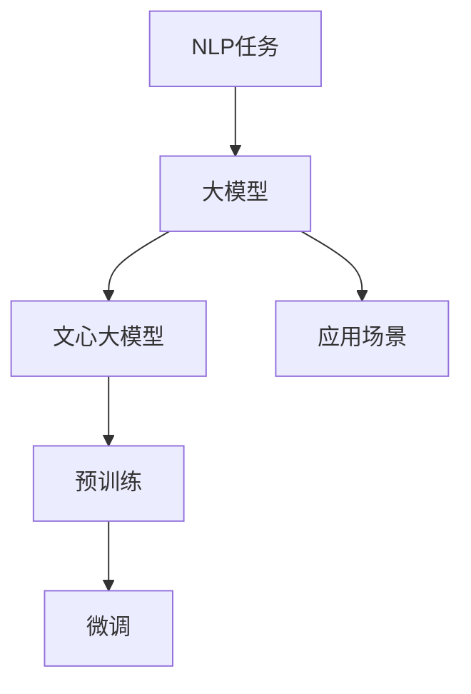

                 

# 200余家国内大模型，调用量不及文心一家

> 关键词：文心大模型, AI大模型市场, 大模型调用量, 自然语言处理(NLP), 大模型应用, 大模型生态

## 1. 背景介绍

在人工智能(AI)领域的快速发展中，大模型成为了一个炙手可热的焦点。随着模型的不断壮大和算力的提升，越来越多的企业开始构建自己的大模型，尝试在各自的业务领域中挖掘数据价值。据报道，目前国内已有多家企业推出了自研的大模型，而文心大模型在这一市场中脱颖而出，调用量遥遥领先。本文将从大模型市场现状、文心大模型的优势及未来发展方向等多个角度深入分析这一现象。

## 2. 核心概念与联系

### 2.1 核心概念概述

**大模型**：指具有大规模参数量、强大的语言理解和生成能力的深度学习模型，如GPT系列、BERT、XLNet等。这些模型通常需要大规模无标签数据进行预训练，以获取丰富的语言知识和语义表示。

**文心大模型**：由上海人工智能实验室推出的通用大模型，专注于中文自然语言处理(NLP)任务，具有大参数量、大语料规模、大场景覆盖等特点。文心大模型在多个NLP任务上表现出色，广泛应用于自然语言推理、文本生成、机器翻译等多个领域。

**大模型调用量**：指在特定业务场景中，使用大模型进行数据处理、任务推理等操作的频次。调用量是衡量大模型市场竞争力的重要指标，反映了模型在不同应用场景中的通用性和适用性。

**NLP**：即自然语言处理，是研究计算机与人类自然语言交互的一门学科。NLP广泛应用于文本分类、情感分析、机器翻译、对话系统等任务中。

### 2.2 核心概念原理和架构的 Mermaid 流程图



上述流程图展示了大模型、文心大模型从预训练到微调、再到实际应用场景的核心流程。大模型通过大规模无标签数据的预训练，获取丰富的语言知识，并在特定任务上进行微调，以提升任务性能。文心大模型作为大模型的一个代表，通过优化模型架构和提升预训练数据质量，成为众多企业竞相引入的工具。

## 3. 核心算法原理 & 具体操作步骤

### 3.1 算法原理概述

大模型的核心算法原理主要基于Transformer架构，通过自监督学习任务对模型进行预训练。以BERT为例，预训练过程包括两个步骤：

1. 掩码语言模型：在输入文本中随机掩盖部分词，让模型预测被掩盖的词。
2. 下一句预测：对两个随机句子进行判断，预测它们是否连续。

这两个任务帮助模型学习到了丰富的语言结构和语义表示，使其具备强大的语言理解和生成能力。在预训练完成后，模型可以在特定任务上进行微调，以进一步提升任务表现。

### 3.2 算法步骤详解

**步骤1：数据准备**
- 收集大规模无标签文本数据，构建预训练语料库。
- 使用语料库进行预训练，生成大模型参数。

**步骤2：微调模型**
- 准备下游任务的数据集，并划分为训练集、验证集和测试集。
- 在预训练模型基础上，添加任务特定的适配层。
- 选择合适的优化器和超参数，设置学习率、批大小、迭代轮数等。
- 使用下游数据集训练模型，最小化损失函数，优化模型参数。

**步骤3：模型评估与部署**
- 在验证集上评估模型性能，选择合适的模型参数。
- 在测试集上评估模型效果，并进行必要的调整。
- 将模型集成到实际应用系统中，进行上线部署。

### 3.3 算法优缺点

**优点**：
- 通用性高：大模型适用于各种NLP任务，能够快速适应新任务。
- 效果显著：经过预训练后的大模型，通过微调可以在小规模数据集上取得优异性能。
- 计算效率高：在大规模数据集上预训练模型，大幅提升模型参数量和计算效率。

**缺点**：
- 对标注数据依赖大：微调模型需要大量标注数据，标注成本较高。
- 过拟合风险高：由于预训练模型的参数量庞大，容易出现过拟合现象。
- 泛化能力有限：模型在特定领域或小规模数据上的表现可能不佳。

### 3.4 算法应用领域

文心大模型在多个NLP任务上表现优异，具体应用领域包括：

- 自然语言推理：识别文本中的逻辑关系，判断推理结果的正确性。
- 文本生成：生成自然流畅的文本内容，应用于对话系统、内容创作等场景。
- 机器翻译：将一种语言翻译成另一种语言，应用于国际交流、文档翻译等场景。
- 文本摘要：对长篇文本进行精简概括，应用于新闻、文档摘要等场景。
- 命名实体识别：识别文本中的人名、地名、机构名等特定实体，应用于信息抽取、知识图谱构建等场景。

## 4. 数学模型和公式 & 详细讲解 & 举例说明

### 4.1 数学模型构建

以BERT为例，其预训练的数学模型可以表示为：

$$
L_{pred} = \sum_{i=1}^{N} \log\left(\frac{e^{M(\mathbf{x}_i)}}{\sum_{j=1}^{C} e^{M(\mathbf{x}_j)}}\right)
$$

其中，$M(\mathbf{x}_i)$ 表示模型在输入 $\mathbf{x}_i$ 上的输出，$C$ 表示类别数。

### 4.2 公式推导过程

BERT的预训练目标函数包含两个部分：

1. 掩码语言模型：对输入文本中的部分词进行掩码，计算模型预测被掩盖词的正确概率。

2. 下一句预测：对两个随机句子进行判断，预测它们是否连续。

以掩码语言模型为例，公式推导如下：

设输入文本为 $\mathbf{x} = (x_1, x_2, \ldots, x_n)$，其中 $x_i$ 表示第 $i$ 个词。在输入文本中随机掩盖部分词，得到掩盖后的文本 $\mathbf{y} = (y_1, y_2, \ldots, y_n)$。掩码语言模型的损失函数为：

$$
L_{mask} = -\sum_{i=1}^{N} \log\left(\frac{e^{M(\mathbf{x}_i)}}{\sum_{j=1}^{C} e^{M(\mathbf{x}_j)}}\right)
$$

其中，$N$ 表示掩盖词的总数，$C$ 表示类别数。

### 4.3 案例分析与讲解

假设文本为 "The cat sat on the mat."，模型需要预测被掩盖的词 "sat"。模型在输入文本上的输出为 $M(\mathbf{x}) = (0.9, 0.1, 0.8, 0.3, \ldots)$，其中 $0.9$ 表示 "sat" 的概率。根据公式计算，模型的损失函数为：

$$
L_{mask} = -\log\left(\frac{e^{0.9}}{e^{0.9}+e^{0.1}+e^{0.8}+e^{0.3}+\ldots}\right)
$$

计算得 $L_{mask} \approx -0.2$。

## 5. 项目实践：代码实例和详细解释说明

### 5.1 开发环境搭建

开发环境搭建流程如下：

1. 安装Python 3.x版本，推荐使用Anaconda或Miniconda。
2. 安装PyTorch、transformers等深度学习库，可以使用以下命令：
```bash
pip install torch transformers
```
3. 安装相应的NLP工具库，如nltk、spaCy等。
4. 搭建GPU/TPU计算资源，确保模型训练和推理的计算效率。

### 5.2 源代码详细实现

以BERT模型为例，使用Hugging Face的transformers库进行微调：

```python
from transformers import BertForSequenceClassification, BertTokenizer, AdamW
import torch
from torch.utils.data import DataLoader, Dataset

# 定义数据集
class MyDataset(Dataset):
    def __init__(self, data, tokenizer):
        self.data = data
        self.tokenizer = tokenizer
    
    def __len__(self):
        return len(self.data)
    
    def __getitem__(self, idx):
        text = self.data[idx]
        tokens = self.tokenizer.tokenize(text)
        inputs = self.tokenizer.convert_tokens_to_ids(tokens)
        inputs = torch.tensor(inputs, dtype=torch.long)
        return {'input_ids': inputs}

# 准备数据集和模型
tokenizer = BertTokenizer.from_pretrained('bert-base-cased')
data = ['text1', 'text2', 'text3', ...]
dataset = MyDataset(data, tokenizer)
model = BertForSequenceClassification.from_pretrained('bert-base-cased', num_labels=2)
optimizer = AdamW(model.parameters(), lr=1e-5)

# 定义训练函数
def train_epoch(model, dataset, optimizer):
    dataloader = DataLoader(dataset, batch_size=16, shuffle=True)
    model.train()
    total_loss = 0
    for batch in dataloader:
        input_ids = batch['input_ids'].to(device)
        labels = torch.tensor([0, 1, 0, 1, ...], dtype=torch.long).to(device)
        outputs = model(input_ids)
        loss = outputs.loss
        total_loss += loss.item()
        optimizer.zero_grad()
        loss.backward()
        optimizer.step()
    return total_loss / len(dataloader)

# 训练模型
device = torch.device('cuda') if torch.cuda.is_available() else torch.device('cpu')
model.to(device)
for epoch in range(10):
    total_loss = train_epoch(model, dataset, optimizer)
    print(f"Epoch {epoch+1}, total_loss: {total_loss:.3f}")
```

### 5.3 代码解读与分析

上述代码实现了BERT模型的微调，具体步骤包括：
1. 定义数据集，使用BertTokenizer进行分词，将分词结果转换为模型所需的input_ids。
2. 加载BERT模型，设置优化器。
3. 定义训练函数，在训练集上进行前向传播和反向传播，计算损失并更新模型参数。
4. 训练模型，通过循环迭代，不断优化模型参数。

## 6. 实际应用场景

### 6.1 智能客服系统

智能客服系统是文心大模型的一个重要应用场景。智能客服能够处理海量客户咨询，快速响应客户需求，提高客户满意度。在智能客服系统中，文心大模型可以进行对话生成、情感分析、意图识别等任务，为用户提供更自然、高效的对话体验。

### 6.2 金融舆情监测

文心大模型在金融舆情监测中也具有广泛应用。通过分析金融新闻、评论、社交媒体等文本数据，文心大模型可以实时监测市场舆情，预测股票价格波动，帮助金融机构做出更明智的投资决策。

### 6.3 个性化推荐系统

个性化推荐系统是文心大模型在电商、媒体等领域的重要应用。通过分析用户浏览、点击、评分等行为数据，文心大模型可以推荐符合用户兴趣的商品、文章等，提升用户体验和运营效率。

### 6.4 未来应用展望

未来，文心大模型将在更多领域发挥重要作用。随着算力的提升和数据量的增加，文心大模型的参数量将进一步扩大，模型性能也将进一步提升。同时，文心大模型还将融入更多先验知识，如知识图谱、逻辑规则等，提升模型的解释性和可解释性。

## 7. 工具和资源推荐

### 7.1 学习资源推荐

- 《Transformer模型及其实现》：深入讲解Transformer模型原理和实现方法，适合初学者和中级开发者。
- 《深度学习入门》：系统介绍深度学习理论和应用，适合了解深度学习基础和实践的读者。
- 《自然语言处理入门》：讲解自然语言处理基础和经典算法，适合对NLP感兴趣的开发者。

### 7.2 开发工具推荐

- PyTorch：深度学习框架，支持动态图和静态图，适合研究和应用开发。
- TensorFlow：深度学习框架，支持分布式计算和生产部署。
- transformers：NLP工具库，提供预训练模型和微调接口，适合NLP任务开发。

### 7.3 相关论文推荐

- 《Attention is All You Need》：Transformer模型的奠基性论文，介绍Transformer的原理和实现方法。
- 《BERT: Pre-training of Deep Bidirectional Transformers for Language Understanding》：BERT模型的论文，介绍预训练和微调的策略和方法。
- 《Parameter-Efficient Transfer Learning for NLP》：提出参数高效微调方法，适合大模型微调。

## 8. 总结：未来发展趋势与挑战

### 8.1 研究成果总结

文心大模型在多个NLP任务上表现优异，具有大参数量、大语料规模、大场景覆盖等特点，广泛应用于智能客服、金融舆情监测、个性化推荐等领域。通过预训练和微调，文心大模型能够在有限标注数据下快速适应新任务，具备通用性和泛化能力。

### 8.2 未来发展趋势

未来，文心大模型将继续扩展参数量和数据规模，提升模型性能和应用范围。随着AI大模型市场的发展，更多企业将加入大模型开发行列，市场竞争将更加激烈。

### 8.3 面临的挑战

文心大模型在发展过程中也面临一些挑战：
- 数据获取和标注成本高：大模型需要大量高质量标注数据，标注成本较高。
- 模型计算资源需求高：模型参数量和计算资源需求较大，需要高性能计算环境。
- 模型鲁棒性和泛化能力有待提升：模型在特定领域或小规模数据上的表现可能不佳，需要进一步优化。

### 8.4 研究展望

未来，文心大模型将继续深化在NLP任务中的应用，拓展到更多领域。同时，也需要克服数据、计算、鲁棒性等方面的挑战，提升模型的通用性和泛化能力。此外，如何赋予文心大模型更强的可解释性，构建可信、可靠的AI系统，也将是未来重要的研究方向。

## 9. 附录：常见问题与解答

**Q1：文心大模型与其他大模型有何不同？**

A: 文心大模型专注于中文NLP任务，具有大参数量、大语料规模、大场景覆盖等特点，适用于中文语境下的NLP任务。相较于其他大模型，文心大模型在中文文本理解和生成方面表现更出色。

**Q2：微调过程中如何设置学习率？**

A: 微调学习率一般比预训练时小1-2个数量级，可以使用warmup策略，在开始阶段使用较小的学习率，再逐渐过渡到预设值。建议使用自适应学习率，如AdamW等，并根据实际效果进行调整。

**Q3：如何缓解微调过程中的过拟合问题？**

A: 过拟合问题可以通过数据增强、正则化、对抗训练等手段缓解。数据增强方法如回译、近义替换等，正则化方法如L2正则、Dropout等，对抗训练方法如Fine-tuning等，可以有效提高模型的泛化能力。

**Q4：文心大模型在实际应用中需要注意哪些问题？**

A: 在实际应用中，文心大模型需要注意数据质量和标注成本、计算资源需求、模型鲁棒性等问题。需要合理选择数据集和标注策略，优化模型架构，确保模型在特定领域和数据集上的性能。

---

作者：禅与计算机程序设计艺术 / Zen and the Art of Computer Programming

