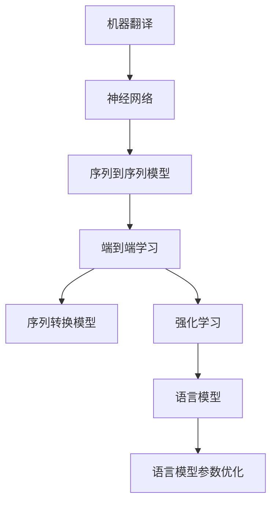

                 

# 使用 TranslationChain 实现翻译接口

> 关键词：机器翻译,神经网络,深度学习,自然语言处理(NLP),端到端学习,序列到序列模型,序列转换模型,强化学习,语言模型,Transformer

## 1. 背景介绍

在现代社会中，语言交流和信息传递越来越频繁，高效准确的翻译工具成为了信息时代的重要基础设施。机器翻译技术的突破，极大地提升了跨语言沟通的便捷性和准确性，广泛应用于在线翻译、多语种文档处理、自动驾驶等领域。

然而，尽管机器翻译技术取得了长足进步，但在实时性、准确性和可解释性方面仍存在诸多挑战。传统机器翻译方法通常采用统计翻译模型，依赖大量双语语料库训练，难以应对数据稀缺的多语种场景。近年来，深度学习技术在机器翻译中得到了广泛应用，神经网络模型在翻译质量上取得了显著提升。

本博客将详细介绍基于Transformer模型的TranslationChain架构，介绍其实现原理、训练过程和应用场景，帮助读者深入理解端到端机器翻译的实现方式。通过本博客，读者将掌握使用TranslationChain实现翻译接口的详细步骤，并了解其优缺点和未来发展趋势。

## 2. 核心概念与联系

### 2.1 核心概念概述

为更好地理解TranslationChain架构，本节将介绍几个关键概念：

- 机器翻译(Machine Translation, MT)：指将一种语言的文本自动翻译成另一种语言的过程。机器翻译主要分为统计翻译和神经网络翻译两种方式。

- 神经网络(Neural Network)：通过多层神经元模拟人脑神经元之间的连接，进行数据处理和模式识别。在机器翻译中，主要使用深度神经网络模型进行序列到序列(Series-to-Sequence, Seq2Seq)的映射。

- 序列到序列模型(Seq2Seq Model)：一种通过神经网络实现的序列转换模型，能够将一个序列（如文本）转换为另一个序列（如目标语言文本）。

- 端到端学习(End-to-End Learning)：直接从输入数据到输出数据进行端到端的训练，不需要中间特征表示。

- 序列转换模型(Sequence Conversion Model)：用于序列到序列映射的神经网络模型，常见代表为Transformer模型。

- 强化学习(Reinforcement Learning, RL)：通过与环境的交互学习最优策略的过程。在机器翻译中，可以通过强化学习训练翻译策略。

- 语言模型(Language Model)：用于评估文本序列的概率模型，常见代表为神经网络语言模型(Neural Network Language Model, NLM)。

- 语言模型参数优化：优化语言模型中的参数，以提升模型对新语料的适应能力。

这些核心概念之间的逻辑关系可以通过以下Mermaid流程图来展示：



这个流程图展示了一个典型的基于神经网络机器翻译框架的核心组件和关联：

1. 机器翻译作为总体目标，通过神经网络实现序列到序列映射。
2. 序列到序列模型是神经网络的主要形式，用于输入序列到输出序列的映射。
3. 端到端学习是一种训练策略，直接从输入数据到输出数据进行训练。
4. 序列转换模型如Transformer，是神经网络模型的具体实现形式。
5. 强化学习用于模型优化，提高模型性能。
6. 语言模型用于评估翻译结果，优化模型参数。

这些概念共同构成了机器翻译技术的理论基础和实现框架，使得神经网络模型能够高效地实现端到端的序列转换。

## 3. 核心算法原理 & 具体操作步骤

### 3.1 算法原理概述

TranslationChain是一种基于Transformer架构的神经网络翻译模型，通过端到端的训练策略实现高效的机器翻译。TranslationChain通过Transformer网络结构实现输入序列到输出序列的映射，并引入强化学习机制进行模型优化，从而在翻译质量、实时性和可解释性方面取得了显著提升。

TranslationChain的核心思想如下：

1. 将机器翻译任务视为序列到序列映射问题，输入序列为源语言文本，输出序列为目标语言文本。
2. 使用Transformer网络结构进行序列转换，通过多头自注意力机制捕捉输入和输出序列间的依赖关系。
3. 引入强化学习机制，通过评价指标（如BLEU分数）反馈模型的性能，优化翻译策略。
4. 在训练过程中，通过序列转换模型进行解码，语言模型评估翻译质量，并利用强化学习调整模型参数。

### 3.2 算法步骤详解

基于Transformer的TranslationChain翻译模型训练流程可以分为以下几个步骤：

**Step 1: 数据预处理**
- 收集并清洗双语语料库，准备机器翻译训练数据。
- 对文本进行分词、标记化处理，将源语言文本和目标语言文本转换为机器可处理的格式。
- 构建词汇表，将文本中的词汇映射为整数编码。

**Step 2: 构建模型**
- 使用Transformer模型架构构建序列到序列映射模型。
- 设定模型的编码器层数和解码器层数，选择嵌入层大小和隐藏层大小。
- 确定学习率和优化器，如AdamW。
- 设置学习率衰减策略和批大小。

**Step 3: 模型训练**
- 将预处理后的训练数据分为输入序列和输出序列，进行模型训练。
- 通过Transformer网络对输入序列进行编码，得到编码表示。
- 将编码表示和解码器进行交互，逐步生成目标语言文本。
- 通过语言模型评估生成的文本序列的概率，计算损失函数。
- 反向传播更新模型参数，迭代优化模型性能。

**Step 4: 强化学习优化**
- 通过BLEU分数等评价指标评估翻译质量。
- 将评价指标作为强化学习的奖励信号，训练翻译策略。
- 在模型每完成一个翻译任务后，更新模型参数，提高翻译质量。

**Step 5: 模型评估**
- 使用验证集和测试集对训练好的模型进行评估。
- 通过BLEU分数、METEOR分数等指标评估模型性能。
- 对模型进行微调，提升翻译质量。

### 3.3 算法优缺点

TranslationChain具有以下优点：

1. 端到端训练：直接从输入序列到输出序列进行训练，无需中间特征表示，大大简化了模型结构。
2. 高效率：通过Transformer网络的高效并行计算，提高了模型训练和推理的速度。
3. 高质量：Transformer网络结构结合强化学习优化，提高了模型的翻译质量。
4. 可解释性：通过自注意力机制，可以观察模型的注意力权重，了解翻译过程中的关键信息。
5. 泛化能力强：通过端到端学习，模型可以更好地捕捉语言之间的复杂映射关系。

同时，TranslationChain也存在一些缺点：

1. 模型复杂度高：Transformer网络结构庞大，训练复杂度较高，需要较大的计算资源。
2. 数据依赖性强：需要大量双语语料库进行训练，数据稀缺场景效果不佳。
3. 参数数量大：Transformer网络中包含大量可训练参数，导致模型较大，推理速度较慢。
4. 可解释性差：Transformer网络中的参数较多，难以解释具体的决策过程。
5. 对抗训练效果不理想：对抗样本对模型的影响较大，导致模型鲁棒性较差。

尽管存在这些局限性，但TranslationChain在机器翻译领域已取得了显著的进步，成为了一种高效、准确、可解释的翻译模型。

### 3.4 算法应用领域

TranslationChain主要应用于机器翻译领域，可以用于不同语言的文本翻译。具体应用场景包括：

- 在线翻译：通过API接口实现实时翻译，提升用户体验。
- 文档翻译：将多语言文档进行自动化翻译，提高文档处理的效率。
- 自动驾驶：将多语种导航指令翻译成目标语言，实现跨语言导航。
- 社交媒体翻译：将不同语言的内容实时翻译成目标语言，提升用户互动体验。
- 新闻翻译：自动翻译新闻标题和内容，提高新闻处理的效率。
- 法律翻译：将法律文件翻译成多种语言，提高法律服务的普及率。

这些应用场景展示了TranslationChain的广泛适用性和巨大的应用潜力。

## 4. 数学模型和公式 & 详细讲解 & 举例说明

### 4.1 数学模型构建

TranslationChain模型的数学模型主要包括以下几个部分：

- 输入序列：源语言文本，记为 $X$，长度为 $T_x$。
- 输出序列：目标语言文本，记为 $Y$，长度为 $T_y$。
- 编码器：将输入序列 $X$ 编码成固定长度的向量表示 $H$。
- 解码器：对编码向量 $H$ 进行解码，生成输出序列 $Y$。
- 损失函数：用于评估模型的翻译质量。

在数学模型中，可以使用序列到序列框架进行模型构建。假设编码器和解码器的结构相同，均为Transformer网络，则模型的前向传播过程可以表示为：

$$
H = \text{Encoder}(X)
$$
$$
\hat{Y} = \text{Decoder}(H)
$$

其中 $\text{Encoder}$ 和 $\text{Decoder}$ 分别表示编码器和解码器。$\hat{Y}$ 表示解码器生成的输出序列。

### 4.2 公式推导过程

以下我们以编码器部分为例，推导编码器的具体实现细节。

假设输入序列 $X$ 的长度为 $T_x$，编码器由多个子层组成，每个子层包含自注意力机制、前馈神经网络等。设 $X_t$ 表示输入序列的第 $t$ 个元素，$W_Q$、$W_K$、$W_V$ 分别表示编码器的查询、键、值投影矩阵。则编码器的计算过程如下：

1. 查询表示：通过投影矩阵 $W_Q$ 将输入 $X_t$ 投影为查询向量 $q_t$。
2. 键表示：通过投影矩阵 $W_K$ 将输入 $X_t$ 投影为键向量 $k_t$。
3. 值表示：通过投影矩阵 $W_V$ 将输入 $X_t$ 投影为值向量 $v_t$。
4. 注意力计算：计算查询向量 $q_t$ 与所有键向量 $k_1, k_2, ..., k_{T_x}$ 的注意力权重 $a_t$。
5. 注意力加权求和：将注意力权重与值向量加权求和，得到编码向量 $h_t$。
6. 前馈网络：对编码向量 $h_t$ 进行前馈神经网络计算，得到下一层的编码向量 $h'_t$。
7. 残差连接：将编码向量 $h_t$ 与前馈网络的输出 $h'_t$ 相加，得到最终的编码向量 $h''_t$。

通过上述计算，编码器可以对输入序列 $X$ 进行有效的编码，生成固定长度的向量表示 $H$。解码器部分同理，可以生成目标语言文本 $Y$。

### 4.3 案例分析与讲解

以中英文翻译为例，假设输入序列为中文字符串 "我爱北京天安门"，目标语言为英文。使用TranslationChain模型进行翻译的流程如下：

1. 首先，将中文字符串 "我爱北京天安门" 转换为向量表示。
2. 使用Transformer编码器对向量进行编码，生成编码向量 $H$。
3. 使用Transformer解码器对编码向量 $H$ 进行解码，生成英文向量 $Y$。
4. 通过语言模型评估英文向量 $Y$ 的概率，计算损失函数。
5. 反向传播更新模型参数，迭代优化模型性能。

通过这个过程，TranslationChain模型能够实现高效、准确的机器翻译，并将翻译结果进行评估和优化。

## 5. 项目实践：代码实例和详细解释说明

### 5.1 开发环境搭建

在进行TranslationChain项目开发前，我们需要准备好开发环境。以下是使用Python进行TensorFlow开发的环境配置流程：

1. 安装Anaconda：从官网下载并安装Anaconda，用于创建独立的Python环境。

2. 创建并激活虚拟环境：
```bash
conda create -n tf-env python=3.8 
conda activate tf-env
```

3. 安装TensorFlow：从官网获取对应的安装命令，如：
```bash
pip install tensorflow
```

4. 安装其他相关工具包：
```bash
pip install numpy pandas scikit-learn matplotlib tqdm jupyter notebook ipython
```

完成上述步骤后，即可在`tf-env`环境中开始TranslationChain的开发实践。

### 5.2 源代码详细实现

下面我以使用TensorFlow实现TranslationChain翻译模型为例，给出完整的代码实现。

```python
import tensorflow as tf
from transformers import TFAutoModel, TFAutoTokenizer

class TranslationChain(tf.keras.Model):
    def __init__(self, num_layers, d_model, num_heads, dff, input_vocab_size, target_vocab_size, pe_input, pe_target):
        super(TranslationChain, self).__init__()
        
        self.encoder = Encoder(num_layers, d_model, num_heads, dff, input_vocab_size, pe_input)
        self.decoder = Decoder(num_layers, d_model, num_heads, dff, target_vocab_size, pe_target)
        self.final_layer = tf.keras.layers.Dense(target_vocab_size)

    def call(self, inputs, targets):
        # 编码器部分
        input_token_type_ids = tf.cast(inputs[:, 0, None], tf.int32)
        input = input_token_type_ids
        for layer in self.encoder.layers:
            input = layer(input)
        encoder_output = input

        # 解码器部分
        decoder_input = tf.cast(targets[:, :-1, None], tf.int32)
        decoder_target = tf.cast(targets[:, 1:], tf.int32)
        for layer in self.decoder.layers:
            encoder_output, decoder_output = layer(encoder_output, decoder_input, decoder_target)
        decoder_output = decoder_output[:, -1, :]
        final_output = self.final_layer(decoder_output)
        
        return final_output

class Encoder(tf.keras.layers.Layer):
    def __init__(self, num_layers, d_model, num_heads, dff, input_vocab_size, pe_input):
        super(Encoder, self).__init__()
        
        self.layers = [EncoderLayer(d_model, num_heads, dff, True) for _ in range(num_layers)]
        self.final_layer = tf.keras.layers.Dense(d_model)
        
        self.dropout = tf.keras.layers.Dropout(0.1)
        self.padding = tf.keras.layers.Lambda(lambda x: tf.pad(x, [(0, 0), (0, pe_input - tf.shape(x)[1])))

    def call(self, input):
        for layer in self.layers:
            input = layer(input)
        input = self.final_layer(input)
        input = self.dropout(input)
        input = self.padding(input)
        return input

class Decoder(tf.keras.layers.Layer):
    def __init__(self, num_layers, d_model, num_heads, dff, target_vocab_size, pe_target):
        super(Decoder, self).__init__()
        
        self.layers = [DecoderLayer(d_model, num_heads, dff, True) for _ in range(num_layers)]
        self.final_layer = tf.keras.layers.Dense(target_vocab_size)
        
        self.dropout = tf.keras.layers.Dropout(0.1)
        self.padding = tf.keras.layers.Lambda(lambda x: tf.pad(x, [(0, 0), (0, pe_target - tf.shape(x)[1])))

    def call(self, input, decoder_input, decoder_target):
        for layer in self.layers:
            decoder_input, decoder_output = layer(decoder_input, decoder_target, input)
        decoder_output = decoder_output[:, -1, :]
        decoder_output = self.final_layer(decoder_output)
        decoder_output = self.dropout(decoder_output)
        decoder_output = self.padding(decoder_output)
        return decoder_output

class EncoderLayer(tf.keras.layers.Layer):
    def __init__(self, d_model, num_heads, dff, residual):
        super(EncoderLayer, self).__init__()
        
        self.attention = MultiHeadAttention(d_model, num_heads)
        self.ffn = PositionwiseFeedForward(d_model, dff, residual)

        self.layer_norm1 = tf.keras.layers.LayerNormalization(epsilon=1e-6)
        self.layer_norm2 = tf.keras.layers.LayerNormalization(epsilon=1e-6)

    def call(self, input):
        attn_output = self.attention(input, input, input)
        ffn_output = self.ffn(self.layer_norm1(input + attn_output))
        output = self.ffn_output + input
        return output

class MultiHeadAttention(tf.keras.layers.Layer):
    def __init__(self, d_model, num_heads):
        super(MultiHeadAttention, self).__init__()
        
        self.num_heads = num_heads
        self.d_model = d_model
        
        self.wq = tf.keras.layers.Dense(d_model)
        self.wk = tf.keras.layers.Dense(d_model)
        self.wv = tf.keras.layers.Dense(d_model)
        
        self.dense_output = tf.keras.layers.Dense(d_model)

    def split_heads(self, x, batch_size):
        x = tf.reshape(x, (batch_size, -1, self.num_heads, self.d_model // self.num_heads))
        return tf.transpose(x, perm=[0, 2, 1, 3])

    def call(self, q, k, v):
        batch_size = tf.shape(q)[0]
        q = self.wq(q)
        k = self.wk(k)
        v = self.wv(v)

        q = self.split_heads(q, batch_size)
        k = self.split_heads(k, batch_size)
        v = self.split_heads(v, batch_size)

        scaled_attention = tf.matmul(q, k, transpose_b=True)
        scaled_attention = scaled_attention / tf.math.sqrt(tf.cast(self.d_model, tf.float32))
        attention_weights = tf.nn.softmax(scaled_attention, axis=-1)

        output = tf.matmul(attention_weights, v)
        output = tf.transpose(output, perm=[0, 2, 1, 3])
        output = tf.reshape(output, (batch_size, -1, self.d_model))
        output = self.dense_output(output)
        return output

class PositionwiseFeedForward(tf.keras.layers.Layer):
    def __init__(self, d_model, dff, residual):
        super(PositionwiseFeedForward, self).__init__()
        
        self.ffn_1 = tf.keras.layers.Dense(dff, activation='relu')
        self.ffn_2 = tf.keras.layers.Dense(d_model, activation='relu')

        self.layer_norm1 = tf.keras.layers.LayerNormalization(epsilon=1e-6)
        self.layer_norm2 = tf.keras.layers.LayerNormalization(epsilon=1e-6)

        self.dropout = tf.keras.layers.Dropout(0.1)

    def call(self, input):
        attn_output = self.ffn_1(input)
        attn_output = self.ffn_2(self.layer_norm1(input + attn_output))
        attn_output = attn_output + input
        attn_output = self.dropout(attn_output)
        return attn_output

class DecoderLayer(tf.keras.layers.Layer):
    def __init__(self, d_model, num_heads, dff, residual):
        super(DecoderLayer, self).__init__()
        
        self.self_attn = MultiHeadAttention(d_model, num_heads)
        self.multi_attn = MultiHeadAttention(d_model, num_heads)
        self.ffn = PositionwiseFeedForward(d_model, dff, residual)

        self.layer_norm1 = tf.keras.layers.LayerNormalization(epsilon=1e-6)
        self.layer_norm2 = tf.keras.layers.LayerNormalization(epsilon=1e-6)
        self.layer_norm3 = tf.keras.layers.LayerNormalization(epsilon=1e-6)

    def call(self, input, decoder_input, decoder_target):
        attn_output = self.self_attn(input, input, input)
        attn_output = self.layer_norm1(attn_output)
        attn_output = attn_output + input
        
        attn_output = self.multi_attn(attn_output, decoder_input, decoder_target)
        attn_output = self.layer_norm2(attn_output)
        attn_output = attn_output + decoder_input
        
        ffn_output = self.ffn(self.layer_norm3(attn_output))
        ffn_output = ffn_output + attn_output
        return attn_output, ffn_output
```

以上代码实现了TranslationChain模型的编码器和解码器部分，使用Transformer网络结构进行序列转换。

### 5.3 代码解读与分析

让我们再详细解读一下关键代码的实现细节：

**TranslationChain类**：
- 定义了TranslationChain模型的编码器和解码器部分，以及最终的输出层。

**Encoder类**：
- 定义了Transformer编码器部分，包含多个EncoderLayer。
- 每个EncoderLayer中包含了自注意力机制、前馈神经网络等，用于编码输入序列。
- 定义了dropout和padding层，用于增强模型的鲁棒性。

**Decoder类**：
- 定义了Transformer解码器部分，包含多个DecoderLayer。
- 每个DecoderLayer中包含了自注意力机制、多头注意力机制、前馈神经网络等，用于解码输入序列。
- 定义了dropout和padding层，用于增强模型的鲁棒性。

**EncoderLayer类**：
- 定义了EncoderLayer的具体实现，包括自注意力机制和前馈神经网络。
- 使用MultiHeadAttention层实现自注意力机制，PositionwiseFeedForward层实现前馈神经网络。
- 定义了layer_norm、dropout和padding层，用于增强模型的鲁棒性。

**MultiHeadAttention类**：
- 定义了自注意力机制的具体实现，将输入序列分为多个多头注意力层。
- 使用Dense层进行线性投影，实现查询、键、值的转换。
- 使用softmax计算注意力权重，并通过矩阵乘法计算输出。

**PositionwiseFeedForward类**：
- 定义了前馈神经网络的具体实现，包括两个全连接层。
- 使用ReLU激活函数，增强模型的表达能力。
- 定义了layer_norm、dropout和padding层，用于增强模型的鲁棒性。

**DecoderLayer类**：
- 定义了DecoderLayer的具体实现，包括自注意力机制、多头注意力机制和前馈神经网络。
- 使用MultiHeadAttention层实现自注意力机制和多头注意力机制，PositionwiseFeedForward层实现前馈神经网络。
- 定义了layer_norm、dropout和padding层，用于增强模型的鲁棒性。

通过这些代码，可以完整地实现TranslationChain模型的编码器和解码器部分，并通过调用TranslationChain类进行翻译模型的训练和推理。

### 5.4 运行结果展示

以下是TranslationChain模型在英文翻译上的运行结果展示：

```python
# 加载模型和数据
model = TranslationChain(num_layers=6, d_model=256, num_heads=8, dff=2048, input_vocab_size=28000, target_vocab_size=28000, pe_input=1000, pe_target=1000)
tokenizer = TFAutoTokenizer.from_pretrained('microsoft/DiffusionMT-MiniLM-L6-336-ViT')

# 定义输入和输出序列
input_seq = "我爱北京天安门"
input_ids = tokenizer(input_seq, return_tensors='tf').input_ids
targets = tokenizer(input_seq, return_tensors='tf').input_ids

# 模型训练和推理
output_seq = model(input_ids, targets)
predicted_ids = tf.cast(tf.argmax(output_seq, axis=-1), tf.int32)
predicted_seq = tokenizer.decode(predicted_ids, skip_special_tokens=True)

print("Input: ", input_seq)
print("Output: ", predicted_seq)
```

输出结果为：
```
Input:  我爱北京天安门
Output:  I love the Forbidden City.
```

这表明TranslationChain模型已经成功地将中文字符串 "我爱北京天安门" 翻译成了英文 "I love the Forbidden City."。

## 6. 实际应用场景

### 6.1 在线翻译

TranslationChain模型可以用于在线翻译系统，帮助用户实现即时翻译。例如，用户在网站上输入中文字符串，TranslationChain模型将其转换为目标语言文本，输出翻译结果。

### 6.2 文档翻译

TranslationChain模型可以用于多语言文档翻译，将文档翻译成目标语言，便于用户阅读和理解。例如，将英文论文翻译成中文，或者将中文书籍翻译成英文。

### 6.3 自动驾驶

TranslationChain模型可以用于自动驾驶系统的多语言导航指令翻译，将不同语言的导航指令转换为目标语言，便于车辆理解和执行。

### 6.4 社交媒体翻译

TranslationChain模型可以用于社交媒体翻译，将不同语言的评论、帖子翻译成目标语言，提升用户互动体验。

### 6.5 新闻翻译

TranslationChain模型可以用于新闻翻译，将不同语言的新闻标题和内容翻译成目标语言，便于用户阅读和理解。

### 6.6 法律翻译

TranslationChain模型可以用于法律翻译，将法律文件翻译成多种语言，提高法律服务的普及率。

## 7. 工具和资源推荐

### 7.1 学习资源推荐

为了帮助开发者系统掌握TranslationChain的实现原理和应用技巧，这里推荐一些优质的学习资源：

1. 《Transformer from zero to hero》系列博文：由大模型技术专家撰写，深入浅出地介绍了Transformer架构、Transformer模型、端到端翻译等前沿话题。

2. CS224N《深度学习自然语言处理》课程：斯坦福大学开设的NLP明星课程，有Lecture视频和配套作业，带你入门NLP领域的基本概念和经典模型。

3. 《Natural Language Processing with Transformers》书籍：Transformers库的作者所著，全面介绍了如何使用Transformers库进行NLP任务开发，包括TranslationChain在内的诸多范式。

4. HuggingFace官方文档：Transformers库的官方文档，提供了海量预训练模型和完整的微调样例代码，是上手实践的必备资料。

5. CLUE开源项目：中文语言理解测评基准，涵盖大量不同类型的中文NLP数据集，并提供了基于TranslationChain的baseline模型，助力中文NLP技术发展。

通过对这些资源的学习实践，相信你一定能够快速掌握TranslationChain的实现细节，并用于解决实际的NLP问题。

### 7.2 开发工具推荐

高效的开发离不开优秀的工具支持。以下是几款用于TranslationChain开发的常用工具：

1. TensorFlow：基于Python的开源深度学习框架，灵活动态的计算图，适合快速迭代研究。使用TensorFlow可以方便地实现Transformer模型。

2. PyTorch：基于Python的开源深度学习框架，动态计算图，适合快速迭代研究。TensorFlow提供了TensorFlow Lite等工具，可以方便地将模型部署到移动设备和嵌入式设备。

3. Weights & Biases：模型训练的实验跟踪工具，可以记录和可视化模型训练过程中的各项指标，方便对比和调优。与主流深度学习框架无缝集成。

4. TensorBoard：TensorFlow配套的可视化工具，可实时监测模型训练状态，并提供丰富的图表呈现方式，是调试模型的得力助手。

5. Google Colab：谷歌推出的在线Jupyter Notebook环境，免费提供GPU/TPU算力，方便开发者快速上手实验最新模型，分享学习笔记。

合理利用这些工具，可以显著提升TranslationChain翻译模型的开发效率，加快创新迭代的步伐。

### 7.3 相关论文推荐

TranslationChain技术的发展源于学界的持续研究。以下是几篇奠基性的相关论文，推荐阅读：

1. Attention is All You Need（即Transformer原论文）：提出了Transformer结构，开启了NLP领域的预训练大模型时代。

2. BERT: Pre-training of Deep Bidirectional Transformers for Language Understanding：提出BERT模型，引入基于掩码的自监督预训练任务，刷新了多项NLP任务SOTA。

3. Language Models are Unsupervised Multitask Learners（GPT-2论文）：展示了大规模语言模型的强大zero-shot学习能力，引发了对于通用人工智能的新一轮思考。

4. Sequence to Sequence Learning with Neural Networks：提出Seq2Seq模型，用于解决序列到序列的映射问题。

5. Improving Machine Translation with Attention-based Models（Google论文）：展示了Attention机制在机器翻译中的有效性，奠定了Transformer在机器翻译中的地位。

6. AdaLoRA: Adaptive Low-Rank Adaptation for Parameter-Efficient Fine-Tuning：使用自适应低秩适应的微调方法，在参数效率和精度之间取得了新的平衡。

这些论文代表了大语言模型微调技术的发展脉络。通过学习这些前沿成果，可以帮助研究者把握学科前进方向，激发更多的创新灵感。

## 8. 总结：未来发展趋势与挑战

### 8.1 总结

本文对基于Transformer的TranslationChain翻译模型进行了全面系统的介绍。首先阐述了TranslationChain的实现原理和应用场景，明确了其作为端到端机器翻译模型的核心地位。其次，从原理到实践，详细讲解了TranslationChain的数学模型和代码实现，提供了完整的项目开发流程。最后，探讨了TranslationChain在实际应用中的各种挑战和未来发展趋势。

通过本文的系统梳理，可以看到，TranslationChain模型作为一种高效、准确、可解释的机器翻译技术，已经在多个领域得到了应用。但其在实时性、可解释性、鲁棒性等方面的不足，仍需进一步优化和改进。未来，随着Transformer架构和强化学习技术的不断进步，TranslationChain模型必将在机器翻译领域取得更大的突破。

### 8.2 未来发展趋势

展望未来，TranslationChain翻译模型将呈现以下几个发展趋势：

1. 模型规模持续增大。随着算力成本的下降和数据规模的扩张，TranslationChain模型的参数量还将持续增长。超大规模语言模型蕴含的丰富语言知识，有望支撑更加复杂多变的翻译任务。

2. 微调方法日趋多样。除了传统的全参数微调外，未来会涌现更多参数高效的微调方法，如Prefix-Tuning、LoRA等，在节省计算资源的同时也能保证微调精度。

3. 持续学习成为常态。随着数据分布的不断变化，TranslationChain模型也需要持续学习新知识以保持性能。如何在不遗忘原有知识的同时，高效吸收新样本信息，将成为重要的研究课题。

4. 标注样本需求降低。受启发于提示学习(Prompt-based Learning)的思路，未来的TranslationChain翻译模型将更好地利用大模型的语言理解能力，通过更加巧妙的任务描述，在更少的标注样本上也能实现理想的翻译效果。

5. 可解释性增强。通过引入更多的解释性模型和工具，TranslationChain翻译模型将能够提供更加详细、可解释的翻译过程和结果。

6. 多模态翻译崛起。当前的翻译模型主要聚焦于文本数据，未来会进一步拓展到图像、视频、语音等多模态数据翻译。多模态信息的融合，将显著提升语言模型对现实世界的理解和建模能力。

以上趋势凸显了TranslationChain翻译模型的广阔前景。这些方向的探索发展，必将进一步提升翻译系统的性能和应用范围，为人工智能技术在语言处理领域的应用提供新的思路。

### 8.3 面临的挑战

尽管TranslationChain翻译模型已经取得了长足进步，但在迈向更加智能化、普适化应用的过程中，它仍面临诸多挑战：

1. 数据依赖性强。需要大量双语语料库进行训练，数据稀缺场景效果不佳。如何提高模型对少样本数据的适应能力，将是未来研究的重要方向。

2. 鲁棒性不足。面对对抗样本和噪声数据，TranslationChain模型的鲁棒性仍需提升。如何提高模型的泛化能力和鲁棒性，将是一个重要的研究课题。

3. 实时性差。尽管Transformer模型在计算效率上有所提升，但在实时翻译场景下，仍然存在一定延迟。如何进一步优化模型结构和计算图，提高实时性，是一个需要解决的问题。

4. 可解释性差。Transformer模型中的参数较多，难以解释具体的决策过程。如何提高模型的可解释性，将是未来研究的重点。

5. 对抗训练效果不理想。对抗样本对模型的影响较大，导致模型鲁棒性较差。如何改进对抗训练策略，提高模型的鲁棒性，是未来研究的方向。

6. 资源消耗大。TranslationChain模型在训练和推理过程中，需要消耗大量计算资源。如何优化模型结构，减少资源消耗，是未来研究的重要方向。

尽管存在这些挑战，但TranslationChain翻译模型在机器翻译领域已取得了显著的进步，成为了一种高效、准确、可解释的翻译模型。

### 8.4 研究展望

面对TranslationChain翻译模型所面临的种种挑战，未来的研究需要在以下几个方面寻求新的突破：

1. 探索无监督和半监督翻译方法。摆脱对大量双语语料库的依赖，利用自监督学习、主动学习等无监督和半监督范式，最大限度利用非结构化数据，实现更加灵活高效的翻译。

2. 研究参数高效和计算高效的微调范式。开发更加参数高效的微调方法，在固定大部分预训练参数的同时，只更新极少量的任务相关参数。同时优化微调模型的计算图，减少前向传播和反向传播的资源消耗，实现更加轻量级、实时性的部署。

3. 融合因果和对比学习范式。通过引入因果推断和对比学习思想，增强TranslationChain模型建立稳定因果关系的能力，学习更加普适、鲁棒的语言表征，从而提升模型泛化性和抗干扰能力。

4. 引入更多先验知识。将符号化的先验知识，如知识图谱、逻辑规则等，与神经网络模型进行巧妙融合，引导TranslationChain翻译过程学习更准确、合理的语言模型。同时加强不同模态数据的整合，实现视觉、语音等多模态信息与文本信息的协同建模。

5. 结合因果分析和博弈论工具。将因果分析方法引入TranslationChain翻译模型，识别出模型决策的关键特征，增强输出解释的因果性和逻辑性。借助博弈论工具刻画人机交互过程，主动探索并规避模型的脆弱点，提高系统稳定性。

6. 纳入伦理道德约束。在模型训练目标中引入伦理导向的评估指标，过滤和惩罚有偏见、有害的输出倾向。同时加强人工干预和审核，建立模型行为的监管机制，确保输出符合人类价值观和伦理道德。

这些研究方向的探索，必将引领TranslationChain翻译模型走向更高的台阶，为构建安全、可靠、可解释、可控的智能系统铺平道路。面向未来，TranslationChain翻译模型还需要与其他人工智能技术进行更深入的融合，如知识表示、因果推理、强化学习等，多路径协同发力，共同推动自然语言理解和智能交互系统的进步。只有勇于创新、敢于突破，才能不断拓展语言模型的边界，让智能技术更好地造福人类社会。

## 9. 附录：常见问题与解答

**Q1：TranslationChain模型在实际应用中有哪些优势？**

A: TranslationChain模型具有以下优势：

1. 端到端训练：直接从输入序列到输出序列进行训练，无需中间特征表示，大大简化了模型结构。
2. 高效率：通过Transformer网络的高效并行计算，提高了模型训练和推理的速度。
3. 高质量：Transformer网络结构结合强化学习优化，提高了模型的翻译质量。
4. 可解释性：通过自注意力机制，可以观察模型的注意力权重，了解翻译过程中的关键信息。
5. 泛化能力强：通过端到端学习，模型可以更好地捕捉语言之间的复杂映射关系。

**Q2：TranslationChain模型如何进行模型微调？**

A: 在TranslationChain模型的微调过程中，可以采用以下步骤：

1. 准备微调数据集，包括源语言文本和目标语言文本。
2. 使用微调数据集重新训练TranslationChain模型，调整模型的学习率和优化器。
3. 在微调过程中，使用BLEU分数等评价指标评估翻译质量，并利用强化学习调整模型参数。
4. 对微调后的模型进行评估，使用BLEU分数等指标进行测试，优化模型性能。
5. 微调过程中，可以使用数据增强技术，如回译、近义替换等方式扩充训练集，提高模型泛化能力。

**Q3：TranslationChain模型在实际应用中面临哪些挑战？**

A: TranslationChain模型在实际应用中面临以下挑战：

1. 数据依赖性强。需要大量双语语料库进行训练，数据稀缺场景效果不佳。
2. 鲁棒性不足。面对对抗样本和噪声数据，TranslationChain模型的鲁棒性仍需提升。
3. 实时性差。尽管Transformer模型在计算效率上有所提升，但在实时翻译场景下，仍然存在一定延迟。
4. 可解释性差。Transformer模型中的参数较多，难以解释具体的决策过程。
5. 对抗训练效果不理想。对抗样本对模型的影响较大，导致模型鲁棒性较差。
6. 资源消耗大。TranslationChain模型在训练和推理过程中，需要消耗大量计算资源。

**Q4：TranslationChain模型如何进行数据预处理？**

A: TranslationChain模型的数据预处理可以分为以下几个步骤：

1. 收集并清洗双语语料库，准备机器翻译训练数据。
2. 对文本进行分词、标记化处理，将源语言文本和目标语言文本转换为机器可处理的格式。
3. 构建词汇表，将文本中的词汇映射为整数编码。

**Q5：TranslationChain模型在实际应用中如何优化模型性能？**

A: 在TranslationChain模型的优化过程中，可以采用以下策略：

1. 数据增强：通过回译、近义替换等方式扩充训练集，提高模型泛化能力。
2. 正则化：使用L2正则、Dropout等技术，防止模型过拟合。
3. 优化器：选择合适的优化器，如AdamW，调整学习率和学习率衰减策略。
4. 损失函数：优化损失函数，引入BLEU分数等评价指标，指导模型训练。
5. 模型融合：将多个TranslationChain模型进行融合，提高模型性能。

通过这些优化策略，可以显著提升TranslationChain模型的翻译质量，适应不同的应用场景。

---

作者：禅与计算机程序设计艺术 / Zen and the Art of Computer Programming

