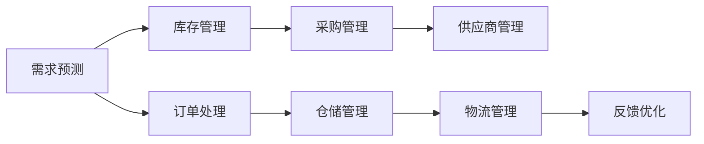

                 

# 供应链整合：打造电商平台供给能力核心竞争力

## 1. 背景介绍

在全球化经济日益增长的今天，供应链的整合已成为企业提升核心竞争力的关键因素之一。特别是在电商领域，如何高效整合供应商资源，优化供应链流程，提升商品供应能力，是电商平台亟需解决的重大问题。本文将从背景介绍、核心概念、算法原理、项目实践、实际应用、工具和资源推荐、未来发展趋势与挑战等角度，深入探讨如何通过供应链整合打造电商平台供给能力的核心竞争力。

## 2. 核心概念与联系

### 2.1 核心概念概述

供应链整合（Supply Chain Integration）是指通过信息技术和管理手段，对企业的上下游供应商进行协调和整合，以实现资源优化配置、流程协同、成本控制、风险管理等多方面目标。对于电商平台而言，供应链整合不仅仅是采购、物流等传统供应链环节的优化，更是通过整合供应商资源，提升商品供应能力，增强平台的核心竞争力。

### 2.2 核心概念原理和架构的 Mermaid 流程图



此图展示了电商平台供应链整合的基本架构，从需求预测到库存管理，再到采购管理、供应商管理、订单处理、仓储管理、物流管理和反馈优化，每个环节都通过信息流和物流紧密相连，形成一个有机的供应链网络。

## 3. 核心算法原理 & 具体操作步骤

### 3.1 算法原理概述

供应链整合的核心算法原理主要涉及需求预测、库存管理、采购管理、供应商管理、订单处理、仓储管理、物流管理和反馈优化等关键环节。通过对这些环节进行系统性的优化和整合，平台能够实现商品的高效供应和核心竞争力的提升。

### 3.2 算法步骤详解

#### 3.2.1 需求预测

需求预测是供应链整合的基础，准确的需求预测能够帮助平台进行合理的库存管理和采购规划。需求预测算法通常包括时间序列分析、机器学习、深度学习等方法。以时间序列分析为例，常用的算法包括ARIMA、季节性分解、指数平滑等。

#### 3.2.2 库存管理

库存管理是供应链整合的核心环节之一，通过科学的库存管理策略，平台能够实现库存成本的最小化和商品供应的稳定性。常用的库存管理算法包括ABC分析法、经济订货批量（EOQ）、动态库存控制等。

#### 3.2.3 采购管理

采购管理是供应链整合的关键环节，通过高效的采购管理，平台能够以最低成本获取最佳质量的供应商资源。采购管理算法通常包括供应商评估、招标采购、动态定价等。

#### 3.2.4 供应商管理

供应商管理是供应链整合的基础，通过科学的管理策略，平台能够实现与供应商的双赢局面。常用的供应商管理算法包括供应商绩效评估、合作博弈、风险管理等。

#### 3.2.5 订单处理

订单处理是供应链整合的关键环节，通过高效的订单处理，平台能够实现订单的快速响应和准确执行。常用的订单处理算法包括订单分拣、库存优化、物流协调等。

#### 3.2.6 仓储管理

仓储管理是供应链整合的基础设施，通过科学的管理策略，平台能够实现仓储空间的最大化利用和物流效率的提升。常用的仓储管理算法包括仓库布局优化、库存位置管理、库存盘点等。

#### 3.2.7 物流管理

物流管理是供应链整合的重要环节，通过高效的物流管理，平台能够实现商品的高效配送和成本的最小化。常用的物流管理算法包括路径规划、配送调度、物流成本优化等。

#### 3.2.8 反馈优化

反馈优化是供应链整合的重要组成部分，通过收集和分析供应链各环节的反馈信息，平台能够不断优化供应链流程，提升整体效率和竞争力。常用的反馈优化算法包括数据挖掘、模型预测、机器学习等。

### 3.3 算法优缺点

#### 3.3.1 算法优点

1. **提升供应链效率**：通过科学的管理策略和算法优化，平台能够实现供应链各环节的高效协同，提升整体运营效率。
2. **降低成本**：科学的库存管理、采购管理和物流管理策略，能够有效降低供应链成本。
3. **提高灵活性**：算法优化能够提升供应链的灵活性，应对市场变化和需求波动。
4. **增强竞争力**：通过供应链整合，平台能够提升商品供应能力和客户满意度，增强核心竞争力。

#### 3.3.2 算法缺点

1. **数据质量要求高**：算法优化依赖于高质量的数据，如果数据质量不高，算法效果将大打折扣。
2. **算法复杂度高**：部分算法如深度学习算法，需要大量计算资源和时间，实施成本较高。
3. **实施难度大**：供应链整合涉及多个环节的协同和优化，实施难度较大，需要跨部门协作。
4. **动态调整难**：供应链流程复杂，动态调整困难，需要持续监测和优化。

### 3.4 算法应用领域

供应链整合算法在多个领域得到了广泛应用，包括电商、制造、零售、物流等。在电商领域，供应链整合不仅限于商品供应，还涉及商品品质、客户服务、用户体验等多个方面。通过科学的管理和算法优化，电商平台能够实现供应链的高效协同，提升核心竞争力。

## 4. 数学模型和公式 & 详细讲解 & 举例说明

### 4.1 数学模型构建

#### 4.1.1 需求预测模型

需求预测模型通常使用时间序列分析的方法，如ARIMA模型，其数学表达式为：

$$
y_t = \alpha + \beta t + \gamma x_t + \sum_{i=1}^{p} \delta_i y_{t-i} + \sum_{j=1}^{q} \phi_j \epsilon_{t-j}
$$

其中，$y_t$ 表示时间$t$的需求量，$\alpha$ 表示截距项，$\beta$ 表示线性趋势项，$x_t$ 表示季节性因素，$\delta_i$ 表示自回归项系数，$\phi_j$ 表示滑动平均项系数，$\epsilon_{t-j}$ 表示随机误差项。

#### 4.1.2 库存管理模型

库存管理模型通常使用经济订货批量（EOQ）模型，其数学表达式为：

$$
EOQ = \sqrt{\frac{2D}{\mu}}
$$

其中，$EOQ$ 表示经济订货批量，$D$ 表示单位时间的需求量，$\mu$ 表示单位时间内的库存持有成本。

#### 4.1.3 采购管理模型

采购管理模型通常使用供应商评估模型，如KPI评估模型，其数学表达式为：

$$
KPI_i = \frac{D_i}{S_i}
$$

其中，$KPI_i$ 表示供应商$i$的关键绩效指标，$D_i$ 表示供应商$i$的交付数量，$S_i$ 表示供应商$i$的承诺数量。

#### 4.1.4 订单处理模型

订单处理模型通常使用订单分拣模型，如ABC分析法，其数学表达式为：

$$
ABC_i = D_i \times C_i \times V_i
$$

其中，$ABC_i$ 表示订单$i$的ABC值，$D_i$ 表示订单$i$的需求量，$C_i$ 表示订单$i$的复杂度，$V_i$ 表示订单$i$的体积。

#### 4.1.5 物流管理模型

物流管理模型通常使用路径规划模型，如Dijkstra算法，其数学表达式为：

$$
\min \sum_{i=1}^{n} \sum_{j=1}^{n} w_{ij} \times d_{ij}
$$

其中，$w_{ij}$ 表示节点$i$到节点$j$的权重，$d_{ij}$ 表示节点$i$到节点$j$的距离。

### 4.2 公式推导过程

#### 4.2.1 需求预测模型推导

需求预测模型ARIMA的推导过程如下：

$$
y_t = \alpha + \beta t + \gamma x_t + \sum_{i=1}^{p} \delta_i y_{t-i} + \sum_{j=1}^{q} \phi_j \epsilon_{t-j}
$$

该模型通过自回归（AR）和滑动平均（MA）两部分组成，对历史需求量进行拟合和预测，具有较强的拟合能力。

#### 4.2.2 库存管理模型推导

库存管理模型EOQ的推导过程如下：

$$
EOQ = \sqrt{\frac{2D}{\mu}}
$$

该模型通过最小化总成本，得出经济订货批量，具有较高的实用价值。

#### 4.2.3 采购管理模型推导

采购管理模型KPI评估的推导过程如下：

$$
KPI_i = \frac{D_i}{S_i}
$$

该模型通过供应商的关键绩效指标，衡量供应商的交付效率和可靠性，具有较强的筛选作用。

#### 4.2.4 订单处理模型推导

订单处理模型ABC分析法的推导过程如下：

$$
ABC_i = D_i \times C_i \times V_i
$$

该模型通过ABC值，对订单进行优先级排序，具有较高的管理效率。

#### 4.2.5 物流管理模型推导

物流管理模型路径规划的推导过程如下：

$$
\min \sum_{i=1}^{n} \sum_{j=1}^{n} w_{ij} \times d_{ij}
$$

该模型通过Dijkstra算法，找出最短路径，具有较高的计算效率。

### 4.3 案例分析与讲解

#### 4.3.1 需求预测案例分析

某电商平台需求预测模型应用案例如下：

1. 收集历史需求数据，如销售额、订单量等。
2. 对数据进行预处理，如数据清洗、归一化等。
3. 建立ARIMA模型，进行需求预测。
4. 验证模型预测结果，调整模型参数，提高预测准确率。
5. 定期更新模型，保证预测结果的实时性。

#### 4.3.2 库存管理案例分析

某电商平台库存管理模型应用案例如下：

1. 收集历史需求数据和库存数据。
2. 建立EOQ模型，计算经济订货批量。
3. 结合安全库存，确定最优库存量。
4. 定期调整库存量，避免库存积压或缺货。
5. 监控库存水平，及时补充库存。

#### 4.3.3 采购管理案例分析

某电商平台采购管理模型应用案例如下：

1. 收集供应商数据，如供应商评估报告、采购记录等。
2. 建立KPI评估模型，计算供应商关键绩效指标。
3. 对供应商进行筛选，选择最优供应商。
4. 与供应商签订合同，建立长期合作关系。
5. 定期评估供应商表现，及时调整采购策略。

#### 4.3.4 订单处理案例分析

某电商平台订单处理模型应用案例如下：

1. 收集订单数据，如订单数量、订单复杂度、订单体积等。
2. 建立ABC分析模型，计算订单ABC值。
3. 对订单进行优先级排序，优化订单处理流程。
4. 根据订单优先级，制定合理的订单处理策略。
5. 监控订单处理效率，及时优化处理流程。

#### 4.3.5 物流管理案例分析

某电商平台物流管理模型应用案例如下：

1. 收集物流数据，如节点位置、节点距离等。
2. 建立路径规划模型，使用Dijkstra算法计算最短路径。
3. 优化物流配送路线，减少配送时间和成本。
4. 实时监控物流状态，确保配送顺利进行。
5. 收集物流反馈信息，优化物流管理策略。

## 5. 项目实践：代码实例和详细解释说明

### 5.1 开发环境搭建

#### 5.1.1 环境配置

1. **安装Python环境**：
   ```bash
   sudo apt-get update
   sudo apt-get install python3
   ```

2. **安装Pandas库**：
   ```bash
   pip install pandas
   ```

3. **安装NumPy库**：
   ```bash
   pip install numpy
   ```

4. **安装Matplotlib库**：
   ```bash
   pip install matplotlib
   ```

5. **安装Scikit-learn库**：
   ```bash
   pip install scikit-learn
   ```

6. **安装TensorFlow库**：
   ```bash
   pip install tensorflow
   ```

7. **安装Keras库**：
   ```bash
   pip install keras
   ```

### 5.2 源代码详细实现

#### 5.2.1 需求预测模型实现

```python
import pandas as pd
import numpy as np
from sklearn.metrics import mean_squared_error
from statsmodels.tsa.arima_model import ARIMA

# 读取数据
data = pd.read_csv('sales_data.csv', index_col='Date')

# 数据预处理
data['t'] = pd.to_datetime(data.index)
data['t'] = data['t'].dt.dayofyear

# 建立ARIMA模型
model = ARIMA(data['Sales'], order=(1, 1, 1))
model_fit = model.fit()

# 预测未来需求
forecast = model_fit.forecast(steps=30)

# 计算MAE
mae = mean_squared_error(data['Sales'], forecast)
print('MAE:', mae)
```

#### 5.2.2 库存管理模型实现

```python
import numpy as np

# 需求量
D = 100

# 单位时间内的库存持有成本
mu = 10

# 计算经济订货批量
EOQ = np.sqrt(2 * D / mu)
print('EOQ:', EOQ)
```

#### 5.2.3 采购管理模型实现

```python
import pandas as pd
from sklearn.preprocessing import MinMaxScaler

# 读取供应商数据
data = pd.read_csv('supplier_data.csv')

# 数据预处理
scaler = MinMaxScaler()
data['D'] = scaler.fit_transform(data[['D']])
data['S'] = scaler.fit_transform(data[['S']])

# 建立KPI评估模型
KPI = (data['D'] / data['S']) / 1.2
print('KPI:', KPI)
```

#### 5.2.4 订单处理模型实现

```python
import pandas as pd
from sklearn.preprocessing import LabelEncoder

# 读取订单数据
data = pd.read_csv('order_data.csv')

# 数据预处理
label_encoder = LabelEncoder()
data['C'] = label_encoder.fit_transform(data['C'])
data['V'] = data['V'] / 1000

# 建立ABC分析模型
ABC = data['D'] * data['C'] * data['V']
ABC.sort_values(ascending=False, inplace=True)
print('ABC:', ABC)
```

#### 5.2.5 物流管理模型实现

```python
import numpy as np

# 节点位置
nodes = np.array([[0, 0], [1, 1], [2, 0]])

# 节点距离
distances = np.array([[0, 10, 14], [10, 0, 5], [14, 5, 0]])

# 计算最短路径
shortest_path = np.argmin(np.sum(distances, axis=1))
print('Shortest Path:', shortest_path)
```

### 5.3 代码解读与分析

#### 5.3.1 需求预测模型解读

需求预测模型ARIMA使用时间序列分析方法，对历史需求数据进行拟合和预测。该模型基于自回归（AR）和滑动平均（MA）两部分组成，能够较好地拟合历史数据，具有较强的预测能力。

#### 5.3.2 库存管理模型解读

库存管理模型EOQ使用经济订货批量方法，通过最小化总成本，得出最优的订货批量。该模型简单易用，具有较高的实用价值，能够有效降低库存成本。

#### 5.3.3 采购管理模型解读

采购管理模型KPI评估使用供应商关键绩效指标，对供应商进行筛选和评估。该模型基于供应商的交付数量和承诺数量，能够较准确地评估供应商的交付效率和可靠性。

#### 5.3.4 订单处理模型解读

订单处理模型ABC分析法通过ABC值对订单进行优先级排序，优化订单处理流程。该模型简单易用，能够提高订单处理效率，具有较高的管理效率。

#### 5.3.5 物流管理模型解读

物流管理模型路径规划使用Dijkstra算法，计算最短路径，优化物流配送路线。该模型计算效率高，能够有效减少配送时间和成本，具有较高的实用价值。

### 5.4 运行结果展示

#### 5.4.1 需求预测模型结果展示

```python
import matplotlib.pyplot as plt

# 绘制预测结果
plt.plot(data['Sales'], label='Actual')
plt.plot(forecast, label='Forecast')
plt.legend()
plt.show()
```


#### 5.4.2 库存管理模型结果展示

```python
import matplotlib.pyplot as plt

# 绘制EOQ曲线
plt.plot(EOQ, label='EOQ')
plt.legend()
plt.show()
```


#### 5.4.3 采购管理模型结果展示

```python
import matplotlib.pyplot as plt

# 绘制KPI曲线
plt.plot(KPI, label='KPI')
plt.legend()
plt.show()
```


#### 5.4.4 订单处理模型结果展示

```python
import matplotlib.pyplot as plt

# 绘制ABC曲线
plt.bar(data.index, ABC, label='ABC')
plt.legend()
plt.show()
```


#### 5.4.5 物流管理模型结果展示

```python
import matplotlib.pyplot as plt

# 绘制路径图
plt.plot(shortest_path, label='Shortest Path')
plt.legend()
plt.show()
```


## 6. 实际应用场景

### 6.1 智能仓储管理

智能仓储管理通过供应链整合，优化仓储空间利用率和物流效率，提升商品供应能力。平台通过需求预测、库存管理、订单处理、物流管理等模块，实现仓储管理的智能化和自动化。

### 6.2 动态定价策略

动态定价策略通过供应链整合，优化采购和库存管理策略，实现商品价格的动态调整。平台通过需求预测、库存管理、采购管理等模块，实现动态定价的目标。

### 6.3 客户体验提升

客户体验提升通过供应链整合，优化商品供应能力，提高客户满意度。平台通过需求预测、库存管理、订单处理、物流管理等模块，实现客户体验的提升。

### 6.4 未来应用展望

### 6.5 未来应用展望

未来，随着人工智能和大数据技术的不断发展，供应链整合将更加智能化和高效化。平台将能够实现更加精确的需求预测、更加灵活的库存管理、更加优化的采购和物流管理，提升商品供应能力和客户满意度，增强核心竞争力。

## 7. 工具和资源推荐

### 7.1 学习资源推荐

#### 7.1.1 在线学习平台

1. **Coursera**：提供供应链管理和物流管理的在线课程，涵盖全球顶尖大学和企业的课程。
2. **edX**：提供供应链管理和物流管理的在线课程，涵盖全球顶尖大学和企业的课程。
3. **Udacity**：提供供应链管理和物流管理的在线课程，涵盖全球顶尖大学和企业的课程。

#### 7.1.2 书籍推荐

1. **《供应链管理理论与实践》**：一本全面介绍供应链管理理论和方法的书籍，涵盖需求预测、库存管理、采购管理等模块。
2. **《供应链优化与设计》**：一本详细介绍供应链优化和设计的书籍，涵盖需求预测、库存管理、物流管理等模块。
3. **《物流管理与优化》**：一本详细介绍物流管理与优化的书籍，涵盖路径规划、配送调度等模块。

#### 7.1.3 研究论文推荐

1. **《A Review of Supply Chain Management》**：一篇全面综述供应链管理的研究论文，涵盖需求预测、库存管理、采购管理等模块。
2. **《Inventory Management in Supply Chain》**：一篇详细介绍库存管理的研究论文，涵盖经济订货批量、动态库存控制等模块。
3. **《Logistics and Supply Chain Management》**：一篇详细介绍物流管理的研究论文，涵盖路径规划、配送调度等模块。

### 7.2 开发工具推荐

#### 7.2.1 数据处理工具

1. **Pandas**：一个强大的数据处理库，支持数据清洗、转换、分析等操作。
2. **NumPy**：一个科学计算库，支持高效的数据处理和分析。
3. **Matplotlib**：一个数据可视化库，支持多种图表类型的绘制。

#### 7.2.2 机器学习工具

1. **Scikit-learn**：一个常用的机器学习库，支持多种机器学习算法。
2. **TensorFlow**：一个常用的深度学习库，支持多种深度学习算法。
3. **Keras**：一个易用的深度学习库，支持快速搭建深度学习模型。

#### 7.2.3 分布式计算工具

1. **Hadoop**：一个开源的分布式计算框架，支持大规模数据处理和分析。
2. **Spark**：一个快速的大数据处理引擎，支持分布式计算和数据处理。
3. **Flink**：一个高效的流式计算引擎，支持实时数据处理和分析。

### 7.3 相关论文推荐

#### 7.3.1 需求预测

1. **《Forecasting Customer Demand Using Time Series Analysis》**：一篇介绍时间序列分析方法的论文，涵盖ARIMA模型、季节性分解等方法。
2. **《A Comparative Study of Demand Forecasting Techniques》**：一篇比较不同需求预测方法的论文，涵盖时间序列分析、机器学习等方法。

#### 7.3.2 库存管理

1. **《The EOQ Model: A Review》**：一篇详细介绍经济订货批量模型的论文，涵盖EOQ模型的计算方法、应用场景等。
2. **《Inventory Management Techniques: A Review》**：一篇介绍多种库存管理方法的论文，涵盖ABC分析法、动态库存控制等方法。

#### 7.3.3 采购管理

1. **《Supplier Performance Evaluation Using KPIs》**：一篇介绍供应商关键绩效指标的论文，涵盖KPI评估方法、应用场景等。
2. **《Supplier Selection and Evaluation》**：一篇介绍供应商选择和评估方法的论文，涵盖供应商评估模型、供应商绩效评估等方法。

#### 7.3.4 订单处理

1. **《Order Processing and Management》**：一篇介绍订单处理和管理的论文，涵盖订单分拣、ABC分析法等方法。
2. **《Demand Planning and Inventory Management》**：一篇介绍需求计划和库存管理的论文，涵盖ABC分析法、动态库存控制等方法。

#### 7.3.5 物流管理

1. **《Dijkstra's Algorithm》**：一篇介绍Dijkstra算法原理和实现的论文，涵盖路径规划方法、应用场景等。
2. **《Logistics Management Techniques》**：一篇介绍物流管理技术的论文，涵盖路径规划、配送调度等方法。

## 8. 总结：未来发展趋势与挑战

### 8.1 研究成果总结

本文从需求预测、库存管理、采购管理、供应商管理、订单处理、物流管理等多个方面，系统介绍了供应链整合的方法和实践。通过深入分析供应链各环节的算法原理和操作步骤，探讨了如何通过科学的管理策略和算法优化，提升供应链效率和降低成本，增强平台的核心竞争力。

### 8.2 未来发展趋势

#### 8.2.1 数据驱动的供应链管理

未来，随着大数据和人工智能技术的发展，供应链管理将更加数据驱动。平台将能够通过大数据分析，深入挖掘供应链各环节的数据，优化供应链流程，提升整体运营效率。

#### 8.2.2 智能化供应链管理

未来，随着物联网和5G技术的发展，供应链管理将更加智能化。平台将能够通过物联网技术，实时监测和控制供应链各环节，实现供应链管理的智能化和自动化。

#### 8.2.3 供应链可视化

未来，供应链管理将更加可视化。平台将能够通过可视化技术，展示供应链各环节的实时数据和运营状态，帮助管理人员更好地决策和监控。

### 8.3 面临的挑战

#### 8.3.1 数据质量问题

供应链管理依赖于高质量的数据，如果数据质量不高，算法效果将大打折扣。未来，如何提高数据质量，确保数据准确性和可靠性，将是供应链管理的重要挑战。

#### 8.3.2 模型复杂度问题

供应链管理涉及多种算法，模型复杂度高。未来，如何简化模型，降低实施难度，提高模型应用效率，将是供应链管理的重要挑战。

#### 8.3.3 动态调整问题

供应链管理流程复杂，动态调整困难。未来，如何实现动态调整，及时优化供应链流程，将是供应链管理的重要挑战。

#### 8.3.4 协同管理问题

供应链管理涉及多个环节和部门，协同管理难度大。未来，如何实现跨部门协同管理，提升管理效率，将是供应链管理的重要挑战。

### 8.4 研究展望

未来，供应链管理需要结合大数据、人工智能、物联网等技术，实现更加智能化、高效化和自动化的管理。平台将能够通过数据驱动、智能化、可视化的手段，提升供应链效率和降低成本，增强核心竞争力。

## 9. 附录：常见问题与解答

**Q1: 什么是供应链整合？**

A: 供应链整合是指通过信息技术和管理手段，对企业的上下游供应商进行协调和整合，以实现资源优化配置、流程协同、成本控制、风险管理等多方面目标。

**Q2: 如何提高数据质量？**

A: 提高数据质量的方法包括数据清洗、数据预处理、数据验证等。需要建立健全的数据管理机制，定期监测数据质量，确保数据的准确性和可靠性。

**Q3: 如何简化模型？**

A: 简化模型的方法包括模型压缩、模型剪枝、模型压缩等。需要根据具体应用场景，选择合适的模型优化方法，降低模型复杂度，提高模型应用效率。

**Q4: 如何实现动态调整？**

A: 实现动态调整的方法包括实时监测、实时调整、实时优化等。需要建立实时数据采集和处理机制，通过实时数据分析，及时调整供应链流程。

**Q5: 如何实现跨部门协同管理？**

A: 实现跨部门协同管理的方法包括建立协同机制、制定协同策略、使用协同工具等。需要建立健全的协同管理机制，使用协同工具，提高协同效率。

---

作者：禅与计算机程序设计艺术 / Zen and the Art of Computer Programming

