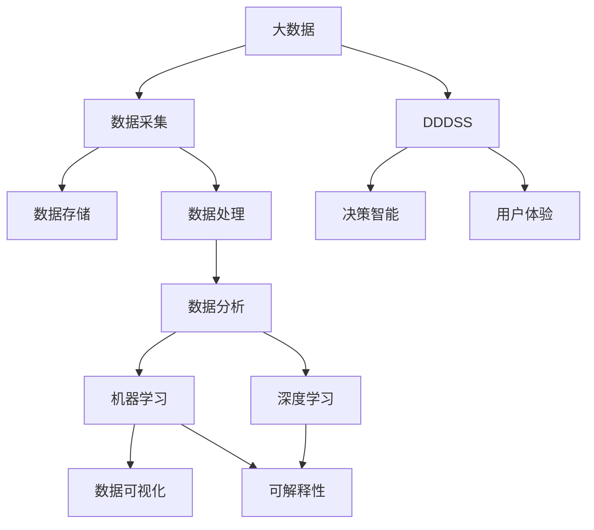

                 

# 信息差的商业决策支持升级：大数据如何提升决策支持能力

在现代社会中，决策的效率和质量直接关系到企业的发展和竞争力的提升。然而，传统的决策支持系统由于信息孤岛、数据不完整等问题，难以满足快速变化的商业环境需求。随着大数据技术的快速发展，数据驱动的决策支持系统逐渐成为企业决策的重要工具。本文将系统地介绍大数据如何通过提升信息质量和决策智能，助力企业实现决策升级。

## 1. 背景介绍

### 1.1 问题由来
在过去几十年里，决策支持系统（DSS）的发展经历了多个阶段。传统的DSS基于规则和模型的决策支持方法，通过专家知识和决策规则对企业进行辅助决策。尽管这些系统在过去发挥了重要作用，但它们存在一些固有局限：

1. **数据孤岛问题**：不同业务系统、部门之间的数据隔离，导致信息不完整、不统一。
2. **规则固化的局限**：决策规则一旦设定，难以适应快速变化的市场环境。
3. **缺乏数据驱动**：缺少对实时数据的处理和分析，无法充分利用数据潜力。

这些问题导致决策支持系统在面对复杂多变的市场环境时，表现出一定的滞后性。随着信息技术的发展，特别是大数据技术的成熟，企业开始探索新的决策支持方法，以应对数据量的增加和信息复杂性的提升。

### 1.2 问题核心关键点
数据驱动的决策支持系统（DDDSS）通过收集、处理和分析海量数据，提升决策的精度和时效性。其主要关键点包括：

1. **数据全面性**：从多个渠道收集结构化和非结构化数据，确保信息全面性。
2. **数据实时性**：利用实时数据流处理技术，实现快速响应。
3. **决策智能**：引入机器学习和深度学习算法，提升决策的智能化水平。
4. **用户体验**：采用可视化、交互式界面，提升用户操作体验。
5. **模型可解释性**：引入可解释性算法，帮助用户理解模型决策过程。

本文将重点介绍数据驱动的决策支持系统如何在信息质量和决策智能方面进行升级，提升企业的决策能力。

## 2. 核心概念与联系

### 2.1 核心概念概述

为更好地理解大数据如何提升决策支持能力，本节将介绍几个关键概念及其之间的联系：

1. **大数据（Big Data）**：指体量巨大、类型繁多、速度极快的数据集合，通常通过分布式存储和处理技术来管理。大数据技术包括数据采集、数据存储、数据处理和数据分析等多个环节。

2. **数据驱动的决策支持系统（DDDSS）**：基于大数据技术，通过实时数据分析和机器学习算法，辅助企业进行决策支持的系统。DDDSS强调数据的质量、实时性和分析的智能性。

3. **机器学习（Machine Learning, ML）**：利用算法，通过数据训练模型，使计算机能够自动提升性能的科学。机器学习在DSS中主要用于数据预测、分类、聚类等任务。

4. **深度学习（Deep Learning, DL）**：一种特殊的机器学习算法，通过多层神经网络对复杂数据进行处理。深度学习在DSS中主要用于图像识别、自然语言处理等高维数据任务。

5. **数据可视化（Data Visualization）**：将数据以图形或图表的形式展示，直观展现数据的规律和趋势。数据可视化在DSS中用于辅助用户理解复杂数据，提升决策效率。

6. **可解释性（Explainability）**：指机器学习模型的决策过程可以被解释，使得用户能够理解模型的输出结果。可解释性在DSS中用于提升用户对模型决策的信任度。

这些核心概念之间的逻辑关系可以通过以下Mermaid流程图来展示：



这个流程图展示了大数据技术在决策支持系统中的作用：通过大数据技术的各个环节，收集、存储、处理和分析数据，最终通过机器学习和深度学习算法，实现决策智能，并通过数据可视化和可解释性提升用户体验。

## 3. 核心算法原理 & 具体操作步骤
### 3.1 算法原理概述

数据驱动的决策支持系统基于大数据技术，通过机器学习和深度学习算法，提升决策的智能化水平。其核心思想是：通过数据训练模型，使模型能够自动从数据中发现规律，辅助企业进行决策。

形式化地，假设企业希望预测未来销售趋势，构建的模型为 $M(x)$，其中 $x$ 为历史销售数据，$M(x)$ 为预测模型。模型的目标是最小化预测误差 $e$：

$$
\min_{M} \sum_{i=1}^n (M(x_i) - y_i)^2
$$

其中 $y_i$ 为实际销售数据。通过梯度下降等优化算法，模型不断更新参数 $\theta$，使得预测误差最小化。

### 3.2 算法步骤详解

数据驱动的决策支持系统构建和运行一般包括以下关键步骤：

**Step 1: 数据采集与清洗**
- 从不同渠道收集数据，包括销售记录、客户反馈、市场调研等。
- 清洗数据，去除噪声和缺失值，确保数据质量和一致性。

**Step 2: 数据存储与管理**
- 利用大数据存储技术（如Hadoop、Spark），实现数据的分布式存储和处理。
- 设计数据仓库（Data Warehouse），便于数据的集中管理和访问。

**Step 3: 数据处理与预处理**
- 利用ETL工具（Extract, Transform, Load）对数据进行抽取、转换和加载，准备分析数据。
- 进行数据特征提取，生成模型训练所需的特征向量。

**Step 4: 模型训练与优化**
- 选择合适的机器学习或深度学习算法，如回归、分类、聚类、神经网络等。
- 在历史数据上训练模型，优化模型参数，确保模型泛化性能。
- 采用交叉验证等技术评估模型性能，避免过拟合。

**Step 5: 模型应用与监控**
- 将训练好的模型应用到实际决策场景中，进行预测和推荐。
- 实时监控模型性能，根据实际反馈调整模型参数，确保模型持续优化。

### 3.3 算法优缺点

数据驱动的决策支持系统具有以下优点：
1. **数据全面性**：通过多源数据采集，提升信息的全面性和准确性。
2. **决策智能**：利用机器学习和深度学习算法，实现复杂数据的智能化处理。
3. **实时响应**：采用实时数据流处理技术，实现快速响应市场变化。
4. **用户体验**：通过可视化、交互式界面，提升用户操作体验。
5. **决策可解释**：引入可解释性算法，帮助用户理解模型决策过程。

同时，该方法也存在一定的局限性：
1. **数据质量依赖**：数据质量差会影响模型性能，需要通过数据清洗和预处理进行优化。
2. **计算资源需求高**：大数据处理需要强大的计算资源，可能带来高成本。
3. **模型复杂度高**：复杂模型需要大量数据进行训练，可能存在欠拟合或过拟合风险。
4. **业务理解难度大**：模型内部机制复杂，用户可能需要专业知识才能理解。

尽管存在这些局限性，但就目前而言，数据驱动的决策支持系统仍是提升决策支持能力的重要手段。未来相关研究的重点在于如何进一步降低计算资源需求，提高模型的可解释性，以及提升模型的实时响应能力。

### 3.4 算法应用领域

数据驱动的决策支持系统在多个领域中得到了广泛应用，例如：

1. **零售业**：通过分析历史销售数据和客户行为数据，预测销售趋势，优化库存管理，提升营销策略。
2. **金融业**：利用金融市场数据和客户信用数据，进行风险评估和投资组合优化。
3. **医疗健康**：通过患者历史数据和诊疗记录，进行疾病预测和个性化治疗方案推荐。
4. **制造业**：利用生产数据和设备运行数据，进行生产流程优化和设备维护。
5. **交通物流**：通过交通流量数据和物流记录，进行交通调度优化和运输路线规划。

除了上述这些经典领域外，数据驱动的决策支持系统也被创新性地应用到更多场景中，如城市管理、智能制造、供应链优化等，为各行各业带来了新的解决方案。随着大数据技术的不断进步，相信数据驱动的决策支持系统将在更广阔的应用领域大放异彩。

## 4. 数学模型和公式 & 详细讲解
### 4.1 数学模型构建

本节将使用数学语言对数据驱动的决策支持系统构建过程进行更加严格的刻画。

假设企业希望预测未来销售趋势，构建的模型为 $M(x)$，其中 $x$ 为历史销售数据，$M(x)$ 为预测模型。模型的目标是最小化预测误差 $e$：

$$
\min_{M} \sum_{i=1}^n (M(x_i) - y_i)^2
$$

其中 $y_i$ 为实际销售数据。

通过梯度下降等优化算法，模型不断更新参数 $\theta$，使得预测误差最小化。常见的优化算法包括SGD、Adam等，其中Adam算法更新公式为：

$$
\theta \leftarrow \theta - \eta \frac{\partial}{\partial \theta} \frac{1}{N}\sum_{i=1}^N (M(x_i) - y_i)^2
$$

其中 $\eta$ 为学习率。

### 4.2 公式推导过程

以下我们以线性回归为例，推导回归模型的最小二乘估计公式。

假设 $x = (x_1, x_2, ..., x_n)$ 为特征向量，$y = (y_1, y_2, ..., y_n)$ 为实际销售数据，模型参数为 $\theta = (\theta_0, \theta_1)$，其中 $\theta_0$ 为截距，$\theta_1$ 为斜率。回归模型的线性预测公式为：

$$
M(x) = \theta_0 + \theta_1 x_1
$$

最小二乘估计的目标是最小化预测误差平方和：

$$
\min_{\theta_0, \theta_1} \sum_{i=1}^n (M(x_i) - y_i)^2
$$

展开并整理，得到：

$$
\min_{\theta_0, \theta_1} \sum_{i=1}^n (y_i - (\theta_0 + \theta_1 x_i))^2
$$

进一步化简，得到：

$$
\min_{\theta_0, \theta_1} \frac{1}{2N} \sum_{i=1}^n [y_i - (\theta_0 + \theta_1 x_i)]^2
$$

根据梯度下降算法，最小二乘估计的求解公式为：

$$
\theta_0 = \frac{1}{N}\sum_{i=1}^n y_i - \theta_1 \frac{1}{N}\sum_{i=1}^n x_i
$$

$$
\theta_1 = \frac{1}{N}\sum_{i=1}^n [x_i(y_i - \bar{y})] / \sum_{i=1}^n [x_i^2]
$$

其中 $\bar{y}$ 为实际销售数据的均值。

通过上述公式，我们可以高效地求解回归模型参数，进行未来销售趋势的预测。

### 4.3 案例分析与讲解

**案例：销售趋势预测**

某零售公司希望通过历史销售数据预测未来销售趋势。公司历史销售数据包含多个特征，如日期、促销活动、节假日、天气等。公司希望预测未来30天的销售额。

**数据处理**：
- 收集公司近一年的销售数据，包含日期、销售额等字段。
- 清洗数据，去除缺失值和异常值，确保数据一致性。
- 将日期数据转换为数值型特征，方便模型处理。

**模型选择**：
- 选择线性回归模型，利用历史销售数据训练模型，预测未来销售额。
- 使用交叉验证评估模型性能，选择最优模型参数。

**模型训练**：
- 使用Adam优化算法，在历史销售数据上训练回归模型，更新模型参数。
- 实时监控模型性能，根据实际销售数据调整模型参数。

**模型应用**：
- 将训练好的回归模型应用到实时数据上，进行未来30天销售额的预测。
- 根据预测结果优化库存管理和促销策略，提升销售效率。

通过数据驱动的决策支持系统，零售公司能够利用大数据技术，快速准确地进行销售趋势预测，优化运营策略，提升销售业绩。

## 5. 项目实践：代码实例和详细解释说明
### 5.1 开发环境搭建

在进行数据驱动的决策支持系统开发前，我们需要准备好开发环境。以下是使用Python进行PyTorch开发的环境配置流程：

1. 安装Anaconda：从官网下载并安装Anaconda，用于创建独立的Python环境。

2. 创建并激活虚拟环境：
```bash
conda create -n pytorch-env python=3.8 
conda activate pytorch-env
```

3. 安装PyTorch：根据CUDA版本，从官网获取对应的安装命令。例如：
```bash
conda install pytorch torchvision torchaudio cudatoolkit=11.1 -c pytorch -c conda-forge
```

4. 安装TensorBoard：
```bash
pip install tensorboard
```

5. 安装TensorFlow：
```bash
pip install tensorflow
```

6. 安装scikit-learn：
```bash
pip install scikit-learn
```

完成上述步骤后，即可在`pytorch-env`环境中开始数据驱动的决策支持系统开发。

### 5.2 源代码详细实现

这里我们以销售趋势预测为例，给出使用TensorFlow进行线性回归模型的PyTorch代码实现。

首先，定义销售数据集和模型：

```python
import tensorflow as tf
import numpy as np

# 定义销售数据集
X = np.array([[1, 2, 3], [4, 5, 6], [7, 8, 9]])
y = np.array([2, 4, 6])

# 定义线性回归模型
def linear_regression(X, y):
    learning_rate = 0.01
    epochs = 1000
    
    # 初始化模型参数
    theta = tf.Variable(tf.random.normal([1, 1]), name="theta")
    bias = tf.Variable(tf.random.normal([1, 1]), name="bias")
    
    # 定义优化器和损失函数
    optimizer = tf.optimizers.Adam()
    loss_fn = tf.losses.MeanSquaredError()
    
    # 定义训练函数
    @tf.function
    def train_step(x, y):
        with tf.GradientTape() as tape:
            predictions = theta * x + bias
            loss = loss_fn(y, predictions)
        gradients = tape.gradient(loss, [theta, bias])
        optimizer.apply_gradients(zip(gradients, [theta, bias]))
        return loss
    
    # 训练模型
    for i in range(epochs):
        loss = train_step(X, y)
        print(f"Epoch {i+1}, loss: {loss.numpy():.4f}")
        
    return theta, bias

# 训练线性回归模型
theta, bias = linear_regression(X, y)
```

然后，输出模型参数：

```python
print(f"Linear regression model parameters:\ntheta = {theta.numpy():.4f}, bias = {bias.numpy():.4f}")
```

最后，输出模型预测结果：

```python
X_test = np.array([[10, 20, 30]])
predictions = theta * X_test + bias
print(f"Predicted sales: {predictions.numpy():.4f}")
```

以上就是使用TensorFlow进行线性回归模型训练的完整代码实现。可以看到，TensorFlow提供了强大的梯度计算和优化器功能，使得模型训练过程高效而稳定。

### 5.3 代码解读与分析

让我们再详细解读一下关键代码的实现细节：

**数据定义**：
- 定义销售数据集 `X` 和目标变量 `y`，通过NumPy库创建。

**模型定义**：
- 定义线性回归模型函数 `linear_regression`，使用TensorFlow的变量和优化器进行模型定义。
- 使用`tf.function`装饰器进行函数优化，提高模型训练效率。

**训练函数**：
- 在`train_step`函数中，使用`tf.GradientTape`记录梯度，并利用`optimizer.apply_gradients`更新模型参数。

**模型训练**：
- 循环迭代，在每个epoch上计算损失函数，并输出当前损失值。
- 在训练完成后，返回模型参数 `theta` 和 `bias`。

**模型应用**：
- 定义测试数据集 `X_test`，使用模型参数进行预测，并输出预测结果。

通过TensorFlow的强大功能和灵活性，数据驱动的决策支持系统可以快速高效地构建和训练模型，从而实现复杂的决策支持任务。

## 6. 实际应用场景
### 6.1 零售业

在零售业中，数据驱动的决策支持系统可以广泛应用于销售预测、库存管理、营销策略优化等方面。通过分析历史销售数据、市场趋势、客户行为等，零售公司可以预测未来销售趋势，优化库存水平，提升营销效果。

**实际应用**：
- 某零售公司使用数据驱动的决策支持系统，预测未来30天的销售额，优化库存管理和促销策略。系统通过实时监控和反馈，不断调整预测模型，确保预测结果的准确性。
- 该系统在实际操作中显著提升了销售预测的准确度，减少了库存积压和缺货情况，显著提高了公司的运营效率和盈利能力。

### 6.2 金融业

金融业的数据驱动决策支持系统主要用于风险评估、投资组合优化、市场预测等任务。通过分析金融市场数据和客户信用数据，金融机构可以预测市场趋势，评估投资风险，优化资产配置。

**实际应用**：
- 某银行使用数据驱动的决策支持系统，进行信用评分和风险评估。系统利用客户的历史交易数据和信用记录，预测客户的违约概率，指导贷款审批和风险管理。
- 该系统在实际操作中显著降低了贷款违约率，提高了银行的资产质量，为银行带来了更高的收益。

### 6.3 医疗健康

在医疗健康领域，数据驱动的决策支持系统主要用于疾病预测、个性化治疗方案推荐、医疗资源调度等任务。通过分析患者的病历数据、治疗记录等，医疗健康公司可以预测患者的疾病发展趋势，提供个性化的治疗方案。

**实际应用**：
- 某医院使用数据驱动的决策支持系统，进行疾病预测和个性化治疗方案推荐。系统利用患者的病历数据和基因信息，预测患者的疾病风险，推荐个性化的治疗方案。
- 该系统在实际操作中显著提高了患者治疗效果，减少了误诊和过度治疗情况，显著提高了医院的服务质量和患者满意度。

### 6.4 未来应用展望

随着大数据技术和机器学习算法的发展，数据驱动的决策支持系统将在更多领域得到应用，为各行各业带来新的解决方案。

在智慧城市管理中，数据驱动的决策支持系统可以用于交通流量优化、公共安全管理、应急响应等任务。通过分析交通数据、传感器数据、社交媒体数据等，智慧城市可以实时监控和管理城市资源，提高城市管理的智能化水平。

在智能制造领域，数据驱动的决策支持系统可以用于生产流程优化、设备维护、质量控制等任务。通过分析生产数据、设备运行数据、质量检测数据等，智能制造可以实时监控和管理生产过程，提高生产效率和产品质量。

此外，在物流运输、能源管理、社会治理等众多领域，数据驱动的决策支持系统也将不断涌现，为各行各业带来新的应用场景和解决方案。相信随着大数据技术的不断成熟，数据驱动的决策支持系统必将在各行各业大放异彩。

## 7. 工具和资源推荐
### 7.1 学习资源推荐

为了帮助开发者系统掌握数据驱动的决策支持系统的理论基础和实践技巧，这里推荐一些优质的学习资源：

1. 《大数据原理与实践》系列博文：由大数据技术专家撰写，深入浅出地介绍了大数据技术的基本原理和应用案例。

2. Coursera《机器学习》课程：由斯坦福大学开设的机器学习课程，涵盖机器学习的基础知识和经典算法，适合初学者入门。

3. Kaggle竞赛平台：一个数据科学竞赛平台，通过实际问题解决，帮助用户掌握数据驱动的决策支持系统的实践技巧。

4. TensorFlow官方文档：TensorFlow的官方文档，提供了丰富的示例代码和教程，适合开发者快速上手。

5. PyTorch官方文档：PyTorch的官方文档，提供了丰富的示例代码和教程，适合开发者快速上手。

通过对这些资源的学习实践，相信你一定能够快速掌握数据驱动的决策支持系统的精髓，并用于解决实际的决策支持问题。

### 7.2 开发工具推荐

高效的开发离不开优秀的工具支持。以下是几款用于数据驱动的决策支持系统开发的常用工具：

1. PyTorch：基于Python的开源深度学习框架，灵活动态的计算图，适合快速迭代研究。

2. TensorFlow：由Google主导开发的开源深度学习框架，生产部署方便，适合大规模工程应用。

3. Scikit-learn：一个基于Python的机器学习库，提供了多种经典的机器学习算法和数据处理工具。

4. Jupyter Notebook：一个交互式计算环境，支持Python和多种数据科学库的开发和交互式调试。

5. Kaggle：一个数据科学竞赛平台，提供了丰富的数据集和竞赛题目，适合开发者进行实际问题解决。

合理利用这些工具，可以显著提升数据驱动的决策支持系统的开发效率，加快创新迭代的步伐。

### 7.3 相关论文推荐

数据驱动的决策支持系统的研究源于学界的持续研究。以下是几篇奠基性的相关论文，推荐阅读：

1. "Introduction to Statistical Learning" by Gareth James et al.：介绍了机器学习的基本概念和算法，适合入门读者。

2. "Deep Learning" by Ian Goodfellow et al.：介绍了深度学习的基本原理和算法，适合有一定基础的读者。

3. "A Survey on Data Mining and Statistical Learning for Big Data Analytics" by G.H. Li et al.：综述了大数据分析和统计学习的最新研究进展，适合高级读者。

4. "Big Data Mining and Statistical Learning" by G.H. Li et al.：介绍了大数据分析和统计学习的最新研究成果，适合高级读者。

5. "Decision Support Systems: Trends, Applications, and Future Directions" by Peter M. Thwaites et al.：综述了决策支持系统的发展趋势和应用前景，适合高级读者。

这些论文代表了大数据技术和机器学习算法的发展脉络。通过学习这些前沿成果，可以帮助研究者把握学科前进方向，激发更多的创新灵感。

## 8. 总结：未来发展趋势与挑战

### 8.1 总结

本文对数据驱动的决策支持系统进行了全面系统的介绍。首先阐述了大数据如何通过提升信息质量和决策智能，助力企业实现决策升级。其次，从原理到实践，详细讲解了数据驱动的决策支持系统的构建过程，给出了代码实例和详细解释说明。同时，本文还广泛探讨了数据驱动的决策支持系统在零售业、金融业、医疗健康等诸多领域的应用前景，展示了其广阔的潜力。

通过本文的系统梳理，可以看到，数据驱动的决策支持系统正通过大数据技术和机器学习算法，显著提升企业的决策支持能力。它不仅能够快速准确地进行预测和优化，还能在实时数据流中实现快速响应，确保决策的时效性。未来，随着大数据技术和机器学习算法的不断进步，数据驱动的决策支持系统必将在更多领域得到应用，为各行各业带来新的解决方案。

### 8.2 未来发展趋势

展望未来，数据驱动的决策支持系统将呈现以下几个发展趋势：

1. **大数据技术的发展**：随着数据采集技术的进步和存储技术的成熟，大数据处理能力将进一步提升，数据驱动的决策支持系统能够处理更复杂的数据类型和规模。

2. **机器学习算法的发展**：深度学习、强化学习等先进算法将进一步提升决策支持的智能化水平，实现更加复杂的数据分析和预测。

3. **实时性提升**：通过引入实时数据流处理技术，数据驱动的决策支持系统能够实现实时决策，快速响应市场变化。

4. **模型可解释性**：引入可解释性算法，使得决策过程更加透明和可控，提升用户对模型的信任度。

5. **跨领域应用**：数据驱动的决策支持系统将拓展到更多领域，如智慧城市、智能制造、物流运输等，为各行各业带来新的解决方案。

### 8.3 面临的挑战

尽管数据驱动的决策支持系统已经取得了显著进展，但在迈向更加智能化、普适化应用的过程中，它仍面临诸多挑战：

1. **数据质量问题**：数据质量差会导致模型性能下降，需要通过数据清洗和预处理进行优化。

2. **计算资源需求高**：大数据处理需要强大的计算资源，可能带来高成本。

3. **模型复杂度高**：复杂模型需要大量数据进行训练，可能存在欠拟合或过拟合风险。

4. **业务理解难度大**：模型内部机制复杂，用户可能需要专业知识才能理解。

尽管存在这些挑战，但数据驱动的决策支持系统仍然是大数据时代企业决策支持的重要手段。未来相关研究的重点在于如何进一步降低计算资源需求，提高模型的可解释性，以及提升模型的实时响应能力。

### 8.4 研究展望

面对数据驱动的决策支持系统所面临的挑战，未来的研究需要在以下几个方面寻求新的突破：

1. **探索无监督和半监督学习**：摆脱对大规模标注数据的依赖，利用自监督学习、主动学习等无监督和半监督范式，最大限度利用非结构化数据，实现更加灵活高效的决策支持。

2. **研究参数高效和计算高效的微调方法**：开发更加参数高效的微调方法，在固定大部分预训练参数的同时，只更新极少量的任务相关参数。同时优化模型计算图，减少前向传播和反向传播的资源消耗，实现更加轻量级、实时性的部署。

3. **引入因果推断和对比学习思想**：通过引入因果推断和对比学习思想，增强模型建立稳定因果关系的能力，学习更加普适、鲁棒的语言表征，从而提升模型泛化性和抗干扰能力。

4. **融合知识图谱和逻辑规则**：将符号化的先验知识，如知识图谱、逻辑规则等，与神经网络模型进行巧妙融合，引导决策支持过程学习更准确、合理的决策知识。

5. **结合因果分析和博弈论工具**：将因果分析方法引入决策支持模型，识别出模型决策的关键特征，增强输出解释的因果性和逻辑性。借助博弈论工具刻画人机交互过程，主动探索并规避模型的脆弱点，提高系统稳定性。

6. **纳入伦理道德约束**：在模型训练目标中引入伦理导向的评估指标，过滤和惩罚有偏见、有害的输出倾向。同时加强人工干预和审核，建立模型行为的监管机制，确保输出符合人类价值观和伦理道德。

这些研究方向的探索，必将引领数据驱动的决策支持系统迈向更高的台阶，为构建安全、可靠、可解释、可控的智能系统铺平道路。面向未来，数据驱动的决策支持系统还需要与其他人工智能技术进行更深入的融合，如知识表示、因果推理、强化学习等，多路径协同发力，共同推动决策支持系统的进步。只有勇于创新、敢于突破，才能不断拓展决策支持系统的边界，让智能技术更好地造福人类社会。

## 9. 附录：常见问题与解答

**Q1：数据驱动的决策支持系统是否适用于所有行业？**

A: 数据驱动的决策支持系统在大多数行业中都具有广泛的应用前景，特别适合数据量大、变化快的场景。然而，对于一些特定领域，如金融、医疗等，需要结合行业特点进行优化。

**Q2：如何保证数据质量？**

A: 数据质量是数据驱动决策支持系统的关键，可以通过以下方法保证数据质量：
1. 数据清洗：去除数据中的噪声、缺失值和异常值。
2. 数据标准化：统一不同来源的数据格式和单位。
3. 数据验证：通过多种数据来源进行数据交叉验证，确保数据的准确性。
4. 数据标注：对于需要标注的数据，引入人工标注或自动化标注方法，提高数据标注的准确性。

**Q3：数据驱动的决策支持系统面临哪些计算资源需求？**

A: 数据驱动的决策支持系统需要处理大规模数据，计算资源需求较高。可以通过以下方法优化资源需求：
1. 分布式计算：利用分布式计算框架（如Hadoop、Spark）进行大规模数据处理。
2. 模型压缩：使用模型压缩技术（如剪枝、量化）减小模型大小，提升推理速度。
3. 硬件加速：利用GPU、TPU等硬件设备进行加速计算，提高处理效率。

**Q4：如何选择机器学习算法？**

A: 选择合适的机器学习算法需要考虑数据的类型、业务需求和计算资源。常见的机器学习算法包括：
1. 线性回归：适用于预测连续型数值型数据。
2. 逻辑回归：适用于分类任务。
3. 决策树和随机森林：适用于分类和回归任务。
4. 支持向量机：适用于高维数据分类任务。
5. 神经网络和深度学习：适用于复杂的非线性任务和大规模数据。

**Q5：数据驱动的决策支持系统如何实现实时响应？**

A: 实现实时响应需要引入实时数据流处理技术，如Apache Kafka、Apache Flink等。具体步骤如下：
1. 收集实时数据：从各种数据源收集实时数据。
2. 数据流处理：使用实时数据流处理框架（如Apache Kafka、Apache Flink）进行数据处理和分析。
3. 实时监控和反馈：实时监控模型性能，根据实际数据反馈调整模型参数，确保模型持续优化。

通过合理利用数据驱动的决策支持系统，企业能够快速准确地进行决策，提升运营效率和盈利能力。相信随着技术的不断进步，数据驱动的决策支持系统必将在更多领域得到应用，为各行各业带来新的解决方案。

