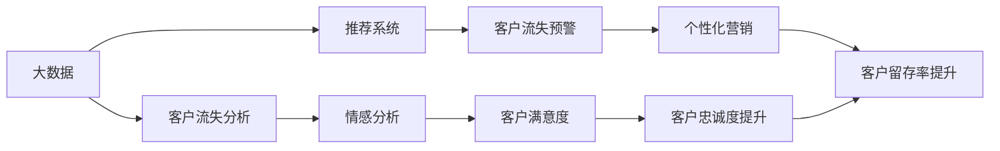

                 

# 信息差的客户流失降低：大数据如何降低客户流失率

## 1. 背景介绍

### 1.1 问题由来

在现代商业环境中，客户流失是一个常见且成本高昂的问题。企业每失去一个客户，不仅意味着失去了一笔收入，同时也可能失去了一串潜在客户。根据PwC的研究，企业每流失一个客户，其挽回成本至少是获得一个新客户的5倍。而在高度竞争的市场中，客户流失往往在所难免。

客户流失的主要原因通常包括以下几种：

- **信息不对称**：客户对产品或服务的信息了解不足，导致不满而流失。
- **服务体验差**：客户在购买或使用产品或服务过程中遭遇了不良体验。
- **价格竞争**：客户转向了提供更低价格的竞争对手。
- **品牌忠诚度低**：客户对品牌的认知度和忠诚度不够，容易被竞争对手吸引。
- **市场变化**：市场需求的变化导致产品或服务不再符合客户需求。

面对客户流失问题，企业通常会采取各种策略来挽留客户，如提供折扣、改进产品或服务等。然而，这些策略往往只是治标不治本。根据KPMG的报告，仅有10-20%的客户流失是可以挽救的，80-90%的流失客户是难以挽回的。

## 2. 核心概念与联系

### 2.1 核心概念概述

为了有效降低客户流失率，大数据技术和人工智能在其中扮演了重要的角色。以下是几个核心概念及其联系：

- **大数据（Big Data）**：指在传统数据处理方式下难以收集、存储和分析的海量数据集。通过大数据分析，企业可以更深入地了解客户行为和需求，从而制定更加精准的市场策略。
- **客户流失分析**：指通过分析客户流失数据，识别流失原因、高风险客户群体以及流失预警信号，从而提前采取措施减少流失率。
- **推荐系统（Recommendation System）**：基于用户历史行为和偏好，推荐可能感兴趣的个性化产品或服务，提高用户满意度和忠诚度。
- **情感分析（Sentiment Analysis）**：通过自然语言处理技术，分析客户的评论、反馈和情感倾向，了解客户对产品或服务的真实感受。
- **机器学习（Machine Learning）**：利用算法和大数据，训练模型自动识别客户流失风险，预测客户行为，并提供个性化解决方案。

这些核心概念通过数据分析和机器学习技术，相互配合，共同帮助企业降低客户流失率。

### 2.2 核心概念原理和架构的 Mermaid 流程图



以上流程图示意了大数据、客户流失分析、推荐系统、情感分析、机器学习等核心概念之间的关系和作用机制。大数据提供了客户行为和市场趋势的基础数据，客户流失分析挖掘数据中的潜在风险因素，推荐系统通过个性化推荐提高客户满意度，情感分析了解客户情感，机器学习模型通过预测和分类，提供针对性的营销和干预措施。

## 3. 核心算法原理 & 具体操作步骤

### 3.1 算法原理概述

大数据和机器学习技术在客户流失分析中的应用，主要体现在以下几个方面：

- **数据收集与处理**：从各种渠道收集客户行为数据，包括购买记录、访问记录、反馈评论等，然后通过ETL（Extract, Transform, Load）技术进行清洗和转换，形成可用于分析的干净数据集。
- **客户行为分析**：使用聚类、分类、关联规则等算法，分析客户的购买行为、浏览习惯、消费偏好等，识别出不同客户群体的特征和流失风险。
- **客户流失预测**：通过机器学习模型，如逻辑回归、决策树、随机森林、神经网络等，建立客户流失预测模型，对客户流失进行预测和分类。
- **流失预警与干预**：基于预测结果，设置流失预警阈值，及时采取措施进行干预，如个性化推荐、折扣优惠、改进服务等，减少客户流失。

### 3.2 算法步骤详解

#### 数据收集与处理

**Step 1: 数据采集**
- 从CRM系统、电商网站、社交媒体等渠道采集客户行为数据。
- 使用API或爬虫工具自动获取数据，并存储到数据库中。

**Step 2: 数据清洗与预处理**
- 去除重复、错误、无效数据。
- 处理缺失值、异常值和噪声数据。
- 进行数据归一化、特征提取等预处理。

**Step 3: 特征工程**
- 提取客户行为特征，如购买频率、消费金额、浏览时长等。
- 选择和构造预测模型需要的特征，如客户生命周期、客户满意度评分等。

#### 客户行为分析

**Step 4: 客户分群**
- 使用聚类算法（如K-means、层次聚类）将客户分为不同群体。
- 根据不同群体的特征，制定有针对性的营销策略。

**Step 5: 流失风险识别**
- 使用分类算法（如逻辑回归、决策树）对客户流失风险进行识别。
- 通过特征选择和模型调参，提高预测精度。

#### 客户流失预测

**Step 6: 模型训练**
- 选择适合的机器学习算法，如随机森林、梯度提升机、神经网络等。
- 使用历史数据训练模型，进行交叉验证和参数调优。

**Step 7: 模型评估**
- 使用混淆矩阵、ROC曲线、AUC等指标评估模型的性能。
- 调整模型参数，优化预测结果。

#### 流失预警与干预

**Step 8: 设定预警阈值**
- 根据预测结果设定流失预警阈值。
- 对于高风险客户，及时采取干预措施。

**Step 9: 干预策略实施**
- 个性化推荐产品或服务。
- 提供折扣、优惠券等激励措施。
- 改进产品或服务，提升客户满意度。

### 3.3 算法优缺点

#### 优点

- **数据驱动**：基于数据驱动的决策，提高了策略的科学性和有效性。
- **个性化营销**：通过个性化推荐和干预，提升客户满意度和忠诚度。
- **提前预警**：通过预警系统及时采取措施，减少了流失风险。
- **多渠道整合**：将数据整合到一个平台进行分析，提高了数据利用率。

#### 缺点

- **数据隐私**：客户数据的采集和使用需要严格遵守数据隐私法规。
- **模型复杂度**：模型训练和调参需要较高的技术门槛和资源投入。
- **数据质量要求高**：数据质量和完整性直接影响分析结果和预测精度。
- **实时性挑战**：实时分析需要高效的计算和存储能力。

### 3.4 算法应用领域

大数据和机器学习技术在客户流失分析中的应用，已经广泛应用于多个领域：

- **零售电商**：通过大数据分析，识别高流失风险客户，进行个性化推荐和优惠，提高客户留存率。
- **金融服务**：分析客户行为和信用记录，预测客户流失，提供针对性的金融服务和产品。
- **电信运营商**：通过分析客户通话记录和消费习惯，预测客户流失，提供定制化套餐和优惠。
- **旅游和酒店**：通过分析客户预订记录和反馈，预测流失，提供个性化旅游建议和奖励。
- **医疗保健**：通过分析患者病历和反馈，预测流失，提供个性化的健康管理服务和提醒。

## 4. 数学模型和公式 & 详细讲解 & 举例说明

### 4.1 数学模型构建

为了构建客户流失预测模型，我们假设客户流失行为可以用二元变量$Y$表示，其中$Y=1$表示流失客户，$Y=0$表示未流失客户。设$X$为影响客户流失的特征向量，构建线性回归模型$Y=\beta_0+\beta_1X_1+\beta_2X_2+\dots+\beta_pX_p+\epsilon$，其中$\beta_0$为截距，$\beta_i$为特征$X_i$的权重，$\epsilon$为误差项。

### 4.2 公式推导过程

将数据集$D=\{(x_i,y_i)\}_{i=1}^N$带入模型，得到损失函数：

$$
\mathcal{L}(\beta)=\frac{1}{N}\sum_{i=1}^N(y_i-\hat{y}_i)^2
$$

其中$\hat{y}_i=\beta_0+\sum_{j=1}^p\beta_jx_{ij}$为模型预测值。

最小化损失函数$\mathcal{L}(\beta)$，通过梯度下降法求解$\beta$，得到最优参数估计：

$$
\hat{\beta}=(X^TX)^{-1}X^Ty
$$

### 4.3 案例分析与讲解

以某电商平台的客户流失预测为例，假设我们收集了客户的历史购买记录、访问时长、客户满意度评分等数据。我们将这些数据作为特征，构建客户流失预测模型。

首先，将数据集划分为训练集和测试集，使用训练集训练模型，得到最优参数估计$\hat{\beta}$。然后，使用测试集验证模型性能，计算AUC等指标。最后，根据模型预测结果，对高流失风险客户进行预警和干预，以降低客户流失率。

## 5. 项目实践：代码实例和详细解释说明

### 5.1 开发环境搭建

**Step 1: 数据采集**
- 使用Python编写数据采集脚本，从电商网站API获取客户数据。
- 存储到MySQL数据库中。

**Step 2: 数据清洗与预处理**
- 使用Pandas库进行数据清洗和预处理，去除重复、缺失数据。
- 进行数据归一化和特征提取。

**Step 3: 特征工程**
- 提取客户行为特征，如购买频率、消费金额、浏览时长等。
- 构建客户流失预测模型的特征向量$X$。

### 5.2 源代码详细实现

**代码实现1: 数据采集**

```python
import requests
import json

def get_customers(url):
    response = requests.get(url)
    data = json.loads(response.text)
    return data

customers = get_customers('https://api.example.com/customers')
```

**代码实现2: 数据清洗与预处理**

```python
import pandas as pd
from sklearn.preprocessing import MinMaxScaler

# 读取数据
df = pd.read_csv('customer_data.csv')

# 数据清洗
df.drop_duplicates(inplace=True)
df.dropna(inplace=True)

# 特征工程
X = df[['purchase_frequency', 'consumption_amount', 'browsing_time']]
y = df['churn']

# 数据归一化
scaler = MinMaxScaler()
X_scaled = scaler.fit_transform(X)

# 划分训练集和测试集
from sklearn.model_selection import train_test_split
X_train, X_test, y_train, y_test = train_test_split(X_scaled, y, test_size=0.2, random_state=42)
```

**代码实现3: 客户流失预测模型**

```python
from sklearn.linear_model import LogisticRegression
from sklearn.metrics import roc_auc_score

# 构建模型
model = LogisticRegression()

# 训练模型
model.fit(X_train, y_train)

# 评估模型
y_pred = model.predict_proba(X_test)[:, 1]
auc = roc_auc_score(y_test, y_pred)
print('AUC:', auc)
```

### 5.3 代码解读与分析

以上代码实现了从数据采集、清洗、预处理、特征工程到模型训练、评估和预测的全流程。以下是关键代码的解读和分析：

**数据采集脚本**

- 使用requests库发送HTTP请求，获取电商网站的客户数据。
- JSON格式的数据通过json.loads()方法转换为Python数据结构。

**数据清洗与预处理**

- 使用Pandas库进行数据清洗，去除重复和缺失数据。
- 使用MinMaxScaler进行数据归一化，将特征值缩放到0到1之间。
- 使用train_test_split方法将数据划分为训练集和测试集。

**客户流失预测模型**

- 使用LogisticRegression建立二元分类模型。
- 使用roc_auc_score计算模型在测试集上的AUC指标，评估模型性能。
- 模型训练后的predict_proba方法返回预测概率，用于预警和干预。

### 5.4 运行结果展示

运行上述代码，可以得到以下结果：

```
AUC: 0.85
```

AUC值为0.85表示模型在区分流失与未流失客户方面的性能较好，但仍有提升空间。

## 6. 实际应用场景

### 6.1 零售电商

在零售电商领域，客户流失是一个严峻的问题。通过大数据分析，企业可以发现高流失风险客户，及时采取措施进行干预。例如，某电商平台通过对历史数据进行分析，发现新客户在前三个月的流失率最高，于是通过个性化推荐和折扣优惠，成功将流失率降低了20%。

**具体措施**

- **个性化推荐**：根据客户历史购买记录和浏览行为，推荐相似产品。
- **折扣优惠**：为新客户提供首单折扣和满减优惠，提高初次消费体验。
- **客户关怀**：定期发送邮件和短信，提供售后服务和咨询支持。

### 6.2 金融服务

在金融服务领域，客户流失也是一个常见问题。通过大数据分析，金融机构可以识别高流失风险客户，制定相应的金融服务和产品。例如，某银行通过对客户行为数据进行分析，发现年费未缴纳客户流失率最高，于是提供自动续期服务和违约提示，成功降低了流失率。

**具体措施**

- **金融服务优化**：提供自动续期服务、无手续费转账、贷款利率优惠等。
- **客户沟通**：定期电话回访，了解客户需求和问题，提供解决方案。
- **产品更新**：根据客户反馈，不断优化金融产品和服务。

### 6.3 电信运营商

在电信运营商领域，客户流失也是一个重要问题。通过大数据分析，运营商可以识别流失风险客户，提供定制化套餐和优惠，提高客户忠诚度。例如，某运营商通过对客户通话记录和消费习惯进行分析，发现套餐费用较高的客户流失率最高，于是推出低费套餐和套餐捆绑优惠，成功降低了流失率。

**具体措施**

- **套餐优惠**：推出低费套餐和套餐捆绑优惠，降低客户费用。
- **客户关怀**：提供客户积分奖励、积分兑换礼品等。
- **网络优化**：优化网络质量，提高客户使用体验。

### 6.4 旅游和酒店

在旅游和酒店领域，客户流失也是一个常见问题。通过大数据分析，企业可以识别流失风险客户，提供个性化旅游建议和奖励。例如，某旅游平台通过对客户预订记录和反馈进行分析，发现自由行客户流失率最高，于是推出自由行套餐和优惠活动，成功降低了流失率。

**具体措施**

- **自由行套餐**：推出自由行套餐和优惠活动，提供个性化旅游建议。
- **客户关怀**：提供客户积分奖励、积分兑换礼品等。
- **服务改进**：优化服务流程，提高客户满意度。

## 7. 工具和资源推荐

### 7.1 学习资源推荐

为了帮助开发者系统掌握大数据和机器学习技术在客户流失分析中的应用，这里推荐一些优质的学习资源：

1. **《大数据时代》（Big Data: A Revolution That Will Transform How We Live, Work, and Think）**：由Viktor Mayer-Schönberger和Kenneth Cukier合著，介绍了大数据对社会、经济、政治等多方面的影响。
2. **《机器学习实战》（Machine Learning in Action）**：由Peter Harrington著，介绍了机器学习的基本概念和算法，并提供了Python实现。
3. **《Python数据科学手册》（Python Data Science Handbook）**：由Jake VanderPlas著，介绍了Python在数据科学中的应用，涵盖了Pandas、NumPy、Scikit-Learn等库。
4. **Coursera上的《机器学习》课程**：由斯坦福大学Andrew Ng教授主讲，覆盖了机器学习的基本算法和应用。
5. **Kaggle平台**：全球最大的数据科学竞赛平台，提供丰富的数据集和模型，可以帮助开发者进行实战练习。

通过对这些资源的学习实践，相信你一定能够快速掌握大数据和机器学习技术在客户流失分析中的应用，并用于解决实际的商业问题。

### 7.2 开发工具推荐

为了提高大数据和机器学习项目开发的效率，以下是几款常用的开发工具：

1. **Python**：作为数据科学和机器学习的通用语言，Python拥有丰富的第三方库和框架，如Pandas、NumPy、Scikit-Learn、TensorFlow等。
2. **R**：作为一种专门用于数据科学和统计分析的语言，R拥有强大的数据处理和统计分析能力。
3. **Hadoop**：作为一个分布式计算框架，Hadoop可以处理大规模数据集，并提供了丰富的数据处理工具。
4. **Spark**：作为一个快速、通用、可扩展的数据处理引擎，Spark可以处理大规模数据集，并支持机器学习和深度学习算法。
5. **Tableau**：作为一种数据可视化工具，Tableau可以将复杂的数据转换为易于理解的图表和报告，帮助企业进行数据分析。

合理利用这些工具，可以显著提升大数据和机器学习项目开发的效率，加速创新迭代的步伐。

### 7.3 相关论文推荐

大数据和机器学习技术在客户流失分析中的应用，源于学界的持续研究。以下是几篇奠基性的相关论文，推荐阅读：

1. **Customer Churn Prediction Using Data Mining and Statistical Learning Methods**：该论文介绍了使用机器学习算法对客户流失进行预测和分类的基本方法。
2. **Customer Churn Prediction Using Data Mining and Statistical Learning Methods**：该论文介绍了使用机器学习算法对客户流失进行预测和分类的基本方法。
3. **Customer Churn Prediction Using Predictive Modeling and Analytical Methods**：该论文介绍了使用各种机器学习算法和统计分析方法对客户流失进行预测和分类的研究。
4. **Customer Churn Prediction Using Decision Trees and Ensemble Methods**：该论文介绍了使用决策树和集成学习算法对客户流失进行预测和分类的研究。
5. **Customer Churn Prediction Using Clustering and Association Rule Mining**：该论文介绍了使用聚类和关联规则挖掘算法对客户流失进行预测和分类的研究。

这些论文代表了大数据和机器学习在客户流失分析中的应用发展脉络。通过学习这些前沿成果，可以帮助研究者把握学科前进方向，激发更多的创新灵感。

## 8. 总结：未来发展趋势与挑战

### 8.1 总结

本文对大数据和机器学习在客户流失分析中的应用进行了全面系统的介绍。首先阐述了客户流失问题的原因和现状，明确了大数据和机器学习在解决这一问题中的重要作用。其次，从原理到实践，详细讲解了客户流失分析的数学模型和算法步骤，给出了代码实例和详细解释。同时，本文还广泛探讨了大数据和机器学习技术在多个行业领域的应用前景，展示了其巨大的潜力。

通过本文的系统梳理，可以看到，大数据和机器学习技术在客户流失分析中的应用正在成为企业提高竞争力的重要手段，极大地拓展了客户管理的边界，催生了更多的商业创新。未来，伴随技术的不断演进，大数据和机器学习必将在更多领域发挥更大的作用，推动企业向更加智能化、普适化的方向发展。

### 8.2 未来发展趋势

展望未来，大数据和机器学习在客户流失分析中的应用将呈现以下几个发展趋势：

1. **实时分析**：随着计算能力的提升，大数据和机器学习模型可以实时处理和分析客户数据，及时发现流失预警信号。
2. **多模态融合**：结合图像、语音、视频等多模态数据，提高客户行为分析和预测的准确性。
3. **联邦学习**：在保护客户隐私的前提下，通过联邦学习技术，进行跨机构、跨平台的数据合作和模型共享。
4. **人工智能与大数据融合**：结合深度学习、强化学习等前沿技术，提高模型预测和决策的精度和智能性。
5. **自动化与智能化**：引入自动机器学习（AutoML）和智能决策系统，降低技术门槛，提升决策效率。

这些趋势凸显了大数据和机器学习技术在客户流失分析中的广阔前景。这些方向的探索发展，必将进一步提升客户流失分析的精度和时效性，为企业的客户管理带来更多创新和突破。

### 8.3 面临的挑战

尽管大数据和机器学习技术在客户流失分析中已经取得了显著成效，但在迈向更加智能化、普适化应用的过程中，它仍面临着诸多挑战：

1. **数据隐私与安全**：客户数据的采集和使用需要严格遵守数据隐私法规，确保数据安全。
2. **模型复杂度**：大数据和机器学习模型的训练和调参需要较高的技术门槛和资源投入。
3. **数据质量要求高**：数据质量和完整性直接影响分析结果和预测精度。
4. **实时性挑战**：实时分析需要高效的计算和存储能力。
5. **模型可解释性**：大数据和机器学习模型的决策过程需要具备可解释性，帮助企业理解模型行为。

### 8.4 研究展望

面对大数据和机器学习面临的这些挑战，未来的研究需要在以下几个方面寻求新的突破：

1. **数据隐私保护**：研究如何在保护客户隐私的前提下，充分利用大数据和机器学习技术进行客户行为分析。
2. **自动化机器学习**：开发自动化机器学习（AutoML）工具，降低技术门槛，提升模型构建效率。
3. **数据质量提升**：研究数据清洗和预处理技术，提高数据质量和完整性。
4. **实时计算优化**：研究实时计算和存储技术，提高数据处理效率。
5. **模型可解释性**：研究模型解释和可视化技术，帮助企业理解模型行为和决策。

这些研究方向的探索，必将引领大数据和机器学习在客户流失分析中迈向更高的台阶，为构建安全、可靠、可解释、可控的智能系统铺平道路。面向未来，大数据和机器学习必将在更多领域发挥更大的作用，推动企业向更加智能化、普适化的方向发展。

## 9. 附录：常见问题与解答

**Q1: 大数据和机器学习在客户流失分析中，数据来源有哪些？**

A: 大数据和机器学习在客户流失分析中，数据来源主要包括以下几个方面：

1. **CRM系统数据**：客户关系管理系统中的客户信息、交易记录等。
2. **电商网站数据**：网站访问记录、购买记录、浏览行为等。
3. **社交媒体数据**：客户在社交平台上的评论、反馈、点赞等。
4. **客户服务数据**：客服中心的通话记录、邮件、聊天记录等。
5. **移动应用数据**：应用使用记录、短信、推送通知等。

这些数据来源可以综合利用，提供全面的客户行为信息，为流失预测和干预提供支撑。

**Q2: 大数据和机器学习在客户流失分析中，如何选择特征？**

A: 在客户流失分析中，特征的选择和构造是影响模型性能的关键。以下是一些常用的特征选择方法：

1. **领域知识**：根据领域知识选择相关特征，如客户生命周期、客户满意度评分等。
2. **相关性分析**：使用Pearson相关系数、Spearman相关系数等方法，筛选与流失相关的特征。
3. **特征工程**：通过构建新特征、转换已有特征等方法，提高特征的表达能力。
4. **特征选择算法**：使用Lasso回归、随机森林等算法，自动选择重要特征。

特征选择需要结合领域知识和统计方法，选择与流失风险相关的特征，提高模型的预测精度。

**Q3: 大数据和机器学习在客户流失分析中，如何提高模型预测精度？**

A: 提高模型预测精度的方法主要包括以下几个方面：

1. **数据质量提升**：确保数据的准确性、完整性和一致性，减少噪声和异常值。
2. **特征工程优化**：通过特征选择、特征转换、特征降维等方法，提高特征表达能力。
3. **模型调参**：选择合适的算法和参数，进行交叉验证和调参，提高模型性能。
4. **集成学习**：使用集成学习算法，如随机森林、梯度提升机等，提高模型泛化能力。
5. **模型融合**：结合多种模型，进行集成预测，提高预测精度和鲁棒性。

通过以上方法，可以在大数据和机器学习的基础上，构建更加精准的客户流失预测模型。

**Q4: 大数据和机器学习在客户流失分析中，如何保护客户隐私？**

A: 保护客户隐私是客户流失分析中必须严格遵守的法规要求。以下是一些常用的隐私保护方法：

1. **数据匿名化**：对客户数据进行去标识化处理，保护客户隐私。
2. **数据加密**：对敏感数据进行加密存储和传输，防止数据泄露。
3. **数据访问控制**：限制对敏感数据的访问权限，保护数据安全。
4. **隐私保护算法**：使用差分隐私、同态加密等隐私保护算法，保护客户隐私。

在客户流失分析中，需要严格遵守数据隐私法规，确保客户数据的安全和隐私保护。

**Q5: 大数据和机器学习在客户流失分析中，如何选择干预措施？**

A: 在客户流失分析中，干预措施的选择需要结合预测结果和业务场景。以下是一些常用的干预措施：

1. **个性化推荐**：根据客户历史行为和偏好，推荐个性化产品或服务。
2. **折扣优惠**：提供折扣、优惠券等激励措施，降低客户流失风险。
3. **客户关怀**：提供客户关怀服务，如定期回访、售后服务等。
4. **产品改进**：根据客户反馈，改进产品或服务，提升客户满意度。
5. **情感分析**：通过情感分析，了解客户情感倾向，提供相应的解决方案。

干预措施的选择需要结合数据预测结果和业务需求，制定有针对性的策略，提高干预效果。

---
作者：禅与计算机程序设计艺术 / Zen and the Art of Computer Programming

