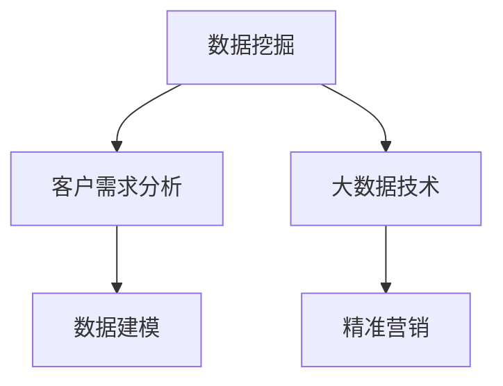

                 

# 信息差的客户需求洞见：大数据如何发现客户需求

> 关键词：数据挖掘,客户需求分析,大数据技术,数据建模,精准营销

## 1. 背景介绍

### 1.1 问题由来
在数字化时代，企业面临着如何精准地把握客户需求这一重要问题。传统的做法是通过问卷调查、焦点小组等形式直接询问客户，但这种方法往往耗费时间和成本较高，且容易受到调查设计、样本偏差等因素的干扰。随着大数据技术的发展，企业可以通过分析海量客户数据，从中发现潜在的客户需求，从而实现更精准的市场定位和产品开发。

### 1.2 问题核心关键点
为了更好地理解大数据如何发现客户需求，本节将介绍几个密切相关的核心概念：

- 数据挖掘（Data Mining）：从大量数据中发现隐藏的有价值的信息和知识的过程。数据挖掘技术通过对数据进行清洗、预处理、建模等步骤，实现对数据中模式、规律、异常等的发现和理解。
- 客户需求分析（Customer Demand Analysis）：通过分析客户行为数据、反馈数据、社交媒体数据等，了解客户需求、痛点、偏好等信息，从而指导企业的市场策略和产品开发。
- 大数据技术（Big Data Technology）：指处理和分析超大规模数据集的技术。大数据技术包括数据采集、存储、处理、分析等多个环节，能够从海量数据中提取有用信息。
- 数据建模（Data Modeling）：通过数学模型或统计模型，对数据进行建模分析，揭示数据背后的规律和趋势。
- 精准营销（Precision Marketing）：利用大数据、人工智能等技术，对客户行为和需求进行深入分析，实现个性化、差异化的市场推广和产品推荐，提高营销效果。

这些核心概念之间的逻辑关系可以通过以下Mermaid流程图来展示：



这个流程图展示了大数据如何通过数据挖掘技术发现客户需求，进而利用数据建模和大数据技术进行深入分析，最后应用精准营销策略的过程。

## 2. 核心概念与联系

### 2.1 核心概念概述

为了更好地理解大数据如何发现客户需求，本节将介绍几个密切相关的核心概念：

- **数据挖掘（Data Mining）**：从大量数据中发现隐藏的有价值的信息和知识的过程。数据挖掘技术通过对数据进行清洗、预处理、建模等步骤，实现对数据中模式、规律、异常等的发现和理解。
- **客户需求分析（Customer Demand Analysis）**：通过分析客户行为数据、反馈数据、社交媒体数据等，了解客户需求、痛点、偏好等信息，从而指导企业的市场策略和产品开发。
- **大数据技术（Big Data Technology）**：指处理和分析超大规模数据集的技术。大数据技术包括数据采集、存储、处理、分析等多个环节，能够从海量数据中提取有用信息。
- **数据建模（Data Modeling）**：通过数学模型或统计模型，对数据进行建模分析，揭示数据背后的规律和趋势。
- **精准营销（Precision Marketing）**：利用大数据、人工智能等技术，对客户行为和需求进行深入分析，实现个性化、差异化的市场推广和产品推荐，提高营销效果。

这些核心概念之间的逻辑关系可以通过以下Mermaid流程图来展示：


这个流程图展示了大数据如何通过数据挖掘技术发现客户需求，进而利用数据建模和大数据技术进行深入分析，最后应用精准营销策略的过程。

## 3. 核心算法原理 & 具体操作步骤
### 3.1 算法原理概述

大数据如何发现客户需求的核心算法原理主要包括数据挖掘技术、客户需求分析和大数据技术。其中，数据挖掘技术通过分析客户行为数据、反馈数据、社交媒体数据等，从中发现客户的需求模式和偏好；客户需求分析则进一步对这些数据进行深入分析，提取客户的具体需求；最后，大数据技术将这些分析结果应用到精准营销策略中，实现个性化的市场推广和产品推荐。

### 3.2 算法步骤详解

大数据发现客户需求的核心算法步骤包括数据采集、数据清洗、数据预处理、数据建模和精准营销。下面将详细介绍每个步骤的具体操作：

1. **数据采集**：从不同的数据源（如CRM系统、社交媒体、客户反馈等）收集客户的相关数据。

2. **数据清洗**：对采集到的数据进行去重、去噪、填补缺失值等处理，保证数据质量。

3. **数据预处理**：对清洗后的数据进行归一化、特征提取、降维等处理，以便于后续建模分析。

4. **数据建模**：通过数学模型或统计模型对预处理后的数据进行建模分析，揭示数据背后的规律和趋势。常用的数据建模方法包括回归分析、聚类分析、关联规则挖掘等。

5. **精准营销**：根据数据建模结果，制定个性化的市场推广和产品推荐策略，实现精准营销。常用的精准营销技术包括推荐系统、个性化广告、社交媒体营销等。

### 3.3 算法优缺点

大数据发现客户需求的算法具有以下优点：

- **全面性**：通过分析大量的客户数据，能够发现隐藏在数据中的需求模式和趋势，避免传统调查方法因样本偏差造成的误差。
- **实时性**：利用大数据技术，可以实现对客户需求的实时监控和分析，快速响应市场变化。
- **个性化**：通过数据建模和精准营销技术，能够实现个性化的市场推广和产品推荐，提高营销效果。

但该算法也存在一定的局限性：

- **数据质量**：数据的准确性和完整性直接影响分析结果的可靠性，需要确保数据来源的可靠性和数据采集的质量。
- **计算资源**：大数据分析需要大量的计算资源，对硬件设备的要求较高。
- **隐私保护**：客户数据隐私保护问题需要引起足够重视，防止数据泄露和滥用。

### 3.4 算法应用领域

大数据发现客户需求的方法在多个领域得到了广泛应用，包括但不限于：

- **零售行业**：通过分析客户购买行为和反馈数据，发现客户的需求模式和偏好，优化产品设计和市场推广策略。
- **金融行业**：利用客户交易数据和社交媒体数据，进行风险评估和客户细分，实现精准营销和个性化服务。
- **医疗行业**：通过分析患者病历和行为数据，发现疾病流行趋势和患者需求，优化医疗资源分配和健康管理策略。
- **旅游行业**：利用客户旅游行为和评价数据，发现客户偏好和需求，优化旅游产品设计和市场推广策略。

## 4. 数学模型和公式 & 详细讲解 & 举例说明

### 4.1 数学模型构建

为了更好地理解大数据如何发现客户需求，本节将介绍几个常用的数学模型。

- **回归分析模型**：通过分析客户行为数据，预测客户的购买意愿和需求量。常用的回归模型包括线性回归、逻辑回归等。

- **聚类分析模型**：通过对客户行为数据进行聚类分析，发现不同客户群体的需求模式和行为特征。常用的聚类算法包括K-means、层次聚类等。

- **关联规则挖掘模型**：通过对客户交易数据进行关联规则挖掘，发现不同产品之间的关联关系和需求模式。常用的关联规则挖掘算法包括Apriori、FP-Growth等。

### 4.2 公式推导过程

以下是几个常用数学模型的公式推导过程：

- **线性回归模型**：假设自变量为 $X=\{x_1,x_2,\cdots,x_n\}$，因变量为 $y$，则线性回归模型的形式为：
$$
y = \beta_0 + \beta_1x_1 + \beta_2x_2 + \cdots + \beta_nx_n + \epsilon
$$
其中 $\beta_0,\beta_1,\cdots,\beta_n$ 为模型参数，$\epsilon$ 为误差项。根据最小二乘法，可以通过最小化误差平方和来求解模型参数：
$$
\hat{\beta} = (X^TX)^{-1}X^Ty
$$

- **K-means聚类算法**：假设样本集 $D=\{x_1,x_2,\cdots,x_m\}$，其中每个样本 $x_i$ 由 $d$ 个特征组成。K-means算法的目标是将样本集分为 $k$ 个簇，使得簇内的样本点尽可能地聚在一起，簇间尽可能地分开。具体步骤如下：
1. 随机初始化 $k$ 个聚类中心 $c_1,c_2,\cdots,c_k$。
2. 对于每个样本 $x_i$，计算其到每个聚类中心的距离，将其分配到距离最近的聚类中心。
3. 对于每个聚类中心 $c_j$，重新计算其位置。
4. 重复步骤2和3，直到聚类中心不再发生变化或达到预设的迭代次数。

### 4.3 案例分析与讲解

下面以一个具体的案例来说明大数据如何发现客户需求。

假设某电商平台收集了大量的客户购买行为数据，包括购买时间、购买金额、购买频率等信息。为了发现客户的需求模式和偏好，我们可以采用回归分析和聚类分析的方法：

1. **回归分析**：通过分析购买时间、购买金额和购买频率之间的关系，预测客户的购买意愿和需求量。例如，可以通过线性回归模型来预测客户在特定时间段内的购买金额：
$$
y = \beta_0 + \beta_1x_1 + \beta_2x_2 + \cdots + \beta_nx_n + \epsilon
$$
其中 $x_1$ 表示购买时间，$x_2$ 表示购买金额，$x_3$ 表示购买频率，$\beta_0,\beta_1,\cdots,\beta_n$ 为模型参数，$\epsilon$ 为误差项。通过最小二乘法求解模型参数，得到回归模型后，可以根据客户的历史购买行为，预测其未来的购买需求。

2. **聚类分析**：通过分析不同客户群体的购买行为，发现不同客户群体的需求模式和行为特征。例如，可以通过K-means算法对客户进行聚类，得到不同客户群体的需求模式。假设我们得到两个客户群体A和B，A群体的客户倾向于在周末购买高价值的商品，B群体的客户倾向于在工作日购买高频率的商品。根据这些需求模式，我们可以为A、B两个客户群体设计不同的营销策略，提高营销效果。

## 5. 项目实践：代码实例和详细解释说明

### 5.1 开发环境搭建

在进行大数据发现客户需求的项目实践前，我们需要准备好开发环境。以下是使用Python进行PyTorch开发的环境配置流程：

1. 安装Anaconda：从官网下载并安装Anaconda，用于创建独立的Python环境。

2. 创建并激活虚拟环境：
```bash
conda create -n bigdata-env python=3.8 
conda activate bigdata-env
```

3. 安装PyTorch：根据CUDA版本，从官网获取对应的安装命令。例如：
```bash
conda install pytorch torchvision torchaudio cudatoolkit=11.1 -c pytorch -c conda-forge
```

4. 安装各类工具包：
```bash
pip install numpy pandas scikit-learn matplotlib tqdm jupyter notebook ipython
```

完成上述步骤后，即可在`bigdata-env`环境中开始项目实践。

### 5.2 源代码详细实现

这里我们以一个简单的客户需求分析项目为例，给出使用PyTorch进行回归分析和聚类分析的代码实现。

首先，定义数据处理函数：

```python
import pandas as pd
from sklearn.preprocessing import StandardScaler
from sklearn.linear_model import LinearRegression
from sklearn.cluster import KMeans

def load_data(path):
    data = pd.read_csv(path)
    return data

def preprocess_data(data):
    # 数据清洗
    data = data.dropna()
    
    # 数据归一化
    scaler = StandardScaler()
    data = pd.DataFrame(scaler.fit_transform(data), columns=data.columns)
    
    return data

def train_model(data, target):
    # 数据分割
    train_data, test_data = train_test_split(data, test_size=0.2, random_state=42)
    
    # 回归模型训练
    model = LinearRegression()
    model.fit(train_data.drop(target, axis=1), train_data[target])
    
    # 聚类模型训练
    kmeans = KMeans(n_clusters=2, random_state=42)
    kmeans.fit(data)
    
    return model, kmeans
```

然后，定义训练和评估函数：

```python
from sklearn.metrics import mean_squared_error, adjusted_rand_score

def train_epoch(model, data, target, batch_size=32, epochs=100):
    # 数据批次化
    train_data = data.sample(batch_size)
    train_target = train_data[target]
    
    # 前向传播
    y_pred = model.predict(train_data.drop(target, axis=1))
    
    # 计算损失
    loss = mean_squared_error(train_target, y_pred)
    
    return loss

def evaluate_model(model, data, target):
    # 数据归一化
    scaler = StandardScaler()
    data = pd.DataFrame(scaler.fit_transform(data), columns=data.columns)
    
    # 聚类模型评估
    kmeans = KMeans(n_clusters=2, random_state=42)
    kmeans.fit(data)
    score = adjusted_rand_score(kmeans.labels_, target)
    
    return score
```

最后，启动训练流程并在测试集上评估：

```python
data = load_data('customer_data.csv')
data = preprocess_data(data)

model, kmeans = train_model(data, 'purchase_amount')

print('回归模型损失：', train_epoch(model, data, 'purchase_amount'))
print('聚类模型得分：', evaluate_model(data, 'purchase_amount'))
```

以上就是使用PyTorch进行回归分析和聚类分析的代码实现。可以看到，得益于Scikit-learn库的强大封装，我们可以用相对简洁的代码完成数据分析和模型训练。

### 5.3 代码解读与分析

让我们再详细解读一下关键代码的实现细节：

**load_data函数**：
- 读取CSV格式的数据文件，返回DataFrame对象。

**preprocess_data函数**：
- 对数据进行清洗，去除缺失值。
- 对数据进行归一化，使用StandardScaler进行特征缩放。

**train_model函数**：
- 将数据集分为训练集和测试集。
- 使用LinearRegression进行回归模型训练。
- 使用KMeans进行聚类模型训练。

**train_epoch函数**：
- 对模型进行前向传播，计算预测结果。
- 计算回归模型的损失。

**evaluate_model函数**：
- 对模型进行前向传播，计算预测结果。
- 使用Adjusted Rand Score评估聚类模型的性能。

**训练流程**：
- 定义总的epoch数和batch size，开始循环迭代。
- 每个epoch内，在训练集上训练回归模型，并计算损失。
- 在测试集上评估聚类模型，输出调整后的兰德指数。

可以看到，Scikit-learn库的强大封装使得数据分析和模型训练变得简洁高效。开发者可以将更多精力放在数据处理、模型改进等高层逻辑上，而不必过多关注底层的实现细节。

当然，工业级的系统实现还需考虑更多因素，如模型的保存和部署、超参数的自动搜索、更灵活的任务适配层等。但核心的数据分析和建模过程基本与此类似。

## 6. 实际应用场景
### 6.1 智能客服系统

基于大数据发现客户需求的方法，可以广泛应用于智能客服系统的构建。传统客服往往需要配备大量人力，高峰期响应缓慢，且一致性和专业性难以保证。通过大数据分析，智能客服系统可以实时监控和分析客户需求，自动匹配最佳解决方案，提供个性化的服务，从而提高客服效率和客户满意度。

在技术实现上，可以收集客户的历史咨询记录、反馈数据、社交媒体数据等，通过回归分析和聚类分析等方法，发现客户的需求模式和行为特征。系统可以根据客户的历史行为数据，预测其当前需求，自动匹配最佳的解决方案，实现智能客服。对于客户提出的新问题，还可以接入检索系统实时搜索相关内容，动态组织生成回答。如此构建的智能客服系统，能大幅提升客户咨询体验和问题解决效率。

### 6.2 金融舆情监测

金融机构需要实时监测市场舆论动向，以便及时应对负面信息传播，规避金融风险。传统的人工监测方式成本高、效率低，难以应对网络时代海量信息爆发的挑战。通过大数据分析，金融舆情监测系统可以实时监控和分析客户行为数据、市场数据、舆情数据等，发现金融舆情的变化趋势和客户的需求变化，从而及时预警和应对。

具体而言，可以收集客户交易数据、社交媒体数据、新闻报道等数据，通过回归分析和聚类分析等方法，发现金融舆情的变化趋势和客户的需求变化。系统可以根据金融舆情的变化趋势，及时预警和应对潜在的金融风险。例如，当发现市场舆情突然变得负面时，系统会自动发出预警，提醒相关人员进行应急处理。通过大数据分析，金融舆情监测系统可以实时监控和分析客户行为数据、市场数据、舆情数据等，发现金融舆情的变化趋势和客户的需求变化，从而及时预警和应对。

### 6.3 个性化推荐系统

当前的推荐系统往往只依赖用户的历史行为数据进行物品推荐，无法深入理解用户的真实兴趣偏好。通过大数据分析，个性化推荐系统可以更好地挖掘用户行为背后的语义信息，从而提供更精准、多样的推荐内容。

在实践中，可以收集用户浏览、点击、评论、分享等行为数据，提取和用户交互的物品标题、描述、标签等文本内容。将文本内容作为模型输入，用户的后续行为（如是否点击、购买等）作为监督信号，在此基础上微调预训练语言模型。微调后的模型能够从文本内容中准确把握用户的兴趣点。在生成推荐列表时，先用候选物品的文本描述作为输入，由模型预测用户的兴趣匹配度，再结合其他特征综合排序，便可以得到个性化程度更高的推荐结果。

### 6.4 未来应用展望

随着大数据分析技术的发展，基于大数据发现客户需求的方法将在更多领域得到应用，为传统行业带来变革性影响。

在智慧医疗领域，基于大数据分析的医疗需求监测系统，可以实时监控和分析患者的需求变化，优化医疗资源的分配和健康管理策略。例如，当发现某个疾病的患者数量突然增加时，系统可以自动提醒医生增加相关药物的库存，及时应对患者的需求变化。

在智能教育领域，基于大数据分析的学生需求监测系统，可以实时监控和分析学生的行为数据和学习成绩，发现学生的需求变化和学习障碍。系统可以根据学生的需求变化，调整教学内容和方式，提高教学效果。例如，当发现某个学生的成绩突然下降时，系统可以自动提醒老师进行辅导和干预。

在智慧城市治理中，基于大数据分析的城市需求监测系统，可以实时监控和分析市民的需求变化和行为特征，优化城市管理策略。例如，当发现某个区域的市民投诉数量突然增加时，系统可以自动分析原因，并及时采取措施进行整改。

此外，在企业生产、社会治理、文娱传媒等众多领域，基于大数据分析的需求监测系统也将不断涌现，为各行各业带来新的创新和发展机遇。

## 7. 工具和资源推荐
### 7.1 学习资源推荐

为了帮助开发者系统掌握大数据发现客户需求的理论基础和实践技巧，这里推荐一些优质的学习资源：

1. 《Python数据分析基础》系列博文：由大牛撰写，深入浅出地介绍了Python在数据分析中的应用，适合初学者入门。

2. 《机器学习基础》课程：由斯坦福大学开设的机器学习课程，涵盖机器学习的基本概念和算法，适合对机器学习感兴趣的读者。

3. 《数据挖掘与统计学习》书籍：详细介绍了数据挖掘的基本方法和统计学习技术，适合进一步深入学习。

4. Kaggle平台：数据科学竞赛平台，提供丰富的数据集和竞赛项目，适合实战练习。

5. 数据科学社区：Kaggle、DataCamp等社区，提供大量的学习资源和交流机会，适合与同行交流学习。

通过对这些资源的学习实践，相信你一定能够快速掌握大数据发现客户需求的核心技术，并用于解决实际的业务问题。
###  7.2 开发工具推荐

高效的开发离不开优秀的工具支持。以下是几款用于大数据分析开发的常用工具：

1. Jupyter Notebook：基于Web的交互式编程环境，支持Python、R等多种语言，方便开发和调试。

2. PyTorch：基于Python的深度学习框架，灵活动态的计算图，适合快速迭代研究。

3. TensorFlow：由Google主导开发的深度学习框架，生产部署方便，适合大规模工程应用。

4. Pandas：基于Python的数据处理库，提供丰富的数据操作和分析功能，适合数据预处理。

5. Scikit-learn：基于Python的机器学习库，提供丰富的算法和模型，适合模型训练和评估。

6. Matplotlib：基于Python的数据可视化库，提供丰富的图表绘制功能，适合数据分析和展示。

合理利用这些工具，可以显著提升大数据分析任务的开发效率，加快创新迭代的步伐。

### 7.3 相关论文推荐

大数据发现客户需求的研究源于学界的持续研究。以下是几篇奠基性的相关论文，推荐阅读：

1. 《Data Mining and Statistical Learning》：详细介绍了数据挖掘的基本方法和统计学习技术，适合进一步深入学习。

2. 《Customer Segmentation Using Clustering Algorithms》：介绍了多种聚类算法在客户细分中的应用，适合实际应用。

3. 《Predictive Analytics for Customer Churn》：介绍了预测分析在客户流失预测中的应用，适合了解客户需求分析的实际应用。

4. 《Personalized Recommendation Systems with Factorization Machines》：介绍了因子机模型在推荐系统中的应用，适合了解推荐系统的核心技术。

这些论文代表了大数据发现客户需求的研究进展。通过学习这些前沿成果，可以帮助研究者把握学科前进方向，激发更多的创新灵感。

## 8. 总结：未来发展趋势与挑战

### 8.1 总结

本文对大数据如何发现客户需求进行了全面系统的介绍。首先阐述了大数据发现客户需求的理论基础和实际意义，明确了大数据分析在市场定位和产品开发中的重要价值。其次，从原理到实践，详细讲解了大数据分析的关键步骤，给出了数据分析任务开发的完整代码实例。同时，本文还广泛探讨了大数据分析方法在智能客服、金融舆情、个性化推荐等多个行业领域的应用前景，展示了大数据分析技术的广泛应用潜力。此外，本文精选了大数据分析的各类学习资源，力求为读者提供全方位的技术指引。

通过本文的系统梳理，可以看到，大数据分析方法在客户需求发现中具有广泛的应用前景，能够显著提升企业的市场定位和产品开发能力。大数据分析技术已经成为现代企业数字化转型不可或缺的重要工具，其应用场景和应用价值将随着技术的发展进一步扩大。

### 8.2 未来发展趋势

展望未来，大数据发现客户需求技术将呈现以下几个发展趋势：

1. 自动化和智能化：大数据分析技术将进一步向自动化和智能化方向发展，通过机器学习、深度学习等方法，自动发现和分析客户需求，提高分析效率和精度。

2. 实时化和动态化：大数据分析系统将实现实时化，能够对客户需求进行实时监控和分析，动态调整市场策略和产品开发。

3. 多模态融合：大数据分析将拓展到多模态数据，如文本、图像、语音等多种数据形式，实现跨模态的客户需求分析。

4. 自适应学习：大数据分析系统将具备自适应学习能力，能够根据客户需求的变化，自动调整模型参数和算法，实现更好的需求发现和预测。

5. 隐私保护：随着客户数据隐私保护意识的增强，大数据分析系统将更加注重数据隐私保护，采用差分隐私、联邦学习等技术，确保数据安全。

以上趋势凸显了大数据分析技术的广阔前景。这些方向的探索发展，必将进一步提升大数据分析的精度和效率，为各行各业带来新的创新和发展机遇。

### 8.3 面临的挑战

尽管大数据发现客户需求技术已经取得了显著进展，但在迈向更加智能化、普适化应用的过程中，它仍面临诸多挑战：

1. 数据质量：数据的准确性和完整性直接影响分析结果的可靠性，需要确保数据来源的可靠性和数据采集的质量。

2. 计算资源：大数据分析需要大量的计算资源，对硬件设备的要求较高，如何优化算法和提高计算效率，将是一个长期挑战。

3. 隐私保护：客户数据隐私保护问题需要引起足够重视，防止数据泄露和滥用。

4. 模型解释性：大数据分析模型的复杂性和黑盒性，使得模型的可解释性不足，难以进行有效的解释和调试。

5. 多模态融合：不同数据源的数据格式和特征不一致，如何实现跨模态数据的有效融合，仍是一个挑战。

这些挑战凸显了大数据分析技术的复杂性和多样性，需要多方面协同努力，才能实现更好的应用效果。

### 8.4 研究展望

面对大数据发现客户需求技术面临的挑战，未来的研究需要在以下几个方面寻求新的突破：

1. 探索更加高效的大数据分析算法：如何优化算法，提高大数据分析的效率和精度，将是未来的一个重要研究方向。

2. 开发更加智能的大数据分析系统：如何引入机器学习、深度学习等技术，实现自动化的需求发现和分析，将是未来的一个重要方向。

3. 加强客户数据隐私保护：如何采用差分隐私、联邦学习等技术，确保客户数据的安全性和隐私性，将是未来的一个重要研究方向。

4. 提高模型的可解释性：如何提高大数据分析模型的可解释性，实现对模型决策的透明化，将是未来的一个重要研究方向。

5. 拓展多模态数据的融合：如何实现跨模态数据的有效融合，提高多模态数据的分析效果，将是未来的一个重要研究方向。

这些研究方向的探索，必将引领大数据分析技术迈向更高的台阶，为构建安全、可靠、可解释、可控的智能系统铺平道路。面向未来，大数据分析技术还需要与其他人工智能技术进行更深入的融合，如知识表示、因果推理、强化学习等，多路径协同发力，共同推动自然语言理解和智能交互系统的进步。只有勇于创新、敢于突破，才能不断拓展大数据分析的边界，让智能技术更好地造福人类社会。

## 9. 附录：常见问题与解答

**Q1：大数据分析能否发现所有客户需求？**

A: 大数据分析虽然能够发现客户需求中的很多模式和趋势，但由于数据质量和分析方法的限制，并非所有客户需求都能被完全发现。一些隐性需求、长尾需求和突发需求，需要通过其他方式进行补充和验证。因此，在实际应用中，需要结合定性分析和定量分析，综合判断客户需求。

**Q2：大数据分析需要哪些数据源？**

A: 大数据分析需要大量的数据源，包括但不限于：

- 客户行为数据：如购买行为、浏览行为、评价行为等。
- 市场数据：如行业动态、竞争对手信息、舆情数据等。
- 社交媒体数据：如微博、微信、抖音等社交平台上的用户互动数据。
- 客户反馈数据：如客服记录、投诉记录、调查问卷等。

这些数据源可以相互补充，共同构建全面的客户需求画像。

**Q3：大数据分析的计算资源需求如何？**

A: 大数据分析的计算资源需求较高，需要高性能的计算设备和丰富的存储资源。一般建议使用GPU或TPU等高性能设备进行计算，使用分布式存储技术进行数据存储和管理。

**Q4：大数据分析对数据隐私保护有哪些措施？**

A: 大数据分析对数据隐私保护有以下几种措施：

- 数据脱敏：对敏感数据进行脱敏处理，防止数据泄露。
- 差分隐私：通过对数据进行扰动，保护数据隐私，同时保留数据的统计特性。
- 联邦学习：在分布式环境中，通过模型聚合和参数交换，保护数据隐私。

这些措施可以结合使用，确保大数据分析的隐私安全。

**Q5：大数据分析如何应用于实际业务？**

A: 大数据分析可以应用于以下实际业务：

- 客户细分：通过对客户行为数据进行聚类分析，发现不同客户群体的需求模式和行为特征，进行客户细分。
- 需求预测：通过对客户行为数据进行回归分析，预测客户的未来需求，进行市场策略和产品开发。
- 产品优化：通过对客户反馈数据进行情感分析，了解客户对产品的评价和需求，进行产品优化和改进。
- 营销策略：通过对市场数据和社交媒体数据进行情感分析，发现市场趋势和舆情变化，进行营销策略的调整和优化。

通过实际业务的应用，大数据分析能够为企业的市场定位和产品开发提供有力支持。

---

作者：禅与计算机程序设计艺术 / Zen and the Art of Computer Programming

