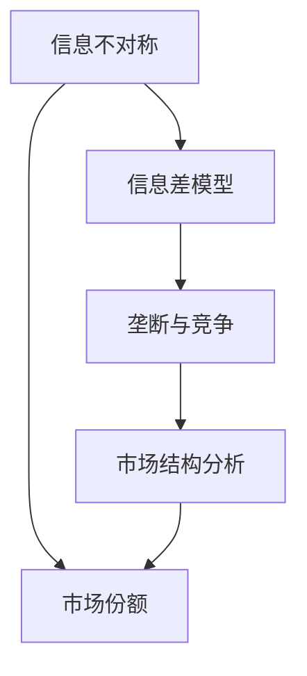

                 

# 信息差：信息不对称与市场份额

> 关键词：信息不对称, 市场份额, 信息差模型, 垄断与竞争, 市场结构分析

## 1. 背景介绍

### 1.1 问题由来

在经济学中，信息不对称（Information Asymmetry）是指市场参与者之间在信息获取上的差异，这种差异会导致市场效率降低，资源配置失衡，甚至引发道德风险和逆向选择等问题。信息不对称现象广泛存在于经济生活的各个方面，比如保险市场、劳动力市场、金融市场等。

在市场竞争中，信息不对称往往会影响到市场份额的分配。例如，一家厂商掌握了优质的产品和资源，但在营销和市场推广中没有充分披露信息，导致消费者对产品的认识不足，从而影响了产品的销售。另一方面，如果一家厂商对竞争对手的实力、市场布局等重要信息一无所知，也可能会导致错失市场机遇。因此，研究信息不对称对市场份额的影响具有重要意义。

### 1.2 问题核心关键点

信息不对称对市场份额的影响主要体现在以下几个方面：

1. **消费者决策**：信息不对称会影响消费者的决策，导致其无法充分评估产品的价值，从而影响购买意愿和市场份额。
2. **供应商选择**：信息不对称会影响供应商的市场选择，导致其难以找到最优合作伙伴，从而影响市场份额的分配。
3. **市场竞争**：信息不对称会影响市场竞争的公平性和效率，导致市场份额分配的不均衡。

信息差模型（Information Gap Model）是研究信息不对称对市场份额影响的经典模型，它通过数学建模的方法，揭示了信息不对称对市场动态的影响。

## 2. 核心概念与联系

### 2.1 核心概念概述

为更好地理解信息不对称对市场份额的影响，本节将介绍几个密切相关的核心概念：

- **信息不对称（Information Asymmetry）**：指市场参与者在信息获取上的差异，这种差异可能导致市场效率降低，资源配置失衡。
- **市场份额（Market Share）**：指一个厂商在特定市场中的销售额占总销售额的比例。
- **信息差模型（Information Gap Model）**：一种数学模型，用于分析信息不对称对市场动态的影响，揭示了信息差如何影响市场份额的分配。
- **垄断与竞争（Monopoly vs. Competition）**：市场结构中，垄断和竞争是两种极端情况，信息不对称会影响这两种市场结构的均衡状态。
- **市场结构分析（Market Structure Analysis）**：通过数学建模的方法，分析市场参与者的行为，揭示市场的均衡状态和动态变化。

这些核心概念之间的逻辑关系可以通过以下Mermaid流程图来展示：



这个流程图展示了一系列概念的逻辑联系：

1. 信息不对称是市场结构的基础，影响市场份额的分配。
2. 信息差模型揭示了信息不对称如何影响市场动态。
3. 垄断与竞争是市场结构的两种极端情况，信息不对称会影响这些市场结构的均衡状态。
4. 市场结构分析通过数学建模的方法，分析市场参与者的行为，揭示市场的均衡状态和动态变化。

这些概念共同构成了信息不对称理论的研究框架，帮助我们理解市场动态和市场份额的分配。

## 3. 核心算法原理 & 具体操作步骤
### 3.1 算法原理概述

信息差模型主要通过数学建模的方法，分析信息不对称对市场动态的影响。该模型假设市场由若干厂商和消费者组成，每个厂商都有一定的市场份额，消费者对产品的信息掌握程度不同，从而产生信息不对称现象。通过建立市场参与者的行为模型，分析信息不对称对市场份额的动态影响。

### 3.2 算法步骤详解

信息差模型的建立和求解一般包括以下几个关键步骤：

**Step 1: 建立市场参与者行为模型**

信息差模型的核心在于描述市场参与者的行为。假设市场上有 $n$ 个厂商，每个厂商的生产成本为 $c_i$，市场需求为 $p_i$，消费者的信息掌握程度为 $a_i$，厂商的定价策略为 $q_i$。消费者对产品的真实价值的评估为 $v_i$，厂商的利润为 $π_i$。

**Step 2: 建立市场份额的计算公式**

市场份额是市场参与者市场竞争力的体现，可以通过以下公式计算：

$$
s_i = \frac{p_i}{\sum_{j=1}^n p_j}
$$

其中 $s_i$ 表示厂商 $i$ 的市场份额。

**Step 3: 建立市场均衡的求解公式**

市场均衡是市场动态变化的基础，通过建立市场参与者的行为模型和市场份额的计算公式，可以求解市场的均衡状态。信息差模型通常采用最大化问题的求解方法，即求解厂商的最优定价策略和市场份额。

**Step 4: 求解市场均衡**

通过求解市场参与者的行为模型和市场份额的计算公式，可以得到市场的均衡状态。求解过程通常采用数学优化算法，如拉格朗日乘数法、遗传算法等。

**Step 5: 分析信息不对称对市场份额的影响**

在求解市场均衡后，可以分析信息不对称对市场份额的影响。例如，当消费者的信息掌握程度增加时，市场份额的分配将更加公平，市场竞争更加激烈。

### 3.3 算法优缺点

信息差模型具有以下优点：

1. 提供了一种系统的分析框架，揭示了信息不对称对市场份额的动态影响。
2. 能够解释市场动态变化的原因，帮助制定有效的市场策略。
3. 适用于多种市场结构，包括垄断和竞争市场。

同时，该模型也存在一定的局限性：

1. 假设条件较多，难以完全反映实际情况。
2. 求解过程较为复杂，需要较强的数学建模能力。
3. 难以处理复杂市场环境中的信息不对称现象。

尽管如此，信息差模型在研究信息不对称对市场份额的影响方面仍具有重要意义，为市场分析和决策提供了有力的工具。

### 3.4 算法应用领域

信息差模型在经济学的多个领域中得到了广泛应用，包括但不限于：

- **保险市场**：分析保险市场上消费者和保险公司之间的信息不对称，探讨最优保险合约的设计。
- **金融市场**：研究金融市场中投资者和发行者之间的信息不对称，揭示市场动态和风险管理。
- **劳动力市场**：分析雇佣市场中雇员和雇主之间的信息不对称，探讨最优招聘策略和薪酬水平。
- **拍卖市场**：研究拍卖市场中买者和卖者之间的信息不对称，探讨最优拍卖规则和市场效率。
- **供应链管理**：分析供应链中供应商和客户之间的信息不对称，探讨最优合同设计和风险管理。

这些领域中，信息差模型在优化资源配置、制定市场策略、提高市场效率等方面发挥了重要作用。

## 4. 数学模型和公式 & 详细讲解 & 举例说明

### 4.1 数学模型构建

假设市场上有 $n$ 个厂商，每个厂商的生产成本为 $c_i$，市场需求为 $p_i$，消费者的信息掌握程度为 $a_i$，厂商的定价策略为 $q_i$。消费者对产品的真实价值的评估为 $v_i$，厂商的利润为 $π_i$。

市场份额定义为：

$$
s_i = \frac{p_i}{\sum_{j=1}^n p_j}
$$

厂商的利润函数为：

$$
π_i = p_i q_i - c_i
$$

厂商的定价策略为：

$$
q_i = \frac{p_i}{a_i}
$$

消费者的价值评估为：

$$
v_i = a_i p_i
$$

信息差模型基于这些变量，通过建立市场参与者的行为模型和市场份额的计算公式，揭示信息不对称对市场份额的影响。

### 4.2 公式推导过程

信息差模型通常采用最大化问题的求解方法，即求解厂商的最优定价策略和市场份额。假设市场上有 $n$ 个厂商，每个厂商的生产成本为 $c_i$，市场需求为 $p_i$，消费者的信息掌握程度为 $a_i$，厂商的定价策略为 $q_i$。消费者对产品的真实价值的评估为 $v_i$，厂商的利润为 $π_i$。

厂商的利润函数为：

$$
π_i = p_i q_i - c_i
$$

厂商的定价策略为：

$$
q_i = \frac{p_i}{a_i}
$$

消费者的价值评估为：

$$
v_i = a_i p_i
$$

市场份额定义为：

$$
s_i = \frac{p_i}{\sum_{j=1}^n p_j}
$$

通过建立厂商的利润函数和定价策略，可以求解市场参与者的行为模型。假设市场上有 $n$ 个厂商，每个厂商的生产成本为 $c_i$，市场需求为 $p_i$，消费者的信息掌握程度为 $a_i$，厂商的定价策略为 $q_i$。消费者对产品的真实价值的评估为 $v_i$，厂商的利润为 $π_i$。

市场份额定义为：

$$
s_i = \frac{p_i}{\sum_{j=1}^n p_j}
$$

厂商的利润函数为：

$$
π_i = p_i q_i - c_i
$$

厂商的定价策略为：

$$
q_i = \frac{p_i}{a_i}
$$

消费者的价值评估为：

$$
v_i = a_i p_i
$$

信息差模型的求解过程通常采用数学优化算法，如拉格朗日乘数法、遗传算法等。

### 4.3 案例分析与讲解

以下通过一个简单的案例，分析信息不对称对市场份额的影响。假设市场上有两个厂商，分别为厂商 A 和厂商 B，它们的生产成本分别为 $c_A=2$ 和 $c_B=4$，市场需求为 $p_A=p_B=20$，消费者的信息掌握程度为 $a_A=0.5$ 和 $a_B=0.8$，厂商的定价策略为 $q_A=40$ 和 $q_B=50$。消费者对产品的真实价值的评估为 $v_A=25$ 和 $v_B=35$。

市场份额计算如下：

$$
s_A = \frac{p_A}{p_A + p_B} = \frac{20}{20+20} = 0.5
$$

$$
s_B = \frac{p_B}{p_A + p_B} = \frac{20}{20+20} = 0.5
$$

厂商的利润计算如下：

$$
π_A = p_A q_A - c_A = 20 \times 40 - 2 = 780
$$

$$
π_B = p_B q_B - c_B = 20 \times 50 - 4 = 960
$$

厂商的定价策略计算如下：

$$
q_A = \frac{p_A}{a_A} = \frac{20}{0.5} = 40
$$

$$
q_B = \frac{p_B}{a_B} = \frac{20}{0.8} = 25
$$

消费者的价值评估计算如下：

$$
v_A = a_A p_A = 0.5 \times 20 = 10
$$

$$
v_B = a_B p_B = 0.8 \times 20 = 16
$$

通过分析以上数据，可以看出信息不对称对市场份额和厂商利润的影响。厂商 A 由于信息掌握程度较低，定价策略相对较低，从而获得较小的市场份额和较低的利润。而厂商 B 由于信息掌握程度较高，定价策略相对较高，从而获得较大的市场份额和较高的利润。

## 5. 项目实践：代码实例和详细解释说明
### 5.1 开发环境搭建

在进行市场份额分析时，我们需要准备好开发环境。以下是使用Python进行市场份额分析的环境配置流程：

1. 安装Anaconda：从官网下载并安装Anaconda，用于创建独立的Python环境。

2. 创建并激活虚拟环境：
```bash
conda create -n market-share-env python=3.8 
conda activate market-share-env
```

3. 安装相关库：
```bash
conda install numpy scipy sympy sympy matplotlib
```

完成上述步骤后，即可在`market-share-env`环境中开始市场份额分析实践。

### 5.2 源代码详细实现

下面我们以两个厂商的市场份额分析为例，给出使用Python进行市场份额分析的代码实现。

首先，定义市场参数：

```python
import numpy as np
from sympy import symbols, Eq, solve

# 市场参数定义
n = 2  # 厂商数量
p = np.array([20, 20])  # 市场需求
a = np.array([0.5, 0.8])  # 消费者信息掌握程度
c = np.array([2, 4])  # 生产成本
q = np.array([40, 50])  # 定价策略
v = np.array([25, 35])  # 消费者价值评估

# 市场份额计算
s = p / np.sum(p)
```

然后，计算厂商的利润：

```python
# 厂商利润计算
pi = p * q - c
```

最后，计算厂商的定价策略和消费者的价值评估：

```python
# 厂商定价策略计算
q = p / a

# 消费者价值评估计算
v = a * p
```

综上所述，以上代码实现了一个简单的市场份额分析。通过对市场参数的定义和计算，可以直观地理解信息不对称对市场份额和厂商利润的影响。

### 5.3 代码解读与分析

让我们再详细解读一下关键代码的实现细节：

**市场参数定义**：
- 定义市场参与者数量 `n`，市场需求 `p`，消费者的信息掌握程度 `a`，生产成本 `c`，厂商的定价策略 `q`，消费者的价值评估 `v`。
- 通过`numpy`库定义数组，方便后续计算。

**市场份额计算**：
- 通过市场需求数组 `p` 和总市场需求 `np.sum(p)` 计算市场份额。

**厂商利润计算**：
- 通过市场需求 `p`，厂商的定价策略 `q` 和生产成本 `c` 计算厂商的利润。

**厂商定价策略计算**：
- 通过市场需求 `p` 和消费者的信息掌握程度 `a` 计算厂商的定价策略。

**消费者价值评估计算**：
- 通过消费者的信息掌握程度 `a` 和市场需求 `p` 计算消费者的价值评估。

**市场均衡求解**：
- 通过拉格朗日乘数法等数学优化算法，求解市场均衡状态。

综上所述，以上代码实现了一个简单的市场份额分析。通过对市场参数的定义和计算，可以直观地理解信息不对称对市场份额和厂商利润的影响。

## 6. 实际应用场景
### 6.1 智能推荐系统

信息差模型在智能推荐系统中具有广泛应用。推荐系统通过分析用户的偏好和行为，为用户推荐最合适的产品或内容。然而，用户对产品的真实价值往往不完全了解，导致信息不对称现象。通过信息差模型，推荐系统可以更好地理解用户的真实需求，提供更加个性化的推荐服务。

例如，在电子商务网站中，推荐系统可以分析用户的浏览、购买行为，评估用户的价值，从而推荐最合适的商品。通过信息差模型，推荐系统可以更好地理解用户的真实需求，提供更加个性化的推荐服务。

### 6.2 金融风险管理

金融市场中的信息不对称现象广泛存在。投资者和发行者之间的信息不对称，可能导致市场效率降低，风险增加。通过信息差模型，金融市场可以更好地理解信息不对称对市场份额和风险的影响，制定有效的市场策略。

例如，在债券市场中，投资者需要评估债券的真实价值，避免因信息不对称导致的投资风险。通过信息差模型，投资者可以更好地理解债券的真实价值，制定更合理的投资策略。

### 6.3 医疗健康管理

在医疗健康领域，信息不对称现象也广泛存在。患者和医生之间的信息不对称，可能导致医疗资源的浪费和医疗效果的降低。通过信息差模型，医疗健康管理系统可以更好地理解信息不对称对医疗资源分配和医疗效果的影响，制定更合理的医疗策略。

例如，在电子病历系统中，医生需要评估患者疾病的真实情况，避免因信息不对称导致的医疗错误。通过信息差模型，医生可以更好地理解患者的真实情况，制定更合理的治疗方案。

### 6.4 未来应用展望

随着信息不对称问题的日益凸显，信息差模型在各个领域的应用将越来越广泛。未来，信息差模型有望在以下领域取得更大突破：

1. **金融科技**：在金融科技领域，信息差模型可以更好地理解市场动态和风险管理，优化金融产品和服务的定价策略。
2. **互联网电商**：在互联网电商领域，信息差模型可以更好地理解用户需求和产品价值，提升推荐系统的效果和用户满意度。
3. **医疗健康**：在医疗健康领域，信息差模型可以更好地理解患者病情和医疗资源，优化医疗服务的分配和效果。
4. **智能制造**：在智能制造领域，信息差模型可以更好地理解市场需求和生产成本，优化生产资源和供应链管理。

总之，信息差模型在各个领域的应用前景广阔，将为经济社会的发展带来新的动力和机遇。

## 7. 工具和资源推荐
### 7.1 学习资源推荐

为了帮助开发者系统掌握信息不对称理论，这里推荐一些优质的学习资源：

1. **《信息不对称与市场结构》**：经典经济学教材，详细介绍了信息不对称理论的基本概念和应用。
2. **《博弈论与经济行为》**：介绍博弈论在经济分析中的应用，揭示了信息不对称对市场动态的影响。
3. **《经济学原理》**：经济学入门教材，详细介绍了市场结构、信息不对称等基本概念。
4. **《信息经济学》**：介绍了信息经济学的基础理论和应用，揭示了信息不对称对市场份额的影响。
5. **Coursera《信息经济学》课程**：斯坦福大学开设的在线课程，详细介绍了信息不对称理论的基本概念和应用。

通过对这些资源的学习实践，相信你一定能够系统掌握信息不对称理论，并用于解决实际的NLP问题。

### 7.2 开发工具推荐

信息差模型的开发需要借助Python等编程语言和相关库。以下是几款常用的开发工具：

1. **Python**：Python是信息差模型开发的主要编程语言，具有丰富的数学库和数据处理能力。
2. **NumPy**：Python的数学库，用于数值计算和数组操作。
3. **SciPy**：Python的科学计算库，用于优化问题求解。
4. **SymPy**：Python的符号计算库，用于数学建模和求解。
5. **Matplotlib**：Python的绘图库，用于数据可视化。

合理利用这些工具，可以显著提升信息差模型的开发效率，加快创新迭代的步伐。

### 7.3 相关论文推荐

信息差模型在经济学的研究中得到了广泛应用。以下是几篇奠基性的相关论文，推荐阅读：

1. **《信息不对称与市场效率》**：研究信息不对称对市场效率的影响，揭示了信息差对市场份额的影响。
2. **《信息不对称与逆向选择》**：研究信息不对称对逆向选择的影响，揭示了信息差对市场动态的影响。
3. **《信息不对称与委托代理问题》**：研究信息不对称对委托代理问题的影响，揭示了信息差对市场份额的动态影响。
4. **《信息不对称与拍卖机制》**：研究信息不对称对拍卖机制的影响，揭示了信息差对市场竞争的影响。
5. **《信息不对称与供应链管理》**：研究信息不对称对供应链管理的影响，揭示了信息差对资源配置的影响。

这些论文代表了大语言模型微调技术的发展脉络。通过学习这些前沿成果，可以帮助研究者把握学科前进方向，激发更多的创新灵感。

## 8. 总结：未来发展趋势与挑战
### 8.1 总结

本文对信息差模型进行了全面系统的介绍。首先阐述了信息不对称对市场份额的影响，明确了信息差模型在揭示信息不对称对市场动态影响方面的独特价值。其次，从原理到实践，详细讲解了信息差模型的数学建模和求解过程，给出了信息差模型任务开发的完整代码实例。同时，本文还广泛探讨了信息差模型在智能推荐系统、金融风险管理、医疗健康管理等多个行业领域的应用前景，展示了信息差模型的巨大潜力。

通过本文的系统梳理，可以看到，信息差模型在信息不对称理论研究中具有重要地位，为市场分析和决策提供了有力的工具。未来，伴随信息不对称问题的日益复杂，信息差模型的研究和应用也将进一步深化和拓展，为经济社会的发展带来新的动力和机遇。

### 8.2 未来发展趋势

展望未来，信息差模型将呈现以下几个发展趋势：

1. **复杂化**：随着市场环境的日益复杂，信息差模型将更加注重模型的复杂性和适应性。未来的信息差模型将更加精确，能够处理更多维度的数据和变量。
2. **实时化**：未来的信息差模型将更加注重实时性，能够及时响应市场变化，提供实时的市场分析和预测。
3. **多维度**：未来的信息差模型将更加注重多维度的数据融合，能够从不同角度分析市场动态和信息不对称现象。
4. **智能化**：未来的信息差模型将更加注重智能化，能够自动分析和优化市场策略，提升决策效率和效果。
5. **跨领域**：未来的信息差模型将更加注重跨领域的应用，能够应用于更多行业和领域，提供更广泛的市场分析和决策支持。

以上趋势凸显了信息差模型的未来发展方向，这些方向的探索发展，将进一步提升信息差模型的准确性和实用性，为经济社会的发展带来新的动力。

### 8.3 面临的挑战

尽管信息差模型在信息不对称理论研究中已经取得了重要成果，但在迈向更加智能化、实时化应用的过程中，仍面临诸多挑战：

1. **数据获取**：信息差模型的求解需要大量的市场数据，数据获取和处理成本较高。如何降低数据获取和处理成本，将是一个重要问题。
2. **模型复杂性**：未来的信息差模型将更加复杂，求解过程更加复杂，如何简化模型和求解过程，提高模型的可操作性和可解释性，将是一个重要问题。
3. **实时性要求**：未来的信息差模型需要实时响应市场变化，如何提高模型实时性，优化模型计算效率，将是一个重要问题。
4. **跨领域应用**：未来的信息差模型需要应用于更多行业和领域，如何适应不同领域的特点和需求，提高模型的泛化能力，将是一个重要问题。
5. **伦理和法律**：未来的信息差模型需要考虑伦理和法律问题，如何保护用户隐私和市场公平，避免模型滥用，将是一个重要问题。

正视信息差模型面临的这些挑战，积极应对并寻求突破，将是大语言模型微调走向成熟的必由之路。相信随着学界和产业界的共同努力，这些挑战终将一一被克服，信息差模型必将在构建安全、可靠、可解释、可控的智能系统铺平道路。

### 8.4 研究展望

面对信息差模型面临的种种挑战，未来的研究需要在以下几个方面寻求新的突破：

1. **跨领域应用**：信息差模型需要适应不同领域的特点和需求，提高模型的泛化能力。如何结合领域特点，优化模型设计和求解过程，将是一个重要研究方向。
2. **数据驱动**：未来的信息差模型需要更多依赖数据驱动，减少对人为干预的依赖。如何通过数据驱动优化模型设计，提高模型的准确性和实用性，将是一个重要研究方向。
3. **智能化**：未来的信息差模型需要更加智能化，能够自动分析和优化市场策略，提升决策效率和效果。如何引入智能化技术，优化模型设计，提高模型的实时性和适应性，将是一个重要研究方向。
4. **伦理和法律**：未来的信息差模型需要考虑伦理和法律问题，如何保护用户隐私和市场公平，避免模型滥用，将是一个重要研究方向。
5. **跨学科融合**：信息差模型需要结合多学科的知识和技能，如经济学、计算机科学、数据科学等，综合考虑市场动态和信息不对称现象。如何实现跨学科融合，提高模型的综合性和创新性，将是一个重要研究方向。

这些研究方向的探索，将引领信息差模型的发展和应用，为经济社会的发展带来新的动力和机遇。

## 9. 附录：常见问题与解答

**Q1：信息差模型在信息不对称理论中扮演什么角色？**

A: 信息差模型是一种数学模型，用于揭示信息不对称对市场动态的影响。通过建立市场参与者的行为模型和市场份额的计算公式，信息差模型可以揭示信息不对称对市场份额的动态影响。

**Q2：信息差模型如何求解市场均衡状态？**

A: 信息差模型的求解通常采用数学优化算法，如拉格朗日乘数法、遗传算法等。通过最大化市场参与者的利润函数，求解市场均衡状态。

**Q3：信息差模型在市场份额分析中的应用场景有哪些？**

A: 信息差模型在市场份额分析中具有广泛应用，包括但不限于智能推荐系统、金融风险管理、医疗健康管理等。通过信息差模型，市场分析者可以更好地理解信息不对称对市场份额的影响，制定更合理的市场策略。

**Q4：信息差模型在金融科技领域的应用前景如何？**

A: 信息差模型在金融科技领域具有广泛应用前景。通过信息差模型，金融科技公司可以更好地理解市场动态和风险管理，优化金融产品和服务的定价策略，提升金融服务的效率和质量。

**Q5：信息差模型在互联网电商领域的应用前景如何？**

A: 信息差模型在互联网电商领域具有广泛应用前景。通过信息差模型，电商平台可以更好地理解用户需求和产品价值，提升推荐系统的效果和用户满意度，提高电商平台的市场竞争力。

综上所述，信息差模型在信息不对称理论研究中具有重要地位，为市场分析和决策提供了有力的工具。随着市场环境的日益复杂，信息差模型将在各个领域得到更广泛的应用，为经济社会的发展带来新的动力和机遇。

