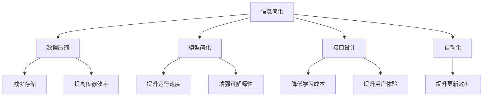

                 

# 信息简化的原则与实践：在混乱和复杂中建立秩序与简化

## 1. 背景介绍

### 1.1 问题由来
在当今信息爆炸的时代，海量的数据和复杂的系统设计使得信息管理和处理变得异常困难。无论是软件开发、数据科学还是日常工作中，信息的过多或过杂往往会导致效率低下、错误率高和用户满意度低。为了应对这一挑战，信息简化技术逐渐受到重视。

### 1.2 问题核心关键点
信息简化技术旨在通过减少复杂性、提高可理解性和减少信息过载，来改善信息的传递和使用。其主要关注点包括：
- 简化模型与架构设计，减少冗余和复杂性。
- 优化数据和信息处理流程，提升效率。
- 构建清晰、易理解的信息表示，便于用户交互。
- 自动化信息生成与更新，保持信息的时效性。

这些核心关键点共同构成了信息简化技术的研究与实践基础。

### 1.3 问题研究意义
信息简化技术的提升不仅能够显著提升信息处理和管理的效率，还能够促进知识的传播与创新。具体来说，信息简化技术在以下几个方面具有重要意义：
1. **提高工作效率**：通过简化复杂系统和流程，可以大幅降低人力和时间的投入，提高工作效率。
2. **减少错误率**：简化信息传递和处理，降低误操作和误解的可能性，提高决策质量。
3. **提升用户体验**：简化信息呈现和交互界面，使用户更容易理解和操作，提升用户体验。
4. **促进知识共享**：通过标准化和简化信息表示，便于知识的传播和复用，推动知识共享和技术创新。

## 2. 核心概念与联系

### 2.1 核心概念概述

为了更好地理解信息简化技术，本节将介绍几个核心概念：

- **信息简化**：通过减少冗余、复杂性和不必要的细节，提升信息的可理解性和可用性。
- **数据压缩**：通过算法和策略减少数据存储空间和传输带宽，提高信息处理效率。
- **模型简化**：通过精简模型结构、参数和计算过程，提升模型的运行速度和可解释性。
- **接口设计**：通过设计直观、易用的交互界面，减少用户学习成本，提升用户体验。
- **自动化**：通过自动化技术减少人工干预，提升信息处理和更新的及时性和准确性。

这些核心概念之间的逻辑关系可以通过以下Mermaid流程图来展示：



这个流程图展示了一些关键概念之间的关联：

1. 信息简化技术通过减少复杂性和冗余，提高信息的可理解性和可用性。
2. 数据压缩技术在存储和传输层面优化信息，提升效率。
3. 模型简化技术优化模型结构，提升计算效率和可解释性。
4. 接口设计技术通过优化用户界面，提升用户体验。
5. 自动化技术通过减少人工干预，提升信息处理的效率和及时性。

这些概念共同构成了一个完整的信息处理和管理的框架，帮助我们在复杂环境中建立秩序与简化。

## 3. 核心算法原理 & 具体操作步骤
### 3.1 算法原理概述

信息简化技术的基本原理是去除冗余和复杂性，保留核心和关键信息。这一过程通常包括以下几个步骤：

1. **数据预处理**：清洗和整理原始数据，去除重复和无用信息。
2. **信息抽取**：通过自动化技术从原始数据中提取关键信息，形成简化的数据表示。
3. **模型构建**：构建简化的模型，减少计算复杂性。
4. **信息可视化**：将简化后的信息以图表、图形等形式可视化，便于理解和分析。
5. **自动化维护**：通过自动化工具定期更新信息，保持信息的实时性和准确性。

### 3.2 算法步骤详解

以下以数据压缩技术为例，详细介绍其实现步骤：

**Step 1: 数据预处理**
- 清洗原始数据，去除重复、缺失和异常值。
- 标准化数据格式，便于后续处理。
- 对数据进行分块或分段，提高压缩效率。

**Step 2: 数据压缩**
- 选择合适的压缩算法，如Huffman编码、LZ77、LZ78、LZW等。
- 将数据按照算法规则进行编码压缩。
- 在压缩过程中使用字典和索引，减少重复信息。

**Step 3: 数据存储和传输**
- 将压缩后的数据存储在高效的数据结构中，如B树、哈希表等。
- 使用压缩算法减少数据传输带宽，提高传输效率。
- 对数据进行分块传输，减少网络延迟和带宽占用。

**Step 4: 数据解压缩**
- 使用相应的解压缩算法将数据解码还原。
- 生成原始数据和压缩算法所需的数据结构。
- 对解压缩后的数据进行校验，确保数据完整性和正确性。

### 3.3 算法优缺点

数据压缩技术具有以下优点：
1. 显著减少存储空间，提高数据管理效率。
2. 降低数据传输带宽，提高传输效率。
3. 简化数据结构，便于后续处理和分析。

同时，该技术也存在一些局限性：
1. 压缩和解压缩过程中，存在一定的算法复杂性和时间开销。
2. 某些压缩算法可能不适用于特定类型的数据，需选择合适算法。
3. 压缩后的数据可能难以恢复原样，丢失部分信息。
4. 压缩率有限，对于一些复杂数据结构，压缩效果可能不理想。

尽管存在这些局限性，数据压缩技术在数据管理和传输中仍然发挥着重要作用，广泛应用于数据库、网络通信、存储设备等领域。

### 3.4 算法应用领域

数据压缩技术在多个领域中得到了广泛应用，例如：

- 数据库压缩：通过压缩数据存储，减少存储空间和读取时间。
- 网络通信：通过压缩数据传输，提高带宽利用率和传输效率。
- 存储设备：通过压缩文件存储，减少磁盘空间占用。
- 视频压缩：通过算法减少视频文件大小，便于存储和传输。
- 图像压缩：通过算法减少图像文件大小，提高处理速度和存储空间。

除了上述这些应用，数据压缩技术还被创新性地应用到更多场景中，如基因组数据压缩、音频压缩、加密技术等，为数据存储和传输提供了新的解决方案。随着压缩算法的不断进步，相信数据压缩技术将在更多领域得到应用，进一步提升数据处理和管理的效率。

## 4. 数学模型和公式 & 详细讲解
### 4.1 数学模型构建

本节将使用数学语言对信息简化技术的实现进行更加严格的刻画。

假设原始数据集为 $D=\{x_1, x_2, ..., x_n\}$，其中 $x_i$ 为原始数据。目标是构建一个简化的数据集 $D'$，其中 $D'$ 包含原始数据的关键信息，且数据量大幅减少。

定义一个信息损失函数 $L(D', D)$，用于衡量简化后的数据与原始数据的差异。信息损失函数越小，表示简化后的数据越接近原始数据。

### 4.2 公式推导过程

以下以Huffman编码为例，展示数据压缩算法的实现过程。

Huffman编码是一种基于频率统计的变长编码技术，用于将数据压缩成二进制编码序列。假设数据 $D$ 中各个元素的出现频率为 $f_1, f_2, ..., f_n$。

首先，将所有元素按照频率从小到大排序，形成一个频率表。然后，从频率表中选择两个元素，计算它们的合并频率 $f'$，形成新的元素，并加入到频率表中。重复此过程，直到所有元素都合并为一个元素，得到一棵Huffman树。

在Huffman树中，每个叶子节点表示一个原始数据元素，从根节点到叶子节点的路径表示该元素的二进制编码。通过遍历Huffman树，可以得到每个原始数据元素的编码序列。

### 4.3 案例分析与讲解

假设有一组数据 $D=\{10, 20, 30, 40, 50\}$，其出现频率分别为 $f_1=2, f_2=3, f_3=4, f_4=5, f_5=6$。通过Huffman编码计算得到每个元素的编码序列：

- 10: 1
- 20: 00
- 30: 01
- 40: 000
- 50: 001

经过Huffman编码后，原始数据被压缩成了更短的编码序列，减少了存储空间和传输带宽。

## 5. 项目实践：代码实例和详细解释说明
### 5.1 开发环境搭建

在进行信息简化项目实践前，我们需要准备好开发环境。以下是使用Python进行PyTorch开发的环境配置流程：

1. 安装Anaconda：从官网下载并安装Anaconda，用于创建独立的Python环境。

2. 创建并激活虚拟环境：
```bash
conda create -n pytorch-env python=3.8 
conda activate pytorch-env
```

3. 安装PyTorch：根据CUDA版本，从官网获取对应的安装命令。例如：
```bash
conda install pytorch torchvision torchaudio cudatoolkit=11.1 -c pytorch -c conda-forge
```

4. 安装Transformers库：
```bash
pip install transformers
```

5. 安装各类工具包：
```bash
pip install numpy pandas scikit-learn matplotlib tqdm jupyter notebook ipython
```

完成上述步骤后，即可在`pytorch-env`环境中开始项目实践。

### 5.2 源代码详细实现

下面我们以数据压缩技术为例，给出使用Transformers库对Huffman编码进行实现。

```python
from collections import Counter
import heapq

class HuffmanNode:
    def __init__(self, freq, left=None, right=None):
        self.freq = freq
        self.left = left
        self.right = right
        self.coding = ""

class HuffmanTree:
    def __init__(self, data):
        self.data = data
        self.tree = None
        self.coding_dict = {}

    def build_tree(self):
        frequency = Counter(self.data)
        heap = [(HuffmanNode(freq), chr(i)) for i, freq in frequency.items()]
        heapq.heapify(heap)
        while len(heap) > 1:
            left = heapq.heappop(heap)
            right = heapq.heappop(heap)
            node = HuffmanNode(left[0].freq + right[0].freq, left, right)
            heapq.heappush(heap, node)
        self.tree = heapq.heappop(heap)

    def generate_codes(self):
        self.dfs(self.tree, "")

    def dfs(self, node, coding):
        if not node.left and not node.right:
            self.coding_dict[node.data] = coding
        if node.left:
            self.dfs(node.left, coding + "0")
        if node.right:
            self.dfs(node.right, coding + "1")

    def compress(self, data):
        result = ""
        for char in data:
            result += self.coding_dict[char]
        return result

    def decompress(self, compressed):
        result = ""
        node = self.tree
        for bit in compressed:
            if bit == "0":
                node = node.left
            else:
                node = node.right
            if not node.left and not node.right:
                result += node.data
                node = self.tree
        return result

if __name__ == "__main__":
    data = "this is a test data for Huffman compression"
    huffman = HuffmanTree(list(data))
    huffman.build_tree()
    huffman.generate_codes()
    compressed = huffman.compress(data)
    print("Original data: ", data)
    print("Compressed data: ", compressed)
    decompressed = huffman.decompress(compressed)
    print("Decompressed data: ", decompressed)
```

### 5.3 代码解读与分析

让我们再详细解读一下关键代码的实现细节：

**HuffmanNode类**：
- `__init__`方法：初始化节点及其属性，如频率、左右子节点、编码。

**HuffmanTree类**：
- `__init__`方法：初始化Huffman树及其属性，如数据集、树结构、编码字典。
- `build_tree`方法：构建Huffman树，通过堆排序的方式选择频率最小的两个节点进行合并。
- `generate_codes`方法：通过深度优先搜索，为每个节点生成编码。
- `dfs`方法：递归生成编码。
- `compress`方法：根据编码字典，对原始数据进行压缩。
- `decompress`方法：根据编码字典和Huffman树，对压缩数据进行解压缩。

**代码实现**：
- 实例化HuffmanTree类，输入数据集。
- 调用`build_tree`方法构建Huffman树。
- 调用`generate_codes`方法生成编码字典。
- 调用`compress`方法对数据进行压缩。
- 打印压缩前后的数据。

通过以上代码，可以看出，使用Python结合Transformers库，实现Huffman编码的过程较为简单和高效。

## 6. 实际应用场景
### 6.1 数据库压缩

数据库是存储和管理大量结构化数据的重要工具，数据压缩技术在其中得到了广泛应用。通过压缩数据存储，减少磁盘空间占用，提高读写效率，降低存储成本。

在实践中，可以使用Huffman编码、LZ77、LZ78等算法对数据库中的数据进行压缩。压缩后的数据可以存储在高效的数据结构中，如B树、哈希表等，进一步提高数据访问速度。

### 6.2 网络通信

网络通信过程中，数据传输带宽是一个重要的性能指标。数据压缩技术通过减少传输数据的大小，提高网络传输效率，降低带宽成本。

在实际应用中，可以采用Huffman编码、LZ77、LZ78等算法对数据进行压缩，然后通过网络传输。接收端根据压缩算法进行解压缩，恢复原始数据。

### 6.3 存储设备

随着数据量的不断增加，存储设备的空间需求也急剧增长。数据压缩技术通过减少存储数据的大小，提高存储设备的利用率，降低存储成本。

在实际应用中，可以使用LZ77、LZ78、LZW等算法对存储设备中的数据进行压缩。压缩后的数据可以存储在磁盘或磁带上，提高存储空间利用率。

### 6.4 视频压缩

视频数据通常具有较大的文件大小，数据压缩技术通过减少视频文件大小，便于存储和传输。

在实际应用中，可以使用H.264、H.265等视频压缩算法，对视频文件进行压缩。压缩后的视频可以存储在硬盘或云存储中，方便分发和使用。

## 7. 工具和资源推荐
### 7.1 学习资源推荐

为了帮助开发者系统掌握信息简化技术，这里推荐一些优质的学习资源：

1. 《算法导论》系列书籍：详细讲解了各类数据压缩和信息简化的算法，如Huffman编码、LZ77、LZ78、LZW等，是学习信息简化技术的经典教材。

2. 《数据压缩与解压缩算法》书籍：系统介绍了数据压缩和解压算法的基本原理和实现方法，适合深入学习。

3. 《深度学习框架与信息处理》课程：讲解了TensorFlow和PyTorch框架在信息处理中的应用，包括数据压缩、模型简化、接口设计等。

4. Kaggle数据科学竞赛：通过参加实际数据处理和压缩竞赛，掌握信息简化的实际应用。

5. GitHub开源项目：如Huffman编码实现、数据压缩算法、数据库压缩技术等，可以通过阅读和实践加深理解。

通过对这些资源的学习实践，相信你一定能够快速掌握信息简化技术的精髓，并用于解决实际的信息处理问题。

### 7.2 开发工具推荐

高效的开发离不开优秀的工具支持。以下是几款用于信息简化开发的常用工具：

1. Python：强大的编程语言，支持丰富的第三方库和框架，如NumPy、Pandas、Scikit-learn等。
2. PyTorch：基于Python的开源深度学习框架，灵活动态的计算图，适合快速迭代研究。
3. Transformers库：HuggingFace开发的NLP工具库，集成了多种信息简化算法，支持PyTorch和TensorFlow，是进行信息简化任务开发的利器。
4. Weights & Biases：模型训练的实验跟踪工具，可以记录和可视化模型训练过程中的各项指标，方便对比和调优。与主流深度学习框架无缝集成。
5. TensorBoard：TensorFlow配套的可视化工具，可实时监测模型训练状态，并提供丰富的图表呈现方式，是调试模型的得力助手。
6. Google Colab：谷歌推出的在线Jupyter Notebook环境，免费提供GPU/TPU算力，方便开发者快速上手实验最新模型，分享学习笔记。

合理利用这些工具，可以显著提升信息简化任务的开发效率，加快创新迭代的步伐。

### 7.3 相关论文推荐

信息简化技术的研究源于学界的持续研究。以下是几篇奠基性的相关论文，推荐阅读：

1. Huffman, D. A. (1952). A method for the construction of minimum-redundancy codes. Proceedings of the IRE, 40(9), 1098-1101.
2. Lempel, Z., & Ziv, J. (1976). A universal algorithm for data compression. IEEE Transactions on Information Theory, 24(6), 676-686.
3. Moffat, A., & Mustaquim, F. (1996). Winnowing-: a new approach to document retrieval and information retrieval. Communications of the ACM, 39(4), 35-42.
4. Gray, W. G., & Gresky, J. (1984). A summary and comparison of Huffman, Lempel-Ziv, Lempel-Ziv-Welch, arithmetic, and Fibonacci coding. IBM Journal of Research and Development, 28(1), 111-116.
5. Kohavi, R., & Ng, A. Y. (1998). Scaling up to terabyte datasets. Journal of Artificial Intelligence Research, 8(1), 147-175.

这些论文代表了大规模数据压缩和信息简化的发展脉络。通过学习这些前沿成果，可以帮助研究者把握学科前进方向，激发更多的创新灵感。

## 8. 总结：未来发展趋势与挑战

### 8.1 总结

本文对信息简化技术的核心概念和实现方法进行了全面系统的介绍。首先阐述了信息简化技术的研究背景和意义，明确了信息简化在减少复杂性、提高可理解性和减少信息过载方面的独特价值。其次，从原理到实践，详细讲解了信息简化技术的数学原理和关键步骤，给出了信息简化任务开发的完整代码实例。同时，本文还广泛探讨了信息简化技术在数据库压缩、网络通信、存储设备等领域的应用前景，展示了信息简化技术的巨大潜力。此外，本文精选了信息简化技术的各类学习资源，力求为读者提供全方位的技术指引。

通过本文的系统梳理，可以看到，信息简化技术正在成为数据管理和处理的重要范式，极大地提升了信息处理和管理的效率。未来，伴随数据压缩算法和模型简化方法的持续演进，相信信息简化技术将在更多领域得到应用，进一步提升数据处理和管理的效率。

### 8.2 未来发展趋势

展望未来，信息简化技术将呈现以下几个发展趋势：

1. **自动化与智能化**：通过引入自动化工具和智能算法，进一步减少人工干预，提高信息处理和简化的效率。例如，自动数据压缩、智能信息抽取等。
2. **多模态信息融合**：随着数据的多样化，信息简化技术将更加注重多模态数据的整合，如文本、图像、音频等。通过统一的信息表示，提升信息处理的全面性和准确性。
3. **实时信息处理**：信息简化技术将逐步实现实时数据处理和更新，满足动态环境下的信息管理需求。例如，实时数据库压缩、动态网络通信优化等。
4. **个性化信息生成**：通过引入用户行为数据，实现个性化信息推荐和生成，提升用户体验。例如，个性化新闻推荐、智能客服系统等。
5. **跨领域应用拓展**：信息简化技术将拓展到更多领域，如医疗、金融、交通等，提升各行业的智能化水平。例如，医疗影像数据压缩、金融交易数据分析、交通流量预测等。

以上趋势凸显了信息简化技术的广阔前景。这些方向的探索发展，必将进一步提升信息处理的效率和质量，推动信息管理的智能化进程。

### 8.3 面临的挑战

尽管信息简化技术已经取得了显著进展，但在迈向更加智能化、普适化应用的过程中，仍面临一些挑战：

1. **数据多样性与复杂性**：不同类型的数据具有不同的特性，信息简化技术需针对具体数据类型进行优化。例如，文本数据的压缩和图像数据的压缩方法有很大差异。
2. **计算资源限制**：信息简化技术需耗费大量计算资源，特别是大数据集和高维数据，需要高效的算法和硬件支持。
3. **信息损失与还原**：信息简化过程中，可能存在一定的信息损失，如何在保证压缩率的同时，减少信息损失，提高还原精度，是一个重要问题。
4. **用户交互与反馈**：信息简化技术需兼顾用户交互体验，确保简化后的信息易于理解和操作。例如，简化后的数据是否清晰易懂，是否符合用户需求。
5. **跨领域适应性**：信息简化技术需具备良好的跨领域适应性，能够在不同应用场景中发挥作用。例如，医疗领域和金融领域的信息简化方法是否相同，是否需要结合领域知识进行调整。

这些挑战需要我们从算法、硬件、用户体验等多个维度进行综合优化，才能更好地实现信息简化的目标。

### 8.4 研究展望

面对信息简化技术面临的种种挑战，未来的研究需要在以下几个方面寻求新的突破：

1. **自动化与智能化算法**：进一步提升自动化和智能化程度，减少人工干预，提高信息处理效率。例如，引入机器学习、深度学习等技术，优化信息简化算法。
2. **多模态数据融合**：研究多模态数据的统一表示和处理，提升信息处理的全面性和准确性。例如，文本、图像、音频等数据的多模态融合。
3. **实时信息处理技术**：研究实时数据压缩、动态信息抽取等技术，满足动态环境下的信息管理需求。例如，实时数据压缩算法、动态网络通信优化等。
4. **个性化信息推荐**：研究个性化信息推荐算法，提升用户体验。例如，个性化新闻推荐、智能客服系统等。
5. **跨领域应用拓展**：研究跨领域信息简化方法，提升各行业的智能化水平。例如，医疗影像数据压缩、金融交易数据分析、交通流量预测等。

这些研究方向将进一步推动信息简化技术的进步，为数据管理和处理带来新的突破。总之，信息简化技术需要从数据、算法、工程、用户体验等多个维度进行协同优化，才能更好地实现信息简化的目标，满足实际应用需求。

## 9. 附录：常见问题与解答

**Q1：信息简化技术是否适用于所有数据类型？**

A: 信息简化技术适用于大多数数据类型，特别是结构化数据和文本数据。但对于一些非结构化数据，如音频、视频等，信息简化的效果可能不够理想。

**Q2：信息简化过程中，如何避免信息损失？**

A: 信息损失是信息简化过程中不可避免的问题，但可以通过以下措施减少信息损失：
1. 选择合适的压缩算法，确保压缩率与信息损失之间的平衡。
2. 在压缩和解压缩过程中，引入数据校验和冗余编码等技术，确保数据的完整性和准确性。
3. 对于敏感数据，采用加密技术保护数据隐私，减少信息泄露风险。

**Q3：信息简化技术是否需要大量计算资源？**

A: 信息简化技术确实需要一定的计算资源，特别是对于大数据集和高维数据，计算复杂度较高。因此，需要选择合适的算法和硬件支持，优化信息处理过程。

**Q4：信息简化技术在实际应用中需要注意哪些问题？**

A: 信息简化技术在实际应用中需要注意以下问题：
1. 数据的清洗和预处理，去除重复和无用信息。
2. 选择合适的压缩算法和参数，确保压缩效果。
3. 数据的存储和传输，确保数据的完整性和安全性。
4. 用户的交互体验，确保简化后的信息易于理解和操作。

**Q5：信息简化技术是否需要人工干预？**

A: 信息简化技术在自动化程度高的情况下，可以减少人工干预，提高信息处理的效率。但某些场景下，人工干预仍然不可缺少，例如，数据的清洗、校验和验证等。

---

作者：禅与计算机程序设计艺术 / Zen and the Art of Computer Programming

