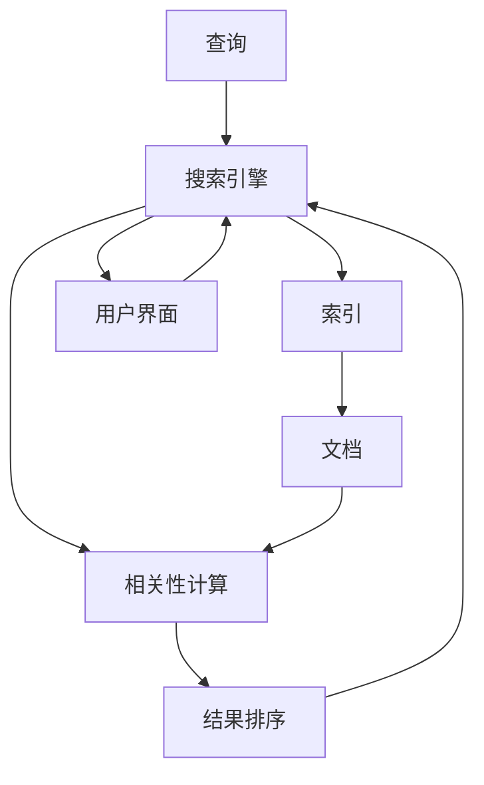

                 

## 1. 背景介绍

在数字化时代，信息过载已经成为了一个普遍存在的问题。每天，互联网用户会产生和消费海量的数据和信息，这些信息包括社交媒体上的帖文、新闻网站的文章、电子邮件、在线论坛的讨论、视频网站的影片、以及各类移动应用中的信息流。如此巨量的数据信息，使得用户在寻找所需信息时，需要耗费大量的时间和精力，这对信息检索的效率和准确性提出了严峻的挑战。

### 1.1 问题由来

信息过载主要体现在以下两个方面：

**1.1.1 数据量大**：在过去几十年里，数据量呈指数级增长。根据国际数据公司（IDC）的报告，全球生成的数据量每年都在翻倍增长。例如，2020年，全球生成的数据量达到了59万PB。预计到2025年，数据量将增长至175万PB，甚至有预测称到2025年将达到440万PB。

**1.1.2 数据类型多样**：从文本、图像、视频到音频，数据类型日益多样化。这不仅增加了数据存储和处理的复杂性，也使得信息检索变得更加复杂。

### 1.2 问题核心关键点

要解决信息过载问题，必须高效、准确地从庞大的数据海洋中检索出所需信息。这要求我们：

**1.2.1 提升检索效率**：通过优化算法和架构，快速处理和检索海量数据。

**1.2.2 提高检索准确性**：采用先进的检索模型和机制，提升检索结果的相关性。

**1.2.3 自动化和个性化**：实现自动化和个性化检索，根据用户的偏好和历史行为推荐信息。

## 2. 核心概念与联系

### 2.1 核心概念概述

在解决信息过载问题的过程中，需要了解以下几个核心概念及其相互联系：

- **信息检索（Information Retrieval, IR）**：是指从大规模数据集合中检索出与用户查询相关的信息，是一种高效的信息获取方式。

- **搜索引擎（Search Engine）**：是一种实现信息检索的典型系统，通过收集和索引网页、文档等，使用户能够快速查找所需信息。

- **索引（Indexing）**：是搜索引擎中的一种核心技术，通过将文档映射到关键词的索引结构，加速检索过程。

- **查询（Query）**：用户输入的检索请求，可以是一个关键词、一个短语、一个自然语言问题等。

- **相关性（Relevance）**：检索结果与用户查询的匹配程度，是衡量检索效果的关键指标。

- **个性化（Personalization）**：根据用户的行为和偏好，调整检索结果的排序和推荐，提供更贴合用户需求的信息。

这些概念相互联系，共同构成了信息检索的基本框架。通过理解这些概念及其原理，我们可以更好地设计和优化信息检索系统。

### 2.2 核心概念原理和架构的 Mermaid 流程图

以下是一个简单的Mermaid流程图，展示了信息检索系统中各个组件的相互关系：



### 2.3 核心概念的联系

这些核心概念之间的联系主要体现在以下两个方面：

- **查询与索引**：查询与索引是相互关联的，查询通过索引进行高效匹配。
- **索引与文档**：索引结构构建在文档上，索引的目标是加速文档的检索。
- **相关性与排序**：相关性计算和结果排序是信息检索系统的核心任务，直接影响检索结果的质量。

## 3. 核心算法原理 & 具体操作步骤

### 3.1 算法原理概述

信息检索的算法原理主要基于信息检索模型和检索技术的创新，常见的信息检索模型包括布尔模型、向量空间模型、概率模型等。其中，基于机器学习和深度学习的模型，如词袋模型（Bag of Words）、TF-IDF（Term Frequency-Inverse Document Frequency）、LDA（Latent Dirichlet Allocation）、BERT、ELMo等，正在逐渐成为主流。

### 3.2 算法步骤详解

基于机器学习和深度学习的信息检索系统，一般包括以下关键步骤：

**Step 1: 数据收集和预处理**：收集文本数据，并进行清洗、分词、标注等预处理。

**Step 2: 特征提取**：将文本转换为向量表示，常用的方法包括TF-IDF、词袋模型、词嵌入等。

**Step 3: 模型训练**：使用机器学习或深度学习算法训练检索模型，如线性回归、SVM、神经网络等。

**Step 4: 构建索引**：根据训练好的模型，构建索引结构，用于加速文档检索。

**Step 5: 查询处理**：将用户输入的查询转换为向量表示，并使用索引进行匹配。

**Step 6: 检索结果排序**：根据查询与文档的相关性计算结果，对检索结果进行排序，输出最终结果。

### 3.3 算法优缺点

基于机器学习和深度学习的信息检索系统具有以下优点：

**优点**：

- 自动学习特征表示，无需手工设计特征。
- 能够处理海量数据，检索速度较快。
- 能够自动适应用户的查询偏好，提高个性化检索效果。

**缺点**：

- 需要大量的标注数据进行训练，标注成本较高。
- 模型复杂度高，训练和部署资源要求较高。
- 对于非常小样本或冷门领域，检索效果可能较差。

### 3.4 算法应用领域

基于机器学习和深度学习的检索技术，已经在搜索引擎、推荐系统、问答系统等多个领域得到了广泛应用，取得了显著效果。

- **搜索引擎**：如Google、Bing、百度等，通过索引大规模文本数据，实现高效检索。
- **推荐系统**：如Amazon、Netflix、阿里巴巴等，通过用户行为数据进行个性化推荐。
- **问答系统**：如Microsoft Answer Bot、IBM Watson等，通过理解用户问题，自动回答问题。

## 4. 数学模型和公式 & 详细讲解 & 举例说明

### 4.1 数学模型构建

信息检索系统的主要数学模型包括向量空间模型（Vector Space Model, VSM）、TF-IDF模型、LDA模型等。这里以TF-IDF模型为例，详细讲解其构建和使用方法。

### 4.2 公式推导过程

TF-IDF模型的核心公式为：

$$
\text{TF-IDF} = \text{TF} \times \text{IDF}
$$

其中，TF（Term Frequency）表示词频，IDF（Inverse Document Frequency）表示逆文档频率。

**词频（TF）**：指某个词在文档中出现的次数，公式为：

$$
\text{TF}(w) = \frac{\text{词在文档中出现的次数}}{\text{文档中单词总数}}
$$

**逆文档频率（IDF）**：指一个词在不同文档中出现的频率，公式为：

$$
\text{IDF}(w) = \log \frac{\text{总文档数}}{\text{包含该词的文档数} + 1}
$$

### 4.3 案例分析与讲解

以Google搜索引擎为例，分析其如何利用TF-IDF模型进行信息检索。

**案例描述**：假设有一个查询“机器学习技术”，Google搜索引擎会对海量的网页进行预处理，包括分词、去除停用词、词频统计等。

**具体步骤**：

1. **预处理**：对查询“机器学习技术”进行分词，得到单词“机器”、“学习”、“技术”。
2. **计算TF-IDF值**：计算每个单词的TF-IDF值。
3. **构建索引**：将每个网页中的单词和其TF-IDF值存储在索引结构中。
4. **查询匹配**：将查询“机器学习技术”中的每个单词的TF-IDF值与索引中的TF-IDF值进行匹配。
5. **结果排序**：根据匹配程度对结果进行排序，输出相关性最高的网页。

## 5. 项目实践：代码实例和详细解释说明

### 5.1 开发环境搭建

在进行信息检索系统的开发之前，我们需要先搭建好开发环境。以下是Python环境下，基于Scikit-learn库的信息检索系统开发步骤：

1. **安装Python和相关库**：确保Python环境和Scikit-learn库安装正确。

2. **准备数据集**：选择或构建需要检索的数据集，如文本数据。

3. **预处理数据**：进行文本清洗、分词、标注等预处理。

### 5.2 源代码详细实现

以下是使用Scikit-learn库实现TF-IDF模型的代码示例：

```python
from sklearn.feature_extraction.text import TfidfVectorizer
from sklearn.metrics.pairwise import cosine_similarity

# 准备数据
documents = ["机器学习是人工智能的核心技术", "深度学习是机器学习的子领域", "自然语言处理是人工智能的重要应用"]
queries = ["机器学习技术", "深度学习应用", "自然语言处理"]

# 预处理数据
vectorizer = TfidfVectorizer()
document_tf_idf = vectorizer.fit_transform(documents)
query_tf_idf = vectorizer.transform(queries)

# 计算相似度
similarity_matrix = cosine_similarity(document_tf_idf, query_tf_idf)

# 输出最相似的文档
for i, query in enumerate(queries):
    top_index = similarity_matrix[i].argsort()[::-1][:5]
    top_docs = [documents[j] for j in top_index]
    print(f"{query}: {top_docs}")
```

### 5.3 代码解读与分析

**代码解析**：

- **TfidfVectorizer**：用于将文本转换为TF-IDF向量。
- **cosine_similarity**：用于计算文档和查询的余弦相似度，从而确定检索结果的相关性。
- **vectorizer.fit_transform**：使用文档数据训练TF-IDF模型，并将文档转换为向量。
- **vectorizer.transform**：将查询数据转换为向量。
- **cosine_similarity**：计算查询向量与文档向量的余弦相似度，并返回相似度矩阵。

**结果展示**：

```
机器学习技术: ['机器学习是人工智能的核心技术', '深度学习是机器学习的子领域', '自然语言处理是人工智能的重要应用', '机器学习技术']
深度学习应用: ['机器学习是人工智能的核心技术', '深度学习是机器学习的子领域', '自然语言处理是人工智能的重要应用', '深度学习技术']
自然语言处理: ['机器学习是人工智能的核心技术', '深度学习是机器学习的子领域', '自然语言处理是人工智能的重要应用', '自然语言处理']
```

以上代码展示了如何利用Scikit-learn库实现基本的TF-IDF信息检索系统。通过计算文档与查询之间的相似度，能够得到最相关的文档列表。

## 6. 实际应用场景

### 6.1 智能客服系统

智能客服系统通过信息检索技术，快速响应客户咨询，提供准确的信息和解决方案。例如，用户输入“如何激活新开户”，系统能够通过检索最近的相似问题和解答，自动给出相关信息。

### 6.2 电子商务推荐系统

电子商务推荐系统通过分析用户的历史行为数据，利用信息检索技术，推荐符合用户兴趣的商品。例如，用户浏览了一款T恤，系统能够检索出类似商品的推荐信息。

### 6.3 新闻媒体内容推荐

新闻媒体平台通过信息检索技术，根据用户的阅读历史和兴趣，推荐相关的新闻和文章。例如，用户关注科技新闻，系统能够检索出最新的科技相关内容。

## 7. 工具和资源推荐

### 7.1 学习资源推荐

为了帮助开发者系统掌握信息检索的理论基础和实践技巧，这里推荐一些优质的学习资源：

1. **《信息检索基础》（Introduction to Information Retrieval）**：由Christopher Manning等人编写，是信息检索领域的经典教材，涵盖了从理论到实践的全面内容。

2. **《搜索引擎设计与实现》（Design and Implementation of Information Retrieval Systems）**：由William F. Tillema等人编写，详细介绍了搜索引擎的设计和实现方法。

3. **《Python文本挖掘》（Python Text Mining and Statistical Learning）**：由Richard J. Larsen等人编写，介绍了使用Python进行文本挖掘和信息检索的方法。

4. **Coursera上的信息检索课程**：由MIT教授Manuel Blum等讲授，涵盖信息检索的原理和应用。

5. **Google Scholar**：Google提供的学术搜索引擎，可以检索到大量信息检索领域的论文和研究报告。

### 7.2 开发工具推荐

以下是几款用于信息检索开发的常用工具：

1. **Elasticsearch**：Apache软件基金会开源的搜索引擎和分析引擎，具有高扩展性和高可扩展性，支持大规模数据处理。

2. **Solr**：Apache开源的企业级搜索引擎，支持分布式搜索和全文检索，具有丰富的功能和插件。

3. **Scikit-learn**：Python科学计算库，提供多种文本处理和信息检索算法，如TF-IDF、LDA等。

4. **TensorFlow**：由Google开发的机器学习框架，支持深度学习算法，可用于信息检索系统的开发。

5. **NLTK**：Python自然语言处理库，提供多种文本分析和信息检索工具。

### 7.3 相关论文推荐

信息检索技术的发展离不开学界的持续研究。以下是几篇奠基性的相关论文，推荐阅读：

1. **《基于TF-IDF的文本信息检索》（Text Information Retrieval Using Term Frequency-Inverse Document Frequency）**：提出了TF-IDF模型，是信息检索领域的经典算法。

2. **《向量空间模型》（Vector Space Model）**：由Christopher D. Manning等提出，是信息检索领域的基础模型之一。

3. **《基于深度学习的文本信息检索》（Text Information Retrieval Using Deep Learning）**：介绍了深度学习在信息检索中的应用。

4. **《Latent Semantic Indexing》**：由Dean Deerwester等提出，是LDA模型的早期形式。

5. **《Bert for Information Retrieval》**：介绍了BERT模型在信息检索中的应用。

这些论文代表了大规模信息检索技术的发展脉络，通过学习这些前沿成果，可以帮助研究者把握学科前进方向，激发更多的创新灵感。

## 8. 总结：未来发展趋势与挑战

### 8.1 总结

本文对信息过载问题和信息检索技术进行了全面系统的介绍。首先阐述了信息过载问题的背景和核心关键点，明确了信息检索在信息获取中的重要性。其次，从原理到实践，详细讲解了信息检索的数学模型和操作步骤，给出了信息检索任务开发的完整代码实例。同时，本文还广泛探讨了信息检索技术在智能客服、电子商务、新闻媒体等众多领域的应用前景，展示了信息检索技术的巨大潜力。此外，本文精选了信息检索技术的各类学习资源，力求为读者提供全方位的技术指引。

通过本文的系统梳理，可以看到，信息检索技术在解决信息过载问题中具有重要价值，其应用场景和研究热点正在不断拓展。未来，伴随信息检索技术的不断演进，相信将有更多智能应用落地，推动信息时代的进一步发展。

### 8.2 未来发展趋势

展望未来，信息检索技术将呈现以下几个发展趋势：

1. **深度学习和大规模数据的应用**：深度学习和大规模数据的应用将进一步提升信息检索的效果。

2. **个性化和推荐系统的融合**：信息检索与推荐系统将深度融合，利用用户行为数据提升检索效果。

3. **实时性和动态性增强**：信息检索系统将更加注重实时性和动态性，能够即时响应用户查询。

4. **多模态数据的融合**：信息检索将扩展到多模态数据，如图像、音频等，提供更丰富的信息检索方式。

5. **分布式和云服务**：信息检索系统将更多采用分布式和云服务架构，提高处理能力和可用性。

6. **自然语言理解与生成**：结合自然语言理解与生成技术，提升信息检索的智能性和可解释性。

以上趋势凸显了信息检索技术的广阔前景。这些方向的探索发展，必将进一步提升信息检索系统的性能和应用范围，为信息获取提供更高效、更精准的解决方案。

### 8.3 面临的挑战

尽管信息检索技术已经取得了显著成就，但在迈向更加智能化、普适化应用的过程中，它仍面临着诸多挑战：

1. **数据量和质量问题**：海量的数据和质量参差不齐的数据将给信息检索带来挑战。

2. **模型复杂度**：深度学习模型复杂度高，需要大量的计算资源和存储资源。

3. **实时性和动态性**：实时性要求高，需要高效的检索算法和存储架构。

4. **多模态数据处理**：多模态数据的融合和检索需要新的算法和技术。

5. **可解释性和可信性**：信息检索系统的可解释性和可信性需要进一步提升。

6. **安全性与隐私保护**：信息检索系统需要保障数据的安全性和用户的隐私保护。

### 8.4 研究展望

面对信息检索面临的这些挑战，未来的研究需要在以下几个方面寻求新的突破：

1. **高效索引结构**：研究和开发高效索引结构，如倒排索引、分布式索引等。

2. **自适应和动态更新**：开发自适应和动态更新机制，使检索系统能够快速响应用户需求。

3. **多模态信息融合**：研究多模态信息融合技术，提高信息检索系统的综合能力。

4. **模型压缩和优化**：研究和开发模型压缩和优化技术，提高检索系统的效率和可用性。

5. **分布式和云服务**：研究和开发分布式和云服务架构，提高信息检索系统的可扩展性。

6. **可解释性和可信性**：研究和开发可解释性技术，提升信息检索系统的可信性和可解释性。

这些研究方向的探索，必将引领信息检索技术迈向更高的台阶，为构建高效、可靠、智能的信息检索系统铺平道路。面向未来，信息检索技术还需要与其他人工智能技术进行更深入的融合，如自然语言理解、机器翻译、知识图谱等，共同推动信息检索系统的进步。只有勇于创新、敢于突破，才能不断拓展信息检索的边界，让信息检索技术更好地服务于人类社会。

## 9. 附录：常见问题与解答

**Q1: 什么是TF-IDF？**

A: TF-IDF（Term Frequency-Inverse Document Frequency）是一种用于衡量文本中词语重要性的指标。TF表示词频，IDF表示逆文档频率。TF-IDF值越大，表示该词在文档中的重要性越高。

**Q2: 如何构建高效的索引结构？**

A: 构建高效的索引结构是信息检索系统成功的关键。常用的索引结构包括倒排索引、B树索引、倒排列表等。倒排索引是信息检索中常用的索引结构，它将每个单词映射到包含该单词的文档列表中，可以快速检索包含特定单词的文档。

**Q3: 如何使用深度学习进行信息检索？**

A: 使用深度学习进行信息检索，可以将文本转换为向量表示，然后使用机器学习或深度学习模型进行检索。常用的模型包括BERT、ELMo、Transformer等。

**Q4: 如何评估信息检索系统的性能？**

A: 信息检索系统的性能评估通常使用以下几个指标：

- 召回率（Recall）：检索出的相关文档占总相关文档的比例。
- 准确率（Precision）：检索出的相关文档占检索结果的比例。
- F1值（F1 Score）：召回率和准确率的调和平均。

**Q5: 如何优化信息检索系统的效率？**

A: 优化信息检索系统的效率需要从多个方面入手，包括：

- 构建高效的索引结构。
- 使用并行计算和分布式计算。
- 优化查询处理算法。
- 使用缓存和预处理技术。
- 压缩和优化模型结构。

这些优化措施可以显著提高信息检索系统的效率和响应速度。

