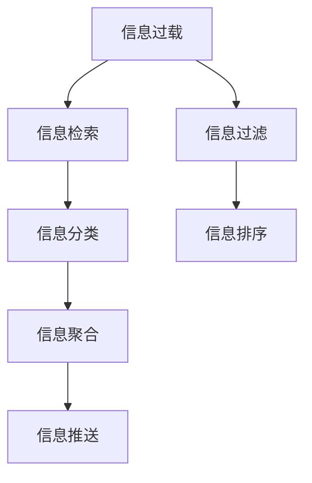

                 

# 信息过载与信息筛选策略：在信息洪流中找到有价值的信息

> 关键词：信息过载, 信息筛选策略, 信息检索, 自然语言处理(NLP), 深度学习, 机器学习, 数据挖掘

## 1. 背景介绍

### 1.1 问题由来

随着互联网技术的飞速发展，人们每天都会接触到海量的信息。从新闻、社交媒体到电子邮件，从视频流媒体到智能设备，信息源的数量和形式正以前所未有的速度增加。这种信息的爆炸性增长，不仅使得信息处理变得更加复杂，也对人类信息吸收和处理能力提出了前所未有的挑战。我们称之为“信息过载”。

信息过载带来了多方面的问题：

- **决策困难**：面对巨量的信息，我们很难快速、准确地做出决策。
- **注意力分散**：信息的无限增殖导致我们无法集中注意力处理重要信息，影响工作和学习效率。
- **认知负荷**：大量无关信息的干扰，使得我们难以专注于有意义的信息，从而导致认知负荷增加。

为了应对信息过载，我们亟需有效的信息筛选策略，帮助我们在信息洪流中发现和利用有价值的信息。

### 1.2 问题核心关键点

信息筛选策略的核心在于如何从海量信息中识别出最相关、最有价值的内容，并将其与无关信息区分开来。其关键点包括：

- **信息识别**：识别信息的相关性和重要性，即确定哪些信息值得进一步处理。
- **信息排序**：根据信息的价值和紧急性对信息进行排序，优先处理最重要的信息。
- **信息聚合**：将重要信息合并成易于理解和利用的形式，如摘要、概览等。
- **信息推送**：使用智能推荐系统，将相关且有价值的信息推送给用户。

## 2. 核心概念与联系

### 2.1 核心概念概述

为了更好地理解信息筛选策略，本节将介绍几个密切相关的核心概念：

- **信息过载**：指人们被大量、杂乱、冗余的信息所淹没，难以有效处理和利用信息的状态。
- **信息检索**：指通过某种方式从信息库中检索出特定信息的过程。
- **信息过滤**：指根据预设规则或算法，自动筛选出最有价值的信息，过滤掉无关内容。
- **自然语言处理(NLP)**：涉及计算机对人类语言的理解、生成和处理，常用于信息检索和过滤中。
- **深度学习**：一种能够处理高维非线性数据的机器学习技术，常用于信息分类和排序。
- **机器学习**：使计算机通过数据学习并作出预测或决策的能力。
- **数据挖掘**：从大规模数据集中提取有价值信息和知识的过程。

这些概念之间的逻辑关系可以通过以下Mermaid流程图来展示：



这个流程图展示了我们如何从信息过载状态，通过信息检索、过滤、分类、排序、聚合和推送等环节，最终找到并利用有价值的信息。

## 3. 核心算法原理 & 具体操作步骤

### 3.1 算法原理概述

信息筛选策略的核心是利用机器学习和自然语言处理技术，从海量信息中自动识别、分类、排序并聚合有价值的信息。其基本流程如下：

1. **数据收集**：从各种信息源收集数据。
2. **预处理**：清洗、归一化、标注数据。
3. **特征提取**：从原始数据中提取有意义的特征。
4. **模型训练**：使用机器学习算法训练分类、排序和聚类的模型。
5. **信息筛选**：将模型应用于新的数据，筛选出相关有价值的信息。
6. **信息展示**：将筛选结果以易于理解的方式呈现给用户。

### 3.2 算法步骤详解

以下我们将详细介绍信息筛选策略的核心算法步骤：

#### 3.2.1 数据收集

数据收集是信息筛选的第一步。可以通过爬虫、API接口、数据库等多种方式获取数据。以下是示例代码：

```python
import requests
from bs4 import BeautifulSoup

url = 'https://example.com'
response = requests.get(url)
soup = BeautifulSoup(response.content, 'html.parser')
# 解析页面并提取所需信息
```

#### 3.2.2 数据预处理

数据预处理包括数据清洗、归一化、标注等步骤。以文本数据为例：

- **数据清洗**：去除噪声和无用信息。
- **数据归一化**：将数据转换为统一的格式和标准。
- **数据标注**：为数据打上标签，如主题、情感等。

#### 3.2.3 特征提取

特征提取是从原始数据中提取有用特征的过程。在文本数据中，常见的方法包括：

- **TF-IDF**：计算词频和逆文档频率，评估词的重要性。
- **词嵌入**：如Word2Vec、GloVe等，将词汇映射到向量空间。
- **主题建模**：如LDA，从文本中提取主题和关键词。

#### 3.2.4 模型训练

模型训练是信息筛选的核心步骤。常用的机器学习模型包括：

- **分类模型**：如朴素贝叶斯、支持向量机、逻辑回归等。
- **排序模型**：如KNN、协同过滤、深度学习等。
- **聚类模型**：如K-Means、层次聚类、GMM等。

#### 3.2.5 信息筛选

信息筛选是将训练好的模型应用于新的数据，识别和筛选有价值的信息。以下是示例代码：

```python
from sklearn.feature_extraction.text import TfidfVectorizer
from sklearn.linear_model import LogisticRegression

# 训练模型
vectorizer = TfidfVectorizer()
X_train = vectorizer.fit_transform(train_data)
y_train = train_labels
clf = LogisticRegression()
clf.fit(X_train, y_train)

# 对新数据进行分类
X_test = vectorizer.transform(test_data)
y_pred = clf.predict(X_test)
```

#### 3.2.6 信息展示

信息展示是将筛选结果以易于理解的方式呈现给用户。常见的方式包括：

- **摘要生成**：使用自然语言生成技术生成摘要。
- **图表展示**：使用图表展示数据的趋势和分布。
- **标签展示**：在搜索结果旁边显示标签和关键词。

### 3.3 算法优缺点

信息筛选策略具有以下优点：

- **效率高**：通过机器学习算法，可以快速处理和筛选大量数据。
- **精度高**：基于统计和深度学习模型，可以准确识别和分类信息。
- **可扩展性强**：可以轻松集成到不同的信息系统和应用中。

但同时，也存在以下缺点：

- **数据依赖**：模型性能依赖于数据质量和标注水平。
- **复杂度**：模型训练和部署需要较高的技术门槛。
- **偏见问题**：模型可能继承数据中的偏见，影响筛选结果的公平性。

### 3.4 算法应用领域

信息筛选策略在多个领域都有广泛应用：

- **新闻业**：自动生成新闻摘要、推荐相关文章。
- **电商**：推荐商品、筛选广告。
- **社交媒体**：推荐内容、筛选垃圾信息。
- **医疗**：推荐文献、筛选病例。

此外，信息筛选技术还被应用于广告投放、智能客服、智能家居等多个场景。

## 4. 数学模型和公式 & 详细讲解 & 举例说明

### 4.1 数学模型构建

假设我们有$N$条文本数据$\{x_1, x_2, ..., x_N\}$，每条数据对应一个标签$y_i \in \{0, 1\}$，表示该文本是否包含某个特定主题。我们的目标是构建一个二分类模型$f(x)$，用于预测新文本是否属于该主题。

定义模型$f(x)$为线性分类器，形式为：

$$
f(x) = \omega \cdot x + b
$$

其中$\omega$为权重向量，$b$为偏置项，$x = [x_1, x_2, ..., x_N]$为输入向量。

### 4.2 公式推导过程

以逻辑回归为例，其损失函数为交叉熵损失：

$$
\mathcal{L}(f(x)) = -\frac{1}{N} \sum_{i=1}^N [y_i \log f(x_i) + (1-y_i) \log (1-f(x_i))]
$$

求导得到梯度：

$$
\nabla_{\omega, b} \mathcal{L}(f(x)) = \frac{1}{N} \sum_{i=1}^N [y_i (f(x_i) - 1) x_i + (1-y_i) (1-f(x_i)) x_i]
$$

使用梯度下降等优化算法更新模型参数：

$$
\omega, b \leftarrow \omega - \eta \nabla_{\omega, b} \mathcal{L}(f(x))
$$

其中$\eta$为学习率。

### 4.3 案例分析与讲解

以新闻摘要生成为例，展示信息筛选策略的实现过程。

- **数据收集**：爬取新闻网站的数据。
- **数据预处理**：去除HTML标签，分词，去除停用词。
- **特征提取**：使用TF-IDF计算词频和逆文档频率，提取关键词和短语。
- **模型训练**：使用逻辑回归模型，训练新闻是否属于特定主题的分类器。
- **信息筛选**：对新文章进行分类，将主题相关的新闻生成摘要。

以下是示例代码：

```python
from sklearn.feature_extraction.text import TfidfVectorizer
from sklearn.linear_model import LogisticRegression

# 训练模型
vectorizer = TfidfVectorizer()
X_train = vectorizer.fit_transform(train_data)
y_train = train_labels
clf = LogisticRegression()
clf.fit(X_train, y_train)

# 对新数据进行分类
X_test = vectorizer.transform(test_data)
y_pred = clf.predict(X_test)
```

## 5. 项目实践：代码实例和详细解释说明

### 5.1 开发环境搭建

在进行信息筛选实践前，我们需要准备好开发环境。以下是使用Python进行Scikit-Learn开发的环境配置流程：

1. 安装Anaconda：从官网下载并安装Anaconda，用于创建独立的Python环境。

2. 创建并激活虚拟环境：
```bash
conda create -n myenv python=3.7
conda activate myenv
```

3. 安装Scikit-Learn：
```bash
pip install scikit-learn
```

4. 安装各类工具包：
```bash
pip install numpy pandas scikit-learn matplotlib tqdm jupyter notebook ipython
```

完成上述步骤后，即可在`myenv`环境中开始信息筛选实践。

### 5.2 源代码详细实现

以下是信息筛选策略的完整代码实现，展示如何使用Scikit-Learn进行二分类任务的数据筛选：

```python
from sklearn.feature_extraction.text import TfidfVectorizer
from sklearn.linear_model import LogisticRegression

# 数据准备
train_data = ['This is a positive news', 'This is a negative news']
train_labels = [1, 0]

# 特征提取
vectorizer = TfidfVectorizer()
X_train = vectorizer.fit_transform(train_data)

# 模型训练
clf = LogisticRegression()
clf.fit(X_train, train_labels)

# 对新数据进行分类
test_data = ['This is another positive news']
X_test = vectorizer.transform(test_data)
y_pred = clf.predict(X_test)
print(y_pred)
```

### 5.3 代码解读与分析

让我们再详细解读一下关键代码的实现细节：

**TfidfVectorizer类**：
- `__init__`方法：初始化文本数据，定义停用词、词汇表等。
- `fit_transform`方法：对文本数据进行分词、去停用词等预处理，并计算TF-IDF权重。
- `transform`方法：对新文本数据进行预处理，并计算TF-IDF权重。

**LogisticRegression类**：
- `fit`方法：对训练数据进行分类模型训练。
- `predict`方法：对新数据进行分类预测。

**训练流程**：
- 定义训练数据和标签。
- 使用TfidfVectorizer进行特征提取。
- 使用LogisticRegression进行模型训练。
- 对新文本数据进行分类预测。

可以看到，Scikit-Learn提供了一系列的工具和函数，可以简化信息筛选任务的实现过程。开发者可以专注于模型设计和算法优化，而不必过多关注底层细节。

## 6. 实际应用场景

### 6.1 新闻业

新闻业是信息筛选策略的重要应用场景。传统的编辑和审核流程耗时耗力，难以应对大量新闻的实时发布。信息筛选策略可以自动生成新闻摘要和分类，快速响应新闻热点，提升新闻编辑和出版的效率。

以CNN为例，其使用的“CNN/RNN”模型，通过组合卷积神经网络和循环神经网络，实现对新闻文本的自动摘要和分类。通过训练，CNN/RNN模型可以学习到文本的结构和语义特征，从而生成高质量的新闻摘要。

### 6.2 电商

电商行业的推荐系统也是信息筛选策略的重要应用场景。传统推荐系统往往依赖用户的点击和浏览历史，难以应对新用户的推荐需求。信息筛选策略可以结合用户兴趣、商品标签等信息，自动推荐相关商品，提升用户体验和购买转化率。

以Amazon为例，其使用的“协同过滤”算法，通过分析用户行为和商品特征，推荐用户可能感兴趣的商品。通过训练，协同过滤模型可以学习到用户和商品之间的关系，从而生成个性化的推荐结果。

### 6.3 社交媒体

社交媒体的信息筛选和推荐系统也是信息筛选策略的重要应用场景。传统的信息推荐依赖人工审核和编辑，难以应对大量信息的快速传播。信息筛选策略可以自动检测和筛选垃圾信息、敏感信息，提升用户的信息体验和社区环境。

以Facebook为例，其使用的“深度学习”模型，通过学习用户的历史互动数据，自动推荐相关内容，提升用户体验。通过训练，深度学习模型可以学习到用户的行为和偏好，从而生成个性化的推荐结果。

### 6.4 医疗

医疗行业的信息筛选和推荐系统也是信息筛选策略的重要应用场景。传统的信息查找和检索需要大量人工干预，难以应对医疗信息的复杂性和多样性。信息筛选策略可以自动筛选和推荐相关文献、病例，提升医疗决策和诊疗的效率和质量。

以PubMed为例，其使用的“信息检索”技术，通过学习用户的查询历史和兴趣偏好，自动推荐相关文献。通过训练，信息检索模型可以学习到用户的查询意图和偏好，从而生成个性化的文献推荐结果。

## 7. 工具和资源推荐

### 7.1 学习资源推荐

为了帮助开发者系统掌握信息筛选策略的理论基础和实践技巧，这里推荐一些优质的学习资源：

1. **《深度学习》（Ian Goodfellow著）**：经典教材，详细介绍了深度学习的基本概念和算法，包括信息分类、排序等任务。
2. **《自然语言处理综论》（Daniel Jurafsky和James H. Martin著）**：全面介绍了NLP的基本概念和技术，包括文本分类、摘要生成等任务。
3. **Coursera上的《机器学习》课程**：由斯坦福大学Andrew Ng教授主讲，涵盖了机器学习的基本概念和算法，适合初学者和进阶者。
4. **Kaggle数据科学竞赛**：提供大量的数据集和挑战，适合实践和应用信息筛选策略。
5. **ACL、EMNLP等NLP会议的论文和报告**：展示最新的研究成果和应用案例，了解前沿技术动态。

通过对这些资源的学习实践，相信你一定能够快速掌握信息筛选策略的精髓，并用于解决实际的NLP问题。

### 7.2 开发工具推荐

高效的开发离不开优秀的工具支持。以下是几款用于信息筛选开发的常用工具：

1. **Scikit-Learn**：基于Python的机器学习库，提供丰富的分类、排序、聚类等算法，简单易用，适合初学者和进阶者。
2. **TensorFlow**：由Google主导开发的深度学习框架，生产部署方便，适合大规模工程应用。
3. **PyTorch**：基于Python的深度学习框架，灵活动态，适合研究和实验。
4. **NLTK**：自然语言处理工具包，提供文本处理和分析的工具，适合NLP任务开发。
5. **Gensim**：用于文本处理和主题建模的工具，适合信息检索和分类任务。
6. **Jupyter Notebook**：交互式笔记本环境，支持Python代码的运行和展示，适合开发和调试。

合理利用这些工具，可以显著提升信息筛选任务的开发效率，加快创新迭代的步伐。

### 7.3 相关论文推荐

信息筛选策略的研究源于学界的持续研究。以下是几篇奠基性的相关论文，推荐阅读：

1. **"Neural Information Retrieval"**：Chen & Manning，介绍深度学习在信息检索中的应用。
2. **"Deep Learning for Natural Language Processing"**：Yoav Goldberg，全面介绍深度学习在NLP中的应用。
3. **"Information Retrieval and Text Mining"**：Christopher Manning & Hinrich Schütze，详细介绍信息检索和文本挖掘的技术和算法。
4. **"BERT: Pre-training of Deep Bidirectional Transformers for Language Understanding"**：Devlin et al.，介绍BERT模型在信息分类和排序中的应用。
5. **"Attention is All You Need"**：Vaswani et al.，介绍Transformer模型在信息检索和分类中的应用。

这些论文代表了大语言模型微调技术的发展脉络。通过学习这些前沿成果，可以帮助研究者把握学科前进方向，激发更多的创新灵感。

## 8. 总结：未来发展趋势与挑战

### 8.1 总结

本文对信息筛选策略进行了全面系统的介绍。首先阐述了信息过载的问题和挑战，明确了信息筛选策略的重要性和应用价值。其次，从原理到实践，详细讲解了信息筛选策略的数学模型和算法步骤，给出了信息筛选任务开发的完整代码实例。同时，本文还广泛探讨了信息筛选策略在新闻业、电商、社交媒体、医疗等多个领域的应用前景，展示了信息筛选策略的广阔应用场景。此外，本文精选了信息筛选技术的各类学习资源，力求为读者提供全方位的技术指引。

通过本文的系统梳理，可以看到，信息筛选策略已经成为NLP领域的重要范式，极大地拓展了信息处理和应用的范围，催生了更多的落地场景。得益于机器学习和自然语言处理技术的不断进步，信息筛选策略必将在更广阔的应用领域大放异彩。

### 8.2 未来发展趋势

展望未来，信息筛选策略将呈现以下几个发展趋势：

1. **自动化程度提升**：随着模型的不断优化和数据量的增加，信息筛选的自动化程度将越来越高。机器学习算法将越来越智能，可以自动检测和筛选信息。
2. **多模态融合**：信息筛选将不再局限于文本数据，将融合视觉、听觉等多种模态信息，提升信息的综合利用能力。
3. **跨领域应用**：信息筛选策略将不再局限于某一特定领域，将应用于更多行业和领域，提升信息处理和利用的效率。
4. **联邦学习**：分布式信息筛选技术将越来越重要，联邦学习等技术将使得信息筛选策略可以处理大规模、分布式的数据集。
5. **实时处理**：随着计算资源和技术的进步，实时信息筛选将变得越来越容易实现，使得信息处理和利用的效率大大提高。

以上趋势凸显了信息筛选策略的广阔前景。这些方向的探索发展，必将进一步提升信息处理和利用的效率和精度，为智能社会提供更高效、智能的信息服务。

### 8.3 面临的挑战

尽管信息筛选策略已经取得了一定的成果，但在迈向更加智能化、普适化应用的过程中，它仍面临诸多挑战：

1. **数据质量问题**：模型的性能依赖于数据的质量和标注水平。如何获取高质量的数据和标注，仍然是一个重要的挑战。
2. **算法复杂性**：信息筛选策略的算法复杂度高，需要高水平的数据科学和机器学习知识，对从业者的技术要求较高。
3. **模型泛化能力**：信息筛选模型往往依赖特定的训练数据和领域知识，如何提高模型的泛化能力，是另一个重要的挑战。
4. **隐私和安全问题**：信息筛选过程中可能会涉及用户隐私和敏感信息，如何保护用户隐私，防止信息泄露，是必须解决的问题。
5. **计算资源需求**：信息筛选模型往往需要大量的计算资源，如何降低计算成本，提升计算效率，也是一个重要的研究方向。

### 8.4 研究展望

面对信息筛选策略所面临的诸多挑战，未来的研究需要在以下几个方面寻求新的突破：

1. **自动化数据标注**：通过自动标注技术，减少人工标注的劳动量，提高数据标注的效率和质量。
2. **弱监督学习**：利用弱监督学习技术，从少量标注数据中学习信息分类和排序规则，降低数据标注的依赖。
3. **多任务学习**：通过多任务学习技术，提升信息筛选模型的泛化能力和性能。
4. **实时联邦学习**：通过实时联邦学习技术，提升信息筛选模型的实时处理能力和效率。
5. **隐私保护技术**：通过隐私保护技术，保护用户隐私和敏感信息，确保信息筛选的安全性。
6. **高效计算方法**：通过高效计算方法，降低信息筛选模型的计算成本，提升计算效率。

这些研究方向的探索，必将引领信息筛选技术迈向更高的台阶，为智能社会提供更高效、智能的信息服务。面向未来，信息筛选技术还需要与其他人工智能技术进行更深入的融合，如知识表示、因果推理、强化学习等，多路径协同发力，共同推动智能社会的发展。

## 9. 附录：常见问题与解答

**Q1：信息筛选策略是否可以应用于非文本数据？**

A: 是的，信息筛选策略不仅可以应用于文本数据，还可以应用于图像、视频、音频等多模态数据。例如，在图像数据中，可以使用卷积神经网络提取图像特征，然后使用分类器进行信息筛选。在视频数据中，可以使用3D卷积神经网络提取视频特征，然后进行信息筛选。

**Q2：信息筛选策略在处理中文数据时需要注意什么？**

A: 中文数据处理不同于英文数据处理，需要注意以下几点：
- **分词**：中文数据需要分词处理，可以使用结巴分词、THULAC等工具。
- **停用词表**：中文停用词表不同于英文停用词表，需要根据具体场景选择合适的停用词表。
- **词向量**：中文词向量可以使用Word2Vec、GloVe等工具进行训练。
- **模型优化**：中文数据处理过程中，需要注意模型优化，如词嵌入的降维、正则化等。

**Q3：信息筛选策略的性能如何评估？**

A: 信息筛选策略的性能评估主要通过以下指标：
- **准确率**：评估模型正确分类信息的比例。
- **召回率**：评估模型正确识别信息的比例。
- **F1分数**：综合评估准确率和召回率的性能。
- **AUC-ROC曲线**：评估模型在分类任务中的性能。

**Q4：信息筛选策略在实际应用中需要注意哪些问题？**

A: 信息筛选策略在实际应用中需要注意以下问题：
- **数据收集**：需要收集大量高质量的数据，以训练和优化模型。
- **特征提取**：需要选择合适的特征提取方法，以提高模型的性能。
- **模型训练**：需要选择合适的模型和算法，以适应具体的任务和场景。
- **模型优化**：需要对模型进行优化，以提升模型的性能和效率。
- **模型部署**：需要将模型部署到实际系统中，以提供服务。

**Q5：信息筛选策略在处理多领域数据时需要注意什么？**

A: 信息筛选策略在处理多领域数据时，需要注意以下几点：
- **领域适应**：不同领域的数据特征和分布可能不同，需要针对不同领域的数据进行模型训练和优化。
- **数据标注**：不同领域的数据标注方式和标准可能不同，需要进行领域适应和数据标注。
- **模型融合**：不同领域的模型可以融合在一起，以提升多领域信息筛选的性能。

这些问题的解答展示了信息筛选策略在实际应用中需要注意的关键点，有助于开发者更好地理解和应用信息筛选技术。

---

作者：禅与计算机程序设计艺术 / Zen and the Art of Computer Programming

