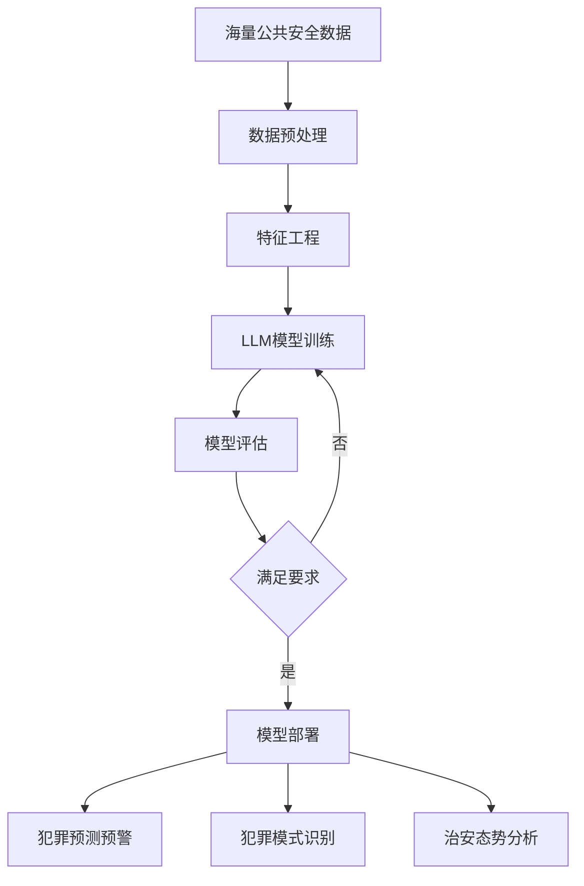

# AI LLM在公共安全领域的应用：预测与预防

## 1.背景介绍
### 1.1 公共安全面临的挑战
#### 1.1.1 犯罪行为的复杂性和多样性
#### 1.1.2 传统预防和打击犯罪方法的局限性
#### 1.1.3 大数据时代对公共安全的新要求
### 1.2 人工智能在公共安全领域的应用前景
#### 1.2.1 AI技术的快速发展
#### 1.2.2 AI在公共安全领域的应用潜力
#### 1.2.3 AI LLM模型的优势和特点

## 2.核心概念与联系
### 2.1 AI LLM模型
#### 2.1.1 LLM的定义和原理
#### 2.1.2 LLM的训练方法和数据要求
#### 2.1.3 LLM的应用领域和优势
### 2.2 公共安全预测与预防
#### 2.2.1 犯罪预测的概念和意义
#### 2.2.2 犯罪预防的策略和措施
#### 2.2.3 AI LLM在预测和预防中的作用
### 2.3 AI LLM与公共安全的结合
#### 2.3.1 AI LLM在犯罪预测中的应用
#### 2.3.2 AI LLM在犯罪预防中的应用
#### 2.3.3 AI LLM与传统方法的结合和互补

## 3.核心算法原理具体操作步骤
### 3.1 数据预处理
#### 3.1.1 数据收集和清洗
#### 3.1.2 特征工程和选择
#### 3.1.3 数据标注和增强
### 3.2 LLM模型训练
#### 3.2.1 模型结构选择和优化
#### 3.2.2 损失函数和优化算法
#### 3.2.3 超参数调优和模型评估
### 3.3 模型部署和应用
#### 3.3.1 模型压缩和加速
#### 3.3.2 模型部署和服务化
#### 3.3.3 模型更新和维护

## 4.数学模型和公式详细讲解举例说明
### 4.1 LLM的数学基础
#### 4.1.1 Transformer结构和自注意力机制
$Attention(Q,K,V) = softmax(\frac{QK^T}{\sqrt{d_k}})V$
#### 4.1.2 预训练和微调的数学原理
$L(\theta) = -\frac{1}{N}\sum_{i=1}^{N}logP(y_i|x_i;\theta)$
#### 4.1.3 生成式预训练模型的数学推导
$P(x) = \prod_{i=1}^{n}P(x_i|x_1,\cdots,x_{i-1})$
### 4.2 犯罪预测模型的数学表示
#### 4.2.1 时间序列预测模型
$\hat{y}_t = f(y_{t-1},y_{t-2},\cdots,y_{t-n})$
#### 4.2.2 空间关联分析模型
$y = \rho Wy + X\beta + \epsilon$
#### 4.2.3 多模态融合预测模型
$y = f(X_1,X_2,\cdots,X_k;\theta)$

## 5.项目实践：代码实例和详细解释说明
### 5.1 数据准备和预处理
```python
import pandas as pd
from sklearn.preprocessing import StandardScaler

data = pd.read_csv('crime_data.csv')
data = data.dropna()
features = ['feature1', 'feature2', ...]
X = data[features]
scaler = StandardScaler()
X = scaler.fit_transform(X)
```
### 5.2 LLM模型构建和训练
```python
import torch
from transformers import GPT2LMHeadModel, GPT2Tokenizer

tokenizer = GPT2Tokenizer.from_pretrained('gpt2')
model = GPT2LMHeadModel.from_pretrained('gpt2')
model.train()

inputs = tokenizer(text, return_tensors='pt')
outputs = model(**inputs, labels=inputs['input_ids'])
loss = outputs.loss
loss.backward()
```
### 5.3 模型应用和结果分析
```python
from sklearn.metrics import accuracy_score, f1_score

preds = model.predict(X_test)
acc = accuracy_score(y_test, preds)
f1 = f1_score(y_test, preds)
print(f"Accuracy: {acc}, F1-score: {f1}")
```

## 6.实际应用场景
### 6.1 智能警务系统
#### 6.1.1 犯罪热点预测和布控
#### 6.1.2 嫌疑人画像和追踪
#### 6.1.3 案件关联分析和串并
### 6.2 社会治安综合治理
#### 6.2.1 治安动态评估和预警
#### 6.2.2 重点人员监控和管理
#### 6.2.3 矛盾纠纷预测和化解
### 6.3 反恐维稳工作
#### 6.3.1 极端言论识别和预警
#### 6.3.2 可疑人员筛查和管控
#### 6.3.3 恐怖活动预测和防范

## 7.工具和资源推荐
### 7.1 开源AI框架和库
#### 7.1.1 TensorFlow和Keras
#### 7.1.2 PyTorch和Transformers
#### 7.1.3 scikit-learn和XGBoost
### 7.2 预训练LLM模型
#### 7.2.1 GPT系列模型
#### 7.2.2 BERT和RoBERTa
#### 7.2.3 T5和BART
### 7.3 公共安全数据集
#### 7.3.1 犯罪记录数据集
#### 7.3.2 社交媒体数据集
#### 7.3.3 监控视频数据集

## 8.总结：未来发展趋势与挑战
### 8.1 AI LLM在公共安全领域的发展趋势
#### 8.1.1 多模态融合和知识增强
#### 8.1.2 小样本学习和持续学习
#### 8.1.3 隐私保护和安全可控
### 8.2 面临的挑战和问题
#### 8.2.1 数据质量和标注成本
#### 8.2.2 模型解释性和可信度
#### 8.2.3 伦理道德和法律法规
### 8.3 未来研究方向和展望
#### 8.3.1 因果推理和反事实思维
#### 8.3.2 人机协同和交互式学习
#### 8.3.3 AI治理和伦理框架

## 9.附录：常见问题与解答
### 9.1 AI LLM模型的局限性有哪些？
AI LLM模型虽然在许多任务上取得了显著成果，但仍然存在一些局限性，如对常识性知识的理解不足、缺乏因果推理能力、容易产生幻觉和错误等。这需要在训练数据和目标函数上进行针对性改进。
### 9.2 如何权衡AI技术应用与隐私保护？
在公共安全领域应用AI技术时，必须高度重视隐私保护问题。需要制定严格的数据使用和共享规范，采用数据脱敏、联邦学习、差分隐私等技术手段，并建立完善的监管和问责机制，确保公民合法权益不受侵犯。
### 9.3 AI辅助决策如何避免误判和歧视？
AI系统的预测结果仅供参考，不能完全替代人类判断。在实际应用中，需要充分考虑模型的置信度和可解释性，对预测结果进行人工复核，建立人机协同的决策机制。同时，要重视算法的公平性，避免对特定群体产生歧视和偏见。



以上是一个利用AI LLM技术进行公共安全预测和预防的基本流程。首先对海量的公共安全数据进行预处理和特征工程，然后构建LLM模型进行训练和评估，达到要求后部署上线。模型可应用于犯罪预测预警、犯罪模式识别、治安态势分析等任务，辅助公安机关更高效、更精准地开展工作，提升打防管控能力。

当然，要真正实现AI LLM在公共安全领域的落地应用，还需要在数据质量、算法性能、系统集成、伦理规范等方面持续攻关。未来，随着AI技术的不断进步，有望为平安中国建设插上腾飞的翅膀，让老百姓生活得更安心、更美好。

作者：禅与计算机程序设计艺术 / Zen and the Art of Computer Programming