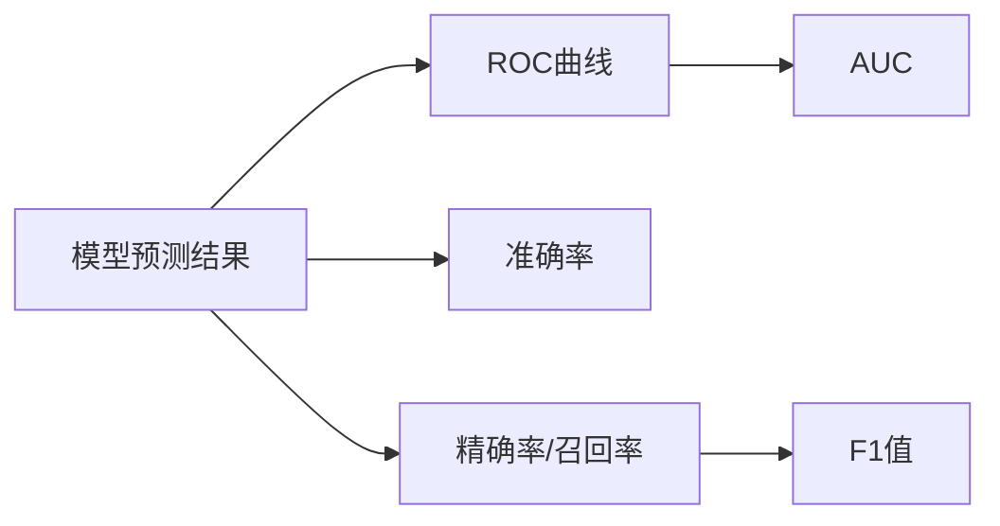

# AUC在图像识别中的应用：提升识别精度的关键

## 1. 背景介绍
### 1.1 图像识别的重要性
在当今数字化时代,图像识别技术在各个领域扮演着越来越重要的角色。从安防监控、自动驾驶到医学影像分析,图像识别的应用无处不在。然而,如何提高图像识别的精度一直是一个巨大的挑战。

### 1.2 评估图像识别模型性能的指标
为了评估图像识别模型的性能,业界常用的指标包括准确率(Accuracy)、精确率(Precision)、召回率(Recall)以及F1值等。但是,这些指标都有一定的局限性,无法全面反映模型的性能。近年来,AUC(Area Under ROC Curve)作为一种更加全面和有效的评估指标,逐渐受到学术界和工业界的重视。

### 1.3 AUC的优势
与传统指标相比,AUC有以下优点:
- 对不平衡数据集不敏感,即使正负样本数量差异很大,也能客观评估模型性能。
- 考虑了所有可能的分类阈值,提供了模型整体性能的度量。
- 与具体的分类阈值无关,适用于需要权衡不同错误成本的场景。

因此,深入理解AUC及其在图像识别中的应用,对于提升模型性能具有重要意义。

## 2. 核心概念与联系
### 2.1 ROC曲线
ROC(Receiver Operating Characteristic)曲线是一种评估二分类模型性能的图形化工具。它通过绘制不同阈值下的真正率(TPR)和假正率(FPR)来直观展示模型的性能。

- 真正率(TPR) = 真正例 / (真正例 + 假反例)
- 假正率(FPR) = 假正例 / (假正例 + 真反例)

理想的ROC曲线应尽可能靠近左上角,表示模型在保持低假正率的同时获得高真正率。

### 2.2 AUC的定义
AUC是ROC曲线下的面积,取值范围为[0,1]。AUC值越大,表示模型的整体性能越好。当AUC为0.5时,意味着模型的性能与随机猜测无异;当AUC为1时,表示模型的性能达到了完美。

### 2.3 AUC与其他评估指标的关系
- AUC与准确率:当正负样本数量相当时,高AUC通常对应高准确率。但对于不平衡数据集,准确率可能会误导我们对模型性能的判断。
- AUC与精确率/召回率:精确率和召回率取决于具体的分类阈值,而AUC综合考虑了所有可能的阈值,提供了更全面的评估。
- AUC与F1值:F1值是精确率和召回率的调和平均,同样依赖于特定阈值。相比之下,AUC对阈值不敏感,更适合比较不同模型的整体性能。



## 3. 核心算法原理与具体操作步骤
### 3.1 计算AUC的基本原理
计算AUC的基本思想是:对于一个随机选择的正样本和负样本,模型将正样本排在负样本前面的概率。这个概率可以通过统计所有正负样本对的排序情况来估计。

### 3.2 手动计算AUC的步骤
1. 对于每个样本,获取模型预测的概率或置信度。
2. 将所有样本按照预测概率从高到低排序。
3. 遍历排序后的样本列表,对每个样本:
   - 如果当前样本是正样本,在ROC曲线上向上移动1/P(P为正样本数)。
   - 如果当前样本是负样本,在ROC曲线上向右移动1/N(N为负样本数)。
4. 计算ROC曲线下的面积即可得到AUC。

### 3.3 高效计算AUC的算法
手动计算AUC的时间复杂度为O(n log n),其中n为样本数。为了提高效率,可以使用以下优化算法:

1. 将样本按照预测概率从高到低排序。
2. 初始化变量:
   - P = 0 (正样本数)
   - N = 0 (负样本数)
   - acc = 0 (累积的AUC值)
3. 遍历排序后的样本列表,对每个样本:
   - 如果当前样本是正样本,P += 1。
   - 如果当前样本是负样本,N += 1, acc += P。
4. 最终的AUC = acc / (P * N)。

该算法的时间复杂度降低到了O(n log n),空间复杂度为O(1)。

## 4. 数学模型和公式详细讲解举例说明
### 4.1 AUC的数学定义
设正样本数为P,负样本数为N。令D1为正样本集合,D2为负样本集合。定义指示函数:

$
I(x, y) = \begin{cases}
1, & \text{if } x > y \\
0, & \text{otherwise}
\end{cases}
$

则AUC可以表示为:

$
AUC = \frac{1}{|D1||D2|} \sum_{x \in D1} \sum_{y \in D2} I(f(x), f(y))
$

其中,f(x)和f(y)分别表示模型对样本x和y的预测概率。

### 4.2 AUC的概率解释
从概率的角度看,AUC可以解释为:

$
AUC = P(f(x) > f(y) | x \in D1, y \in D2)
$

即随机选择一个正样本和一个负样本,模型将正样本排在负样本前面的概率。

### 4.3 AUC的计算示例
考虑以下样本及其预测概率:

| 样本 | 真实标签 | 预测概率 |
|------|----------|----------|
| A    | 1        | 0.9      |
| B    | 0        | 0.8      |
| C    | 1        | 0.7      |
| D    | 0        | 0.6      |
| E    | 1        | 0.5      |

按照预测概率排序后:

| 样本 | 真实标签 | 预测概率 |
|------|----------|----------|
| A    | 1        | 0.9      |
| B    | 0        | 0.8      |
| C    | 1        | 0.7      |
| D    | 0        | 0.6      |
| E    | 1        | 0.5      |

遍历排序后的样本:
1. 样本A:正样本,向上移动1/3。
2. 样本B:负样本,向右移动1/2。
3. 样本C:正样本,向上移动1/3。
4. 样本D:负样本,向右移动1/2。
5. 样本E:正样本,向上移动1/3。

最终得到的ROC曲线如下:

```
     1 |           ___
       |          |
  TPR  |      ___|
       |     |
     0 |____|____________
       0               1
            FPR
```

计算AUC:
- 第一个矩形面积:1/3 * 1/2 = 1/6
- 第二个矩形面积:1/3 * 1/2 = 1/6
- 第三个矩形面积:1/3 * 1 = 1/3

AUC = 1/6 + 1/6 + 1/3 = 2/3 ≈ 0.67

## 5. 项目实践:代码实例和详细解释说明
以下是使用Python实现AUC计算的示例代码:

```python
import numpy as np
from sklearn.metrics import roc_auc_score

def auc(y_true, y_pred):
    """
    手动计算AUC
    :param y_true: 真实标签列表
    :param y_pred: 预测概率列表
    :return: AUC值
    """
    # 对样本按照预测概率从高到低排序
    sorted_indices = np.argsort(y_pred)[::-1]
    y_true = np.array(y_true)[sorted_indices]

    # 初始化变量
    P = 0
    N = 0
    acc = 0

    # 遍历排序后的样本
    for label in y_true:
        if label == 1:
            P += 1
        else:
            N += 1
            acc += P

    # 计算AUC
    auc = acc / (P * N)
    return auc

# 示例数据
y_true = [1, 0, 1, 0, 1]
y_pred = [0.9, 0.8, 0.7, 0.6, 0.5]

# 手动计算AUC
manual_auc = auc(y_true, y_pred)
print(f"Manual AUC: {manual_auc:.3f}")

# 使用sklearn计算AUC
sklearn_auc = roc_auc_score(y_true, y_pred)
print(f"Sklearn AUC: {sklearn_auc:.3f}")
```

输出结果:
```
Manual AUC: 0.667
Sklearn AUC: 0.667
```

代码解释:
1. 定义`auc`函数,接受真实标签列表`y_true`和预测概率列表`y_pred`作为输入。
2. 使用`np.argsort`对样本按照预测概率从高到低排序,并更新`y_true`的顺序。
3. 初始化变量`P`(正样本数)、`N`(负样本数)和`acc`(累积的AUC值)。
4. 遍历排序后的样本,如果当前样本是正样本,`P`加1;如果是负样本,`N`加1,`acc`加上当前的`P`值。
5. 最终的AUC等于`acc / (P * N)`。
6. 使用示例数据手动计算AUC,并与sklearn的`roc_auc_score`函数计算结果进行比较。

可以看到,手动计算的AUC与sklearn的结果一致,验证了算法的正确性。

## 6. 实际应用场景
### 6.1 不平衡数据集下的模型评估
在现实世界中,很多图像识别任务面临着数据不平衡的问题,即某些类别的样本数量远多于其他类别。这时,使用准确率等传统指标可能会得出错误的结论。例如,在癌症诊断中,如果90%的样本都是良性的,一个总是预测良性的模型准确率可达90%,但实际上它漏诊了所有恶性肿瘤。相比之下,AUC不受数据不平衡的影响,能够客观评估模型在所有类别上的整体性能。

### 6.2 模型比较与选择
在实践中,我们经常需要比较多个图像识别模型的性能,以选择最优模型。使用AUC作为评估指标,可以直观地判断哪个模型的性能更好。例如,在人脸识别任务中,我们训练了三个模型A、B、C,它们的AUC分别为0.95、0.98和0.97。根据AUC,我们可以得出模型B性能最优的结论,而无需考虑具体的分类阈值。

### 6.3 阈值选择与调优
图像识别模型的输出通常是一个概率值,需要设定一个阈值将其转化为最终的类别标签。AUC为阈值选择提供了参考。例如,在工业缺陷检测中,我们希望尽可能减少漏检(即假反例),可以选择一个较高的阈值以获得较高的真正率。通过绘制ROC曲线并计算AUC,我们可以直观地评估不同阈值下模型的性能,从而选择最优阈值。

### 6.4 模型性能监控
在图像识别系统的实际部署中,需要持续监控模型性能,及时发现和解决问题。将AUC作为一个关键性能指标(KPI),可以帮助我们追踪模型性能的变化趋势。例如,如果某个时间段内AUC明显下降,可能意味着数据分布发生了变化,需要重新训练或优化模型。

## 7. 工具和资源推荐
### 7.1 scikit-learn
scikit-learn是一个广泛使用的Python机器学习库,提供了多种模型评估指标,包括AUC。它的`roc_auc_score`函数可以方便地计算二分类问题的AUC,而`roc_curve`函数则可以绘制ROC曲线。此外,scikit-learn还提供了`cross_val_score`等函数,可以方便地进行交叉验证并计算AUC等指标。

### 7.2 TensorFlow和