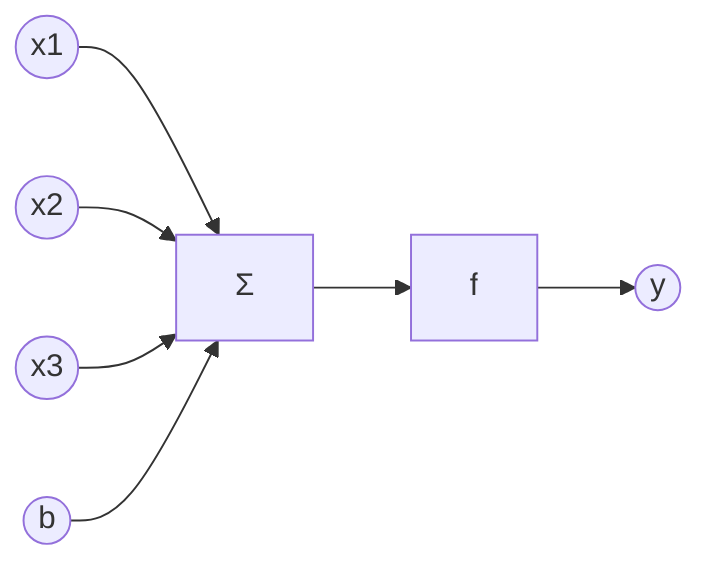
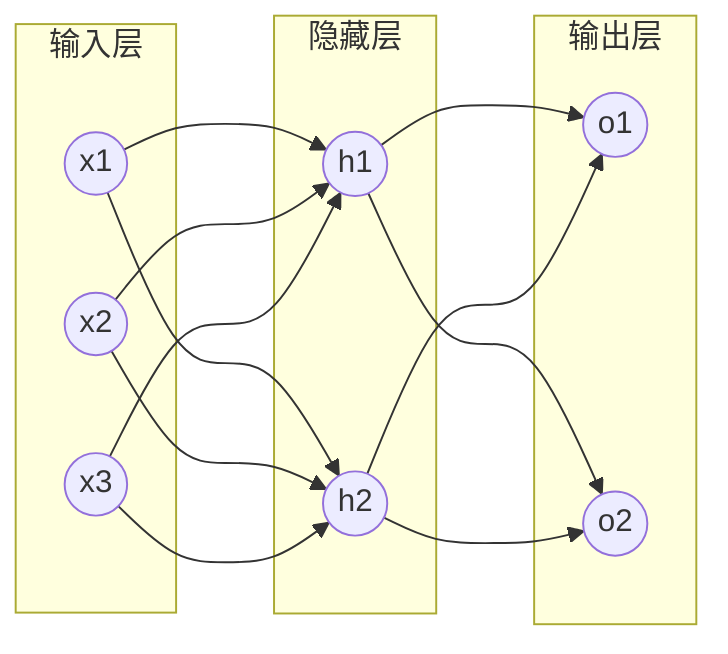
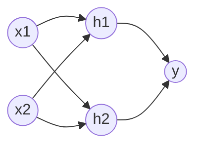

# Backpropagation 原理与代码实战案例讲解

## 1.背景介绍

### 1.1 人工神经网络概述

人工神经网络(Artificial Neural Network, ANN)是一种模仿生物神经网络(动物的中枢神经系统,特别是大脑)的结构和功能的数学模型或计算模型。神经网络由大量的人工神经元联结进行计算。大多数情况下人工神经网络能在外界信息的基础上改变内部结构,是一种自适应系统。

### 1.2 反向传播算法的重要性

反向传播(Backpropagation,缩写为BP)是"误差反向传播"的简称,是训练人工神经网络的一种常用而有效的算法。该算法通过反复调整神经网络各层的权重,使得网络的实际输出与期望输出之间的误差最小化。BP算法的提出和应用极大地推动了人工神经网络的发展和应用。

### 1.3 本文的主要内容

本文将详细介绍BP算法的原理,包括其数学推导过程,并给出具体的代码实现。同时,本文还将讨论BP算法的一些改进方法和实际应用,以帮助读者更好地理解和掌握这一重要算法。

## 2.核心概念与联系

### 2.1 人工神经元模型

人工神经元是神经网络的基本组成单元。一个典型的人工神经元模型如下图所示:



其中,x1,x2,x3是输入信号,wi是对应连接的权重,b是偏置项,f是激活函数,y是神经元的输出。神经元的输出可以表示为:

$$
y = f(\sum_{i=1}^{n} w_i x_i + b)
$$

### 2.2 神经网络结构

通过组合多个神经元,并按一定的层次结构连接,就得到了神经网络。一个典型的三层前馈神经网络结构如下图所示:



### 2.3 损失函数

为了衡量神经网络的输出与期望输出之间的差距,引入损失函数(Loss Function)的概念。常用的损失函数包括均方误差(Mean Squared Error,MSE):

$$
E = \frac{1}{2} \sum_{k=1}^{l} (t_k - y_k)^2
$$

其中,tk是期望输出,yk是实际输出,l是输出层神经元个数。

## 3.核心算法原理具体操作步骤

### 3.1 前向传播

前向传播是指将输入信号从输入层传递到输出层的过程。具体步骤如下:

1. 输入层接收外界输入信号并传递到隐藏层
2. 隐藏层神经元接收来自输入层的信号,计算加权和并通过激活函数产生输出,传递到输出层 
3. 输出层神经元接收来自隐藏层的信号,计算输出

可以用下列公式表示第l层第j个神经元的输出:

$$
a_j^l = f(\sum_{i=1}^{n_{l-1}} w_{ji}^l a_i^{l-1} + b_j^l)
$$

其中,nl-1是l-1层的神经元个数。

### 3.2 反向传播

反向传播是指从输出层开始,将误差信号反向传播到隐藏层和输入层,并更新各层权重的过程。具体步骤如下:

1. 计算输出层误差
$$
\delta_j^L = \frac{\partial E}{\partial z_j^L} = (a_j^L - y_j) \cdot f'(z_j^L)
$$

2. 计算隐藏层误差
$$
\delta_j^l = \frac{\partial E}{\partial z_j^l} = (\sum_{k=1}^{n_{l+1}} w_{kj}^{l+1} \delta_k^{l+1}) \cdot f'(z_j^l)
$$

3. 更新权重和偏置
$$
w_{ji}^l := w_{ji}^l - \alpha \frac{\partial E}{\partial w_{ji}^l} = w_{ji}^l - \alpha a_i^{l-1} \delta_j^l
$$
$$
b_j^l := b_j^l - \alpha \frac{\partial E}{\partial b_j^l} = b_j^l - \alpha \delta_j^l  
$$

其中,α是学习率。

## 4.数学模型和公式详细讲解举例说明

这里以一个简单的异或(XOR)问题为例,详细说明BP算法的数学推导过程。

异或问题是指: 输入两个二进制数(0或1),输出它们的异或结果。异或的规则是:输入相同则输出0,输入不同则输出1。

我们使用一个两层(一个隐藏层)的神经网络来解决这个问题。网络结构如下:



使用Sigmoid函数作为激活函数:

$$
f(x) = \frac{1}{1 + e^{-x}}
$$

其导数为:

$$
f'(x) = f(x)(1 - f(x))  
$$

假设隐藏层到输出层的权重为v,输入层到隐藏层的权重为w,隐藏层的阈值为γ,输出层的阈值为θ。

对于一组训练样本(x1,x2,t),我们有:

隐藏层:
$$
h_1 = f(w_{11} x_1 + w_{21} x_2 - \gamma_1) \
h_2 = f(w_{12} x_1 + w_{22} x_2 - \gamma_2)
$$

输出层:
$$
y = f(v_1 h_1 + v_2 h_2 - \theta)
$$

误差:
$$
E = \frac{1}{2} (t - y)^2
$$

根据BP算法,首先计算输出层误差:

$$
\begin{aligned}
\delta &= \frac{\partial E}{\partial y} \cdot \frac{\partial y}{\partial net} \
&= -(t - y) \cdot f'(net) \
&= -(t - y) \cdot y(1 - y)
\end{aligned}
$$

然后计算隐藏层误差:

$$
\begin{aligned}
\epsilon_1 &= \frac{\partial E}{\partial h_1} = \frac{\partial E}{\partial y} \cdot \frac{\partial y}{\partial h_1} \
&= \delta \cdot v_1 \cdot h_1(1 - h_1) \
\epsilon_2 &= \frac{\partial E}{\partial h_2} = \frac{\partial E}{\partial y} \cdot \frac{\partial y}{\partial h_2} \
&= \delta \cdot v_2 \cdot h_2(1 - h_2)
\end{aligned}
$$

最后更新权重和阈值:

$$
\begin{aligned}
v_1 &:= v_1 - \alpha \cdot \delta \cdot h_1 \
v_2 &:= v_2 - \alpha \cdot \delta \cdot h_2 \
w_{11} &:= w_{11} - \alpha \cdot \epsilon_1 \cdot x_1 \ 
w_{21} &:= w_{21} - \alpha \cdot \epsilon_1 \cdot x_2 \
w_{12} &:= w_{12} - \alpha \cdot \epsilon_2 \cdot x_1 \
w_{22} &:= w_{22} - \alpha \cdot \epsilon_2 \cdot x_2 \
\theta &:= \theta + \alpha \cdot \delta \
\gamma_1 &:= \gamma_1 + \alpha \cdot \epsilon_1 \
\gamma_2 &:= \gamma_2 + \alpha \cdot \epsilon_2
\end{aligned}
$$

重复以上过程,直到网络收敛。

## 5.项目实践:代码实例和详细解释说明

下面给出用Python实现BP算法解决异或问题的代码:

```python
import numpy as np
import matplotlib.pyplot as plt

# 激活函数:sigmoid及其导数
def sigmoid(x):
    return 1 / (1 + np.exp(-x))

def sigmoid_derivative(x):
    return x * (1 - x)

# 训练集
inputs = np.array([[0, 0], [0, 1], [1, 0], [1, 1]])
expected_output = np.array([[0], [1], [1], [0]])

# 超参数
epochs = 10000
learning_rate = 0.1
hidden_neurons = 2  

# 权重和偏置初始化
hidden_weights = np.random.uniform(size=(2, hidden_neurons))
hidden_bias = np.random.uniform(size=(1, hidden_neurons))
output_weights = np.random.uniform(size=(hidden_neurons, 1))
output_bias = np.random.uniform(size=(1, 1))

# 存储损失
losses = []

# 训练
for _ in range(epochs):
    # 前向传播
    hidden_layer_activation = np.dot(inputs, hidden_weights)
    hidden_layer_activation += hidden_bias
    hidden_layer_output = sigmoid(hidden_layer_activation)

    output_layer_activation = np.dot(hidden_layer_output, output_weights)
    output_layer_activation += output_bias
    predicted_output = sigmoid(output_layer_activation)

    # 反向传播
    error = expected_output - predicted_output
    d_predicted_output = error * sigmoid_derivative(predicted_output)
    
    error_hidden_layer = d_predicted_output.dot(output_weights.T)
    d_hidden_layer = error_hidden_layer * sigmoid_derivative(hidden_layer_output)

    # 更新权重和偏置
    output_weights += hidden_layer_output.T.dot(d_predicted_output) * learning_rate
    output_bias += np.sum(d_predicted_output, axis=0, keepdims=True) * learning_rate
    hidden_weights += inputs.T.dot(d_hidden_layer) * learning_rate
    hidden_bias += np.sum(d_hidden_layer, axis=0, keepdims=True) * learning_rate

    # 记录损失
    loss = np.mean(np.square(error))
    losses.append(loss)

# 打印最终预测结果
print(predicted_output)

# 绘制损失曲线
plt.figure()
plt.plot(losses)
plt.xlabel('Epochs')
plt.ylabel('Loss')
plt.show()
```

代码说明:

1. 首先定义了sigmoid激活函数及其导数。 
2. 然后准备了异或问题的训练集,并设置了一些超参数,如训练轮数epochs、学习率learning_rate、隐藏层神经元数hidden_neurons等。
3. 接着随机初始化了各层权重和偏置。
4. 在训练过程中,先进行前向传播,计算各层的激活值和输出;然后进行反向传播,计算输出层和隐藏层的误差,并据此更新权重和偏置。
5. 每一轮训练结束后,记录当前的损失值,用于后续绘制损失曲线。
6. 训练结束后,打印最终的预测结果,并绘制训练过程中的损失曲线。

运行该代码,可以看到网络能够较好地拟合异或问题,损失也迅速降低并收敛。这说明BP算法是一种行之有效的神经网络训练方法。

## 6.实际应用场景

BP算法作为一种经典的神经网络训练算法,在许多领域都有广泛应用,例如:

1. 图像识别:BP算法可用于训练卷积神经网络(CNN),进行图像分类、目标检测等任务。

2. 自然语言处理:BP算法可用于训练循环神经网络(RNN),进行语言模型、机器翻译、情感分析等任务。

3. 语音识别:BP算法可用于训练深度神经网络(DNN),进行语音识别和语音合成等任务。

4. 推荐系统:BP算法可用于训练深度学习推荐模型,如神经协同过滤(NCF)等。

5. 金融预测:BP算法可用于训练多层感知机(MLP),进行股票价格预测、信用风险评估等任务。

6. 工业控制:BP算法可用于训练前馈神经网络(FNN),进行工业过程建模、故障诊断等任务。

总之,BP算法为各行各业提供了一种强大的建模工具,极大地