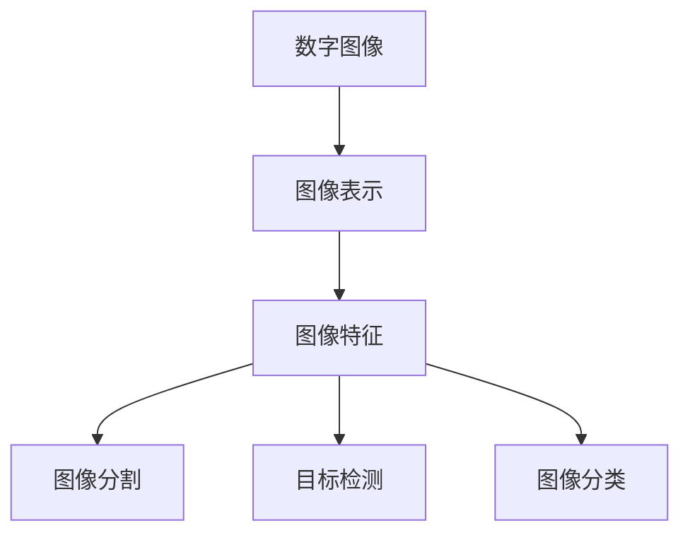

# Computer Vision原理与代码实例讲解

## 1.背景介绍
### 1.1 什么是Computer Vision
Computer Vision(计算机视觉)是一门研究如何使计算机获得高层次理解的学科,通过数字图像或视频来获取这种理解。从工程的角度来看,它致力于研究用计算机自动完成人类视觉系统所能做的任务,以及如何让计算机从图像或视频中提取出有用的信息。

### 1.2 Computer Vision的发展历程
计算机视觉起源于20世纪60年代早期,经历了几个重要的发展阶段:
- 20世纪60年代末到70年代初,主要研究低层次的图像处理,如边缘检测等。
- 20世纪70年代到80年代,开始研究一些中层视觉问题,如运动估计、立体视觉等。
- 20世纪80年代到90年代,随着计算机性能的提升,开始研究一些高层视觉问题,如物体识别、人脸识别等。
- 21世纪以来,深度学习的兴起极大地推动了计算机视觉的发展,使得图像分类、目标检测、语义分割等任务取得了突破性进展。

### 1.3 Computer Vision的应用领域
计算机视觉在很多领域有着广泛的应用,例如:
- 智能监控:人脸识别、行为分析、异常检测等
- 自动驾驶:车道线检测、障碍物识别、交通标志识别等
- 医学影像:肿瘤检测、病变定位、器官分割等
- 工业视觉:缺陷检测、外观检测、OCR识别等
- 人机交互:手势识别、表情识别、视线追踪等

## 2.核心概念与联系
### 2.1 图像表示
- 数字图像:由像素阵列构成的二维数组,每个像素有其灰度值或RGB值。
- 颜色空间:常见的有RGB、HSV、LAB等,可以用于不同的视觉任务。
- 图像金字塔:通过下采样得到不同分辨率的图像,可用于多尺度分析。

### 2.2 图像特征
- 颜色特征:直方图、颜色矩等。
- 纹理特征:LBP、Gabor滤波等。
- 形状特征:HOG、SIFT等。
- 深度特征:卷积神经网络提取的特征。

### 2.3 图像分割
- 阈值分割:通过设定阈值将图像分为前景和背景。
- 区域分割:将图像分割成多个同质区域,如区域生长法、分水岭算法等。
- 语义分割:将图像中的每个像素分类到预定义的类别中。
- 实例分割:检测出图像中的个体目标并为其分配掩码。

### 2.4 目标检测
- 滑动窗口检测:在图像上滑动不同尺度和长宽比的窗口进行分类。
- 区域候选检测:先提取可能包含目标的区域,再对这些区域进行分类,如R-CNN系列。
- 单次检测:使用单个卷积网络直接预测目标的位置和类别,如YOLO、SSD等。

### 2.5 图像分类
- 浅层方法:使用手工设计的特征如SIFT+SVM进行分类。
- 深度学习方法:使用卷积神经网络直接从图像中学习特征并进行分类,如AlexNet、VGGNet、ResNet等。

### 2.6 概念之间的联系
下图展示了这些核心概念之间的联系:



## 3.核心算法原理具体操作步骤
### 3.1 Canny边缘检测
1. 使用高斯滤波器平滑图像以去除噪声
2. 计算图像梯度的幅值和方向
3. 对梯度幅值进行非极大值抑制
4. 使用双阈值法检测和连接边缘

### 3.2 Harris角点检测
1. 计算图像在水平和垂直方向的梯度
2. 计算每个像素的自相关矩阵
3. 计算自相关矩阵的特征值和响应函数
4. 对响应函数进行非极大值抑制得到角点

### 3.3 Meanshift图像分割
1. 对图像进行颜色量化,减少颜色数量
2. 对每个像素,在其邻域内寻找密度最大的区域,并移动到该区域的质心
3. 重复步骤2直到收敛,将收敛点作为该像素的分割标签
4. 合并颜色相近的分割区域,得到最终分割结果

### 3.4 Hough变换直线检测
1. 将图像空间的直线方程转换到参数空间
2. 对边缘图像的每个像素,在参数空间对应一条正弦曲线
3. 在参数空间累加所有像素对应的曲线,峰值对应图像中存在的直线
4. 设定阈值,提取峰值对应的直线参数

### 3.5 Adaboost人脸检测
1. 使用Haar特征描述图像块
2. 从训练数据中学习一系列弱分类器
3. 使用Adaboost算法将弱分类器组合成强分类器
4. 将强分类器级联,构成人脸检测的滑动窗口

## 4.数学模型和公式详细讲解举例说明
### 4.1 高斯滤波
高斯滤波常用于图像平滑去噪,其数学模型为二维高斯函数:

$$G(x,y) = \frac{1}{2\pi\sigma^2}e^{-\frac{x^2+y^2}{2\sigma^2}}$$

其中$(x,y)$为像素坐标,$\sigma$为高斯核的标准差,控制平滑程度。

例如,对于以下含噪声的图像,使用$\sigma=1.5$的高斯滤波器平滑后,噪声被有效抑制。


### 4.2 Canny边缘检测
Canny边缘检测的数学原理是寻找图像梯度幅值的局部极大值。设$I(x,y)$为图像函数,则其梯度为:

$$\nabla I=(\frac{\partial I}{\partial x}, \frac{\partial I}{\partial y})$$

梯度幅值和方向为:

$$M(x,y)=\sqrt{(\frac{\partial I}{\partial x})^2 + (\frac{\partial I}{\partial y})^2}$$

$$\theta(x,y)=arctan(\frac{\frac{\partial I}{\partial y}}{\frac{\partial I}{\partial x}})$$

对梯度幅值$M$进行非极大值抑制,找到沿梯度方向$\theta$的局部极大值,即为图像的边缘。

例如,对下图使用Canny算法检测边缘,可以准确定位图像中的轮廓。


### 4.3 PCA降维
设$X$为$m$个$n$维数据点组成的矩阵,PCA的目标是找到一个$n\times k$的变换矩阵$W$,将$X$降到$k$维$(k<n)$,使得降维后的数据方差最大。

首先对$X$进行中心化,然后对协方差矩阵$\frac{1}{m}XX^T$进行特征值分解:

$$\frac{1}{m}XX^T=U\Lambda U^T$$

取前$k$个最大特征值对应的特征向量构成$W$的列,则$Y=XW$即为降维后的$k$维数据。

例如,对下图中的三维数据进行PCA降到二维,可以发现降维后的数据保留了原数据的主要结构。


## 5.项目实践:代码实例和详细解释说明
下面以Python和OpenCV为例,展示几个计算机视觉的经典算法的代码实现。

### 5.1 图像读取与显示

```python
import cv2

# 读取图像
img = cv2.imread('image.jpg')

# 显示图像
cv2.imshow('image', img)
cv2.waitKey(0)
cv2.destroyAllWindows()
```

`cv2.imread`函数读取指定路径的图像文件,返回一个NumPy数组。`cv2.imshow`在窗口中显示图像,`cv2.waitKey`等待按键,`cv2.destroyAllWindows`关闭所有窗口。

### 5.2 图像平滑

```python
import cv2

img = cv2.imread('image.jpg')

# 均值滤波
blur = cv2.blur(img, (5,5))

# 高斯滤波
gaussian = cv2.GaussianBlur(img, (5,5), 0)

# 中值滤波
median = cv2.medianBlur(img, 5)

cv2.imshow('image', img)
cv2.imshow('blur', blur)
cv2.imshow('gaussian', gaussian)
cv2.imshow('median', median)
cv2.waitKey(0)
cv2.destroyAllWindows()
```

`cv2.blur`进行均值滤波,`cv2.GaussianBlur`进行高斯滤波,`cv2.medianBlur`进行中值滤波。它们都接受原图和卷积核大小作为参数,高斯滤波还需要指定标准差。

### 5.3 边缘检测

```python
import cv2

img = cv2.imread('image.jpg', 0)

# Canny边缘检测
edges = cv2.Canny(img, 100, 200)

cv2.imshow('image', img)
cv2.imshow('edges', edges)
cv2.waitKey(0)
cv2.destroyAllWindows()
```

`cv2.Canny`进行Canny边缘检测,接受原图和两个阈值作为参数。阈值越小,检测到的边缘越多。

### 5.4 轮廓检测

```python
import cv2

img = cv2.imread('image.jpg')
gray = cv2.cvtColor(img, cv2.COLOR_BGR2GRAY)

# 二值化
ret, thresh = cv2.threshold(gray, 127, 255, 0)

# 寻找轮廓
contours, hierarchy = cv2.findContours(thresh, cv2.RETR_TREE, cv2.CHAIN_APPROX_SIMPLE)

# 绘制轮廓
cv2.drawContours(img, contours, -1, (0,255,0), 3)

cv2.imshow('image', img)
cv2.waitKey(0)
cv2.destroyAllWindows()
```

首先将图像转为灰度图,然后用`cv2.threshold`进行二值化。再用`cv2.findContours`寻找二值图像中的轮廓,最后用`cv2.drawContours`在原图上绘制轮廓。

### 5.5 人脸检测

```python
import cv2

face_cascade = cv2.CascadeClassifier('haarcascade_frontalface_default.xml')

img = cv2.imread('image.jpg')
gray = cv2.cvtColor(img, cv2.COLOR_BGR2GRAY)

# 检测人脸
faces = face_cascade.detectMultiScale(gray, 1.3, 5)

# 绘制人脸框
for (x,y,w,h) in faces:
    cv2.rectangle(img, (x,y), (x+w,y+h), (255,0,0), 2)

cv2.imshow('image', img)
cv2.waitKey(0)
cv2.destroyAllWindows()
```

首先加载Haar级联分类器,然后用`detectMultiScale`检测灰度图中的人脸。检测到的人脸由矩形框表示,用`cv2.rectangle`在原图上绘制。

## 6.实际应用场景
计算机视觉在许多领域有着广泛的应用,下面列举几个典型场景:

### 6.1 工业视觉检测
在工业生产中,计算机视觉可以用于产品缺陷检测、字符识别、尺寸测量等。通过摄像头采集产品图像,运用图像处理和模式识别技术,可以自动检测出产品的瑕疵,极大地提高生产效率。

### 6.2 医学影像分析
计算机视觉在医学领域也有着广泛应用。通过对CT、MRI、X光等医学影像进行分析,可以帮助医生进行疾病诊断和治疗。常见的任务有器官分割、肿瘤检测、病变定位等。

### 6.3 智能安防
计算机视觉是智能安防系统的核心。通过对监控视频进行分析,可以实现人