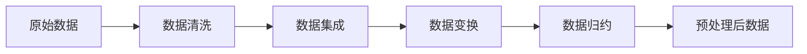

# Data Preprocessing 原理与代码实战案例讲解

## 1.背景介绍

数据预处理(Data Preprocessing)是机器学习和数据挖掘中的一个关键步骤。在现实世界中,原始数据通常是不完整、不一致、有噪声的,甚至包含许多错误。将原始数据直接用于分析或训练机器学习模型,会导致误导性结果。因此,在数据应用前,必须对其进行预处理。

数据预处理可以帮助我们:

- 处理无效值、缺失值、异常值等问题
- 消除数据中的噪声
- 规范化、标准化数据,使其落在特定区间
- 转换、整合数据,使其适用于挖掘任务

高质量的数据是高质量挖掘结果的前提。数据预处理虽然繁琐,但对后续工作的顺利开展至关重要。

## 2.核心概念与联系

数据预处理涉及的核心概念包括:

- 数据清洗(Data Cleaning):处理无效值、缺失值、异常值等。
- 数据集成(Data Integration):整合多个数据源、解决数据冗余等问题。
- 数据变换(Data Transformation):规范化、聚集、泛化数据。
- 数据归约(Data Reduction):降维、数值归约、数据压缩等。

这些步骤相辅相成,共同构成完整的数据预处理流程:



## 3.核心算法原理具体操作步骤

数据预处理的具体操作步骤如下:

1. 数据清洗
   - 识别并处理无效值
   - 填充缺失值(均值/中位数填充、回归插值等)
   - 平滑噪声数据(分箱/回归/聚类平滑等)
   - 识别并移除异常值

2. 数据集成
   - Schema集成:实体识别、冗余属性识别等
   - 冗余数据消除
   - 数据值冲突检测与处理

3. 数据变换
   - 数据规范化(最小-最大规范化、z-score规范化等)
   - 数据聚集(聚集到高层概念,如用"优秀"替代具体的分数)
   - 数据泛化(泛化到高层概念,如用"学生"替代具体的个人)

4. 数据归约
   - 维归约:PCA、子集选择等
   - 数值归约:参数化建模等
   - 数据压缩:有损或无损压缩

## 4.数学模型和公式详细讲解举例说明

以下详细讲解几个常见的数据预处理数学模型。

### 4.1 数据规范化

#### 4.1.1 最小-最大规范化(Min-Max Normalization)

将数据映射到[0,1]区间:

$$x_{norm} = \frac{x - x_{min}}{x_{max} - x_{min}}$$

其中,$x$为原始值,$x_{min}$和$x_{max}$分别为数据集中的最小值和最大值。

例如,对于数据集[10, 20, 30, 40, 50],应用最小-最大规范化后得到[0, 0.25, 0.5, 0.75, 1]。

#### 4.1.2 z-score规范化

将数据转换为均值为0、标准差为1的分布:

$$x_{norm} = \frac{x - \mu}{\sigma}$$

其中,$\mu$为均值,$\sigma$为标准差。

例如,对于数据集[10, 20, 30, 40, 50],均值$\mu=30$,标准差$\sigma=15.81$,应用z-score规范化后得到[-1.26, -0.63, 0, 0.63, 1.26]。

### 4.2 主成分分析(PCA)

PCA通过正交变换将原始$n$维属性空间转换为一组线性无关的$k$维特征子空间($k \leq n$),从而实现数据降维。

PCA的主要步骤:

1. 对原始数据集$X$进行中心化,即减去均值。
2. 计算协方差矩阵$\Sigma=\frac{1}{m}XX^T$。
3. 对协方差矩阵$\Sigma$进行特征值分解。
4. 选取最大的$k$个特征值对应的特征向量$\{w_1,\ldots,w_k\}$。
5. 将数据集$X$投影到选取的$k$个特征向量上,得到降维后的数据集$Y=XW$。

## 5.项目实践：代码实例和详细解释说明

下面通过Python代码实例,演示几个常见的数据预处理操作。

### 5.1 缺失值处理

```python
import numpy as np
import pandas as pd

# 创建含缺失值的数据集
df = pd.DataFrame({'A': [1, 2, np.nan, 4],
                   'B': [5, np.nan, np.nan, 8],
                   'C': [9, 10, 11, 12]})

# 删除含缺失值的行
df_drop = df.dropna()

# 用指定值填充缺失值
df_fill = df.fillna(value=0)

# 用均值填充缺失值
df_mean = df.fillna(df.mean())
```

### 5.2 数据规范化

```python
from sklearn.preprocessing import MinMaxScaler, StandardScaler

# 创建数据集
X = np.array([[1, 2],
              [3, 4],
              [5, 6]])

# 最小-最大规范化
scaler = MinMaxScaler()
X_minmax = scaler.fit_transform(X)

# z-score规范化
scaler = StandardScaler()
X_std = scaler.fit_transform(X)
```

### 5.3 主成分分析

```python
from sklearn.decomposition import PCA

# 创建数据集
X = np.array([[1, 2],
              [3, 4],
              [5, 6]])

# 创建PCA对象,指定降维后的维数
pca = PCA(n_components=1)

# 进行PCA降维
X_pca = pca.fit_transform(X)
```

## 6.实际应用场景

数据预处理在众多领域有广泛应用,如:

- 金融领域:信用评分、异常交易检测等
- 医疗领域:医学图像处理、基因数据分析等
- 工业领域:传感器数据处理、设备故障检测等
- 社交媒体:用户情感分析、社交网络分析等

以异常交易检测为例,通过数据清洗去除无效交易记录,通过数据集成整合用户信息,通过数据变换构建交易行为特征,最后通过数据归约选择有效特征,从而构建异常交易检测模型。

## 7.工具和资源推荐

- Pandas:强大的Python数据处理库,提供高效的数据清洗、转换等功能。
- Scikit-learn:Python机器学习库,提供多种数据预处理工具如StandardScaler、PCA等。
- Weka:开源的数据挖掘软件,集成了多种数据预处理算法。
- OpenRefine:用于数据清洗和转换的工具,支持多种数据格式。
- DataCleaner:强大的数据质量分析和数据清洗工具。

## 8.总结：未来发展趋势与挑战

数据预处理技术仍在不断发展,以应对日益复杂的数据和应用需求。未来的发展趋势包括:

- 自动化:利用AI技术实现数据预处理过程的自动化,减少人工干预。
- 实时处理:针对流数据的实时预处理技术。
- 数据质量管理:加强数据质量评估和监控,保障数据预处理结果的可靠性。
- 隐私保护:在数据预处理过程中加入隐私保护机制。

数据预处理也面临诸多挑战:

- 数据异构性:来自不同来源的数据在格式、语义上的差异。
- 数据质量:数据噪声、缺失、不一致等质量问题。
- 数据规模:海量数据对预处理效率和资源的挑战。
- 领域知识:缺乏足够的领域专业知识指导数据预处理。

## 9.附录：常见问题与解答

### Q1:数据清洗和数据预处理是一回事吗?

A1:数据清洗是数据预处理的一个子任务,侧重于处理"脏"数据如缺失值、异常值等。而数据预处理包含数据清洗和数据转换、集成、归约等其他任务。

### Q2:什么是"脏"数据?

A2:"脏"数据泛指那些不满足数据一致性、完整性等质量要求的数据,常见问题包括:缺失值、异常值、不一致的值、重复数据等。

### Q3:数据规范化和标准化有什么区别?

A3:规范化一般指将数据映射到[0,1]区间,常用的方法是最小-最大规范化。而标准化指将数据转换为均值为0、标准差为1的分布,即z-score标准化。两者的目的都是消除数据特征之间的量纲影响。

### Q4:什么情况下需要对数据进行降维?

A4:当数据维度很高时,许多机器学习算法的性能会下降,这被称为"维数灾难"。降维可以缓解这一问题。此外,降维还能够去除数据中的噪声,提高数据质量。常用的降维方法包括PCA、LDA等。

### Q5:数据预处理在机器学习项目中是必须的吗?

A5:是的。现实世界中的数据往往是不完美的,它们可能有缺失、噪声、不一致等问题,直接用于挖掘会影响结果的准确性。数据预处理可以提高数据质量,从而提升后续挖掘和建模的效果。因此在大多数机器学习项目中,数据预处理都是不可或缺的环节。

作者：禅与计算机程序设计艺术 / Zen and the Art of Computer Programming