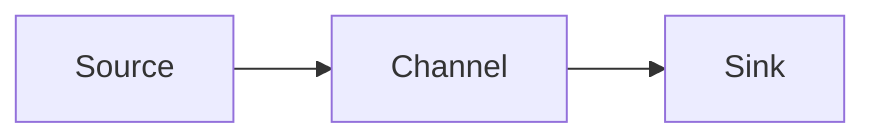

# Flume原理与代码实例讲解

## 1.背景介绍

在大数据时代,海量数据的实时采集与传输是一个重要的课题。Apache Flume作为一个分布式、可靠、高可用的海量日志采集、聚合和传输的系统,在业界得到了广泛应用。本文将深入剖析Flume的技术架构与工作原理,并结合代码实例讲解其使用方法,帮助读者系统地掌握这一利器。

### 1.1 大数据时代数据采集的挑战
### 1.2 Flume应运而生
### 1.3 Flume在业界的应用现状

## 2.核心概念与联系

要理解Flume,首先需要掌握其中的几个核心概念:

### 2.1 Event
- Event是Flume数据传输的基本单元
- 由Header和Body两部分组成

### 2.2 Agent
- Agent是Flume部署的基本单位
- 由Source、Channel和Sink三个组件构成

### 2.3 Source
- 数据采集组件,负责把数据收集进来发送到Channel
- 支持Avro/Thrift/Exec/JMS/Spooling Directory/Kafka/NetCat/Sequence Generator等

### 2.4 Channel
- 位于Source和Sink之间的缓冲区
- File Channel和Memory Channel是两种常用类型

### 2.5 Sink
- 从Channel读取数据,将数据写到目标源
- 支持HDFS/Hive/HBase/Avro/Thrift/IRC/File Roll/Null等

### 2.6 组件间的关系


## 3.核心算法原理具体操作步骤

Flume的核心是把各个组件有机地串联起来,实现可靠的端到端的数据传输:

### 3.1 数据流转步骤
1. Source采集数据,封装成Event,将Event放入Channel
2. Channel保存Event直到它被Sink消费
3. Sink从Channel读取Event,再写到目标源

### 3.2 事务机制
- Flume的事务保证Event至少被传送一次
- Source和Sink分别维护一个事务
- 两阶段提交,保证一致性

### 3.3 可靠性保证
- Channel采用多副本机制,保证数据不丢失
- Sink回滚事务,保证Event至少消费一次
- 故障恢复后,未完成的Event会重新传输

## 4.数学模型和公式详细讲解举例说明

Flume的性能可以用数学模型来分析。假设单个Event的平均长度为 $L$ ,Channel的容量为 $C$ ,传输吞吐量为 $T$ 。

### 4.1 Channel最大缓存时间
$$t_{max}=\frac{C}{T}$$

Channel最多可缓存 $t_{max}$ 秒的数据量。举例,若 $C=1GB$, $T=50MB/s$,则:
$$t_{max}=\frac{1000MB}{50MB/s}=20s$$

### 4.2 Event平均传输时延
$$latency=\frac{L}{T}$$

假设 $L=500B$, $T=50MB/s$,则单个Event的平均传输时延为:
$$latency=\frac{500B}{50MB/s}=0.01ms$$

通过合理设置Channel容量和调整吞吐量,可以控制传输时延,满足不同场景需求。

## 5.项目实践：代码实例和详细解释说明

下面通过一个实际的代码示例,演示如何使用Flume进行数据采集。

### 5.1 安装部署Flume
1. 下载Flume发布包并解压
2. 配置环境变量 `FLUME_HOME`
3. 验证安装,执行 `flume-ng version`

### 5.2 配置Flume
新建配置文件 `netcat-logger.conf` :

```properties
# 定义Agent的组件
a1.sources = s1
a1.channels = c1
a1.sinks = k1

# 配置Source
a1.sources.s1.type = netcat
a1.sources.s1.bind = localhost
a1.sources.s1.port = 9999

# 配置Channel
a1.channels.c1.type = memory
a1.channels.c1.capacity = 1000
a1.channels.c1.transactionCapacity = 100

# 配置Sink
a1.sinks.k1.type = logger

# 连接组件
a1.sources.s1.channels = c1
a1.sinks.k1.channel = c1
```

这个配置定义了一个Agent,使用Netcat Source监听9999端口,Memory Channel作为缓存,Logger Sink打印到控制台。

### 5.3 启动Agent
执行命令:
```bash
flume-ng agent \
--conf conf \
--conf-file netcat-logger.conf \
--name a1 \
-Dflume.root.logger=INFO,console
```

### 5.4 测试
另开一个终端,执行:
```bash
telnet localhost 9999
```
然后输入一些字符,如 "hello world",就可以在Flume Agent的控制台看到输出:
```
Event: { headers:{} body: 68 65 6C 6C 6F 20 77 6F 72 6C 64 0D hello world. }
```

以上例子演示了Flume的基本用法。实际项目中,可以定制不同的Source和Sink,连接成数据传输管道,实现海量数据的可靠采集。

## 6.实际应用场景

Flume在实际项目中有非常广泛的应用,下面列举几个典型场景。

### 6.1 日志收集
Web服务器的访问日志、应用系统的运行日志,通过Flume实时收集,便于集中分析和监控。

### 6.2 数据库变更捕获
监听数据库的变更,将增量数据通过Flume导入到大数据平台,实现准实时的 ETL。

### 6.3 消息队列集成
将Kafka等消息队列系统和Flume无缝连接,构建实时数据处理管道。

### 6.4 跨数据中心数据传输
利用Flume可靠的多级传输能力,在多个数据中心之间复制数据,实现异地容灾。

## 7.工具和资源推荐
- [Flume User Guide](https://flume.apache.org/FlumeUserGuide.html) - Flume官方用户手册
- [Flume API](https://flume.apache.org/releases/content/1.9.0/apidocs/index.html) - Flume API文档
- [Github Repository](https://github.com/apache/flume) - Flume源码仓库
- [Flume Plugins](https://github.com/apache/flume/wiki/Flume-Plugins) - 社区贡献的插件列表

## 8.总结：未来发展趋势与挑战

Flume作为可靠的海量日志收集系统,已在业界得到广泛应用和认可。未来Flume将在以下方面持续演进:

### 8.1 云原生架构
适配Kubernetes等云原生平台,提供弹性扩容和故障自愈能力。

### 8.2 Serverless化
将Flume的功能解耦成细粒度的函数,按需使用,提高资源利用率。

### 8.3 智能运维
引入AI算法,实现故障的自动诊断和处理,减少运维成本。

### 8.4 数据处理
在传输过程中,提供轻量级的数据处理和转换能力,减少后续计算压力。

当然,Flume也面临一些挑战,如性能优化、资源控制、数据安全等,需要在社区的共同努力下持续改进。

## 9.附录：常见问题与解答

### Q1: Flume适合什么样的数据量级?
A1: Flume对数据量没有硬性限制,可以通过横向扩展和多级传输来支持PB级数据量。单个Agent的性能取决于硬件配置,在高配服务器上可达到100MB/s的传输速度。

### Q2: Flume如何保证不丢数据?
A2: Flume提供了端到端的事务机制,Source将Event写入Channel是一个事务,Sink从Channel读走Event又是一个事务。只有当Event被Sink完全消费,才会从Channel移除。这样就保证了数据在传输过程中不会丢失。此外,Channel还可以配置成持久化的File Channel,数据持久化到磁盘,即使宕机也不会丢失。

### Q3: Flume如何实现负载均衡?
A3: 可以配置多个Sink,使用Load balancing Sink Processor实现负载均衡。它支持轮询(round_robin)、随机(random)、权重(weight)等多种调度算法。另外,还可以使用Failover Sink Processor实现Sink之间的主备切换。

### Q4: Flume和Kafka的区别是什么?
A4: Flume和Kafka都可用于数据收集,但它们有不同的设计目标。Flume主要用于多源数据的可靠传输,而Kafka是一个分布式的发布订阅消息系统,具有更强的数据处理和存储能力。在架构上,Flume采用Source+Channel+Sink的多级传输模型,而Kafka采用Producer+Broker+Consumer的发布订阅模型。两者可以集成,形成端到端的数据处理管道。

作者：禅与计算机程序设计艺术 / Zen and the Art of Computer Programming