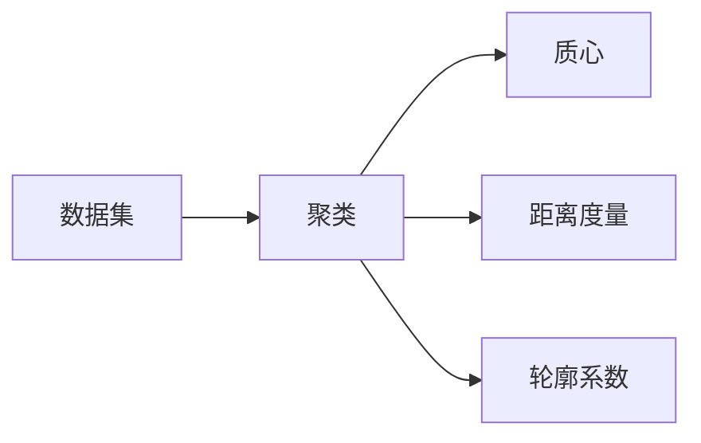

# K-Means聚类的可解释性:聚类结果的解读与展示

## 1. 背景介绍

### 1.1 无监督学习与聚类分析
无监督学习是机器学习的重要分支之一,其目标是在没有预先定义类别标签的情况下,从数据中发现隐藏的模式和结构。聚类分析作为无监督学习的核心任务,旨在将相似的数据点归为一组,形成不同的聚类,从而揭示数据内在的分组结构。

### 1.2 K-Means聚类算法
K-Means是最经典、应用最广泛的聚类算法之一。它以迭代优化的方式将数据划分为K个聚类,每个聚类由其质心(centroid)表示。算法通过最小化数据点到其所属聚类质心的平方距离之和来寻找最优的聚类划分。

### 1.3 聚类结果的可解释性挑战
尽管K-Means算法操作简单、计算效率高,但聚类结果的解读与展示却面临诸多挑战:

1. 聚类结果的直观表达:如何向非专业人士清晰展示多维数据的聚类结构?
2. 聚类特征的提取:每个聚类所包含的数据有何特点?不同聚类之间的区别是什么?
3. 聚类过程的可视化:如何动态呈现K-Means优化过程,加深对算法的理解?

本文将重点探讨K-Means聚类的可解释性,介绍聚类结果解读与展示的实用方法,提升聚类分析的应用价值。

## 2. 核心概念与联系

### 2.1 聚类(Cluster)
聚类指数据集中的一个子集,该子集内的数据点彼此相似,而与其他聚类内的点存在明显差异。聚类反映了数据的内在分组结构。

### 2.2 质心(Centroid)
质心是每个聚类的中心点,通常用该聚类内所有数据点的均值向量表示。质心直观地刻画了聚类的位置特征。

### 2.3 距离度量(Distance Metric)
距离度量用于量化两个数据点之间的差异性。常用的距离度量包括欧氏距离、曼哈顿距离等。K-Means采用数据点到质心的欧氏距离平方和作为优化目标。

### 2.4 轮廓系数(Silhouette Coefficient)
轮廓系数是评估聚类结果质量的重要指标。它综合考虑了聚类的内聚度和分离度,取值范围为[-1,1]。轮廓系数越大,聚类效果越好。

### 2.5 概念联系



## 3. 核心算法原理具体操作步骤

### 3.1 K-Means聚类算法步骤

1. 随机选取K个数据点作为初始质心
2. 重复以下步骤直到质心不再显著变化:
   a. 对每个数据点,计算其到各个质心的距离
   b. 将每个数据点分配到距离最近的质心所在聚类
   c. 更新每个聚类的质心为该聚类内所有点的均值向量
3. 输出最终的K个聚类结果

### 3.2 K值的选择

K值决定了聚类的数量,对结果有重要影响。可通过以下方法选择合适的K值:

1. 领域知识:根据对数据的先验了解设定K值
2. 肘部法则:计算不同K值下的聚类误差平方和,绘制K-误差曲线,选择曲线"肘部"处的K值
3. 轮廓系数:尝试不同的K值,选择轮廓系数最大的K值

### 3.3 初始质心的选择

初始质心的选择会影响K-Means的收敛速度和聚类质量。常用的初始化策略包括:

1. 随机初始化:从数据集中随机抽取K个点作为初始质心
2. K-Means++:以概率的方式选择彼此距离较远的点作为初始质心

## 4. 数学模型和公式详细讲解举例说明

### 4.1 聚类优化目标

K-Means旨在最小化所有数据点到其所属聚类质心的欧氏距离平方和。设数据集为$D=\{x_1,x_2,...,x_n\}$,共K个聚类$\{C_1,C_2,...,C_K\}$,每个聚类的质心为$\{\mu_1,\mu_2,...,\mu_K\}$,优化目标函数为:

$$
J = \sum_{i=1}^{n}\sum_{j=1}^{K} r_{ij} ||x_i - \mu_j||^2
$$

其中$r_{ij}$为示性函数,当数据点$x_i$属于聚类$C_j$时取1,否则取0。

### 4.2 质心更新公式

在算法迭代过程中,每个聚类的质心更新为该聚类内所有数据点的均值向量:

$$
\mu_j = \frac{1}{|C_j|} \sum_{x_i \in C_j} x_i
$$

其中$|C_j|$表示聚类$C_j$内的数据点数量。

### 4.3 轮廓系数计算

对于数据点$x_i$,其轮廓系数$s_i$的计算公式为:

$$
s_i = \frac{b_i - a_i}{max(a_i, b_i)}
$$

其中$a_i$表示$x_i$与同一聚类内其他点的平均距离,$b_i$表示$x_i$与其他聚类中点的最小平均距离。聚类结果的总体轮廓系数为所有数据点轮廓系数的均值:

$$
S = \frac{1}{n} \sum_{i=1}^{n} s_i
$$

## 5. 项目实践:代码实例和详细解释说明

下面以Python为例,演示K-Means聚类的代码实现:

```python
from sklearn.cluster import KMeans
from sklearn.datasets import make_blobs
from sklearn.metrics import silhouette_score
import matplotlib.pyplot as plt

# 生成示例数据集
X, _ = make_blobs(n_samples=1000, centers=4, random_state=42)

# 尝试不同的K值
silhouette_scores = []
for k in range(2, 11):
    kmeans = KMeans(n_clusters=k, random_state=42)
    labels = kmeans.fit_predict(X)
    score = silhouette_score(X, labels)
    silhouette_scores.append(score)

# 绘制不同K值下的轮廓系数
plt.plot(range(2, 11), silhouette_scores)
plt.xlabel('Number of clusters')
plt.ylabel('Silhouette Coefficient')
plt.show()

# 选择最优的K值进行聚类
best_k = silhouette_scores.index(max(silhouette_scores)) + 2
kmeans = KMeans(n_clusters=best_k, random_state=42)
labels = kmeans.fit_predict(X)

# 可视化聚类结果
plt.scatter(X[:, 0], X[:, 1], c=labels)
plt.scatter(kmeans.cluster_centers_[:, 0], kmeans.cluster_centers_[:, 1], marker='*', s=200, c='red')
plt.xlabel('Feature 1')
plt.ylabel('Feature 2')
plt.show()
```

代码解释:

1. 首先生成一个包含4个聚类的示例数据集。
2. 尝试K值从2到10,对每个K值进行K-Means聚类,并计算轮廓系数。绘制不同K值下的轮廓系数曲线。
3. 选择轮廓系数最大的K值作为最优聚类数,进行聚类。
4. 可视化聚类结果,不同聚类用不同颜色表示,质心用红色星号标出。

## 6. 实际应用场景

K-Means聚类在实际应用中有广泛的用途,例如:

### 6.1 客户细分
根据客户的属性特征(如年龄、收入、消费行为等)进行聚类,识别不同的客户群体,制定针对性的营销策略。

### 6.2 图像分割
将图像像素根据颜色、纹理等特征进行聚类,实现图像的分割和目标提取。

### 6.3 文本主题发现
对文本数据进行向量化表示后,用K-Means聚类发现潜在的主题结构,实现文本分类和摘要。

### 6.4 异常检测
对系统日志、传感器数据等进行聚类,识别异常的数据点或事件,及早发现潜在问题。

## 7. 工具和资源推荐

### 7.1 scikit-learn
scikit-learn是Python的机器学习工具包,提供了K-Means等多种聚类算法的高效实现,API使用简单。

### 7.2 ELKI
ELKI是一个用Java实现的开源数据挖掘平台,包含多种聚类算法,并提供了丰富的可视化工具。

### 7.3 Weka
Weka是一个基于Java的机器学习与数据挖掘软件,集成了大量的机器学习算法,操作简单,适合初学者。

## 8. 总结:未来发展趋势与挑战

### 8.1 趋势:深度聚类模型
传统的K-Means等聚类算法难以发现非凸、高维数据中的复杂结构。深度学习与聚类相结合,如深度嵌入聚类、变分自编码器等,为聚类分析注入了新的活力。

### 8.2 趋势:多视图聚类
在大数据环境下,数据往往具有多个视角和表示。多视图聚类通过整合不同视图的信息,挖掘数据的一致性和互补性,提升聚类性能。

### 8.3 挑战:聚类结果的评估
聚类作为无监督学习任务,缺乏客观的评估标准。轮廓系数等指标只能从某一方面反映聚类质量。亟需开发更全面、更可靠的聚类评估方法。

### 8.4 挑战:聚类过程的可解释性
现有的聚类算法大多是"黑盒"模型,无法解释聚类形成的内在原因。提升聚类过程的可解释性,不仅有助于结果的分析,也能增强模型的可信度。

## 9. 附录:常见问题与解答

### 9.1 K-Means对数据规模和维度的敏感性?
K-Means的时间复杂度与数据点数n和维度d呈线性关系,即O(ndk)。因此,K-Means可以较好地处理大规模、高维数据。但在超高维情况下,聚类效果可能会下降。

### 9.2 K-Means对异常点和噪声的敏感性?
K-Means对异常点和噪声比较敏感,因为它基于均值优化。异常点可能导致聚类中心的偏移,影响聚类结果。可以考虑先用异常检测方法移除异常点,再进行聚类。

### 9.3 K-Means的收敛性?
K-Means算法可以保证收敛到一个局部最优解。但由于优化目标非凸,不同的初始质心可能导致不同的聚类结果。因此,通常需要多次运行K-Means,选择最优的结果。

### 9.4 如何处理K-Means聚类结果中的微小聚类?
在某些情况下,K-Means可能会产生一些包含极少数据点的微小聚类。可以考虑以下策略:调整K值;将微小聚类的点重新分配到其他聚类中;或者直接将微小聚类视为异常点。

作者:禅与计算机程序设计艺术 / Zen and the Art of Computer Programming