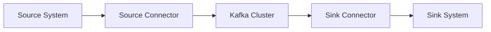

# KafkaConnect：数据转换的艺术

## 1.背景介绍
在当今数据驱动的世界中,高效地在不同系统之间移动和转换数据至关重要。Apache Kafka 作为一个分布式的流处理平台,已经成为处理实时数据的事实标准。然而,要将数据导入和导出 Kafka,还需要一些额外的工具。这就是 Kafka Connect 发挥作用的地方。

Kafka Connect 是一个可扩展的工具,用于在 Apache Kafka 和其他系统之间可靠地传输数据。它为开发人员和数据工程师提供了一种简单的方法,无需编写自定义集成代码就能在系统之间移动大量数据。

### 1.1 Kafka生态系统概述
#### 1.1.1 Kafka的核心组件
#### 1.1.2 Kafka在数据架构中的角色
#### 1.1.3 实时数据处理的重要性

### 1.2 为什么需要Kafka Connect
#### 1.2.1 数据集成的挑战
#### 1.2.2 手动编写集成代码的局限性
#### 1.2.3 Kafka Connect的优势

## 2.核心概念与联系
要充分利用 Kafka Connect,理解其核心概念至关重要。本节将介绍 Kafka Connect 的关键组件以及它们如何协同工作。

### 2.1 连接器(Connector)
#### 2.1.1 源连接器(Source Connector)
#### 2.1.2 汇连接器(Sink Connector)
#### 2.1.3 连接器配置

### 2.2 任务(Task)
#### 2.2.1 任务的作用
#### 2.2.2 任务与连接器的关系
#### 2.2.3 任务的可伸缩性

### 2.3 转换器(Transformer)
#### 2.3.1 转换器的目的
#### 2.3.2 常见的转换操作
#### 2.3.3 自定义转换器

### 2.4 架构


## 3.核心算法原理具体操作步骤
Kafka Connect 依赖于连接器来执行数据传输的繁重工作。连接器通过实现特定的接口与外部系统交互。让我们深入探讨连接器的内部工作原理。

### 3.1 源连接器工作流程
#### 3.1.1 建立与源系统的连接
#### 3.1.2 数据采集与分区
#### 3.1.3 偏移量管理

### 3.2 汇连接器工作流程
#### 3.2.1 从Kafka主题读取记录
#### 3.2.2 执行任何必要的转换
#### 3.2.3 将记录写入目标系统

### 3.3 转换器的应用
#### 3.3.1 单消息转换(SMT)
#### 3.3.2 转换器链
#### 3.3.3 处理异常情况

## 4.数学模型和公式详细讲解举例说明
虽然 Kafka Connect 的用户不需要深入了解底层数学,但是理解一些关键概念和公式可以帮助优化 Kafka Connect 的性能。

### 4.1 数据吞吐量
Kafka Connect 的一个关键指标是其处理数据的速度,也就是吞吐量。吞吐量可以用以下公式表示:

$$ 吞吐量 = \frac{处理的记录数}{时间} $$

例如,如果一个连接器在一分钟内处理了60000条记录,那么其吞吐量为:

$$ 吞吐量 = \frac{60000}{60} = 1000 条记录/秒 $$

### 4.2 并行度
Kafka Connect 通过并行运行任务来提高吞吐量。并行度由以下公式决定:

$$ 并行度 = min(最大任务数, 分区数) $$

其中,最大任务数是连接器配置中指定的,分区数是源或目标 Kafka 主题的分区数。

例如,如果最大任务数设置为10,源 Kafka 主题有20个分区,则并行度为:

$$ 并行度 = min(10, 20) = 10 $$

### 4.3 延迟
延迟是指记录从源系统到目标系统的时间。可以用以下公式估算:

$$ 延迟 = 记录处理时间 + 网络传输时间 $$

减少延迟需要优化连接器配置、网络设置和目标系统的写入性能。

## 5.项目实践：代码实例和详细解释说明
本节提供了一些示例代码片段,展示了如何使用 Kafka Connect 进行常见的数据集成任务。

### 5.1 配置源连接器
```properties
name=file-source
connector.class=FileStreamSource
tasks.max=1
file=/path/to/input/file
topic=connect-test
```
这个配置定义了一个名为 `file-source` 的源连接器,它使用 `FileStreamSource` 类从文件中读取数据,并将其发送到名为 `connect-test` 的 Kafka 主题。

### 5.2 配置汇连接器
```properties
name=jdbc-sink
connector.class=JdbcSinkConnector
tasks.max=1
topics=connect-test
connection.url=jdbc:postgresql://localhost:5432/my-db
connection.user=postgres
connection.password=password
auto.create=true
```
这个配置定义了一个名为 `jdbc-sink` 的汇连接器,它使用 `JdbcSinkConnector` 类消费 `connect-test` 主题的数据,并将其写入 PostgreSQL 数据库。

### 5.3 使用单消息转换(SMT)
```properties
transforms=RouteByCategory
transforms.RouteByCategory.type=org.apache.kafka.connect.transforms.RegexRouter
transforms.RouteByCategory.regex=^(.*),(.*)$
transforms.RouteByCategory.replacement=$1-category
```
这个配置应用了一个名为 `RouteByCategory` 的转换器,它使用正则表达式解析记录的键,并根据匹配的类别将记录路由到不同的主题。

## 6.实际应用场景
Kafka Connect 在各种行业和用例中都有广泛的应用,包括:

### 6.1 数据库变更捕获(CDC)
使用 Kafka Connect 从数据库捕获变更事件,并将其流式传输到下游系统进行实时处理和分析。

### 6.2 日志聚合
收集分布式系统中的日志文件,并将其集中存储在 Kafka 中进行集中处理和监控。

### 6.3 数据湖摄取
将来自不同来源的数据引入数据湖(如 Hadoop)中,以进行批处理和分析。

## 7.工具和资源推荐
以下是一些有助于学习和使用 Kafka Connect 的资源:

- Confluent Hub: 一个由社区贡献的连接器、转换器等组件的生态系统。
- Kafka Connect REST API: 用于管理和监控 Kafka Connect 集群的 RESTful API。
- Confluent 文档: Confluent 提供的全面的 Kafka Connect 文档。
- Kafka Summit 演讲: Kafka Summit 上有许多关于 Kafka Connect 的精彩演讲,分享了实际经验和最佳实践。

## 8.总结：未来发展趋势与挑战
Kafka Connect 已经成为数据集成领域的重要工具,但仍有改进的空间。未来的发展趋势可能包括:

- 更多的云原生连接器,与流行的 SaaS 服务集成。
- 改进的数据治理和安全功能,以满足企业的合规性要求。
- 增强的数据转换能力,支持更复杂的用例。

同时,Kafka Connect 也面临着一些挑战:

- 连接器的开发和维护需要持续的社区努力。
- 配置和部署大规模 Kafka Connect 集群可能很复杂。
- 需要平衡数据一致性和延迟。

尽管存在这些挑战,但 Kafka Connect 仍然是数据工程师和架构师的宝贵工具,它简化了数据集成,加速了实时数据处理的发展。

## 9.附录：常见问题与解答
### 9.1 Kafka Connect 与 Kafka Streams 有何不同?
Kafka Connect 主要用于Kafka与外部系统之间的数据导入和导出,而 Kafka Streams 是一个流处理库,用于在 Kafka 内部构建实时数据处理应用程序。

### 9.2 如何保证 Kafka Connect 的容错性?
Kafka Connect 通过分布式模式实现容错。在分布式模式下,连接器和任务可以在多个工作节点之间自动分配,从而在节点故障时提供故障转移。

### 9.3 如何监控 Kafka Connect 的性能?
Kafka Connect 通过 JMX 指标公开了大量的监控数据,包括每个连接器和任务的状态、吞吐量和错误率。可以使用像 Prometheus 和 Grafana 这样的工具来收集和可视化这些指标。此外,Kafka Connect REST API 也可以用于检查连接器和任务的状态。

作者：禅与计算机程序设计艺术 / Zen and the Art of Computer Programming