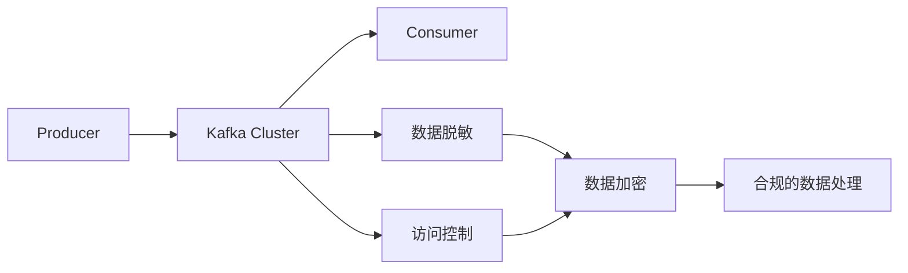

# Kafka与数据隐私：遵守数据法规

## 1.背景介绍
在当今大数据时代,数据隐私和安全已成为企业和用户关注的焦点。随着各国相继出台严格的数据保护法规,如欧盟的GDPR、美国的CCPA等,企业必须采取有效措施来保护用户隐私,规范数据处理流程。作为广泛应用于数据处理领域的分布式消息队列系统,Apache Kafka在帮助企业构建实时数据管道的同时,也面临着如何遵守数据隐私法规的挑战。

本文将深入探讨Kafka在数据隐私保护方面的特性和最佳实践,介绍如何利用Kafka内置的安全机制和外部工具来实现数据脱敏、访问控制、数据留存等,以满足不同地区的数据隐私合规要求。通过对Kafka数据隐私保护的系统性阐述,帮助企业在享受Kafka带来的高吞吐、低延迟、可扩展等优势的同时,构建安全合规的数据处理平台。

### 1.1 数据隐私法规概览
#### 1.1.1 GDPR
#### 1.1.2 CCPA  
#### 1.1.3 其他地区法规

### 1.2 企业面临的数据隐私挑战
#### 1.2.1 用户数据安全
#### 1.2.2 数据泄露风险
#### 1.2.3 合规性要求

## 2.核心概念与联系
### 2.1 Kafka基础架构
#### 2.1.1 Producer与Consumer
#### 2.1.2 Broker与ZooKeeper
#### 2.1.3 Topic与Partition

### 2.2 Kafka安全体系
#### 2.2.1 认证机制
##### 2.2.1.1 SSL
##### 2.2.1.2 SASL
#### 2.2.2 ACL
#### 2.2.3 数据加密

### 2.3 Kafka与数据隐私
#### 2.3.1 个人数据识别
#### 2.3.2 敏感数据处理
#### 2.3.3 数据留存策略



## 3.核心算法原理具体操作步骤
### 3.1 数据脱敏
#### 3.1.1 哈希
#### 3.1.2 加密
#### 3.1.3 数据屏蔽

### 3.2 细粒度访问控制
#### 3.2.1 基于角色的访问控制
#### 3.2.2 基于属性的访问控制
#### 3.2.3 基于策略的访问控制

### 3.3 数据留存与删除
#### 3.3.1 数据保留期设置  
#### 3.3.2 定期数据删除
#### 3.3.3 用户请求数据删除

## 4.数学模型和公式详细讲解举例说明
### 4.1 数据脱敏算法
#### 4.1.1 单向哈希函数
单向哈希函数如MD5、SHA等,可用于敏感信息的不可逆转换:
$$H(x)=y$$
其中$x$为原始敏感信息,$y$为哈希值。

#### 4.1.2 对称加密算法
对称加密算法如AES,使用相同的密钥进行加密解密:
$$E_k(x)=y, D_k(y)=x$$
其中$E_k$为加密函数,$D_k$为解密函数,$k$为密钥。

### 4.2 访问控制模型 
#### 4.2.1 RBAC
基于角色的访问控制(RBAC)通过用户与角色、角色与权限的关联实现:
$$User \rightarrow Role \rightarrow Permission$$

#### 4.2.2 ABAC
基于属性的访问控制(ABAC)通过属性条件表达式定义策略:
$$\{Subject, Action, Resource\} \rightarrow Decision$$

## 5.项目实践：代码实例和详细解释说明
### 5.1 Kafka SSL配置
```properties
security.protocol=SSL
ssl.truststore.location=/var/private/ssl/kafka.client.truststore.jks
ssl.truststore.password=test1234
ssl.keystore.location=/var/private/ssl/kafka.client.keystore.jks
ssl.keystore.password=test1234
ssl.key.password=test1234
```
- `security.protocol`指定安全协议为SSL
- `ssl.truststore.location`指定信任库位置
- `ssl.keystore.location`指定密钥库位置

### 5.2 Kafka ACL配置
```bash
bin/kafka-acls.sh --authorizer-properties zookeeper.connect=localhost:2181 --add --allow-principal User:Alice --operation Read --topic test
```
上述命令授予用户Alice对test主题的读取权限。

### 5.3 Kafka数据脱敏
使用Kafka Connect对数据进行脱敏转换:
```java
public class MaskField<R extends ConnectRecord<R>> implements Transformation<R> {
    @Override
    public R apply(R record) {
        final String value = (String) record.value();
        String maskedValue = value.replaceAll("\d{4}", "****");
        return record.newRecord(record.topic(), record.kafkaPartition(), record.keySchema(), record.key(),
                record.valueSchema(), maskedValue, record.timestamp());
    }
}
```
上述代码对记录中的敏感信息进行掩码处理。

## 6.实际应用场景
### 6.1 金融行业
#### 6.1.1 交易数据脱敏
#### 6.1.2 客户信息加密存储
#### 6.1.3 合规审计日志留存

### 6.2 医疗健康领域
#### 6.2.1 患者隐私保护
#### 6.2.2 处方数据脱敏
#### 6.2.3 医疗数据访问控制

### 6.3 电商平台
#### 6.3.1 用户行为数据脱敏
#### 6.3.2 订单信息加密处理  
#### 6.3.3 物流信息隐私保护

## 7.工具和资源推荐
### 7.1 Kafka官方文档
- [Kafka Security](https://kafka.apache.org/documentation/#security)
- [Kafka Encryption](https://kafka.apache.org/documentation/#encryption)

### 7.2 数据脱敏工具
- [Apache Ranger](https://ranger.apache.org/)
- [Informatica Data Privacy Management](https://www.informatica.com/products/data-security/data-privacy-management.html)

### 7.3 Kafka第三方安全组件
- [Confluent Security Plugins](https://docs.confluent.io/platform/current/security/overview.html)  
- [StreamSets Data Collector](https://streamsets.com/products/dataops-platform/data-collector/)

## 8.总结：未来发展趋势与挑战
### 8.1 数据隐私法规趋严
随着公众隐私保护意识的提高,各国将出台更加严格的数据隐私保护法律,企业需持续关注法规动态,及时调整数据治理策略。

### 8.2 数据安全技术创新
同态加密、多方安全计算、联邦学习等新兴隐私保护技术将为大数据处理领域带来变革,Kafka有望与之深度融合,实现隐私保护与数据价值的平衡。

### 8.3 隐私保护与性能的权衡
在追求数据隐私安全的同时,如何最小化对Kafka系统性能的影响,优化数据脱敏、加密算法,是一个持续探索的课题。

## 9.附录：常见问题与解答
### Q1: Kafka是否支持数据加密？
A1: 是的,Kafka支持SSL/TLS协议实现客户端与服务端之间的通信加密,并可对落盘数据进行加密存储。

### Q2: Kafka如何保证数据不被非法访问？
A2: Kafka提供了认证与ACL机制,可对用户身份进行验证,并根据预设的访问控制策略授予用户相应的操作权限。

### Q3: 如何实现Kafka数据的脱敏？
A3: 可利用Kafka Connect或Streams等组件,对Producer写入的数据进行拦截处理,利用哈希、加密、屏蔽等算法对敏感数据进行脱敏,再将结果写入下游Topic。

作者：禅与计算机程序设计艺术 / Zen and the Art of Computer Programming