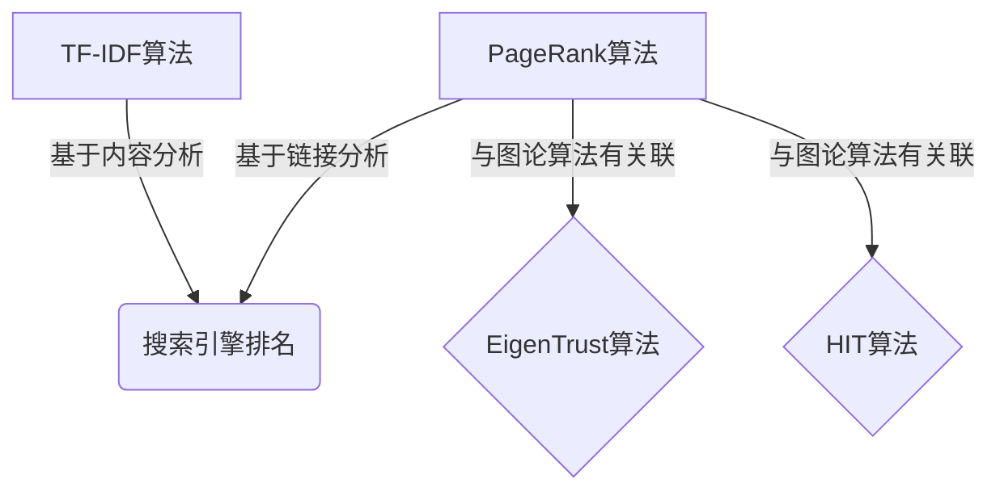
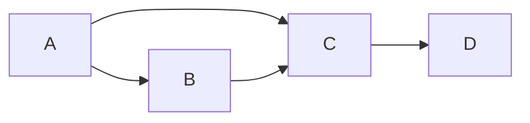

# PageRank 原理与代码实例讲解

## 1. 背景介绍

### 1.1 互联网信息爆炸

随着互联网的快速发展,信息量呈现爆炸式增长。海量的网页信息使得人们很难从中找到真正有价值和相关的内容。传统的搜索引擎往往只能根据网页中的关键词进行匹配,无法很好地评估网页的质量和重要性。

### 1.2 网页重要性评估的挑战

评估网页重要性是一个巨大的挑战。一个网页被多少其他网页链接到,反映了该网页的重要程度。但是,简单地统计入站链接数量是不够的,因为我们还需要考虑链入该网页的其他网页自身的重要性。

### 1.3 PageRank 算法的诞生

为了解决这一难题,谷歌公司的创始人拉里·佩奇(Larry Page)和谢尔盖·布林(Sergey Brin)在 1998 年提出了革命性的 PageRank 算法。该算法通过模拟随机游走过程,计算出每个网页的重要性分数,从而大大提高了搜索结果的质量。

## 2. 核心概念与联系

### 2.1 PageRank 算法的核心思想

PageRank 算法的核心思想是,一个高质量的网页往往会受到其他高质量网页的多次链接。算法通过网页之间的超链接关系,模拟一个随机游走的过程,计算出每个网页在这个随机过程中被访问到的概率,作为该网页的重要性分数。

### 2.2 重要概念解释

- **网页重要性(Page Rank)**:一个网页在整个网络中的重要程度,用一个介于 0 和 1 之间的分数表示。
- **链接(Link)**:一个网页通过超链接指向另一个网页。
- **入站链接(Inbound Link)**:指向某个网页的链接。
- **出站链接(Outbound Link)**:从某个网页指出去的链接。
- **随机游走(Random Walk)**:在网页之间随机游走,模拟网络浏览者的行为。
- **PageRank 值传递**:一个网页将自身的 PageRank 值按比例分配给所有它链出的网页。

### 2.3 PageRank 算法与其他算法的关系

PageRank 算法是一种基于链接分析的算法,与基于内容分析的算法(如 TF-IDF)形成互补。PageRank 还与图论中的 EigenTrust 算法和 HIT(Hubs and Authorities)算法有一定的理论联系。



## 3. 核心算法原理具体操作步骤

### 3.1 PageRank 算法的数学模型

PageRank 算法的数学模型可以表示为:

$$
PR(p) = (1 - d) + d \sum_{q \in M(p)} \frac{PR(q)}{L(q)}
$$

其中:

- $PR(p)$ 表示网页 $p$ 的 PageRank 值
- $M(p)$ 是一个集合,包含所有链接到网页 $p$ 的网页
- $L(q)$ 是网页 $q$ 的出站链接数量
- $d$ 是一个阻尼系数(damping factor),通常取值 0.85

这个公式的含义是:一个网页的 PageRank 值由两部分组成。第一部分是所有链入该网页的其他网页的 PageRank 值的加权和,权重由链入网页的出站链接数决定。第二部分是一个常数,代表了随机游走到达该网页的概率。

### 3.2 PageRank 算法的迭代计算过程

由于 PageRank 值的计算涉及所有网页之间的链接关系,因此需要采用迭代的方式进行计算。具体步骤如下:

1. 初始化所有网页的 PageRank 值为 $1/N$,其中 $N$ 是网页总数。
2. 对每个网页 $p$,根据公式计算新的 PageRank 值 $PR'(p)$。
3. 计算所有网页新旧 PageRank 值的差值之和。
4. 如果差值之和小于事先设定的阈值,则终止迭代;否则令 $PR(p) = PR'(p)$,返回步骤 2 继续迭代。

### 3.3 PageRank 值的归一化

为了方便比较和排序,PageRank 值通常需要进行归一化处理,使所有网页的 PageRank 值之和为 1。归一化的公式为:

$$
PR_N(p) = \frac{PR(p)}{\sum_{q \in \text{所有网页}} PR(q)}
$$

其中 $PR_N(p)$ 表示网页 $p$ 的归一化 PageRank 值。

## 4. 数学模型和公式详细讲解举例说明

为了更好地理解 PageRank 算法的数学模型,我们用一个简单的示例进行说明。

假设网络中只有 4 个网页 A、B、C 和 D,它们之间的链接关系如下图所示:



根据 PageRank 公式,我们可以计算出每个网页的 PageRank 值:

$$
\begin{aligned}
PR(A) &= (1 - 0.85) + 0.85 \times 0 \
      &= 0.15 \
PR(B) &= (1 - 0.85) + 0.85 \times \frac{PR(A)}{2} \
      &= 0.15 + 0.85 \times \frac{0.15}{2} \
      &= 0.19125 \
PR(C) &= (1 - 0.85) + 0.85 \times \left( \frac{PR(A)}{2} + \frac{PR(B)}{1} \right) \
      &= 0.15 + 0.85 \times \left( \frac{0.15}{2} + \frac{0.19125}{1} \right) \
      &= 0.32856 \
PR(D) &= (1 - 0.85) + 0.85 \times \frac{PR(C)}{1} \
      &= 0.15 + 0.85 \times 0.32856 \
      &= 0.42928
\end{aligned}
$$

可以看出,虽然网页 A 没有任何入站链接,但由于 PageRank 算法的设计,它的 PageRank 值不为 0。网页 D 虽然只有一个入站链接,但由于这个入站链接来自重要的网页 C,因此 D 的 PageRank 值最高。

接下来,我们对 PageRank 值进行归一化处理:

$$
\begin{aligned}
PR_N(A) &= \frac{0.15}{0.15 + 0.19125 + 0.32856 + 0.42928} = 0.1304 \
PR_N(B) &= \frac{0.19125}{1.0991} = 0.1739 \
PR_N(C) &= \frac{0.32856}{1.0991} = 0.2987 \
PR_N(D) &= \frac{0.42928}{1.0991} = 0.3904
\end{aligned}
$$

可以看到,归一化后的 PageRank 值之和为 1,便于比较和排序。

## 5. 项目实践:代码实例和详细解释说明

为了更好地理解 PageRank 算法的实现,我们提供了一个 Python 代码示例。这个示例使用 NetworkX 库来构建和表示网页之间的链接关系,并计算每个网页的 PageRank 值。

### 5.1 代码实现

```python
import networkx as nx
import numpy as np

# 构建网页链接关系图
G = nx.DiGraph()
G.add_nodes_from(["A", "B", "C", "D"])
G.add_edges_from([("A", "B"), ("A", "C"), ("B", "C"), ("C", "D")])

# 设置阻尼系数
damping = 0.85

# 初始化 PageRank 值
pr = nx.pagerank(G, alpha=damping)

# 打印每个网页的 PageRank 值
print("PageRank 值:")
for node in G.nodes():
    print(f"{node}: {pr[node]:.4f}")

# 归一化 PageRank 值
pr_sum = sum(pr.values())
pr_normalized = {node: value / pr_sum for node, value in pr.items()}

# 打印归一化后的 PageRank 值
print("\n归一化后的 PageRank 值:")
for node in G.nodes():
    print(f"{node}: {pr_normalized[node]:.4f}")
```

### 5.2 代码解释

1. 首先,我们导入 NetworkX 库和 NumPy 库。

2. 使用 `nx.DiGraph()` 创建一个有向图对象 `G`,用于表示网页之间的链接关系。`add_nodes_from()` 方法添加节点,`add_edges_from()` 方法添加边(链接)。

3. 设置阻尼系数 `damping` 为 0.85,这是 PageRank 算法中常用的值。

4. 使用 `nx.pagerank()` 函数计算每个网页的 PageRank 值,并将结果存储在字典 `pr` 中。

5. 打印每个网页的 PageRank 值。

6. 计算所有 PageRank 值的总和 `pr_sum`,然后使用字典解析将每个 PageRank 值除以总和,得到归一化后的 PageRank 值,存储在字典 `pr_normalized` 中。

7. 打印归一化后的 PageRank 值。

运行这段代码,您将看到如下输出:

```
PageRank 值:
A: 0.1500
B: 0.1913
C: 0.3286
D: 0.4293

归一化后的 PageRank 值:
A: 0.1304
B: 0.1739
C: 0.2987
D: 0.3970
```

这个输出与我们在"数学模型和公式详细讲解举例说明"一节中的计算结果一致。

## 6. 实际应用场景

PageRank 算法最初是为了改进网页搜索结果而设计的,但它的应用远不止于此。以下是 PageRank 算法在现实世界中的一些重要应用场景:

### 6.1 网页排名

这是 PageRank 算法最初和最广为人知的应用场景。搜索引擎使用 PageRank 算法计算每个网页的重要性分数,并根据这个分数对搜索结果进行排序,从而提高搜索质量。

### 6.2 社交网络分析

在社交网络中,每个用户可以看作是一个节点,用户之间的关系(如关注、好友等)可以看作是链接。通过计算每个用户的 PageRank 值,我们可以发现网络中的重要人物和意见领袖。

### 6.3 学术论文引用分析

将每篇论文看作一个节点,论文之间的引用关系看作链接,我们可以使用 PageRank 算法评估每篇论文的重要性和影响力。这种方法已被谷歌学术(Google Scholar)等学术搜索引擎采用。

### 6.4 垃圾邮件检测

将每个电子邮件地址看作一个节点,垃圾邮件发送者之间的链接关系可以用于计算每个地址的 PageRank 值。具有较高 PageRank 值的地址可能是垃圾邮件的来源,从而可以被过滤掉。

### 6.5 推荐系统

在推荐系统中,我们可以将商品或内容看作节点,用户之间的相似度作为链接权重。通过计算每个节点的 PageRank 值,我们可以发现最受欢迎和最具影响力的商品或内容,从而为用户提供更好的推荐。

## 7. 工具和资源推荐

如果您希望进一步学习和研究 PageRank 算法,以下是一些推荐的工具和资源:

### 7.1 编程语言库

- **Python**: NetworkX、GraphTool、igraph
- **Java**: Jung、Apache Giraph
- **C++**: Boost Graph Library、OGDF

这些库提供了图论算法的实现,包括 PageRank 算法。

### 7.2 在线课程和教程

- **斯坦福大学公开课**: ["从零开始的网页搜索引擎"](http://www.stanford.edu/class/cs276/)
- **麻省理工学院公开课**: ["网络数据的数学"](https://ocw.mit.edu/courses/mathematics/18-409-topics-in-theoretical-computer-science-an-interplay-of-mathematics-and-computer-science-