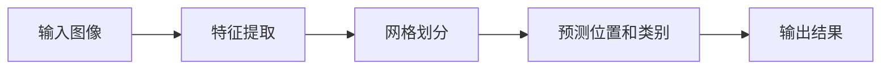

## 1.背景介绍

在计算机视觉领域，对象检测一直是一个热门话题。从最早的边缘检测、特征匹配，到后来的滑动窗口、图像金字塔，再到现在的深度学习方法，对象检测的技术已经发生了巨大的变化。其中，YOLO（You Only Look Once）作为一种端到端的对象检测算法，以其出色的实时性和准确性，成为了对象检测领域的重要算法。

## 2.核心概念与联系

YOLO算法的主要思想是将对象检测问题转化为回归问题，直接预测出图像中物体的类别和位置，从而实现快速、准确的对象检测。这种方法与传统的滑动窗口和区域建议网络（RPN）有着本质的不同，它摒弃了复杂的管道操作，采用单一的神经网络实现了端到端的对象检测。

YOLO算法可以分为两个主要部分：特征提取和检测。特征提取部分，YOLO使用了类似于VGG的深层卷积网络结构进行特征提取。检测部分，YOLO将输入图像划分为$S \times S$的网格，每个网格负责预测其所包含物体的位置和类别。



## 3.核心算法原理具体操作步骤

YOLO算法的实现主要包含以下步骤：

1. **特征提取**：使用深层卷积网络对输入图像进行特征提取。这个网络结构类似于VGG，包含多个卷积层和池化层。

2. **网格划分**：将特征图划分为$S \times S$的网格，每个网格负责预测其所包含物体的位置和类别。

3. **预测位置和类别**：每个网格预测$B$个边界框和对应的置信度，以及$C$个类别的概率。边界框的置信度表示该框内存在物体的概率以及预测框准确度的乘积。

4. **非极大值抑制**：对预测结果进行非极大值抑制，去除重叠度高的边界框，得到最终的检测结果。

## 4.数学模型和公式详细讲解举例说明

YOLO算法的预测目标包括每个网格的边界框（包括中心位置$x, y$，宽度和高度$w, h$）、置信度以及类别概率。因此，对于一个$S \times S$的网格，$B$个边界框和$C$个类别，YOLO需要预测的总参数数量为$S \times S \times (5B + C)$。

YOLO算法的损失函数包括位置误差、大小误差、置信度误差和类别误差四部分，分别表示预测框的位置、大小、置信度和类别的预测误差。

位置误差和大小误差使用均方误差（MSE）来计算，公式如下：

$$
\sum_{i=0}^{S^2}\sum_{j=0}^{B}1_{ij}^{obj}[(x_i-\hat{x}_i)^2+(y_i-\hat{y}_i)^2]
$$

$$
\sum_{i=0}^{S^2}\sum_{j=0}^{B}1_{ij}^{obj}[(\sqrt{w_i}-\sqrt{\hat{w}_i})^2+(\sqrt{h_i}-\sqrt{\hat{h}_i})^2]
$$

其中，$1_{ij}^{obj}$表示第$i$个网格中第$j$个边界框内是否存在物体。

置信度误差和类别误差使用交叉熵损失来计算，公式如下：

$$
\sum_{i=0}^{S^2}\sum_{j=0}^{B}1_{ij}^{obj}(C_i-\hat{C}_i)^2 + \sum_{i=0}^{S^2}\sum_{j=0}^{B}1_{ij}^{noobj}(C_i-\hat{C}_i)^2
$$

$$
\sum_{i=0}^{S^2}1_i^{obj}\sum_{c \in classes}(p_i(c)-\hat{p}_i(c))^2
$$

其中，$C_i$表示预测框的置信度，$p_i(c)$表示第$i$个网格的类别概率。

## 5.项目实践：代码实例和详细解释说明

在Python环境下，我们可以使用Keras库来实现YOLO算法。首先，我们需要定义模型的结构。这里，我们使用了一个类似于VGG的卷积网络结构。

```python
from keras.models import Sequential
from keras.layers import Conv2D, MaxPooling2D, Flatten, Dense

model = Sequential()
model.add(Conv2D(64, (3, 3), activation='relu', padding='same', input_shape=(448, 448, 3)))
model.add(MaxPooling2D(pool_size=(2, 2)))
model.add(Conv2D(128, (3, 3), activation='relu', padding='same'))
model.add(MaxPooling2D(pool_size=(2, 2)))
model.add(Conv2D(256, (3, 3), activation='relu', padding='same'))
model.add(MaxPooling2D(pool_size=(2, 2)))
model.add(Conv2D(512, (3, 3), activation='relu', padding='same'))
model.add(MaxPooling2D(pool_size=(2, 2)))
model.add(Conv2D(1024, (3, 3), activation='relu', padding='same'))
model.add(Conv2D(1024, (3, 3), activation='relu', padding='same'))
model.add(Conv2D(1024, (3, 3), activation='relu', padding='same'))
model.add(Flatten())
model.add(Dense(4096, activation='relu'))
model.add(Dense(S*S*(5*B+C), activation='linear'))
```

接下来，我们需要定义损失函数。在Keras中，我们可以通过自定义损失函数来实现YOLO的损失函数。

```python
def yolo_loss(y_true, y_pred):
    # 定义各部分损失的权重
    lambda_coord = 5
    lambda_noobj = 0.5

    # 提取预测值和真实值的各部分
    pred_boxes = K.reshape(y_pred[..., :5*B], (-1, S, S, B, 5))
    true_boxes = K.reshape(y_true[..., :5*B], (-1, S, S, B, 5))
    pred_class_probs = K.reshape(y_pred[..., 5*B:], (-1, S, S, C))
    true_class_probs = K.reshape(y_true[..., 5*B:], (-1, S, S, C))

    # 计算各部分损失
    coord_loss = lambda_coord * K.sum(K.square(true_boxes[..., :2] - pred_boxes[..., :2]) * true_boxes[..., 4], axis=-1)
    size_loss = lambda_coord * K.sum(K.square(K.sqrt(true_boxes[..., 2:4]) - K.sqrt(pred_boxes[..., 2:4])) * true_boxes[..., 4], axis=-1)
    conf_loss = K.sum(K.square(true_boxes[..., 4] - pred_boxes[..., 4]), axis=-1)
    class_loss = K.sum(K.square(true_class_probs - pred_class_probs), axis=-1)

    # 计算总损失
    total_loss = coord_loss + size_loss + conf_loss + class_loss
    return total_loss
```

最后，我们需要编译模型，并使用数据进行训练。

```python
model.compile(loss=yolo_loss, optimizer='adam')

model.fit(x_train, y_train, batch_size=32, epochs=10)
```

## 6.实际应用场景

YOLO算法在许多实际应用场景中都有着广泛的应用，包括：

- **自动驾驶**：在自动驾驶中，YOLO算法可以用于实时检测路面上的行人、车辆、交通标志等对象，为决策系统提供重要的信息。

- **视频监控**：在视频监控中，YOLO算法可以用于实时检测视频中的异常行为，如闯入、打斗等，及时报警。

- **机器人视觉**：在机器人视觉中，YOLO算法可以用于实时检测机器人周围的环境和物体，帮助机器人进行导航和操作。

## 7.工具和资源推荐

以下是一些关于YOLO算法的学习和实践资源：

- [Darknet](https://github.com/pjreddie/darknet)：YOLO算法的原始实现，包含了训练和测试的代码以及预训练模型。

- [YOLOv3 Keras](https://github.com/qqwweee/keras-yolo3)：YOLOv3的Keras实现，包含了训练和测试的代码以及预训练模型。

- [YOLOv3 PyTorch](https://github.com/ultralytics/yolov3)：YOLOv3的PyTorch实现，包含了训练和测试的代码以及预训练模型。

- [COCO数据集](http://cocodataset.org/)：用于训练和测试YOLO算法的大型对象检测数据集。

## 8.总结：未来发展趋势与挑战

YOLO算法以其出色的实时性和准确性，成为了对象检测领域的重要算法。然而，YOLO算法也存在一些问题和挑战，例如对小物体的检测性能不佳，对相互重叠的物体的检测性能不佳等。未来，我们期待YOLO算法能进一步优化和改进，解决这些问题，为我们提供更好的对象检测服务。

## 9.附录：常见问题与解答

1. **为什么YOLO算法可以实现实时对象检测？**

    YOLO算法将对象检测问题转化为回归问题，直接预测出图像中物体的类别和位置，避免了传统方法中复杂的管道操作，因此可以实现实时对象检测。

2. **YOLO算法如何处理多尺度问题？**

    YOLO算法通过使用多尺度特征图进行预测，可以一定程度上处理多尺度问题。此外，YOLOv3引入了多尺度预测，进一步改善了对不同尺度物体的检测性能。

3. **YOLO算法如何处理相互重叠的物体？**

    YOLO算法通过预测多个边界框和对应的置信度，可以一定程度上处理相互重叠的物体。然而，对于高度重叠的物体，YOLO算法的检测性能仍有待提高。

作者：禅与计算机程序设计艺术 / Zen and the Art of Computer Programming