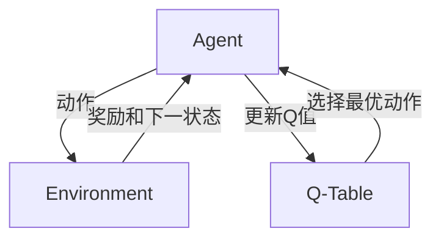

# Q-Learning - 原理与代码实例讲解

## 1.背景介绍

强化学习(Reinforcement Learning, RL)是机器学习的一个重要分支,它研究如何让智能体(Agent)在与环境的交互中学习最优策略,以获得最大的累积奖励。Q-Learning 作为强化学习中的一种重要算法,因其简洁高效而被广泛应用于各种场景,如自动驾驶、智能推荐、游戏 AI 等领域。

本文将从算法原理入手,深入探讨 Q-Learning 的数学模型与核心思想,并结合具体的代码实例进行讲解,帮助读者全面掌握这一强大算法。

### 1.1 强化学习基本概念
#### 1.1.1 Agent 与 Environment
#### 1.1.2 State、Action 与 Reward
#### 1.1.3 策略(Policy)与价值函数(Value Function)

### 1.2 Q-Learning 的由来与发展
#### 1.2.1 时间差分学习(Temporal Difference Learning)
#### 1.2.2 Watkins 的开创性工作
#### 1.2.3 Q-Learning 的改进与拓展

## 2.核心概念与联系

Q-Learning 的核心是学习一个 Q 函数,它表示在状态 s 下采取动作 a 的价值。通过不断更新 Q 值,最终得到最优策略。

### 2.1 Q 函数与最优策略
#### 2.1.1 Q 函数的定义
#### 2.1.2 最优 Q 函数与最优策略的关系
#### 2.1.3 Q 函数的收敛性证明

### 2.2 Q-Learning 与其他算法的联系
#### 2.2.1 Q-Learning 与值迭代(Value Iteration)
#### 2.2.2 Q-Learning 与蒙特卡洛方法(Monte Carlo Methods)
#### 2.2.3 Q-Learning 与 Sarsa 算法

### 2.3 Q-Learning 的局限性
#### 2.3.1 探索与利用的平衡问题
#### 2.3.2 维度灾难(Curse of Dimensionality)
#### 2.3.3 离线学习与在线学习

## 3.核心算法原理具体操作步骤

Q-Learning 的核心是通过不断更新 Q 表来逼近最优 Q 函数。每次更新使用如下公式:

$$Q(s_t,a_t) \leftarrow Q(s_t,a_t) + \alpha [r_{t+1} + \gamma \max_a Q(s_{t+1},a) - Q(s_t,a_t)]$$

其中,$s_t$和$a_t$分别表示 t 时刻的状态和动作,$r_{t+1}$为执行动作后获得的奖励,$\alpha$为学习率,$\gamma$为折扣因子。

### 3.1 初始化 Q 表
#### 3.1.1 Q 表的数据结构选择
#### 3.1.2 Q 值的初始化策略

### 3.2 选择动作
#### 3.2.1 $\epsilon$-贪婪策略
#### 3.2.2 软性最大(Softmax)策略

### 3.3 执行动作并观察奖励
#### 3.3.1 与环境交互
#### 3.3.2 即时奖励与未来奖励

### 3.4 更新 Q 值
#### 3.4.1 确定学习率$\alpha$与折扣因子$\gamma$
#### 3.4.2 目标 Q 值的计算
#### 3.4.3 Q 表的更新

### 3.5 重复迭代直至收敛
#### 3.5.1 设定迭代次数或误差阈值
#### 3.5.2 评估算法收敛性

## 4.数学模型和公式详细讲解举例说明

Q-Learning 可以看作是马尔可夫决策过程(Markov Decision Process, MDP)中寻找最优策略的一种动态规划方法。

### 4.1 马尔可夫决策过程
#### 4.1.1 MDP 的定义与组成要素
#### 4.1.2 MDP 的最优策略与贝尔曼方程(Bellman Equation)

### 4.2 Q 函数与贝尔曼最优方程
#### 4.2.1 Q 函数作为状态-动作值函数
#### 4.2.2 Q 函数与最优 Q 函数
#### 4.2.3 Q 函数的贝尔曼最优方程

$$Q^*(s,a) = \mathbb{E}[r_{t+1} + \gamma \max_{a'} Q^*(s_{t+1},a') | s_t=s, a_t=a]$$

### 4.3 Q-Learning 的收敛性证明
#### 4.3.1 Q-Learning 作为随机逼近过程
#### 4.3.2 收敛性定理与证明思路
#### 4.3.3 Q-Learning 收敛于最优 Q 函数

## 5.项目实践：代码实例和详细解释说明

下面以一个简单的网格世界(Grid World)为例,演示 Q-Learning 算法的具体实现。

### 5.1 环境设置
#### 5.1.1 网格世界的状态空间与动作空间
#### 5.1.2 奖励函数的设计
#### 5.1.3 终止状态的定义

### 5.2 Q-Learning 算法实现

```python
import numpy as np

# 初始化 Q 表
Q = np.zeros((n_states, n_actions))

# 设置超参数
alpha = 0.1  # 学习率
gamma = 0.9  # 折扣因子
epsilon = 0.1  # 探索概率

# Q-Learning 主循环
for episode in range(n_episodes):
    state = env.reset()  # 初始化环境,获得初始状态

    while True:
        # 选择动作
        if np.random.uniform() < epsilon:
            action = env.action_space.sample()  # 探索
        else:
            action = np.argmax(Q[state])  # 利用

        # 执行动作,观察下一状态和奖励
        next_state, reward, done, _ = env.step(action)

        # 更新 Q 值
        target = reward + gamma * np.max(Q[next_state])
        Q[state][action] += alpha * (target - Q[state][action])

        state = next_state  # 更新状态

        if done:
            break
```

### 5.3 代码解释
#### 5.3.1 Q 表的初始化
#### 5.3.2 超参数设置
#### 5.3.3 动作选择策略
#### 5.3.4 Q 值更新公式
#### 5.3.5 终止条件判断

## 6.实际应用场景

Q-Learning 在许多领域都有广泛应用,下面列举几个典型场景。

### 6.1 智能交通
#### 6.1.1 自动驾驶中的决策控制
#### 6.1.2 交通信号灯的优化调度

### 6.2 推荐系统
#### 6.2.1 基于 Q-Learning 的在线推荐
#### 6.2.2 用户行为建模与兴趣预测

### 6.3 机器人控制
#### 6.3.1 机器人运动规划
#### 6.3.2 机械臂操作的策略学习

### 6.4 电子游戏 AI
#### 6.4.1 游戏角色的自主决策
#### 6.4.2 对抗性策略的学习

## 7.工具和资源推荐

### 7.1 开源框架
#### 7.1.1 OpenAI Gym
#### 7.1.2 TensorFlow
#### 7.1.3 PyTorch

### 7.2 在线课程
#### 7.2.1 David Silver 的强化学习课程
#### 7.2.2 Denny Britz 的《强化学习入门》
#### 7.2.3 Udacity 的《强化学习纳米学位》

### 7.3 经典论文与书籍
#### 7.3.1 Richard S. Sutton 的《强化学习》
#### 7.3.2 Christopher J.C.H. Watkins 的 Q-Learning 论文
#### 7.3.3 Csaba Szepesvári 的《强化学习算法》

## 8.总结：未来发展趋势与挑战

Q-Learning 虽然已经取得了巨大成功,但仍面临许多挑战和改进方向。

### 8.1 基于函数逼近的 Q-Learning
#### 8.1.1 深度 Q 网络(DQN)
#### 8.1.2 双重 Q 学习(Double Q-Learning)

### 8.2 异步与分布式 Q-Learning
#### 8.2.1 异步优势演员-评论家算法(A3C)
#### 8.2.2 分布式 Q-Learning 框架

### 8.3 Q-Learning 与其他学习范式的结合
#### 8.3.1 Q-Learning 与迁移学习
#### 8.3.2 Q-Learning 与元学习
#### 8.3.3 Q-Learning 与终身学习

### 8.4 Q-Learning 的理论研究
#### 8.4.1 收敛性与复杂度分析
#### 8.4.2 探索策略的理论保障
#### 8.4.3 Q-Learning 的泛化误差界

## 9.附录：常见问题与解答

### 9.1 Q-Learning 适用于哪些问题?
### 9.2 Q-Learning 和深度强化学习有什么区别?
### 9.3 Q-Learning 容易陷入局部最优吗?
### 9.4 Q-Learning 对探索与利用的平衡有什么要求?
### 9.5 Q 值更新中的学习率和折扣因子如何选取?

Q-Learning 作为强化学习的入门算法,其简洁高效的特点使其成为许多复杂算法的基础。深入理解 Q-Learning 的原理和实现,对于进一步学习强化学习的其他算法大有裨益。

相信通过本文的讲解,读者已经对 Q-Learning 有了全面的认识。在实践中灵活运用 Q-Learning,将有助于解决许多具有挑战性的决策问题。让我们一起探索强化学习的奇妙世界,用智能算法创造更加美好的未来!



作者：禅与计算机程序设计艺术 / Zen and the Art of Computer Programming