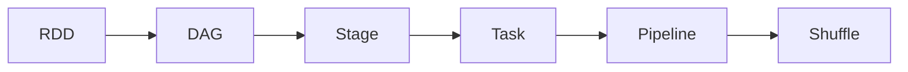

# Spark Stage原理与代码实例讲解

## 1.背景介绍
Apache Spark是一个快速、通用的大规模数据处理引擎,建立在Hadoop MapReduce模型的基础之上,专为迭代算法、交互式查询和流处理而设计。Spark中一个非常重要的概念就是Stage(阶段)。深入理解Spark Stage的原理和运作机制,对于优化Spark程序性能、提高运行效率至关重要。本文将从Spark Stage的核心概念入手,结合数学模型、代码实例,全面深入地讲解Spark Stage的原理。

### 1.1 Spark基本架构
#### 1.1.1 Spark生态系统组件
#### 1.1.2 Spark核心RDD编程模型
#### 1.1.3 Spark运行时架构

### 1.2 Stage在Spark中的作用
#### 1.2.1 Stage定义
#### 1.2.2 Stage在Spark任务调度中的地位
#### 1.2.3 Stage与Spark DAG关系

## 2.核心概念与联系
要掌握Spark Stage原理,首先需要理解以下几个核心概念:
### 2.1 RDD(Resilient Distributed Dataset)
#### 2.1.1 RDD定义与特性
#### 2.1.2 RDD五大属性
#### 2.1.3 RDD操作:Transformation与Action
### 2.2 DAG(Directed Acyclic Graph)
#### 2.2.1 DAG定义
#### 2.2.2 DAG有向无环图
#### 2.2.3 Spark DAG Stage划分算法
### 2.3 Shuffle
#### 2.3.1 Shuffle定义
#### 2.3.2 Shuffle操作原理
#### 2.3.3 Shuffle引起的Stage划分
### 2.4 Pipeline
#### 2.4.1 Pipeline定义
#### 2.4.2 Pipeline在Stage中的应用
### 2.5 核心概念之间的关系


## 3.核心算法原理具体操作步骤
### 3.1 Stage的生成
#### 3.1.1 RDD依赖关系分析
#### 3.1.2 DAG图构建
#### 3.1.3 Stage划分算法
### 3.2 Stage的提交
#### 3.2.1 Stage提交条件
#### 3.2.2 Stage提交流程
#### 3.2.3 Stage数据本地性优化
### 3.3 Stage的执行
#### 3.3.1 Stage调度原理
#### 3.3.2 Task的执行
#### 3.3.3 Shuffle过程解析

## 4.数学模型和公式详细讲解举例说明
### 4.1 DAG图割算法
Spark基于RDD之间的依赖关系,构建DAG图,并根据Shuffle依赖将DAG图划分成互不依赖的多个Stage。这个划分过程可以通过图割(Graph Cuts)算法来实现。

设DAG图为$G=(V,E)$,其中$V$表示顶点集,每个顶点对应一个RDD;$E$表示有向边集,如果RDD $x$是RDD $y$的父RDD,则存在有向边$y \rightarrow x$。若$y \rightarrow x$为宽依赖,则我们称之为Shuffle边,Shuffle边集记为$E_s$。

割(Cut)定义为将$V$划分为两个不相交子集$S$和$T=V-S$的一种方案,其割边集为:
$$C(S,T)=\{(u,v) \in E: u \in S, v \in T\}$$

最小割问题就是要找到一个割使得$\left | C(S,T) \right |$最小。根据最大流最小割定理,该问题可以转化为在残差网络中求最大流问题。

Spark中的Stage划分可以看作是在DAG图上不断进行最小割,直到不存在Shuffle边为止。割掉的Shuffle边就形成了Stage的边界。

### 4.2 流水线调度模型
Spark采用了流水线调度模型来优化Stage的执行。如果某个Stage的所有Task能够在同一个Pipeline中执行,就可以显著减少数据的落地,大大提升执行效率。

设Stage $i$包含$n_i$个Task,Task $j$的执行时间为$t_{ij}$,数据传输时间为$c_{ij}$,则Stage $i$的执行时间为:

$$T_i = \max_{1 \leq j \leq n_i} (t_{ij} + c_{ij})$$

如果Stage $i$和Stage $i+1$能够流水线化执行,则有:

$$\begin{aligned}
T_{i,i+1}^{pipeline} &= \max(\max_{1 \leq j \leq n_i} (t_{ij} + c_{ij}), \max_{1 \leq j \leq n_{i+1}} (t_{i+1,j} + c_{i+1,j}))\\
&\leq T_i + T_{i+1}
\end{aligned}$$

可见流水线调度能够有效减少Stage的整体执行时间。Spark会自动根据Stage的依赖关系,尽可能地将多个Stage划分到同一个Pipeline中。

## 5.项目实践:代码实例和详细解释说明

下面通过一个实际的Spark代码例子,来演示Spark Stage的生成与执行过程。

```scala
val textFile = sc.textFile("hdfs://...")
val counts = textFile
    .flatMap(line => line.split(" "))
    .map(word => (word, 1))
    .reduceByKey(_ + _)
counts.saveAsTextFile("hdfs://...")
```

1. textFile是一个HadoopRDD,代表从HDFS中读取的原始数据。
2. flatMap是一个Transformation操作,将行数据split成单词,生成FlatMappedRDD。
3. map是一个Transformation操作,将单词映射为(word, 1)的形式,生成MappedRDD。
4. reduceByKey是一个Transformation操作,但它引入了Shuffle依赖,生成ShuffledRDD。
5. saveAsTextFile是一个Action操作,触发Job的提交。

在实际执行时,Spark会生成如下的Stage:
- Stage 0: 从textFile到MappedRDD的Transformation操作形成一个Stage。
- Stage 1: ShuffledRDD单独形成一个Stage。
- Stage 2: 将reduceByKey的结果存储到HDFS,单独形成一个Stage。

Stage 0的所有Transformation可以流水线化执行,避免不必要的数据落地。Stage 1和Stage 2由于存在Shuffle依赖,无法与其他Stage流水线化。Spark会尽可能地将Stage打包到同一个Pipeline中,优化执行。

## 6.实际应用场景
Spark Stage的划分和调度优化,在实际的Spark应用中有着广泛的应用,主要体现在:

### 6.1 迭代式算法优化
很多机器学习算法都是迭代式的,比如PageRank、Kmeans等。如果每一轮迭代都产生Shuffle,就会导致大量的Stage,影响执行效率。通过数据本地化、广播变量等优化手段,可以减少Shuffle操作,从而减少Stage的数量。

### 6.2 数据本地性优化
Spark会尽量将Task调度到存有数据的节点上,减少数据传输开销。这需要Stage的调度算法能够感知数据的分布位置。数据本地性对于提升Spark作业的性能至关重要。

### 6.3 内存管理优化
Spark作为内存计算引擎,高效利用内存是提高性能的关键。如果一个Stage的输出能够缓存在内存中,就可以供后续Stage直接使用,避免重复计算。Spark会根据Stage的特性,自动选择是否缓存中间结果。

## 7.工具和资源推荐
### 7.1 Spark Web UI
Spark自带的Web UI能够直观地展现Job、Stage、Task等运行时信息,是调试和优化Spark程序的利器。

### 7.2 Spark内存调优工具
Spark提供了一系列参数用于控制内存的使用,例如spark.memory.fraction、spark.memory.storageFraction等。合理设置这些参数,对于优化Spark作业至关重要。

### 7.3 Spark性能调优最佳实践
Spark官方和社区贡献了大量的性能调优最佳实践,例如数据本地性、广播变量、数据结构选择等。对它们的掌握和运用,是写出高性能Spark程序的保证。

## 8.总结:未来发展趋势与挑战
Spark Stage作为Spark性能优化的核心,未来的发展趋势主要体现在:

### 8.1 自适应执行
Spark 3.0引入了自适应执行(Adaptive Execution)机制,能够根据Stage的运行状况动态调整并发度、改变Stage的划分策略。这使得Spark能够更好地适应不同的workload,提高整体性能。

### 8.2 Shuffle优化
Shuffle是Spark性能的瓶颈所在。优化Shuffle的策略很多,例如Shuffle Partition数的自动推断、Shuffle文件合并、Shuffle插件化等。未来Spark会在Shuffle优化上持续发力。

### 8.3 向量化执行
为了进一步提高CPU利用率,Spark正在向量化执行(Vectorized Execution)上做努力。通过批量处理数据,充分利用现代CPU的SIMD指令,可以大幅提升性能。

当然,Spark Stage的优化也面临不少挑战:

- 复杂的DAG划分:实际的Spark作业可能包含成百上千个RDD,DAG图的划分策略仍有优化空间。
- 资源调度与隔离:Spark与YARN等资源管理系统的整合有待加强,不同Stage之间的资源隔离也需要改进。
- 数据倾斜问题:如何在Stage层面解决数据倾斜问题,是一个亟待攻克的难题。

## 9.附录:常见问题与解答

### Q1:如何设置Spark Stage的最大并发度?
可以通过spark.default.parallelism参数设置Spark Stage的默认并发度。对于Shuffle操作,还可以通过spark.sql.shuffle.partitions参数单独设置并发度。

### Q2:Spark Stage划分会不会产生很多小文件?
Spark默认每个Task处理128MB的数据。如果Stage的并发度设置过高,确实可能产生大量小文件。可以通过调整spark.default.parallelism、spark.sql.shuffle.partitions等参数控制,或者在程序中调用coalesce、repartition等算子调整RDD的分区数。

### Q3:Spark Stage能否跨越Application边界执行?
不能。Spark Stage是在Application内部划分和调度的,不同Application之间是相互隔离的。如果多个Application需要共享数据,可以将数据缓存在外部存储系统中。

Spark Stage作为Spark性能优化的核心,其原理和实现值得我们深入研究。只有深刻理解了Stage的生成、调度、优化等环节,才能更好地掌控Spark程序的性能。让我们在Spark的学习和应用之路上,不断精进,直至登峰造极!

作者：禅与计算机程序设计艺术 / Zen and the Art of Computer Programming