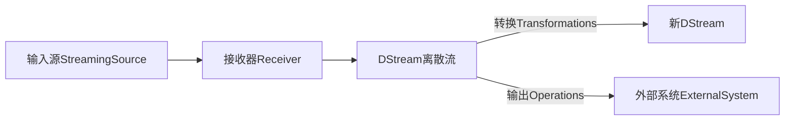

# SparkStreaming在社交媒体分析中的应用

## 1.背景介绍
随着社交媒体的迅猛发展,每天产生的数据量呈爆炸式增长。如何实时、高效地分析和处理如此海量的社交媒体数据,已经成为一个亟待解决的难题。Spark Streaming作为Apache Spark生态系统中流式数据处理的利器,为我们提供了一种高效、可扩展的实时数据处理方案。

### 1.1 社交媒体数据的特点
#### 1.1.1 数据量巨大
#### 1.1.2 数据实时性强 
#### 1.1.3 数据种类多样

### 1.2 传统数据处理方式的局限性
#### 1.2.1 批处理无法满足实时性需求
#### 1.2.2 单机处理能力有限
#### 1.2.3 数据格式多样,处理困难

### 1.3 Spark Streaming的优势
#### 1.3.1 基于内存的分布式计算
#### 1.3.2 毫秒级的处理延迟
#### 1.3.3 与Spark生态系统无缝集成

## 2.核心概念与联系

### 2.1 RDD(弹性分布式数据集)
- RDD是Spark的基本数据抽象,代表一个只读的分区记录集合
- RDD支持两种操作:转换(transformation)和行动(action)
- RDD采用惰性计算模式,只有在action操作时才会触发真正计算

### 2.2 DStream(离散流)
- DStream是Spark Streaming的基础抽象,代表一个连续的数据流
- DStream由一系列连续的RDD组成,每个RDD包含一个时间间隔内的数据
- 对DStream的操作会转化为对内部RDD的操作

### 2.3 Spark Streaming编程模型
- 通过创建输入DStream来定义输入源
- 对DStream应用转换和输出操作
- 用streamingContext.start()来开始接收数据和处理流程
- 用streamingContext.awaitTermination()等待处理结束
- 可以用streamingContext.stop()来手动结束流式计算



## 3.核心算法原理具体操作步骤

### 3.1 数据接收与分发
- Spark Streaming使用Receiver来接收实时输入数据流
- 数据以块的形式分发到Spark集群的Executor上存储为RDD

### 3.2 数据处理与计算
- 在DStream上定义各种Transformation和Operation操作
- Transformation定义RDD到RDD的映射,如map、filter等
- Output Operation定义了对RDD数据的输出操作,如print、saveAsTextFile等
- 每个batch间隔Spark Streaming会启动一个Spark Job来处理数据并生成结果

### 3.3 结果输出与持久化
- 使用Output Operation将计算结果输出到外部存储系统
- 常见输出操作有saveAsTextFiles、saveAsHadoopFiles、foreachRDD等
- 结果可以存储到文件系统、数据库、消息队列等,以供后续分析使用

## 4.数学模型和公式详细讲解举例说明

### 4.1 滑动窗口算法
Spark Streaming支持基于滑动窗口的聚合计算,如下公式:

$$ 
\begin{aligned}
&\textit{windowDuration = 10 分钟} \ 
&\textit{slideDuration = 5 分钟} \
&\textit{操作 = reduceByWindow(_ + _)}
\end{aligned}
$$

上面的代码定义了一个10分钟的窗口,每5分钟滑动一次,然后对窗口内的数据执行reduceByKey聚合。

### 4.2 TopN 排序算法
利用Spark Streaming可以方便地实现实时的Top N排序功能,如下:

$$
\begin{aligned}
&\textit{// 读取流数据,每5秒一个批次}\
&\textit{val lines = ssc.socketTextStream("localhost", 9999, StorageLevel.MEMORY_AND_DISK_SER)} \
&\textit{// 对每个批次的数据进行 TopN 排序} \  
&\textit{val topN = lines} \
&\quad \textit{.flatMap(_.split(" "))} \
&\quad \textit{.map(word => (word, 1))} \ 
&\quad \textit{.reduceByKey(_ + _)} \
&\quad \textit{.map(_.swap)} \
&\quad \textit{.transform(rdd => rdd.sortByKey(false))} \
&\quad \textit{.map(_.swap)} \
&\quad \textit{.transform(_.take(3))}
\end{aligned}
$$

这里先对每个时间间隔的数据进行词频统计,然后调换key/value位置,按照count排序取Top3,最后再调换回来。

## 5.项目实践：代码实例和详细解释说明

下面我们用Spark Streaming + Twitter API来实现一个实时的热门话题(HashTag)统计程序:

```scala
import org.apache.spark._
import org.apache.spark.streaming._
import org.apache.spark.streaming.twitter._

object TwitterPopularTags {
  def main(args: Array[String]) {
    // 创建SparkConf
    val conf = new SparkConf().setAppName("TwitterPopularTags")
    // 创建StreamingContext,每5秒一个批次
    val ssc = new StreamingContext(conf, Seconds(5))
    
    // 配置Twitter API认证信息  
    val consumerKey = "..."
    val consumerSecret = "..."
    val accessToken = "..."
    val accessTokenSecret = "..."
    val filters = Array("spark")
    
    // 创建Twitter输入流
    val stream = TwitterUtils.createStream(ssc, None, filters)

    // 统计热门话题
    val hashTags = stream.flatMap(status => status.getText.split(" ").filter(_.startsWith("#")))
                         .map((_, 1))
                         .reduceByKeyAndWindow(_ + _, Seconds(60)) //60秒内的热门话题
                         .map{case (topic, count) => (count, topic)}
                         .transform(_.sortByKey(false))
    
    // 打印结果
    hashTags.print
    
    // 启动流计算
    ssc.start()
    ssc.awaitTermination()
  }
}
```

这个程序会实时统计最近60秒内Twitter上最热门的话题标签。主要步骤如下:

1. 创建一个本地的StreamingContext,每5秒一个批次
2. 配置Twitter4j的认证信息,并创建一个Twitter输入流
3. 对每条推文进行分词,过滤出以"#"开头的话题标签
4. 对窗口内(60秒)的话题进行计数,并按照count排序
5. 打印排名前几的热门话题
6. 启动流计算并等待终止

运行程序后,可以实时看到Twitter上最热门的话题标签,并随着新推文的产生而动态更新。

## 6.实际应用场景

Spark Streaming在社交媒体分析领域有非常广泛的应用,主要场景包括:

### 6.1 实时事件检测
通过对社交媒体数据流进行实时处理,可以及时发现各类热点事件,如地震、事故等突发事件。

### 6.2 社交网络关系分析
对社交网络中的用户互动数据进行实时分析,可以发现用户间的社交关系、影响力等。

### 6.3 用户情感分析
通过对用户发表的文本内容进行情感分析,可以实时掌握用户对某个话题的情感倾向。

### 6.4 话题传播分析
通过分析话题相关推文的转发、评论等传播情况,研究话题的传播特点和规律。

### 6.5 垃圾信息检测
利用机器学习算法对社交媒体数据流进行实时分类,自动识别垃圾信息、虚假信息等。

## 7.工具和资源推荐

### 7.1 Spark官网
- http://spark.apache.org/

### 7.2 Spark Streaming 编程指南
- http://spark.apache.org/docs/latest/streaming-programming-guide.html

### 7.3 Twitter4j开源库
- http://twitter4j.org/

### 7.4 Spark Streaming 示例程序
- https://github.com/apache/spark/tree/master/examples/src/main/scala/org/apache/spark/examples/streaming

### 7.5 Spark Summit 视频集
- https://databricks.com/sparkaisummit/north-america-2021/sessions

## 8.总结：未来发展趋势与挑战

Spark Streaming为社交媒体数据的实时处理和分析提供了一个高效、可扩展的平台。未来随着社交媒体数据规模和复杂性的不断提高,Spark Streaming 也面临着新的机遇和挑战:

### 8.1 更低的处理延迟
如何进一步降低处理延迟,实现亚秒级乃至毫秒级的实时计算,是一大挑战。

### 8.2 更智能的数据分析
利用AI、机器学习技术,赋予Spark Streaming更强大的数据洞察和理解能力。

### 8.3 图数据流的处理
社交网络本质上是图结构数据,如何有效处理实时图数据流值得研究。

### 8.4 与其他系统的集成
Spark Streaming需要与Kafka、Flume等系统进行更好的集成,构建端到端的流处理管道。

## 9.附录：常见问题与解答

### Q1: Spark Streaming与Storm的区别？
A1: Spark Streaming基于微批次,而Storm是纯实时;Spark Streaming能与Spark生态更好集成。

### Q2: Spark Streaming 支持哪些数据源？
A2: 支持HDFS、Kafka、Flume、Twitter、ZeroMQ等多种数据源。

### Q3: Spark Streaming的容错机制是怎样的？
A3: 采用WAL预写日志、Checkpoint、Driver HA、Receiver HA等多级容错机制。

### Q4: Spark Streaming如何保证数据处理的exactly-once语义？
A4: 使用预写日志WAL和Checkpoint机制,结合幂等的输出操作,可以实现端到端的exactly-once。

### Q5: Spark Streaming适合处理什么样的数据？
A5: 适合处理实时性要求高、数据量大、数据格式复杂多变的流式数据,如社交媒体数据流。

作者：禅与计算机程序设计艺术 / Zen and the Art of Computer Programming