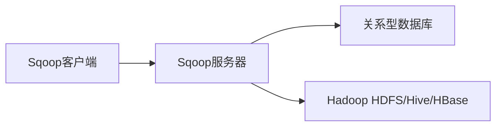

# Sqoop原理与代码实例讲解

## 1.背景介绍
### 1.1 大数据时代的数据交互需求
在当今大数据时代,企业面临着海量数据的采集、存储和分析挑战。数据通常分散在不同的存储系统中,如关系型数据库、数据仓库、Hadoop分布式文件系统(HDFS)等。为了实现数据的高效利用和分析,需要在这些异构数据源之间进行数据交互和集成。

### 1.2 Sqoop的诞生
Apache Sqoop(SQL-to-Hadoop)应运而生,它是一个用于在关系型数据库和Hadoop之间传输数据的工具。Sqoop利用MapReduce并行框架高效地在关系型数据库和HDFS、Hive、HBase等Hadoop组件之间实现数据的导入和导出。

### 1.3 Sqoop的优势
Sqoop具有以下优势:
- 高效的数据传输:利用MapReduce并行处理,实现批量数据的快速传输。
- 支持多种关系型数据库:如MySQL、Oracle、PostgreSQL等。
- 与Hadoop生态系统良好集成:可与HDFS、Hive、HBase等无缝对接。
- 使用简单:提供命令行界面,易于上手。
- 可扩展性强:支持自定义数据处理和转换。

## 2.核心概念与联系
### 2.1 Sqoop架构概览
Sqoop的核心组件包括:
- Sqoop客户端:用于提交数据传输任务。
- Sqoop服务器:负责协调数据传输过程。
- 关系型数据库:作为数据源或目标。
- Hadoop:作为数据源或目标,包括HDFS、Hive、HBase等。

下图展示了Sqoop的基本架构:



### 2.2 导入和导出
Sqoop支持两种数据传输模式:
- 导入:将数据从关系型数据库传输到Hadoop。
- 导出:将数据从Hadoop传输到关系型数据库。

在导入过程中,Sqoop将数据库表的数据并行读取,并写入HDFS或其他Hadoop组件。在导出过程中,Sqoop从Hadoop并行读取数据,并写入关系型数据库表中。

### 2.3 数据类型映射
Sqoop在关系型数据库和Hadoop之间传输数据时,需要进行数据类型映射。Sqoop支持大多数常见的数据类型,如数字类型、字符串、日期等。对于一些特殊类型,如BLOB、CLOB等,Sqoop提供了自定义处理机制。

## 3.核心算法原理具体操作步骤
### 3.1 数据导入过程
Sqoop数据导入的基本步骤如下:
1. Sqoop客户端提交导入任务,指定数据库连接信息、表名、HDFS目标路径等。
2. Sqoop服务器对任务进行解析和分割。
3. Sqoop启动MapReduce作业,并行从数据库读取数据。
4. 每个Map任务负责读取表的一部分数据,并将数据写入HDFS。
5. 数据导入完成后,可以在HDFS中访问导入的数据。

### 3.2 数据导出过程
Sqoop数据导出的基本步骤如下:
1. Sqoop客户端提交导出任务,指定HDFS数据路径、数据库连接信息、目标表名等。
2. Sqoop服务器对任务进行解析。
3. Sqoop启动MapReduce作业,并行从HDFS读取数据。
4. 每个Map任务负责将数据写入数据库表的一部分。
5. 数据导出完成后,可以在关系型数据库中访问导出的数据。

### 3.3 分割器和边界查询
为了实现数据的并行传输,Sqoop使用分割器将数据划分为多个部分,每个Map任务处理一部分数据。常见的分割方式有:
- 主键范围分割:根据主键的范围将数据分割。
- 哈希分割:根据哈希函数将数据分割。
- 自定义分割:用户可以实现自定义的分割逻辑。

Sqoop使用边界查询来确定每个分割的边界值。边界查询通过SQL语句查询每个分割的最小值和最大值,从而确定Map任务读取数据的范围。

## 4.数学模型和公式详细讲解举例说明
### 4.1 数据分割模型
假设要导入的数据库表有 $N$ 条记录,需要使用 $M$ 个Map任务进行并行处理。每个Map任务处理的记录数可以表示为:

$$
records\_per\_map = \lceil \frac{N}{M} \rceil
$$

其中,$\lceil x \rceil$表示对 $x$ 向上取整。

例如,如果数据库表有100条记录,使用4个Map任务,则每个Map任务处理的记录数为:

$$
records\_per\_map = \lceil \frac{100}{4} \rceil = 25
$$

### 4.2 数据传输速度估算
Sqoop的数据传输速度受多个因素影响,如网络带宽、数据库性能、Hadoop集群性能等。可以使用以下公式估算数据传输速度:

$$
transfer\_speed = \frac{data\_size}{transfer\_time}
$$

其中,$data\_size$表示传输的数据大小,$transfer\_time$表示传输时间。

例如,如果需要传输1TB的数据,传输时间为1小时,则传输速度为:

$$
transfer\_speed = \frac{1TB}{1hour} = 1TB/hour
$$

## 5.项目实践:代码实例和详细解释说明
下面通过一个具体的代码实例来说明Sqoop的使用。

### 5.1 数据导入示例
假设要将MySQL数据库中的`user`表导入到HDFS中,可以使用以下命令:

```bash
sqoop import \
  --connect jdbc:mysql://localhost:3306/database \
  --username root \
  --password password \
  --table user \
  --target-dir /user/data/user \
  --num-mappers 4
```

参数说明:
- `--connect`:指定数据库连接URL。
- `--username`:指定数据库用户名。
- `--password`:指定数据库密码。
- `--table`:指定要导入的表名。
- `--target-dir`:指定HDFS目标路径。
- `--num-mappers`:指定并行Map任务数。

### 5.2 数据导出示例
假设要将HDFS中的`/user/data/user`目录下的数据导出到MySQL数据库的`user`表中,可以使用以下命令:

```bash
sqoop export \
  --connect jdbc:mysql://localhost:3306/database \
  --username root \
  --password password \
  --table user \
  --export-dir /user/data/user \
  --num-mappers 4
```

参数说明:
- `--connect`:指定数据库连接URL。
- `--username`:指定数据库用户名。
- `--password`:指定数据库密码。
- `--table`:指定要导出到的表名。
- `--export-dir`:指定HDFS源数据路径。
- `--num-mappers`:指定并行Map任务数。

## 6.实际应用场景
Sqoop在实际应用中有广泛的使用场景,包括:
- 数据迁移:将数据从传统关系型数据库迁移到Hadoop平台。
- 数据备份:定期将关系型数据库数据备份到HDFS。
- 数据分析:将数据导入Hadoop进行大规模数据分析。
- 数据同步:在关系型数据库和Hadoop之间实现增量数据同步。

下面是一个电商公司使用Sqoop进行数据分析的案例:
1. 每天将订单、用户、商品等数据从MySQL导入HDFS。
2. 使用Hive对导入的数据进行清洗和预处理。
3. 使用MapReduce、Spark等计算框架进行数据分析,如用户行为分析、商品推荐等。
4. 将分析结果导出回关系型数据库,供业务系统使用。

通过Sqoop,电商公司可以高效地将数据从传统数据库引入大数据平台,实现海量数据的存储和分析。

## 7.工具和资源推荐
以下是一些有助于学习和使用Sqoop的工具和资源:
- 官方文档:Apache Sqoop官方文档,包含用户指南、API文档等。
- Cloudera Connector:Cloudera发布的Sqoop连接器,提供更多高级特性。
- Sqoop Github仓库:Sqoop源代码仓库,可以了解Sqoop的内部实现。
- Sqoop Cookbook:Sqoop使用案例和最佳实践指南。
- Sqoop培训课程:Cloudera、Hortonworks等大数据厂商提供的Sqoop培训课程。

建议初学者先从官方文档入手,了解Sqoop的基本概念和使用方法。在实践中可以参考Sqoop Cookbook和Github上的示例项目。对于大型项目,可以考虑使用Cloudera Connector等企业级工具。

## 8.总结:未来发展趋势与挑战
Sqoop作为关系型数据库和Hadoop之间数据传输的重要工具,未来仍将在大数据领域扮演关键角色。以下是Sqoop未来的发展趋势和面临的挑战:

发展趋势:
- 云原生支持:随着云计算的普及,Sqoop需要更好地支持云上数据库和存储服务。
- 实时数据集成:实时数据处理的需求日益增长,Sqoop需要支持实时数据传输。
- 数据治理集成:与数据治理平台集成,确保数据在传输过程中的安全性和合规性。

挑战:
- 异构数据源支持:需要不断扩展对新型数据库和数据格式的支持。
- 性能优化:在处理海量数据时,需要进一步优化传输性能。
- 易用性提升:提供更加友好的用户界面和API,降低使用门槛。

总之,Sqoop将在未来大数据生态系统中继续发挥重要作用。随着数据量的增长和数据类型的多样化,Sqoop需要不断evolve,以满足数据集成和传输的新需求。

## 9.附录:常见问题与解答
1. 问:Sqoop支持哪些关系型数据库?
   答:Sqoop支持大多数主流关系型数据库,如MySQL、Oracle、PostgreSQL、SQL Server等。

2. 问:Sqoop是否支持增量数据导入?
   答:是的,Sqoop支持增量数据导入。可以通过`--incremental`参数指定增量模式,如`append`或`lastmodified`。

3. 问:Sqoop性能如何?
   答:Sqoop采用MapReduce并行框架,可以充分利用Hadoop集群的计算能力,实现高效的数据传输。传输性能受网络带宽、数据库性能等因素影响。

4. 问:Sqoop如何处理数据类型不兼容的问题?
   答:Sqoop提供了默认的数据类型映射机制,可以在导入导出时自动转换数据类型。对于特殊类型,可以通过自定义转换器进行处理。

5. 问:Sqoop是否支持数据压缩?
   答:是的,Sqoop支持多种压缩格式,如gzip、snappy、bzip2等,可以通过`--compress`参数启用压缩。

作者:禅与计算机程序设计艺术 / Zen and the Art of Computer Programming