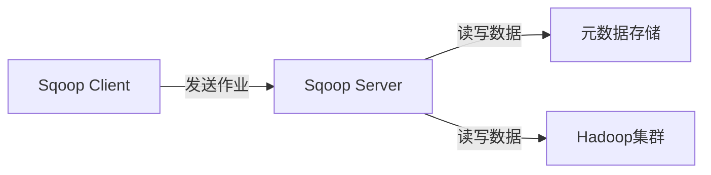
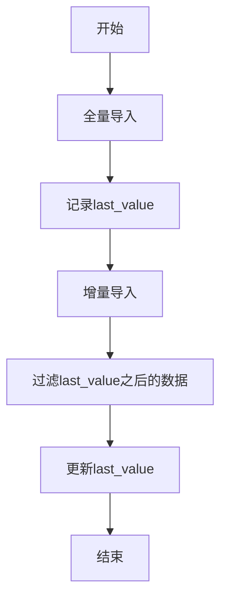
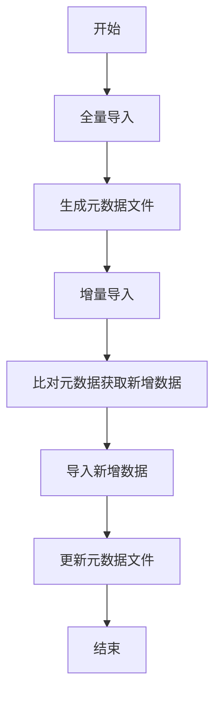

# Sqoop增量导入原理与代码实例讲解

## 1.背景介绍

在大数据时代,数据量呈现爆炸式增长,传统的数据处理方式已经无法满足现有需求。Apache Sqoop作为一款高效的数据传输工具,可以将关系型数据库(RDBMS)中的数据导入到Hadoop生态圈中进行分析处理。然而,全量导入会导致大量数据冗余和资源浪费,因此增量导入应运而生。

增量导入是指只导入自上次导入后发生变化的数据,避免重复导入,提高效率。Sqoop提供了多种增量导入方式,本文将重点介绍基于查询条件和基于元数据的增量导入原理及实现。

## 2.核心概念与联系

### 2.1 Sqoop架构

Sqoop由以下四个核心组件构成:



- **Sqoop Client**: 接收用户输入,向Sqoop Server发送作业请求
- **Sqoop Server**: 执行导入导出操作,与元数据存储和Hadoop集群交互
- **元数据存储**: 存储关于导入数据的元数据信息,如数据库连接参数、表结构等
- **Hadoop集群**: 存储导入的数据,执行MapReduce作业

### 2.2 增量导入方式

Sqoop支持以下几种增量导入方式:

- **基于查询条件**: 使用WHERE子句过滤需要导入的数据
- **基于元数据**: 根据元数据信息(如最后修改时间)判断新增数据
- **基于增量导入模式**: Sqoop 1.4.6引入,支持自动化增量导入
- **基于事务日志**: 解析数据库事务日志获取增量数据(Oracle)

本文重点讨论基于查询条件和基于元数据的增量导入。

## 3.核心算法原理具体操作步骤

### 3.1 基于查询条件的增量导入

该方法利用SQL的WHERE子句过滤出自上次导入后新增的数据。具体步骤如下:

1. 首次全量导入数据,记录最大修改时间 `last_value`
2. 下次导入时,使用 `WHERE ... > last_value` 过滤新增数据
3. 更新 `last_value` 为本次导入的最大修改时间

示例SQL查询:

```sql
SELECT *
FROM table
WHERE last_modified > '2023-05-30 10:00:00'
```

#### 3.1.1 Mermaid流程图



该方法优点是实现简单,但需要数据库表具有可用于过滤的字段,如最后修改时间戳。

### 3.2 基于元数据的增量导入

该方法利用Sqoop维护的元数据信息跟踪已导入数据,从而实现增量导入。具体步骤:

1. 首次全量导入数据到HDFS目录 `/user/foo/table`
2. Sqoop自动生成元数据文件 `/user/foo/table/.meta`
3. 下次导入时,Sqoop比对元数据获取已导入数据范围
4. 导入新增数据,并更新元数据文件

#### 3.2.1 Mermaid流程图



该方法优点是无需数据库表具备特殊字段,缺点是元数据存储在HDFS上,一旦丢失需要重新全量导入。

## 4.数学模型和公式详细讲解举例说明

在基于查询条件的增量导入中,我们需要根据上次导入的最大修改时间 `last_value` 过滤出新增数据。假设数据库表 `table` 有一个 `last_modified` 字段记录每行数据的最后修改时间,我们可以使用以下SQL查询:

$$
\begin{aligned}
\text{SELECT * FROM table} \\
\text{WHERE last_modified > last\_value}
\end{aligned}
$$

其中 `last_value` 是一个时间戳,表示上次导入的最大修改时间。

为了更新 `last_value`,我们需要在本次导入结束后,计算出新的最大修改时间:

$$
\begin{aligned}
\text{new\_last\_value} &= \max(\text{last\_modified}) \\
&\text{FROM 本次导入的数据}
\end{aligned}
$$

这样,在下次增量导入时,就可以使用 `new_last_value` 作为过滤条件的参数。

## 5.项目实践:代码实例和详细解释说明

### 5.1 基于查询条件的增量导入

假设我们有一个MySQL数据库 `company`,其中的 `employees` 表记录了员工信息,包括 `id`、`name`、`dept` 和 `last_modified` 字段。我们需要将该表导入到Hadoop集群中的 `/user/sqoop/employees` 目录。

1. 首次全量导入:

```bash
sqoop import \
--connect jdbc:mysql://localhost/company \
--username root \
--table employees \
--target-dir /user/sqoop/employees \
--fields-terminated-by '\t'
```

该命令会将 `employees` 表全量导入到 `/user/sqoop/employees` 目录,并记录最大修改时间到 `$HOME/.syn/employees.txt` 文件中。

2. 后续增量导入:

```bash
last_value=`cat $HOME/.syn/employees.txt`

sqoop import \
--connect jdbc:mysql://localhost/company \
--username root \
--table employees \
--target-dir /user/sqoop/employees \
--fields-terminated-by '\t' \
--check-column 'last_modified' \
--incremental lastmodified \
--last-value "$last_value"
```

该命令会导入自上次导入后新增的数据,过滤条件为 `last_modified > $last_value`。导入完成后,会自动更新 `$HOME/.syn/employees.txt` 文件,记录本次导入的最大修改时间。

### 5.2 基于元数据的增量导入

我们仍以 `company.employees` 表为例,需要将该表导入到 `/user/sqoop/employees` 目录。

1. 首次全量导入:

```bash
sqoop import \
--connect jdbc:mysql://localhost/company \
--username root \
--table employees \
--target-dir /user/sqoop/employees \
--fields-terminated-by '\t' \
--incremental append
```

该命令会将 `employees` 表全量导入到 `/user/sqoop/employees` 目录,并在该目录下生成 `.meta` 元数据文件。

2. 后续增量导入:

```bash
sqoop import \
--connect jdbc:mysql://localhost/company \
--username root \
--table employees \
--target-dir /user/sqoop/employees \
--fields-terminated-by '\t' \
--incremental append \
--check-column 'last_modified'
```

该命令会比对 `.meta` 元数据文件,导入自上次导入后新增的数据,并自动更新元数据文件。

## 6.实际应用场景

增量导入在以下场景中具有重要应用:

- **数据仓库构建**: 定期从OLTP数据库导入增量数据到数据仓库,保持数据同步
- **日志分析**: 实时导入新增日志数据到Hadoop集群进行分析
- **缓存刷新**: 及时将数据库变更同步到缓存系统,保证缓存数据最新

## 7.工具和资源推荐

- **Sqoop Web UI**: 提供基于Web的界面管理Sqoop作业,监控进度
- **Sqoop Metastore**: 集中存储Sqoop元数据,替代HDFS存储
- **Sqoop Connectors**: 支持导入导出多种数据源,如Teradata、Netezza等
- **Sqoop开源社区**: https://sqoop.apache.org/

## 8.总结:未来发展趋势与挑战

Sqoop作为连接RDBMS和Hadoop的桥梁,在数据迁移和ETL领域发挥着重要作用。未来,Sqoop可能面临以下发展趋势和挑战:

- **云数据集成**: 支持跨云导入导出数据,实现多云环境下的数据交换
- **流式数据处理**: 与Kafka等流计算框架集成,实现实时增量数据同步
- **元数据管理**: 提供更加健壮的元数据存储和管理机制
- **安全合规**: 加强对数据安全和隐私合规的支持
- **简化配置**: 降低配置复杂度,提升用户体验

## 9.附录:常见问题与解答

1. **增量导入时如何避免重复导入?**

可以使用 `--merge-key` 选项指定键值,Sqoop会根据键值判断是插入新记录还是更新已有记录。

2. **如何调试增量导入过程?**

可以使用 `--verbose` 选项输出详细日志,或者设置 `--log-dir` 将日志写入指定目录。

3. **增量导入时如何处理删除操作?**

Sqoop本身不支持删除操作,需要在导入前执行 `SELECT` 语句过滤出未删除的数据。

4. **增量导入支持并行执行吗?**

支持,可以使用 `--num-mappers` 选项指定并行度。

5. **如何确保增量导入的原子性?**

可以使用 `--staging-table` 选项先导入到临时表,再重命名为目标表。

作者:禅与计算机程序设计艺术 / Zen and the Art of Computer Programming