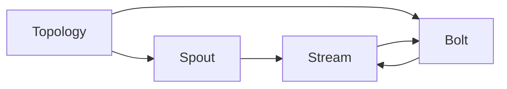

# Storm原理与代码实例讲解

## 1.背景介绍

在当今大数据时代,实时数据处理已成为许多企业和组织的关键需求。Apache Storm作为一个分布式实时计算系统,为我们提供了高效、可靠的流式数据处理解决方案。本文将深入探讨Storm的核心原理,并通过代码实例详细讲解其工作机制和实际应用。

### 1.1 实时流式计算的重要性
#### 1.1.1 实时数据洞察
#### 1.1.2 快速响应业务需求
#### 1.1.3 提升用户体验

### 1.2 Apache Storm的诞生
#### 1.2.1 Storm的起源与发展历程
#### 1.2.2 Storm在流式计算领域的地位
#### 1.2.3 Storm的主要特点与优势

## 2.核心概念与联系

要深入理解Storm,首先需要掌握其核心概念及其之间的关系。本节将介绍Storm中的关键术语,并通过示意图展示它们之间的联系。

### 2.1 Topology（拓扑）
#### 2.1.1 Topology的定义
#### 2.1.2 Topology的组成部分
#### 2.1.3 Topology的生命周期

### 2.2 Spout（数据源）
#### 2.2.1 Spout的作用
#### 2.2.2 Spout的类型
#### 2.2.3 自定义Spout

### 2.3 Bolt（处理单元）
#### 2.3.1 Bolt的功能
#### 2.3.2 Bolt的分类
#### 2.3.3 自定义Bolt

### 2.4 Stream（数据流）
#### 2.4.1 Stream的概念
#### 2.4.2 Stream的分组策略
#### 2.4.3 Stream的可靠性保证

### 2.5 核心概念之间的关系



## 3.核心算法原理具体操作步骤

Storm的核心是其数据处理算法,本节将详细阐述Storm的核心算法原理,并给出具体的操作步骤。

### 3.1 数据分区与并行处理
#### 3.1.1 数据分区策略
#### 3.1.2 并行度设置
#### 3.1.3 任务调度与执行

### 3.2 数据可靠性保证机制
#### 3.2.1 消息确认机制
#### 3.2.2 数据重放与去重
#### 3.2.3 状态管理与容错

### 3.3 Back-pressure（背压）机制
#### 3.3.1 背压机制的必要性
#### 3.3.2 背压的实现原理
#### 3.3.3 背压的动态调节

## 4.数学模型和公式详细讲解举例说明

为了更好地理解Storm的工作原理,本节将引入相关的数学模型,并通过公式推导和举例说明加深读者的理解。

### 4.1 数据流模型
#### 4.1.1 数据流的数学表示
#### 4.1.2 数据流的转换与操作
#### 4.1.3 数据流的聚合与统计

### 4.2 并行度与吞吐量估算
#### 4.2.1 并行度的数学模型
$$ Parallelism = \frac{TotalTasks}{ExecutorsPerComponent} $$
#### 4.2.2 吞吐量估算公式
$$ Throughput = \frac{TotalMessages}{ProcessingTime} $$
#### 4.2.3 并行度与吞吐量的权衡

### 4.3 数据分区与负载均衡
#### 4.3.1 数据分区的哈希算法
$$ Hash(Key) \% NumberOfPartitions $$
#### 4.3.2 负载均衡的数学模型
#### 4.3.3 动态负载均衡策略

## 5.项目实践：代码实例和详细解释说明

本节将通过实际的代码实例,展示如何使用Storm构建实时数据处理应用,并对关键代码进行详细解释说明。

### 5.1 开发环境搭建
#### 5.1.1 JDK与Maven配置
#### 5.1.2 Storm集群搭建
#### 5.1.3 IDE配置与项目创建

### 5.2 WordCount示例
#### 5.2.1 Topology构建
```java
TopologyBuilder builder = new TopologyBuilder();
builder.setSpout("spout", new RandomSentenceSpout(), 5);
builder.setBolt("split", new SplitSentence(), 8)
        .shuffleGrouping("spout");
builder.setBolt("count", new WordCount(), 12)
        .fieldsGrouping("split", new Fields("word"));
```
#### 5.2.2 Spout实现
```java
public class RandomSentenceSpout extends BaseRichSpout {
    private SpoutOutputCollector collector;
    private String[] sentences = {
        "the cow jumped over the moon",
        "an apple a day keeps the doctor away",
        "four score and seven years ago"
    };

    public void open(Map conf, TopologyContext context, SpoutOutputCollector collector) {
        this.collector = collector;
    }

    public void nextTuple() {
        String sentence = sentences[new Random().nextInt(sentences.length)];
        collector.emit(new Values(sentence));
    }

    public void declareOutputFields(OutputFieldsDeclarer declarer) {
        declarer.declare(new Fields("sentence"));
    }
}
```
#### 5.2.3 Bolt实现
```java
public class SplitSentence extends BaseBasicBolt {
    public void execute(Tuple tuple, BasicOutputCollector collector) {
        String sentence = tuple.getString(0);
        for(String word: sentence.split(" ")) {
            collector.emit(new Values(word));
        }
    }

    public void declareOutputFields(OutputFieldsDeclarer declarer) {
        declarer.declare(new Fields("word"));
    }
}

public class WordCount extends BaseBasicBolt {
    Map<String, Integer> counts = new HashMap<String, Integer>();

    public void execute(Tuple tuple, BasicOutputCollector collector) {
        String word = tuple.getString(0);
        Integer count = counts.get(word);
        if (count == null)
            count = 0;
        count++;
        counts.put(word, count);
        collector.emit(new Values(word, count));
    }

    public void declareOutputFields(OutputFieldsDeclarer declarer) {
        declarer.declare(new Fields("word", "count"));
    }
}
```

### 5.3 代码运行与结果分析
#### 5.3.1 本地模式运行
#### 5.3.2 集群模式运行
#### 5.3.3 结果分析与优化

## 6.实际应用场景

Storm在实际生产环境中有广泛的应用,本节将介绍几个典型的应用场景,帮助读者更好地理解Storm的实际价值。

### 6.1 实时日志处理
#### 6.1.1 日志采集与传输
#### 6.1.2 日志解析与过滤
#### 6.1.3 日志聚合与统计

### 6.2 实时推荐系统
#### 6.2.1 用户行为数据采集
#### 6.2.2 实时特征提取
#### 6.2.3 实时推荐计算

### 6.3 实时金融风控
#### 6.3.1 交易数据实时采集
#### 6.3.2 实时异常检测
#### 6.3.3 实时风险预警

## 7.工具和资源推荐

本节将推荐一些实用的工具和学习资源,帮助读者更好地掌握和应用Storm。

### 7.1 开发工具
#### 7.1.1 IntelliJ IDEA
#### 7.1.2 Eclipse
#### 7.1.3 Storm UI

### 7.2 部署与监控工具
#### 7.2.1 Apache ZooKeeper
#### 7.2.2 Apache Kafka
#### 7.2.3 Ganglia

### 7.3 学习资源
#### 7.3.1 官方文档
#### 7.3.2 Storm In Action
#### 7.3.3 Getting Started With Storm

## 8.总结：未来发展趋势与挑战

本文深入探讨了Storm的原理与实践,展示了其在实时流式计算领域的强大能力。展望未来,Storm还将面临新的发展机遇和挑战。

### 8.1 与其他流式计算框架的比较
#### 8.1.1 Storm vs Spark Streaming
#### 8.1.2 Storm vs Flink
#### 8.1.3 Storm vs Samza

### 8.2 Storm的发展趋势
#### 8.2.1 与云计算平台的集成
#### 8.2.2 SQL on Stream的支持
#### 8.2.3 机器学习的实时应用

### 8.3 面临的挑战
#### 8.3.1 数据规模的持续增长
#### 8.3.2 数据源的多样性
#### 8.3.3 实时性与准确性的平衡

## 9.附录：常见问题与解答

### 9.1 Storm适用于哪些场景？
Storm适用于对实时性要求较高的流式数据处理场景,如实时日志处理、实时推荐、实时金融风控等。

### 9.2 Storm的可靠性如何保证？
Storm提供了Acker机制来保证数据的可靠性,通过消息确认、数据重放等手段来确保每个消息都得到处理。

### 9.3 Storm的吞吐量如何提升？
可以通过增加Worker数量、调整并行度、优化数据分区策略等手段来提升Storm的吞吐量。

### 9.4 Storm与Kafka的集成方式？
Storm与Kafka可以无缝集成,常见的方式是使用Kafka作为数据源(Spout),Storm从Kafka中读取数据并进行处理。

### 9.5 Storm的部署与维护有哪些注意事项？
部署Storm需要注意节点的硬件配置、网络带宽等因素,并且要对ZooKeeper、Nimbus等关键组件进行监控和维护,确保集群的稳定运行。

作者：禅与计算机程序设计艺术 / Zen and the Art of Computer Programming