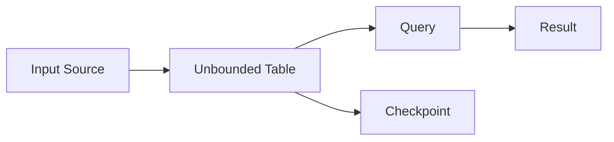

# Structured Streaming原理与代码实例讲解

## 1.背景介绍
### 1.1 大数据流处理的重要性
在当今大数据时代,实时处理海量的数据流变得越来越重要。许多应用场景如网站点击流分析、金融风控、物联网等都需要对源源不断的数据进行实时计算。传统的批处理模型难以满足实时性的要求,因此流处理技术应运而生。
### 1.2 Spark Streaming的局限性
Spark Streaming是较早出现的流处理框架之一,基于Spark的微批次(micro-batch)处理模型,将数据流切分成一个个小批次进行处理。然而,这种方式存在一些局限:
- 时间间隔难以权衡。批次间隔太短,则调度开销大;间隔太长,实时性又受影响。
- 批次之间缺乏状态的有效共享和管理。
- 不够直观的流式数据抽象,使用门槛较高。
### 1.3 Structured Streaming的诞生
为了克服Spark Streaming的不足,Databricks在Spark 2.0中引入了全新的流处理引擎——Structured Streaming。它以Spark SQL为基础,利用DataFrame/Dataset API,提供了更加直观、可组合、容错性强的流式数据处理方式。

## 2.核心概念与联系
### 2.1 无界表(Unbounded Table) 
Structured Streaming的核心思想是将流式数据看作一张不断增长的动态表(Unbounded Table)。每个时间点到达的新数据被看作是对该表的一次新增修改操作(插入/更新)。
### 2.2 输入源(Input Source)
输入源定义了数据从何而来。Structured Streaming支持多种输入源,如Kafka、文件、Socket等。系统从输入源不断获取新数据并添加到无界表中。
### 2.3 数据处理逻辑(Query)
用户使用类似批处理的DataFrame/Dataset API来定义对无界表的查询计算逻辑,如select、where、groupBy等。Structured Streaming会不断执行查询,在无界表上产生连续的结果集。
### 2.4 输出结果(Result)  
连续计算的结果可以输出到外部系统,如控制台、文件、数据库等。结果输出模式有几种:
- Complete Mode:每次都输出完整结果集
- Append Mode:只输出新增的数据
- Update Mode:只输出有更新的数据
### 2.5 检查点(Checkpoint)
为了确保端到端的exactly-once语义,Structured Streaming会定期将任务状态保存到可靠存储(如HDFS)的检查点中。从而在任务失败时能从检查点恢复,避免数据丢失或重复。

下面是这些核心概念的关系图:


## 3.核心算法原理具体操作步骤
### 3.1 数据接收与转换
1. 系统从输入源接收新到达的数据,将其解析成DataFrame/Dataset的形式。
2. 新数据被添加到无界表中,更新表的状态。这一步利用Spark SQL的执行引擎完成。

### 3.2 Incrementalization
1. Structured Streaming分析用户定义的查询,将其转换为增量式执行计划。
2. 增量式执行计划由一系列的状态转换操作组成,每个操作只处理上一个批次的数据变更(增量),而不是全量重新计算。
3. 增量计算大大降低了重复计算量,提高了执行效率。这是Structured Streaming相比Spark Streaming的一大优势。

### 3.3 状态管理
1. 许多流计算都涉及状态,如聚合操作中的中间累加值。
2. Structured Streaming将状态数据持久化到状态存储中,每个任务单独管理自己的状态。  
3. 任务通过WAL(Write Ahead Log)的方式来原子性地更新状态,保证一致性。
4. 状态数据也会定期写入检查点,用于故障恢复。

### 3.4 连续查询执行
1. Structured Streaming根据数据源的变更情况,周期性地触发增量查询。
2. 每个触发间隔,系统检查输入源是否有新数据到达。如果有,则执行一次增量查询,计算出本批次的变更。
3. 连续查询的结果集会持续输出到外部系统(Sink)。

## 4.数学模型和公式详细讲解举例说明
在Structured Streaming中,一些常见的操作如聚合、Join等都涉及状态管理。下面我们以聚合为例,介绍其数学模型。

假设我们要对流数据进行分组聚合,如:
```sql
SELECT user, SUM(amount) FROM transactions GROUP BY user
```
我们定义如下符号:
- $S_t(k)$:表示key为k的数据在t时刻的状态值,如之前的累加和。
- $I_t(k)$:表示t时刻新到达的key为k的数据的值。
- $R_t(k)$:表示t时刻key为k的数据的结果输出值。

则聚合操作可用下列公式表示:

$$
S_t(k) = \begin{cases} 
  S_{t-1}(k) + I_t(k) & \text{if } \exists I_t(k) \\
  S_{t-1}(k) & \text{otherwise}
\end{cases}
$$

$$
R_t(k) = S_t(k)
$$

即每个key的状态为之前状态与新增量的和,而结果输出就是最新状态值。

例如有如下数据流:
```
t1: (Alice, 10) 
t2: (Bob, 20)
t3: (Alice, 30)
```

则各时刻的状态$S_t$和输出$R_t$为:
- t1: $S_{t1}=\{Alice:10\}, R_{t1}=\{Alice:10\}$  
- t2: $S_{t2}=\{Alice:10, Bob:20\}, R_{t2}=\{Alice:10, Bob:20\}$
- t3: $S_{t3}=\{Alice:40, Bob:20\}, R_{t3}=\{Alice:40, Bob:20\}$

可见Structured Streaming通过增量更新状态、生成结果的方式,实现了高效的流式聚合。

## 5.项目实践：代码实例和详细解释说明
下面我们用Structured Streaming实现一个实时词频统计的例子。代码使用Scala编写。

```scala
import org.apache.spark.sql.SparkSession
import org.apache.spark.sql.functions._

val spark = SparkSession
  .builder
  .appName("StructuredWordCount")
  .getOrCreate()

// 从Socket读取文本数据
val lines = spark.readStream
  .format("socket")
  .option("host", "localhost")
  .option("port", 9999)
  .load()

// 对每一行文本进行分词,并计算词频
val wordCounts = lines.as[String]
  .flatMap(_.split(" "))
  .groupBy("value")
  .count()

// 输出结果到控制台  
val query = wordCounts.writeStream
  .outputMode("complete")
  .format("console")
  .start()

query.awaitTermination()
```

代码解释:
1. 首先创建一个SparkSession对象,作为程序入口。
2. 使用`readStream`从Socket源读取文本流。
3. 对每一行文本使用`flatMap`进行分词,转换成单词流。
4. 对单词流按`value`进行分组,然后用`count()`进行计数聚合。这一步会自动进行增量计算。
5. 将词频结果通过`writeStream`输出到控制台,输出模式为`complete`,即每次都输出完整结果。
6. 启动流查询,并等待终止。

可以在本地启动一个Socket服务,然后运行程序。源源不断地在Socket中输入文本,就可以看到不断更新的词频统计结果输出到控制台。

## 6.实际应用场景
Structured Streaming在许多实际场景中都有广泛应用,例如:
### 6.1 网站实时统计分析
对网站的点击流、搜索日志等数据进行实时分析,统计热门页面、热搜词等,用于实时监控和决策优化。
### 6.2 金融风控
对交易数据、行为数据进行实时计算,实时识别异常交易、可疑行为,防范金融欺诈。
### 6.3 物联网数据处理
对传感器采集的海量时序数据进行实时清洗、统计,用于设备监控、预警等。
### 6.4 广告点击流分析
对广告投放、点击数据进行实时统计,计算各广告的点击率、转化率等指标,优化广告策略。

## 7.工具和资源推荐
- Databricks官方文档:提供了Structured Streaming详尽的原理介绍、API文档以及大量示例。
- Structured Streaming编程指南:Spark官方的Structured Streaming编程指南,包含基本概念、操作指南等。
- DSTREAM项目:基于Structured Streaming构建的端到端流处理应用的最佳实践项目,含完整源码。
- Structured Streaming学习视频:B站上有不少优质的Structured Streaming教学视频,如"Spark Structured Streaming原理与实践"系列。

## 8.总结：未来发展趋势与挑战
Structured Streaming为Spark带来了高性能、易用的流处理能力,是流处理领域一次重要的创新。未来它有望进一步发展,成为流批一体化的统一计算引擎。但同时也面临一些挑战:
- 低延迟优化:如何进一步降低端到端延迟,实现毫秒级的流处理。
- 吞吐量提升:在超高数据量下如何提升系统吞吐能力。 
- 更多数据源连接器:扩展更多的流数据源,提高系统适用性。
- 大状态管理:高效管理TB级别的状态数据,进行快照/恢复。

相信Structured Streaming会在未来不断突破创新,让流处理变得更简单高效!

## 9.附录：常见问题与解答
### 9.1 Structured Streaming与Spark Streaming的区别?
二者都是Spark的流处理方案,但Structured Streaming是更新的版本,提供了更加简单、强大的API,且基于Spark SQL引擎实现了增量计算,性能更优。
### 9.2 Structured Streaming支持哪些输出模式?
支持Append、Complete、Update三种。Append只输出新增数据,Complete每次输出完整结果,Update输出有更新的数据。
### 9.3 Structured Streaming的容错机制是怎样的?
通过检查点(Checkpoint)机制,定期将状态数据持久化到可靠存储,从而在任务失败时能快速恢复,保证exactly-once语义。
### 9.4 Structured Streaming支持事件时间处理吗?
支持。可以在创建DataFrame/Dataset时指定事件时间列,然后基于事件时间进行窗口聚合等操作。

作者：禅与计算机程序设计艺术 / Zen and the Art of Computer Programming