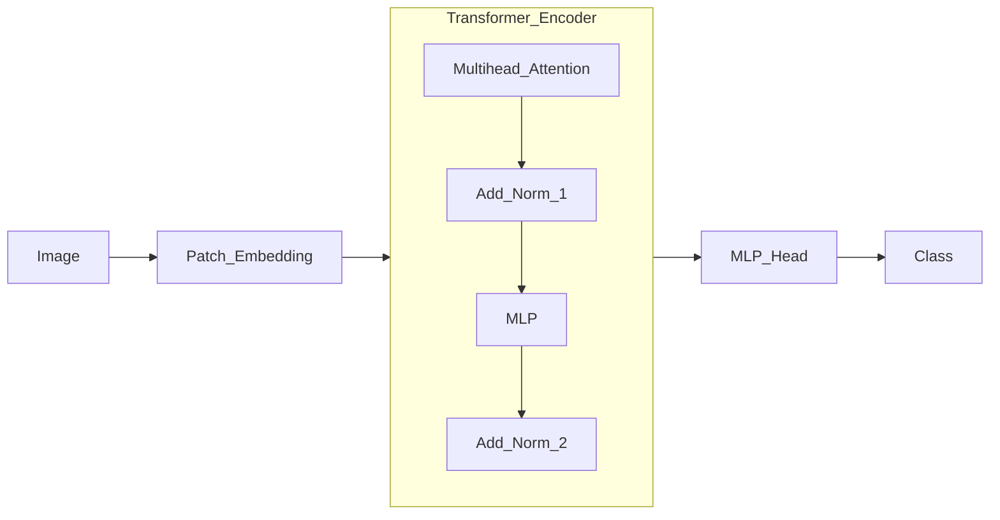

# ViT在虚拟现实中的应用

## 1.背景介绍
### 1.1 虚拟现实的发展历程
### 1.2 计算机视觉在虚拟现实中的重要性
### 1.3 ViT模型的诞生与优势

## 2.核心概念与联系
### 2.1 ViT模型架构剖析
#### 2.1.1 Transformer结构
#### 2.1.2 Patch Embedding
#### 2.1.3 位置编码
### 2.2 ViT与CNN的比较
#### 2.2.1 感受野差异
#### 2.2.2 计算效率对比
#### 2.2.3 泛化能力分析
### 2.3 ViT在虚拟现实中的潜力
#### 2.3.1 场景理解
#### 2.3.2 物体检测与分割
#### 2.3.3 人机交互

## 3.核心算法原理具体操作步骤
### 3.1 ViT模型的训练流程
#### 3.1.1 数据预处理
#### 3.1.2 模型初始化
#### 3.1.3 前向传播与损失计算
#### 3.1.4 反向传播与参数更新
### 3.2 ViT在虚拟现实中的部署
#### 3.2.1 模型量化与加速
#### 3.2.2 实时推理优化
#### 3.2.3 多模态融合策略

## 4.数学模型和公式详细讲解举例说明
### 4.1 自注意力机制
#### 4.1.1 点积注意力
$Attention(Q,K,V) = softmax(\frac{QK^T}{\sqrt{d_k}})V$
#### 4.1.2 多头注意力
$MultiHead(Q,K,V) = Concat(head_1, ..., head_h)W^O$
其中，$head_i = Attention(QW_i^Q, KW_i^K, VW_i^V)$
### 4.2 LayerNorm归一化
$y = \frac{x-E[x]}{\sqrt{Var[x]+\epsilon}} * \gamma + \beta$
### 4.3 Patch Embedding
将图像分割成固定大小的patch，然后线性映射到D维向量:
$z_0 = [x_p^1E; x_p^2E; ... ;x_p^NE] + E_{pos}$

## 5.项目实践：代码实例和详细解释说明
### 5.1 使用PyTorch构建ViT模型
```python
class ViT(nn.Module):
    def __init__(self, image_size, patch_size, num_classes, dim, depth, heads, mlp_dim):
        super().__init__()
        assert image_size % patch_size == 0, 'Image dimensions must be divisible by the patch size.'
        num_patches = (image_size // patch_size) ** 2
        patch_dim = 3 * patch_size ** 2

        self.patch_size = patch_size
        self.patch_to_embedding = nn.Linear(patch_dim, dim)
        self.cls_token = nn.Parameter(torch.randn(1, 1, dim))
        self.pos_embedding = nn.Parameter(torch.randn(1, num_patches + 1, dim))

        self.transformer = Transformer(dim, depth, heads, mlp_dim)

        self.to_cls_token = nn.Identity()
        self.mlp_head = nn.Sequential(
            nn.Linear(dim, mlp_dim),
            nn.GELU(),
            nn.Linear(mlp_dim, num_classes)
        )

    def forward(self, img):
        p = self.patch_size
        x = rearrange(img, 'b c (h p1) (w p2) -> b (h w) (p1 p2 c)', p1 = p, p2 = p)
        x = self.patch_to_embedding(x)

        cls_tokens = repeat(self.cls_token, '() n d -> b n d', b = x.shape[0])
        x = torch.cat((cls_tokens, x), dim=1)
        x += self.pos_embedding[:, :(x.shape[1])]
        x = self.transformer(x)

        x = self.to_cls_token(x[:, 0])
        return self.mlp_head(x)
```
### 5.2 在自定义数据集上微调ViT
```python
def train(model, train_loader, optimizer, epoch):
    model.train()
    for batch_idx, (data, target) in enumerate(train_loader):
        data, target = data.to(device), target.to(device)
        optimizer.zero_grad()
        output = model(data)
        loss = F.cross_entropy(output, target)
        loss.backward()
        optimizer.step()

def test(model, test_loader):
    model.eval()
    test_loss = 0
    correct = 0
    with torch.no_grad():
        for data, target in test_loader:
            data, target = data.to(device), target.to(device)
            output = model(data)
            test_loss += F.cross_entropy(output, target, reduction='sum').item()
            pred = output.argmax(dim=1, keepdim=True)
            correct += pred.eq(target.view_as(pred)).sum().item()

    test_loss /= len(test_loader.dataset)
    accuracy = correct / len(test_loader.dataset)
    return test_loss, accuracy

model = ViT(...).to(device)
optimizer = optim.Adam(model.parameters(), lr=learning_rate)

for epoch in range(1, epochs + 1):
    train(model, train_loader, optimizer, epoch)
    test_loss, accuracy = test(model, test_loader)
```

## 6.实际应用场景
### 6.1 虚拟场景理解与导航
#### 6.1.1 场景语义分割
#### 6.1.2 障碍物检测与规避
#### 6.1.3 路径规划与引导
### 6.2 虚拟对象交互操作
#### 6.2.1 手势识别
#### 6.2.2 物体抓取与操纵
#### 6.2.3 人机协同任务
### 6.3 虚拟角色面部表情生成
#### 6.3.1 面部关键点检测
#### 6.3.2 表情合成与迁移
#### 6.3.3 口型同步

## 7.工具和资源推荐
### 7.1 ViT预训练模型库
- Google Research: ViT/DeiT
- Facebook AI: DINO
- OpenAI: CLIP
### 7.2 虚拟现实开发平台
- Unity
- Unreal Engine
- OpenVR/SteamVR
### 7.3 相关学习资料
- 《Attention Is All You Need》
- 《An Image is Worth 16x16 Words: Transformers for Image Recognition at Scale》
- 《Dive into Deep Learning》

## 8.总结：未来发展趋势与挑战
### 8.1 ViT在虚拟现实中的发展前景
#### 8.1.1 多模态感知融合
#### 8.1.2 小样本快速适应
#### 8.1.3 模型轻量化部署
### 8.2 面临的技术挑战
#### 8.2.1 实时性与延迟
#### 8.2.2 鲁棒性与泛化
#### 8.2.3 数据隐私与安全
### 8.3 跨领域协同创新机遇
#### 8.3.1 医疗健康应用
#### 8.3.2 智能教育培训
#### 8.3.3 工业制造仿真

## 9.附录：常见问题与解答
### 9.1 ViT相比传统CNN有何优势？
### 9.2 ViT在训练和推理阶段的资源开销如何？
### 9.3 如何利用ViT处理非规则输入数据，如点云？
### 9.4 ViT是否适合端侧部署，面临哪些困难？
### 9.5 ViT能否结合强化学习，实现端到端的策略学习？



ViT作为一种新兴的视觉Transformer架构，凭借其强大的特征提取和建模能力，在图像分类、目标检测、语义分割等计算机视觉任务上取得了令人瞩目的成果。将ViT引入虚拟现实领域，有望进一步提升虚拟场景理解、物体交互、人机协同等方面的性能表现，为用户带来更加逼真、自然、流畅的沉浸式体验。

然而，ViT在虚拟现实中的应用仍面临诸多挑战。首先，虚拟现实对实时性和低延迟有极高的要求，而ViT模型计算复杂度较高，需要探索模型压缩、加速推理等优化技术，在保证性能的同时满足实时交互需求。其次，虚拟现实场景的多样性和复杂性远超传统视觉任务，需要ViT模型具备更强的泛化能力和鲁棒性，能够适应不同的环境条件、光照变化、遮挡干扰等因素。此外，虚拟现实系统涉及大量用户交互数据，对隐私保护和数据安全提出了更高要求，需要在模型设计和部署过程中重点关注。

尽管挑战重重，但ViT在虚拟现实中的应用前景广阔。一方面，ViT可以与其他模态的感知信息，如深度、语音、触觉等进行融合，实现更全面、准确的场景理解和交互控制。另一方面，ViT可以利用少量样本快速适应新的虚拟环境和任务，提高系统的灵活性和可扩展性。同时，ViT在虚拟现实中的研究成果也可以辐射到医疗、教育、工业等领域，催生出更多创新性的应用场景和解决方案。

未来，ViT在虚拟现实中的发展离不开学术界和产业界的共同努力。研究人员需要在算法模型、系统架构、人机交互等方面持续探索和优化，工程师需要开发出高效、易用的开发工具和中间件，企业需要加大投入力度，推动技术成果的落地转化。只有多方协同创新，才能真正将ViT的潜力释放，推动虚拟现实技术的革新发展，为人类社会带来更多福祉。

作者：禅与计算机程序设计艺术 / Zen and the Art of Computer Programming