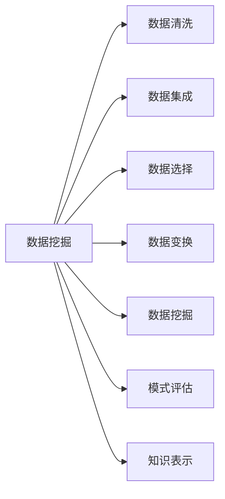
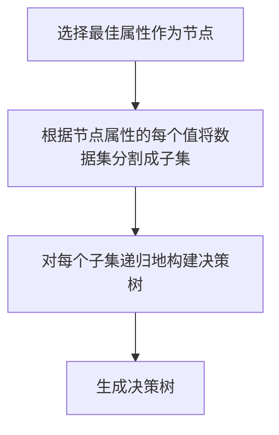

## 1.背景介绍

数据挖掘，这个概念在当今的世界中无处不在。从购物推荐、社交网络分析，到科学研究、医疗诊断，数据挖掘的应用广泛且深入。那么，数据挖掘究竟是什么？它是如何工作的？又如何在AI大数据计算中发挥作用的？这篇文章将为你揭开数据挖掘的神秘面纱。

## 2.核心概念与联系

数据挖掘是从大量的数据中通过算法搜索隐藏的信息的过程。这个过程包括数据清洗、数据集成、数据选择、数据变换、数据挖掘、模式评估和知识表示等步骤。这些步骤构成了数据挖掘的基本流程，每个步骤都有其特定的算法和方法。

在AI大数据计算中，数据挖掘扮演着至关重要的角色。AI大数据计算的目标是从大量的数据中提取有价值的信息，而数据挖掘正是实现这一目标的关键步骤。数据挖掘通过算法从数据中提取出有价值的模式和知识，这些模式和知识可以用于预测、分类、关联分析等任务，从而实现AI大数据计算的目标。



## 3.核心算法原理具体操作步骤

数据挖掘的核心是其算法。下面我们将详细介绍一种常用的数据挖掘算法——决策树算法。

决策树算法是一种监督学习算法，主要用于分类问题。它通过创建决策树来预测样本的类别。决策树的每个内部节点表示一个属性测试，每个分支代表一个测试输出，每个叶节点代表一种类别。

决策树算法的具体操作步骤如下：

1. 选择最佳属性作为节点：使用信息增益、增益率或基尼指数等方法选择最佳属性作为节点。
2. 根据节点属性的每个值将数据集分割成子集：如果属性是离散的，则每个值对应一个子集；如果属性是连续的，则使用二分法将数据集分割成两个子集。
3. 对每个子集递归地构建决策树：如果子集中的所有样本属于同一类别，那么这个子集的决策树就是一个叶节点，标记为该类别；如果子集中的样本不属于同一类别，则递归地构建决策树。
4. 生成决策树：将所有的子决策树连接起来，生成完整的决策树。



## 4.数学模型和公式详细讲解举例说明

在决策树算法中，选择最佳属性是一个关键步骤。我们通常使用信息增益、增益率或基尼指数等方法来选择最佳属性。下面我们将详细介绍这些方法。

信息增益是基于信息熵的概念。信息熵是度量样本集合纯度的一种方法，定义如下：

$$
H(D) = -\sum_{i=1}^{m} p_i \log_2 p_i
$$

其中，$D$是数据集，$m$是类别的数量，$p_i$是第$i$类样本在数据集中的比例。

信息增益定义为父节点的熵和所有子节点的熵的差，定义如下：

$$
IG(D, a) = H(D) - \sum_{v \in Values(a)} \frac{|D_v|}{|D|} H(D_v)
$$

其中，$a$是属性，$Values(a)$是属性$a$的所有可能值，$D_v$是属性$a$取值$v$的样本子集，$|D_v|$是$D_v$的样本数量，$|D|$是$D$的样本数量。

增益率是信息增益和属性熵的比，定义如下：

$$
GR(D, a) = \frac{IG(D, a)}{H_a(D)}
$$

其中，$H_a(D)$是属性$a$的熵，定义如下：

$$
H_a(D) = -\sum_{v \in Values(a)} \frac{|D_v|}{|D|} \log_2 \frac{|D_v|}{|D|}
$$

基尼指数是度量样本集合纯度的另一种方法，定义如下：

$$
Gini(D) = 1 - \sum_{i=1}^{m} p_i^2
$$

基尼指数越小，样本集合的纯度越高。

## 5.项目实践：代码实例和详细解释说明

下面我们将使用Python的scikit-learn库来实现决策树算法。我们将使用鸢尾花数据集作为示例。这个数据集包含了150个样本，每个样本有4个属性和1个类别。

首先，我们导入必要的库，并加载数据集：

```python
from sklearn import datasets
from sklearn.model_selection import train_test_split
from sklearn.tree import DecisionTreeClassifier

# 加载数据集
iris = datasets.load_iris()
X = iris.data
y = iris.target
```

然后，我们将数据集分割成训练集和测试集：

```python
# 分割数据集
X_train, X_test, y_train, y_test = train_test_split(X, y, test_size=0.2, random_state=42)
```

接下来，我们创建决策树模型，并使用训练集进行训练：

```python
# 创建决策树模型
clf = DecisionTreeClassifier()

# 使用训练集训练模型
clf.fit(X_train, y_train)
```

最后，我们使用测试集评估模型的性能：

```python
# 使用测试集评估模型
score = clf.score(X_test, y_test)
print('Accuracy:', score)
```

运行上述代码，我们可以得到决策树模型在测试集上的准确率。

## 6.实际应用场景

数据挖掘在各个领域都有广泛的应用。例如，在电商领域，数据挖掘可以用于商品推荐；在社交网络领域，数据挖掘可以用于社区发现和链接预测；在医疗领域，数据挖掘可以用于疾病预测和医疗资源优化；在金融领域，数据挖掘可以用于信用评分和欺诈检测。

## 7.工具和资源推荐

如果你对数据挖掘感兴趣，以下是一些有用的工具和资源：

- Weka：一个包含了大量数据挖掘算法的开源软件。
- Orange：一个包含了数据挖掘和机器学习功能的开源数据可视化软件。
- scikit-learn：一个包含了大量机器学习算法的Python库。
- UCI Machine Learning Repository：一个包含了大量数据集的网站，可以用于数据挖掘和机器学习的实践。

## 8.总结：未来发展趋势与挑战

随着数据的快速增长，数据挖掘的重要性也在不断提升。未来，数据挖掘将面临更大的挑战，包括处理大规模数据、处理高维数据、处理复杂数据、保护数据隐私等。同时，数据挖掘也将拥有更多的发展机会，包括结合深度学习、结合强化学习、结合迁移学习等。

## 9.附录：常见问题与解答

1. 问题：数据挖掘和机器学习有什么区别？
   答：数据挖掘是从大量的数据中通过算法搜索隐藏的信息的过程，而机器学习是让计算机通过学习数据来自动改进其性能的科学。数据挖掘和机器学习有很多相同的方法，但它们的目标不同。数据挖掘的目标是发现数据中的模式，而机器学习的目标是预测新的数据。

2. 问题：如何选择数据挖掘算法？
   答：选择数据挖掘算法主要取决于你的任务和数据。不同的任务和数据可能需要不同的算法。一般来说，你可以根据任务的类型（例如分类、回归、聚类、关联规则等）和数据的特性（例如数据的大小、维度、类型等）来选择合适的算法。

3. 问题：数据挖掘可以用于哪些领域？
   答：数据挖掘可以用于各个领域，包括电商、社交网络、医疗、金融、科学研究等。

作者：禅与计算机程序设计艺术 / Zen and the Art of Computer Programming