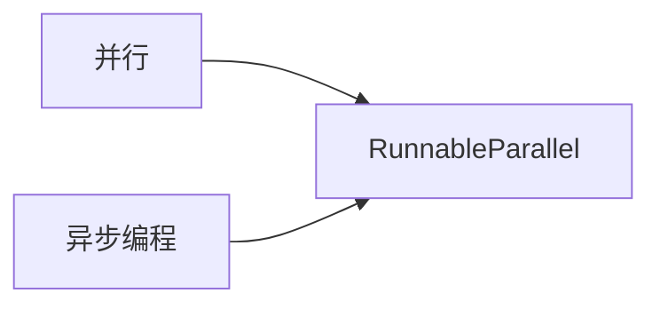

# 【LangChain编程：从入门到实践】RunnableParallel

## 1. 背景介绍
在现代软件开发中,并行计算和异步编程已成为提高系统性能和效率的关键技术。LangChain作为一个强大的自然语言处理(NLP)框架,提供了RunnableParallel这一并行执行组件,使得开发者能够方便地实现并行计算,充分利用系统资源。本文将深入探讨RunnableParallel的原理、使用方法以及实际应用,帮助读者掌握这一强大的并行编程工具。

### 1.1 并行计算的重要性
#### 1.1.1 提高系统性能
#### 1.1.2 充分利用硬件资源
#### 1.1.3 加速复杂任务处理

### 1.2 LangChain框架简介
#### 1.2.1 LangChain的核心功能
#### 1.2.2 LangChain的优势
#### 1.2.3 RunnableParallel在LangChain中的地位

## 2. 核心概念与联系
要理解RunnableParallel,首先需要掌握一些核心概念以及它们之间的联系。

### 2.1 并行(Parallel)与并发(Concurrency)
#### 2.1.1 并行的定义
#### 2.1.2 并发的定义
#### 2.1.3 二者的区别与联系

### 2.2 异步(Asynchronous)编程
#### 2.2.1 异步编程的概念
#### 2.2.2 异步编程的优势
#### 2.2.3 异步编程与并行的关系

### 2.3 RunnableParallel的定位
#### 2.3.1 RunnableParallel的功能
#### 2.3.2 RunnableParallel与其他并行组件的比较
#### 2.3.3 RunnableParallel在异步编程中的作用



## 3. 核心算法原理与具体操作步骤
RunnableParallel的实现依赖于一些核心算法和编程技术,下面将详细介绍其原理和使用步骤。

### 3.1 线程池(Thread Pool)
#### 3.1.1 线程池的概念
#### 3.1.2 线程池的优势
#### 3.1.3 RunnableParallel中的线程池实现

### 3.2 任务分割与调度
#### 3.2.1 任务分割的原则
#### 3.2.2 任务调度算法
#### 3.2.3 RunnableParallel的任务分割与调度策略

### 3.3 结果合并与异常处理
#### 3.3.1 并行任务结果的合并方式
#### 3.3.2 并行任务的异常处理
#### 3.3.3 RunnableParallel的结果合并与异常处理机制

### 3.4 使用RunnableParallel的具体步骤
#### 3.4.1 定义并行任务
#### 3.4.2 配置RunnableParallel参数
#### 3.4.3 提交任务并获取结果

## 4. 数学模型和公式详细讲解举例说明
为了更好地理解RunnableParallel的工作原理,我们可以借助一些数学模型和公式来进行分析。

### 4.1 Amdahl定律
#### 4.1.1 Amdahl定律的内容
#### 4.1.2 Amdahl定律对并行计算的指导意义
#### 4.1.3 基于Amdahl定律分析RunnableParallel的加速比

Amdahl定律可以表示为:

$S(n)=\frac{1}{(1-p)+\frac{p}{n}}$

其中,$S(n)$表示加速比,$p$表示可并行化的部分占比,$n$表示并行度。

### 4.2 任务调度模型
#### 4.2.1 任务调度问题的数学描述
#### 4.2.2 常见的任务调度算法及其复杂度
#### 4.2.3 RunnableParallel中任务调度模型的优化

假设有$n$个任务,第$i$个任务的执行时间为$t_i$,则总执行时间$T$为:

$$T=\max_{1 \leq i \leq n} t_i$$

目标是最小化$T$,即:

$$\min T=\min \max_{1 \leq i \leq n} t_i$$

### 4.3 负载均衡模型
#### 4.3.1 负载均衡的概念
#### 4.3.2 常见的负载均衡策略
#### 4.3.3 RunnableParallel中的负载均衡实现

假设有$m$个处理节点,第$j$个节点的处理能力为$c_j$,则第$i$个任务分配给第$j$个节点的处理时间$t_{ij}$为:

$$t_{ij}=\frac{t_i}{c_j}$$

目标是最小化所有任务的总处理时间,即:

$$\min \sum_{i=1}^{n} \sum_{j=1}^{m} t_{ij}$$

## 5. 项目实践：代码实例和详细解释说明
下面通过一个具体的项目实例,演示如何在实际开发中使用RunnableParallel。

### 5.1 项目背景与需求
#### 5.1.1 项目概述
#### 5.1.2 并行计算需求分析
#### 5.1.3 性能指标与目标

### 5.2 项目架构与核心代码
#### 5.2.1 项目整体架构设计
#### 5.2.2 RunnableParallel的配置与使用
#### 5.2.3 并行任务的实现

```python
from langchain.runnables import RunnableParallel

def task1():
    # 任务1的代码实现
    ...

def task2():
    # 任务2的代码实现
    ...

def main():
    tasks = [task1, task2]
    parallel = RunnableParallel(tasks, max_workers=4)
    results = parallel.run()
    print(results)

if __name__ == "__main__":
    main()
```

### 5.3 性能优化与测试
#### 5.3.1 性能瓶颈分析
#### 5.3.2 优化策略与实现
#### 5.3.3 性能测试与结果分析

## 6. 实际应用场景
RunnableParallel在许多实际场景中都有广泛应用,下面列举几个典型的例子。

### 6.1 大规模数据处理
#### 6.1.1 数据处理的并行化
#### 6.1.2 RunnableParallel在数据处理中的应用
#### 6.1.3 实际案例分析

### 6.2 机器学习模型训练
#### 6.2.1 模型训练的并行化
#### 6.2.2 RunnableParallel在模型训练中的应用
#### 6.2.3 实际案例分析

### 6.3 Web后端服务
#### 6.3.1 Web服务的并发处理
#### 6.3.2 RunnableParallel在Web后端中的应用
#### 6.3.3 实际案例分析

## 7. 工具和资源推荐
### 7.1 并行计算相关工具
#### 7.1.1 Python中的并行库
#### 7.1.2 Java中的并行框架
#### 7.1.3 C++中的并行库

### 7.2 性能分析与调优工具
#### 7.2.1 性能分析工具
#### 7.2.2 内存分析工具
#### 7.2.3 调优工具

### 7.3 学习资源推荐
#### 7.3.1 并行计算经典书籍
#### 7.3.2 在线课程与教程
#### 7.3.3 相关论文与研究

## 8. 总结：未来发展趋势与挑战
### 8.1 并行计算的发展趋势
#### 8.1.1 异构计算的兴起
#### 8.1.2 新型并行编程模型的探索
#### 8.1.3 与人工智能的结合

### 8.2 RunnableParallel的改进方向
#### 8.2.1 更智能的任务调度
#### 8.2.2 自适应的资源分配
#### 8.2.3 与分布式计算的集成

### 8.3 并行编程面临的挑战
#### 8.3.1 编程复杂度的提高
#### 8.3.2 并行Bug的定位与调试
#### 8.3.3 并行算法的设计难度

## 9. 附录：常见问题与解答
### 9.1 RunnableParallel的使用问题
#### 9.1.1 如何确定最优的并行度？
#### 9.1.2 如何处理并行任务间的数据依赖？
#### 9.1.3 如何避免任务的重复提交？

### 9.2 并行计算的常见问题
#### 9.2.1 并行计算会增加程序的复杂度吗？
#### 9.2.2 并行计算对硬件有什么要求？
#### 9.2.3 并行计算会带来哪些额外的开销？

### 9.3 其他常见问题
#### 9.3.1 并行计算与分布式计算的区别？
#### 9.3.2 并行计算是否适用于所有场景？
#### 9.3.3 如何权衡并行计算的收益与成本？

作者：禅与计算机程序设计艺术 / Zen and the Art of Computer Programming