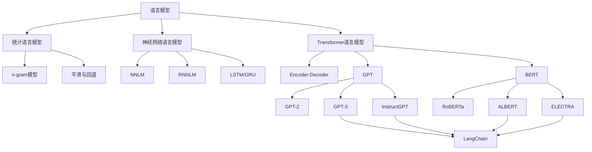

# 【LangChain编程：从入门到实践】语言模型

## 1. 背景介绍
### 1.1 语言模型的发展历程
#### 1.1.1 早期的统计语言模型
#### 1.1.2 神经网络语言模型的兴起  
#### 1.1.3 Transformer时代的到来
### 1.2 语言模型的应用现状
#### 1.2.1 自然语言处理领域的广泛应用
#### 1.2.2 对话系统和智能助手
#### 1.2.3 文本生成和创意写作
### 1.3 LangChain的出现与定位
#### 1.3.1 LangChain的诞生背景  
#### 1.3.2 LangChain的核心理念
#### 1.3.3 LangChain在语言模型编程中的独特优势

## 2. 核心概念与联系
### 2.1 语言模型的基本概念
#### 2.1.1 语言模型的定义与目标
#### 2.1.2 概率分布与条件概率
#### 2.1.3 语言模型的评估指标
### 2.2 LangChain的核心组件
#### 2.2.1 Prompts - 灵活的提示模板 
#### 2.2.2 Chains - 组合语言模型的管道
#### 2.2.3 Agents - 自主决策的智能体
### 2.3 LangChain与其他框架的比较
#### 2.3.1 与传统NLP库的区别
#### 2.3.2 与其他语言模型框架的对比
#### 2.3.3 LangChain的独特优势与局限性

## 3. 核心算法原理具体操作步骤
### 3.1 语言模型的训练过程
#### 3.1.1 数据准备与预处理
#### 3.1.2 模型架构选择与搭建
#### 3.1.3 训练循环与优化算法
### 3.2 LangChain的使用流程
#### 3.2.1 安装与环境配置
#### 3.2.2 加载预训练语言模型
#### 3.2.3 定义Prompts与Chains
#### 3.2.4 运行与调试技巧
### 3.3 LangChain的高级功能
#### 3.3.1 自定义Prompts与Chains
#### 3.3.2 多模态输入与输出
#### 3.3.3 与外部知识库的集成

## 4. 数学模型和公式详细讲解举例说明 
### 4.1 语言模型的数学基础
#### 4.1.1 概率论与信息论基础
#### 4.1.2 n-gram语言模型
#### 4.1.3 神经网络语言模型 
### 4.2 Transformer模型的数学原理
#### 4.2.1 自注意力机制
$$
Attention(Q,K,V) = softmax(\frac{QK^T}{\sqrt{d_k}})V
$$
#### 4.2.2 多头注意力
$$
MultiHead(Q,K,V) = Concat(head_1, ..., head_h)W^O \
head_i = Attention(QW_i^Q, KW_i^K, VW_i^V)
$$
#### 4.2.3 位置编码
$$
PE_{(pos,2i)} = sin(pos/10000^{2i/d_{model}}) \
PE_{(pos,2i+1)} = cos(pos/10000^{2i/d_{model}})
$$
### 4.3 LangChain中的数学应用
#### 4.3.1 相似度计算与向量搜索
#### 4.3.2 概率采样与生成策略
#### 4.3.3 优化Prompts的数学技巧

## 5. 项目实践：代码实例和详细解释说明
### 5.1 搭建一个问答系统
#### 5.1.1 加载预训练的问答模型
```python
from langchain.llms import OpenAI
from langchain.chains import LLMChain
from langchain.prompts import PromptTemplate

llm = OpenAI(model_name="text-davinci-002", max_tokens=1024)
```
#### 5.1.2 定义问答的Prompt模板
```python
template = """
根据以下背景信息，回答最后的问题。如果背景信息不足以回答问题，请说"信息不足，无法回答"。

背景信息：
{context}

问题：{question}

回答：
"""

prompt = PromptTemplate(
    input_variables=["context", "question"], 
    template=template
)
```
#### 5.1.3 组合成问答Chain并执行
```python
qa_chain = LLMChain(llm=llm, prompt=prompt)

context = "LangChain是一个基于Python的框架，用于开发使用大型语言模型的应用程序。"
question = "LangChain是用什么语言编写的？"

result = qa_chain.run(context=context, question=question)
print(result)
```

### 5.2 实现一个智能代理
#### 5.2.1 定义代理的目标与行动空间
```python
from langchain.agents import initialize_agent, Tool
from langchain.utilities import PythonREPL

tools = [
    Tool(
        name="Python REPL",
        func=PythonREPL().run,
        description="在Python环境中运行代码，当需要执行计算或编程任务时使用。"
    )
]
```
#### 5.2.2 选择代理类型并初始化
```python
agent = initialize_agent(
    tools, 
    llm, 
    agent="zero-shot-react-description", 
    verbose=True
)
```
#### 5.2.3 运行代理并观察其行为
```python
question = "使用Python计算斐波那契数列的前20项并输出。"
result = agent.run(question)
print(result)
```

### 5.3 搭建一个知识库问答系统
#### 5.3.1 准备知识库数据
#### 5.3.2 构建向量索引
#### 5.3.3 定义查询Chain
#### 5.3.4 执行问答并分析结果

## 6. 实际应用场景
### 6.1 智能客服与助手
#### 6.1.1 客户意图识别与分类
#### 6.1.2 个性化回复生成
#### 6.1.3 多轮对话管理
### 6.2 知识库问答与检索
#### 6.2.1 构建领域知识库
#### 6.2.2 语义相似度匹配与排序
#### 6.2.3 问答结果生成与优化
### 6.3 文本生成与改写
#### 6.3.1 文章自动写作
#### 6.3.2 文本风格迁移
#### 6.3.3 数据增强与清洗

## 7. 工具和资源推荐
### 7.1 预训练语言模型
#### 7.1.1 OpenAI GPT系列
#### 7.1.2 Google BERT与T5
#### 7.1.3 Meta OPT与LLaMA
### 7.2 开发框架与库
#### 7.2.1 LangChain生态
#### 7.2.2 Hugging Face Transformers
#### 7.2.3 DeepPavlov
### 7.3 数据集与评测基准
#### 7.3.1 自然语言处理数据集
#### 7.3.2 对话与问答数据集
#### 7.3.3 评测基准与竞赛

## 8. 总结：未来发展趋势与挑战
### 8.1 语言模型的发展方向
#### 8.1.1 模型规模与性能的提升
#### 8.1.2 多模态语言模型
#### 8.1.3 个性化与适应性
### 8.2 LangChain的未来展望 
#### 8.2.1 功能扩展与优化
#### 8.2.2 多语言支持
#### 8.2.3 与其他生态的融合
### 8.3 语言模型应用的挑战
#### 8.3.1 数据隐私与安全
#### 8.3.2 模型偏见与公平性
#### 8.3.3 可解释性与可控性

## 9. 附录：常见问题与解答
### 9.1 如何选择合适的语言模型？
### 9.2 LangChain的安装与配置问题
### 9.3 如何处理语言模型的不确定性输出？
### 9.4 LangChain能否支持其他编程语言？
### 9.5 如何平衡语言模型的创新性和准确性？



语言模型经历了从统计语言模型到神经网络语言模型再到Transformer语言模型的发展历程。LangChain框架建立在强大的Transformer语言模型如GPT-3、InstructGPT等之上，同时也兼容ALBERT、ELECTRA等BERT变体。通过Prompts、Chains、Agents等组件，LangChain使得在这些语言模型之上构建智能应用变得更加简单高效。

未来，语言模型将朝着模型规模与性能提升、多模态融合、个性化适应等方向发展。LangChain也将不断扩展功能、优化性能、支持多语言、融入更广阔的生态，帮助开发者应对语言模型应用中的数据隐私、偏见与公平性、可解释性等挑战，推动语言模型技术造福人类社会。

作者：禅与计算机程序设计艺术 / Zen and the Art of Computer Programming