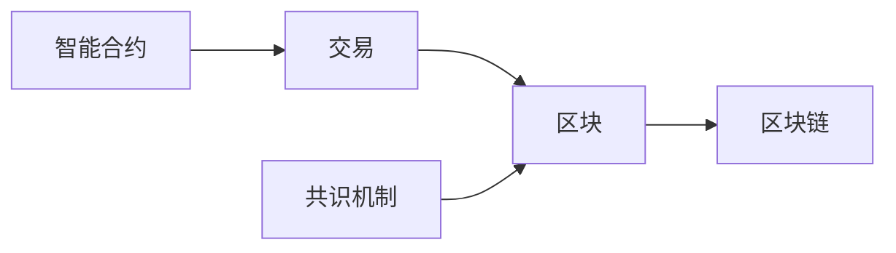

# 一个基于区块链技术的应用系统原型设计与实现

## 1. 背景介绍

区块链技术作为一种去中心化、不可篡改、高度透明的分布式账本技术，在近年来得到了广泛的关注和应用。区块链的特性使其在金融、供应链管理、医疗健康、物联网等领域展现出巨大的潜力。本文将探讨如何利用区块链技术设计和实现一个应用系统原型，旨在展示区块链技术在实际应用中的可行性和优势。

### 1.1 区块链技术概述
#### 1.1.1 区块链的定义与特点
#### 1.1.2 区块链的发展历程
#### 1.1.3 区块链的分类

### 1.2 区块链在各领域的应用现状
#### 1.2.1 金融领域
#### 1.2.2 供应链管理
#### 1.2.3 医疗健康
#### 1.2.4 物联网

### 1.3 基于区块链的应用系统设计的意义
#### 1.3.1 提高系统的安全性和可信度
#### 1.3.2 实现数据的不可篡改和可追溯
#### 1.3.3 降低系统运营成本

## 2. 核心概念与联系

在设计基于区块链的应用系统时，需要了解一些核心概念以及它们之间的联系。本节将对这些概念进行介绍，并通过一个示例说明它们是如何协同工作的。

### 2.1 交易（Transaction）
#### 2.1.1 交易的定义
#### 2.1.2 交易的结构
#### 2.1.3 交易的验证与确认

### 2.2 区块（Block）
#### 2.2.1 区块的定义
#### 2.2.2 区块的结构
#### 2.2.3 区块的生成与链接

### 2.3 共识机制（Consensus Mechanism）
#### 2.3.1 共识机制的定义与作用
#### 2.3.2 工作量证明（PoW）
#### 2.3.3 权益证明（PoS）
#### 2.3.4 其他共识机制

### 2.4 智能合约（Smart Contract）
#### 2.4.1 智能合约的定义
#### 2.4.2 智能合约的特点
#### 2.4.3 智能合约的应用场景

### 2.5 核心概念之间的联系



上图展示了交易、区块、区块链、共识机制和智能合约之间的关系。交易被打包到区块中，区块通过共识机制被验证并链接成区块链。智能合约可以触发交易的执行。

## 3. 核心算法原理与具体操作步骤

本节将介绍区块链中的几个核心算法，包括哈希算法、非对称加密算法和默克尔树，并给出它们的具体操作步骤。

### 3.1 哈希算法（Hash Algorithm）
#### 3.1.1 哈希算法的定义与特点
#### 3.1.2 常用的哈希算法（SHA-256）
#### 3.1.3 哈希算法在区块链中的应用

### 3.2 非对称加密算法（Asymmetric Encryption Algorithm）
#### 3.2.1 非对称加密算法的定义
#### 3.2.2 公钥与私钥
#### 3.2.3 数字签名
#### 3.2.4 非对称加密算法在区块链中的应用

### 3.3 默克尔树（Merkle Tree）
#### 3.3.1 默克尔树的定义
#### 3.3.2 默克尔树的构建过程
#### 3.3.3 默克尔树在区块链中的应用

### 3.4 具体操作步骤
#### 3.4.1 生成交易哈希
#### 3.4.2 生成区块哈希
#### 3.4.3 构建默克尔树
#### 3.4.4 验证交易和区块

## 4. 数学模型和公式详细讲解举例说明

为了更好地理解区块链中的数学原理，本节将介绍几个关键的数学模型和公式，并通过具体的例子进行讲解。

### 4.1 椭圆曲线数字签名算法（ECDSA）
#### 4.1.1 椭圆曲线的定义
椭圆曲线的一般形式为：

$$y^2 = x^3 + ax + b$$

其中，$a$ 和 $b$ 为常数，满足条件 $4a^3 + 27b^2 \neq 0$。

#### 4.1.2 椭圆曲线上的点运算
设 $P(x_1, y_1)$ 和 $Q(x_2, y_2)$ 为椭圆曲线上的两个点，它们的和 $R(x_3, y_3) = P + Q$ 的计算公式为：

$$
\begin{aligned}
x_3 &= \lambda^2 - x_1 - x_2 \
y_3 &= \lambda(x_1 - x_3) - y_1
\end{aligned}
$$

其中，

$$
\lambda = \begin{cases}
\frac{y_2 - y_1}{x_2 - x_1}, & \text{if } P \neq Q \
\frac{3x_1^2 + a}{2y_1}, & \text{if } P = Q
\end{cases}
$$

#### 4.1.3 ECDSA签名与验证过程

### 4.2 比特币的难度目标（Difficulty Target）
#### 4.2.1 难度目标的定义
#### 4.2.2 难度目标的调整机制
比特币网络每 2016 个区块（约两周）调整一次难度目标，调整公式为：

$$T_{next} = T_{prev} \times \frac{t_{actual}}{t_{expected}}$$

其中，$T_{next}$ 为新的难度目标，$T_{prev}$ 为前一个难度目标，$t_{actual}$ 为生成最近 2016 个区块实际花费的时间，$t_{expected}$ 为期望花费的时间（2016 × 10分钟）。

#### 4.2.3 难度目标对挖矿的影响

## 5. 项目实践：代码实例和详细解释说明

本节将通过一个简单的区块链应用系统原型的代码实例，对区块链的核心组件进行详细的解释说明。

### 5.1 项目概述
#### 5.1.1 项目目标
#### 5.1.2 项目架构

### 5.2 核心组件代码实现
#### 5.2.1 区块（Block）
```python
class Block:
    def __init__(self, index, timestamp, transactions, previous_hash):
        self.index = index
        self.timestamp = timestamp
        self.transactions = transactions
        self.previous_hash = previous_hash
        self.hash = self.calculate_hash()

    def calculate_hash(self):
        # 计算区块哈希值的代码实现
        pass
```

#### 5.2.2 交易（Transaction）
```python
class Transaction:
    def __init__(self, sender, recipient, amount):
        self.sender = sender
        self.recipient = recipient
        self.amount = amount
```

#### 5.2.3 区块链（Blockchain）
```python
class Blockchain:
    def __init__(self):
        self.chain = [self.create_genesis_block()]
        self.pending_transactions = []

    def create_genesis_block(self):
        # 创建创世区块的代码实现
        pass

    def add_block(self, block):
        # 添加区块到区块链的代码实现
        pass

    def add_transaction(self, transaction):
        # 添加交易到待处理交易列表的代码实现
        pass

    def mine_pending_transactions(self, mining_reward_address):
        # 挖矿并将待处理交易打包到区块的代码实现
        pass
```

### 5.3 代码解释说明
#### 5.3.1 区块的结构与哈希计算
#### 5.3.2 交易的结构与验证
#### 5.3.3 区块链的初始化与区块添加
#### 5.3.4 挖矿与交易打包

## 6. 实际应用场景

本节将探讨基于区块链的应用系统在实际场景中的应用，包括供应链管理、医疗健康数据共享和电子投票系统。

### 6.1 供应链管理
#### 6.1.1 供应链管理中的痛点
#### 6.1.2 区块链在供应链管理中的应用
#### 6.1.3 案例分析

### 6.2 医疗健康数据共享
#### 6.2.1 医疗健康数据共享面临的挑战
#### 6.2.2 区块链在医疗健康数据共享中的应用
#### 6.2.3 案例分析

### 6.3 电子投票系统
#### 6.3.1 传统电子投票系统的局限性
#### 6.3.2 基于区块链的电子投票系统
#### 6.3.3 案例分析

## 7. 工具和资源推荐

本节将推荐一些常用的区块链开发工具和学习资源，帮助读者进一步探索和实践区块链技术。

### 7.1 开发工具
#### 7.1.1 以太坊（Ethereum）
#### 7.1.2 Hyperledger Fabric
#### 7.1.3 比特币（Bitcoin）

### 7.2 学习资源
#### 7.2.1 在线课程
#### 7.2.2 书籍
#### 7.2.3 社区与论坛

## 8. 总结：未来发展趋势与挑战

区块链技术虽然展现出巨大的潜力，但仍然面临着一些挑战和局限性。本节将总结区块链技术的未来发展趋势，并讨论其面临的挑战。

### 8.1 未来发展趋势
#### 8.1.1 跨链互操作
#### 8.1.2 隐私保护
#### 8.1.3 可扩展性

### 8.2 面临的挑战
#### 8.2.1 法规与合规
#### 8.2.2 能源消耗
#### 8.2.3 用户体验

## 9. 附录：常见问题与解答

### 9.1 区块链与分布式数据库的区别是什么？
### 9.2 区块链是否真正不可篡改？
### 9.3 区块链的性能瓶颈有哪些？
### 9.4 区块链技术是否适用于所有场景？

作者：禅与计算机程序设计艺术 / Zen and the Art of Computer Programming