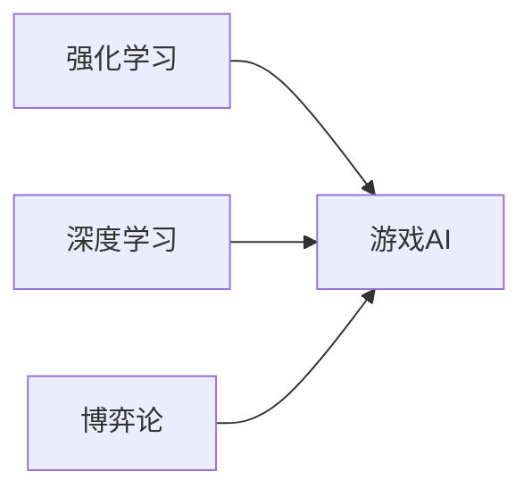

# 一切皆是映射：AI在游戏开发中的应用

## 1.背景介绍

人工智能(Artificial Intelligence,AI)技术的飞速发展正在深刻影响着各个行业,游戏产业也不例外。AI技术在游戏开发中的应用日益广泛,从游戏设计、开发到测试、运营的各个环节,AI都扮演着越来越重要的角色。本文将深入探讨AI在游戏开发中的应用,揭示AI如何重塑游戏产业格局。

### 1.1 AI在游戏产业的发展历程

#### 1.1.1 早期AI应用
#### 1.1.2 深度学习时代的AI游戏
#### 1.1.3 未来AI游戏的发展趋势

### 1.2 AI给游戏开发带来的变革

#### 1.2.1 游戏设计的智能化
#### 1.2.2 游戏开发效率的提升
#### 1.2.3 游戏体验的革新

### 1.3 游戏产业对AI人才的需求

#### 1.3.1 AI游戏开发人才缺口
#### 1.3.2 跨界人才的重要性
#### 1.3.3 人才培养与教育

## 2.核心概念与联系

游戏开发中的AI应用涉及多个核心概念,理解这些概念之间的联系对于掌握AI游戏开发至关重要。

### 2.1 强化学习与游戏AI

#### 2.1.1 强化学习的基本原理
#### 2.1.2 强化学习在游戏AI中的应用
#### 2.1.3 基于强化学习的游戏AI框架

### 2.2 深度学习与游戏AI

#### 2.2.1 卷积神经网络在游戏场景理解中的应用
#### 2.2.2 循环神经网络在游戏对话系统中的应用
#### 2.2.3 生成对抗网络在游戏画面生成中的应用

### 2.3 博弈论与游戏AI

#### 2.3.1 博弈论基本概念
#### 2.3.2 纳什均衡在游戏AI中的应用
#### 2.3.3 博弈树搜索算法在游戏AI中的应用

### 2.4 核心概念之间的联系



## 3.核心算法原理具体操作步骤

### 3.1 蒙特卡洛树搜索(MCTS)算法

#### 3.1.1 MCTS算法原理
#### 3.1.2 MCTS算法的4个关键步骤
#### 3.1.3 MCTS算法在游戏AI中的应用实例

### 3.2 Deep Q-Network(DQN)算法

#### 3.2.1 Q-Learning算法原理
#### 3.2.2 DQN算法原理
#### 3.2.3 DQN算法的训练过程
#### 3.2.4 DQN算法在游戏AI中的应用实例

### 3.3 Proximal Policy Optimization(PPO)算法

#### 3.3.1 策略梯度算法原理
#### 3.3.2 PPO算法原理
#### 3.3.3 PPO算法的训练过程
#### 3.3.4 PPO算法在游戏AI中的应用实例

## 4.数学模型和公式详细讲解举例说明

### 4.1 马尔可夫决策过程(MDP)

MDP是强化学习的理论基础,可用一个五元组 $\langle S,A,P,R,\gamma \rangle$ 来表示:

- $S$ 是有限状态集
- $A$ 是有限动作集
- $P$ 是状态转移概率矩阵
- $R$ 是奖励函数
- $\gamma$ 是折扣因子

求解MDP的目标是寻找一个最优策略 $\pi^*$,使得期望总奖励最大化:

$$\pi^* = \arg\max_\pi \mathbb{E}\left[\sum_{t=0}^{\infty} \gamma^t r_t | \pi \right]$$

其中 $r_t$ 表示在时刻 $t$ 采取动作 $a_t$ 后获得的奖励。

### 4.2 Q-Learning

Q-Learning是一种值迭代的时序差分算法,通过不断更新状态-动作值函数 $Q(s,a)$ 来逼近最优策略。

Q-Learning的更新公式为:

$$Q(s_t,a_t) \leftarrow Q(s_t,a_t) + \alpha \left[r_t + \gamma \max_a Q(s_{t+1},a) - Q(s_t,a_t)\right]$$

其中 $\alpha$ 是学习率。

### 4.3 策略梯度定理

策略梯度定理给出了策略梯度的数学形式:

$$\nabla_\theta J(\theta) = \mathbb{E}_{\tau \sim p_\theta(\tau)}\left[\sum_{t=0}^T \nabla_\theta \log \pi_\theta(a_t|s_t) Q^{\pi_\theta}(s_t,a_t)\right]$$

其中 $\tau$ 表示一条轨迹,  $p_\theta(\tau)$ 是轨迹分布, $Q^{\pi_\theta}(s_t,a_t)$ 是状态-动作值函数。

## 5.项目实践：代码实例和详细解释说明

下面以 PyTorch 实现 DQN 算法为例,展示如何用代码实现游戏AI。

```python
import torch
import torch.nn as nn
import torch.optim as optim
import numpy as np
import random
from collections import deque

class DQN(nn.Module):
    def __init__(self, state_size, action_size):
        super(DQN, self).__init__()
        self.fc1 = nn.Linear(state_size, 64)
        self.fc2 = nn.Linear(64, 64)
        self.fc3 = nn.Linear(64, action_size)

    def forward(self, x):
        x = torch.relu(self.fc1(x))
        x = torch.relu(self.fc2(x))
        x = self.fc3(x)
        return x

class Agent:
    def __init__(self, state_size, action_size):
        self.state_size = state_size
        self.action_size = action_size
        self.memory = deque(maxlen=2000)
        self.gamma = 0.95  # discount rate
        self.epsilon = 1.0  # exploration rate
        self.epsilon_min = 0.01
        self.epsilon_decay = 0.995
        self.learning_rate = 0.001
        self.model = DQN(state_size, action_size)
        self.optimizer = optim.Adam(self.model.parameters(), lr=self.learning_rate)

    def remember(self, state, action, reward, next_state, done):
        self.memory.append((state, action, reward, next_state, done))

    def act(self, state):
        if np.random.rand() <= self.epsilon:
            return random.randrange(self.action_size)
        state = torch.tensor(state, dtype=torch.float32).unsqueeze(0)
        act_values = self.model(state)
        return torch.argmax(act_values[0]).item()  # returns action

    def replay(self, batch_size):
        minibatch = random.sample(self.memory, batch_size)
        for state, action, reward, next_state, done in minibatch:
            state = torch.tensor(state, dtype=torch.float32).unsqueeze(0)
            next_state = torch.tensor(next_state, dtype=torch.float32).unsqueeze(0)
            target = reward
            if not done:
              target = reward + self.gamma * torch.max(self.model(next_state)[0])
            target_f = self.model(state)
            target_f[0][action] = target
            loss = nn.MSELoss()(self.model(state), target_f)
            self.optimizer.zero_grad()
            loss.backward()
            self.optimizer.step()
        if self.epsilon > self.epsilon_min:
            self.epsilon *= self.epsilon_decay
```

上述代码实现了DQN算法的核心组件,包括:

- `DQN` 类:定义了神经网络模型的结构
- `Agent` 类:实现了DQN算法的训练过程,包括经验回放、ε-贪心策略等
- `remember` 方法:将转移样本存储到经验回放缓存中
- `act` 方法:根据当前状态选择动作,兼顾探索和利用
- `replay` 方法:从经验回放缓存中随机采样,并利用TD误差更新模型参数

通过合理设置超参数并在适当的游戏环境中训练,该DQN算法可以学习到优秀的游戏策略。

## 6.实际应用场景

### 6.1 游戏内容生成

#### 6.1.1 关卡生成
#### 6.1.2 游戏地图生成
#### 6.1.3 游戏任务生成

### 6.2 游戏测试与调优

#### 6.2.1 自动化游戏测试
#### 6.2.2 游戏平衡性测试与调优
#### 6.2.3 游戏难度自适应调节

### 6.3 游戏NPC智能

#### 6.3.1 NPC行为决策
#### 6.3.2 NPC对话生成
#### 6.3.3 NPC情感模拟

### 6.4 游戏数据分析

#### 6.4.1 玩家行为分析与建模
#### 6.4.2 游戏数据可视化
#### 6.4.3 游戏舞弊检测

## 7.工具和资源推荐

### 7.1 游戏引擎与AI插件

#### 7.1.1 Unity ML-Agents
#### 7.1.2 Unreal Engine 机器学习工具集
#### 7.1.3 Godot 游戏引擎的AI扩展

### 7.2 机器学习平台与框架

#### 7.2.1 TensorFlow与Keras
#### 7.2.2 PyTorch
#### 7.2.3 OpenAI Gym

### 7.3 游戏AI竞赛与学习资源

#### 7.3.1 Kaggle游戏AI竞赛
#### 7.3.2 CodinGame平台
#### 7.3.3 国内外高校开设的游戏AI相关课程

## 8.总结：未来发展趋势与挑战

### 8.1 游戏AI的未来发展趋势

#### 8.1.1 多智能体协作与博弈
#### 8.1.2 跨模态游戏AI
#### 8.1.3 AI驱动的游戏创作

### 8.2 游戏AI面临的挑战

#### 8.2.1 通用游戏AI的实现难度
#### 8.2.2 AI游戏的伦理与安全问题
#### 8.2.3 AI游戏开发人才短缺

### 8.3 游戏AI的研究方向展望

#### 8.3.1 强化学习与计算博弈论的结合
#### 8.3.2 结合认知科学与神经科学的游戏AI
#### 8.3.3 面向开发者的游戏AI工具链建设

## 9.附录：常见问题与解答

### 9.1 如何入门游戏AI开发?
### 9.2 游戏AI和传统游戏脚本有什么区别?
### 9.3 游戏AI开发需要哪些技术背景?
### 9.4 目前业界有哪些优秀的游戏AI案例?
### 9.5 游戏AI算法在其他领域是否有应用前景?

作者：禅与计算机程序设计艺术 / Zen and the Art of Computer Programming