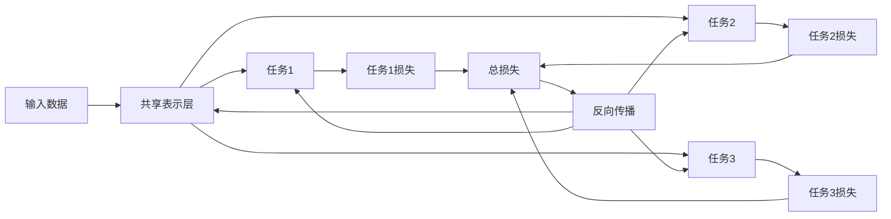

# 一切皆是映射：多任务学习与神经网络的协同训练

## 1.背景介绍
### 1.1 人工智能的发展历程
#### 1.1.1 人工智能的起源与定义
#### 1.1.2 人工智能的三次浪潮
#### 1.1.3 深度学习的崛起

### 1.2 多任务学习的研究现状
#### 1.2.1 多任务学习的概念
#### 1.2.2 多任务学习的优势
#### 1.2.3 多任务学习的挑战

### 1.3 神经网络的发展与应用
#### 1.3.1 神经网络的基本原理
#### 1.3.2 神经网络的发展历程
#### 1.3.3 神经网络在各领域的应用

## 2.核心概念与联系
### 2.1 映射的数学定义
#### 2.1.1 映射的概念
#### 2.1.2 映射的性质
#### 2.1.3 映射在机器学习中的应用

### 2.2 多任务学习的形式化描述
#### 2.2.1 多任务学习的数学表示
#### 2.2.2 多任务学习的目标函数
#### 2.2.3 多任务学习的优化方法

### 2.3 神经网络与多任务学习的关联
#### 2.3.1 神经网络实现多任务学习的机制
#### 2.3.2 共享表示与特定任务表示
#### 2.3.3 参数共享与任务相关性

## 3.核心算法原理具体操作步骤
### 3.1 多任务学习的算法框架
#### 3.1.1 硬参数共享
#### 3.1.2 软参数共享
#### 3.1.3 任务聚类

### 3.2 基于神经网络的多任务学习算法
#### 3.2.1 多任务卷积神经网络（MT-CNN）
#### 3.2.2 多任务循环神经网络（MT-RNN）
#### 3.2.3 多任务图神经网络（MT-GNN）

### 3.3 协同训练策略
#### 3.3.1 交替训练
#### 3.3.2 联合训练
#### 3.3.3 对抗训练

## 4.数学模型和公式详细讲解举例说明
### 4.1 多任务学习的数学建模
#### 4.1.1 任务相关性度量
#### 4.1.2 多任务目标函数构建
#### 4.1.3 正则化项设计

### 4.2 神经网络中的数学原理
#### 4.2.1 前向传播与反向传播
#### 4.2.2 激活函数与损失函数
#### 4.2.3 优化算法与参数更新

### 4.3 协同训练中的数学问题
#### 4.3.1 梯度平衡问题
#### 4.3.2 任务难易程度不一致问题
#### 4.3.3 泛化能力与过拟合问题

## 5.项目实践：代码实例和详细解释说明
### 5.1 基于PyTorch的多任务学习实现
#### 5.1.1 数据集准备与预处理
#### 5.1.2 模型构建与训练
#### 5.1.3 结果评估与分析

### 5.2 基于TensorFlow的协同训练实现
#### 5.2.1 模型设计与参数配置
#### 5.2.2 训练过程与策略选择
#### 5.2.3 模型性能评估与优化

### 5.3 实际项目案例分享
#### 5.3.1 多任务学习在自然语言处理中的应用
#### 5.3.2 协同训练在计算机视觉中的应用
#### 5.3.3 多任务学习与协同训练在推荐系统中的应用

## 6.实际应用场景
### 6.1 智能助理与对话系统
#### 6.1.1 多任务学习在语义理解中的应用
#### 6.1.2 协同训练在对话生成中的应用
#### 6.1.3 个性化推荐与用户画像

### 6.2 自动驾驶与智能交通
#### 6.2.1 多任务学习在场景理解中的应用
#### 6.2.2 协同训练在决策控制中的应用
#### 6.2.3 交通流预测与路径规划

### 6.3 医疗影像分析与辅助诊断
#### 6.3.1 多任务学习在病灶检测中的应用
#### 6.3.2 协同训练在影像分割中的应用
#### 6.3.3 疾病预测与风险评估

## 7.工具和资源推荐
### 7.1 深度学习框架
#### 7.1.1 PyTorch
#### 7.1.2 TensorFlow
#### 7.1.3 Keras

### 7.2 数据集资源
#### 7.2.1 ImageNet
#### 7.2.2 COCO
#### 7.2.3 WikiText

### 7.3 学习资料与社区
#### 7.3.1 论文与文献
#### 7.3.2 在线课程与教程
#### 7.3.3 开源项目与社区交流

## 8.总结：未来发展趋势与挑战
### 8.1 多任务学习的研究方向
#### 8.1.1 任务关联性建模
#### 8.1.2 动态多任务学习
#### 8.1.3 多模态多任务学习

### 8.2 协同训练的优化策略
#### 8.2.1 自适应权重调整
#### 8.2.2 知识蒸馏与迁移学习
#### 8.2.3 联邦学习与隐私保护

### 8.3 面临的挑战与机遇
#### 8.3.1 可解释性与可信性
#### 8.3.2 鲁棒性与安全性
#### 8.3.3 大规模应用与部署

## 9.附录：常见问题与解答
### 9.1 多任务学习与迁移学习的区别
### 9.2 如何选择合适的任务组合
### 9.3 协同训练中的超参数调优策略
### 9.4 多任务学习模型的评估指标
### 9.5 协同训练中的梯度消失与梯度爆炸问题

多任务学习是机器学习领域的一个重要分支,其核心思想是通过同时学习多个相关任务,利用任务之间的相关性和互补性,提高模型的泛化能力和学习效率。在多任务学习中,神经网络被广泛应用于实现多个任务的共享表示学习和协同训练。本文将深入探讨多任务学习与神经网络协同训练的原理、方法和应用,揭示其中蕴含的"一切皆是映射"的本质。

映射是数学中的一个基本概念,指从一个集合到另一个集合的对应关系。在机器学习中,我们可以将输入数据看作是一个集合,将输出结果看作是另一个集合,而机器学习模型的本质就是学习一个映射函数,将输入映射到正确的输出。多任务学习中,我们希望学习一个共享的映射函数,将输入数据映射到多个任务的输出空间。

神经网络是一种强大的函数逼近器,能够学习任意复杂的非线性映射。在多任务学习中,我们通常使用共享的神经网络层来学习多个任务的共同表示,再通过任务特定的输出层将共同表示映射到各自的输出空间。这种架构使得不同任务之间可以共享知识,同时又能保持一定的独立性。

多任务学习的目标函数可以表示为多个任务损失函数的加权和:

$$\mathcal{L}=\sum_{i=1}^{T} w_i \mathcal{L}_i$$

其中,$\mathcal{L}_i$表示第$i$个任务的损失函数,$w_i$表示第$i$个任务的权重系数,$T$表示任务的总数。通过调整权重系数,我们可以控制不同任务在训练过程中的重要程度。

在协同训练的过程中,我们需要权衡各个任务的学习进度,避免某些任务过拟合而其他任务欠拟合。一种常用的策略是动态调整任务权重,根据任务的学习难度和收敛速度自适应地调整权重系数。例如,可以使用如下公式更新权重:

$$w_i^{t+1}=w_i^t \cdot \exp(\lambda \mathcal{L}_i^t/\bar{\mathcal{L}}^t)$$

其中,$w_i^t$表示第$t$轮迭代中第$i$个任务的权重,$\mathcal{L}_i^t$表示第$t$轮迭代中第$i$个任务的损失,$\bar{\mathcal{L}}^t$表示第$t$轮迭代中所有任务损失的平均值,$\lambda$是一个超参数,控制权重调整的幅度。

除了权重调整,协同训练还面临着梯度平衡、任务难度不一致等问题。为了缓解这些问题,我们可以采用梯度裁剪、梯度归一化等技术,确保不同任务的梯度在同一量级。此外,还可以引入课程学习、知识蒸馏等策略,先学习简单任务,再逐步过渡到复杂任务,实现平滑的多任务学习过程。

多任务学习与神经网络的协同训练已经在许多领域取得了显著的成果,如自然语言处理、计算机视觉、推荐系统等。以自然语言处理为例,我们可以将命名实体识别、词性标注、语义角色标注等任务组合在一起,共享底层的词向量表示,实现多任务的协同学习。在计算机视觉中,我们可以将目标检测、语义分割、关键点检测等任务结合起来,共享卷积神经网络的特征提取能力,提升模型的泛化性能。

展望未来,多任务学习和神经网络协同训练还有许多值得探索的方向。如何建模任务之间的关联性,如何设计动态的多任务学习框架,如何处理多模态数据的多任务学习等,都是亟待解决的问题。此外,随着深度学习模型的不断发展,如何提高多任务学习的可解释性、鲁棒性和安全性,也是我们面临的挑战。

总之,多任务学习与神经网络的协同训练为人工智能的发展开辟了广阔的前景。通过探索"一切皆是映射"的本质,我们可以更好地理解和应用这一范式,推动人工智能在各个领域的应用和突破。让我们携手并进,共同开创多任务学习的新纪元!

作者：禅与计算机程序设计艺术 / Zen and the Art of Computer Programming