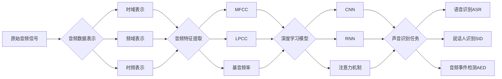

# 一切皆是映射：音频数据处理：深度学习与声音识别

## 1.背景介绍

在当今数字时代,音频数据无处不在。从音乐流媒体服务到语音助手,从呼叫中心到视频会议,音频数据正在塑造着我们与技术互动的方式。然而,处理和理解这些海量的音频数据对于传统的算法来说是一个巨大的挑战。近年来,深度学习技术的兴起为音频数据处理开辟了新的可能性。深度学习模型能够从原始音频信号中自动学习和提取高层次的特征表示,并应用于各种声音识别任务,如语音识别、说话人识别、音频事件检测等。

本文将深入探讨深度学习在音频数据处理和声音识别领域的应用。我们将从音频数据的基本概念出发,讨论如何将原始音频信号转化为适合深度学习模型的输入表示。然后,我们将介绍几种常用的深度学习模型架构,如卷积神经网络(CNN)、循环神经网络(RNN)和注意力机制,并分析它们在音频领域的优势和局限性。接下来,我们将通过实际的代码示例,演示如何使用Python和流行的深度学习框架如TensorFlow和PyTorch来构建和训练声音识别模型。我们还将讨论一些实际应用场景,如语音助手、音乐推荐系统和声音异常检测等。最后,我们将展望未来,探讨深度学习在音频领域的发展趋势和面临的挑战。

## 2.核心概念与联系

### 2.1 音频数据的表示

- 时域表示:音频信号在时间轴上的幅值变化
- 频域表示:音频信号在频率轴上的能量分布
- 时频表示:音频信号在时间-频率平面上的能量分布

### 2.2 音频特征提取

- 梅尔频率倒谱系数(MFCC):基于人耳听觉特性的频谱特征
- 线性预测倒谱系数(LPCC):基于线性预测分析的频谱特征
- 基音频率(F0):反映音高的重要特征

### 2.3 深度学习模型

- 卷积神经网络(CNN):善于提取局部特征和空间结构信息
- 循环神经网络(RNN):擅长处理序列数据和捕捉长期依赖关系
- 注意力机制:能够动态地关注输入序列中的关键信息

### 2.4 声音识别任务

- 语音识别(ASR):将语音信号转化为文本
- 说话人识别(SID):识别说话人的身份
- 音频事件检测(AED):检测音频中的特定事件或声音类别

下图展示了这些核心概念之间的联系:



## 3.核心算法原理具体操作步骤

### 3.1 梅尔频率倒谱系数(MFCC)提取

1. 对音频信号进行预加重,增强高频部分
2. 对信号进行分帧,每帧长度通常为20-40ms
3. 对每帧信号进行汉明窗加窗,减少频谱泄漏
4. 对每帧信号进行快速傅里叶变换(FFT),得到频谱
5. 将频谱映射到梅尔频率尺度上,模拟人耳听觉特性
6. 对梅尔频谱取对数,得到对数梅尔频谱
7. 对对数梅尔频谱进行离散余弦变换(DCT),得到MFCC特征

### 3.2 卷积神经网络(CNN)

1. 输入层:接收音频特征(如MFCC)
2. 卷积层:使用卷积核对输入进行卷积操作,提取局部特征
3. 池化层:对卷积结果进行下采样,减少参数数量
4. 全连接层:将提取的特征映射到输出类别
5. 输出层:输出最终的预测结果(如语音识别的文本)

### 3.3 循环神经网络(RNN)

1. 输入层:接收音频特征序列
2. 循环层:使用循环单元(如LSTM或GRU)处理序列数据
3. 输出层:输出每个时间步的预测结果或整个序列的预测结果

### 3.4 注意力机制

1. 编码器:使用CNN或RNN对输入序列进行编码,得到编码向量
2. 注意力层:根据查询向量和编码向量计算注意力权重
3. 加权求和:使用注意力权重对编码向量进行加权求和,得到上下文向量
4. 解码器:使用上下文向量和之前的输出预测当前时间步的输出

## 4.数学模型和公式详细讲解举例说明

### 4.1 梅尔频率倒谱系数(MFCC)

MFCC的计算公式如下:

1. 预加重:

   $x'(n) = x(n) - \alpha x(n-1)$

   其中$\alpha$通常取0.97。

2. 分帧和加窗:

   $x_i(n) = x'(n)w(n-iM)$

   其中$w(n)$是汉明窗函数,$M$是帧移。

3. 快速傅里叶变换(FFT):

   $X_i(k) = \sum_{n=0}^{N-1} x_i(n)e^{-j\frac{2\pi}{N}kn}$

4. 梅尔频率尺度映射:

   $M(f) = 2595\log_{10}(1+\frac{f}{700})$

5. 对数梅尔频谱:

   $S(m) = \log\left(\sum_{k=0}^{N-1} |X_i(k)|^2 H_m(k)\right)$

   其中$H_m(k)$是第$m$个梅尔滤波器。

6. 离散余弦变换(DCT):

   $c(n) = \sum_{m=0}^{M-1} S(m)\cos\left(\frac{\pi n(m+0.5)}{M}\right)$

最终得到的$c(n)$即为MFCC特征。

### 4.2 卷积神经网络(CNN)

卷积操作的数学公式为:

$y(i,j) = \sum_{m=0}^{M-1}\sum_{n=0}^{N-1} x(i+m,j+n)w(m,n)$

其中$x$是输入特征图,$w$是卷积核,$y$是输出特征图。

池化操作的数学公式为:

- 最大池化:

  $y(i,j) = \max_{(m,n)\in R} x(i+m,j+n)$

- 平均池化:

  $y(i,j) = \frac{1}{|R|}\sum_{(m,n)\in R} x(i+m,j+n)$

其中$R$是池化窗口。

### 4.3 循环神经网络(RNN)

以LSTM为例,其前向传播公式为:

$f_t = \sigma(W_f\cdot[h_{t-1},x_t] + b_f)$

$i_t = \sigma(W_i\cdot[h_{t-1},x_t] + b_i)$

$\tilde{C}_t = \tanh(W_C\cdot[h_{t-1},x_t] + b_C)$

$C_t = f_t*C_{t-1} + i_t*\tilde{C}_t$

$o_t = \sigma(W_o\cdot[h_{t-1},x_t] + b_o)$

$h_t = o_t*\tanh(C_t)$

其中$f_t$是遗忘门,$i_t$是输入门,$o_t$是输出门,$C_t$是细胞状态,$h_t$是隐藏状态。

### 4.4 注意力机制

注意力权重的计算公式为:

$e_{ij} = a(s_{i-1},h_j)$

$\alpha_{ij} = \frac{\exp(e_{ij})}{\sum_{k=1}^{T_x}\exp(e_{ik})}$

其中$a$是注意力评分函数,$s_{i-1}$是解码器的上一个隐藏状态,$h_j$是编码器的第$j$个隐藏状态。

上下文向量的计算公式为:

$c_i = \sum_{j=1}^{T_x} \alpha_{ij}h_j$

其中$c_i$是第$i$个时间步的上下文向量。

## 5.项目实践：代码实例和详细解释说明

下面是一个使用TensorFlow实现基于CNN的语音识别模型的示例代码:

```python
import tensorflow as tf

# 定义模型参数
num_classes = 10  # 类别数
input_shape = (128, 128, 1)  # 输入形状

# 构建CNN模型
model = tf.keras.Sequential([
    tf.keras.layers.Conv2D(32, (3, 3), activation='relu', input_shape=input_shape),
    tf.keras.layers.MaxPooling2D((2, 2)),
    tf.keras.layers.Conv2D(64, (3, 3), activation='relu'),
    tf.keras.layers.MaxPooling2D((2, 2)),
    tf.keras.layers.Conv2D(64, (3, 3), activation='relu'),
    tf.keras.layers.Flatten(),
    tf.keras.layers.Dense(64, activation='relu'),
    tf.keras.layers.Dense(num_classes, activation='softmax')
])

# 编译模型
model.compile(optimizer='adam',
              loss='categorical_crossentropy',
              metrics=['accuracy'])

# 训练模型
model.fit(train_images, train_labels, epochs=10, batch_size=32)

# 评估模型
test_loss, test_acc = model.evaluate(test_images, test_labels)
print('Test accuracy:', test_acc)
```

代码解释:

1. 首先定义模型参数,包括类别数和输入形状。
2. 使用`tf.keras.Sequential`构建CNN模型,包含多个卷积层、池化层和全连接层。
3. 使用`model.compile`编译模型,指定优化器、损失函数和评估指标。
4. 使用`model.fit`训练模型,指定训练数据、训练轮数和批次大小。
5. 使用`model.evaluate`评估模型在测试集上的性能。

这个示例代码展示了如何使用TensorFlow构建和训练一个基于CNN的语音识别模型。实际应用中,还需要对音频数据进行预处理,提取合适的特征表示,并根据具体任务调整模型架构和超参数。

## 6.实际应用场景

深度学习在音频数据处理和声音识别领域有广泛的应用,下面是一些常见的应用场景:

### 6.1 语音助手

智能语音助手如Apple Siri、Google Assistant、Amazon Alexa等,都依赖于语音识别技术将用户的语音命令转化为文本,然后进行自然语言理解和任务执行。深度学习模型在其中扮演着关键角色,能够处理不同口音、噪声环境下的语音输入,提高识别准确率。

### 6.2 音乐推荐系统

音乐流媒体平台如Spotify、Pandora等,利用深度学习技术分析用户的音乐偏好,提供个性化的音乐推荐。通过对音频信号进行分析,提取旋律、节奏、音色等特征,结合用户的历史行为数据,构建推荐模型,为用户推荐他们可能喜欢的音乐。

### 6.3 声音异常检测

在工业领域,声音异常检测可以用于设备故障诊断和预测性维护。通过分析设备运行时产生的声音信号,利用深度学习模型识别异常模式,及早发现潜在的故障,减少停机时间和维修成本。

### 6.4 语音情感识别

语音情感识别旨在从语音信号中识别说话人的情绪状态,如高兴、悲伤、愤怒等。这在客户服务、心理健康等领域有重要应用。深度学习模型能够从语音的音调、节奏、能量等特征中学习情感表达的模式,实现情感识别。

### 6.5 声纹识别

声纹识别是一种